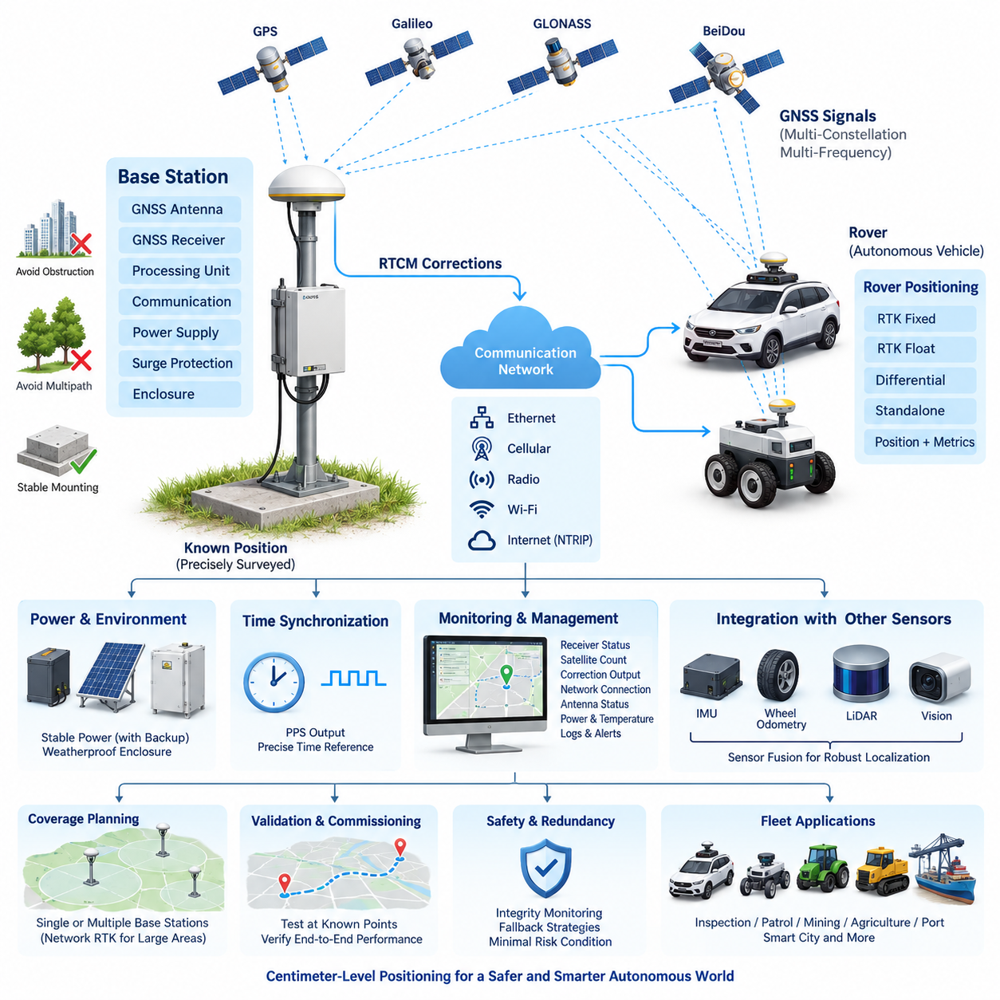
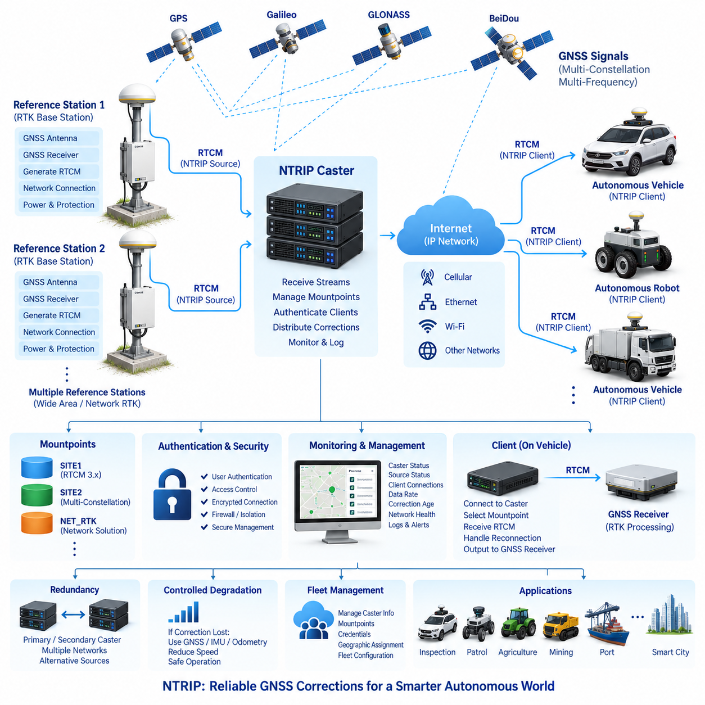
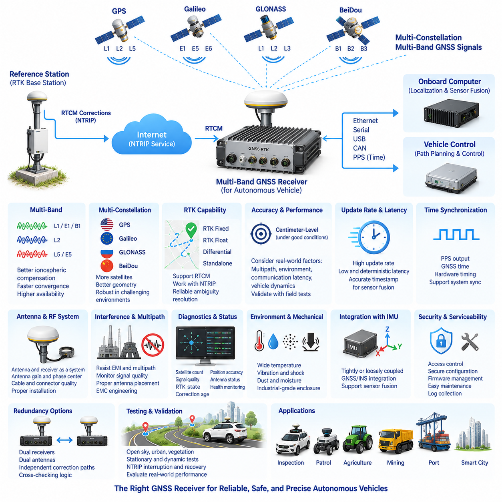
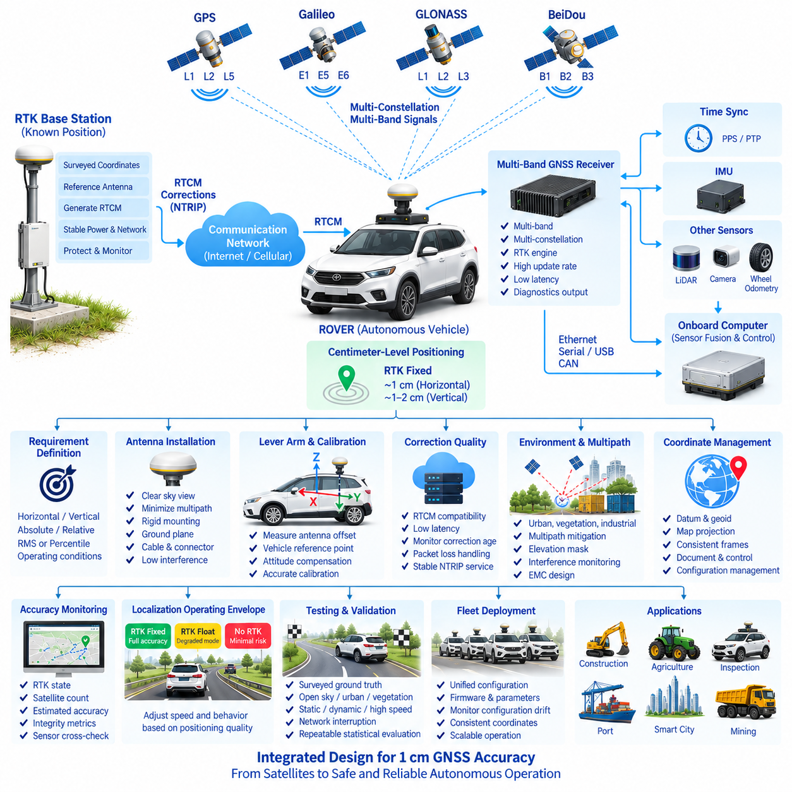
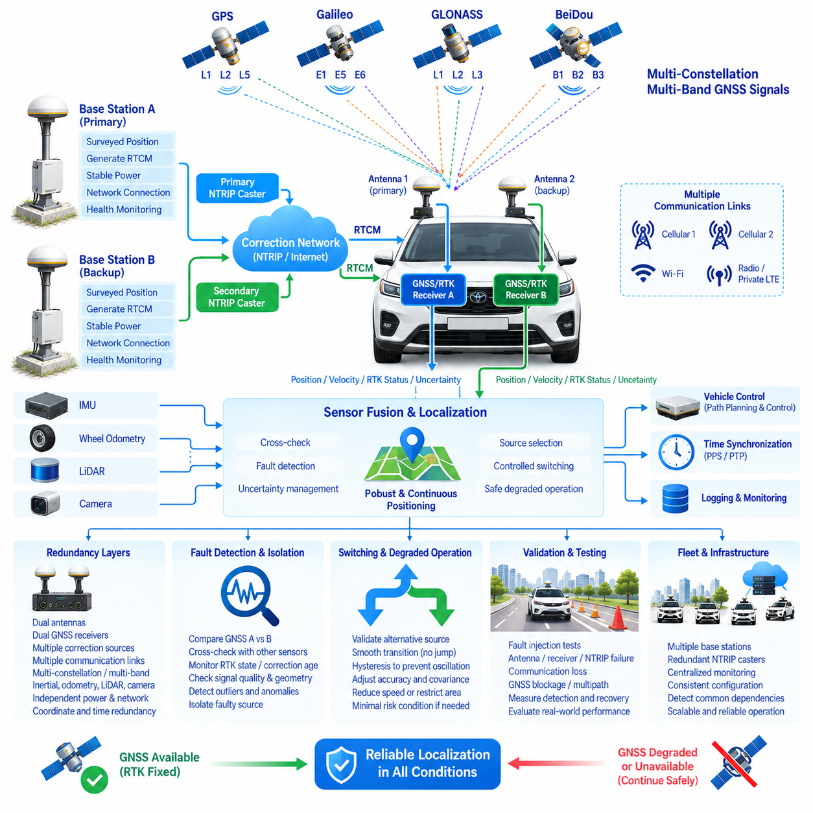

**Volume 17 Outdoor Autonomous Vehicle**


# Chapter 01. GNSS RTK

##  

## 01.01. RTK Base Station Design

{width="7.268055555555556in" height="7.268055555555556in"}

Real-Time Kinematic positioning extends conventional Global Navigation Satellite System positioning by using carrier-phase measurements and correction information from a precisely surveyed reference receiver. In an outdoor autonomous vehicle architecture, the RTK base station becomes part of the localization infrastructure rather than merely an accessory to the onboard GNSS receiver. The reference station continuously observes satellite signals from a known coordinate and generates corrections that allow mobile receivers to suppress common positioning errors.

The fundamental design begins with selection of the base-station location. The GNSS antenna should have the widest practical view of the sky and should be separated from buildings, metallic structures, trees, antennas, power equipment, and other objects capable of blocking signals or producing multipath reflections. A mechanically stable installation point is equally important because physical movement of the reference antenna directly appears as a systematic displacement in every rover position derived from that station.

A base station normally consists of a multi-band GNSS antenna, precision GNSS receiver, processing and communication interface, power subsystem, environmental enclosure, surge protection, and network connection. The receiver should support the satellite constellations and frequency bands required by the vehicle fleet. Multi-constellation reception using GPS, Galileo, GLONASS, BeiDou, or compatible regional systems increases satellite availability and improves geometry, especially where vehicles operate near buildings, vegetation, industrial equipment, or other partial obstructions.

Accurate knowledge of the reference antenna coordinate is one of the most important requirements. A base station can determine an approximate position by averaging GNSS observations, but centimeter-class infrastructure should preferably use a coordinate obtained through a reliable survey or sufficiently rigorous static positioning procedure. The coordinate must refer to a clearly defined antenna reference point and coordinate frame. An incorrect base coordinate can still produce apparently stable RTK fixes while shifting the entire vehicle trajectory by the same systematic offset.

The antenna installation must therefore be treated as precision measurement infrastructure. The mounting pole, mast, roof fixture, or ground monument should resist vibration, wind loading, thermal movement, and accidental displacement. Antenna height must be measured and documented consistently. Ground-plane characteristics, antenna phase-center behavior, cable length, connector quality, lightning protection, and water ingress protection should also be considered because localization performance depends on the complete RF path rather than the receiver specification alone.

The base receiver continuously compares measured satellite observations with observations expected at its known position. From these measurements it produces correction information that can be transmitted to autonomous vehicles using standardized formats such as RTCM. The rover combines its own GNSS measurements with the received reference observations or corrections and resolves carrier-phase ambiguities. Once integer ambiguities are reliably fixed, RTK can provide centimeter-level relative positioning under favorable satellite, communication, and environmental conditions.

Correction delivery should be separated conceptually from correction generation. The base station generates GNSS correction data, while Ethernet, cellular communication, radio, Wi-Fi, or an Internet-based service transports that information to the vehicle. This separation allows one reference station to support multiple robots and makes the positioning infrastructure scalable. The neighboring NTRIP correction-service topic can then address Internet distribution, caster architecture, mountpoints, authentication, and fleet access without overloading the physical base-station design itself.

Communication latency and continuity directly influence practical RTK availability. Correction messages must reach the rover frequently enough that the onboard estimator can use observations representing nearly the same satellite conditions. Network architecture should therefore monitor correction age, packet loss, connection state, throughput, and reconnection behavior. The autonomous vehicle should never interpret the presence of a GNSS coordinate as proof of centimeter accuracy; RTK mode, ambiguity status, correction age, satellite geometry, and receiver integrity information must also be evaluated.

Power architecture is another important design consideration for permanent infrastructure. The base station should remain operational during short disturbances because loss of corrections can simultaneously degrade localization across an entire autonomous fleet. A regulated power supply, appropriate DC conversion, surge protection, grounding, and backup power can therefore be justified even when receiver consumption is relatively small. Remote sites may additionally use battery or solar power, but energy storage must be sized for communication equipment as well as the GNSS receiver.

Environmental engineering becomes critical when the reference station is deployed outdoors for continuous operation. Receiver electronics and communication equipment should be installed in an enclosure appropriate for rain, dust, condensation, temperature variation, insects, and ultraviolet exposure. Thermal design must avoid both overheating and internal condensation. Cable entries require suitable glands and strain relief, while external antenna and communication lines should incorporate appropriate surge and lightning protection according to the installation environment.

Time synchronization should also be considered because GNSS infrastructure can provide more than position corrections. GNSS receivers inherently operate with precise satellite-derived timing, and selected base-station designs can expose pulse-per-second or related timing interfaces. This timing reference can support synchronization of localization servers, communication gateways, sensor systems, logging infrastructure, or distributed monitoring equipment. Position and time should nevertheless be managed as distinct system services with explicit interfaces and health monitoring.

The rover must distinguish between RTK Fixed, RTK Float, differential operation, and ordinary standalone GNSS states. A Fixed solution generally represents successful carrier-phase ambiguity resolution, whereas Float indicates that the ambiguities have not yet been reliably resolved. Autonomous control software should receive not only latitude, longitude, and altitude but also solution state, covariance or accuracy estimates, correction age, satellite count, dilution indicators, and receiver diagnostic information. Localization confidence can then influence planning and vehicle speed.

A robust outdoor vehicle should not depend on RTK alone. GNSS/RTK measurements are normally integrated with an inertial measurement unit, wheel odometry, steering information, LiDAR localization, visual localization, or other motion estimates. During short GNSS interruptions, these sources can maintain continuity while uncertainty grows. When high-quality RTK returns, the fusion estimator can constrain accumulated drift. This makes the base station one component of a broader localization architecture rather than a single point of autonomous-navigation truth.

Coverage planning must account for both radio or network connectivity and the spatial behavior of differential GNSS errors. A reference station should be positioned so that the operational area receives dependable correction delivery and remains within the distance assumptions established for the required accuracy. Large campuses, ports, industrial areas, agricultural regions, or smart-city deployments may eventually require multiple reference stations, commercial correction infrastructure, or network RTK rather than one isolated base.

Base-station monitoring should expose operational health to the fleet-management or infrastructure-management layer. Useful parameters include receiver status, tracked satellite count, constellation availability, correction-message output, communication connection, antenna status, power state, enclosure temperature, storage utilization, and last valid correction timestamp. Alarm thresholds can detect failures before vehicles lose high-accuracy localization, while historical logs make it possible to correlate navigation anomalies with GNSS or infrastructure events.

Commissioning should verify the complete positioning chain rather than testing the receiver in isolation. The surveyed base coordinate, antenna installation, correction generation, communication path, rover reception, RTK convergence, fixed-solution stability, and vehicle localization output should be tested together. Measurements at known checkpoints are particularly valuable because they reveal constant coordinate offsets, height errors, multipath effects, or configuration mistakes that may remain invisible when engineers inspect only the receiver-reported accuracy value.

Operational validation should include difficult conditions such as partial sky blockage, nearby buildings, trees, moving vehicles, network interruptions, base-station restart, rover restart, temporary correction loss, and transitions between Fixed and Float states. The system should demonstrate predictable degradation rather than abrupt or unexplained localization jumps. Recovery time after correction restoration should also be measured because autonomous operation depends not only on peak accuracy but on availability, integrity, continuity, and controlled recovery.

Configuration management is essential once the base station becomes shared fleet infrastructure. Antenna coordinates, antenna model, receiver firmware, RTCM message configuration, constellation selection, elevation masks, communication parameters, coordinate reference system, geoid settings, and installation measurements should be version controlled. Unauthorized modification of the surveyed coordinate is particularly dangerous because every connected rover may remain operational while producing consistently displaced positions.

For safety-related outdoor autonomy, the RTK architecture should therefore expose positioning integrity to higher-level decision logic. When correction age increases, the solution changes from Fixed to Float, estimated uncertainty exceeds an operational threshold, or GNSS observations become inconsistent with inertial and environmental localization, the vehicle can reduce speed, restrict its operating envelope, stop at a safe location, or transition to another localization mode according to system requirements.

The resulting RTK base-station architecture forms the infrastructure foundation for the broader GNSS/RTK chapter identified in the outdoor autonomous vehicle structure. It provides the physical reference from which correction services, multi-band receiver design, centimeter-class localization, and GNSS/RTK redundancy can subsequently be developed as separate engineering layers. This modular organization allows positioning accuracy, communication availability, receiver capability, and redundancy to be engineered independently while remaining part of one integrated outdoor autonomy system.

실시간 이동측위(Real-Time Kinematic, RTK)는 정밀하게 측량된 기준 수신기(Reference Receiver)의 반송파 위상 측정값(Carrier-Phase Measurement)과 보정정보(Correction Information)를 이용하여 기존 위성항법시스템(Global Navigation Satellite System, GNSS)의 측위 성능을 확장한다. 실외 자율주행 차량(Outdoor Autonomous Vehicle) 아키텍처에서 RTK 기준국(Base Station)은 단순한 차량 탑재 GNSS 수신기의 부속장치가 아니라 위치추정 인프라(Localization Infrastructure)의 일부로 기능한다. 기준국은 알려진 좌표에서 위성 신호를 지속적으로 관측하고 이동국(Rover)이 공통 측위 오차를 억제할 수 있도록 보정정보를 생성한다.

기본적인 설계는 기준국 설치 위치(Base-Station Location)의 선정에서 시작된다. GNSS 안테나는 가능한 한 넓은 하늘 시야(Sky View)를 확보해야 하며, 신호를 차단하거나 다중경로(Multipath) 반사를 발생시킬 수 있는 건물, 금속 구조물, 나무, 안테나, 전력설비 및 기타 물체로부터 충분히 이격되어야 한다. 또한 기준 안테나의 물리적 이동은 해당 기준국으로부터 계산되는 모든 이동국 위치에 체계적인 변위(Systematic Displacement)로 직접 반영되므로 기계적으로 안정된 설치 지점을 확보하는 것이 매우 중요하다.

기준국은 일반적으로 다중대역 GNSS 안테나(Multi-Band GNSS Antenna), 정밀 GNSS 수신기(Precision GNSS Receiver), 처리 및 통신 인터페이스(Processing and Communication Interface), 전원 서브시스템(Power Subsystem), 환경 보호 인클로저(Environmental Enclosure), 서지 보호장치(Surge Protection), 네트워크 연결(Network Connection)로 구성된다. 수신기는 차량 플릿(Vehicle Fleet)이 요구하는 위성군(Constellation)과 주파수 대역을 지원해야 한다. GPS, Galileo, GLONASS, BeiDou 또는 호환되는 지역 위성항법시스템을 활용하는 다중 위성군 수신(Multi-Constellation Reception)은 특히 건물이나 식생, 산업설비 등에 의해 부분적으로 신호가 차단되는 환경에서 위성 가용성과 위성 기하구조(Satellite Geometry)를 개선한다.

기준 안테나의 정확한 좌표를 확보하는 것은 가장 중요한 요구사항 가운데 하나이다. 기준국은 GNSS 관측값을 장시간 평균하여 대략적인 위치를 결정할 수 있지만, 센티미터급(Centimeter-Class) 인프라에서는 신뢰성 있는 측량(Survey) 또는 충분히 엄격한 정적 측위(Static Positioning) 절차를 통해 확보한 좌표를 사용하는 것이 바람직하다. 좌표는 명확하게 정의된 안테나 기준점(Antenna Reference Point)과 좌표 프레임(Coordinate Frame)을 기준으로 해야 한다. 기준국 좌표가 잘못된 경우에도 RTK 고정해(RTK Fixed Solution)는 안정적으로 보일 수 있지만 전체 차량 궤적이 동일한 체계적 오프셋(Systematic Offset)을 갖게 된다.

따라서 안테나 설치는 정밀 계측 인프라(Precision Measurement Infrastructure)로 취급해야 한다. 장착 폴, 마스트, 옥상 고정장치 또는 지상 기준점은 진동, 풍하중, 열변형 및 우발적인 위치 이동에 견딜 수 있어야 한다. 안테나 높이(Antenna Height)는 일관된 기준으로 측정하고 문서화해야 한다. 또한 위치추정 성능은 수신기 사양만이 아니라 전체 무선주파수 경로(RF Path)에 의해 결정되므로 접지면(Ground Plane) 특성, 안테나 위상중심(Antenna Phase Center), 케이블 길이, 커넥터 품질, 낙뢰 보호(Lightning Protection), 방수 설계 등을 함께 고려해야 한다.

기준 수신기는 실제로 측정한 위성 관측값과 알려진 기준국 위치에서 예상되는 관측값을 지속적으로 비교한다. 이러한 측정값으로부터 보정정보를 생성하며, 이 정보는 RTCM과 같은 표준화된 형식(Standardized Format)을 이용하여 자율주행 차량에 전달할 수 있다. 이동국은 자체 GNSS 측정값과 기준국에서 수신한 관측값 또는 보정정보를 결합하여 반송파 위상 모호정수(Carrier-Phase Ambiguity)를 해결한다. 정수 모호성(Integer Ambiguity)이 신뢰성 있게 고정되면 양호한 위성, 통신 및 주변 환경 조건에서 센티미터급 상대측위(Relative Positioning)가 가능해진다.

보정정보 전달(Correction Delivery)은 개념적으로 보정정보 생성(Correction Generation)과 분리하여 설계해야 한다. 기준국은 GNSS 보정데이터를 생성하고, 이더넷(Ethernet), 셀룰러 통신(Cellular Communication), 무선통신(Radio), 와이파이(Wi-Fi) 또는 인터넷 기반 서비스가 해당 정보를 차량으로 전송한다. 이러한 분리는 하나의 기준국이 여러 로봇을 지원하도록 하며 위치추정 인프라의 확장성을 높인다. 이후 인접 항목인 NTRIP 보정 서비스(NTRIP Correction Service)에서는 물리적인 기준국 설계와 분리하여 인터넷 기반 배포, 캐스터(Caster) 아키텍처, 마운트포인트(Mountpoint), 인증(Authentication), 플릿 접근(Fleet Access)을 다룰 수 있다.

통신 지연시간(Communication Latency)과 연속성(Continuity)은 실제 RTK 가용성에 직접적인 영향을 준다. 이동국의 추정기가 거의 동일한 위성 상태를 나타내는 관측정보를 사용할 수 있도록 보정 메시지가 충분한 주기로 전달되어야 한다. 따라서 네트워크 아키텍처는 보정정보 경과시간(Correction Age), 패킷 손실(Packet Loss), 연결 상태(Connection State), 처리량(Throughput), 재접속 동작(Reconnection Behavior)을 감시해야 한다. 자율주행 차량은 GNSS 좌표가 존재한다는 사실만으로 센티미터급 정확도가 확보되었다고 판단해서는 안 되며, RTK 모드, 모호정수 상태(Ambiguity Status), 보정정보 경과시간, 위성 기하구조, 수신기 무결성 정보(Receiver Integrity Information)를 함께 평가해야 한다.

전원 아키텍처(Power Architecture) 역시 상시 운용되는 인프라에서 중요한 설계 요소이다. 보정정보가 손실되면 전체 자율주행 플릿의 위치추정 성능이 동시에 저하될 수 있으므로 기준국은 단시간의 전원 장애에도 계속 작동할 수 있어야 한다. 따라서 수신기의 소비전력이 비교적 작더라도 안정화 전원공급장치(Regulated Power Supply), 적절한 직류 변환(DC Conversion), 서지 보호, 접지(Grounding), 백업 전원(Backup Power)을 적용할 필요가 있다. 원격 지역에서는 배터리 또는 태양광 전원을 사용할 수 있지만 에너지 저장용량은 GNSS 수신기뿐 아니라 통신장비의 소비전력까지 포함하여 산정해야 한다.

기준국을 실외에서 연속적으로 운용할 경우 환경 설계(Environmental Engineering)가 중요해진다. 수신기 전자장치와 통신장비는 비, 먼지, 결로, 온도 변화, 곤충, 자외선 등의 환경조건에 적합한 인클로저에 설치해야 한다. 열설계(Thermal Design)는 과열뿐 아니라 내부 결로도 방지할 수 있어야 한다. 케이블 인입부에는 적절한 케이블 글랜드(Cable Gland)와 스트레인 릴리프(Strain Relief)를 적용하고, 외부 안테나와 통신선에는 설치 환경에 적합한 서지 및 낙뢰 보호장치를 적용해야 한다.

시간 동기화(Time Synchronization) 역시 고려해야 한다. GNSS 인프라는 위치 보정정보뿐 아니라 정밀한 시간 기준을 제공할 수 있기 때문이다. GNSS 수신기는 본질적으로 위성으로부터 제공되는 정밀 시간에 따라 동작하며, 일부 기준국 설계에서는 초당 펄스(Pulse Per Second, PPS) 또는 관련 시간 인터페이스를 제공할 수 있다. 이러한 시간 기준은 위치추정 서버, 통신 게이트웨이, 센서 시스템, 데이터 기록 인프라 또는 분산형 모니터링 장비의 동기화에 활용할 수 있다. 다만 위치(Position)와 시간(Time)은 명시적인 인터페이스와 상태 감시 기능을 갖는 서로 독립적인 시스템 서비스로 관리하는 것이 바람직하다.

이동국은 RTK 고정해(RTK Fixed), RTK 부동해(RTK Float), 차분 측위(Differential Operation), 일반 단독 GNSS(Standalone GNSS) 상태를 구분해야 한다. 고정해는 일반적으로 반송파 위상 모호정수가 성공적으로 해결된 상태를 의미하며, 부동해는 모호정수가 아직 신뢰성 있게 결정되지 않은 상태를 의미한다. 자율주행 제어 소프트웨어에는 위도, 경도, 고도뿐 아니라 해 상태(Solution State), 공분산 또는 정확도 추정값, 보정정보 경과시간, 위성 수, 정밀도 저하율(Dilution Indicator), 수신기 진단정보를 함께 전달해야 한다. 이를 통해 위치추정 신뢰도(Localization Confidence)를 경로계획 및 차량 속도 결정에 반영할 수 있다.

견고한 실외 자율주행 차량은 RTK에만 의존해서는 안 된다. GNSS/RTK 측정값은 일반적으로 관성측정장치(Inertial Measurement Unit, IMU), 휠 오도메트리(Wheel Odometry), 조향정보(Steering Information), 라이다 위치추정(LiDAR Localization), 비전 위치추정(Visual Localization) 또는 기타 운동 추정값과 통합된다. 짧은 GNSS 단절 구간에서는 이러한 정보원이 불확실성이 증가하는 동안 위치추정 연속성을 유지하며, 고품질 RTK가 복구되면 융합 추정기(Fusion Estimator)가 누적된 드리프트(Drift)를 다시 제한할 수 있다. 따라서 기준국은 자율주행 위치추정의 유일한 기준이 아니라 광범위한 위치추정 아키텍처의 한 구성요소이다.

커버리지 계획(Coverage Planning)은 무선 또는 네트워크 연결성뿐 아니라 차분 GNSS 오차(Differential GNSS Error)의 공간적 특성까지 고려해야 한다. 기준국은 운용 영역 전체에 신뢰성 있는 보정정보를 제공할 수 있는 위치에 설치되어야 하며 요구 정확도에 대해 설정된 거리 조건을 충족해야 한다. 대규모 캠퍼스, 항만, 산업단지, 농업지역 또는 스마트시티(Smart City)에서는 하나의 독립 기준국보다 여러 기준국, 상용 보정 인프라 또는 네트워크 RTK(Network RTK)가 필요할 수 있다.

기준국 모니터링(Base-Station Monitoring)은 플릿 관리(Fleet Management) 또는 인프라 관리 계층(Infrastructure-Management Layer)에 운용 상태를 제공해야 한다. 주요 감시항목에는 수신기 상태, 추적 위성 수, 위성군 가용성, 보정 메시지 출력, 통신 연결 상태, 안테나 상태, 전원 상태, 인클로저 온도, 저장장치 사용량, 마지막 정상 보정정보의 타임스탬프(Timestamp)가 포함된다. 경보 임계값(Alarm Threshold)을 통해 차량이 고정밀 위치추정을 상실하기 전에 장애를 탐지할 수 있으며, 이력 로그(Historical Log)를 이용하여 주행 이상과 GNSS 또는 인프라 장애 사이의 상관관계를 분석할 수 있다.

시운전 및 초기 검증(Commissioning)은 수신기를 독립적으로 시험하는 것이 아니라 전체 측위 체인(Positioning Chain)을 검증해야 한다. 측량된 기준국 좌표, 안테나 설치, 보정정보 생성, 통신 경로, 이동국 수신, RTK 수렴(RTK Convergence), 고정해 안정성, 차량 위치추정 출력을 통합하여 시험해야 한다. 특히 좌표가 알려진 기준점(Known Checkpoint)에서 측정하면 수신기가 보고하는 정확도 값만 확인해서는 발견하기 어려운 일정한 좌표 오프셋, 높이 오차, 다중경로 영향 및 설정 오류를 식별할 수 있다.

운용 검증(Operational Validation)에는 부분적인 하늘 차폐, 주변 건물, 나무, 이동 차량, 네트워크 단절, 기준국 재시작, 이동국 재시작, 일시적인 보정정보 손실, 고정해와 부동해 사이의 전환과 같은 어려운 조건을 포함해야 한다. 시스템은 갑작스럽고 설명하기 어려운 위치 점프 대신 예측 가능한 성능 저하(Predictable Degradation)를 보여야 한다. 또한 자율주행 운용은 최고 정확도뿐 아니라 가용성(Availability), 무결성(Integrity), 연속성(Continuity), 제어된 복구(Controlled Recovery)에 의존하므로 보정정보 복구 후 정상 상태로 돌아오는 시간도 측정해야 한다.

기준국이 플릿 공용 인프라로 사용되기 시작하면 구성관리(Configuration Management)가 필수적이다. 안테나 좌표, 안테나 모델, 수신기 펌웨어, RTCM 메시지 설정, 위성군 선택, 고도각 마스크(Elevation Mask), 통신 파라미터, 좌표 기준계(Coordinate Reference System), 지오이드(Geoid) 설정 및 설치 측정값을 버전 관리(Version Control)해야 한다. 특히 측량된 기준국 좌표를 승인 없이 변경하는 것은 위험하다. 연결된 모든 이동국이 정상적으로 작동하는 것처럼 보이면서도 일관되게 잘못된 위치를 생성할 수 있기 때문이다.

안전 관련 실외 자율주행(Safety-Related Outdoor Autonomy)을 위해 RTK 아키텍처는 상위 의사결정 로직에 측위 무결성(Positioning Integrity)을 제공해야 한다. 보정정보 경과시간이 증가하거나, 해 상태가 고정해에서 부동해로 변경되거나, 추정 불확실성이 운용 임계값을 초과하거나, GNSS 관측값이 관성 및 환경 기반 위치추정 결과와 불일치하는 경우 차량은 시스템 요구사항에 따라 속도를 낮추거나 운용 영역을 제한하고, 안전한 위치에 정지하거나 다른 위치추정 모드(Localization Mode)로 전환할 수 있다.

이와 같은 RTK 기준국 아키텍처는 실외 자율주행 차량(Outdoor Autonomous Vehicle)의 GNSS/RTK 장을 구성하는 기반 인프라가 된다. 이를 토대로 이후 보정 서비스(Correction Service), 다중대역 수신기 설계(Multi-Band Receiver Design), 센티미터급 위치추정(Centimeter-Class Localization), GNSS/RTK 이중화(Redundancy)를 각각 독립적인 엔지니어링 계층으로 발전시킬 수 있다. 이러한 모듈형 구성은 위치 정확도, 통신 가용성, 수신기 성능 및 이중화를 독립적으로 설계하면서도 하나의 통합된 실외 자율주행 시스템(Integrated Outdoor Autonomy System)으로 결합할 수 있도록 한다.

##  

## 01.02. NTRIP Correction Service

{width="7.268055555555556in" height="7.268055555555556in"}

Networked Transport of RTCM via Internet Protocol, commonly known as NTRIP, provides a standardized mechanism for distributing GNSS correction data from reference infrastructure to mobile receivers through IP networks. Within an outdoor autonomous vehicle system, NTRIP separates correction generation from correction delivery, allowing RTK base stations to serve vehicles through cellular, Ethernet, Wi-Fi, or other Internet-connected networks instead of requiring a dedicated point-to-point radio link.

The basic NTRIP architecture consists of an NTRIP Source or Server, an NTRIP Caster, and one or more NTRIP Clients. The reference station generates GNSS observations or correction messages, normally using RTCM-compatible formats, and forwards them toward the caster. The caster acts as a distribution hub, while the client running on the autonomous vehicle establishes a network session, selects the required correction stream, and delivers the received data to the onboard GNSS RTK receiver.

The NTRIP Caster is therefore a central logical component of the correction service. It accepts correction streams from one or multiple reference stations and exposes them through individually identifiable mountpoints. A mountpoint represents a particular correction stream and may correspond to a specific base station, geographic area, RTCM configuration, or correction service. This organization enables a single caster infrastructure to support multiple sites, receiver configurations, and autonomous vehicle fleets.

Correction messages transported through NTRIP commonly contain information required by RTK processing, including reference-station information and satellite observations. The precise RTCM message configuration should match the capabilities of the base receiver and rover receivers, including supported GNSS constellations and signal bands. GPS, Galileo, GLONASS, and BeiDou observations may be incorporated where supported, enabling multi-constellation and multi-frequency RTK operation for improved satellite availability and positioning robustness.

An NTRIP Client must manage more than simple data reception. It establishes a connection with the caster, requests the appropriate mountpoint, performs any required authentication, receives the correction stream, and forwards correction data to the GNSS receiver with minimal unnecessary delay. In autonomous vehicles, the client may run directly inside the GNSS receiver, on a Jetson platform, edge computer, communication gateway, or dedicated positioning controller depending on the system architecture.

Network latency is a critical design parameter because RTK corrections represent time-dependent GNSS observations. Excessive transport delay reduces the usefulness of the correction stream and can degrade ambiguity resolution or positioning quality. The system should therefore measure correction age rather than assuming that an active network connection guarantees valid corrections. End-to-end timing includes base-station processing, caster transport, communication-network delay, client processing, and delivery into the rover GNSS receiver.

Communication reliability must be engineered for realistic outdoor operating environments. Cellular networks may experience handovers, temporary coverage loss, congestion, variable latency, or IP-session interruption as the vehicle moves. Wi-Fi may provide excellent local performance but limited geographic coverage, while wired Ethernet is normally restricted to stationary infrastructure. NTRIP client software should consequently support timeout detection, automatic reconnection, session recovery, and restoration of the selected mountpoint after communication interruptions.

Correction availability and positioning state must be monitored independently. A vehicle may remain connected to the caster while receiving stale, incomplete, or unsuitable RTCM data, and it may receive valid corrections without immediately achieving RTK Fixed status. The localization system should therefore observe network state, RTCM reception, correction age, GNSS solution type, ambiguity status, satellite count, estimated accuracy, and relevant receiver diagnostics as separate indicators of positioning health.

Authentication provides controlled access to correction infrastructure when the service is shared across multiple robots, customers, or operational sites. NTRIP deployments may use credentials or other access-control mechanisms to restrict mountpoint usage. Fleet-scale systems should manage these credentials systematically rather than embedding unmanaged account information in individual robots. Credential provisioning, replacement, expiration, and revocation should become part of the overall vehicle and infrastructure configuration-management process.

Security design should recognize that NTRIP data directly influences localization performance. The correction service should therefore be deployed using appropriate network protection, authenticated access, infrastructure isolation, firewall policies, and secure operational management. Where supported by the selected implementation, protected communication channels can reduce exposure of credentials and correction sessions. Security mechanisms must nevertheless be evaluated together with latency, compatibility, computational load, and field maintainability.

A fleet architecture benefits from treating NTRIP as a shared positioning service rather than configuring every autonomous vehicle independently. Fleet management can maintain approved caster addresses, mountpoints, authentication parameters, geographic assignments, and service priorities. Vehicles can then receive configuration according to their operating area or mission. This approach simplifies deployment when inspection, patrol, logistics, agricultural, mining, port, or smart-city vehicles share common GNSS infrastructure.

Large operational regions may require more than one RTK reference station. Multiple stations can be exposed through different NTRIP mountpoints, allowing vehicles to use correction data appropriate to their current area. More advanced deployments may employ network RTK services that combine observations from multiple reference stations. In either case, the vehicle architecture should define how the appropriate correction source is selected and how transitions between correction services are handled without creating unsafe localization discontinuities.

Geographic information from the rover can also participate in correction-service selection when supported by the NTRIP infrastructure. The vehicle may provide an approximate GNSS position to help the service identify an appropriate reference or network solution. Such mechanisms are especially useful for vehicles traveling across large areas where a single fixed mountpoint is insufficient. The approximate position used for service selection must remain conceptually separate from the high-accuracy RTK solution ultimately produced by the rover.

The communication gateway between the NTRIP Client and GNSS receiver should be explicitly engineered. Depending on the receiver, RTCM corrections may be transferred through Ethernet, serial interfaces, USB, CAN-related gateways, or vendor-specific interfaces. Buffering should be minimized and monitored because excessive queues can increase correction age even when the external Internet connection appears healthy. Interface bandwidth must also accommodate the selected constellation, frequency, and RTCM message configuration.

Service monitoring should extend from the base station to the rover. Infrastructure monitoring can record whether each source is connected, whether RTCM messages are being generated, caster session status, connected client count, network throughput, correction-stream age, and service availability. Vehicle-side monitoring can record connection attempts, authentication results, selected mountpoint, received data rate, correction age, RTK state, and reconnection events. Combining both perspectives greatly simplifies diagnosis of positioning failures.

Logging is particularly important because intermittent RTK problems are often difficult to reproduce. Timestamped records of caster connections, RTCM reception, GNSS solution transitions, network state, vehicle position, and localization confidence allow engineers to determine whether a navigation anomaly originated from satellite visibility, the reference station, the caster, the communication network, the client, or the rover receiver. Consistent time synchronization makes correlation between these distributed logs significantly more reliable.

Redundancy can be introduced at several layers of the NTRIP correction architecture. A vehicle may be configured with primary and secondary caster endpoints, alternative communication networks, multiple mountpoints, or an independent correction provider. Infrastructure may similarly use redundant network connections or replicated caster services. Redundancy should not simply duplicate components; the system must define failure detection, switchover conditions, source validation, recovery behavior, and prevention of rapid oscillation between correction sources.

Loss of NTRIP corrections should cause controlled localization degradation rather than immediate uncontrolled behavior. The rover may temporarily continue using GNSS, IMU, wheel odometry, LiDAR, vision, or other localization sources while RTK quality decreases. Higher-level autonomy software should receive the resulting localization confidence and apply operational rules such as reduced speed, restricted maneuvering, mission suspension, or transition to a minimal risk condition when positioning uncertainty exceeds defined limits.

Commissioning should verify the entire NTRIP path under realistic operating conditions. Testing should include caster connection, authentication, mountpoint selection, RTCM reception, RTK convergence, correction-age behavior, network interruption, automatic reconnection, base-station restart, caster restart, communication handover, and restoration of RTK Fixed operation. Known survey checkpoints can then confirm that successful data transport actually produces the expected centimeter-class positioning performance at the vehicle level.

The resulting NTRIP correction service forms the communication layer between the RTK base-station infrastructure and the multi-band GNSS receivers installed on outdoor autonomous vehicles. Within the GNSS/RTK architecture, it complements the physical base-station design while providing scalable correction distribution for centimeter-class positioning. This separation establishes a foundation for subsequent receiver selection, 1 cm accuracy engineering, and GNSS/RTK redundancy while allowing correction infrastructure to evolve independently of individual vehicle platforms.

인터넷 프로토콜을 통한 RTCM 네트워크 전송(Networked Transport of RTCM via Internet Protocol), 즉 NTRIP은 기준국 인프라(Reference Infrastructure)에서 이동형 수신기(Mobile Receiver)로 GNSS 보정데이터(GNSS Correction Data)를 IP 네트워크를 통해 배포하기 위한 표준화된 메커니즘(Standardized Mechanism)을 제공한다. 실외 자율주행 차량(Outdoor Autonomous Vehicle) 시스템에서 NTRIP은 보정정보 생성(Correction Generation)과 보정정보 전달(Correction Delivery)을 분리하여, RTK 기준국(Base Station)이 전용 일대일 무선 링크 없이 셀룰러(Cellular), 이더넷(Ethernet), 와이파이(Wi-Fi) 또는 기타 인터넷 연결 네트워크를 통해 차량에 서비스를 제공할 수 있도록 한다.

기본적인 NTRIP 아키텍처는 NTRIP 소스 또는 서버(NTRIP Source or Server), NTRIP 캐스터(NTRIP Caster), 하나 이상의 NTRIP 클라이언트(NTRIP Client)로 구성된다. 기준국은 일반적으로 RTCM 호환 형식(RTCM-Compatible Format)을 이용하여 GNSS 관측정보 또는 보정 메시지를 생성하고 이를 캐스터로 전달한다. 캐스터는 배포 허브(Distribution Hub) 역할을 수행하며, 자율주행 차량에서 실행되는 클라이언트는 네트워크 세션을 설정하고 필요한 보정 스트림(Correction Stream)을 선택한 후 수신된 데이터를 차량 탑재 GNSS RTK 수신기로 전달한다.

따라서 NTRIP 캐스터(NTRIP Caster)는 보정 서비스(Correction Service)의 핵심 논리 구성요소이다. 캐스터는 하나 또는 여러 기준국으로부터 보정 스트림을 수신하고 이를 개별적으로 식별할 수 있는 마운트포인트(Mountpoint)를 통해 제공한다. 하나의 마운트포인트는 특정 기준국, 지리적 영역, RTCM 설정 또는 보정 서비스에 대응할 수 있다. 이러한 구조를 통해 하나의 캐스터 인프라가 여러 운용지역, 수신기 구성 및 자율주행 차량 플릿(Autonomous Vehicle Fleet)을 지원할 수 있다.

NTRIP을 통해 전송되는 보정 메시지(Correction Message)에는 일반적으로 기준국 정보와 위성 관측정보를 포함하여 RTK 처리에 필요한 데이터가 포함된다. 구체적인 RTCM 메시지 구성(RTCM Message Configuration)은 지원되는 GNSS 위성군과 신호 대역을 포함하여 기준 수신기와 이동국 수신기의 기능에 맞추어야 한다. 지원되는 경우 GPS, Galileo, GLONASS, BeiDou 관측정보를 통합하여 다중 위성군(Multi-Constellation) 및 다중주파수(Multi-Frequency) RTK 운용을 구현하고 위성 가용성과 측위 견고성(Positioning Robustness)을 향상시킬 수 있다.

NTRIP 클라이언트(NTRIP Client)는 단순한 데이터 수신 이상의 기능을 관리해야 한다. 클라이언트는 캐스터와 연결을 설정하고 적절한 마운트포인트를 요청하며 필요한 인증(Authentication)을 수행하고, 보정 스트림을 수신하여 불필요한 지연을 최소화하면서 GNSS 수신기로 전달한다. 자율주행 차량에서는 시스템 아키텍처에 따라 클라이언트가 GNSS 수신기 내부, 젯슨 플랫폼(Jetson Platform), 엣지 컴퓨터(Edge Computer), 통신 게이트웨이(Communication Gateway) 또는 전용 측위 제어기(Positioning Controller)에서 실행될 수 있다.

네트워크 지연시간(Network Latency)은 RTK 보정정보가 시간에 종속된 GNSS 관측정보를 나타내기 때문에 중요한 설계 파라미터이다. 과도한 전송 지연은 보정 스트림의 유효성을 감소시키며 모호정수 결정(Ambiguity Resolution) 또는 측위 품질을 저하시킬 수 있다. 따라서 시스템은 활성 네트워크 연결이 유효한 보정정보를 보장한다고 가정하지 말고 보정정보 경과시간(Correction Age)을 측정해야 한다. 종단간 시간(End-to-End Timing)에는 기준국 처리, 캐스터 전송, 통신 네트워크 지연, 클라이언트 처리 및 이동국 GNSS 수신기로의 데이터 전달이 모두 포함된다.

통신 신뢰성(Communication Reliability)은 실제 실외 운용환경을 고려하여 설계해야 한다. 차량이 이동하는 동안 셀룰러 네트워크에서는 핸드오버(Handover), 일시적인 통신영역 손실, 네트워크 혼잡, 가변적인 지연시간 또는 IP 세션 중단이 발생할 수 있다. 와이파이는 지역적으로 우수한 성능을 제공할 수 있지만 지리적 커버리지가 제한되며, 유선 이더넷은 일반적으로 고정형 인프라에 한정된다. 따라서 NTRIP 클라이언트 소프트웨어는 타임아웃 감지(Timeout Detection), 자동 재접속(Automatic Reconnection), 세션 복구(Session Recovery), 통신 중단 이후 선택된 마운트포인트의 복원 기능을 지원해야 한다.

보정정보 가용성(Correction Availability)과 측위 상태(Positioning State)는 서로 독립적으로 감시해야 한다. 차량이 캐스터에 연결된 상태에서도 오래되었거나 불완전하거나 적합하지 않은 RTCM 데이터를 수신할 수 있으며, 유효한 보정정보를 수신하더라도 즉시 RTK 고정해(RTK Fixed)를 획득하지 못할 수 있다. 따라서 위치추정 시스템은 네트워크 상태, RTCM 수신, 보정정보 경과시간, GNSS 해 유형(Solution Type), 모호정수 상태(Ambiguity Status), 위성 수, 추정 정확도 및 관련 수신기 진단정보를 측위 건전성(Positioning Health)의 독립적인 지표로 감시해야 한다.

인증(Authentication)은 여러 로봇, 고객 또는 운용지역이 보정 인프라를 공유할 때 제어된 접근(Controlled Access)을 제공한다. NTRIP 구축에서는 자격증명(Credential) 또는 기타 접근제어 메커니즘을 이용하여 마운트포인트 사용을 제한할 수 있다. 플릿 규모 시스템(Fleet-Scale System)은 개별 로봇에 관리되지 않는 계정정보를 직접 저장하는 대신 이러한 자격증명을 체계적으로 관리해야 한다. 자격증명 발급(Provisioning), 교체, 만료 및 폐기는 전체 차량 및 인프라 구성관리(Configuration Management) 프로세스의 일부로 관리되어야 한다.

보안 설계(Security Design)에서는 NTRIP 데이터가 위치추정 성능에 직접적인 영향을 미친다는 점을 고려해야 한다. 따라서 보정 서비스는 적절한 네트워크 보호(Network Protection), 인증된 접근(Authenticated Access), 인프라 격리(Infrastructure Isolation), 방화벽 정책(Firewall Policy), 안전한 운용관리(Secure Operational Management)를 적용하여 구축해야 한다. 선택한 구현에서 지원하는 경우 보호된 통신 채널(Protected Communication Channel)을 이용하여 자격증명과 보정 세션의 노출을 줄일 수 있다. 다만 보안 메커니즘은 지연시간, 호환성, 연산부하 및 현장 유지보수성(Field Maintainability)과 함께 평가해야 한다.

플릿 아키텍처(Fleet Architecture)에서는 각 자율주행 차량을 독립적으로 설정하는 대신 NTRIP을 공유 측위 서비스(Shared Positioning Service)로 관리하는 것이 유리하다. 플릿 관리 시스템(Fleet Management System)은 승인된 캐스터 주소, 마운트포인트, 인증 파라미터, 지리적 할당(Geographic Assignment), 서비스 우선순위를 관리할 수 있다. 차량은 운용지역 또는 임무에 따라 적절한 설정을 제공받을 수 있으며, 이를 통해 점검(Inspection), 순찰(Patrol), 물류(Logistics), 농업(Agriculture), 광산(Mining), 항만(Port), 스마트시티(Smart City) 차량이 공통 GNSS 인프라를 공유하는 환경의 배포를 단순화할 수 있다.

넓은 운용지역에서는 하나 이상의 RTK 기준국이 필요할 수 있다. 여러 기준국을 서로 다른 NTRIP 마운트포인트를 통해 제공함으로써 차량이 현재 운용지역에 적합한 보정데이터를 사용할 수 있다. 보다 발전된 구축에서는 여러 기준국의 관측정보를 결합하는 네트워크 RTK(Network RTK) 서비스를 사용할 수 있다. 어느 방식을 사용하더라도 차량 아키텍처에서는 적절한 보정정보 소스를 선택하는 방법과 보정 서비스 간 전환 과정에서 안전하지 않은 위치추정 불연속(Localization Discontinuity)이 발생하지 않도록 처리하는 방법을 정의해야 한다.

NTRIP 인프라가 지원하는 경우 이동국의 지리정보(Geographic Information)를 보정 서비스 선택에 활용할 수도 있다. 차량은 대략적인 GNSS 위치를 제공하여 서비스가 적절한 기준국 또는 네트워크 솔루션을 선택하도록 지원할 수 있다. 이러한 방식은 하나의 고정 마운트포인트만으로 충분하지 않은 넓은 지역을 이동하는 차량에서 특히 유용하다. 서비스 선택에 사용되는 대략적인 위치는 최종적으로 이동국에서 생성되는 고정밀 RTK 해(High-Accuracy RTK Solution)와 개념적으로 분리하여 관리해야 한다.

NTRIP 클라이언트와 GNSS 수신기 사이의 통신 게이트웨이(Communication Gateway)는 명시적으로 설계해야 한다. 수신기에 따라 RTCM 보정정보는 이더넷, 직렬 인터페이스(Serial Interface), USB, CAN 관련 게이트웨이 또는 제조사 전용 인터페이스(Vendor-Specific Interface)를 통해 전달될 수 있다. 외부 인터넷 연결이 정상적으로 보이더라도 과도한 데이터 큐(Data Queue)는 보정정보 경과시간을 증가시킬 수 있으므로 버퍼링(Buffering)을 최소화하고 감시해야 한다. 또한 인터페이스 대역폭은 선택된 위성군, 주파수 및 RTCM 메시지 구성을 충분히 처리할 수 있어야 한다.

서비스 모니터링(Service Monitoring)은 기준국에서 이동국까지 전체 구간을 포함해야 한다. 인프라 측에서는 각 소스의 연결 여부, RTCM 메시지 생성 여부, 캐스터 세션 상태, 연결된 클라이언트 수, 네트워크 처리량, 보정 스트림 경과시간 및 서비스 가용성을 기록할 수 있다. 차량 측에서는 연결 시도, 인증 결과, 선택된 마운트포인트, 수신 데이터율, 보정정보 경과시간, RTK 상태 및 재접속 이벤트를 기록할 수 있다. 두 관점을 통합하면 측위 장애의 원인을 훨씬 효율적으로 진단할 수 있다.

로깅(Logging)은 간헐적으로 발생하는 RTK 문제를 재현하기 어려운 경우가 많기 때문에 특히 중요하다. 캐스터 연결, RTCM 수신, GNSS 해 상태 전환, 네트워크 상태, 차량 위치 및 위치추정 신뢰도(Localization Confidence)에 대한 타임스탬프 기반 기록을 이용하면 주행 이상이 위성 가시성, 기준국, 캐스터, 통신 네트워크, 클라이언트 또는 이동국 수신기 중 어디에서 발생했는지 분석할 수 있다. 일관된 시간 동기화(Time Synchronization)를 적용하면 이러한 분산 로그 사이의 상관관계를 훨씬 신뢰성 있게 분석할 수 있다.

이중화(Redundancy)는 NTRIP 보정 아키텍처의 여러 계층에 적용할 수 있다. 차량에는 주 캐스터 및 보조 캐스터 엔드포인트(Primary and Secondary Caster Endpoint), 대체 통신 네트워크, 복수 마운트포인트 또는 독립적인 보정 서비스 공급자를 설정할 수 있다. 인프라에서도 이중화된 네트워크 연결 또는 복제된 캐스터 서비스(Replicated Caster Service)를 사용할 수 있다. 이중화는 단순히 구성요소를 복제하는 것으로 끝나서는 안 되며, 장애 감지, 전환 조건(Switchover Condition), 소스 검증, 복구 동작 및 보정정보 소스 사이의 빈번한 반복 전환을 방지하는 방법을 정의해야 한다.

NTRIP 보정정보의 손실은 즉각적이고 제어되지 않은 차량 동작이 아니라 제어된 위치추정 성능 저하(Controlled Localization Degradation)로 이어져야 한다. 이동국은 RTK 품질이 저하되는 동안 GNSS, 관성측정장치(Inertial Measurement Unit, IMU), 휠 오도메트리(Wheel Odometry), 라이다(LiDAR), 비전(Vision) 또는 기타 위치추정 정보원을 일시적으로 계속 사용할 수 있다. 상위 자율주행 소프트웨어는 변화된 위치추정 신뢰도를 전달받아 불확실성이 정의된 한계를 초과할 경우 감속, 기동 제한, 임무 중지 또는 최소위험상태(Minimal Risk Condition)로의 전환과 같은 운용 규칙을 적용해야 한다.

시운전 및 초기 검증(Commissioning)은 실제 운용조건에서 전체 NTRIP 경로를 검증해야 한다. 시험에는 캐스터 연결, 인증, 마운트포인트 선택, RTCM 수신, RTK 수렴(RTK Convergence), 보정정보 경과시간 특성, 네트워크 단절, 자동 재접속, 기준국 재시작, 캐스터 재시작, 통신 핸드오버 및 RTK 고정해 운용 복원이 포함되어야 한다. 이후 좌표가 알려진 측량 기준점(Known Survey Checkpoint)을 이용하여 성공적인 데이터 전송이 실제 차량 수준에서 요구되는 센티미터급 측위 성능으로 이어지는지 확인할 수 있다.

이와 같은 NTRIP 보정 서비스(NTRIP Correction Service)는 RTK 기준국 인프라와 실외 자율주행 차량에 탑재된 다중대역 GNSS 수신기(Multi-Band GNSS Receiver)를 연결하는 통신 계층(Communication Layer)을 구성한다. GNSS/RTK 아키텍처에서 NTRIP은 물리적인 기준국 설계를 보완하면서 센티미터급 측위를 위한 확장 가능한 보정정보 배포 기능을 제공한다. 이러한 계층 분리는 이후 다중대역 수신기 선정(Multi-Band Receiver Selection), 1cm 정확도 설계(1 cm Accuracy Engineering), GNSS/RTK 이중화 설계(Redundancy Design)를 위한 기반을 제공하면서 개별 차량 플랫폼과 독립적으로 보정 인프라를 발전시킬 수 있도록 한다.

##  

## 01.03. Multi Band Receiver Selection

{width="7.268055555555556in" height="7.268055555555556in"}

Multi-band GNSS receiver selection for an outdoor autonomous vehicle must begin with the positioning performance required by the complete localization architecture rather than with receiver specifications alone. The receiver operates between the GNSS antenna, RTK correction service, onboard localization computer, and sensor-fusion system, so its constellation support, frequency coverage, RTK capability, update rate, interfaces, timing, diagnostics, environmental tolerance, and integration characteristics must be evaluated together.

A multi-band receiver simultaneously processes signals transmitted on multiple GNSS frequency bands. Compared with a single-frequency design, this provides additional measurements that can improve ionospheric error compensation, ambiguity resolution, convergence behavior, and positioning availability. For outdoor autonomous vehicles expected to achieve reliable centimeter-class RTK positioning, dual-band or multi-band reception should therefore be considered a fundamental system capability rather than an optional performance enhancement.

Multi-constellation support is equally important. A receiver capable of tracking GPS, Galileo, GLONASS, and BeiDou can observe substantially more satellites than a receiver restricted to a single constellation. The resulting improvement in satellite geometry becomes especially valuable in ports, industrial complexes, campuses, agricultural areas, and urban environments where buildings, machinery, vegetation, or infrastructure may partially obstruct the sky and temporarily remove individual satellites from usable visibility.

Frequency-band selection should be evaluated together with constellation support because different GNSS systems transmit navigation signals across different frequency structures. Modern receivers may support combinations of L1/E1/B1, L2, L5/E5, and related signals depending on their architecture. The objective is not simply to maximize the number of listed bands, but to obtain a combination that improves measurement diversity, carrier-phase processing, interference resilience, and RTK performance within the intended operating environment.

RTK capability is a primary selection criterion because a receiver intended for centimeter-level autonomous localization must process carrier-phase measurements and correction information reliably. The receiver should support the RTCM messages generated by the selected base station or correction provider and should interoperate correctly with the NTRIP correction architecture. Compatibility must be verified at the actual message, constellation, signal, and firmware level rather than inferred only from a general statement that both devices support RTK.

The receiver must provide clearly distinguishable positioning states such as RTK Fixed, RTK Float, differential positioning, and standalone GNSS. Autonomous software should never treat every valid latitude and longitude output as equivalent. A Fixed solution indicates successful ambiguity resolution under the receiver\'s processing logic, while Float represents greater uncertainty. The receiver should expose sufficient status information for the localization system to determine whether a reported position is appropriate for autonomous control.

Accuracy specifications require careful interpretation. A manufacturer may provide horizontal and vertical accuracy values under favorable conditions, but these values do not guarantee equivalent performance in every deployment. Satellite visibility, multipath, antenna quality, correction distance, atmospheric conditions, communication latency, vehicle dynamics, and installation geometry all influence actual performance. Receiver selection should therefore combine datasheet evaluation with vehicle-level testing at surveyed reference points and representative operating sites.

Update rate influences how effectively GNSS information can support a moving autonomous platform. A low-rate position stream may be sufficient for slow monitoring applications but may be inadequate for higher-speed navigation or tightly coupled sensor fusion. The required rate should be derived from vehicle dynamics, control frequency, localization architecture, and expected speed. Higher output frequency is useful only when measurements remain accurately timestamped and can be consumed reliably by the onboard processing system.

Latency should be evaluated independently from update rate. A receiver can produce frequent outputs while still introducing processing delay between signal observation and delivery of the navigation solution. For sensor fusion, the measurement timestamp must represent when the observation occurred rather than merely when the message arrived at the computer. Deterministic timing and documented latency characteristics become increasingly important when GNSS is fused with high-rate IMU, wheel odometry, LiDAR, camera, and steering information.

Precise time interfaces can provide additional value beyond positioning. Receivers supporting pulse-per-second output, GNSS-derived time, or hardware timing signals can contribute to synchronization of distributed vehicle systems. This capability is particularly useful when perception sensors and localization processors must operate within a common time framework. PPS availability, electrical interface characteristics, timestamp behavior, and synchronization accuracy should therefore be considered when the GNSS receiver participates in the vehicle time architecture.

Communication interfaces must match the electrical and computing architecture of the autonomous vehicle. Depending on the receiver, available interfaces may include Ethernet, serial communication, USB, CAN-related integration, or dedicated timing and correction ports. The selected design should provide reliable paths for navigation output, RTCM correction input, configuration, diagnostics, and firmware management. Interface redundancy may also be useful where localization is considered operationally critical.

The GNSS antenna and receiver must be selected as a coordinated RF system. A high-performance multi-band receiver cannot compensate for an antenna that lacks the required frequency coverage or is poorly installed. Antenna gain, polarization, phase-center stability, ground-plane requirements, cable loss, connector quality, filtering, and low-noise amplification can influence receiver performance. Long RF cables and unsuitable connectors may degrade signal quality before satellite measurements reach the receiver processing stage.

Interference and multipath behavior deserve particular attention in autonomous vehicle deployments. Electric motors, inverters, DC/DC converters, high-speed digital computers, communication radios, and other onboard electronics can generate electromagnetic noise, while surrounding structures can reflect GNSS signals. Receiver selection should therefore consider interference detection, signal-quality indicators, filtering capability, and diagnostic visibility in addition to nominal sensitivity. Proper antenna placement and EMC engineering remain necessary regardless of receiver capability.

The receiver should provide comprehensive diagnostic outputs that can be consumed by vehicle software. Useful information includes satellite count, constellation usage, signal quality, RTK state, correction age, estimated horizontal and vertical uncertainty, dilution-of-precision indicators, antenna status, and communication health. These parameters allow the localization architecture to calculate confidence and identify gradual degradation before the position error becomes large enough to affect autonomous navigation.

Integration with an inertial measurement unit is particularly important because GNSS availability can change rapidly in outdoor environments. Some receivers provide integrated GNSS/INS processing, while other architectures perform GNSS and IMU fusion in an external localization computer. The appropriate choice depends on system partitioning, required transparency, computational architecture, sensor quality, and development strategy. In either case, raw or sufficiently detailed measurements can improve future algorithm development and fault analysis.

Mechanical and environmental requirements must reflect the intended vehicle class. Outdoor receivers may experience vibration, shock, dust, moisture, temperature cycling, electrical transients, and continuous operation. Industrial, agricultural, mining, inspection, patrol, and port vehicles may impose substantially harsher conditions than laboratory prototypes. Receiver enclosure rating, connector retention, operating temperature, input-power tolerance, vibration resistance, and mounting strategy should therefore be evaluated as part of the selection process.

Startup and RTK convergence behavior also affect operational availability. Autonomous vehicles may be power-cycled, temporarily lose satellite visibility, or move between open and partially obstructed environments. The receiver should recover predictably after these events and regain a high-quality solution within an acceptable period. Time to first fix, time to RTK Fixed, reacquisition behavior, and recovery following correction interruption should be measured experimentally rather than assessed only from ideal datasheet values.

Configuration management becomes increasingly important when many vehicles share the same GNSS infrastructure. Receiver firmware, enabled constellations, frequency bands, RTCM configuration, update rates, elevation masks, coordinate systems, output messages, communication settings, and antenna parameters should be controlled as versioned vehicle configuration. Two receivers of the same model can produce different operational behavior if their firmware or configuration differs, making configuration traceability essential for fleet maintenance.

Redundancy requirements can influence receiver selection from the beginning. A safety-oriented outdoor vehicle may use dual GNSS receivers, dual antennas, independent correction paths, or GNSS combined with independent LiDAR and inertial localization. If dual receivers are planned, electrical independence, antenna separation, common-mode failure, correction-source independence, timestamp consistency, and cross-checking logic must be considered. Simply installing two identical receivers does not automatically create effective positioning redundancy.

Cybersecurity and serviceability should also be included in the evaluation. Network-connected receivers may expose configuration interfaces, firmware-update mechanisms, remote management functions, or correction-service credentials. Access control and secure configuration practices should be compatible with the broader vehicle cybersecurity architecture. At the same time, field engineers need practical methods to inspect receiver state, collect logs, update approved firmware, restore configuration, and replace hardware without introducing undocumented calibration changes.

Receiver evaluation should ultimately be performed using a structured test program on the target vehicle. Tests should cover open sky, partial obstruction, urban multipath, vegetation, stationary operation, low-speed motion, higher-speed motion, NTRIP interruption, correction recovery, power cycling, electromagnetic interference, and known survey checkpoints. Position error, RTK Fixed availability, convergence time, correction age, output latency, satellite usage, and recovery behavior can then be compared objectively across candidate receivers.

The final multi-band receiver should therefore be selected as part of an integrated GNSS/RTK localization system rather than as an isolated component. Its role connects the RTK base-station design and NTRIP correction service with the subsequent centimeter-level accuracy and redundancy architecture defined in the GNSS/RTK chapter. A properly selected receiver provides the measurement quality, timing, diagnostics, interoperability, and operational robustness required to transform GNSS corrections into dependable positioning for outdoor autonomous vehicles.

실외 자율주행 차량(Outdoor Autonomous Vehicle)을 위한 다중대역 GNSS 수신기(Multi-Band GNSS Receiver) 선정은 수신기 자체의 사양만을 기준으로 시작해서는 안 되며, 전체 위치추정 아키텍처(Localization Architecture)가 요구하는 측위 성능을 기준으로 접근해야 한다. 수신기는 GNSS 안테나, RTK 보정 서비스(RTK Correction Service), 차량 탑재 위치추정 컴퓨터(Onboard Localization Computer), 센서 융합 시스템(Sensor-Fusion System) 사이에서 동작하므로 위성군 지원, 주파수 범위, RTK 기능, 갱신주기, 인터페이스, 시간 특성, 진단 기능, 환경 내구성 및 시스템 통합 특성을 함께 평가해야 한다.

다중대역 수신기(Multi-Band Receiver)는 여러 GNSS 주파수 대역에서 전송되는 신호를 동시에 처리한다. 단일주파수(Single-Frequency) 설계와 비교하면 추가적인 측정정보를 확보할 수 있으므로 전리층 오차(Ionospheric Error) 보상, 모호정수 결정(Ambiguity Resolution), 수렴 특성(Convergence Behavior), 측위 가용성(Positioning Availability)을 향상시킬 수 있다. 신뢰성 있는 센티미터급 RTK 측위가 요구되는 실외 자율주행 차량에서는 이중대역(Dual-Band) 또는 다중대역 수신 기능을 선택적인 성능 향상 기능이 아니라 기본적인 시스템 기능으로 고려해야 한다.

다중 위성군(Multi-Constellation) 지원 역시 중요하다. GPS, Galileo, GLONASS, BeiDou를 추적할 수 있는 수신기는 하나의 위성군에 제한된 수신기보다 훨씬 많은 위성을 관측할 수 있다. 이러한 위성 기하구조(Satellite Geometry)의 개선은 건물, 장비, 식생 또는 기반시설에 의해 하늘 시야가 부분적으로 차단되고 개별 위성을 일시적으로 사용할 수 없게 되는 항만, 산업단지, 캠퍼스, 농업지역 및 도심 환경에서 특히 중요한 장점이 된다.

주파수 대역 선택(Frequency-Band Selection)은 각 GNSS 시스템이 서로 다른 주파수 구조를 통해 항법신호를 전송하므로 위성군 지원과 함께 평가해야 한다. 최신 수신기는 아키텍처에 따라 L1/E1/B1, L2, L5/E5 및 관련 신호의 다양한 조합을 지원할 수 있다. 목표는 단순히 사양표에 표시된 주파수 대역 수를 최대화하는 것이 아니라 실제 운용환경에서 측정 다양성(Measurement Diversity), 반송파 위상 처리(Carrier-Phase Processing), 간섭 내성(Interference Resilience), RTK 성능을 향상시키는 조합을 확보하는 것이다.

RTK 기능(RTK Capability)은 센티미터급 자율 위치추정을 목적으로 하는 수신기가 반송파 위상 측정값과 보정정보를 안정적으로 처리해야 하므로 핵심적인 선정 기준이다. 수신기는 선정된 기준국(Base Station) 또는 보정 서비스 공급자가 생성하는 RTCM 메시지를 지원하고 NTRIP 보정 아키텍처(NTRIP Correction Architecture)와 올바르게 연동되어야 한다. 두 장치가 단순히 RTK를 지원한다는 일반적인 설명만으로 호환성을 판단해서는 안 되며 실제 메시지, 위성군, 신호 및 펌웨어 수준에서 상호운용성(Interoperability)을 검증해야 한다.

수신기는 RTK 고정해(RTK Fixed), RTK 부동해(RTK Float), 차분 측위(Differential Positioning), 단독 GNSS(Standalone GNSS)와 같은 측위 상태를 명확하게 구분하여 제공해야 한다. 자율주행 소프트웨어는 유효한 모든 위도와 경도 출력을 동일한 품질의 위치정보로 취급해서는 안 된다. 고정해(Fixed Solution)는 수신기의 처리 로직에서 모호정수가 성공적으로 결정된 상태를 나타내며, 부동해(Float Solution)는 상대적으로 높은 불확실성을 의미한다. 따라서 위치추정 시스템이 보고된 위치를 자율제어에 사용할 수 있는지 판단할 수 있도록 충분한 상태정보를 제공해야 한다.

정확도 사양(Accuracy Specification)은 주의 깊게 해석해야 한다. 제조사는 양호한 조건에서 수평 및 수직 정확도 값을 제시할 수 있지만 이러한 값이 모든 실제 운용환경에서 동일한 성능을 보장하는 것은 아니다. 위성 가시성, 다중경로(Multipath), 안테나 품질, 보정 기준국과의 거리, 대기조건, 통신 지연, 차량 동역학 및 설치 형상이 실제 성능에 영향을 준다. 따라서 수신기 선정에서는 데이터시트 평가뿐 아니라 측량된 기준점(Surveyed Reference Point)과 대표적인 실제 운용지역에서 수행하는 차량 수준 시험을 함께 적용해야 한다.

갱신주기(Update Rate)는 GNSS 정보가 움직이는 자율주행 플랫폼을 얼마나 효과적으로 지원할 수 있는지에 영향을 준다. 낮은 주기의 위치정보 스트림은 저속 모니터링 애플리케이션에는 충분할 수 있지만 고속 주행이나 긴밀한 센서 융합(Tightly Coupled Sensor Fusion)에는 적합하지 않을 수 있다. 필요한 갱신주기는 차량 동역학, 제어주기, 위치추정 아키텍처 및 예상 차량 속도를 기준으로 결정해야 한다. 높은 출력주기는 측정값이 정확하게 타임스탬프(Timestamp)되고 차량 탑재 처리 시스템에서 안정적으로 처리될 때에만 실질적인 가치가 있다.

지연시간(Latency)은 갱신주기와 독립적으로 평가해야 한다. 수신기는 높은 빈도로 위치정보를 출력하면서도 실제 신호 관측 시점부터 항법해(Navigation Solution)가 컴퓨터에 전달되는 시점까지 상당한 처리 지연을 발생시킬 수 있다. 센서 융합에서는 측정 타임스탬프가 메시지가 컴퓨터에 도착한 시간이 아니라 실제 관측이 이루어진 시간을 나타내야 한다. GNSS가 고속 관성측정장치(IMU), 휠 오도메트리(Wheel Odometry), 라이다(LiDAR), 카메라(Camera), 조향정보와 융합될수록 결정론적 시간 특성(Deterministic Timing)과 명확하게 정의된 지연 특성이 중요해진다.

정밀 시간 인터페이스(Precise Time Interface)는 측위 기능 이상의 추가적인 가치를 제공할 수 있다. 초당 펄스(Pulse Per Second, PPS), GNSS 기반 시간(GNSS-Derived Time) 또는 하드웨어 시간신호(Hardware Timing Signal)를 지원하는 수신기는 차량에 분산된 시스템의 동기화에 활용될 수 있다. 이러한 기능은 인지 센서(Perception Sensor)와 위치추정 프로세서가 공통 시간 프레임(Common Time Framework)에서 동작해야 할 때 특히 유용하다. 따라서 GNSS 수신기가 차량 시간 아키텍처에 참여하는 경우 PPS 지원 여부, 전기적 인터페이스 특성, 타임스탬프 동작 및 동기화 정확도를 고려해야 한다.

통신 인터페이스(Communication Interface)는 자율주행 차량의 전기 및 컴퓨팅 아키텍처와 일치해야 한다. 수신기에 따라 이더넷(Ethernet), 직렬통신(Serial Communication), USB, CAN 관련 통합 인터페이스 또는 전용 시간 및 보정 포트를 제공할 수 있다. 선정된 설계는 항법정보 출력, RTCM 보정정보 입력, 설정(Configuration), 진단(Diagnostics), 펌웨어 관리(Firmware Management)를 위한 안정적인 통신경로를 제공해야 한다. 위치추정이 운용상 중요한 기능인 경우 인터페이스 이중화(Interface Redundancy)도 고려할 수 있다.

GNSS 안테나와 수신기는 하나의 통합된 무선주파수 시스템(RF System)으로 선정해야 한다. 고성능 다중대역 수신기라도 안테나가 필요한 주파수 대역을 지원하지 않거나 부적절하게 설치되면 기대 성능을 확보할 수 없다. 안테나 이득(Antenna Gain), 편파(Polarization), 위상중심 안정성(Phase-Center Stability), 접지면 요구조건, 케이블 손실, 커넥터 품질, 필터링 및 저잡음 증폭(Low-Noise Amplification)은 수신기 성능에 영향을 줄 수 있다. 긴 RF 케이블과 부적합한 커넥터는 위성 측정정보가 수신기 처리단에 도달하기 전에 신호 품질을 저하시킬 수 있다.

자율주행 차량 환경에서는 간섭(Interference)과 다중경로 특성을 특히 중요하게 평가해야 한다. 전기모터, 인버터(Inverter), DC/DC 컨버터, 고속 디지털 컴퓨터, 통신 무선장치 및 기타 차량 탑재 전자장치는 전자기 잡음(Electromagnetic Noise)을 발생시킬 수 있으며 주변 구조물은 GNSS 신호를 반사할 수 있다. 따라서 수신기 선정에서는 공칭 감도뿐 아니라 간섭 감지(Interference Detection), 신호품질 지표, 필터링 기능 및 진단정보 가시성을 고려해야 한다. 수신기 성능과 관계없이 적절한 안테나 배치와 전자파 적합성(EMC) 설계는 필수적이다.

수신기는 차량 소프트웨어에서 활용할 수 있는 포괄적인 진단 출력(Diagnostic Output)을 제공해야 한다. 유용한 정보에는 위성 수, 사용 중인 위성군, 신호 품질, RTK 상태, 보정정보 경과시간(Correction Age), 추정 수평 및 수직 불확실성, 정밀도 저하율(Dilution-of-Precision) 지표, 안테나 상태 및 통신 건전성(Communication Health)이 포함된다. 이러한 파라미터를 이용하면 위치추정 아키텍처가 신뢰도(Confidence)를 계산하고 위치 오차가 자율주행에 영향을 미칠 정도로 증가하기 전에 점진적인 성능 저하를 식별할 수 있다.

관성측정장치(Inertial Measurement Unit, IMU)와의 통합은 실외 환경에서 GNSS 가용성이 빠르게 변화할 수 있기 때문에 특히 중요하다. 일부 수신기는 통합 GNSS/INS 처리(Integrated GNSS/INS Processing)를 제공하며, 다른 아키텍처에서는 외부 위치추정 컴퓨터에서 GNSS와 IMU를 융합한다. 적절한 방식은 시스템 기능 분할(System Partitioning), 요구되는 투명성, 컴퓨팅 아키텍처, 센서 품질 및 개발전략에 따라 결정된다. 어느 방식을 사용하더라도 원시 측정값(Raw Measurement) 또는 충분히 상세한 측정정보를 확보하면 향후 알고리즘 개발과 장애 분석에 도움이 된다.

기계적 및 환경적 요구사항(Mechanical and Environmental Requirements)은 대상 차량의 종류와 일치해야 한다. 실외용 수신기는 진동, 충격, 먼지, 습기, 온도 변화, 전기적 과도현상(Electrical Transient) 및 연속운전에 노출될 수 있다. 산업, 농업, 광산, 점검, 순찰 및 항만 차량은 실험실 시제품보다 훨씬 가혹한 환경조건을 요구할 수 있다. 따라서 수신기 인클로저 등급(Enclosure Rating), 커넥터 고정성, 동작온도, 입력전원 허용범위, 진동 내구성 및 장착방식을 선정 과정의 일부로 평가해야 한다.

기동 및 RTK 수렴 특성(Startup and RTK Convergence Behavior) 역시 운용 가용성에 영향을 준다. 자율주행 차량은 전원이 재인가되거나 일시적으로 위성 가시성을 상실할 수 있으며 개방된 환경과 부분적으로 차폐된 환경 사이를 이동할 수 있다. 수신기는 이러한 상황 이후 예측 가능한 방식으로 복구되고 허용 가능한 시간 내에 고품질 측위해를 다시 확보해야 한다. 최초 측위시간(Time to First Fix), RTK 고정해 도달시간(Time to RTK Fixed), 재획득 특성(Reacquisition Behavior), 보정정보 중단 이후 복구시간을 이상적인 데이터시트 값에만 의존하지 않고 실험적으로 측정해야 한다.

여러 차량이 동일한 GNSS 인프라를 공유하는 환경에서는 구성관리(Configuration Management)가 더욱 중요해진다. 수신기 펌웨어, 활성화된 위성군, 주파수 대역, RTCM 설정, 갱신주기, 고도각 마스크(Elevation Mask), 좌표계(Coordinate System), 출력 메시지, 통신 설정 및 안테나 파라미터를 버전이 관리되는 차량 설정으로 통제해야 한다. 동일한 모델의 두 수신기라도 펌웨어 또는 설정이 다르면 서로 다른 운용 특성을 나타낼 수 있으므로 플릿 유지보수를 위해 구성 추적성(Configuration Traceability)을 확보해야 한다.

이중화 요구사항(Redundancy Requirement)은 초기 수신기 선정 단계부터 영향을 줄 수 있다. 안전 중심의 실외 차량은 이중 GNSS 수신기(Dual GNSS Receiver), 이중 안테나(Dual Antenna), 독립적인 보정 경로 또는 GNSS와 독립적인 라이다 및 관성 위치추정을 함께 사용할 수 있다. 이중 수신기를 적용할 경우 전기적 독립성, 안테나 간격, 공통원인 고장(Common-Mode Failure), 보정정보 소스 독립성, 타임스탬프 일관성 및 상호검증 로직(Cross-Checking Logic)을 고려해야 한다. 동일한 수신기 두 개를 단순히 설치하는 것만으로 효과적인 측위 이중화가 구현되는 것은 아니다.

사이버보안(Cybersecurity)과 정비성(Serviceability)도 평가에 포함해야 한다. 네트워크에 연결된 수신기는 설정 인터페이스, 펌웨어 업데이트 기능, 원격관리 기능 또는 보정 서비스 자격증명(Correction-Service Credential)을 제공할 수 있다. 접근제어와 안전한 설정관리 방식은 전체 차량 사이버보안 아키텍처와 호환되어야 한다. 동시에 현장 엔지니어가 수신기 상태를 확인하고 로그를 수집하며 승인된 펌웨어를 업데이트하고 설정을 복원하며 문서화되지 않은 캘리브레이션 변경 없이 하드웨어를 교체할 수 있는 실용적인 정비 절차가 필요하다.

수신기 평가는 최종적으로 대상 차량(Target Vehicle)을 이용한 체계적인 시험 프로그램(Structured Test Program)을 통해 수행해야 한다. 시험에는 개방된 하늘(Open Sky), 부분 차폐, 도심 다중경로, 식생지역, 정지상태, 저속주행, 고속주행, NTRIP 중단, 보정정보 복구, 전원 재인가, 전자기 간섭 및 측량된 기준점 시험이 포함되어야 한다. 이를 통해 위치 오차, RTK 고정해 가용성, 수렴시간, 보정정보 경과시간, 출력 지연, 위성 활용상태 및 복구 특성을 후보 수신기 간에 객관적으로 비교할 수 있다.

최종 다중대역 수신기(Multi-Band Receiver)는 독립된 하나의 부품이 아니라 통합 GNSS/RTK 위치추정 시스템(Integrated GNSS/RTK Localization System)의 일부로 선정해야 한다. 수신기는 RTK 기준국 설계(RTK Base-Station Design)와 NTRIP 보정 서비스(NTRIP Correction Service)를 이후의 센티미터급 정확도 설계(Centimeter-Level Accuracy Design) 및 이중화 아키텍처(Redundancy Architecture)와 연결하는 역할을 한다. 적절하게 선정된 수신기는 GNSS 보정정보를 실외 자율주행 차량이 신뢰할 수 있는 위치정보로 변환하는 데 필요한 측정 품질, 시간 특성, 진단 기능, 상호운용성 및 운용 견고성을 제공한다.

##  

## 01.04. 1cm Accuracy Design

{width="7.268055555555556in" height="7.268055555555556in"}

Centimeter-level GNSS positioning for an outdoor autonomous vehicle is not achieved by selecting a receiver whose datasheet simply states "1 cm accuracy." It requires coordinated design of the complete positioning chain, including satellite visibility, multi-band GNSS reception, RTK reference infrastructure, correction delivery, antenna installation, coordinate management, timing, sensor fusion, integrity monitoring, and vehicle-level validation. The 1 cm target must therefore be defined as a system performance requirement rather than an isolated receiver specification.

The accuracy requirement should first distinguish horizontal, vertical, absolute, and relative positioning performance. RTK commonly provides stronger horizontal performance than vertical performance, while relative accuracy to a nearby surveyed reference may differ from absolute accuracy in a global coordinate frame. Engineering requirements should specify whether 1 cm represents RMS, standard deviation, percentile error, or another statistical criterion, and should define the environmental and operational conditions under which that value is expected.

A precisely surveyed RTK base station establishes the fundamental spatial reference. Any error in the base coordinate propagates directly into rover positions, meaning that a vehicle can maintain an apparently stable RTK Fixed solution while its entire trajectory remains systematically displaced. The reference antenna coordinate, antenna height, phase-center definition, coordinate reference system, datum, and geoid treatment must therefore be documented consistently and protected through configuration management.

Multi-band and multi-constellation reception improves the measurement foundation required for high-accuracy positioning. Simultaneous observation of multiple frequencies enables better compensation of frequency-dependent propagation errors and supports reliable carrier-phase ambiguity resolution. Tracking GPS, Galileo, GLONASS, and BeiDou increases satellite availability and improves geometry, particularly when buildings, trees, industrial structures, vehicles, or other obstacles temporarily restrict portions of the sky.

Carrier-phase processing is the principal mechanism that enables RTK to reach centimeter-class precision. Unlike code-based GNSS positioning, carrier-phase measurements provide extremely precise ranging information but contain unknown integer cycle ambiguities. The RTK engine must resolve these ambiguities reliably before the solution can be considered Fixed. A 1 cm architecture should consequently evaluate ambiguity-fix confidence, convergence time, continuity, reacquisition behavior, and false-fix risk rather than relying only on the reported solution label.

Correction quality is equally important. RTCM information generated by the reference station must correspond to the constellations and frequencies used by the rover and must arrive with sufficiently low latency through the NTRIP correction service. Correction age, packet loss, network interruptions, caster availability, and reconnection behavior should be continuously monitored. An active NTRIP connection alone does not prove that the corrections reaching the GNSS receiver remain timely or suitable for centimeter-level positioning.

Distance between the rover and reference infrastructure influences achievable RTK performance because atmospheric errors become less correlated as separation increases. A single base station may be appropriate for a localized campus or industrial site, while larger operating regions may require multiple stations or network RTK. Coverage engineering should therefore consider both communication availability and GNSS correction quality, ensuring that the vehicle remains within the validated operating envelope of the selected correction architecture.

Antenna installation can determine whether a high-performance receiver actually achieves its expected accuracy. The antenna should be mounted where satellite visibility is maximized and multipath from the vehicle body, roof equipment, payload structures, or nearby objects is minimized. Mechanical rigidity is essential because antenna movement relative to the vehicle coordinate frame becomes localization error. Antenna phase-center characteristics, ground plane, cable loss, connector quality, and RF interference must be included in the design.

The transformation between the GNSS antenna position and the vehicle reference point must be calibrated accurately. Autonomous navigation usually requires the position of a defined vehicle origin, axle center, control point, or body-frame reference rather than the physical antenna phase center. The three-dimensional lever arm between these points must therefore be measured and represented in the localization model. Orientation errors can convert even a correctly measured lever arm into position errors during turning, pitching, or rolling.

Vehicle attitude becomes increasingly important as the accuracy target approaches the centimeter scale. If the GNSS antenna is located significantly above or away from the vehicle reference point, roll, pitch, and yaw affect the transformed position. High-quality IMU measurements and accurate extrinsic calibration are therefore required to compensate for vehicle attitude. Dual-antenna GNSS can additionally provide heading information under suitable conditions and may improve low-speed or stationary orientation observability.

Time synchronization must be engineered with the same care as spatial calibration. GNSS, IMU, wheel odometry, LiDAR, cameras, and vehicle-control data are measured at different rates and may experience different communication delays. At vehicle speed, even a small timestamp error can translate directly into spatial error. GNSS-derived PPS, hardware timestamps, PTP, or another controlled synchronization mechanism can establish a common time reference and reduce temporal misalignment in the localization estimator.

Update rate and latency must be treated separately. A receiver may output positions at a high frequency while delivering them with significant processing delay. The localization system must know when each measurement was physically observed and account for known latency when combining it with other sensors. Deterministic data paths, controlled buffering, accurate timestamps, and measured end-to-end latency are particularly important when centimeter-level GNSS is integrated into a high-rate autonomous vehicle state estimator.

Sensor fusion provides continuity when GNSS conditions temporarily deteriorate. RTK measurements can be combined with IMU, wheel odometry, LiDAR localization, visual localization, steering information, or other motion constraints. The objective is not to force the fused solution to remain artificially at 1 cm under all conditions, but to maintain a statistically meaningful estimate of position and uncertainty. When RTK quality decreases, the estimator should explicitly represent growing uncertainty instead of hiding degradation behind a continuously available coordinate.

Multipath is one of the most significant threats to centimeter-level operation in practical environments. Reflected satellite signals can bias measurements even when many satellites remain visible and the receiver reports a valid solution. Urban buildings, containers, cranes, metallic walls, parked vehicles, industrial equipment, and the autonomous vehicle itself can create reflection paths. Site surveys, antenna placement, signal-quality monitoring, elevation masking, receiver algorithms, and sensor cross-checking should therefore form part of multipath mitigation.

Electromagnetic compatibility also affects GNSS measurement quality. Motors, inverters, DC/DC converters, high-performance GPU computers, Ethernet electronics, radios, and switching power supplies can generate interference near GNSS frequency bands or along antenna cabling. EMC design should address physical separation, grounding, shielding, filtering, cable routing, connector integrity, and noise-source characterization. Receiver interference indicators should be logged so that positioning anomalies can be correlated with vehicle electrical operating states.

Coordinate management must remain consistent from the base station through the autonomous navigation stack. GNSS coordinates may be represented in geographic latitude, longitude, and ellipsoidal height, while vehicle navigation may operate in projected maps, local Cartesian frames, or site-specific coordinates. Datum transformations, map origins, geoid models, altitude definitions, and frame conventions must be explicitly controlled. A centimeter-level receiver cannot compensate for centimeter- or meter-level errors introduced by an incorrect coordinate transformation.

The localization system should expose accuracy and integrity metrics rather than only the final position. RTK state, correction age, satellite count, signal quality, dilution indicators, estimated covariance, ambiguity status, receiver diagnostics, IMU consistency, and differences from independent localization sources can collectively describe positioning confidence. Operational logic can then define when centimeter-level localization is available, when degraded operation is permitted, and when autonomous motion must be restricted.

A practical design should define a localization operating envelope. Open-sky operation with RTK Fixed and fresh corrections may support the highest accuracy mode, while partial obstruction, RTK Float, excessive correction age, poor satellite geometry, or sensor disagreement may require a degraded mode. The vehicle can reduce speed, increase safety margins, restrict precision maneuvers, suspend a mission, or enter a minimal risk condition when localization uncertainty exceeds application-specific thresholds.

Validation requires surveyed ground truth that is more accurate than the performance being evaluated. Known checkpoints, calibrated trajectories, high-grade reference equipment, or appropriately surveyed test areas should be used to compare reported vehicle position with independent truth. Testing should measure horizontal and vertical error distributions, repeatability, bias, RTK Fixed availability, convergence time, latency, recovery time, and localization continuity rather than recording only a small number of favorable centimeter-level samples.

Testing should cover the complete operational domain, including open sky, vegetation, buildings, industrial structures, stationary operation, low-speed maneuvering, higher-speed travel, turns, slopes, network handovers, correction interruptions, receiver restarts, and transitions between RTK Fixed and Float. Repeated testing is necessary because satellite geometry changes with time. A credible 1 cm design must demonstrate statistical performance and predictable degradation across representative conditions rather than a single successful demonstration.

Fleet deployment adds another layer of control because all vehicles must use compatible positioning configurations. Base coordinates, antenna parameters, receiver firmware, enabled signals, RTCM messages, NTRIP mountpoints, coordinate transformations, lever-arm calibration, timing configuration, and localization thresholds should be version controlled. Monitoring should identify vehicles whose configuration differs from the approved baseline, since small configuration inconsistencies can create systematic localization differences across an otherwise identical fleet.

The 1 cm accuracy objective should ultimately be interpreted as an engineered capability with explicitly defined conditions, confidence, availability, and failure behavior. RTK base-station design establishes the spatial reference, NTRIP provides correction delivery, and the multi-band receiver converts satellite and correction observations into precision measurements. Calibration, timing, fusion, integrity monitoring, and validation then determine whether that theoretical capability becomes dependable vehicle-level localization for outdoor autonomous operation.

실외 자율주행 차량(Outdoor Autonomous Vehicle)에서 센티미터급 GNSS 측위(Centimeter-Level GNSS Positioning)는 데이터시트에 단순히 "1 cm 정확도(1 cm Accuracy)"라고 명시된 수신기를 선택하는 것만으로 달성되지 않는다. 이를 위해서는 위성 가시성(Satellite Visibility), 다중대역 GNSS 수신(Multi-Band GNSS Reception), RTK 기준 인프라(RTK Reference Infrastructure), 보정정보 전달(Correction Delivery), 안테나 설치, 좌표 관리(Coordinate Management), 시간 동기화(Timing), 센서 융합(Sensor Fusion), 무결성 감시(Integrity Monitoring), 차량 수준 검증(Vehicle-Level Validation)을 포함한 전체 측위 체인을 통합적으로 설계해야 한다. 따라서 1 cm 목표는 개별 수신기 사양이 아니라 시스템 성능 요구사항(System Performance Requirement)으로 정의해야 한다.

정확도 요구사항(Accuracy Requirement)은 먼저 수평(Horizontal), 수직(Vertical), 절대(Absolute), 상대(Relative) 측위 성능을 구분해야 한다. 일반적으로 RTK는 수직보다 수평 방향에서 더 우수한 성능을 제공하며, 인접한 측량 기준점에 대한 상대 정확도는 글로벌 좌표 프레임(Global Coordinate Frame)에서의 절대 정확도와 다를 수 있다. 엔지니어링 요구사항에서는 1 cm가 RMS, 표준편차(Standard Deviation), 백분위 오차(Percentile Error) 또는 다른 통계적 기준 가운데 무엇을 의미하는지 명시하고, 해당 성능이 요구되는 환경 및 운용조건을 정의해야 한다.

정밀하게 측량된 RTK 기준국(RTK Base Station)은 기본적인 공간 기준(Spatial Reference)을 설정한다. 기준국 좌표의 오차는 이동국 위치에 직접 전달되므로 차량이 안정적인 RTK 고정해(RTK Fixed Solution)를 유지하더라도 전체 궤적이 체계적으로 이동되어 있을 수 있다. 따라서 기준 안테나 좌표, 안테나 높이, 위상중심 정의(Phase-Center Definition), 좌표 기준계(Coordinate Reference System), 데이텀(Datum), 지오이드(Geoid) 처리방식을 일관되게 문서화하고 구성관리(Configuration Management)를 통해 보호해야 한다.

다중대역(Multi-Band) 및 다중 위성군(Multi-Constellation) 수신은 고정밀 측위에 필요한 측정 기반을 향상시킨다. 여러 주파수를 동시에 관측하면 주파수에 따라 달라지는 전파 오차를 보다 효과적으로 보상할 수 있으며 신뢰성 있는 반송파 위상 모호정수 결정(Carrier-Phase Ambiguity Resolution)을 지원한다. GPS, Galileo, GLONASS, BeiDou를 함께 추적하면 위성 가용성과 위성 기하구조(Satellite Geometry)가 개선되며, 특히 건물, 나무, 산업 구조물, 차량 또는 기타 장애물이 하늘의 일부를 일시적으로 가리는 환경에서 효과적이다.

반송파 위상 처리(Carrier-Phase Processing)는 RTK가 센티미터급 정밀도를 달성할 수 있도록 하는 핵심 메커니즘이다. 코드 기반 GNSS 측위(Code-Based GNSS Positioning)와 달리 반송파 위상 측정값은 매우 정밀한 거리정보를 제공하지만 미지의 정수 주기 모호성(Integer Cycle Ambiguity)을 포함한다. RTK 엔진은 측위해를 고정해(Fixed)로 판단하기 전에 이러한 모호정수를 신뢰성 있게 결정해야 한다. 따라서 1 cm 아키텍처에서는 단순한 해 상태 표시뿐 아니라 모호정수 고정 신뢰도, 수렴시간(Convergence Time), 연속성, 재획득 특성(Reacquisition Behavior), 잘못된 고정해(False Fix)의 위험을 함께 평가해야 한다.

보정정보 품질(Correction Quality) 역시 중요하다. 기준국에서 생성된 RTCM 정보는 이동국이 사용하는 위성군 및 주파수와 일치해야 하며 NTRIP 보정 서비스(NTRIP Correction Service)를 통해 충분히 낮은 지연시간으로 도착해야 한다. 보정정보 경과시간(Correction Age), 패킷 손실(Packet Loss), 네트워크 중단, 캐스터 가용성(Caster Availability), 재접속 동작을 지속적으로 감시해야 한다. NTRIP 연결이 활성화되어 있다는 사실만으로 GNSS 수신기에 도달하는 보정정보가 센티미터급 측위에 적합하고 최신 상태임을 보장할 수는 없다.

이동국과 기준 인프라 사이의 거리도 RTK 성능에 영향을 준다. 두 지점 사이의 거리가 증가하면 대기 오차(Atmospheric Error)의 상관성이 감소하기 때문이다. 하나의 기준국은 제한된 캠퍼스나 산업지역에 적합할 수 있지만 넓은 운용지역에서는 여러 기준국 또는 네트워크 RTK(Network RTK)가 필요할 수 있다. 따라서 커버리지 설계(Coverage Engineering)에서는 통신 가용성과 GNSS 보정정보 품질을 모두 고려하여 차량이 검증된 보정 아키텍처의 운용범위 내에서 움직이도록 해야 한다.

안테나 설치(Antenna Installation)는 고성능 수신기가 실제로 기대되는 정확도를 달성할 수 있는지를 결정하는 핵심 요소이다. 안테나는 위성 가시성을 최대화하고 차량 차체, 루프 장비, 탑재 구조물 또는 주변 물체로부터 발생하는 다중경로(Multipath)를 최소화할 수 있는 위치에 장착해야 한다. 안테나가 차량 좌표 프레임(Vehicle Coordinate Frame)에 대해 움직이면 그대로 위치 오차가 되므로 기계적 강성(Mechanical Rigidity)이 필수적이다. 안테나 위상중심, 접지면(Ground Plane), 케이블 손실, 커넥터 품질 및 RF 간섭도 설계에 포함해야 한다.

GNSS 안테나 위치와 차량 기준점(Vehicle Reference Point) 사이의 변환도 정확하게 보정해야 한다. 자율주행에서는 일반적으로 물리적인 안테나 위상중심보다 정의된 차량 원점(Vehicle Origin), 차축 중심(Axle Center), 제어 기준점(Control Point) 또는 차체 좌표계 기준점(Body-Frame Reference)의 위치가 필요하다. 따라서 이들 지점 사이의 3차원 레버암(Three-Dimensional Lever Arm)을 정확하게 측정하여 위치추정 모델에 반영해야 한다. 방향 오차가 존재하면 정확하게 측정된 레버암도 차량의 회전, 피치(Pitch), 롤(Roll) 동작에서 위치 오차로 변환될 수 있다.

정확도 목표가 센티미터 수준에 접근할수록 차량 자세(Vehicle Attitude)의 중요성이 증가한다. GNSS 안테나가 차량 기준점보다 상당히 높거나 떨어져 있는 경우 롤, 피치, 요(Yaw)가 변환된 위치에 영향을 준다. 따라서 차량 자세를 보상하기 위해 고품질 관성측정장치(Inertial Measurement Unit, IMU)와 정확한 외부 파라미터 보정(Extrinsic Calibration)이 필요하다. 이중 안테나 GNSS(Dual-Antenna GNSS)는 적절한 조건에서 방위각 정보를 추가로 제공할 수 있으며 저속 또는 정지상태에서 방향 관측성(Orientation Observability)을 향상시킬 수 있다.

시간 동기화(Time Synchronization)는 공간 보정(Spatial Calibration)과 동일한 수준으로 정밀하게 설계해야 한다. GNSS, IMU, 휠 오도메트리(Wheel Odometry), 라이다(LiDAR), 카메라 및 차량 제어데이터는 서로 다른 주기로 측정되며 통신 지연도 서로 다를 수 있다. 차량이 이동하는 상황에서는 작은 타임스탬프 오차도 직접적인 공간 오차로 변환될 수 있다. GNSS 기반 초당 펄스(Pulse Per Second, PPS), 하드웨어 타임스탬프(Hardware Timestamp), 정밀시간 프로토콜(Precision Time Protocol, PTP) 또는 다른 제어된 동기화 방식을 이용하여 공통 시간 기준을 설정하고 위치추정기의 시간적 불일치를 줄일 수 있다.

갱신주기(Update Rate)와 지연시간(Latency)은 별도로 관리해야 한다. 수신기가 높은 주기로 위치정보를 출력하더라도 상당한 처리 지연을 거쳐 데이터를 전달할 수 있다. 위치추정 시스템은 각 측정값이 실제로 관측된 시점을 알고 있어야 하며 다른 센서와 융합할 때 알려진 지연시간을 보상해야 한다. 결정론적 데이터 경로(Deterministic Data Path), 제어된 버퍼링(Controlled Buffering), 정확한 타임스탬프 및 측정된 종단간 지연시간(End-to-End Latency)은 센티미터급 GNSS를 고속 자율주행 차량 상태추정기(State Estimator)에 통합할 때 특히 중요하다.

센서 융합(Sensor Fusion)은 GNSS 조건이 일시적으로 악화될 때 위치추정 연속성을 제공한다. RTK 측정값은 IMU, 휠 오도메트리, 라이다 위치추정(LiDAR Localization), 비전 위치추정(Visual Localization), 조향정보 또는 기타 운동 제약정보(Motion Constraint)와 결합할 수 있다. 목표는 모든 조건에서 융합된 위치를 인위적으로 1 cm에 유지하는 것이 아니라 위치와 불확실성에 대한 통계적으로 의미 있는 추정값을 유지하는 것이다. RTK 품질이 저하되면 추정기는 항상 사용할 수 있는 좌표 뒤에 성능 저하를 숨기지 않고 증가하는 불확실성을 명확하게 표현해야 한다.

다중경로(Multipath)는 실제 환경에서 센티미터급 운용을 위협하는 가장 중요한 요인 가운데 하나이다. 반사된 위성신호는 많은 위성이 가시 상태이고 수신기가 유효한 측위해를 보고하는 상황에서도 측정값에 편향(Bias)을 발생시킬 수 있다. 도심 건물, 컨테이너, 크레인, 금속벽, 주차 차량, 산업설비 및 자율주행 차량 자체가 반사경로를 형성할 수 있다. 따라서 현장 조사(Site Survey), 안테나 배치, 신호품질 감시, 고도각 마스킹(Elevation Masking), 수신기 알고리즘 및 센서 상호검증(Cross-Checking)을 다중경로 저감 설계에 포함해야 한다.

전자파 적합성(Electromagnetic Compatibility, EMC) 역시 GNSS 측정 품질에 영향을 준다. 모터, 인버터(Inverter), DC/DC 컨버터, 고성능 GPU 컴퓨터, 이더넷 전자장치, 무선통신장치 및 스위칭 전원공급장치는 GNSS 주파수 대역 근처 또는 안테나 케이블을 따라 간섭을 발생시킬 수 있다. EMC 설계에서는 물리적 이격, 접지, 차폐(Shielding), 필터링, 케이블 라우팅, 커넥터 무결성 및 잡음원 특성분석을 고려해야 한다. 또한 수신기의 간섭 지표를 기록하여 측위 이상과 차량 전기시스템의 동작상태 사이의 상관관계를 분석할 수 있어야 한다.

좌표 관리(Coordinate Management)는 기준국에서 자율주행 내비게이션 스택(Autonomous Navigation Stack)까지 일관성을 유지해야 한다. GNSS 좌표는 지리적 위도, 경도 및 타원체고(Ellipsoidal Height)로 표현될 수 있지만 차량 내비게이션은 투영지도(Projected Map), 로컬 직교좌표계(Local Cartesian Frame) 또는 현장 전용 좌표계를 사용할 수 있다. 데이텀 변환(Datum Transformation), 지도 원점(Map Origin), 지오이드 모델, 고도 정의 및 좌표 프레임 규칙을 명확하게 관리해야 한다. 센티미터급 수신기도 잘못된 좌표변환으로 발생하는 센티미터 또는 미터 수준의 오차를 보상할 수 없다.

위치추정 시스템은 최종 위치만 제공하는 것이 아니라 정확도 및 무결성 지표(Accuracy and Integrity Metrics)를 함께 제공해야 한다. RTK 상태, 보정정보 경과시간, 위성 수, 신호 품질, 정밀도 저하율(Dilution Indicator), 추정 공분산(Estimated Covariance), 모호정수 상태, 수신기 진단정보, IMU 일관성 및 독립적인 위치추정 정보원과의 차이를 종합하여 측위 신뢰도(Positioning Confidence)를 나타낼 수 있다. 이를 통해 센티미터급 위치추정이 가능한 상태, 성능 저하 운용이 허용되는 상태, 자율주행을 제한해야 하는 상태를 구분할 수 있다.

실제 설계에서는 위치추정 운용범위(Localization Operating Envelope)를 정의해야 한다. 개방된 하늘에서 최신 보정정보를 이용하는 RTK 고정해 상태는 최고 정확도 모드를 지원할 수 있지만 부분적인 위성 차폐, RTK 부동해, 과도한 보정정보 경과시간, 불량한 위성 기하구조 또는 센서 간 불일치는 성능 저하 모드(Degraded Mode)를 요구할 수 있다. 위치추정 불확실성이 애플리케이션별 임계값을 초과하면 차량은 감속하거나 안전 여유를 확대하고 정밀 기동을 제한하며 임무를 중단하거나 최소위험상태(Minimal Risk Condition)로 전환할 수 있다.

검증(Validation)을 위해서는 평가 대상 성능보다 정확도가 높은 측량 기반 실측값(Surveyed Ground Truth)이 필요하다. 좌표가 알려진 기준점, 보정된 기준 궤적(Calibrated Trajectory), 고정밀 기준장비(High-Grade Reference Equipment) 또는 적절하게 측량된 시험지역을 이용하여 차량이 보고한 위치와 독립적인 기준값을 비교해야 한다. 시험에서는 일부 유리한 센티미터급 샘플만 기록하는 것이 아니라 수평 및 수직 오차분포, 반복성(Repeatability), 편향, RTK 고정해 가용성, 수렴시간, 지연시간, 복구시간 및 위치추정 연속성을 측정해야 한다.

시험은 개방된 하늘, 식생, 건물, 산업 구조물, 정지상태, 저속 기동, 고속주행, 회전, 경사로, 네트워크 핸드오버, 보정정보 중단, 수신기 재시작 및 RTK 고정해와 부동해 사이의 전환을 포함한 전체 운용영역(Operational Domain)을 포괄해야 한다. 위성 기하구조는 시간에 따라 변하므로 반복시험이 필요하다. 신뢰할 수 있는 1 cm 설계는 한 번의 성공적인 시연이 아니라 대표적인 조건 전반에서 통계적인 성능과 예측 가능한 성능 저하(Predictable Degradation)를 입증해야 한다.

플릿 배치(Fleet Deployment)에서는 모든 차량이 호환되는 측위 설정을 사용해야 하므로 추가적인 관리 계층이 필요하다. 기준국 좌표, 안테나 파라미터, 수신기 펌웨어, 활성화된 신호, RTCM 메시지, NTRIP 마운트포인트(Mountpoint), 좌표변환, 레버암 보정, 시간 설정 및 위치추정 임계값을 버전 관리(Version Control)해야 한다. 작은 설정 차이도 동일한 차량들 사이에서 체계적인 위치 차이를 발생시킬 수 있으므로 승인된 기준 설정과 다른 차량을 모니터링을 통해 식별할 수 있어야 한다.

최종적으로 1 cm 정확도 목표(1 cm Accuracy Objective)는 명확하게 정의된 조건, 신뢰도(Confidence), 가용성(Availability), 장애 동작(Failure Behavior)을 포함하는 엔지니어링된 시스템 능력(Engineered System Capability)으로 해석해야 한다. RTK 기준국 설계(RTK Base-Station Design)는 공간 기준을 제공하고, NTRIP은 보정정보를 전달하며, 다중대역 수신기(Multi-Band Receiver)는 위성 관측정보와 보정정보를 정밀 측정값으로 변환한다. 이후 보정(Calibration), 시간 동기화, 센서 융합, 무결성 감시 및 검증을 통해 이러한 이론적 성능을 실외 자율주행 운용에서 신뢰할 수 있는 차량 수준 위치추정(Vehicle-Level Localization)으로 구현할 수 있다.

##  

## 01.05. GNSS RTK Redundancy

{width="7.268055555555556in" height="7.268055555555556in"}

GNSS/RTK redundancy for an outdoor autonomous vehicle should be designed as a layered localization architecture rather than as the simple duplication of a GNSS receiver. The objective is to preserve trustworthy position, velocity, heading, and time information when individual receivers, antennas, correction links, satellite signals, communication networks, or supporting infrastructure become degraded or unavailable. Redundancy must therefore include fault detection, independence, cross-checking, controlled switching, and safe degraded operation.

A basic redundant architecture can employ two independent GNSS/RTK receivers connected to separate antennas. Each receiver should independently calculate navigation solutions and expose RTK state, position, velocity, satellite count, correction age, estimated uncertainty, and diagnostic information. A supervisory localization function can compare these outputs continuously. Agreement increases confidence, while persistent differences beyond defined thresholds indicate that one channel, both channels, or the surrounding GNSS environment may be abnormal.

Physical antenna redundancy requires more than installing two antennas close together. Their locations should provide suitable sky visibility while maintaining precisely measured positions relative to the vehicle reference frame. Antenna separation can also support heading estimation when dual-antenna processing is available. However, both antennas may still experience common multipath, blockage, interference, or jamming, so antenna duplication alone cannot provide complete independence from environmental GNSS failures.

Receiver independence should be evaluated at hardware, software, power, communication, and configuration levels. Two receivers powered by the same unprotected supply or connected through the same failing communication gateway can be lost simultaneously. Similarly, identical firmware or configuration defects may affect both channels. Where safety requirements justify it, separate power protection, independent communication paths, controlled configuration, and potentially diverse receiver implementations can reduce common-mode failure exposure.

RTK correction redundancy is another essential layer. Both GNSS receivers should not automatically depend on a single base station, NTRIP caster, mountpoint, modem, or Internet connection. The architecture may provide primary and secondary correction services, multiple caster endpoints, alternative mountpoints, network RTK, or an independent commercial correction provider. Correction-source diversity allows centimeter-class localization to continue when a particular base station or correction-distribution service becomes unavailable.

Communication redundancy should be considered separately from correction-source redundancy. A vehicle could have multiple correction providers but still lose all corrections if they use the same cellular modem or network path. Depending on the mission, the design may combine cellular links from different operators, Wi-Fi at controlled sites, private LTE or 5G, radio links, or other available communication technologies. The system should monitor each path independently and select an appropriate connection without unnecessary switching.

Satellite diversity already provides a useful form of measurement redundancy. Multi-constellation receivers capable of tracking GPS, Galileo, GLONASS, and BeiDou can continue operating when individual satellites or portions of a constellation become unavailable. Multi-band reception adds additional signal diversity across frequencies. However, these measurements are not completely independent because local obstruction, broadband interference, atmospheric effects, antenna faults, or severe multipath can degrade multiple constellations and frequencies simultaneously.

Redundancy should therefore extend beyond GNSS. An inertial measurement unit can propagate position, velocity, and attitude through short GNSS outages, while wheel odometry provides vehicle-motion constraints. LiDAR localization can compare observed environmental geometry with a known map, and visual localization can provide additional motion or landmark information. These independent sensing principles allow the vehicle to recognize GNSS anomalies and maintain localization continuity when satellite-based positioning becomes unreliable.

The localization estimator should combine redundancy with explicit uncertainty management. When RTK Fixed is available and consistent with other sensors, GNSS can strongly constrain the global position. If one receiver changes to RTK Float or its correction age increases, its measurement uncertainty should increase accordingly. If GNSS becomes unavailable, the estimator may rely more heavily on IMU, odometry, LiDAR, or vision while allowing covariance to grow. Redundancy must not hide the actual loss of positioning confidence.

Cross-checking logic is central to fault detection. The system can compare the positions reported by GNSS channel A and channel B, but this comparison alone is insufficient when both channels are affected by the same error. GNSS results should also be compared with predicted motion from IMU and wheel odometry and, where available, independent LiDAR or visual localization. Position, velocity, heading, acceleration, timestamp consistency, and innovation residuals can collectively provide stronger evidence of abnormal behavior.

Fault detection thresholds should account for normal measurement uncertainty and vehicle dynamics. Thresholds that are too tight can produce frequent false alarms, while excessively wide thresholds may allow hazardous positioning errors to remain undetected. Fixed numerical differences should therefore be complemented by covariance, solution state, correction age, satellite geometry, vehicle speed, and sensor consistency. Thresholds should be established through statistical testing under representative operating conditions rather than chosen only from nominal receiver accuracy.

Fault isolation determines which source should be trusted after disagreement is detected. If one GNSS receiver loses corrections while the other remains RTK Fixed and agrees with inertial and LiDAR localization, the degraded receiver can be excluded. If both GNSS receivers disagree with an independent environmental localization source, the system should consider a common GNSS fault. Reliable isolation requires multiple independent observations because two disagreeing sensors alone cannot determine which one is correct.

Switching between redundant sources should be controlled to prevent abrupt position discontinuities. Immediately replacing one GNSS solution with another can create a jump in the vehicle state estimate, especially if the receivers use slightly different coordinate solutions or biases. The localization architecture should validate the replacement source, align relevant states where appropriate, update estimator uncertainty, and perform a controlled transition. Hysteresis can prevent rapid oscillation between primary and secondary sources.

A redundant RTK architecture must also address reference-station failures. Base-station power loss, antenna damage, coordinate corruption, receiver failure, network outage, or incorrect RTCM configuration can affect every rover using that reference. A secondary surveyed base station or network RTK service can reduce this dependency. Infrastructure monitoring should detect missing corrections, abnormal coordinates, unexpected message changes, excessive correction age, and reference-station health degradation before fleet-level localization is significantly affected.

Coordinate integrity is particularly important because redundant hardware cannot compensate for a shared coordinate configuration error. If both receivers use corrections referenced to an incorrect base coordinate, both may agree while producing the same displaced position. Datum, coordinate reference system, geoid model, map origin, antenna lever arms, and transformation parameters should therefore be independently verified and configuration controlled. Agreement between redundant receivers is evidence of consistency, not absolute proof of correctness.

Time redundancy and synchronization should also be considered. GNSS receivers commonly provide precise time and PPS outputs, but the vehicle should define how localization timing behaves when one timing source disappears or becomes inconsistent. PTP, synchronized onboard clocks, independent oscillators, or another disciplined timing architecture can maintain temporal continuity. Monitoring should distinguish a spatial positioning fault from a timestamp fault because timing errors can appear as position errors when the vehicle is moving.

Power distribution can create hidden common-mode failures in otherwise redundant localization channels. Dual receivers should be connected through appropriately protected power paths, and critical communication gateways may require independent or backed-up supplies. Voltage monitoring, brownout detection, fuse coordination, grounding, and electromagnetic compatibility should be included in the architecture. Backup energy may be useful where a short power interruption would otherwise disable both GNSS channels and the correction communication system simultaneously.

Cybersecurity becomes part of redundancy when correction services and receivers are network connected. Compromised credentials, unauthorized configuration changes, false correction streams, or malicious network interference can affect localization without producing a conventional hardware failure. Authentication, access control, protected configuration, secure update processes, network segmentation, and correction-source validation help prevent redundant channels from accepting the same untrusted information and producing consistently incorrect positions.

Health monitoring should provide a unified localization status to the autonomous driving system. Relevant information includes receiver availability, RTK Fixed or Float state, correction age, satellite count, signal quality, estimated covariance, antenna status, network condition, IMU consistency, cross-channel differences, environmental localization residuals, and active correction source. The higher-level autonomy system should receive a clear localization integrity state rather than attempting to interpret dozens of raw receiver parameters independently.

Degraded operating modes should be defined before failures occur. Loss of one redundant receiver may permit normal or slightly restricted operation if the remaining channel and independent sensors remain healthy. Loss of RTK corrections may require reduced speed or larger safety margins, while loss of trustworthy global localization may restrict the vehicle to a locally mapped area. If localization uncertainty exceeds the validated operational limit, the vehicle should transition to a minimal risk condition rather than continue nominal autonomous operation.

Recovery logic is as important as failure detection. A receiver that reconnects to NTRIP or returns to RTK Fixed should not immediately regain full authority. Its corrections, solution stability, coordinate consistency, and agreement with other sensors should be observed for a defined validation period. Only after the recovered channel satisfies the required confidence criteria should it be reintroduced into the estimator or designated as an available redundant source. This prevents repeated failure-recovery oscillations from destabilizing localization.

Validation of redundancy requires deliberate fault injection rather than normal driving tests alone. Testing should include receiver power loss, antenna disconnection, NTRIP interruption, caster failure, cellular loss, stale corrections, base-station outage, RTK Fixed-to-Float transitions, GNSS blockage, multipath, timing faults, communication failures, and disagreement between localization sources. The test should verify detection time, isolation accuracy, switchover behavior, state continuity, uncertainty growth, recovery, and the resulting vehicle response.

Fleet deployment extends redundancy from the vehicle to the infrastructure level. Multiple autonomous vehicles may share RTK base stations, NTRIP casters, communication networks, maps, and monitoring servers, creating common dependencies that are not visible when analyzing a single robot. Fleet architecture should identify these shared resources, monitor their health centrally, provide alternative correction and communication paths where justified, and prevent one infrastructure failure from simultaneously disabling high-accuracy localization across the fleet.

GNSS/RTK redundancy therefore completes the GNSS/RTK architecture by integrating the previously defined RTK base station, NTRIP correction service, multi-band receiver, and centimeter-level accuracy design into a fault-tolerant localization system. Effective redundancy combines diverse measurements, independent infrastructure, integrity monitoring, controlled degradation, safe switching, and rigorous validation so that outdoor autonomous vehicles can continue operating safely when positioning components or environmental conditions no longer support nominal RTK performance.

실외 자율주행 차량(Outdoor Autonomous Vehicle)을 위한 GNSS/RTK 이중화(GNSS/RTK Redundancy)는 단순히 GNSS 수신기를 복제하는 방식이 아니라 계층형 위치추정 아키텍처(Layered Localization Architecture)로 설계해야 한다. 목적은 개별 수신기, 안테나, 보정 링크(Correction Link), 위성신호, 통신 네트워크 또는 지원 인프라가 성능 저하되거나 사용할 수 없게 되었을 때에도 신뢰할 수 있는 위치(Position), 속도(Velocity), 방위(Heading), 시간(Time) 정보를 유지하는 것이다. 따라서 이중화에는 장애 감지(Fault Detection), 독립성(Independence), 상호검증(Cross-Checking), 제어된 전환(Controlled Switching), 안전한 성능 저하 운용(Safe Degraded Operation)이 포함되어야 한다.

기본적인 이중화 아키텍처(Redundant Architecture)는 서로 분리된 안테나에 연결된 두 개의 독립적인 GNSS/RTK 수신기를 사용할 수 있다. 각 수신기는 독립적으로 항법해(Navigation Solution)를 계산하고 RTK 상태, 위치, 속도, 위성 수, 보정정보 경과시간(Correction Age), 추정 불확실성 및 진단정보를 제공해야 한다. 상위 위치추정 감독 기능(Supervisory Localization Function)은 이러한 출력을 지속적으로 비교할 수 있다. 두 결과가 일치하면 신뢰도가 높아지며, 정의된 임계값을 초과하는 차이가 지속되면 한 채널이나 두 채널 모두 또는 주변 GNSS 환경에 이상이 있음을 나타낼 수 있다.

물리적인 안테나 이중화(Physical Antenna Redundancy)는 단순히 두 개의 안테나를 가까운 위치에 설치하는 것 이상을 요구한다. 각 안테나는 적절한 하늘 가시성(Sky Visibility)을 확보하면서 차량 기준 좌표계(Vehicle Reference Frame)에 대해 정확하게 측정된 위치를 가져야 한다. 이중 안테나 처리(Dual-Antenna Processing)를 지원하는 경우 안테나 간격을 이용하여 방위각을 추정할 수도 있다. 그러나 두 안테나가 동일한 다중경로(Multipath), 차폐(Blockage), 간섭(Interference), 재밍(Jamming)의 영향을 받을 수 있으므로 안테나 복제만으로 환경적인 GNSS 장애에 대한 완전한 독립성을 확보할 수는 없다.

수신기 독립성(Receiver Independence)은 하드웨어, 소프트웨어, 전원, 통신 및 설정 수준에서 평가해야 한다. 두 수신기가 동일한 비보호 전원공급장치에 연결되어 있거나 동일한 고장난 통신 게이트웨이(Communication Gateway)를 공유하면 두 수신기를 동시에 잃을 수 있다. 동일한 펌웨어 또는 설정 결함도 두 채널에 동시에 영향을 줄 수 있다. 안전 요구사항이 필요한 경우 독립적인 전원 보호, 분리된 통신경로, 통제된 설정관리, 경우에 따라 서로 다른 수신기 구현(Diverse Receiver Implementation)을 적용하여 공통원인 고장(Common-Mode Failure)의 위험을 줄일 수 있다.

RTK 보정정보 이중화(RTK Correction Redundancy)는 또 하나의 필수적인 계층이다. 두 GNSS 수신기가 하나의 기준국(Base Station), NTRIP 캐스터(NTRIP Caster), 마운트포인트(Mountpoint), 모뎀(Modem) 또는 인터넷 연결에 자동적으로 의존하도록 설계해서는 안 된다. 아키텍처는 주 보정 서비스(Primary Correction Service)와 보조 보정 서비스(Secondary Correction Service), 복수의 캐스터 엔드포인트, 대체 마운트포인트, 네트워크 RTK(Network RTK) 또는 독립적인 상용 보정 서비스 공급자를 사용할 수 있다. 보정정보 소스의 다양성(Correction-Source Diversity)은 특정 기준국 또는 보정정보 배포 서비스가 중단되더라도 센티미터급 위치추정을 지속할 수 있도록 한다.

통신 이중화(Communication Redundancy)는 보정정보 소스 이중화와 별도로 고려해야 한다. 차량이 여러 보정 서비스 공급자를 사용하더라도 이들이 모두 동일한 셀룰러 모뎀 또는 네트워크 경로를 이용한다면 해당 경로의 장애로 모든 보정정보를 잃을 수 있다. 임무 특성에 따라 서로 다른 통신사업자의 셀룰러 링크, 통제된 지역의 와이파이(Wi-Fi), 사설 LTE 또는 5G(Private LTE/5G), 무선 링크(Radio Link) 또는 기타 통신기술을 조합할 수 있다. 시스템은 각 통신경로를 독립적으로 감시하고 불필요한 전환 없이 적절한 연결을 선택해야 한다.

위성 다양성(Satellite Diversity)은 그 자체로 유용한 측정 이중화(Measurement Redundancy)를 제공한다. GPS, Galileo, GLONASS, BeiDou를 추적할 수 있는 다중 위성군 수신기(Multi-Constellation Receiver)는 개별 위성이나 특정 위성군 일부를 사용할 수 없게 되더라도 운용을 계속할 수 있다. 다중대역 수신(Multi-Band Reception)은 서로 다른 주파수에 대한 추가적인 신호 다양성을 제공한다. 그러나 국부적인 차폐, 광대역 간섭(Broadband Interference), 대기 영향, 안테나 고장 또는 심각한 다중경로는 여러 위성군과 주파수에 동시에 영향을 줄 수 있으므로 이러한 측정값들이 완전히 독립적인 것은 아니다.

따라서 이중화는 GNSS 이외의 센서로 확장되어야 한다. 관성측정장치(Inertial Measurement Unit, IMU)는 짧은 GNSS 단절 동안 위치, 속도 및 자세를 연속적으로 추정할 수 있으며 휠 오도메트리(Wheel Odometry)는 차량 운동에 대한 제약정보를 제공한다. 라이다 위치추정(LiDAR Localization)은 관측된 주변 환경의 형상을 알려진 지도와 비교할 수 있으며, 비전 위치추정(Visual Localization)은 추가적인 운동 또는 랜드마크(Landmark) 정보를 제공할 수 있다. 이러한 서로 다른 센싱 원리(Independent Sensing Principles)를 이용하면 차량이 GNSS 이상을 인식하고 위성 기반 측위가 신뢰할 수 없게 되었을 때에도 위치추정 연속성을 유지할 수 있다.

위치추정기(Localization Estimator)는 이중화와 함께 명시적인 불확실성 관리(Uncertainty Management)를 수행해야 한다. RTK 고정해(RTK Fixed)를 사용할 수 있고 다른 센서와 일관된 경우 GNSS는 글로벌 위치(Global Position)를 강하게 제한할 수 있다. 하나의 수신기가 RTK 부동해(RTK Float)로 변경되거나 보정정보 경과시간이 증가하면 해당 측정값의 불확실성도 그에 따라 증가해야 한다. GNSS를 사용할 수 없게 되면 추정기는 IMU, 오도메트리, 라이다 또는 비전에 더 많이 의존하면서 공분산(Covariance)이 증가하도록 해야 한다. 이중화는 실제 측위 신뢰도의 손실을 숨겨서는 안 된다.

상호검증 로직(Cross-Checking Logic)은 장애 감지의 핵심이다. 시스템은 GNSS 채널 A와 채널 B가 보고하는 위치를 비교할 수 있지만 두 채널이 동일한 오류의 영향을 받는 경우 이러한 비교만으로는 충분하지 않다. GNSS 결과를 IMU 및 휠 오도메트리에서 예측된 운동과 비교하고 가능한 경우 독립적인 라이다 또는 비전 위치추정 결과와도 비교해야 한다. 위치, 속도, 방위, 가속도, 타임스탬프 일관성(Timestamp Consistency), 이노베이션 잔차(Innovation Residual)를 종합하면 비정상 동작을 더욱 신뢰성 있게 판단할 수 있다.

장애 감지 임계값(Fault Detection Threshold)은 정상적인 측정 불확실성과 차량 동역학(Vehicle Dynamics)을 고려해야 한다. 임계값이 지나치게 엄격하면 빈번한 오경보(False Alarm)가 발생할 수 있고, 지나치게 넓으면 위험한 측위 오차를 탐지하지 못할 수 있다. 따라서 고정된 수치 차이뿐 아니라 공분산, 측위해 상태, 보정정보 경과시간, 위성 기하구조(Satellite Geometry), 차량 속도 및 센서 일관성을 함께 활용해야 한다. 임계값은 수신기의 공칭 정확도만을 기준으로 설정하지 말고 대표적인 실제 운용조건에서 수행한 통계적 시험을 통해 결정해야 한다.

장애 격리(Fault Isolation)는 불일치가 탐지된 이후 어떤 정보원을 신뢰할 것인지를 결정한다. 하나의 GNSS 수신기가 보정정보를 상실한 반면 다른 수신기는 RTK 고정해를 유지하면서 관성 및 라이다 위치추정과 일치한다면 성능이 저하된 수신기를 제외할 수 있다. 두 GNSS 수신기가 모두 독립적인 환경 기반 위치추정 정보원과 불일치한다면 시스템은 공통 GNSS 장애(Common GNSS Fault)를 고려해야 한다. 서로 불일치하는 두 개의 센서만으로는 어느 센서가 올바른지 판단할 수 없으므로 신뢰성 있는 장애 격리를 위해서는 여러 개의 독립적인 관측정보가 필요하다.

이중화된 정보원 사이의 전환(Switching)은 갑작스러운 위치 불연속을 방지할 수 있도록 제어되어야 한다. 하나의 GNSS 측위해를 즉시 다른 측위해로 교체하면 특히 두 수신기가 약간 다른 좌표해 또는 편향(Bias)을 갖는 경우 차량 상태추정값에 위치 점프(Position Jump)가 발생할 수 있다. 위치추정 아키텍처는 대체 정보원을 검증하고 필요한 경우 관련 상태를 정렬하며 추정기 불확실성을 갱신한 후 제어된 방식으로 전환해야 한다. 히스테리시스(Hysteresis)를 적용하면 주 정보원과 보조 정보원 사이의 빠른 반복 전환을 방지할 수 있다.

이중화된 RTK 아키텍처는 기준국 장애(Base-Station Failure)도 고려해야 한다. 기준국 전원 상실, 안테나 손상, 좌표정보 손상(Coordinate Corruption), 수신기 장애, 네트워크 단절 또는 잘못된 RTCM 설정은 해당 기준국을 사용하는 모든 이동국에 영향을 줄 수 있다. 보조 측량 기준국(Secondary Surveyed Base Station) 또는 네트워크 RTK 서비스를 이용하면 이러한 의존성을 줄일 수 있다. 인프라 모니터링은 보정정보 손실, 비정상적인 좌표, 예상하지 못한 메시지 변경, 과도한 보정정보 경과시간 및 기준국 상태 저하를 플릿 전체의 위치추정 성능이 크게 영향을 받기 전에 감지해야 한다.

좌표 무결성(Coordinate Integrity)은 특히 중요하다. 이중화된 하드웨어도 공유된 좌표 설정 오류를 보상할 수 없기 때문이다. 두 수신기가 잘못된 기준국 좌표를 기준으로 생성된 보정정보를 사용하면 두 수신기의 결과가 서로 일치하면서도 동일하게 잘못된 위치를 출력할 수 있다. 따라서 데이텀(Datum), 좌표 기준계(Coordinate Reference System), 지오이드 모델(Geoid Model), 지도 원점(Map Origin), 안테나 레버암(Antenna Lever Arm), 좌표변환 파라미터를 독립적으로 검증하고 구성관리해야 한다. 이중 수신기의 결과가 일치한다는 것은 일관성의 증거이지 절대적인 정확성의 증명은 아니다.

시간 이중화(Time Redundancy)와 동기화(Synchronization) 역시 고려해야 한다. GNSS 수신기는 일반적으로 정밀 시간과 초당 펄스(Pulse Per Second, PPS) 출력을 제공하지만 하나의 시간 정보원이 사라지거나 서로 일치하지 않을 때 위치추정 시스템의 시간 처리가 어떻게 동작할 것인지 정의해야 한다. 정밀시간 프로토콜(Precision Time Protocol, PTP), 동기화된 차량 탑재 시계, 독립 발진기(Independent Oscillator) 또는 다른 시간 규율 아키텍처(Disciplined Timing Architecture)를 이용하여 시간 연속성을 유지할 수 있다. 차량이 이동할 때 시간 오차가 위치 오차처럼 나타날 수 있으므로 공간적인 측위 장애와 타임스탬프 장애를 구분하여 감시해야 한다.

전원 분배(Power Distribution)는 외형상 이중화된 위치추정 채널에 숨겨진 공통원인 고장을 발생시킬 수 있다. 이중 수신기는 적절하게 보호된 전원경로를 통해 연결해야 하며 중요한 통신 게이트웨이에는 독립적인 전원 또는 백업 전원(Backup Power)이 필요할 수 있다. 전압 모니터링, 브라운아웃 감지(Brownout Detection), 퓨즈 협조(Fuse Coordination), 접지 및 전자파 적합성(EMC)을 아키텍처에 포함해야 한다. 짧은 전원 중단으로 두 GNSS 채널과 보정 통신 시스템이 동시에 정지할 가능성이 있다면 백업 에너지원(Backup Energy)을 적용하는 것도 유용하다.

보정 서비스와 수신기가 네트워크에 연결되는 환경에서는 사이버보안(Cybersecurity)도 이중화의 일부가 된다. 탈취된 자격증명(Compromised Credential), 승인되지 않은 설정 변경, 잘못된 보정 스트림(False Correction Stream), 악의적인 네트워크 간섭은 일반적인 하드웨어 장애 없이도 위치추정에 영향을 줄 수 있다. 인증(Authentication), 접근제어(Access Control), 보호된 설정관리, 안전한 업데이트 절차, 네트워크 분리(Network Segmentation), 보정정보 소스 검증을 적용하면 이중화된 채널들이 동일하게 신뢰할 수 없는 정보를 받아 일관되게 잘못된 위치를 생성하는 위험을 줄일 수 있다.

상태 감시(Health Monitoring)는 자율주행 시스템에 통합된 위치추정 상태(Unified Localization Status)를 제공해야 한다. 관련 정보에는 수신기 가용성, RTK 고정해 또는 부동해 상태, 보정정보 경과시간, 위성 수, 신호 품질, 추정 공분산, 안테나 상태, 네트워크 상태, IMU 일관성, 채널 간 차이, 환경 기반 위치추정 잔차(Environmental Localization Residual), 활성 보정정보 소스가 포함된다. 상위 자율주행 시스템이 수십 개의 원시 수신기 파라미터를 개별적으로 해석하도록 하기보다는 명확한 위치추정 무결성 상태(Localization Integrity State)를 제공해야 한다.

성능 저하 운용 모드(Degraded Operating Mode)는 장애가 발생하기 전에 미리 정의해야 한다. 하나의 이중화 수신기를 상실하더라도 나머지 채널과 독립 센서가 정상이라면 정상운용 또는 일부 제한된 운용을 계속할 수 있다. RTK 보정정보 손실은 감속이나 안전 여유 확대를 요구할 수 있으며 신뢰할 수 있는 글로벌 위치추정을 상실하면 차량 운용을 로컬 지도가 존재하는 영역으로 제한할 수 있다. 위치추정 불확실성이 검증된 운용한계를 초과하면 차량은 정상적인 자율주행을 계속하는 대신 최소위험상태(Minimal Risk Condition)로 전환해야 한다.

복구 로직(Recovery Logic)은 장애 감지만큼 중요하다. NTRIP에 다시 연결되거나 RTK 고정해로 복구된 수신기가 즉시 완전한 제어권을 다시 가져서는 안 된다. 해당 수신기의 보정정보, 측위해 안정성, 좌표 일관성 및 다른 센서와의 일치 여부를 정의된 검증기간(Validation Period) 동안 관찰해야 한다. 복구된 채널이 요구되는 신뢰도 기준을 만족한 이후에만 추정기에 다시 통합하거나 사용 가능한 이중화 정보원으로 지정해야 한다. 이를 통해 반복적인 장애와 복구 전환이 위치추정 시스템을 불안정하게 만드는 것을 방지할 수 있다.

이중화 검증(Redundancy Validation)은 정상적인 주행시험뿐 아니라 의도적인 장애 주입(Fault Injection)을 포함해야 한다. 시험에는 수신기 전원 상실, 안테나 분리, NTRIP 중단, 캐스터 장애, 셀룰러 통신 손실, 오래된 보정정보, 기준국 중단, RTK 고정해에서 부동해로의 전환, GNSS 차폐, 다중경로, 시간 장애, 통신 장애 및 위치추정 정보원 간 불일치를 포함해야 한다. 시험을 통해 장애 감지시간, 격리 정확도, 전환 동작, 상태 연속성, 불확실성 증가, 복구 동작 및 그에 따른 차량 반응을 검증해야 한다.

플릿 배치(Fleet Deployment)는 차량 내부의 이중화를 인프라 수준까지 확장한다. 여러 자율주행 차량은 RTK 기준국, NTRIP 캐스터, 통신 네트워크, 지도 및 모니터링 서버를 공유할 수 있으며, 이는 하나의 로봇만 분석할 때는 드러나지 않는 공통 의존성(Common Dependency)을 형성한다. 플릿 아키텍처는 이러한 공유 자원을 식별하고 중앙에서 상태를 감시하며 필요에 따라 대체 보정정보 및 통신경로를 제공해야 한다. 하나의 인프라 장애로 전체 플릿의 고정밀 위치추정 기능이 동시에 중단되지 않도록 설계해야 한다.

따라서 GNSS/RTK 이중화(GNSS/RTK Redundancy)는 앞서 정의한 RTK 기준국(RTK Base Station), NTRIP 보정 서비스(NTRIP Correction Service), 다중대역 수신기(Multi-Band Receiver), 센티미터급 정확도 설계(Centimeter-Level Accuracy Design)를 장애허용 위치추정 시스템(Fault-Tolerant Localization System)으로 통합함으로써 GNSS/RTK 아키텍처를 완성한다. 효과적인 이중화는 다양한 측정정보, 독립적인 인프라, 무결성 감시, 제어된 성능 저하, 안전한 전환 및 엄격한 검증을 결합하여 측위 구성요소 또는 환경조건이 정상적인 RTK 성능을 더 이상 지원하지 못하는 상황에서도 실외 자율주행 차량이 안전하게 운용될 수 있도록 한다.
