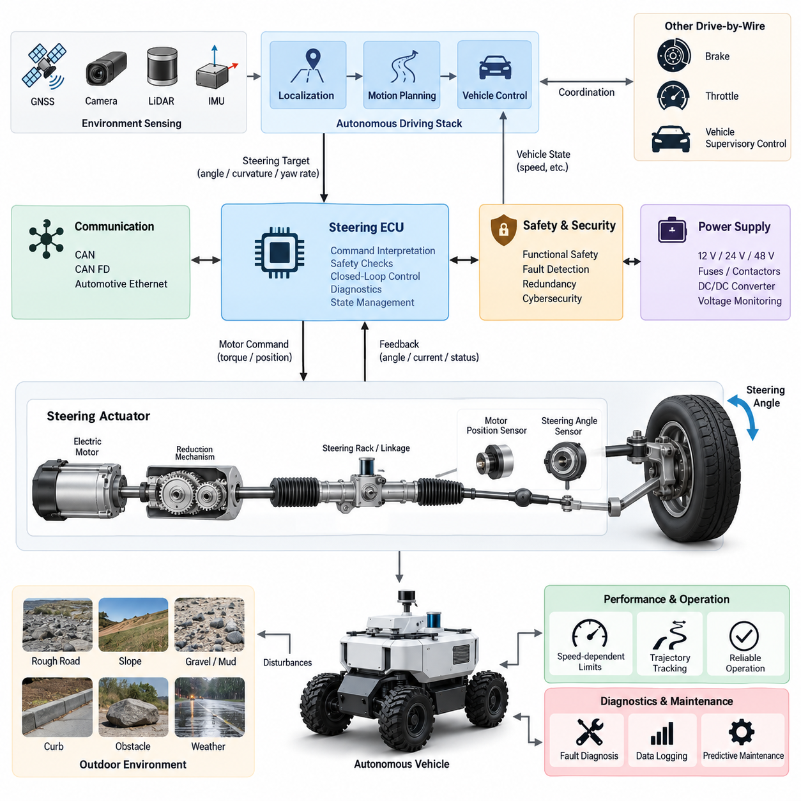
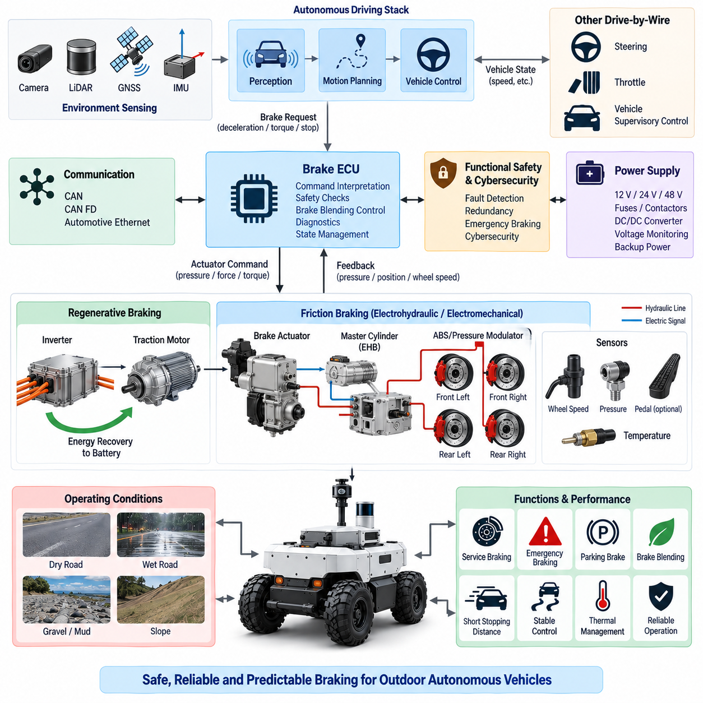
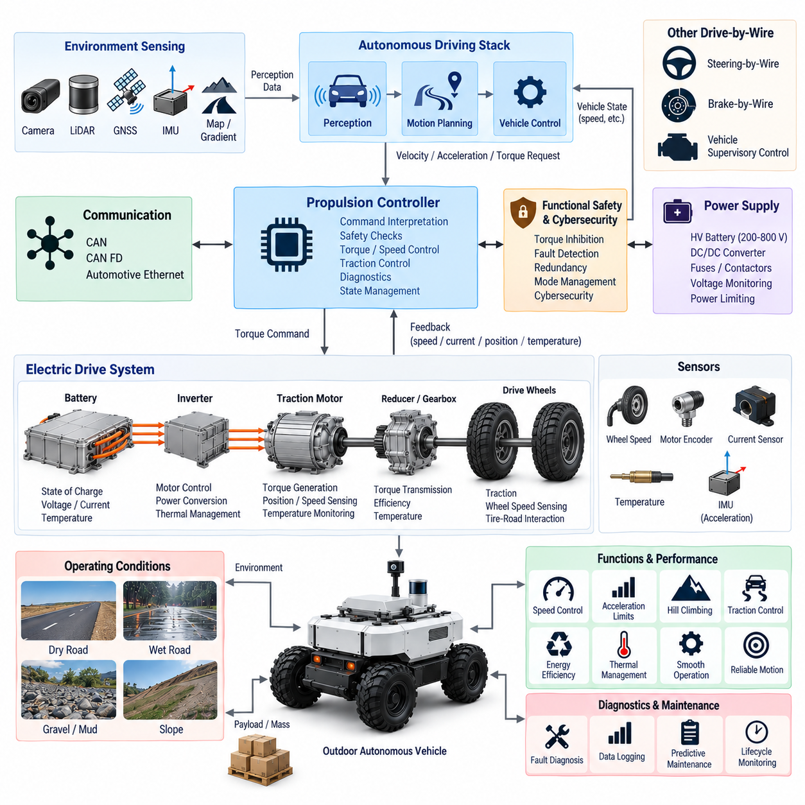
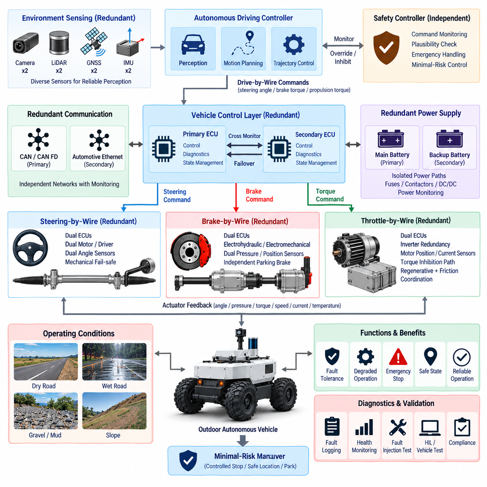
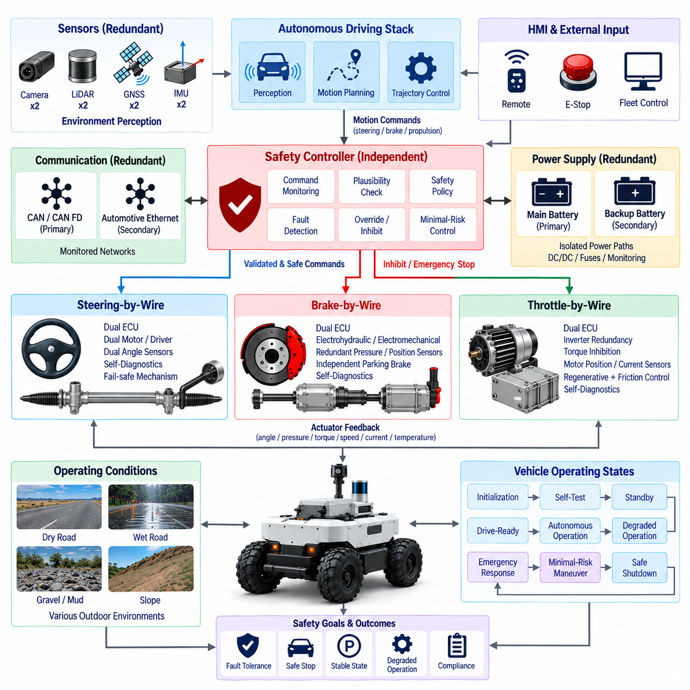

**Volume 17 Outdoor Autonomous Vehicle**

# Chapter 02. Drive-By-Wire

## 02.01. Electronic Steering by Wire

{width="7.268055555555556in" height="7.268055555555556in"}

Electronic steering-by-wire replaces or supplements the conventional mechanical steering linkage with electronically commanded actuation. In an outdoor autonomous vehicle, the steering request originates from the motion-planning and vehicle-control stack rather than from a human steering wheel. The system converts a desired path, curvature, yaw rate, or steering angle into actuator commands that physically rotate the road wheels while continuously measuring the resulting steering position and system health.

A typical steering-by-wire architecture contains a steering actuator, electric motor, reduction mechanism, steering-angle sensors, motor-position sensing, current measurement, an electronic control unit, power electronics, and communication interfaces. Depending on vehicle size, the actuator may drive a steering rack, steering column, hydraulic steering valve, or direct wheel-steering mechanism. Outdoor AMRs frequently favor electrically actuated steering because it integrates naturally with autonomous control and eliminates the need for mechanically accessible driver controls.

The autonomous driving controller normally does not command motor voltage or current directly. Instead, it generates a vehicle-level steering target that is transmitted to the steering ECU through CAN, CAN FD, automotive Ethernet, or another deterministic interface. The steering ECU interprets this request, applies limits and safety checks, and executes closed-loop position or torque control. This separation prevents high-level autonomy software from directly controlling power-stage behavior and creates a clear boundary between motion control and safety-critical actuation.

Closed-loop steering control depends on accurate feedback. A steering-angle sensor measures the actual wheel or rack position, while motor encoders or resolvers provide actuator-level position and velocity information. Motor current can additionally estimate steering load and detect abnormal resistance. The controller compares commanded and measured steering states and continuously minimizes the error. Independent sensing channels are desirable because a single corrupted angle measurement could otherwise cause unintended steering or conceal actuator failure.

Steering dynamics must be coordinated with vehicle velocity. A steering angle that is acceptable at low speed can create excessive lateral acceleration or yaw response at higher speed. The steering controller therefore applies speed-dependent limits to steering angle, steering rate, acceleration, and sometimes jerk. The autonomous controller should also account for actuator latency and mechanical response when generating trajectories. These constraints become especially important for outdoor AMRs that transition between slow inspection operation and faster emergency or transit modes.

The relationship between actuator position and actual road-wheel angle must be established through calibration. Mechanical tolerances, linkage geometry, steering ratio, tire compliance, backlash, and installation offsets can cause the commanded value to differ from the physical wheel angle. Calibration identifies the steering center, left and right limits, effective steering ratio, and nonlinear characteristics across the operating range. The resulting mapping allows the vehicle controller to convert desired curvature into a repeatable physical steering response.

Outdoor operation introduces disturbances that are less significant in controlled indoor environments. Uneven pavement, slopes, curbs, mud, gravel, tire impacts, payload variation, and asymmetric wheel forces can increase steering torque or temporarily displace the wheels. The steering actuator therefore requires sufficient continuous and peak torque margin. Mechanical components, bearings, gears, sensors, connectors, and the ECU must also tolerate vibration, shock, water, dust, temperature variation, and repeated steering reversals throughout the vehicle life cycle.

Electrical power architecture is equally important because steering is a mission-critical actuator. The steering motor can draw substantial transient current during rapid direction changes, stationary steering, obstacle contact, or high-friction operation. Power wiring, fuses, contactors, DC/DC converters, grounding, and connectors must therefore be sized for both continuous and peak demand. Voltage monitoring should detect undervoltage, overvoltage, brownout, and abnormal current conditions before degraded electrical power produces uncontrolled steering behavior.

Communication between the autonomy controller and steering ECU should use explicitly defined command, feedback, diagnostic, and heartbeat messages. Typical signals include requested steering angle, actual angle, steering rate, actuator state, motor current, supply voltage, temperature, fault status, command counter, and timestamp. Message counters, timeout supervision, plausibility checks, and integrity mechanisms help distinguish valid commands from stale or corrupted data. Loss of communication must result in predetermined degraded or safe behavior rather than persistence of an uncontrolled command.

Functional safety requires the steering subsystem to detect faults before they develop into hazardous vehicle motion. Relevant faults include sensor disagreement, actuator stall, excessive tracking error, motor-driver failure, overcurrent, overheating, communication timeout, unexpected steering motion, power loss, and internal ECU malfunction. Diagnostic logic should distinguish transient disturbances from persistent faults and assign an appropriate response. Depending on severity, the system may reduce speed, restrict steering authority, stop the vehicle, or transition toward a minimal-risk condition.

Redundancy can be implemented at several levels rather than simply duplicating the entire steering mechanism. Dual angle sensors, independent power monitoring, redundant communication paths, watchdog processors, separate command validation, and independent emergency-stop logic can substantially improve fault coverage. Higher-integrity vehicles may use dual motor windings, dual ECUs, redundant actuators, or mechanically independent steering channels. The required redundancy should be determined from hazard analysis and the consequences of losing steering authority during operation.

A steering-by-wire ECU should maintain an explicit operating-state machine. Typical states include initialization, self-test, standby, autonomous-ready, active steering, degraded operation, emergency response, and fault shutdown. Steering torque should not be enabled immediately after power-up merely because a command is present on the network. Sensor plausibility, actuator position, supply voltage, communication status, safety-controller authorization, and emergency-stop state should first satisfy defined conditions before active steering authority is granted.

Initialization also requires careful treatment of the steering reference. The controller must know whether the measured actuator position corresponds to the actual wheel orientation before autonomous motion begins. Absolute encoders can preserve steering position across power cycles, whereas incremental sensing may require a homing or reference procedure. Any automatic homing movement must itself be safe, particularly when the vehicle is close to people or obstacles. Persistent calibration parameters should therefore include validity checking and protection against corrupted configuration data.

Steering control interacts directly with localization and trajectory tracking. GNSS RTK, IMU, LiDAR, cameras, and other localization sources estimate vehicle position and orientation, while the motion controller determines the steering action needed to reduce lateral and heading errors. Poor steering calibration can appear as a localization or planning problem because the vehicle repeatedly deviates from the expected path. Conversely, inaccurate localization can cause a correctly functioning steering system to execute inappropriate commands, making interface-level diagnostics essential.

For vehicles using Ackermann steering, the controller must account for wheelbase, track width, steering geometry, and the relationship between steering angle and turning radius. Four-wheel-steering or multi-axle outdoor platforms require additional coordination because front and rear steering angles may vary with speed and operating mode. Low-speed counter-phase steering can reduce turning radius, while same-phase steering can support lateral maneuverability or stability. These modes require controlled transitions to prevent discontinuities in vehicle motion.

Steering-by-wire must also cooperate with brake-by-wire and throttle-by-wire as part of the complete drive-by-wire architecture. A steering fault cannot be handled solely inside the steering ECU if the safest response requires vehicle deceleration. The supervisory safety controller should therefore coordinate steering authority, propulsion torque, braking, and emergency-stop behavior. For example, a persistent steering tracking error may trigger controlled speed reduction followed by braking once the vehicle reaches a geometrically safe stopping condition.

Cybersecurity is relevant because steering commands are transmitted electronically. Unauthorized commands, replayed messages, corrupted software, or compromised network nodes could potentially influence vehicle direction. Network segmentation, authenticated software, secure boot, controlled diagnostic access, firmware integrity verification, and appropriate message protection should therefore complement functional-safety mechanisms. Safety and cybersecurity remain distinct engineering disciplines, but both must protect the steering actuator from commands that are invalid for the current vehicle state.

Thermal design must consider the motor, inverter, ECU, wiring, and mechanical transmission. Repeated low-speed maneuvering can be thermally demanding because steering torque may remain high while vehicle motion provides little cooling. Temperature sensors and thermal models can support staged derating before hardware reaches damaging conditions. A degraded steering mode should preserve enough controllability for safe stopping whenever possible instead of abruptly disabling the actuator solely because a thermal threshold has been approached.

Mechanical fail-safe behavior depends strongly on the vehicle architecture. Some platforms can maintain a mechanical steering linkage or self-centering geometry, while fully electronic systems may require electrical redundancy to retain directional control after a single failure. Designers must also evaluate what happens when actuator power disappears while the wheels are turned. Back-drivable mechanisms, locking behavior, gear ratios, caster forces, and tire-ground interaction determine whether the wheels remain fixed, return toward center, or move unpredictably after power loss.

Diagnostics should support both real-time safety decisions and long-term maintenance. Logged information can include steering commands, measured angles, tracking error, motor current, temperatures, fault counters, communication quality, actuator operating hours, and high-load events. Trend analysis can reveal increasing friction, backlash, sensor drift, or motor degradation before complete failure occurs. For fleet-operated outdoor vehicles, these records can be uploaded to the maintenance platform and correlated with terrain, mission type, payload, and environmental conditions.

Validation must cover more than nominal steering accuracy. Tests should include maximum steering rate, full-lock operation, rapid reversals, low-voltage conditions, communication interruption, sensor faults, actuator obstruction, thermal stress, power cycling, emergency stopping, degraded modes, and recovery behavior. Environmental testing should evaluate vibration, shock, temperature, moisture, dust, corrosion, and connector reliability. Hardware-in-the-loop and vehicle-level testing can then verify that injected faults produce the intended supervisory response.

Performance evaluation should measure steady-state angle error, transient tracking error, response time, overshoot, steering-rate capability, command latency, repeatability, and path-tracking impact. These parameters should be evaluated across vehicle speed, payload, tire condition, surface friction, battery voltage, and temperature. Acceptance limits must reflect the complete autonomous-driving requirement rather than actuator performance alone, because a technically accurate steering actuator may still be inadequate if its latency or rate limits prevent stable trajectory tracking.

The final steering-by-wire design is therefore not simply an electric replacement for a steering wheel. It is a safety-critical mechatronic control subsystem connecting autonomous decision-making to physical vehicle motion. Reliable operation requires coordinated design of mechanics, motors, power electronics, sensing, communication, calibration, diagnostics, functional safety, cybersecurity, environmental protection, and vehicle dynamics. Within an outdoor autonomous vehicle architecture, this subsystem becomes one of the primary interfaces through which digital intelligence acquires controlled authority over physical movement.

## 02.02. Brake by Wire Design

{width="7.268055555555556in" height="7.268055555555556in"}

Brake-by-wire is an electronically controlled braking architecture in which braking demand is transmitted through electrical signals rather than relying exclusively on a direct mechanical or hydraulic command from a human operator. In an outdoor autonomous vehicle, braking requests originate primarily from the motion-control, safety, and supervisory-control systems. The brake subsystem converts desired deceleration, wheel torque, or stopping behavior into controlled physical braking force while continuously monitoring vehicle response and actuator health.

A typical brake-by-wire architecture includes a brake electronic control unit, braking actuators, power electronics, wheel-speed sensors, pressure or force sensors, motor-position sensing, communication interfaces, and an independent safety path. Depending on vehicle size and drivetrain configuration, braking may be implemented through electromechanical brakes, electrohydraulic brakes, motor regenerative braking, or a coordinated combination of these technologies. Outdoor AMRs commonly require both service braking and independently available emergency or parking braking functions.

The autonomous driving controller should normally command a vehicle-level braking objective rather than directly controlling actuator voltage or motor current. Requested longitudinal deceleration, braking torque, or stopping distance is transmitted to the brake ECU through CAN, CAN FD, automotive Ethernet, or another deterministic interface. The brake ECU validates the command, applies operating limits, determines actuator demand, and executes closed-loop control while maintaining a clear separation between high-level autonomous decision-making and safety-critical physical actuation.

Closed-loop braking requires reliable measurement of both actuator behavior and vehicle motion. Wheel-speed sensors provide information about individual wheel rotation, while pressure, force, current, position, or torque sensing can indicate actual brake output. IMU longitudinal acceleration may provide an additional vehicle-level response measurement. Comparing requested and measured braking behavior allows the controller to detect insufficient deceleration, excessive braking, wheel lock, actuator degradation, or discrepancies between commanded and achieved vehicle motion.

Brake demand must be coordinated with vehicle velocity, payload, road gradient, tire condition, and available friction. The same actuator command can produce substantially different deceleration on dry pavement, gravel, mud, wet surfaces, or steep slopes. Therefore, brake control should not assume a fixed relationship between actuator effort and vehicle deceleration. Feedback-based control and operating-condition estimation allow braking force to be adapted while respecting tire-road adhesion and maintaining stable vehicle behavior.

Outdoor autonomous vehicles often operate across a wide payload range, making mass estimation important for braking performance. A heavily loaded inspection or logistics AMR requires greater braking force and longer stopping distance than the same vehicle without payload. Vehicle mass may be estimated from known payload information, load sensors, propulsion response, or longitudinal dynamics. The supervisory controller can then adjust acceleration limits, maximum speed, safety distance, and braking profiles according to the estimated vehicle state.

Stopping-distance management must account for perception latency, planning latency, network transmission, brake ECU processing, actuator response, and physical tire-road braking distance. These delays accumulate between hazard detection and complete vehicle stop. The safety architecture should therefore distinguish reaction distance from actual braking distance and maintain sufficient protective margin. Higher vehicle speed increases stopping distance rapidly, making speed-dependent safety zones essential for outdoor autonomous operation around pedestrians, vehicles, and infrastructure.

Regenerative braking can reduce mechanical brake usage by converting vehicle kinetic energy back into electrical energy through the traction motor and inverter. However, regenerative braking capability depends on motor speed, battery state of charge, battery temperature, inverter limits, and available electrical power absorption. It cannot normally be treated as the sole safety braking mechanism. Brake blending should coordinate regenerative and friction braking so that requested deceleration remains predictable even when regenerative capability suddenly becomes limited or unavailable.

Mechanical or friction braking provides the physical stopping authority required when regenerative braking is insufficient. Electromechanical brake actuators can directly generate clamping or braking force through motors and reduction mechanisms, while electrohydraulic systems generate controlled hydraulic pressure electronically. The selected architecture should provide adequate continuous, peak, emergency, and holding force for the maximum vehicle mass and worst expected gradient. Thermal capacity must also support repeated stops without unacceptable brake fade or actuator overheating.

Parking braking requires separate consideration because maintaining a stationary vehicle can be fundamentally different from dynamic deceleration. An outdoor AMR may need to remain safely stopped on a slope during power-down, charging, loading, communication loss, or maintenance. A mechanically latched or normally engaged parking brake can provide holding force without continuous electrical power. The parking function should be designed so that loss of propulsion or control power does not unintentionally release the vehicle.

Power architecture is critical because electrically actuated brakes must remain available during abnormal vehicle conditions. The brake ECU, actuator, communication interface, and safety logic should receive appropriately protected power through fuses, contactors, DC/DC converters, and monitored supply paths. Energy reserve mechanisms may be required where braking must remain possible after primary power interruption. Undervoltage, overvoltage, excessive current, open circuits, short circuits, and supply instability should be detected before braking authority becomes critically degraded.

Communication messages should clearly separate normal braking commands, emergency braking requests, actuator feedback, diagnostic information, and state transitions. Relevant signals may include requested deceleration, requested brake torque, actual brake force, wheel speeds, actuator position, motor current, temperature, parking-brake state, fault status, heartbeat, command counter, and timestamp. Timeout supervision and message-integrity checking prevent stale or corrupted network data from being interpreted indefinitely as valid braking commands.

Functional safety is fundamental because failure to decelerate can directly produce hazardous vehicle motion. Important faults include actuator stall, insufficient brake force, unintended braking, sensor disagreement, wheel-speed failure, communication loss, overheating, power interruption, mechanical wear, ECU malfunction, and abnormal release of the parking brake. The system should detect these faults, determine their severity, and transition to a predefined degraded state, emergency braking action, controlled stop, or minimal-risk condition.

Redundancy should be determined from the consequences of losing braking authority. Possible measures include redundant wheel-speed sensing, dual brake-position sensing, independent emergency-stop channels, separate safety-controller authorization, redundant communication, monitored power paths, and multiple physically independent braking mechanisms. A vehicle combining regenerative braking with an independent friction brake already possesses functional diversity, but the safety analysis must confirm that common power, software, communication, or mechanical failures cannot disable both mechanisms simultaneously.

Emergency braking should remain independent from ordinary trajectory-control logic wherever the hazard analysis requires it. A safety controller, emergency-stop circuit, safety LiDAR, bumper sensor, or other protective device may request immediate braking without waiting for the normal autonomy stack. The resulting braking profile must balance stopping distance and vehicle stability. Excessively abrupt braking can itself create hazards through wheel lock, payload movement, vehicle rollover, or loss of directional control, particularly on high-center-of-gravity outdoor platforms.

Wheel-lock behavior becomes important on low-friction or uneven surfaces. If one or more wheels stop rotating while the vehicle is still moving, available steering control and directional stability can deteriorate. Wheel-speed comparison and vehicle-motion estimation can identify potential lock conditions and allow braking force to be reduced or redistributed where the actuator architecture permits. Although a low-speed AMR may not require a conventional automotive ABS implementation, the underlying principle of maintaining controllable tire-road interaction remains important.

Brake-by-wire must operate cooperatively with steering-by-wire and throttle-by-wire. A braking event should normally remove or restrict propulsion torque, while emergency responses may require coordinated steering stabilization and braking. The supervisory controller therefore manages actuator authority across the complete drive-by-wire system. Conflicting commands, such as simultaneous high propulsion and emergency braking requests, should be resolved deterministically according to predefined safety priorities rather than left to independent subsystem behavior.

Brake thermal management must consider repeated deceleration, long downhill operation, high payload, ambient temperature, actuator duty cycle, and limited airflow. Friction brakes convert kinetic and potential energy into heat, while electromechanical actuators and power electronics generate additional losses. Temperature sensing and thermal estimation can identify approaching limits and trigger speed reduction, regenerative-braking preference, altered mission planning, or controlled stopping before thermal degradation causes a significant loss of braking capability.

Mechanical design must account for wear, contamination, corrosion, backlash, seal degradation, and environmental exposure. Mud, water, dust, salt, stones, and temperature cycling can alter brake friction and actuator behavior. Outdoor systems therefore require suitable enclosure protection, corrosion-resistant materials, protected connectors, robust cable routing, and inspection procedures. Brake components should remain accessible enough for maintenance because pads, discs, mechanical linkages, seals, and actuators may require periodic inspection or replacement during vehicle service life.

The brake ECU should use an explicit state machine covering initialization, self-test, standby, drive-ready, normal braking, parking, emergency braking, degraded operation, and fault shutdown. Brake release should occur only after propulsion readiness, steering status, safety authorization, communication health, and required sensor checks have been confirmed. Similarly, power-down should place the vehicle into a defined mechanically secure condition rather than simply removing electrical power from the brake actuator.

Diagnostics and data logging support both immediate fault handling and predictive maintenance. Useful records include requested and achieved deceleration, brake torque, wheel speeds, actuator current, position, temperature, activation counts, emergency-stop events, fault codes, and stopping-distance trends. Increasing actuator current or progressively longer stopping distance can indicate mechanical wear, contamination, increased friction, or actuator degradation. Fleet-level analysis can compare braking performance across vehicles, routes, payloads, weather, and terrain conditions.

Validation should include normal deceleration, maximum braking, emergency stopping, parking on gradients, repeated braking, regenerative-to-friction transitions, low-voltage operation, communication interruption, sensor faults, actuator obstruction, power loss, and recovery from degraded states. Tests should also cover dry pavement, wet surfaces, gravel, slopes, payload extremes, temperature variation, vibration, shock, dust, and water exposure. Hardware-in-the-loop testing can inject electrical and communication faults before equivalent scenarios are evaluated on the physical vehicle.

Performance assessment should measure braking response time, deceleration tracking error, stopping distance, brake-force repeatability, actuator latency, holding capability, thermal behavior, and stability during transitions between braking modes. Measurements should span vehicle speed, battery voltage, payload, gradient, surface friction, and environmental temperature. Acceptance criteria should be derived from vehicle-level safety requirements because braking performance ultimately determines whether the autonomous vehicle can reach a safe state within the available distance.

A complete brake-by-wire design is therefore more than an electronically controlled brake actuator. It is a safety-critical mechatronic subsystem linking autonomous perception and decision-making to controlled reduction of physical vehicle energy. Reliable implementation requires coordinated engineering of actuators, sensing, power, communication, regenerative braking, friction braking, diagnostics, redundancy, functional safety, environmental protection, and supervisory control. Together with steering-by-wire and throttle-by-wire, it forms the foundation of controlled and fail-safe motion for an outdoor autonomous vehicle.

## 02.03. Throttle by Wire Design

{width="7.268055555555556in" height="7.268055555555556in"}

Throttle-by-wire is an electronically controlled propulsion architecture in which acceleration and drive-torque requests are transmitted as electrical commands rather than through a direct mechanical throttle linkage. In an outdoor autonomous vehicle, propulsion demand originates from the motion-planning and vehicle-control systems. The subsystem converts desired velocity, acceleration, or wheel torque into controlled traction while continuously supervising vehicle motion, actuator response, and system health.

For electric outdoor AMRs, the term throttle-by-wire represents propulsion-by-wire more broadly because there may be no conventional engine throttle plate. A typical architecture includes a vehicle control unit, motor controller or inverter, traction motor, wheel-speed sensing, current and voltage measurement, motor-position feedback, communication interfaces, and safety supervision. The same control principle can also support combustion, hybrid, or other propulsion architectures through an electronically commanded torque interface.

The autonomous driving controller normally generates a vehicle-level velocity, acceleration, or traction-torque request rather than directly commanding inverter switching or motor phase current. This request is transmitted through CAN, CAN FD, automotive Ethernet, or another deterministic communication interface. The propulsion controller validates the command, applies torque and speed limits, determines the required motor output, and executes lower-level closed-loop control while isolating high-level autonomy software from safety-critical power electronics.

Closed-loop propulsion control requires reliable feedback from both the drivetrain and vehicle. Wheel-speed sensors measure vehicle-related rotational motion, while motor encoders or resolvers provide rotor position and speed. Battery voltage, inverter current, motor current, temperature, and estimated torque provide additional information about propulsion state. The controller compares requested and measured behavior to detect excessive tracking error, wheel slip, actuator saturation, unexpected acceleration, or loss of propulsion authority.

Velocity control and torque control serve different purposes within the propulsion hierarchy. A higher-level controller may determine the desired vehicle speed from the planned trajectory, while a lower-level controller calculates the traction torque needed to achieve that speed. Torque commands generally provide faster interaction with vehicle dynamics, whereas velocity commands simplify supervisory operation. A well-structured architecture defines which controller owns each loop so that multiple controllers do not compete for propulsion authority.

Acceleration limits are essential for outdoor autonomous vehicles because excessive torque can produce wheel slip, payload movement, passenger discomfort, or vehicle instability. The propulsion controller should constrain positive acceleration, torque rate, and jerk according to vehicle speed and operating conditions. Smooth command shaping is especially important for heavy AMRs because abrupt torque changes can stress gearboxes, shafts, tires, cargo restraints, and electrical components even when the requested final speed remains within the normal operating range.

Vehicle mass and payload significantly influence throttle-by-wire behavior. The same traction torque produces different acceleration when the vehicle is empty or carrying its maximum payload. Mass information may come from configuration data, load cells, suspension measurements, or online dynamic estimation. The controller can use this information to adapt torque limits, acceleration profiles, hill-climbing capability, braking coordination, and energy predictions while preserving predictable motion across the vehicle\'s permitted payload range.

Road gradient introduces another major propulsion requirement. On an uphill slope, additional traction torque is required to overcome gravity, while downhill operation may require reduced propulsion or regenerative braking. An IMU, localization map, or vehicle-dynamics estimator can provide gradient information to the controller. Feedforward compensation can then supplement closed-loop velocity control, reducing speed error and preventing unnecessarily aggressive feedback corrections when the vehicle transitions between level terrain and slopes.

Tire-road friction varies substantially in outdoor operation. Dry pavement, wet surfaces, gravel, mud, snow, loose soil, and uneven terrain can all change the amount of usable traction. Excessive drive torque may cause wheel spin even though the propulsion system itself is functioning correctly. Comparing wheel speeds, vehicle acceleration, IMU data, and estimated ground speed can reveal traction loss. The controller may then reduce torque or modify acceleration demand until stable tire-ground interaction is restored.

Electric propulsion places throttle-by-wire directly within the vehicle power architecture. Requested traction torque must remain compatible with battery state of charge, battery current limits, DC/DC or high-voltage distribution capability, inverter ratings, motor thermal limits, and available system power. The propulsion controller therefore requires dynamic power limiting rather than assuming that maximum motor torque is always available. Other high-power loads may also need coordination when the vehicle approaches its electrical power budget.

Battery voltage changes with state of charge, load, temperature, and battery condition. High propulsion demand can create voltage sag, particularly at low state of charge or low temperature. The control architecture should monitor supply voltage and reduce torque before undervoltage causes inverter shutdown or instability in other electronic systems. Controlled derating is generally preferable to an abrupt loss of propulsion because the supervisory controller can adjust speed and mission behavior while retaining predictable vehicle control.

Thermal management is equally important because sustained high torque generates heat in the traction motor, inverter, cables, connectors, gearbox, and battery. Outdoor vehicles may climb slopes, traverse soft terrain, tow loads, or operate at low speed where cooling is limited. Temperature sensors and thermal estimators can support progressive torque derating. The supervisory system should distinguish temporary peak capability from continuous capability so that mission planning does not repeatedly demand propulsion levels that cannot be thermally sustained.

Communication between the autonomy controller and propulsion controller should contain clearly defined command, feedback, status, and diagnostic information. Typical signals include requested speed, acceleration, torque, direction, actual motor speed, wheel speed, estimated torque, DC voltage, current, temperature, operating state, fault status, command counter, and timestamp. Heartbeat monitoring, timeout detection, range checking, and message-integrity mechanisms prevent stale or corrupted commands from maintaining unintended propulsion.

Command arbitration is necessary because propulsion requests can originate from multiple sources. Normal trajectory control, remote operation, docking, maintenance mode, emergency logic, traction control, and safety supervision may all request different torque or speed limits. The system must establish deterministic authority and priority rules. Safety-related torque inhibition should override ordinary acceleration requests, while transitions between autonomous, manual, remote, and service modes should occur only after explicit state validation.

Throttle-by-wire must be tightly coordinated with brake-by-wire. A valid braking request should normally reduce or remove positive propulsion torque before or while braking force is applied. Emergency braking must override acceleration demand even if the autonomy controller continues transmitting a previous velocity command. Brake-throttle plausibility logic can detect conflicting commands and force the system toward a predefined safe response. This coordination prevents propulsion and braking subsystems from independently fighting each other during faults.

Coordination with steering-by-wire is also important because available longitudinal acceleration depends on vehicle curvature and lateral dynamics. High propulsion torque during sharp steering can reduce stability, increase tire slip, or create rollover risk on tall outdoor platforms. The supervisory controller can therefore apply curvature-dependent speed and torque limits. Combined steering and propulsion constraints allow the motion controller to generate trajectories that remain inside the physical handling envelope rather than relying on actuator-level corrections afterward.

Direction control requires special protection because an unintended transition between forward and reverse can generate severe drivetrain loads or unexpected vehicle movement. The propulsion controller should permit direction changes only under defined conditions, typically when vehicle speed and motor speed are sufficiently low and braking status is appropriate. Direction commands should be state-controlled rather than represented merely by the sign of a torque value, allowing explicit validation before a forward-to-reverse transition is accepted.

Functional safety must address hazards such as unintended acceleration, failure to reduce torque, loss of propulsion, incorrect direction, excessive speed, communication failure, sensor disagreement, inverter faults, motor faults, and corrupted control software. Monitoring logic should compare requested torque with measured acceleration, motor current, wheel speed, and vehicle state. When inconsistencies exceed defined limits, the system can inhibit propulsion, reduce available torque, request braking, or transition the vehicle into a minimal-risk condition.

Redundancy does not necessarily require duplicate traction motors. Safety coverage can be improved through independent speed measurements, dual command validation, watchdog processors, separate torque-enable paths, redundant communication monitoring, and independent emergency torque inhibition. Where propulsion is distributed across multiple motors, individual drive channels can also provide partial operational redundancy. The architecture should nevertheless prevent a common communication, power, or software fault from creating uncontrolled torque across multiple traction channels.

A propulsion ECU or vehicle control unit should implement an explicit state machine including initialization, self-test, standby, drive-ready, active propulsion, reverse operation, degraded mode, emergency response, and fault shutdown. Torque output should remain inhibited during startup until power conditions, communication health, direction state, brake status, safety authorization, and required sensors have been validated. Similarly, shutdown should reduce torque in a controlled manner and coordinate with braking before propulsion power is removed.

Cybersecurity is important because electronic propulsion commands directly influence vehicle motion. Unauthorized torque requests, replayed messages, malicious calibration changes, or compromised firmware could create unsafe acceleration. Secure boot, authenticated software updates, protected diagnostic access, network segmentation, command freshness checks, and appropriate message authentication can reduce these risks. Cybersecurity mechanisms should complement rather than replace independent functional-safety monitoring of actual vehicle behavior.

Diagnostics should record both immediate faults and long-term propulsion trends. Useful parameters include commanded and actual torque, motor speed, wheel speed, acceleration, current, voltage, inverter temperature, motor temperature, energy consumption, derating events, slip events, and fault counters. Changes in current required for the same operating condition may reveal increasing mechanical resistance, tire problems, gearbox degradation, bearing wear, or alignment issues before they develop into mission-ending failures.

Validation should exercise propulsion behavior across the complete operating envelope. Tests should include low-speed maneuvering, maximum permitted speed, acceleration and deceleration transitions, forward-reverse changes, hill starts, gradient operation, maximum payload, wheel slip, low battery voltage, thermal derating, communication interruption, sensor faults, inverter faults, emergency braking, and recovery from degraded states. Environmental tests should additionally consider vibration, shock, temperature, water, dust, and electromagnetic disturbances.

Performance evaluation should measure speed-tracking error, torque response, acceleration response, command latency, overshoot, jerk, traction stability, energy efficiency, hill-climbing capability, thermal behavior, and repeatability. Measurements should cover different payloads, battery states, road gradients, surfaces, temperatures, and vehicle speeds. Acceptance limits must be derived from vehicle-level motion and safety requirements because propulsion performance affects not only mobility but also trajectory tracking, stopping behavior, and overall autonomous stability.

A complete throttle-by-wire design is therefore a controlled electronic interface between autonomous decision-making and the vehicle\'s propulsion energy. For an electric outdoor AMR, it integrates vehicle control, inverter and motor actuation, sensing, power management, communication, diagnostics, thermal protection, traction management, functional safety, and cybersecurity. Together with steering-by-wire and brake-by-wire, it forms the coordinated drive-by-wire foundation through which the autonomous system safely controls the vehicle\'s physical motion.

## 02.04. DBW Redundancy Design

{width="7.268055555555556in" height="7.268055555555556in"}

Drive-by-wire redundancy is the architectural capability that allows steering, braking, and propulsion control to remain safe when individual electronic, electrical, communication, sensing, or actuator faults occur. In an outdoor autonomous vehicle, no human driver can be assumed to immediately recover control after a failure. The DBW system must therefore detect faults, isolate affected functions, preserve essential control where possible, and transition the vehicle toward a defined minimal-risk condition when continued operation is unsafe.

Redundancy should be designed from vehicle-level hazards rather than by simply duplicating every component. The engineering process begins by identifying failures that could cause unintended steering, loss of braking, unintended acceleration, loss of propulsion, or uncontrolled vehicle motion. Each hazardous failure is then associated with detection mechanisms, independent backup resources, degraded operating modes, and a safe response. This approach creates purposeful redundancy while avoiding unnecessary duplication, cost, weight, power consumption, and complexity.

A complete redundant DBW architecture normally spans several layers. These include command generation, vehicle controllers, communication networks, sensors, power supplies, actuator electronics, physical actuators, and supervisory safety logic. Independence between layers is important because duplicated components connected to the same vulnerable resource may not provide meaningful redundancy. Two controllers sharing one power supply, network, sensor reference, or software defect can fail simultaneously through a common-cause failure.

Command redundancy begins above the individual steering, brake, and propulsion ECUs. The autonomous driving controller may generate normal motion commands while an independent safety controller evaluates vehicle state and maintains authority to restrict or inhibit unsafe commands. The safety controller does not necessarily duplicate the complete perception and planning stack. Instead, it can supervise essential quantities such as speed, steering demand, braking state, communication health, emergency inputs, and actuator responses using simpler and independently validated logic.

Command plausibility checking provides another layer of protection. Requested steering angle, brake torque, propulsion torque, acceleration, speed, and direction should be checked against physical limits and the current operating state. A command that is individually valid may still be unsafe when combined with another command. High propulsion torque during emergency braking, excessive steering at high speed, or a reverse request while moving forward should therefore be rejected or constrained before reaching the physical actuators.

Sensor redundancy is particularly important because closed-loop DBW control depends on accurate feedback. Steering angle may be measured through dual channels, wheel speed can be observed at multiple wheels, and motor position may be compared with wheel or vehicle motion. Brake force can be cross-checked using actuator position, pressure, current, wheel deceleration, and IMU acceleration. Diverse measurements allow the system to detect a faulty sensor even when the failed channel continues producing apparently valid numerical data.

Redundant sensors should not merely produce two identical values from the same physical mechanism. Where practical, diversity can reduce common-mode failure risk by using different sensing principles, separate power paths, independent signal conditioning, or physically separated installation locations. The controller can perform range, rate, correlation, and temporal plausibility checks between channels. When measurements disagree, the architecture must define which information remains trustworthy and whether continued degraded operation is permitted.

Communication redundancy protects command and feedback paths between autonomous computing, safety controllers, and DBW ECUs. CAN, CAN FD, automotive Ethernet, or dedicated safety links can be arranged so that a single network fault does not eliminate all vehicle-control communication. Redundant channels should be monitored independently using heartbeat messages, counters, timestamps, timeout detection, integrity checks, and network diagnostics. A backup network provides little benefit if both communication paths depend on the same failed gateway or power source.

Network redundancy also requires deterministic failover behavior. When the primary communication channel becomes unavailable, the controller must know whether the secondary channel contains current and authoritative information before accepting it. Simultaneous commands arriving through different networks require arbitration rules that prevent conflicting actuator requests. The transition should avoid abrupt steering, braking, or propulsion changes, and the system should record the reason, timing, and operational consequences of each communication failover event.

Power redundancy is fundamental because electronic redundancy becomes ineffective when all channels lose electrical energy simultaneously. Safety-critical DBW controllers and actuators may require separated power branches, independent fusing, protected DC/DC conversion, monitored contactors, backup batteries, or stored-energy devices. The architecture should analyze failures of the main battery, distribution unit, ground connection, connector, fuse, converter, and wiring so that essential braking and control functions remain available long enough to establish a safe vehicle state.

The required backup power duration depends on the vehicle\'s failure strategy. Some platforms need only enough reserve energy to remove propulsion torque and apply a fail-safe brake, while others must maintain steering and controlled braking long enough to move away from traffic or stop in a suitable location. Energy calculations should include worst-case steering load, brake actuation, ECU consumption, communication, safety sensors, and environmental conditions rather than assuming nominal electrical demand.

Steering redundancy must address both unintended steering and loss of steering authority. Dual angle sensing, independent actuator monitoring, watchdog logic, torque or position plausibility checks, and redundant command validation can detect many failures without duplicating the complete steering mechanism. Higher-integrity platforms may use dual motor windings, separate motor drivers, dual ECUs, or independent steering actuators. If steering capability cannot be preserved, vehicle speed must be reduced and braking coordinated to reach a minimal-risk condition.

Brake redundancy receives particularly high priority because controlled deceleration is often the final mechanism available after another DBW function fails. Regenerative braking and friction braking can provide functional diversity, but regenerative braking depends on the traction system and electrical energy path. An independently actuated friction or parking brake can therefore provide a stronger backup. Emergency braking should remain available even when normal motion planning, propulsion control, or primary communication has failed.

Propulsion redundancy is different because loss of propulsion is usually less immediately hazardous than unintended propulsion. The primary safety objective is therefore often reliable torque inhibition rather than continued full drive capability. Independent torque-enable signals, inverter shutdown paths, watchdog monitoring, contactor control, and brake coordination can prevent uncontrolled acceleration. Multi-motor vehicles may retain limited mobility after one drive channel fails, provided asymmetric torque does not create unacceptable yaw or stability problems.

Controller redundancy can use primary and secondary ECUs, lockstep processors, safety microcontrollers, watchdog devices, or independent supervisory controllers. The channels may operate in active-active, active-standby, or monitoring configurations depending on system requirements. A redundant controller must have enough independent information to determine whether the primary controller is healthy. Simply copying the same commands from the same software and sensors into a second processor may reproduce rather than tolerate systematic faults.

Software diversity may be considered where common software faults dominate the residual risk. A complex autonomous controller and a simpler independently developed safety monitor can provide architectural diversity without duplicating the entire autonomy stack. The safety monitor may enforce maximum speed, steering limits, braking priority, direction constraints, command freshness, and emergency-stop conditions. Its purpose is not to reproduce autonomous intelligence but to prevent the primary system from commanding vehicle motion outside an established safe envelope.

Fault detection must be accompanied by fault containment. Once a failed sensor, controller, network, or actuator channel is identified, the system should prevent that channel from continuing to influence vehicle motion. Electrical isolation, software inhibition, network gateway blocking, actuator disable signals, or power disconnection may be used depending on the failure. Fault containment regions should be defined so that one malfunction does not propagate through shared power, communication, timing, or software resources into otherwise healthy DBW functions.

Common-cause and common-mode failures require explicit analysis because they can defeat apparently redundant systems. Examples include water ingress affecting adjacent connectors, a shared ground failure, thermal damage to colocated ECUs, electromagnetic interference on parallel harnesses, a software update containing the same defect in both controllers, or physical impact damaging multiple channels. Separation, environmental protection, diverse routing, independent power distribution, and design diversity help reduce these correlated failure mechanisms.

The DBW supervisor should maintain a vehicle-level operating state rather than allowing steering, braking, and propulsion ECUs to independently decide whether the vehicle is safe to drive. Typical states include initialization, self-test, drive-ready, normal operation, degraded operation, emergency response, minimal-risk maneuver, and safe shutdown. Transitions depend on the combination of available sensors, controllers, communication paths, power resources, and actuator capabilities rather than on a single diagnostic flag.

Degraded operation should be explicitly engineered rather than treated as an undefined condition between normal operation and shutdown. Loss of one redundant sensor may permit reduced-speed operation, while loss of a primary communication channel may trigger secondary-network operation. Reduced steering capability may require severe speed limitation, whereas degraded braking may require immediate stopping. Each degradation level should define permitted speed, acceleration, steering authority, mission behavior, and conditions requiring complete immobilization.

A minimal-risk condition is the target state when sufficient redundancy no longer exists for normal autonomous operation. Depending on vehicle configuration and environment, this may involve removing propulsion torque, maintaining directional stability, applying controlled braking, activating the parking brake, and notifying the fleet-control system. The safest response is not always an instantaneous stop; stopping abruptly on a slope, intersection, or unstable surface may introduce additional hazards, so the transition strategy should consider vehicle state and surroundings.

Emergency-stop architecture should provide an independent path capable of overriding normal DBW commands. Physical emergency switches, safety controllers, protective sensors, remote emergency functions, or safety networks may request propulsion inhibition and braking without depending on the primary autonomous computer. The emergency path should be continuously monitored for availability. Resetting an emergency condition should require deliberate state validation so that vehicle motion cannot automatically resume merely because the initiating signal disappears.

Diagnostics and event recording are essential for validating redundancy during real operation. Logs should capture primary and backup channel states, sensor disagreements, communication failovers, power anomalies, actuator faults, watchdog events, degraded-mode transitions, emergency actions, and recovery attempts. Accurate timestamps allow engineers to reconstruct the sequence of events. Fleet-level analysis can reveal recurring weaknesses that may not appear during individual vehicle testing, including connector, environmental, software, or network-related failure patterns.

Validation must demonstrate that redundancy actually tolerates failures rather than merely confirming that duplicate hardware exists. Fault-injection testing should disconnect sensors, interrupt networks, remove power branches, corrupt messages, stall actuators, reset controllers, introduce implausible commands, and simulate disagreement between redundant channels. Hardware-in-the-loop testing allows systematic exploration before physical vehicle testing, while vehicle-level tests confirm that detection, isolation, failover, degraded operation, and minimal-risk transitions behave correctly under real dynamics.

Timing is a critical validation parameter because successful fault detection that occurs too late may provide little safety benefit. The complete fault-tolerant response includes fault occurrence, detection latency, decision time, channel isolation, backup activation, actuator response, and final vehicle stabilization. These intervals must remain within the vehicle-level safety budget. Testing should therefore measure not only whether failover succeeds but also whether it succeeds quickly enough at maximum permitted speed, payload, gradient, and environmental extremes.

DBW redundancy is therefore a coordinated vehicle-level safety architecture rather than a collection of duplicated components. Effective redundancy combines independent sensing, communication, power, controllers, actuator monitoring, emergency paths, fault containment, degraded operation, and minimal-risk behavior while addressing common-cause failures. When steering-by-wire, brake-by-wire, and throttle-by-wire are integrated through this architecture, the autonomous vehicle can preserve controlled motion or achieve a safe state even when individual elements of the electronic control system fail.

## 02.05. DBW Safety Architecture

{width="7.268055555555556in" height="7.268055555555556in"}

Drive-by-wire safety architecture provides the vehicle-level mechanisms required to ensure that electronically controlled steering, braking, and propulsion cannot create unacceptable vehicle motion when faults, invalid commands, environmental disturbances, or system degradation occur. Because an outdoor autonomous vehicle cannot depend on immediate human intervention, the architecture must continuously supervise DBW behavior, detect hazardous conditions, coordinate corrective actions, and guide the vehicle toward a controlled safe state.

Safety must be treated as an independent architectural layer rather than as diagnostic logic embedded only inside individual steering, brake, or propulsion controllers. Each DBW ECU remains responsible for local actuator protection and control, while a supervisory safety controller evaluates the combined vehicle state. This separation enables the system to identify situations in which individual subsystems appear healthy but their combined commands or responses produce unsafe longitudinal, lateral, or directional vehicle behavior.

The safety architecture begins with clearly defined vehicle operating states. Initialization, self-test, standby, drive-ready, autonomous operation, degraded operation, emergency response, minimal-risk maneuver, and safe shutdown should have explicit entry and exit conditions. Steering, braking, and propulsion authority is granted only when the required power, communication, sensing, actuator, and safety conditions are satisfied. State transitions should be deterministic so that identical faults produce predictable vehicle responses.

Safety supervision requires observation of both commanded and actual vehicle behavior. Requested steering angle, braking torque, propulsion torque, speed, acceleration, direction, and operating mode should be compared with measured steering position, wheel speed, IMU motion, actuator current, brake response, motor state, and vehicle trajectory. This command-response comparison helps detect faults that ordinary ECU diagnostics may miss, including plausible but incorrect commands, mechanical degradation, actuator saturation, or unexpected vehicle motion.

Command plausibility checking establishes a safety envelope around autonomous motion requests. Steering commands should remain compatible with vehicle speed and dynamic limits, propulsion torque should respect acceleration and traction constraints, and braking requests should have priority when deceleration is required. Direction changes must be rejected while vehicle motion is incompatible with the requested state. Cross-functional checks prevent individually valid DBW commands from creating hazardous behavior when executed simultaneously.

The safety controller should have sufficient authority to limit, override, or inhibit normal DBW commands. This does not require the safety controller to reproduce the complete autonomous perception and planning system. Instead, it can implement a smaller independently verified set of safety functions such as maximum-speed enforcement, steering-rate limitation, propulsion inhibition, braking priority, direction interlocking, emergency-stop processing, and minimal-risk control. Simpler safety logic can reduce systematic complexity while maintaining independent protection.

Fault detection should combine local ECU diagnostics with vehicle-level monitoring. Local controllers can detect sensor failures, motor-driver faults, overcurrent, overheating, communication errors, actuator stalls, and internal processor failures. Vehicle-level logic can detect excessive steering deviation, insufficient deceleration, unintended acceleration, abnormal yaw response, inconsistent wheel speeds, or failure to follow commanded motion. Combining both perspectives improves diagnostic coverage and supports more appropriate safety responses.

Fault classification determines how aggressively the vehicle must respond. A temporary sensor discrepancy may require increased monitoring, while loss of one redundant communication channel may permit continued operation through a backup path. Reduced steering capability can require immediate speed limitation, whereas loss of dependable braking may require an emergency stop. The architecture should therefore associate each fault class with defined operational restrictions rather than treating every diagnostic event as either completely harmless or immediately catastrophic.

Fault containment prevents a detected malfunction from propagating into healthy DBW functions. A failed sensor channel can be excluded from control calculations, a corrupted network node can be isolated, and a malfunctioning actuator controller can have its torque or enable authority removed. Electrical isolation, software inhibition, communication filtering, power disconnection, and independent safety signals can establish fault containment boundaries. Shared resources must be analyzed carefully because they can allow one failure to affect multiple DBW channels.

Steering safety must protect against unintended steering as well as loss of steering capability. The architecture can compare commanded and measured steering angles, monitor steering rate, verify redundant sensors, and evaluate whether steering response is physically compatible with vehicle motion. Excessive deviation or uncontrolled steering should trigger propulsion reduction and coordinated braking. At higher speed, steering authority may also be dynamically restricted so that a valid but excessive command cannot create dangerous lateral acceleration or instability.

Brake safety is central to the complete DBW architecture because controlled deceleration is often required to recover from failures in other functions. The system should monitor requested and achieved deceleration, actuator state, wheel speed, brake pressure or position, and available friction or regenerative braking capability. If normal braking becomes unavailable, an independent emergency or parking brake may provide backup stopping authority. Braking safety must remain coordinated with steering so that emergency deceleration does not unnecessarily sacrifice directional stability.

Propulsion safety focuses strongly on preventing unintended torque. Requested propulsion should be checked against current speed, direction, braking state, operating mode, and safety authorization. Independent torque inhibition, inverter disable paths, contactor control, watchdog monitoring, and brake coordination can remove propulsion when abnormal behavior is detected. Loss of propulsion may permit controlled degraded operation, but inability to reliably suppress propulsion should normally force the vehicle toward braking and a minimal-risk condition.

Safety-critical communication requires more than successful message transmission. DBW messages should include mechanisms for detecting stale, missing, repeated, out-of-sequence, or corrupted information. Heartbeats, command counters, timestamps, timeout supervision, range checking, and integrity protection allow receivers to determine whether commands remain valid. Communication loss should trigger predefined behavior rather than allowing the actuator to indefinitely retain the last steering, brake, or propulsion request.

Power safety must ensure that essential DBW functions remain available during electrical faults. Steering, braking, safety control, and communication may require protected power branches, monitored DC/DC converters, independent fusing, backup energy, or separated distribution paths. The architecture should define which functions must survive primary power loss and for how long. Backup energy should be sized from the actual minimal-risk maneuver, including steering, braking, ECU operation, communication, and safety sensing requirements.

Emergency-stop functionality should use an independent and highly dependable control path. Physical emergency switches, protective sensors, safety controllers, remote emergency functions, or dedicated safety communication can request immediate propulsion inhibition and braking without relying on normal trajectory planning. Emergency stopping must nevertheless consider vehicle stability, payload security, surface friction, and rollover risk. The objective is rapid risk reduction, not simply maximum possible brake force under every condition.

A minimal-risk maneuver provides the controlled transition between fault detection and the final minimal-risk condition. Depending on remaining system capability, the vehicle may reduce speed, suppress propulsion, maintain limited steering, move toward a safer location, apply controlled braking, engage the parking brake, and notify fleet supervision. The maneuver must consider whether stopping immediately would itself create risk, particularly on intersections, slopes, unstable surfaces, or locations where the vehicle could obstruct other traffic.

The final safe state should be explicitly defined for each vehicle configuration. For many outdoor AMRs, it includes zero propulsion torque, vehicle speed at zero, mechanically secured braking, restricted actuator authority, recorded fault status, and prevention of automatic restart. Releasing the safe state should require verification that the initiating fault has disappeared or has been serviced. Merely restoring communication or cycling electrical power should not automatically return a safety-critical DBW system to active motion.

Degraded operation allows useful functionality to continue when sufficient safety capability remains after a fault. The allowable behavior should depend on the remaining steering, braking, propulsion, sensing, communication, and power resources. Reduced speed, limited steering angle, restricted acceleration, modified route selection, return-to-base behavior, or mission termination may be appropriate. Every degraded mode requires defined boundaries so that operational pressure does not gradually convert a safety fallback into an uncontrolled normal operating mode.

Common-cause failure analysis is essential because DBW safety mechanisms may share physical or logical resources. Water ingress, wiring damage, shared grounding faults, thermal events, electromagnetic interference, software defects, incorrect calibration, common network gateways, or physical impact can disable multiple supposedly independent channels. Physical separation, diverse routing, independent power paths, environmental protection, software diversity, and architectural independence reduce the probability that one event defeats both normal control and its safety protection.

Cybersecurity must complement functional safety because malicious or unauthorized electronic commands can produce effects similar to random hardware faults. Secure boot, authenticated firmware, controlled diagnostic access, network segmentation, message protection, and software integrity monitoring help protect DBW command paths. Functional safety monitoring should still evaluate actual physical behavior independently, ensuring that even an apparently legitimate electronic command cannot exceed the vehicle\'s defined safety envelope without being detected.

Timing requirements are fundamental to DBW safety. Hazardous behavior must be detected and controlled before the vehicle moves beyond the available safety margin. The response chain includes fault occurrence, sensing, diagnostic processing, safety decision, command override, actuator response, and vehicle stabilization. Maximum allowable latency should therefore be derived from vehicle speed, stopping distance, steering dynamics, payload, and operating environment rather than from processor or network performance alone.

Diagnostics and event logging provide evidence that the safety architecture is operating as intended. Records should include commands, measured responses, safety-controller decisions, fault codes, sensor disagreements, communication timeouts, power anomalies, actuator limitations, emergency events, degraded-mode transitions, and minimal-risk maneuvers. Accurate synchronized timestamps enable reconstruction of causal sequences and support fleet-level identification of recurring hardware, software, environmental, or integration weaknesses.

Safety validation must intentionally challenge the architecture rather than only demonstrate normal operation. Fault injection can introduce sensor disagreement, communication loss, corrupted commands, controller resets, power interruptions, actuator stalls, unintended torque, braking degradation, and steering errors. Hardware-in-the-loop testing provides repeatable exploration of hazardous combinations, while vehicle testing confirms that detection, containment, override, degraded operation, emergency response, and minimal-risk behavior remain correct under real physical dynamics.

Validation should also cover combinations of faults and environmental conditions. A communication failure on dry level pavement may be manageable, while the same failure during a downhill maneuver with maximum payload and reduced tire friction can produce a very different risk. Testing across speed, payload, gradient, surface condition, battery state, temperature, vibration, and weather helps demonstrate that safety mechanisms remain effective throughout the intended outdoor operating domain rather than only under nominal laboratory conditions.

The complete DBW safety architecture therefore integrates supervisory safety control, command plausibility, actuator monitoring, communication integrity, power protection, fault containment, emergency control, degraded operation, minimal-risk maneuvering, diagnostics, cybersecurity, and validation. Steering-by-wire, brake-by-wire, and throttle-by-wire become safe autonomous motion mechanisms only when coordinated at the vehicle level, allowing the outdoor autonomous vehicle to detect abnormal behavior, retain control where possible, and reliably transition to a safe state when continued operation can no longer be justified.
