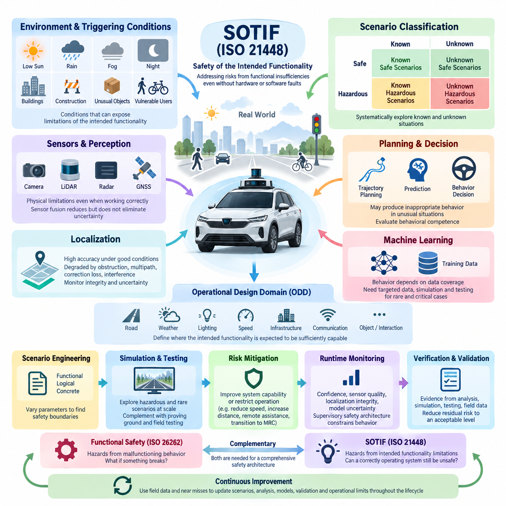
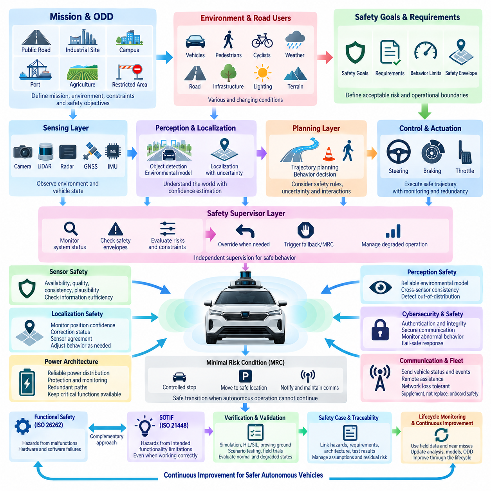
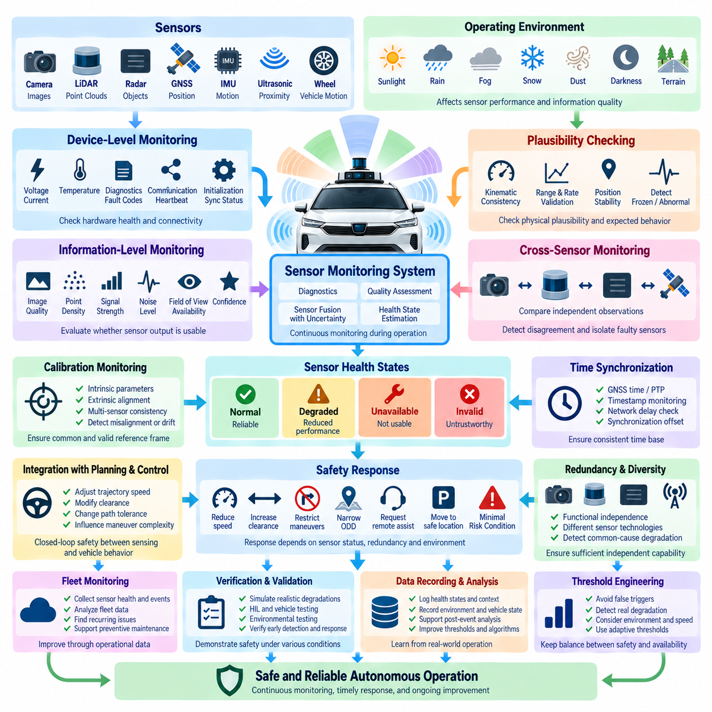
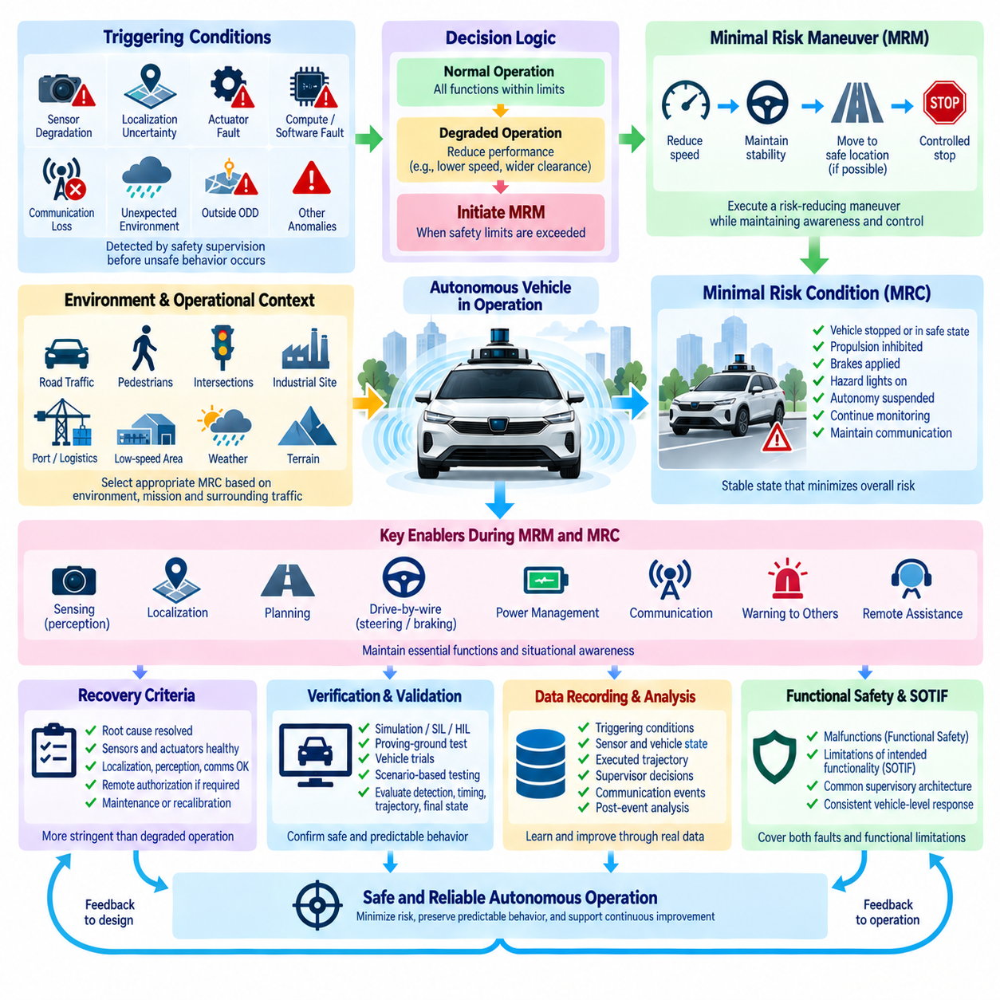
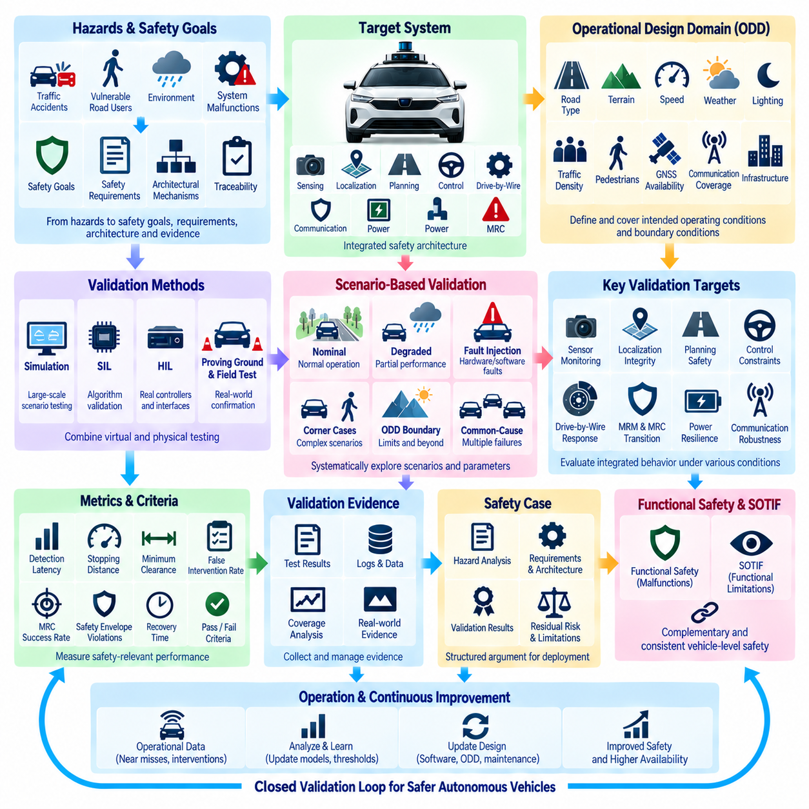

**Volume 17 Outdoor Autonomous Vehicle**


# Chapter 03. Safety Architecture

##  

## 03.01. SOTIF (ISO 21448)

{width="7.268055555555556in" height="7.268055555555556in"}

Safety of the Intended Functionality (SOTIF), standardized in ISO 21448, addresses hazards that arise even when an autonomous vehicle system is free from conventional hardware or software faults. Unlike functional safety, which primarily manages failures and malfunctions, SOTIF considers whether the intended functionality itself can produce unsafe behavior because of performance limitations, incomplete environmental understanding, ambiguous situations, or foreseeable misuse. This distinction is fundamental for outdoor autonomous vehicles operating in complex and continuously changing environments.

An autonomous vehicle may contain perfectly functioning cameras, LiDARs, radars, GNSS receivers, computers, and drive-by-wire controllers while still making an unsafe decision. A perception algorithm may fail to recognize an unusual object, localization accuracy may degrade near buildings, or a planner may incorrectly interpret an unfamiliar traffic configuration. SOTIF therefore extends safety engineering beyond component reliability toward the limitations of perception, reasoning, prediction, and decision-making functions.

The central SOTIF concept separates operating situations according to whether they are known or unknown and whether they are safe or potentially hazardous. Known safe scenarios represent conditions for which system capability has been sufficiently demonstrated. Known hazardous scenarios contain recognized functional limitations or triggering conditions. Unknown hazardous scenarios are especially important because developers have not yet identified the combination of environmental conditions and system limitations capable of producing unsafe behavior.

Triggering conditions are environmental, operational, or behavioral circumstances that expose limitations in the intended functionality. Examples for an outdoor autonomous vehicle include low sun angles affecting cameras, rain reducing LiDAR quality, GNSS multipath near buildings, partially occluded pedestrians, unusual road markings, reflective surfaces, construction zones, or unexpected interactions with bicycles and other vehicles. Identifying these conditions requires systematic analysis rather than relying only on normal-road testing.

SOTIF analysis begins with a clear definition of the intended functionality and its operating assumptions. Engineers must specify what the autonomous vehicle is expected to perceive, predict, plan, and control, together with the operational design domain in which those capabilities are valid. Road geometry, weather, illumination, speed, infrastructure, communication availability, object types, localization quality, and interaction patterns become explicit engineering parameters rather than implicit assumptions.

The Operational Design Domain (ODD) therefore becomes closely connected to SOTIF engineering. A system designed for controlled industrial roads has fundamentally different exposure from one operating on public urban streets. Safety cannot be evaluated independently of these boundaries. The ODD defines where the intended functionality is expected to remain sufficiently capable, while SOTIF analysis investigates circumstances inside or near those boundaries where performance limitations could create unreasonable risk.

Perception is one of the most significant SOTIF domains because sensors have physical limitations even when functioning correctly. Cameras depend on illumination, contrast, visibility, and optical condition; LiDAR performance can be affected by weather, surface reflectivity, range, and geometry; radar has its own resolution and classification limitations. Sensor fusion reduces individual weaknesses but does not automatically eliminate uncertainty, particularly when multiple sensors encounter correlated environmental degradation.

Localization introduces another class of intended-function limitations. GNSS RTK can provide centimeter-level positioning under favorable conditions, yet satellite obstruction, multipath, correction-service interruption, antenna geometry, or environmental interference can reduce confidence without representing a hardware fault. Safe autonomy therefore requires monitoring not only the estimated position but also integrity, uncertainty, correction status, sensor consistency, and the relationship between localization confidence and permissible vehicle behavior.

Planning and decision systems must similarly be examined for SOTIF limitations. A trajectory planner may operate exactly according to its algorithm while producing behavior that is technically valid but inappropriate for an unusual scene. Prediction models can misunderstand human intent, optimization objectives can inadequately represent safety margins, and learned policies can encounter situations outside their training distribution. Safety engineering must consequently evaluate behavioral competence rather than merely confirming correct software execution.

Machine learning increases the importance of scenario-based SOTIF engineering because model behavior is strongly influenced by training-data coverage. Dataset size alone does not demonstrate safety. Engineers must examine whether relevant combinations of weather, lighting, road users, infrastructure, object appearance, occlusion, speed, and interaction are represented. Rare but safety-critical cases require deliberate collection, simulation, synthetic generation, perturbation, and targeted testing to expose weaknesses hidden by aggregate accuracy metrics.

Scenario engineering provides a practical mechanism for converting SOTIF concerns into measurable validation activities. Functional scenarios describe situations semantically, logical scenarios define parameter ranges, and concrete scenarios instantiate specific test conditions. Parameters such as pedestrian speed, vehicle velocity, visibility, sensor range, obstacle position, braking distance, and localization uncertainty can be systematically varied to discover boundaries where intended functionality transitions from acceptable behavior to potentially unsafe behavior.

Simulation is particularly valuable for exploring hazardous and rare scenarios that would be expensive, dangerous, or statistically inefficient to reproduce through physical testing alone. Large-scale virtual testing can vary environmental and behavioral parameters, inject sensor degradation, create unusual object combinations, and repeatedly examine near-boundary conditions. Simulation does not replace proving-ground or field validation, but it dramatically expands scenario coverage and supports systematic discovery of previously unknown hazardous situations.

Once a functional insufficiency is discovered, mitigation can occur through improved system capability or through restriction of operation. Developers may improve sensing, fusion, localization, prediction, planning, training data, or algorithms. Alternatively, the vehicle can reduce speed, increase safety distance, request remote assistance, exclude particular environmental conditions, or transition toward a Minimal Risk Condition. SOTIF therefore connects perception uncertainty directly with operational behavior rather than treating uncertainty as an isolated diagnostic quantity.

Runtime monitoring is essential because not every relevant limitation can be eliminated before deployment. Confidence measures, sensor-quality indicators, localization integrity, model uncertainty, environmental classification, communication status, and cross-sensor consistency can provide evidence that the system is approaching its validated operating boundary. A supervisory safety architecture can then constrain autonomous functions, reduce vehicle speed, modify the mission, initiate controlled stopping, or transfer responsibility to an appropriate fallback mechanism.

Verification and validation under ISO 21448 should accumulate evidence that residual risk associated with functional insufficiencies has been reduced to an acceptable level. Evidence may combine requirements analysis, scenario coverage, simulation, software-in-the-loop testing, hardware-in-the-loop testing, proving-ground experiments, field operation, fault-independent performance evaluation, and statistical analysis. The objective is not to claim that every possible situation has been tested, but to establish a defensible argument that relevant hazardous scenarios have been systematically explored.

SOTIF must also coexist with functional safety rather than replace it. ISO 26262 addresses hazards associated primarily with malfunctioning behavior, whereas ISO 21448 addresses hazards caused by insufficient intended functionality when components are operating as designed. Outdoor autonomous vehicle safety architecture therefore requires both perspectives: one asks whether the system fails correctly when something breaks, while the other asks whether a correctly operating system can nevertheless misunderstand the world and behave dangerously.

For outdoor autonomous vehicles, SOTIF ultimately becomes a continuous engineering process rather than a one-time certification activity. Field data can reveal previously unknown scenarios, near misses can expose insufficient assumptions, and software updates can change perception or planning behavior. New evidence should therefore feed back into scenario databases, hazard analysis, simulation campaigns, model training, validation criteria, ODD definitions, and runtime safety mechanisms throughout the operational lifecycle.

A mature SOTIF architecture links sensing, perception, localization, prediction, planning, control, supervision, validation, and operational feedback into one safety argument. The essential principle is that autonomy must understand not only what it believes about the environment, but also when that belief may be unreliable. By explicitly managing functional limitations, triggering conditions, uncertainty, scenario coverage, and residual risk, ISO 21448 provides a critical foundation for deploying outdoor autonomous vehicles with defensible safety assurance.

의도된 기능의 안전성(Safety of the Intended Functionality, SOTIF)은 ISO 21448에서 표준화된 개념으로, 자율주행 차량 시스템에 일반적인 하드웨어(Hardware) 또는 소프트웨어(Software) 고장이 존재하지 않더라도 발생할 수 있는 위험을 다룬다. 주로 고장과 오작동을 관리하는 기능 안전(Functional Safety)과 달리, SOTIF는 성능 한계, 불완전한 환경 이해, 모호한 상황 또는 예측 가능한 오사용(Foreseeable Misuse)으로 인해 의도된 기능 자체가 위험한 동작을 유발할 가능성을 고려한다. 이러한 차이는 복잡하고 지속적으로 변화하는 환경에서 운행하는 실외 자율주행 차량(Outdoor Autonomous Vehicle)에 매우 중요하다.

자율주행 차량의 카메라(Camera), 라이다(LiDAR), 레이더(Radar), 위성항법시스템 수신기(GNSS Receiver), 컴퓨터(Computer), 드라이브 바이 와이어 제어기(Drive-by-Wire Controller)가 모두 정상적으로 작동하더라도 차량은 위험한 판단을 내릴 수 있다. 인지 알고리즘(Perception Algorithm)이 비정상적인 물체를 인식하지 못하거나, 건물 주변에서 위치추정(Localization) 정확도가 저하되거나, 경로 계획기(Planner)가 익숙하지 않은 교통 상황을 잘못 해석할 수 있다. 따라서 SOTIF는 안전 공학(Safety Engineering)의 범위를 부품 신뢰성에서 인지, 추론, 예측 및 의사결정 기능의 한계까지 확장한다.

SOTIF의 핵심 개념은 운행 상황을 알려진 상황(Known Situation)과 알려지지 않은 상황(Unknown Situation), 그리고 안전한 상황(Safe Situation)과 잠재적으로 위험한 상황(Potentially Hazardous Situation)으로 구분하는 것이다. 알려진 안전 시나리오(Known Safe Scenario)는 시스템의 능력이 충분히 검증된 조건을 의미한다. 알려진 위험 시나리오(Known Hazardous Scenario)는 이미 인식된 기능적 한계 또는 촉발 조건(Triggering Condition)을 포함한다. 특히 알려지지 않은 위험 시나리오(Unknown Hazardous Scenario)는 개발자가 아직 위험한 동작을 발생시킬 수 있는 환경 조건과 시스템 한계의 조합을 발견하지 못했다는 점에서 중요하다.

촉발 조건(Triggering Condition)은 의도된 기능의 한계를 드러내는 환경적, 운용적 또는 행동적 조건이다. 실외 자율주행 차량의 사례로는 낮은 태양 고도로 인한 카메라 성능 저하, 비로 인한 라이다 품질 감소, 건물 주변의 위성항법 다중경로(GNSS Multipath), 부분적으로 가려진 보행자, 비정상적인 도로 표시, 반사 표면, 공사 구역, 자전거 및 다른 차량과의 예상하지 못한 상호작용 등이 있다. 이러한 조건의 식별은 일반적인 도로 시험에만 의존하지 않고 체계적인 분석을 통해 수행되어야 한다.

SOTIF 분석은 의도된 기능(Intended Functionality)과 운용 가정(Operating Assumption)을 명확하게 정의하는 것에서 시작한다. 엔지니어는 자율주행 차량이 무엇을 인지하고, 예측하고, 계획하고, 제어해야 하는지를 정의해야 하며, 이러한 능력이 유효한 운용 설계 영역(Operational Design Domain, ODD)을 함께 규정해야 한다. 도로 형상, 날씨, 조명, 속도, 인프라, 통신 가용성, 객체 유형, 위치추정 품질 및 상호작용 패턴은 암묵적인 가정이 아니라 명시적인 공학적 매개변수(Engineering Parameter)가 된다.

따라서 운용 설계 영역(Operational Design Domain, ODD)은 SOTIF 공학(SOTIF Engineering)과 밀접하게 연결된다. 통제된 산업단지 도로에서 운행하도록 설계된 시스템은 일반 도시 도로에서 운행하는 시스템과 근본적으로 다른 위험 노출 특성을 가진다. 안전성은 이러한 경계와 독립적으로 평가할 수 없다. ODD는 의도된 기능이 충분한 성능을 유지할 것으로 기대되는 영역을 정의하며, SOTIF 분석은 그 영역 내부 또는 경계 부근에서 성능 한계가 불합리한 위험(Unreasonable Risk)을 발생시킬 수 있는 조건을 조사한다.

인지(Perception)는 정상적으로 작동하는 센서에도 물리적 한계가 존재하기 때문에 가장 중요한 SOTIF 영역 중 하나이다. 카메라는 조명, 대비, 가시성 및 광학 상태에 영향을 받으며, 라이다 성능은 날씨, 표면 반사율, 거리 및 기하학적 조건에 영향을 받을 수 있다. 레이더 역시 고유한 해상도 및 분류 한계를 가진다. 센서 융합(Sensor Fusion)은 개별 센서의 약점을 감소시키지만, 여러 센서가 상관된 환경적 성능 저하(Correlated Environmental Degradation)를 동시에 경험하는 경우 불확실성을 자동으로 제거하지는 못한다.

위치추정(Localization)은 또 다른 종류의 의도된 기능 한계를 발생시킨다. 위성항법 실시간 이동측위(GNSS RTK)는 양호한 조건에서 센티미터 수준의 위치 정확도를 제공할 수 있지만, 위성 신호 차단, 다중경로(Multipath), 보정 서비스 중단, 안테나 배치 조건 또는 환경적 간섭으로 인해 하드웨어 고장이 발생하지 않은 상태에서도 신뢰도가 감소할 수 있다. 따라서 안전한 자율주행을 위해서는 추정 위치뿐 아니라 무결성(Integrity), 불확실성(Uncertainty), 보정 상태, 센서 간 일관성 및 위치추정 신뢰도와 허용 가능한 차량 거동 사이의 관계까지 감시해야 한다.

경로 계획 및 의사결정 시스템(Planning and Decision System)도 동일하게 SOTIF 관점에서 한계를 분석해야 한다. 궤적 계획기(Trajectory Planner)가 알고리즘에 따라 정확하게 동작하더라도 특이한 상황에서는 기술적으로 유효하지만 실제 상황에는 부적절한 행동을 생성할 수 있다. 예측 모델(Prediction Model)은 사람의 의도를 잘못 이해할 수 있고, 최적화 목적함수(Optimization Objective)는 안전 여유를 충분히 표현하지 못할 수 있으며, 학습된 정책(Learned Policy)은 학습 분포(Training Distribution)를 벗어난 상황에 직면할 수 있다. 따라서 안전 공학은 단순히 소프트웨어가 정확하게 실행되는지를 확인하는 것을 넘어 행동 능력(Behavioral Competence)을 평가해야 한다.

머신러닝(Machine Learning)은 모델의 행동이 학습 데이터(Training Data)의 포괄성에 크게 영향을 받기 때문에 시나리오 기반 SOTIF 공학(Scenario-Based SOTIF Engineering)의 중요성을 더욱 증가시킨다. 데이터셋(Dataset)의 크기만으로 안전성을 입증할 수는 없다. 엔지니어는 날씨, 조명, 도로 사용자, 인프라, 객체 외형, 가림(Occlusion), 속도 및 상호작용의 관련 조합이 충분히 포함되어 있는지 평가해야 한다. 드물지만 안전에 중요한 사례는 전체 정확도 지표에 숨겨진 취약점을 발견하기 위해 의도적인 데이터 수집, 시뮬레이션(Simulation), 합성 데이터 생성(Synthetic Generation), 변형(Perturbation) 및 표적 시험(Targeted Testing)을 통해 검증해야 한다.

시나리오 공학(Scenario Engineering)은 SOTIF 관련 문제를 측정 가능한 검증 활동으로 전환하는 실질적인 방법을 제공한다. 기능 시나리오(Functional Scenario)는 상황을 의미론적으로 설명하고, 논리 시나리오(Logical Scenario)는 매개변수의 범위를 정의하며, 구체 시나리오(Concrete Scenario)는 특정 시험 조건을 실제 값으로 구현한다. 보행자 속도, 차량 속도, 가시거리, 센서 범위, 장애물 위치, 제동 거리 및 위치추정 불확실성과 같은 매개변수를 체계적으로 변화시켜 의도된 기능이 허용 가능한 동작에서 잠재적으로 위험한 동작으로 전환되는 경계를 탐색할 수 있다.

시뮬레이션(Simulation)은 실제 시험으로 재현하기에는 비용이 높거나 위험하며 통계적으로 비효율적인 희귀 위험 시나리오를 탐색하는 데 특히 유용하다. 대규모 가상 시험(Virtual Testing)을 통해 환경 및 행동 매개변수를 변화시키고, 센서 성능 저하를 주입하며, 비정상적인 객체 조합을 생성하고, 시스템 성능의 경계 조건을 반복적으로 조사할 수 있다. 시뮬레이션은 시험장(Proving Ground) 또는 현장 검증(Field Validation)을 대체하지 않지만, 시나리오 포괄성(Scenario Coverage)을 크게 확대하고 이전에 알려지지 않았던 위험 상황을 체계적으로 발견하도록 지원한다.

기능적 불충분성(Functional Insufficiency)이 발견되면 시스템 능력을 개선하거나 운용 범위를 제한하는 방법으로 위험을 완화할 수 있다. 개발자는 센싱(Sensing), 센서 융합, 위치추정, 예측, 경로 계획, 학습 데이터 또는 알고리즘을 개선할 수 있다. 또는 차량 속도를 낮추고, 안전거리를 증가시키며, 원격 지원(Remote Assistance)을 요청하거나, 특정 환경 조건에서 운행을 제한하거나, 최소 위험 상태(Minimal Risk Condition)로 전환할 수 있다. 따라서 SOTIF는 인지 불확실성을 단순한 진단 값으로 취급하지 않고 실제 차량의 운용 행동과 직접 연결한다.

실행시간 감시(Runtime Monitoring)는 모든 관련 기능 한계를 배치 이전에 완전히 제거할 수 없기 때문에 필수적이다. 신뢰도 지표(Confidence Measure), 센서 품질 지표, 위치추정 무결성, 모델 불확실성(Model Uncertainty), 환경 분류, 통신 상태 및 센서 간 일관성은 시스템이 검증된 운용 경계에 접근하고 있음을 판단하는 근거를 제공할 수 있다. 감독 안전 아키텍처(Supervisory Safety Architecture)는 이러한 정보를 이용해 자율 기능을 제한하고, 차량 속도를 낮추며, 임무를 변경하고, 제어된 정지를 수행하거나 적절한 대체 메커니즘(Fallback Mechanism)으로 책임을 전환할 수 있다.

ISO 21448에 따른 검증 및 확인(Verification and Validation)은 기능적 불충분성과 관련된 잔여 위험(Residual Risk)이 허용 가능한 수준으로 감소했음을 보여주는 증거를 축적해야 한다. 이러한 증거에는 요구사항 분석, 시나리오 포괄성, 시뮬레이션, 소프트웨어 인 더 루프 시험(Software-in-the-Loop Testing), 하드웨어 인 더 루프 시험(Hardware-in-the-Loop Testing), 시험장 시험, 현장 운행, 고장과 독립적인 성능 평가 및 통계 분석 등이 포함될 수 있다. 목적은 가능한 모든 상황을 시험했다고 주장하는 것이 아니라 관련 위험 시나리오가 체계적으로 탐색되었다는 방어 가능한 안전 논리(Safety Argument)를 확립하는 것이다.

SOTIF는 기능 안전(Functional Safety)을 대체하는 것이 아니라 기능 안전과 함께 적용되어야 한다. ISO 26262가 주로 시스템의 오작동 동작(Malfunctioning Behavior)과 관련된 위험을 다룬다면, ISO 21448은 구성요소가 설계된 대로 정상 작동하는 상황에서도 의도된 기능이 충분하지 않아 발생하는 위험을 다룬다. 따라서 실외 자율주행 차량의 안전 아키텍처(Safety Architecture)는 두 가지 관점을 모두 요구한다. 하나는 시스템의 일부가 고장났을 때 시스템이 안전하게 대응하는지를 확인하고, 다른 하나는 정상적으로 작동하는 시스템이 주변 세계를 잘못 이해하여 위험하게 행동할 가능성을 확인한다.

실외 자율주행 차량에서 SOTIF는 궁극적으로 일회성 인증 활동이 아니라 지속적인 공학 프로세스(Continuous Engineering Process)가 된다. 현장 데이터(Field Data)는 이전에 알려지지 않았던 시나리오를 발견하게 하고, 아차 사고(Near Miss)는 불충분한 가정을 드러내며, 소프트웨어 업데이트(Software Update)는 인지 또는 경로 계획 동작을 변화시킬 수 있다. 따라서 새로운 증거는 전체 운용 수명주기(Operational Lifecycle)에 걸쳐 시나리오 데이터베이스, 위험 분석, 시뮬레이션 캠페인, 모델 학습, 검증 기준, ODD 정의 및 실행시간 안전 메커니즘으로 지속적으로 피드백되어야 한다.

성숙한 SOTIF 아키텍처(SOTIF Architecture)는 센싱, 인지, 위치추정, 예측, 경로 계획, 제어, 감독, 검증 및 운용 피드백을 하나의 안전 논리(Safety Argument)로 연결한다. 핵심 원칙은 자율주행 시스템이 환경에 대해 무엇을 알고 있다고 판단하는지만 이해하는 것이 아니라, 그 판단이 언제 신뢰할 수 없게 되는지도 스스로 판단할 수 있어야 한다는 것이다. 기능적 한계, 촉발 조건, 불확실성, 시나리오 포괄성 및 잔여 위험을 명시적으로 관리함으로써 ISO 21448은 실외 자율주행 차량을 방어 가능한 안전 보증(Safety Assurance) 체계 아래 배치하기 위한 핵심 기반을 제공한다.

##  

## 03.02. Autonomous Safety Framework

{width="7.268055555555556in" height="7.268055555555556in"}

An Autonomous Safety Framework provides the system-level structure used to ensure that an outdoor autonomous vehicle can perform its mission while maintaining acceptable risk throughout perception, localization, planning, control, and actuation. Within the Safety Architecture chapter, it extends SOTIF principles into an integrated operational framework connecting technical safety mechanisms, autonomous behavior, supervision, fallback strategies, validation, and lifecycle monitoring.

The framework begins by defining the vehicle mission, Operational Design Domain (ODD), operating constraints, safety objectives, and acceptable behavioral boundaries. Outdoor autonomous vehicles may operate on public roads, industrial sites, campuses, ports, agricultural areas, or restricted infrastructure. Each environment introduces different combinations of road users, terrain, weather, visibility, communication conditions, vehicle speeds, and infrastructure interactions that must be explicitly represented in safety requirements.

Safety must be considered as an end-to-end property rather than as an isolated function implemented by a single controller. Cameras, LiDAR, radar, GNSS RTK, IMU, vehicle networks, AI computers, drive-by-wire systems, power systems, and communication links contribute different information and capabilities. The safety framework therefore evaluates whether the complete chain from environmental sensing to physical vehicle motion remains sufficiently trustworthy under both normal and degraded conditions.

A layered architecture is useful for separating safety responsibilities. The sensing layer observes the physical environment and vehicle state, the perception and localization layer constructs an operational representation of the world, and the planning layer determines intended motion. The control and actuation layer converts trajectories into steering, braking, and propulsion commands, while an independent supervisory layer monitors whether these processes remain within defined safety constraints.

Sensor safety begins with continuous evaluation of availability, plausibility, quality, and consistency. A sensor may remain electrically operational while providing degraded information because of contamination, weather, occlusion, glare, vibration, multipath, or environmental interference. The safety framework should therefore distinguish simple device health from information quality and determine whether remaining sensor capability is sufficient for the current operating condition and vehicle behavior.

Localization safety requires similar integrity monitoring. GNSS RTK, IMU, wheel odometry, LiDAR localization, and visual localization can provide complementary estimates, but their uncertainty varies with the environment. The autonomous safety framework should monitor position confidence, correction status, sensor disagreement, map consistency, and temporal stability. When localization integrity decreases, allowable speed, trajectory complexity, or autonomous operating authority should be reduced accordingly.

Perception safety concerns not only object detection accuracy but the reliability of the complete environmental model. The vehicle must identify relevant obstacles, pedestrians, bicycles, vehicles, free space, road boundaries, and other mission-specific objects while maintaining uncertainty estimates. Cross-sensor consistency checking, temporal tracking, confidence monitoring, and detection of out-of-distribution conditions help identify situations where the perception system should no longer be treated as fully reliable.

Planning safety converts environmental understanding into behavior constrained by explicit safety rules. A planner should consider collision margins, stopping distance, dynamic obstacles, vehicle stability, road boundaries, uncertainty, and predicted interactions with other agents. Even when an optimized trajectory is mathematically feasible, supervisory constraints should prevent execution when the trajectory violates predefined safety envelopes or depends on environmental assumptions that cannot be sufficiently verified.

The vehicle control layer must reliably translate safe trajectories into physical motion. Steering-by-wire, brake-by-wire, and throttle-by-wire functions should provide command monitoring, feedback verification, diagnostic information, and appropriate redundancy according to the vehicle risk level. Differences between requested and measured steering angle, braking response, acceleration, wheel speed, or vehicle motion can indicate that the commanded trajectory is no longer being executed as expected.

An independent safety supervisor provides a critical separation between mission autonomy and safety authority. The main autonomous computer may optimize perception, navigation, and mission performance, while the safety supervisor evaluates simplified but highly dependable constraints. It can monitor speed, obstacle distance, localization integrity, trajectory validity, sensor availability, communication state, and actuator response, and can override normal autonomy when defined safety limits are exceeded.

Safety envelopes establish measurable boundaries within which autonomous behavior is permitted. These boundaries may include maximum speed, minimum obstacle clearance, lateral deviation, braking distance, localization uncertainty, steering limits, acceleration limits, or sensor availability requirements. Dynamic safety envelopes can become more conservative when visibility decreases, terrain becomes uncertain, localization quality degrades, or vulnerable road users enter the vehicle\'s operating area.

Degraded operation is preferable to an immediate emergency stop in many situations because stopping itself may create risk. The framework can define progressive responses such as reducing speed, increasing following distance, restricting maneuver complexity, disabling selected autonomous functions, requesting remote assistance, or moving toward a designated safe location. The response should correspond to the severity, persistence, and operational consequences of the detected degradation.

When continued autonomous operation cannot be justified, the system must transition toward a Minimal Risk Condition (MRC). Depending on vehicle type and environment, this may involve controlled deceleration, stopping within a safe corridor, activating warning indicators, securing propulsion, maintaining essential communications, or notifying a control center. The transition must account for surrounding traffic and obstacles so that the fallback action does not introduce a greater hazard than the original problem.

Communication with a fleet or central control system can extend safety supervision beyond the individual vehicle. Operational status, safety events, localization confidence, sensor degradation, mission state, and emergency conditions can be transmitted to remote infrastructure. However, remote communication should normally supplement rather than replace essential onboard safety functions because network latency, congestion, coverage loss, or infrastructure failure may occur during critical situations.

Cybersecurity and safety must also be coordinated because compromised commands, corrupted data, unauthorized access, or manipulated updates can affect physical vehicle behavior. Safety-critical communication paths require authentication, integrity protection, controlled access, secure software deployment, and monitoring of abnormal network behavior. At the same time, cybersecurity mechanisms should be designed so that authentication or communication failures lead to predictable and appropriately constrained vehicle behavior.

Power architecture forms another foundation of autonomous safety. Loss of primary electrical power can simultaneously affect perception, computation, communication, steering, braking, and safety controllers. Critical functions therefore require carefully designed power distribution, protection, monitoring, and where necessary independent or redundant energy paths. The safety framework should define which functions must remain available long enough to execute a controlled transition to a safe state.

Functional safety and SOTIF provide complementary foundations for the framework. Functional safety addresses hazards resulting from faults and malfunctioning behavior, while SOTIF addresses hazards arising from limitations of correctly operating intended functionality. Autonomous vehicle safety requires both because a dangerous event may originate from a failed component, insufficient perception capability, an unexpected environmental condition, an inappropriate decision, or interactions among several individually acceptable subsystems.

Verification must demonstrate safety across component, subsystem, vehicle, and operational levels. Software-in-the-loop, hardware-in-the-loop, simulation, proving-ground testing, fault injection, scenario testing, environmental testing, and field trials can progressively evaluate safety mechanisms. Validation should include nominal operation, degraded states, boundary conditions, rare events, communication loss, localization degradation, sensor limitations, actuator anomalies, and transitions into fallback or minimal-risk behavior.

Safety evidence should be organized into a traceable safety argument connecting hazards, safety goals, requirements, architecture, implementation, verification results, assumptions, and residual risks. Traceability is particularly important for autonomous vehicles because AI models, maps, sensor configurations, software versions, and operating environments can change during development and deployment. A modification in one subsystem may invalidate assumptions previously used elsewhere in the safety case.

The Autonomous Safety Framework therefore continues throughout the vehicle lifecycle. Operational logs, near misses, interventions, sensor degradation events, localization anomalies, emergency stops, remote assistance requests, and newly discovered scenarios provide evidence for continuous improvement. These observations should feed back into hazard analysis, ODD definitions, software updates, simulation libraries, safety requirements, validation campaigns, and fleet operating policies.

A mature framework ultimately establishes a closed safety loop from sensing and autonomous reasoning to physical action, supervision, fallback, validation, and operational learning. The objective is not merely to prevent individual component failures, but to ensure that the complete autonomous vehicle recognizes when its capabilities are insufficient and responds predictably. This capability to detect uncertainty, constrain behavior, degrade gracefully, and reach a safe condition is fundamental to dependable outdoor autonomous operation.

자율주행 안전 프레임워크(Autonomous Safety Framework)는 실외 자율주행 차량(Outdoor Autonomous Vehicle)이 인지(Perception), 위치추정(Localization), 경로 계획(Planning), 제어(Control), 구동(Actuation)의 전 과정에서 허용 가능한 위험 수준을 유지하면서 임무를 수행할 수 있도록 보장하는 시스템 수준의 구조를 제공한다. 안전 아키텍처(Safety Architecture) 내에서 이 프레임워크는 SOTIF 원칙을 확장하여 기술적 안전 메커니즘, 자율주행 행동, 감독, 대체 전략(Fallback Strategy), 검증 및 수명주기 모니터링을 하나의 통합된 운용 체계로 연결한다.

이 프레임워크는 차량의 임무, 운용 설계 영역(Operational Design Domain, ODD), 운용 제약조건, 안전 목표 및 허용 가능한 행동 경계를 정의하는 것에서 시작한다. 실외 자율주행 차량은 공공도로, 산업 현장, 캠퍼스, 항만, 농업 지역 또는 제한된 기반시설에서 운행할 수 있다. 각 환경은 도로 사용자, 지형, 날씨, 가시성, 통신 조건, 차량 속도 및 기반시설과의 상호작용이 서로 다르므로 이러한 요소를 안전 요구사항에 명시적으로 반영해야 한다.

안전은 하나의 제어기에 구현되는 독립된 기능이 아니라 종단 간 속성(End-to-End Property)으로 고려해야 한다. 카메라(Camera), 라이다(LiDAR), 레이더(Radar), 위성항법 실시간 이동측위(GNSS RTK), 관성측정장치(IMU), 차량 네트워크, 인공지능 컴퓨터(AI Computer), 드라이브 바이 와이어 시스템(Drive-by-Wire System), 전원 시스템 및 통신 링크는 각각 서로 다른 정보와 기능을 제공한다. 따라서 안전 프레임워크는 환경 감지에서 실제 차량 움직임까지 전체 연결 과정이 정상 및 성능 저하 조건에서도 충분히 신뢰할 수 있는지를 평가한다.

계층형 아키텍처(Layered Architecture)는 안전 책임을 분리하는 데 유용하다. 센싱 계층(Sensing Layer)은 물리적 환경과 차량 상태를 관찰하고, 인지 및 위치추정 계층(Perception and Localization Layer)은 운용에 필요한 주변 세계의 표현을 생성한다. 경로 계획 계층(Planning Layer)은 차량의 의도된 움직임을 결정한다. 제어 및 구동 계층(Control and Actuation Layer)은 궤적을 조향, 제동 및 추진 명령으로 변환하며, 독립적인 감독 계층(Supervisory Layer)은 이러한 과정이 정의된 안전 제약조건 내에서 유지되는지를 감시한다.

센서 안전(Sensor Safety)은 가용성, 타당성, 품질 및 일관성을 지속적으로 평가하는 것에서 시작한다. 센서는 전기적으로 정상 작동하면서도 오염, 날씨, 가림(Occlusion), 눈부심(Glare), 진동, 다중경로(Multipath) 또는 환경적 간섭으로 인해 품질이 저하된 정보를 제공할 수 있다. 따라서 안전 프레임워크는 단순한 장치 상태(Device Health)와 정보 품질(Information Quality)을 구분하고, 현재 운행 조건과 차량 행동에 남아 있는 센서 능력이 충분한지를 판단해야 한다.

위치추정 안전(Localization Safety)에도 유사한 무결성 감시(Integrity Monitoring)가 필요하다. 위성항법 실시간 이동측위(GNSS RTK), 관성측정장치(IMU), 휠 오도메트리(Wheel Odometry), 라이다 위치추정(LiDAR Localization) 및 시각 위치추정(Visual Localization)은 상호보완적인 위치 정보를 제공할 수 있지만 환경에 따라 불확실성이 달라진다. 자율주행 안전 프레임워크는 위치 신뢰도, 보정 상태, 센서 간 불일치, 지도 일관성 및 시간적 안정성을 감시해야 하며, 위치추정 무결성이 저하되면 허용 속도, 궤적 복잡성 또는 자율운행 권한을 그에 맞게 축소해야 한다.

인지 안전(Perception Safety)은 단순한 객체 검출 정확도뿐 아니라 전체 환경 모델(Environmental Model)의 신뢰성과 관련된다. 차량은 관련 장애물, 보행자, 자전거, 차량, 주행 가능 공간(Free Space), 도로 경계 및 기타 임무별 객체를 식별하면서 불확실성 추정값을 유지해야 한다. 센서 간 일관성 검사(Cross-Sensor Consistency Checking), 시간적 추적(Temporal Tracking), 신뢰도 감시 및 분포 외 조건(Out-of-Distribution Condition)의 탐지는 인지 시스템을 더 이상 완전히 신뢰해서는 안 되는 상황을 식별하는 데 도움을 준다.

경로 계획 안전(Planning Safety)은 환경에 대한 이해를 명시적인 안전 규칙으로 제한된 행동으로 변환한다. 경로 계획기(Planner)는 충돌 여유, 정지 거리, 동적 장애물, 차량 안정성, 도로 경계, 불확실성 및 다른 이동 주체와의 예상 상호작용을 고려해야 한다. 최적화된 궤적이 수학적으로 실행 가능하더라도 사전에 정의된 안전 영역(Safety Envelope)을 위반하거나 충분히 검증할 수 없는 환경적 가정에 의존하는 경우 감독 제약조건(Supervisory Constraint)을 통해 해당 궤적의 실행을 방지해야 한다.

차량 제어 계층(Vehicle Control Layer)은 안전한 궤적을 실제 물리적 움직임으로 신뢰성 있게 변환해야 한다. 스티어링 바이 와이어(Steering-by-Wire), 브레이크 바이 와이어(Brake-by-Wire), 스로틀 바이 와이어(Throttle-by-Wire) 기능은 차량의 위험 수준에 따라 명령 감시, 피드백 검증, 진단 정보 및 적절한 이중화(Redundancy)를 제공해야 한다. 요구된 조향각과 측정된 조향각, 제동 응답, 가속도, 휠 속도 또는 차량 움직임 사이의 차이는 명령된 궤적이 예상대로 실행되지 않고 있음을 나타낼 수 있다.

독립적인 안전 감독기(Safety Supervisor)는 임무 자율성(Mission Autonomy)과 안전 권한(Safety Authority)을 분리하는 핵심적인 역할을 한다. 주 자율주행 컴퓨터(Main Autonomous Computer)는 인지, 내비게이션 및 임무 성능을 최적화할 수 있으며, 안전 감독기는 보다 단순하지만 높은 신뢰성을 가진 제약조건을 평가한다. 안전 감독기는 속도, 장애물 거리, 위치추정 무결성, 궤적 유효성, 센서 가용성, 통신 상태 및 구동기 응답을 감시하고 정의된 안전 한계를 초과하면 정상 자율주행 기능을 무시하고 개입할 수 있다.

안전 영역(Safety Envelope)은 자율주행 행동이 허용되는 측정 가능한 경계를 설정한다. 이러한 경계에는 최대 속도, 최소 장애물 이격거리, 횡방향 편차, 제동 거리, 위치추정 불확실성, 조향 한계, 가속도 한계 또는 센서 가용성 요구사항 등이 포함될 수 있다. 동적 안전 영역(Dynamic Safety Envelope)은 가시성이 감소하거나, 지형의 불확실성이 증가하거나, 위치추정 품질이 저하되거나, 취약한 도로 사용자(Vulnerable Road User)가 차량 운행 영역에 진입하면 더욱 보수적으로 변경될 수 있다.

많은 상황에서 즉각적인 비상 정지(Emergency Stop)보다 성능 저하 운행(Degraded Operation)이 더 적절할 수 있는데, 정지 자체가 새로운 위험을 발생시킬 수 있기 때문이다. 프레임워크는 속도 감소, 추종 거리 증가, 기동 복잡성 제한, 일부 자율주행 기능 비활성화, 원격 지원(Remote Assistance) 요청 또는 지정된 안전 위치로의 이동과 같은 단계적 대응을 정의할 수 있다. 대응 수준은 감지된 성능 저하의 심각성, 지속 시간 및 운용상의 결과에 따라 결정되어야 한다.

자율운행을 계속하는 것이 안전하다고 판단할 수 없는 경우 시스템은 최소 위험 상태(Minimal Risk Condition, MRC)로 전환해야 한다. 차량의 유형과 운행 환경에 따라 제어된 감속, 안전한 통로 내 정지, 경고 표시 활성화, 추진 시스템 안전화, 필수 통신 유지 또는 관제센터(Control Center) 통보 등이 포함될 수 있다. 대체 동작(Fallback Action)이 기존 문제보다 더 큰 위험을 발생시키지 않도록 주변 교통과 장애물을 고려하여 전환을 수행해야 한다.

플릿 또는 중앙 관제 시스템(Fleet or Central Control System)과의 통신은 개별 차량을 넘어 안전 감독 범위를 확장할 수 있다. 운용 상태, 안전 이벤트, 위치추정 신뢰도, 센서 성능 저하, 임무 상태 및 비상 상황을 원격 인프라로 전송할 수 있다. 그러나 네트워크 지연, 혼잡, 통신 범위 상실 또는 기반시설 고장이 중요한 상황에서 발생할 수 있으므로 원격 통신은 일반적으로 필수적인 차량 탑재 안전 기능(Onboard Safety Function)을 대체하는 것이 아니라 보완해야 한다.

사이버보안(Cybersecurity)과 안전(Safety)도 서로 연계되어야 한다. 침해된 명령, 손상된 데이터, 비인가 접근 또는 조작된 업데이트는 실제 차량의 물리적 행동에 영향을 미칠 수 있다. 안전 중요 통신 경로(Safety-Critical Communication Path)는 인증(Authentication), 무결성 보호(Integrity Protection), 접근 제어, 안전한 소프트웨어 배포 및 비정상 네트워크 행동 감시를 필요로 한다. 동시에 인증 또는 통신 장애가 발생했을 때 차량이 예측 가능하고 적절하게 제한된 행동을 수행하도록 사이버보안 메커니즘을 설계해야 한다.

전원 아키텍처(Power Architecture)는 자율주행 안전의 또 다른 기반을 형성한다. 주 전원의 손실은 인지, 연산, 통신, 조향, 제동 및 안전 제어기에 동시에 영향을 줄 수 있다. 따라서 중요 기능에는 신중하게 설계된 전력 분배, 보호, 감시 및 필요한 경우 독립적이거나 이중화된 에너지 경로(Redundant Energy Path)가 필요하다. 안전 프레임워크는 제어된 안전 상태 전환을 수행하기 위해 어떤 기능이 얼마 동안 유지되어야 하는지를 정의해야 한다.

기능 안전(Functional Safety)과 의도된 기능의 안전성(Safety of the Intended Functionality, SOTIF)은 이 프레임워크의 상호보완적인 기반을 제공한다. 기능 안전은 고장 및 오작동 동작(Malfunctioning Behavior)으로 발생하는 위험을 다루며, SOTIF는 정상적으로 작동하는 의도된 기능의 한계로 발생하는 위험을 다룬다. 자율주행 차량의 위험한 사건은 부품 고장, 불충분한 인지 능력, 예상하지 못한 환경 조건, 부적절한 의사결정 또는 개별적으로는 허용 가능한 여러 하위 시스템 간 상호작용에서 발생할 수 있으므로 두 가지 관점이 모두 필요하다.

검증(Verification)은 구성요소, 하위 시스템, 차량 및 운용 수준 전체에서 안전성을 입증해야 한다. 소프트웨어 인 더 루프(Software-in-the-Loop), 하드웨어 인 더 루프(Hardware-in-the-Loop), 시뮬레이션(Simulation), 시험장 시험(Proving-Ground Testing), 고장 주입(Fault Injection), 시나리오 시험, 환경 시험 및 현장 시험(Field Trial)을 통해 안전 메커니즘을 단계적으로 평가할 수 있다. 검증 및 확인(Verification and Validation)에는 정상 운행뿐 아니라 성능 저하 상태, 경계 조건, 희귀 사건, 통신 손실, 위치추정 저하, 센서 한계, 구동기 이상 및 대체 동작이나 최소 위험 상태로의 전환도 포함되어야 한다.

안전 증거(Safety Evidence)는 위험원(Hazard), 안전 목표, 요구사항, 아키텍처, 구현, 검증 결과, 가정 및 잔여 위험(Residual Risk)을 연결하는 추적 가능한 안전 논증(Safety Argument)으로 구성해야 한다. 인공지능 모델(AI Model), 지도, 센서 구성, 소프트웨어 버전 및 운행 환경이 개발과 배치 과정에서 변경될 수 있기 때문에 자율주행 차량에서는 추적성(Traceability)이 특히 중요하다. 하나의 하위 시스템 변경이 안전 사례(Safety Case)의 다른 부분에서 이전에 사용된 가정을 무효화할 수 있다.

따라서 자율주행 안전 프레임워크(Autonomous Safety Framework)는 차량의 전체 수명주기(Vehicle Lifecycle)에 걸쳐 지속된다. 운행 로그, 아차 사고(Near Miss), 시스템 개입, 센서 성능 저하 이벤트, 위치추정 이상, 비상 정지, 원격 지원 요청 및 새롭게 발견된 시나리오는 지속적인 개선을 위한 근거를 제공한다. 이러한 관찰 결과는 위험 분석, ODD 정의, 소프트웨어 업데이트, 시뮬레이션 라이브러리, 안전 요구사항, 검증 캠페인 및 플릿 운용 정책(Fleet Operating Policy)에 다시 반영되어야 한다.

성숙한 프레임워크는 궁극적으로 센싱과 자율 추론에서 실제 물리적 행동, 감독, 대체 동작, 검증 및 운용 학습까지 이어지는 폐루프 안전 체계(Closed Safety Loop)를 구축한다. 목표는 개별 부품의 고장만 방지하는 것이 아니라 완전한 자율주행 차량이 자신의 능력이 불충분한 상황을 인식하고 예측 가능한 방식으로 대응하도록 보장하는 것이다. 불확실성을 감지하고, 행동을 제한하며, 단계적으로 성능을 저하시키고, 안전 상태에 도달하는 능력은 신뢰할 수 있는 실외 자율주행 운용의 핵심 기반이다.

##  

## 03.03. Sensor Monitoring Safety

{width="7.268055555555556in" height="7.268055555555556in"}

Sensor Monitoring Safety is a fundamental part of the safety architecture for outdoor autonomous vehicles because safe operation depends not only on whether sensors are powered and communicating, but also on whether their information remains trustworthy. Cameras, LiDAR, radar, GNSS, IMU, ultrasonic sensors, and wheel-motion sensors may continue operating while their effective performance deteriorates. Monitoring must therefore evaluate both device health and information quality throughout operation.

A sensor monitoring system should distinguish complete failure, partial degradation, intermittent behavior, and environmentally induced performance limitations. Complete failures are relatively straightforward to detect through missing messages, diagnostic flags, or communication timeouts. More difficult conditions include contaminated camera lenses, partially blocked LiDAR fields of view, radar interference, GNSS multipath, IMU drift, or vibration-induced measurement instability, where data continues to arrive but may no longer support safe autonomous operation.

Device-level monitoring provides the first layer of protection. Voltage, current, temperature, internal diagnostic status, communication counters, initialization state, synchronization status, and sensor-specific fault codes can indicate whether hardware is functioning within expected limits. Heartbeat supervision and message timeout monitoring identify disconnected or unresponsive devices, while communication error statistics help detect deteriorating interfaces, connectors, cables, network links, or electronic modules before complete loss occurs.

Information-level monitoring extends beyond conventional diagnostics by examining whether sensor output is physically plausible and operationally useful. A camera can report valid image frames even when glare makes objects difficult to recognize, and a LiDAR can transmit valid point clouds while rain or contamination reduces effective detection range. Safety monitoring should therefore evaluate characteristics such as image quality, point density, signal strength, noise level, measurement stability, field-of-view availability, and confidence.

Plausibility checking compares sensor measurements against physical constraints and expected vehicle behavior. Wheel speed should be consistent with estimated vehicle velocity, IMU acceleration should approximately correspond to changes in motion, and GNSS position should not jump unrealistically between consecutive measurements. Similar checks can detect frozen values, excessive rates of change, impossible ranges, discontinuities, or data patterns inconsistent with vehicle dynamics even when the sensor itself reports no internal fault.

Cross-sensor monitoring provides stronger safety evidence by comparing independent or diverse observations of the same environment or vehicle state. GNSS velocity can be compared with wheel odometry and inertial estimates, while obstacles detected by LiDAR may be compared with radar or camera observations. Agreement increases confidence, whereas persistent disagreement indicates that at least one information source may be unreliable and requires isolation, reduced weighting, or additional diagnostic evaluation.

Sensor fusion should explicitly represent uncertainty rather than assuming that combining multiple measurements automatically produces reliable information. Each sensor contributes measurements with uncertainty determined by its technology, environment, calibration, and current operating condition. When uncertainty increases, the fusion system should reduce confidence accordingly. A safety architecture can use covariance, confidence scores, integrity indicators, or quality states to communicate this uncertainty to localization, perception, planning, and supervisory functions.

Environmental monitoring is particularly important for outdoor vehicles because sensor capability varies strongly with operating conditions. Heavy rain, fog, snow, dust, darkness, direct sunlight, reflective surfaces, vegetation, mud, water spray, electromagnetic interference, and GNSS obstruction can affect different sensor modalities in different ways. Detecting these conditions allows the vehicle to adjust its assumptions about sensor capability before degraded measurements develop into unsafe perception or localization behavior.

Sensor cleanliness and physical visibility should also be treated as safety-relevant states. Dirt, water droplets, ice, condensation, insects, or mechanical obstruction can reduce sensor performance without creating an electrical diagnostic fault. Camera image statistics, LiDAR return distributions, dedicated contamination detection, heater status, washer systems, or comparison with redundant sensors can help identify blocked or degraded sensing surfaces and initiate cleaning, maintenance, or operational restrictions.

Calibration integrity is another essential monitoring dimension. Camera intrinsic parameters, camera-to-vehicle alignment, LiDAR extrinsics, radar alignment, IMU orientation, and relationships among multiple sensors can change because of vibration, impact, mechanical servicing, thermal expansion, or mounting movement. Online consistency checks can identify unexpected alignment errors, while periodic calibration verification ensures that individually healthy sensors continue to represent the environment within a common and geometrically valid reference frame.

Time synchronization must be monitored because autonomous perception depends on measurements representing approximately the same physical moment. GNSS time, PTP, hardware triggers, sensor timestamps, network delays, and computer clocks can all contribute to temporal alignment. Timestamp discontinuities or excessive latency can create apparent object displacement and incorrect fusion results. Monitoring synchronization offset and data age is therefore as important as checking the numerical validity of the measurements themselves.

The monitoring architecture should convert numerous low-level diagnostics into standardized sensor health states that higher-level autonomous functions can understand. Instead of exposing only raw error codes, sensors can be classified as Normal, Degraded, Unavailable, or Invalid, together with confidence and reason information. Such abstraction allows perception, localization, planning, and safety supervisors to respond consistently even when individual sensors use different communication protocols and diagnostic mechanisms.

A degraded sensor does not always require immediate vehicle shutdown. If sufficient independent sensing capability remains available, the vehicle may continue operating under a reduced safety envelope. Maximum speed can be lowered, obstacle clearance increased, complex maneuvers restricted, or the Operational Design Domain narrowed. The permitted response should depend on which sensor is degraded, the environmental condition, available redundancy, vehicle dynamics, mission requirements, and the consequences of losing additional sensing capability.

Redundancy must be evaluated in terms of functional independence rather than sensor quantity alone. Two identical cameras exposed to the same glare or two GNSS receivers affected by the same satellite obstruction may experience common-cause degradation. Diverse sensing technologies such as camera, LiDAR, radar, GNSS, and inertial sensing can provide complementary failure characteristics. Monitoring should therefore consider correlated degradation and determine whether the remaining sensing architecture truly provides independent safety information.

When sensor capability falls below the minimum required for continued autonomy, the safety supervisor should initiate a controlled fallback. Depending on severity, the vehicle may reduce speed, stop accepting new missions, request remote assistance, move toward a safe location, or transition to a Minimal Risk Condition. The decision should consider stopping distance, surrounding objects, localization confidence, remaining perception capability, and whether continued movement would create greater risk than controlled stopping.

Sensor monitoring must remain closely connected to the planning and control layers. A perception confidence reduction should influence allowable trajectory speed and clearance, while localization uncertainty should affect path tracking tolerance and maneuver complexity. This creates a closed safety relationship in which sensing quality directly modifies vehicle behavior. Monitoring becomes meaningful only when detected degradation produces an appropriate operational response rather than merely generating a diagnostic log.

Remote fleet monitoring can supplement onboard safety by collecting sensor health, degradation events, environmental conditions, and intervention history across many vehicles. Fleet-level analysis can reveal recurring contamination locations, GNSS-denied areas, sensor aging patterns, weather-related performance changes, or hardware populations with abnormal failure rates. These observations can support preventive maintenance, map updates, operational restrictions, and improvements to future sensor configurations.

Verification of sensor monitoring requires deliberate introduction of realistic degradation rather than testing only complete disconnection. Validation scenarios should include obscured cameras, reduced LiDAR returns, GNSS multipath or correction loss, IMU bias, radar interference, timestamp errors, calibration shifts, communication latency, temperature excursions, and intermittent data loss. Simulation, hardware-in-the-loop testing, controlled environmental tests, and vehicle trials can demonstrate whether degradation is detected early enough for safe system response.

Monitoring thresholds require careful engineering because excessive sensitivity can produce unnecessary interventions while insufficient sensitivity can permit unsafe operation. Thresholds should consider sensor specifications, environmental variability, vehicle speed, stopping capability, mission context, and uncertainty propagation into downstream functions. Adaptive thresholds may be appropriate where operating conditions change significantly, provided their behavior remains bounded, understandable, testable, and consistent with the overall safety argument.

Diagnostic information should be recorded with sufficient context to support post-event analysis and safety improvement. Relevant records include timestamps, sensor health states, confidence values, environmental conditions, vehicle motion, localization status, perception outputs, supervisor decisions, and fallback actions. Correlating these records helps engineers reconstruct why a safety response occurred and determine whether monitoring thresholds, algorithms, hardware, or operational policies require modification.

Sensor Monitoring Safety ultimately establishes continuous awareness of whether the autonomous vehicle can still trust its perception of itself and the surrounding world. Its purpose is not merely to identify broken sensors, but to detect loss of sensing capability before uncertainty becomes unsafe vehicle behavior. By combining device diagnostics, information-quality assessment, plausibility checking, cross-sensor consistency, uncertainty monitoring, redundancy, degradation management, and fallback control, it forms a critical bridge between sensing and system-level autonomous safety.

센서 모니터링 안전(Sensor Monitoring Safety)은 실외 자율주행 차량(Outdoor Autonomous Vehicle)의 안전 아키텍처(Safety Architecture)에서 핵심적인 요소이다. 안전한 운행은 센서에 전원이 공급되고 통신이 이루어지는지뿐만 아니라 센서가 제공하는 정보를 계속 신뢰할 수 있는지에 달려 있기 때문이다. 카메라(Camera), 라이다(LiDAR), 레이더(Radar), 위성항법시스템(GNSS), 관성측정장치(IMU), 초음파 센서(Ultrasonic Sensor), 휠 모션 센서(Wheel-Motion Sensor)는 정상적으로 동작하면서도 실제 성능이 저하될 수 있다. 따라서 모니터링은 운행 전 과정에서 장치 상태(Device Health)와 정보 품질(Information Quality)을 모두 평가해야 한다.

센서 모니터링 시스템(Sensor Monitoring System)은 완전 고장(Complete Failure), 부분적 성능 저하(Partial Degradation), 간헐적 이상(Intermittent Behavior), 환경에 의해 발생하는 성능 한계(Environmentally Induced Performance Limitation)를 구분해야 한다. 완전 고장은 메시지 누락, 진단 플래그(Diagnostic Flag), 통신 시간 초과(Communication Timeout) 등을 통해 비교적 쉽게 탐지할 수 있다. 더 어려운 상황은 카메라 렌즈 오염, 라이다 시야의 부분 차단, 레이더 간섭, GNSS 다중경로(Multipath), IMU 드리프트(Drift), 진동으로 인한 측정 불안정처럼 데이터가 계속 전달되지만 더 이상 안전한 자율주행을 지원하기 어려운 경우이다.

장치 수준 모니터링(Device-Level Monitoring)은 첫 번째 보호 계층을 제공한다. 전압, 전류, 온도, 내부 진단 상태, 통신 카운터, 초기화 상태, 동기화 상태 및 센서별 고장 코드(Fault Code)는 하드웨어가 예상 범위 내에서 동작하는지를 판단하는 데 사용될 수 있다. 하트비트 감시(Heartbeat Supervision)와 메시지 시간 초과 모니터링(Message Timeout Monitoring)은 연결이 끊어지거나 응답하지 않는 장치를 식별하며, 통신 오류 통계는 완전한 고장이 발생하기 전에 인터페이스, 커넥터, 케이블, 네트워크 링크 또는 전자 모듈의 성능 저하를 탐지하는 데 도움을 준다.

정보 수준 모니터링(Information-Level Monitoring)은 센서 출력이 물리적으로 타당하고 운용에 유용한지를 평가함으로써 기존 진단 기능을 확장한다. 카메라는 정상적인 영상 프레임을 출력하면서도 눈부심(Glare) 때문에 객체를 인식하기 어려울 수 있으며, 라이다는 정상적인 포인트 클라우드(Point Cloud)를 전송하면서도 비나 오염으로 인해 유효 탐지 거리가 감소할 수 있다. 따라서 안전 모니터링은 영상 품질, 포인트 밀도, 신호 강도, 노이즈 수준, 측정 안정성, 시야 가용성(Field-of-View Availability) 및 신뢰도(Confidence)와 같은 특성을 평가해야 한다.

타당성 검사(Plausibility Checking)는 센서 측정값을 물리적 제약조건 및 예상 차량 거동과 비교한다. 휠 속도는 추정 차량 속도와 일관되어야 하며, IMU 가속도는 차량 움직임의 변화와 대략적으로 일치해야 하고, GNSS 위치는 연속적인 측정 사이에서 비현실적으로 급격하게 변화해서는 안 된다. 이러한 검사를 통해 센서 자체에서 내부 고장을 보고하지 않더라도 고정된 값(Frozen Value), 과도한 변화율, 불가능한 측정 범위, 불연속 또는 차량 동역학과 일치하지 않는 데이터 패턴을 탐지할 수 있다.

센서 간 모니터링(Cross-Sensor Monitoring)은 동일한 환경 또는 차량 상태에 대한 독립적이거나 서로 다른 관측 결과를 비교함으로써 더욱 강력한 안전 근거를 제공한다. GNSS 속도는 휠 오도메트리(Wheel Odometry) 및 관성 추정(Inertial Estimate)과 비교할 수 있으며, 라이다가 탐지한 장애물은 레이더 또는 카메라 관측 결과와 비교할 수 있다. 측정값이 일치하면 신뢰도가 증가하지만 지속적인 불일치는 하나 이상의 정보원이 신뢰할 수 없음을 의미하며, 해당 센서를 격리하거나 가중치를 낮추거나 추가적인 진단 평가를 수행해야 한다.

센서 융합(Sensor Fusion)은 여러 측정값을 결합하면 자동으로 신뢰할 수 있는 정보가 생성된다고 가정하지 않고 불확실성(Uncertainty)을 명시적으로 표현해야 한다. 각 센서는 센서 기술, 환경, 캘리브레이션(Calibration) 및 현재 운행 조건에 의해 결정되는 불확실성을 가진 측정값을 제공한다. 불확실성이 증가하면 융합 시스템도 이에 따라 신뢰도를 낮춰야 한다. 안전 아키텍처는 공분산(Covariance), 신뢰도 점수(Confidence Score), 무결성 지표(Integrity Indicator) 또는 품질 상태(Quality State)를 사용하여 이러한 불확실성을 위치추정, 인지, 경로 계획 및 안전 감독 기능에 전달할 수 있다.

환경 모니터링(Environmental Monitoring)은 센서 성능이 운행 조건에 따라 크게 달라지기 때문에 실외 차량에서 특히 중요하다. 폭우, 안개, 눈, 먼지, 어둠, 직사광선, 반사 표면, 식생, 진흙, 물보라, 전자기 간섭(Electromagnetic Interference), GNSS 신호 차단 등은 서로 다른 센서 방식에 각기 다른 영향을 줄 수 있다. 이러한 환경 조건을 탐지하면 성능이 저하된 측정값이 위험한 인지 또는 위치추정 동작으로 발전하기 전에 차량이 센서 성능에 대한 가정을 조정할 수 있다.

센서 청결도(Sensor Cleanliness)와 물리적 시야(Physical Visibility) 역시 안전 관련 상태로 취급해야 한다. 먼지, 물방울, 얼음, 결로, 곤충 또는 기계적 장애물은 전기적 진단 고장을 발생시키지 않으면서 센서 성능을 저하시킬 수 있다. 카메라 영상 통계, 라이다 반사 분포(LiDAR Return Distribution), 전용 오염 탐지(Dedicated Contamination Detection), 히터 상태, 세척 시스템(Washer System) 또는 이중화 센서와의 비교를 이용하여 센싱 표면의 차단이나 성능 저하를 식별하고 세척, 유지보수 또는 운행 제한을 수행할 수 있다.

캘리브레이션 무결성(Calibration Integrity)은 또 하나의 필수적인 모니터링 영역이다. 카메라 내부 파라미터(Camera Intrinsic Parameter), 카메라와 차량 사이의 정렬, 라이다 외부 파라미터(LiDAR Extrinsic), 레이더 정렬, IMU 방향 및 여러 센서 사이의 상대 관계는 진동, 충격, 정비 작업, 열팽창 또는 장착 위치 변화로 인해 달라질 수 있다. 온라인 일관성 검사(Online Consistency Check)는 예상하지 못한 정렬 오차를 식별할 수 있으며, 주기적인 캘리브레이션 검증을 통해 개별적으로 정상인 센서들이 공통의 기하학적으로 유효한 기준 좌표계에서 환경을 계속 표현하는지 확인할 수 있다.

시간 동기화(Time Synchronization)도 반드시 모니터링해야 한다. 자율주행 인지는 여러 측정값이 거의 동일한 물리적 시점을 표현한다는 것을 전제로 하기 때문이다. GNSS 시간, 정밀 시간 프로토콜(Precision Time Protocol, PTP), 하드웨어 트리거(Hardware Trigger), 센서 타임스탬프, 네트워크 지연 및 컴퓨터 시계는 모두 시간 정렬에 영향을 줄 수 있다. 타임스탬프 불연속이나 과도한 지연은 객체가 실제와 다르게 이동하는 것처럼 보이게 하고 잘못된 융합 결과를 만들 수 있으므로 동기화 오프셋(Synchronization Offset)과 데이터 경과 시간(Data Age)을 감시하는 것은 측정값 자체의 수치적 유효성을 검사하는 것만큼 중요하다.

모니터링 아키텍처(Monitoring Architecture)는 수많은 저수준 진단 정보를 상위 자율주행 기능이 이해할 수 있는 표준화된 센서 상태(Sensor Health State)로 변환해야 한다. 원시 오류 코드만 제공하는 대신 센서를 정상(Normal), 성능 저하(Degraded), 사용 불가(Unavailable), 무효(Invalid) 상태로 분류하고 신뢰도 및 원인 정보를 함께 제공할 수 있다. 이러한 추상화를 통해 개별 센서가 서로 다른 통신 프로토콜과 진단 메커니즘을 사용하더라도 인지, 위치추정, 경로 계획 및 안전 감독기가 일관된 방식으로 대응할 수 있다.

센서 성능이 저하되었다고 해서 항상 즉각적으로 차량을 정지시킬 필요는 없다. 충분한 독립적 센싱 능력이 남아 있다면 차량은 축소된 안전 영역(Reduced Safety Envelope) 내에서 계속 운행할 수 있다. 최대 속도를 낮추고, 장애물과의 이격거리를 증가시키며, 복잡한 기동을 제한하거나 운용 설계 영역(Operational Design Domain, ODD)을 축소할 수 있다. 허용 가능한 대응은 성능이 저하된 센서의 종류, 환경 조건, 사용 가능한 이중화(Redundancy), 차량 동역학, 임무 요구사항 및 추가적인 센싱 능력 상실의 결과를 고려하여 결정해야 한다.

이중화(Redundancy)는 단순히 센서의 개수만이 아니라 기능적 독립성(Functional Independence)의 관점에서 평가해야 한다. 동일한 눈부심에 노출된 두 개의 동일한 카메라나 동일한 위성 신호 차단의 영향을 받는 두 개의 GNSS 수신기는 공통 원인 성능 저하(Common-Cause Degradation)를 경험할 수 있다. 카메라, 라이다, 레이더, GNSS 및 관성 센싱과 같이 서로 다른 기술을 사용하는 센서는 상호보완적인 고장 특성을 제공할 수 있다. 따라서 모니터링은 상관된 성능 저하(Correlated Degradation)를 고려하고 남아 있는 센싱 아키텍처가 실제로 독립적인 안전 정보를 제공하는지 판단해야 한다.

센서 능력이 자율운행을 지속하기 위한 최소 요구 수준 이하로 감소하면 안전 감독기(Safety Supervisor)는 제어된 대체 동작(Controlled Fallback)을 시작해야 한다. 심각도에 따라 차량은 속도를 낮추고, 새로운 임무 수락을 중단하며, 원격 지원(Remote Assistance)을 요청하고, 안전한 위치로 이동하거나 최소 위험 상태(Minimal Risk Condition, MRC)로 전환할 수 있다. 이러한 결정에서는 정지 거리, 주변 객체, 위치추정 신뢰도, 남아 있는 인지 능력 및 계속 이동하는 것이 제어된 정지보다 더 큰 위험을 발생시키는지를 고려해야 한다.

센서 모니터링은 경로 계획 및 제어 계층(Planning and Control Layer)과 긴밀하게 연결되어야 한다. 인지 신뢰도가 감소하면 허용 가능한 궤적 속도와 이격거리에 영향을 주어야 하며, 위치추정 불확실성이 증가하면 경로 추종 허용오차와 기동 복잡성을 조정해야 한다. 이를 통해 센싱 품질이 차량 행동을 직접 변경하는 폐루프 안전 관계(Closed Safety Relationship)가 형성된다. 감지된 성능 저하가 단순히 진단 로그만 생성하는 것이 아니라 적절한 운용 대응으로 이어질 때 센서 모니터링은 실질적인 의미를 가진다.

원격 플릿 모니터링(Remote Fleet Monitoring)은 여러 차량에서 센서 상태, 성능 저하 이벤트, 환경 조건 및 개입 이력을 수집함으로써 차량 탑재 안전 기능을 보완할 수 있다. 플릿 수준 분석(Fleet-Level Analysis)을 통해 반복적으로 오염이 발생하는 위치, GNSS 음영 지역(GNSS-Denied Area), 센서 노화 패턴, 날씨에 따른 성능 변화 또는 비정상적으로 높은 고장률을 보이는 하드웨어 집단을 발견할 수 있다. 이러한 관찰 결과는 예방 정비, 지도 업데이트, 운행 제한 및 향후 센서 구성 개선에 활용할 수 있다.

센서 모니터링 검증(Verification)은 완전한 센서 연결 해제만 시험하는 것이 아니라 실제적인 성능 저하를 의도적으로 발생시켜 수행해야 한다. 검증 시나리오에는 카메라 가림, 라이다 반사 감소, GNSS 다중경로 또는 보정 신호 손실, IMU 바이어스(Bias), 레이더 간섭, 타임스탬프 오류, 캘리브레이션 변화, 통신 지연, 온도 범위 초과 및 간헐적인 데이터 손실 등이 포함되어야 한다. 시뮬레이션(Simulation), 하드웨어 인 더 루프 시험(Hardware-in-the-Loop Testing), 제어된 환경 시험 및 차량 시험을 통해 성능 저하가 안전한 시스템 대응에 충분할 정도로 조기에 탐지되는지를 입증할 수 있다.

모니터링 임계값(Monitoring Threshold)은 지나치게 민감하면 불필요한 개입을 발생시키고, 민감도가 부족하면 위험한 운행을 허용할 수 있으므로 신중하게 설계해야 한다. 임계값은 센서 사양, 환경 변화, 차량 속도, 정지 성능, 임무 상황 및 하위 기능으로 전파되는 불확실성을 고려해야 한다. 운행 조건이 크게 변화하는 경우 적응형 임계값(Adaptive Threshold)을 적용할 수 있지만, 그 동작은 제한 범위가 명확하고 이해 가능하며 시험할 수 있고 전체 안전 논증(Safety Argument)과 일관성을 유지해야 한다.

진단 정보(Diagnostic Information)는 사고 이후 분석과 안전 개선을 지원할 수 있도록 충분한 상황 정보와 함께 기록되어야 한다. 관련 기록에는 타임스탬프, 센서 상태, 신뢰도 값, 환경 조건, 차량 움직임, 위치추정 상태, 인지 결과, 안전 감독기의 판단 및 대체 동작이 포함된다. 이러한 기록을 서로 연계하면 엔지니어가 특정 안전 대응이 발생한 원인을 재구성하고 모니터링 임계값, 알고리즘, 하드웨어 또는 운용 정책 가운데 어떤 부분을 수정해야 하는지 판단하는 데 도움을 준다.

센서 모니터링 안전(Sensor Monitoring Safety)은 궁극적으로 자율주행 차량이 자신의 상태와 주변 세계에 대한 인지 정보를 계속 신뢰할 수 있는지를 지속적으로 파악하는 체계를 구축한다. 목적은 단순히 고장난 센서를 식별하는 것이 아니라 센싱 능력의 상실이 위험한 차량 행동으로 발전하기 전에 이를 탐지하는 것이다. 장치 진단, 정보 품질 평가, 타당성 검사, 센서 간 일관성, 불확실성 모니터링, 이중화, 성능 저하 관리 및 대체 제어를 결합함으로써 센싱과 시스템 수준의 자율주행 안전을 연결하는 핵심적인 기반을 형성한다.

##  

## 03.04. Minimal Risk Condition

{width="7.268055555555556in" height="7.268055555555556in"}

A Minimal Risk Condition (MRC) is the controlled operating state reached when an autonomous vehicle can no longer continue its intended driving or mission function with an acceptable level of safety. Within an outdoor autonomous vehicle safety architecture, the MRC represents the final objective of a fallback process rather than simply an emergency stop. Its purpose is to reduce exposure to hazards while preserving sufficient vehicle control, awareness, and communication to manage the abnormal situation safely.

The need for an MRC can arise from many conditions that do not necessarily involve complete system failure. Severe sensor degradation, insufficient perception confidence, localization uncertainty, loss of GNSS corrections, actuator anomalies, compute faults, communication problems, unexpected environmental conditions, or operation outside the validated Operational Design Domain may make continued autonomy unjustifiable. The safety architecture must detect these conditions before they develop into uncontrolled vehicle behavior.

A distinction should be made between a fallback action, a Minimal Risk Maneuver (MRM), and the resulting Minimal Risk Condition. The fallback strategy determines how responsibility for maintaining safety is handled after a critical limitation is detected. The MRM is the sequence of controlled actions used to reduce risk, such as deceleration and movement toward a safe stopping area. The MRC is the stable condition achieved after that maneuver has been successfully completed.

The appropriate MRC depends strongly on the vehicle, environment, mission, and surrounding traffic. For a low-speed outdoor AMR, stopping within a protected area may be sufficient. For a vehicle operating near road traffic, intersections, pedestrians, industrial machinery, or port equipment, an immediate stop may create additional hazards. The system should therefore select a risk-reducing response appropriate to its current operational context rather than applying the same stopping strategy to every event.

MRC initiation begins with continuous safety supervision. Sensor health, localization integrity, perception confidence, trajectory validity, actuator response, electrical power, compute status, communication state, and environmental conditions can be monitored against predefined safety limits. When one or more critical indicators cross these limits, the safety supervisor evaluates whether normal operation can continue, whether degraded operation remains acceptable, or whether an MRC transition must begin.

A progressive degradation strategy can prevent unnecessary transitions directly from normal operation to emergency stopping. The vehicle may initially reduce speed, increase obstacle clearance, limit steering or acceleration, simplify its planned maneuvers, restrict its Operational Design Domain, or suspend nonessential mission functions. If sufficient capability remains, this degraded mode can provide additional time for recovery while maintaining a more conservative dynamic safety envelope.

The decision to initiate an MRC should consider both the severity and persistence of the detected condition. A brief GNSS correction interruption may be tolerable when LiDAR, IMU, and odometry provide sufficient localization continuity, whereas sustained localization disagreement may require a fallback. Similarly, temporary camera degradation may be manageable when independent LiDAR and radar coverage remains adequate, but correlated loss of multiple perception channels may require immediate risk reduction.

Safe stopping requires more than commanding zero velocity. The vehicle must evaluate its current speed, braking capability, road surface, slope, steering state, surrounding objects, available free space, and expected movement of nearby road users. A controlled deceleration profile should maintain vehicle stability and provide sufficient opportunity for surrounding users to recognize the vehicle\'s behavior. Abrupt braking should normally be reserved for situations where collision avoidance requires immediate intervention.

Where the environment permits, moving to a safer location may provide a better MRC than stopping in the current lane or path. The vehicle may identify a shoulder, designated stopping zone, parking position, low-traffic area, or other reachable refuge. Such a maneuver requires sufficient residual perception, localization, planning, steering, braking, and propulsion capability. The system must not attempt a complex relocation maneuver when the functions needed to execute it are themselves unreliable.

Obstacle awareness should remain active throughout the Minimal Risk Maneuver. Even after the normal mission has been abandoned, pedestrians, vehicles, bicycles, equipment, and other dynamic objects may continue moving around the autonomous vehicle. The fallback trajectory should therefore remain subject to collision avoidance and safety-envelope constraints for as long as adequate sensing and control capability exists. Entering fallback mode does not eliminate the requirement for environmental awareness.

Drive-by-wire capability is critical to achieving a controlled MRC. Steering-by-wire, brake-by-wire, and throttle-by-wire systems should provide sufficient diagnostic coverage and residual authority to execute the fallback trajectory. Command and feedback signals should be continuously compared so that loss of actuator response can trigger a more conservative strategy. Safety-critical braking or steering capability may require independent power, communication, or control paths according to the system risk assessment.

Electrical power management is equally important because the transition to an MRC may occur during a power-system fault. Essential sensing, safety computation, braking, steering, warning devices, and communication may need to remain available for a defined period after primary power degradation. Energy reserves and redundant power paths should therefore be designed around the time and energy required to detect the problem, execute the Minimal Risk Maneuver, and stabilize the vehicle in the final condition.

The final MRC should establish a clearly defined physical and logical vehicle state. Propulsion may be inhibited, brakes applied, steering placed in an appropriate state, autonomous mission execution suspended, and hazard indicators activated. Safety controllers should continue monitoring critical conditions, while diagnostic information and the reason for the transition are retained. The vehicle should not automatically resume normal operation merely because the original fault indication temporarily disappears.

Communication can support the MRC by notifying a fleet management system, control center, or remote operator that autonomous operation has been restricted. The message can include vehicle position, MRC reason, sensor and actuator status, remaining energy, mission state, and assistance requirements. Nevertheless, the ability to reach a safe condition should not depend entirely on remote communication because network coverage or infrastructure may be unavailable during the event.

Remote assistance may be useful after the vehicle has stabilized or when limited guidance can safely support the fallback process. An operator may evaluate camera views, system diagnostics, maps, and environmental information before authorizing recovery or providing high-level guidance. Remote intervention should have clearly defined authority and safety constraints so that communication delay, incomplete situational awareness, or operator error cannot bypass onboard safety protections.

Warning and external communication mechanisms help surrounding people understand the vehicle\'s abnormal behavior. Hazard lights, audible alerts, display messages, beacon indicators, or vehicle-to-infrastructure communication may indicate that the vehicle is slowing, stopping, or unavailable. For outdoor AMRs operating near pedestrians or workers, clear and predictable signaling can reduce uncertainty and discourage people from approaching or obstructing a vehicle during a safety transition.

Recovery from an MRC requires stricter criteria than entry into a degraded state. The system should determine whether the initiating condition has been positively resolved, whether required sensors and actuators have returned to validated health states, and whether localization, perception, communication, and power integrity are sufficient for the intended mission. Depending on the severity of the event, remote authorization, maintenance inspection, recalibration, or a controlled restart may be required.

The MRC concept should be integrated with both functional safety and SOTIF. Hardware or software malfunctions may trigger fallback through functional-safety mechanisms, while insufficient perception capability, environmental ambiguity, or operation near the limits of intended functionality may trigger an MRC through SOTIF-related mechanisms. A common supervisory architecture can coordinate these different sources of risk and translate them into consistent vehicle-level responses.

Verification of MRC behavior requires testing the complete transition rather than only checking whether the vehicle eventually stops. Simulation, software-in-the-loop, hardware-in-the-loop, proving-ground tests, and vehicle trials should evaluate detection latency, decision timing, deceleration behavior, fallback trajectory, actuator response, warning activation, communication, and final-state stability. Testing should include combinations of faults and degraded environmental conditions because real events may involve multiple simultaneous limitations.

Scenario-based validation should cover representative operational situations such as sensor loss near pedestrians, localization degradation at an intersection, communication loss during a mission, actuator anomalies on a slope, compute degradation while moving, or power limitations in a constrained area. Each scenario should demonstrate that the selected MRM reduces risk and reaches an appropriate MRC without introducing an unacceptable secondary hazard.

MRC events should be recorded as important lifecycle safety data. Logs should preserve triggering conditions, sensor health, localization confidence, vehicle speed, planned and executed trajectories, actuator feedback, supervisor decisions, warning states, communication events, and recovery actions. Fleet-level analysis of these events can reveal recurring environmental limitations, overly sensitive thresholds, inadequate fallback strategies, or hardware and software weaknesses requiring engineering improvement.

A mature Minimal Risk Condition architecture therefore creates a controlled bridge between normal autonomy and a stable safe state when continued autonomous operation can no longer be justified. It combines early detection, degraded operation, risk-aware maneuver selection, residual sensing and actuation, controlled stopping, communication, recovery management, and validation. The central objective is not merely to stop the vehicle, but to minimize overall risk while preserving predictable behavior throughout the transition.

최소 위험 상태(Minimal Risk Condition, MRC)는 자율주행 차량(Autonomous Vehicle)이 더 이상 허용 가능한 안전 수준으로 의도된 주행 또는 임무 기능을 계속 수행할 수 없을 때 도달하는 제어된 운용 상태(Controlled Operating State)이다. 실외 자율주행 차량의 안전 아키텍처(Safety Architecture)에서 MRC는 단순한 비상 정지(Emergency Stop)가 아니라 대체 대응 과정(Fallback Process)의 최종 목표를 의미한다. 그 목적은 비정상 상황을 안전하게 관리하는 데 필요한 차량 제어, 환경 인식 및 통신 능력을 충분히 유지하면서 위험 노출을 감소시키는 것이다.

MRC가 필요한 상황은 반드시 시스템의 완전한 고장(Complete System Failure)으로만 발생하는 것은 아니다. 심각한 센서 성능 저하, 불충분한 인지 신뢰도(Perception Confidence), 위치추정 불확실성(Localization Uncertainty), GNSS 보정 신호 손실, 구동기 이상(Actuator Anomaly), 연산 시스템 고장(Compute Fault), 통신 문제, 예상하지 못한 환경 조건 또는 검증된 운용 설계 영역(Operational Design Domain, ODD)을 벗어난 운행으로 인해 자율운행을 계속하는 것이 정당화되지 않을 수 있다. 안전 아키텍처는 이러한 상태가 통제되지 않는 차량 행동으로 발전하기 전에 탐지해야 한다.

대체 동작(Fallback Action), 최소 위험 기동(Minimal Risk Maneuver, MRM), 그리고 그 결과로 도달하는 최소 위험 상태(Minimal Risk Condition, MRC)는 서로 구분해야 한다. 대체 전략(Fallback Strategy)은 중요한 기능 한계가 탐지된 이후 안전을 유지하기 위한 책임과 대응 방법을 결정한다. MRM은 감속 및 안전한 정지 구역으로의 이동과 같이 위험을 감소시키기 위해 수행하는 일련의 제어된 행동을 의미한다. MRC는 이러한 기동이 성공적으로 완료된 이후 도달하는 안정된 상태이다.

적절한 MRC는 차량, 환경, 임무 및 주변 교통 상황에 크게 좌우된다. 저속 실외 자율이동로봇(Outdoor AMR)의 경우 보호된 구역 내에서 정지하는 것으로 충분할 수 있다. 그러나 도로 교통, 교차로, 보행자, 산업 장비 또는 항만 장비 주변에서 운행하는 차량은 즉각적인 정지가 오히려 추가적인 위험을 발생시킬 수 있다. 따라서 시스템은 모든 상황에 동일한 정지 전략을 적용하는 대신 현재 운용 상황에 적합한 위험 감소 대응(Risk-Reducing Response)을 선택해야 한다.

MRC의 시작은 지속적인 안전 감독(Continuous Safety Supervision)에서 출발한다. 센서 상태, 위치추정 무결성(Localization Integrity), 인지 신뢰도, 궤적 유효성(Trajectory Validity), 구동기 응답, 전원 상태, 연산 시스템 상태, 통신 상태 및 환경 조건을 사전에 정의된 안전 한계와 비교하여 감시할 수 있다. 하나 이상의 중요 지표가 이러한 한계를 벗어나면 안전 감독기(Safety Supervisor)는 정상 운행을 계속할 수 있는지, 성능 저하 운행(Degraded Operation)이 여전히 허용 가능한지, 또는 MRC 전환을 시작해야 하는지를 평가한다.

점진적 성능 저하 전략(Progressive Degradation Strategy)은 정상 운행에서 곧바로 비상 정지로 전환하는 불필요한 상황을 방지할 수 있다. 차량은 우선 속도를 낮추고, 장애물 이격거리를 증가시키며, 조향 또는 가속을 제한하고, 계획된 기동을 단순화하며, 운용 설계 영역(ODD)을 축소하거나 필수적이지 않은 임무 기능을 중단할 수 있다. 충분한 기능이 남아 있다면 이러한 성능 저하 모드(Degraded Mode)는 보다 보수적인 동적 안전 영역(Dynamic Safety Envelope)을 유지하면서 시스템이 회복할 추가 시간을 제공할 수 있다.

MRC를 시작할지에 대한 결정에서는 탐지된 상태의 심각도(Severity)와 지속성(Persistence)을 모두 고려해야 한다. 짧은 GNSS 보정 신호 중단은 라이다(LiDAR), 관성측정장치(IMU), 오도메트리(Odometry)가 충분한 위치추정 연속성을 제공하는 경우 허용될 수 있지만, 위치 정보의 지속적인 불일치는 대체 대응이 필요할 수 있다. 마찬가지로 독립적인 라이다와 레이더(Radar)의 감지 범위가 충분하다면 일시적인 카메라 성능 저하는 관리할 수 있지만, 여러 인지 채널이 동시에 상관된 형태로 손실되면 즉각적인 위험 감소 조치가 필요할 수 있다.

안전 정지(Safe Stopping)는 단순히 차량 속도를 0으로 명령하는 것 이상의 기능을 필요로 한다. 차량은 현재 속도, 제동 능력, 노면 상태, 경사도, 조향 상태, 주변 객체, 사용 가능한 자유 공간(Free Space) 및 주변 도로 사용자의 예상 움직임을 평가해야 한다. 제어된 감속 프로파일(Controlled Deceleration Profile)은 차량 안정성을 유지하고 주변 사용자가 차량의 행동을 인식할 충분한 시간을 제공해야 한다. 급제동은 일반적으로 충돌 회피를 위해 즉각적인 개입이 필요한 상황에서 사용해야 한다.

환경이 허용한다면 현재 차로나 이동 경로에서 즉시 정지하는 것보다 더 안전한 위치로 이동하는 것이 더 적절한 MRC를 제공할 수 있다. 차량은 갓길, 지정된 정지 구역, 주차 위치, 교통량이 적은 지역 또는 접근 가능한 다른 대피 위치(Refuge)를 식별할 수 있다. 이러한 기동에는 충분한 잔여 인지, 위치추정, 경로 계획, 조향, 제동 및 추진 능력이 필요하다. 필요한 기능 자체를 신뢰할 수 없는 상황에서는 복잡한 위치 이동 기동을 시도해서는 안 된다.

최소 위험 기동(Minimal Risk Maneuver)을 수행하는 전체 과정에서 장애물 인식(Obstacle Awareness)은 계속 활성화되어야 한다. 정상 임무가 중단된 이후에도 보행자, 차량, 자전거, 장비 및 기타 동적 객체가 자율주행 차량 주변에서 계속 움직일 수 있다. 따라서 충분한 센싱 및 제어 능력이 유지되는 동안 대체 궤적(Fallback Trajectory)은 충돌 회피와 안전 영역 제약조건(Safety-Envelope Constraint)을 계속 만족해야 한다. 대체 모드에 진입했다고 해서 주변 환경을 인식해야 할 필요성이 사라지는 것은 아니다.

드라이브 바이 와이어(Drive-by-Wire) 기능은 제어된 MRC를 달성하는 데 매우 중요하다. 스티어링 바이 와이어(Steering-by-Wire), 브레이크 바이 와이어(Brake-by-Wire), 스로틀 바이 와이어(Throttle-by-Wire) 시스템은 대체 궤적을 실행할 수 있도록 충분한 진단 범위(Diagnostic Coverage)와 잔여 제어 권한(Residual Authority)을 제공해야 한다. 명령 신호와 피드백 신호를 지속적으로 비교하여 구동기 응답 상실이 감지되면 더욱 보수적인 전략으로 전환해야 한다. 시스템 위험 평가에 따라 안전 중요 제동 또는 조향 기능에는 독립적인 전원, 통신 또는 제어 경로가 필요할 수 있다.

MRC로의 전환은 전원 시스템 고장 중에도 발생할 수 있기 때문에 전력 관리(Power Management) 역시 중요하다. 필수 센싱, 안전 연산, 제동, 조향, 경고 장치 및 통신 기능은 주 전원의 성능이 저하된 이후에도 일정 시간 동안 유지되어야 할 수 있다. 따라서 에너지 예비량(Energy Reserve)과 이중화 전원 경로(Redundant Power Path)는 문제를 탐지하고, 최소 위험 기동을 실행하며, 차량을 최종 상태에서 안정화하는 데 필요한 시간과 에너지를 기준으로 설계해야 한다.

최종 MRC는 명확하게 정의된 물리적 및 논리적 차량 상태(Physical and Logical Vehicle State)를 확립해야 한다. 추진 기능은 차단되고, 브레이크가 적용되며, 조향은 적절한 상태로 설정되고, 자율 임무 실행은 중단되며, 비상 표시 장치가 활성화될 수 있다. 안전 제어기는 중요한 상태를 계속 감시해야 하며 전환 원인과 진단 정보를 유지해야 한다. 최초의 고장 표시가 일시적으로 사라졌다는 이유만으로 차량이 자동으로 정상 운행을 재개해서는 안 된다.

통신(Communication)은 플릿 관리 시스템(Fleet Management System), 관제센터(Control Center) 또는 원격 운영자(Remote Operator)에게 자율운행이 제한되었다는 사실을 전달함으로써 MRC를 지원할 수 있다. 메시지에는 차량 위치, MRC 발생 원인, 센서 및 구동기 상태, 잔여 에너지, 임무 상태 및 지원 요구사항 등이 포함될 수 있다. 그러나 사고 상황에서 네트워크 범위 또는 통신 인프라를 사용할 수 없을 가능성이 있으므로 안전 상태에 도달하는 능력이 원격 통신에 전적으로 의존해서는 안 된다.

원격 지원(Remote Assistance)은 차량이 안정된 이후 또는 제한된 지침이 대체 대응 과정을 안전하게 지원할 수 있는 경우 유용할 수 있다. 운영자는 복구를 승인하거나 상위 수준의 지침을 제공하기 전에 카메라 영상, 시스템 진단 정보, 지도 및 환경 정보를 평가할 수 있다. 통신 지연, 불완전한 상황 인식 또는 운영자 오류로 인해 차량 탑재 안전 보호 기능(Onboard Safety Protection)이 우회되지 않도록 원격 개입에는 명확하게 정의된 권한과 안전 제약조건이 적용되어야 한다.

경고 및 외부 통신 메커니즘(Warning and External Communication Mechanism)은 주변 사람들이 차량의 비정상적인 행동을 이해하는 데 도움을 준다. 비상등, 음향 경고, 디스플레이 메시지, 비콘 표시(Beacon Indicator) 또는 차량-인프라 통신(Vehicle-to-Infrastructure Communication)을 통해 차량이 감속하거나 정지하고 있거나 운행할 수 없는 상태임을 알릴 수 있다. 보행자나 작업자 주변에서 운행하는 실외 AMR에서는 명확하고 예측 가능한 신호가 불확실성을 감소시키고 안전 전환 중인 차량에 사람들이 접근하거나 이동을 방해하는 것을 방지하는 데 도움을 준다.

MRC에서의 복구(Recovery)는 성능 저하 상태로 진입할 때보다 더욱 엄격한 기준을 필요로 한다. 시스템은 MRC를 발생시킨 조건이 명확하게 해결되었는지, 필요한 센서와 구동기가 검증된 정상 상태로 복귀했는지, 위치추정, 인지, 통신 및 전원 무결성이 의도된 임무를 수행하기에 충분한지를 판단해야 한다. 사건의 심각도에 따라 원격 승인, 유지보수 검사, 재캘리브레이션(Recalibration) 또는 제어된 재시작(Controlled Restart)이 필요할 수 있다.

MRC 개념은 기능 안전(Functional Safety)과 의도된 기능의 안전성(Safety of the Intended Functionality, SOTIF)에 모두 통합되어야 한다. 하드웨어 또는 소프트웨어 오작동은 기능 안전 메커니즘을 통해 대체 대응을 유발할 수 있으며, 불충분한 인지 능력, 환경적 모호성 또는 의도된 기능의 한계 부근에서의 운행은 SOTIF 관련 메커니즘을 통해 MRC를 발생시킬 수 있다. 공통 안전 감독 아키텍처(Common Supervisory Architecture)는 이러한 서로 다른 위험 원인을 조정하여 일관된 차량 수준의 대응으로 변환할 수 있다.

MRC 동작 검증(Verification)은 차량이 최종적으로 정지하는지만 확인하는 것이 아니라 전체 전환 과정을 시험해야 한다. 시뮬레이션(Simulation), 소프트웨어 인 더 루프(Software-in-the-Loop), 하드웨어 인 더 루프(Hardware-in-the-Loop), 시험장 시험(Proving-Ground Test) 및 실제 차량 시험을 통해 탐지 지연, 판단 시점, 감속 동작, 대체 궤적, 구동기 응답, 경고 활성화, 통신 및 최종 상태 안정성을 평가해야 한다. 실제 상황에서는 여러 기능 한계가 동시에 발생할 수 있으므로 고장과 성능이 저하된 환경 조건의 조합도 시험해야 한다.

시나리오 기반 검증(Scenario-Based Validation)은 보행자 주변에서의 센서 손실, 교차로에서의 위치추정 성능 저하, 임무 수행 중 통신 손실, 경사로에서의 구동기 이상, 이동 중 연산 성능 저하 또는 제한된 공간에서의 전원 부족과 같은 대표적인 운용 상황을 포함해야 한다. 각 시나리오는 선택된 최소 위험 기동(MRM)이 위험을 감소시키고 허용할 수 없는 이차 위험(Secondary Hazard)을 발생시키지 않으면서 적절한 MRC에 도달한다는 것을 입증해야 한다.

MRC 이벤트는 중요한 수명주기 안전 데이터(Lifecycle Safety Data)로 기록해야 한다. 로그에는 촉발 조건, 센서 상태, 위치추정 신뢰도, 차량 속도, 계획 및 실행 궤적, 구동기 피드백, 안전 감독기의 판단, 경고 상태, 통신 이벤트 및 복구 조치가 보존되어야 한다. 이러한 이벤트를 플릿 수준(Fleet Level)에서 분석하면 반복적으로 발생하는 환경적 한계, 지나치게 민감한 임계값, 불충분한 대체 전략 또는 공학적 개선이 필요한 하드웨어 및 소프트웨어 취약점을 발견할 수 있다.

성숙한 최소 위험 상태 아키텍처(Minimal Risk Condition Architecture)는 자율운행을 더 이상 정당화할 수 없는 상황에서 정상 자율운행과 안정적인 안전 상태 사이를 연결하는 제어된 전환 체계를 구축한다. 이 체계는 조기 탐지, 성능 저하 운행, 위험 기반 기동 선택, 잔여 센싱 및 구동 능력, 제어된 정지, 통신, 복구 관리 및 검증을 통합한다. 핵심 목표는 단순히 차량을 정지시키는 것이 아니라 전환의 전체 과정에서 예측 가능한 행동을 유지하면서 전체적인 위험을 최소화하는 것이다.

##  

## 03.05. Safety Architecture Validation

{width="7.268055555555556in" height="7.268055555555556in"}

Safety Architecture Validation establishes evidence that the complete autonomous vehicle safety architecture can maintain acceptable risk across its intended operating conditions, including normal operation, degraded states, faults, functional limitations, and fallback transitions. For an outdoor autonomous vehicle, validation must examine the integrated behavior of sensing, localization, planning, control, drive-by-wire, supervision, communication, power, and Minimal Risk Condition mechanisms rather than evaluating each subsystem independently.

Validation differs from verification in purpose. Verification asks whether a component or system has been implemented according to its specified requirements, while validation asks whether the resulting architecture is sufficiently safe for its intended mission and environment. A function may pass every requirement-based test yet remain inadequate when exposed to complex interactions, unusual road users, environmental uncertainty, simultaneous degradation, or scenarios that were not anticipated during initial development.

The validation process should begin with traceability from hazards to safety goals, requirements, architectural mechanisms, and test evidence. Each identified hazard should be connected to one or more safety requirements and corresponding mitigation mechanisms. Validation activities then determine whether those mechanisms actually reduce vehicle-level risk under representative operating conditions. Traceability prevents safety claims from depending on architectural features that have never been demonstrated through appropriate evidence.

Operational Design Domain (ODD) coverage is fundamental to validation. Road type, terrain, vehicle speed, weather, lighting, temperature, visibility, traffic density, pedestrian interaction, GNSS availability, communication coverage, and infrastructure conditions define the environment in which safety must be demonstrated. Validation should examine not only typical points inside the ODD but also boundary conditions where environmental parameters approach or exceed the limits of validated autonomous capability.

Scenario-based validation provides a structured method for exploring these conditions. Functional scenarios describe important interactions at a semantic level, logical scenarios define ranges for relevant parameters, and concrete scenarios specify exact values for executable tests. Vehicle speed, obstacle distance, pedestrian trajectory, visibility, road friction, localization uncertainty, sensor range, communication latency, and actuator response can be varied systematically to identify unsafe boundaries and unexpected interactions.

Nominal scenarios establish that the safety architecture does not unnecessarily interfere with correct autonomous operation. The vehicle should perceive the environment, localize, plan trajectories, control motion, and complete missions without inappropriate safety interventions when all systems operate within validated conditions. This baseline is important because an excessively conservative safety system can reduce availability, create unpredictable stopping behavior, or introduce operational hazards of its own.

Degraded-state validation examines whether the architecture responds correctly before a complete failure occurs. Tests can progressively reduce camera visibility, LiDAR detection range, GNSS accuracy, communication quality, compute performance, or actuator capability. The system should detect degradation, update confidence or health states, modify its safety envelope, reduce vehicle performance when necessary, and continue operation only while sufficient independent capability remains available.

Fault-injection testing evaluates the architecture under explicit hardware, software, communication, and power faults. Sensor disconnection, frozen data, corrupted messages, delayed packets, processor restart, network interruption, steering feedback errors, brake response degradation, and power-rail loss can be deliberately introduced. The objective is to demonstrate that faults are detected, contained, communicated, and converted into predictable vehicle-level responses before they create unacceptable physical behavior.

Sensor monitoring validation should include realistic information-quality failures rather than only electrical disconnection. Cameras may be obscured or exposed to glare, LiDAR returns reduced by contamination or weather, radar measurements disturbed, GNSS affected by multipath, and IMU signals biased or delayed. Such testing demonstrates whether the safety architecture can distinguish a device that is technically alive from information that is no longer sufficiently trustworthy for autonomous decision-making.

Localization validation must evaluate accuracy together with integrity and uncertainty. GNSS RTK correction loss, satellite obstruction, map inconsistency, wheel slip, IMU drift, and disagreement between localization sources should be reproduced under controlled conditions. The system should recognize when position confidence deteriorates and modify speed, trajectory complexity, operating authority, or fallback behavior before localization uncertainty becomes incompatible with the required safety envelope.

Planning and control validation examines whether unsafe commands are prevented even when upstream information is uncertain or abnormal. Candidate trajectories can be generated near obstacles, road boundaries, pedestrians, or dynamic vehicles while safety margins are deliberately reduced. Supervisory mechanisms should reject trajectories that violate collision, speed, acceleration, steering, stability, or stopping-distance constraints and should prevent mission optimization from overriding higher-priority safety requirements.

Drive-by-wire validation should confirm that steering, braking, and propulsion commands are executed within expected tolerances and that deviations are detected quickly. Command-versus-feedback monitoring, actuator saturation, delayed response, partial loss of authority, communication interruption, and redundant-path switching should be tested. Particular attention is required during fallback because residual actuation capability may determine whether the vehicle can successfully reach a Minimal Risk Condition.

Minimal Risk Maneuver and Minimal Risk Condition validation must test the complete transition rather than merely confirm that the vehicle eventually stops. Detection latency, decision timing, deceleration profile, obstacle avoidance, safe-location selection, warning activation, communication, final brake state, propulsion inhibition, and recovery logic should be evaluated. The resulting condition must reduce overall risk without introducing an unacceptable secondary hazard to nearby people or vehicles.

Common-cause and multiple-failure scenarios are especially important because redundancy can create misleading confidence when supposedly independent channels share environmental or architectural dependencies. Two cameras may fail under common glare, multiple GNSS receivers may suffer the same obstruction, or redundant computers may depend on one power source. Validation should therefore challenge independence assumptions and demonstrate how the architecture behaves when several protections degrade simultaneously.

Simulation enables large-scale exploration of scenario spaces that cannot practically be covered through physical testing alone. Parameter sweeps, Monte Carlo methods, synthetic environments, sensor degradation models, traffic variations, and rare-event generation can expose safety-critical combinations. Simulation results should be connected to physical evidence through model validation so that confidence in virtual testing remains proportional to the demonstrated fidelity of the simulation environment and vehicle models.

Software-in-the-loop (SIL) testing allows autonomous algorithms and safety logic to be evaluated rapidly before target hardware is available. Hardware-in-the-loop (HIL) testing extends this process by connecting real controllers, networks, and interfaces to simulated vehicle and environmental models. These environments are particularly useful for repeatable timing tests, communication faults, actuator anomalies, power-related events, and scenarios that would be dangerous or expensive to reproduce directly with a full vehicle.

Proving-ground validation provides controlled physical confirmation of behaviors identified through analysis and simulation. Test facilities can reproduce obstacle encounters, pedestrian crossings, emergency braking, localization degradation, low-friction surfaces, communication loss, and fallback maneuvers while maintaining appropriate safety controls. Results can then be compared with simulation predictions, allowing engineers to refine models and identify differences between virtual assumptions and real vehicle dynamics.

Field validation complements controlled testing by exposing the vehicle to environmental complexity that is difficult to model completely. Real roads, industrial sites, campuses, ports, agricultural areas, and other intended environments generate combinations of lighting, weather, infrastructure, human behavior, radio conditions, and sensor interference. Field testing should be conducted within controlled safety procedures and should focus on collecting evidence rather than simply accumulating driving distance.

Validation metrics should measure safety-relevant performance instead of relying only on mission success or aggregate perception accuracy. Useful measures include hazard-detection latency, intervention timing, stopping distance, minimum obstacle clearance, localization integrity, false intervention rate, sensor degradation detection time, fallback success rate, safety-envelope violations, communication recovery, and MRC completion. Metrics should be connected directly to safety requirements and acceptance criteria.

Coverage measurement is necessary because autonomous systems operate across extremely large scenario spaces. Validation should track which ODD dimensions, hazard categories, scenario classes, parameter ranges, fault combinations, and safety mechanisms have been exercised. Coverage does not prove the absence of unknown hazards, but it provides structured evidence that relevant operating conditions have been explored systematically rather than through an arbitrary collection of demonstrations.

Pass and fail criteria should be defined before testing whenever practical. Acceptable stopping distance, detection time, localization uncertainty, trajectory clearance, actuator response, communication latency, degradation threshold, and MRC completion conditions should be measurable. Predefined acceptance criteria reduce subjective interpretation and allow repeated tests, software versions, hardware configurations, and vehicle generations to be compared using a consistent safety engineering framework.

All validation evidence should contribute to a structured safety case. Hazard analyses, assumptions, requirements, architectural descriptions, simulation results, SIL/HIL records, proving-ground tests, field evidence, residual risks, and known limitations should form a traceable argument supporting deployment. Functional Safety and SOTIF evidence should remain complementary so that both malfunctioning behavior and limitations of correctly operating autonomous functionality are addressed within the vehicle-level safety justification.

Validation does not end when the vehicle enters service. Operational logs, near misses, emergency interventions, sensor degradation events, MRC transitions, remote assistance requests, and newly encountered scenarios provide additional evidence about real-world safety performance. These observations should update hazard analyses, scenario libraries, simulation models, thresholds, software, ODD definitions, maintenance policies, and subsequent validation campaigns throughout the autonomous vehicle lifecycle.

A mature Safety Architecture Validation process therefore creates a closed evidence loop between safety requirements, architecture, simulation, controlled testing, field operation, and continuous improvement. Its objective is not to prove that an autonomous vehicle can never fail, but to demonstrate systematically that hazards are recognized, safety mechanisms behave predictably, degradation is controlled, fallback remains effective, and residual risk is sufficiently managed throughout the intended operational domain.

안전 아키텍처 검증(Safety Architecture Validation)은 완전한 자율주행 차량 안전 아키텍처가 정상 운행, 성능 저하 상태, 고장, 기능적 한계 및 대체 동작 전환(Fallback Transition)을 포함한 의도된 운용 조건 전반에서 허용 가능한 위험 수준을 유지할 수 있다는 증거를 확립하는 과정이다. 실외 자율주행 차량(Outdoor Autonomous Vehicle)의 검증에서는 개별 하위 시스템을 독립적으로 평가하는 데 그치지 않고 센싱(Sensing), 위치추정(Localization), 경로 계획(Planning), 제어(Control), 드라이브 바이 와이어(Drive-by-Wire), 안전 감독(Supervision), 통신, 전원 및 최소 위험 상태(Minimal Risk Condition, MRC) 메커니즘의 통합된 동작을 평가해야 한다.

검증 확인(Validation)은 목적 측면에서 검증(Verification)과 구분된다. 검증(Verification)은 구성요소 또는 시스템이 명시된 요구사항에 따라 구현되었는지를 확인하는 반면, 검증 확인(Validation)은 완성된 아키텍처가 의도된 임무와 환경에서 충분히 안전한지를 확인한다. 어떤 기능이 모든 요구사항 기반 시험을 통과하더라도 복잡한 상호작용, 비정상적인 도로 사용자, 환경적 불확실성, 동시다발적인 성능 저하 또는 초기 개발 단계에서 예상하지 못한 시나리오에 노출되면 충분하지 않을 수 있다.

검증 확인 과정(Validation Process)은 위험원(Hazard)에서 안전 목표(Safety Goal), 요구사항, 아키텍처 메커니즘 및 시험 증거(Test Evidence)까지 이어지는 추적성(Traceability)을 확보하는 것에서 시작해야 한다. 식별된 각각의 위험원은 하나 이상의 안전 요구사항 및 이에 대응하는 위험 완화 메커니즘(Mitigation Mechanism)과 연결되어야 한다. 이후 검증 활동을 통해 이러한 메커니즘이 대표적인 운용 조건에서 실제로 차량 수준의 위험을 감소시키는지를 확인한다. 추적성은 적절한 증거로 입증되지 않은 아키텍처 기능에 안전 주장이 의존하는 것을 방지한다.

운용 설계 영역(Operational Design Domain, ODD)의 포괄성(Coverage)은 검증 확인의 핵심 요소이다. 도로 유형, 지형, 차량 속도, 날씨, 조명, 온도, 가시성, 교통 밀도, 보행자 상호작용, GNSS 가용성, 통신 범위 및 기반시설 조건은 안전성이 입증되어야 하는 환경을 정의한다. 검증 확인에서는 ODD 내부의 일반적인 조건뿐만 아니라 환경 매개변수가 검증된 자율주행 능력의 한계에 접근하거나 이를 초과하는 경계 조건(Boundary Condition)까지 평가해야 한다.

시나리오 기반 검증(Scenario-Based Validation)은 이러한 조건을 체계적으로 탐색할 수 있는 구조화된 방법을 제공한다. 기능 시나리오(Functional Scenario)는 중요한 상호작용을 의미론적 수준에서 설명하고, 논리 시나리오(Logical Scenario)는 관련 매개변수의 범위를 정의하며, 구체 시나리오(Concrete Scenario)는 실행 가능한 시험을 위한 정확한 값을 지정한다. 차량 속도, 장애물 거리, 보행자 궤적, 가시성, 노면 마찰, 위치추정 불확실성, 센서 범위, 통신 지연 및 구동기 응답을 체계적으로 변화시켜 위험한 경계와 예상하지 못한 상호작용을 식별할 수 있다.

정상 시나리오(Nominal Scenario)는 안전 아키텍처가 정상적인 자율주행 동작을 불필요하게 방해하지 않는다는 것을 확인한다. 모든 시스템이 검증된 조건 내에서 동작할 때 차량은 부적절한 안전 개입 없이 환경을 인지하고, 위치를 추정하며, 궤적을 계획하고, 차량 움직임을 제어하며, 임무를 완료할 수 있어야 한다. 지나치게 보수적인 안전 시스템은 가용성(Availability)을 낮추고, 예측하기 어려운 정지 동작을 발생시키거나, 자체적으로 새로운 운용 위험을 만들 수 있기 때문에 이러한 기준선(Baseline)의 확인이 중요하다.

성능 저하 상태 검증(Degraded-State Validation)은 완전한 고장이 발생하기 전에 아키텍처가 올바르게 대응하는지를 평가한다. 시험에서는 카메라 가시성, 라이다(LiDAR) 탐지 거리, GNSS 정확도, 통신 품질, 연산 성능 또는 구동기 능력을 점진적으로 감소시킬 수 있다. 시스템은 성능 저하를 탐지하고, 신뢰도 또는 상태를 갱신하며, 안전 영역(Safety Envelope)을 조정하고, 필요한 경우 차량 성능을 낮추며, 충분한 독립적 기능이 유지되는 동안에만 운행을 지속해야 한다.

고장 주입 시험(Fault-Injection Testing)은 명시적인 하드웨어, 소프트웨어, 통신 및 전원 고장 조건에서 아키텍처를 평가한다. 센서 연결 해제, 고정된 데이터(Frozen Data), 손상된 메시지, 지연된 패킷, 프로세서 재시작, 네트워크 중단, 조향 피드백 오류, 제동 응답 저하 및 전원 레일 손실 등을 의도적으로 발생시킬 수 있다. 목적은 이러한 고장이 허용할 수 없는 물리적 차량 행동을 발생시키기 전에 탐지되고, 격리되며, 전달되고, 예측 가능한 차량 수준의 대응으로 변환되는지를 입증하는 것이다.

센서 모니터링 검증(Sensor Monitoring Validation)은 단순한 전기적 연결 해제뿐 아니라 실제적인 정보 품질 저하(Information-Quality Failure)를 포함해야 한다. 카메라는 가려지거나 눈부심(Glare)에 노출될 수 있고, 라이다 반사 신호는 오염이나 날씨로 감소할 수 있으며, 레이더 측정값은 간섭을 받을 수 있다. GNSS에는 다중경로(Multipath)가 발생할 수 있고 IMU 신호에는 바이어스(Bias)나 지연이 발생할 수 있다. 이러한 시험을 통해 기술적으로는 작동 중인 장치와 자율 의사결정에 충분히 신뢰할 수 없는 정보를 안전 아키텍처가 구분할 수 있는지를 확인한다.

위치추정 검증(Localization Validation)은 정확도뿐만 아니라 무결성(Integrity)과 불확실성(Uncertainty)을 함께 평가해야 한다. GNSS RTK 보정 신호 손실, 위성 신호 차단, 지도 불일치, 휠 슬립(Wheel Slip), IMU 드리프트(Drift) 및 위치추정 정보원 사이의 불일치를 제어된 조건에서 재현해야 한다. 시스템은 위치 신뢰도가 저하되는 시점을 인식하고 위치추정 불확실성이 요구되는 안전 영역과 양립할 수 없게 되기 전에 속도, 궤적 복잡성, 운행 권한 또는 대체 동작을 조정해야 한다.

경로 계획 및 제어 검증(Planning and Control Validation)은 상위 계층에서 전달되는 정보가 불확실하거나 비정상적인 상황에서도 위험한 명령이 차단되는지를 평가한다. 장애물, 도로 경계, 보행자 또는 동적 차량 주변에서 후보 궤적을 생성하면서 안전 여유를 의도적으로 감소시킬 수 있다. 감독 메커니즘(Supervisory Mechanism)은 충돌, 속도, 가속도, 조향, 안정성 또는 정지거리 제약조건을 위반하는 궤적을 거부하고 임무 최적화가 더 높은 우선순위의 안전 요구사항을 무시하지 못하도록 해야 한다.

드라이브 바이 와이어 검증(Drive-by-Wire Validation)은 조향, 제동 및 추진 명령이 예상 허용오차 내에서 실행되고 편차가 신속하게 탐지되는지를 확인해야 한다. 명령 대비 피드백 감시(Command-versus-Feedback Monitoring), 구동기 포화(Actuator Saturation), 응답 지연, 부분적인 제어 권한 상실, 통신 중단 및 이중화 경로 전환(Redundant-Path Switching)을 시험해야 한다. 특히 대체 동작 과정에서는 잔여 구동 능력(Residual Actuation Capability)이 차량의 최소 위험 상태 도달 여부를 결정할 수 있으므로 특별한 주의가 필요하다.

최소 위험 기동(Minimal Risk Maneuver, MRM)과 최소 위험 상태(Minimal Risk Condition, MRC)의 검증은 차량이 최종적으로 정지하는지만 확인하지 않고 전체 전환 과정을 시험해야 한다. 탐지 지연, 판단 시점, 감속 프로파일, 장애물 회피, 안전 위치 선택, 경고 활성화, 통신, 최종 제동 상태, 추진 차단 및 복구 로직(Recovery Logic)을 평가해야 한다. 최종 상태는 주변 사람이나 차량에 허용할 수 없는 이차 위험(Secondary Hazard)을 발생시키지 않으면서 전체 위험을 감소시켜야 한다.

공통 원인(Common-Cause) 및 다중 고장(Multiple-Failure) 시나리오는 특히 중요하다. 독립적인 것으로 가정한 채널들이 환경적 또는 아키텍처적 의존성을 공유한다면 이중화(Redundancy)가 잘못된 신뢰감을 제공할 수 있기 때문이다. 두 대의 카메라가 동일한 눈부심으로 성능을 잃거나, 여러 GNSS 수신기가 동일한 신호 차단을 경험하거나, 이중화된 컴퓨터가 하나의 전원을 공유할 수 있다. 따라서 검증 확인에서는 독립성에 대한 가정을 시험하고 여러 보호 기능이 동시에 저하될 때 아키텍처가 어떻게 동작하는지를 입증해야 한다.

시뮬레이션(Simulation)은 물리적 시험만으로 현실적으로 모두 다룰 수 없는 대규모 시나리오 공간을 탐색할 수 있게 한다. 매개변수 스윕(Parameter Sweep), 몬테카를로 방법(Monte Carlo Method), 합성 환경(Synthetic Environment), 센서 성능 저하 모델, 교통 변화 및 희귀 사건 생성을 통해 안전에 중요한 조합을 발견할 수 있다. 가상 시험에 대한 신뢰 수준이 시뮬레이션 환경 및 차량 모델의 입증된 충실도(Fidelity)에 비례하도록 시뮬레이션 결과는 모델 검증(Model Validation)을 통해 실제 물리적 증거와 연결되어야 한다.

소프트웨어 인 더 루프 시험(Software-in-the-Loop, SIL)은 실제 목표 하드웨어가 준비되기 전에 자율주행 알고리즘과 안전 로직을 빠르게 평가할 수 있도록 한다. 하드웨어 인 더 루프 시험(Hardware-in-the-Loop, HIL)은 실제 제어기, 네트워크 및 인터페이스를 시뮬레이션된 차량 및 환경 모델에 연결함으로써 이를 확장한다. 이러한 환경은 반복 가능한 타이밍 시험, 통신 고장, 구동기 이상, 전원 관련 사건 및 실제 차량으로 직접 재현하기에는 위험하거나 비용이 높은 시나리오를 검증하는 데 특히 유용하다.

시험장 검증(Proving-Ground Validation)은 분석 및 시뮬레이션을 통해 확인한 동작을 통제된 물리적 환경에서 검증한다. 시험 시설에서는 적절한 안전 통제하에 장애물 조우, 보행자 횡단, 비상 제동, 위치추정 성능 저하, 저마찰 노면, 통신 손실 및 대체 기동을 재현할 수 있다. 이후 시험 결과를 시뮬레이션 예측과 비교함으로써 모델을 개선하고 가상 환경의 가정과 실제 차량 동역학 사이의 차이를 식별할 수 있다.

현장 검증(Field Validation)은 완전히 모델링하기 어려운 환경적 복잡성에 차량을 노출시킴으로써 통제된 시험을 보완한다. 실제 도로, 산업 현장, 캠퍼스, 항만, 농업 지역 및 기타 의도된 환경에서는 조명, 날씨, 기반시설, 사람의 행동, 무선 통신 조건 및 센서 간섭이 복합적으로 나타난다. 현장 시험은 통제된 안전 절차 내에서 수행되어야 하며 단순히 주행 거리를 누적하는 것이 아니라 안전성 입증을 위한 증거를 수집하는 데 초점을 맞춰야 한다.

검증 지표(Validation Metric)는 임무 성공률이나 전체적인 인지 정확도만이 아니라 안전과 직접 관련된 성능을 측정해야 한다. 위험 탐지 지연, 개입 시점, 정지거리, 최소 장애물 이격거리, 위치추정 무결성, 오개입률(False Intervention Rate), 센서 성능 저하 탐지 시간, 대체 동작 성공률, 안전 영역 위반, 통신 복구 및 MRC 완료 등이 유용한 지표가 될 수 있다. 이러한 지표는 안전 요구사항 및 승인 기준(Acceptance Criteria)과 직접 연결되어야 한다.

자율주행 시스템은 매우 큰 시나리오 공간에서 동작하므로 포괄성 측정(Coverage Measurement)이 필요하다. 검증에서는 어떤 ODD 차원, 위험원 범주, 시나리오 유형, 매개변수 범위, 고장 조합 및 안전 메커니즘이 시험되었는지를 추적해야 한다. 포괄성 자체가 알려지지 않은 위험의 부재를 증명하는 것은 아니지만, 관련 운용 조건이 임의적인 시연의 집합이 아니라 체계적인 방법을 통해 탐색되었다는 구조화된 증거를 제공한다.

가능한 경우 시험을 수행하기 전에 합격 및 불합격 기준(Pass and Fail Criteria)을 정의해야 한다. 허용 가능한 정지거리, 탐지 시간, 위치추정 불확실성, 궤적 이격거리, 구동기 응답, 통신 지연, 성능 저하 임계값 및 MRC 완료 조건은 측정 가능해야 한다. 사전에 정의된 승인 기준은 주관적인 해석을 줄이고 반복 시험, 소프트웨어 버전, 하드웨어 구성 및 차량 세대를 일관된 안전 공학 프레임워크(Safety Engineering Framework)를 이용하여 비교할 수 있도록 한다.

모든 검증 증거(Validation Evidence)는 구조화된 안전 사례(Safety Case)에 기여해야 한다. 위험 분석, 가정, 요구사항, 아키텍처 설명, 시뮬레이션 결과, SIL/HIL 기록, 시험장 시험, 현장 증거, 잔여 위험(Residual Risk) 및 알려진 한계는 실제 배치를 뒷받침하는 추적 가능한 안전 논증(Safety Argument)을 형성해야 한다. 기능 안전(Functional Safety)과 의도된 기능의 안전성(Safety of the Intended Functionality, SOTIF)의 증거는 상호보완적으로 유지되어 오작동 동작과 정상적으로 작동하는 자율주행 기능 자체의 한계가 차량 수준의 안전성 입증에서 모두 다루어져야 한다.

검증 확인은 차량이 실제 서비스에 투입되는 시점에서 종료되지 않는다. 운행 로그, 아차 사고(Near Miss), 비상 개입, 센서 성능 저하 이벤트, MRC 전환, 원격 지원 요청 및 새롭게 경험한 시나리오는 실제 환경의 안전 성능에 관한 추가적인 증거를 제공한다. 이러한 관찰 결과는 자율주행 차량의 전체 수명주기 동안 위험 분석, 시나리오 라이브러리, 시뮬레이션 모델, 임계값, 소프트웨어, ODD 정의, 유지보수 정책 및 후속 검증 캠페인에 반영되어야 한다.

성숙한 안전 아키텍처 검증 프로세스(Safety Architecture Validation Process)는 안전 요구사항, 아키텍처, 시뮬레이션, 통제된 시험, 현장 운행 및 지속적 개선(Continuous Improvement)을 연결하는 폐루프 증거 체계(Closed Evidence Loop)를 구축한다. 그 목적은 자율주행 차량이 절대로 고장나지 않는다는 것을 증명하는 것이 아니라 위험이 체계적으로 인식되고, 안전 메커니즘이 예측 가능하게 동작하며, 성능 저하가 통제되고, 대체 동작이 효과적으로 유지되며, 의도된 운용 영역 전체에서 잔여 위험이 충분히 관리되고 있음을 체계적으로 입증하는 것이다.
