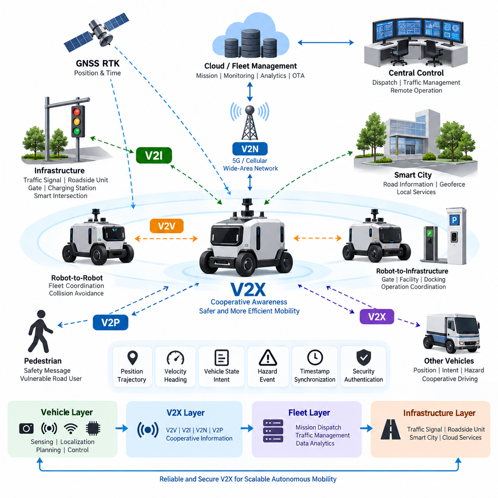
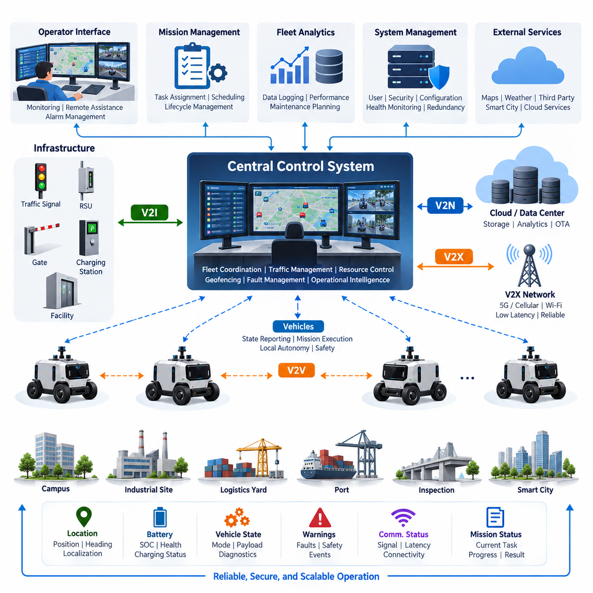
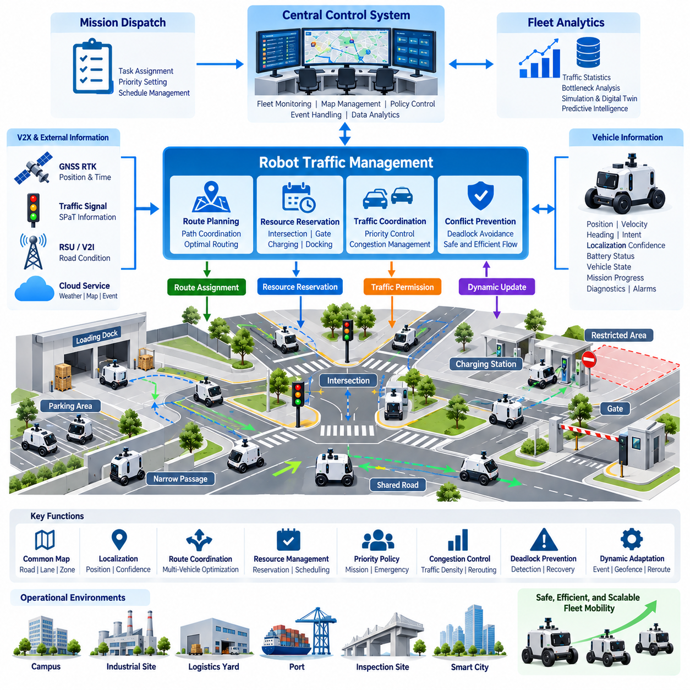
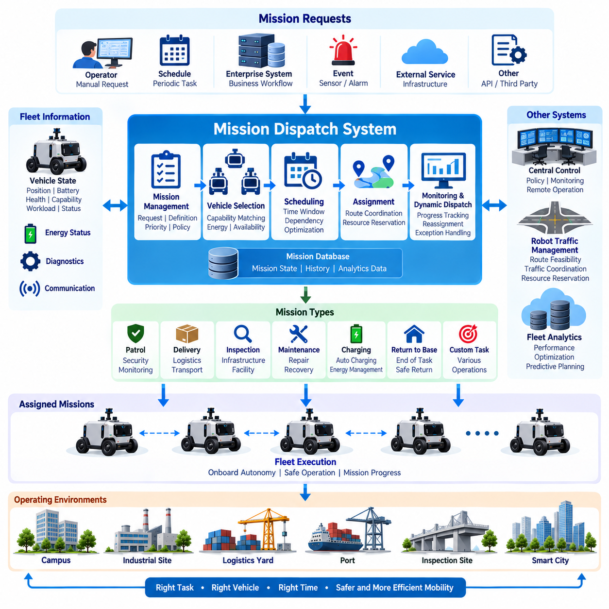
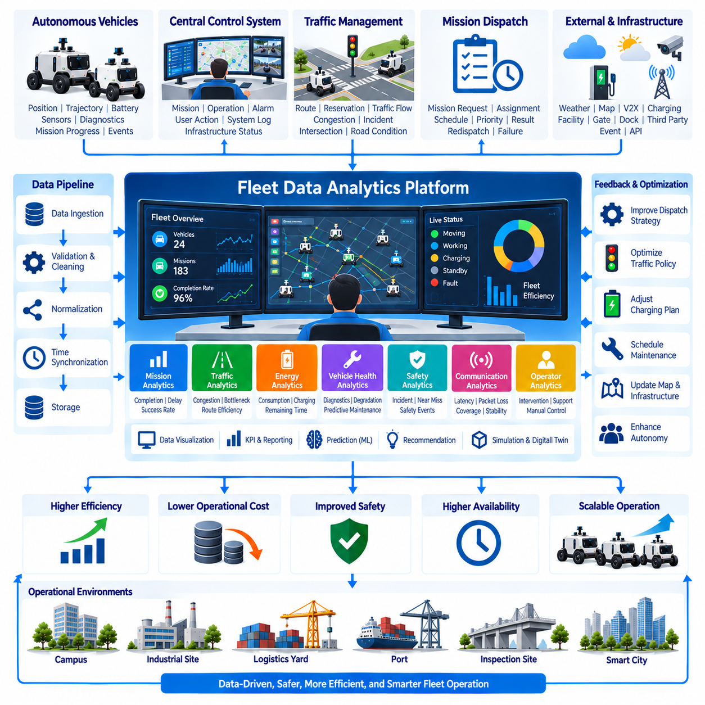

**Volume 17 Outdoor Autonomous Vehicle**

# Chapter 04. Fleet Management

## 04.01. V2X Communication

{width="7.268055555555556in" height="7.268055555555556in"}

Vehicle-to-Everything communication enables an outdoor autonomous vehicle to exchange operational information with other vehicles, roadside infrastructure, fleet systems, network services, and potentially vulnerable road users. Within the fleet-management structure, V2X should be treated as a cooperative information layer rather than as a replacement for onboard perception. It extends the vehicle's awareness beyond the physical range and line of sight of cameras, LiDAR, radar, GNSS, and other local sensors.

The conventional V2X model includes Vehicle-to-Vehicle, Vehicle-to-Infrastructure, Vehicle-to-Network, and Vehicle-to-Pedestrian communication. For outdoor autonomous robots and AMRs, this concept can be expanded to include Robot-to-Robot and Robot-to-Infrastructure interactions. A vehicle may exchange position, velocity, heading, trajectory intent, operational state, detected hazards, and mission information with nearby cooperative systems while maintaining independent local safety functions.

V2V communication is particularly useful when multiple autonomous vehicles operate within the same road, campus, industrial complex, logistics yard, port, or smart-city environment. Vehicles can periodically distribute their location, motion state, planned path, braking status, and abnormal conditions. Such cooperative awareness allows another vehicle to anticipate conflicts before they become directly observable, improving intersection handling, convoy coordination, overtaking decisions, and fleet-level collision avoidance.

V2I communication connects autonomous vehicles with fixed infrastructure such as roadside units, traffic signals, gates, parking systems, charging stations, security systems, and smart intersections. Infrastructure can provide signal phase and timing information, road restrictions, work-zone conditions, gate authorization, or localized hazard information. The vehicle can simultaneously report its approach, estimated arrival time, requested passage, or operational status, creating bidirectional coordination between mobility systems and infrastructure.

V2N communication extends connectivity through cellular or other wide-area networks to fleet-management servers, cloud platforms, edge servers, and remote operation centers. Unlike short-range cooperative messages, network communication supports broader operational functions such as mission updates, fleet status synchronization, map distribution, telemetry collection, software management, and remote diagnostics. A practical architecture therefore separates latency-critical cooperative messages from higher-level fleet and data services according to their timing requirements.

Communication technology must be selected according to operating environment, coverage, latency, reliability, mobility, and infrastructure availability. Cellular V2X and 5G-based communication can support direct or network-assisted connectivity, while Wi-Fi and private industrial wireless networks may be appropriate inside controlled sites. Outdoor AMRs may consequently use multiple communication paths simultaneously, selecting or combining links according to mission criticality rather than depending on a single wireless technology.

V2X data should be represented in a common spatial and temporal context. Position coordinates, timestamps, heading conventions, velocity vectors, object identifiers, and vehicle states must have unambiguous definitions so that information generated by one participant can be interpreted correctly by another. GNSS RTK is especially valuable in outdoor fleet environments because centimeter-level positioning can improve the consistency of shared vehicle locations, planned trajectories, geofenced areas, and intersection conflict calculations.

Time synchronization is equally important because cooperative information loses value when its age is unknown. Each message should contain sufficient timing information to distinguish a current state from delayed or stale data. GNSS-derived time, Precision Time Protocol, or other synchronized clocks can establish a common temporal reference across vehicles and infrastructure. Receiving systems should evaluate message age, communication latency, update interval, and synchronization uncertainty before using remote information for planning or control.

The communication stack should distinguish safety-related state exchange from ordinary telemetry. Compact, frequently updated messages describing position, velocity, heading, braking, trajectory, or hazards require predictable delivery behavior, whereas logs, images, diagnostic records, and analytics data can tolerate greater delay. Quality-of-Service mechanisms can prioritize critical traffic, reserve bandwidth, limit congestion, and prevent high-volume payloads such as video streams from interfering with essential cooperative messages.

V2X must also tolerate packet loss, variable latency, temporary disconnection, and network handover. An autonomous vehicle cannot assume that remote information will always be available. Local perception, localization, planning, and minimal-risk functions must continue operating when connectivity deteriorates. Received V2X information should therefore have validity periods and confidence attributes, while stale information is discarded or downgraded. This fail-operational philosophy prevents communication failure from becoming an immediate loss of autonomous safety capability.

Fleet management creates another important V2X layer because information from individual vehicles can be aggregated into a shared operational picture. A central control system may distribute missions, traffic constraints, temporary geofences, blocked routes, charging priorities, or emergency commands. Vehicles can return localization quality, battery state, mission progress, fault status, communication quality, and detected environmental events. This relationship connects V2X directly with central control, robot traffic management, mission dispatch, and fleet data analytics.

Robot traffic management can exploit cooperative communication to reduce congestion and resolve path conflicts before vehicles physically approach one another. Instead of allowing every robot to negotiate only through local sensing, the fleet system can reserve intersections, narrow corridors, loading zones, or shared road segments. Vehicles publish their intended movement and receive permissions or revised trajectories. Distributed local collision avoidance remains active as a protective layer if central coordination becomes unavailable or inconsistent.

Cybersecurity is fundamental because V2X messages can influence autonomous decisions. Communication endpoints should authenticate legitimate participants, protect message integrity, control authorization, and detect replay, spoofing, or abnormal traffic. Encryption may be required for confidential fleet and operational information, while identity and certificate mechanisms establish trust between vehicles, infrastructure, and servers. Security monitoring should also identify compromised nodes whose messages are syntactically valid but behaviorally inconsistent with surrounding observations.

Trust management must extend beyond conventional network security. A correctly authenticated vehicle can still transmit inaccurate information because of sensor failure, localization error, software defects, or compromised internal systems. The receiving vehicle should therefore compare communicated information with onboard perception, map constraints, historical behavior, and reports from other participants. V2X becomes most robust when communicated data is treated as another evidence source whose confidence is continuously evaluated rather than as unquestionable ground truth.

A layered outdoor-vehicle architecture can place V2X between onboard autonomy and fleet-level intelligence. The vehicle layer performs sensing, localization, prediction, planning, and control; the cooperative layer exchanges nearby mobility information; the fleet layer coordinates missions and traffic; and the infrastructure layer connects traffic signals, gates, smart-city devices, and operational services. This organization preserves autonomous independence while enabling progressively broader cooperation across the operating environment.

For Physical AI systems, V2X can evolve beyond exchanging conventional vehicle states. Autonomous machines may communicate detected objects, semantic events, traversability conditions, predicted trajectories, task intentions, and selected representations of environmental understanding. A patrol robot detecting smoke, a damaged road surface, an obstacle, or unsafe human activity could distribute the event to nearby robots and the control center, allowing the fleet to adapt missions and routes without requiring every robot to rediscover the condition independently.

The final engineering objective is therefore not maximum connectivity but dependable cooperative autonomy. V2X should increase situational awareness, coordination efficiency, and fleet intelligence while preserving safe behavior during communication degradation or complete network loss. When combined with GNSS RTK, onboard perception, Drive-by-Wire, safety architecture, central control, robot traffic management, mission dispatch, and fleet analytics, it becomes a core communication foundation for scalable outdoor autonomous vehicle operations.

## 04.02. Central Control System

{width="7.268055555555556in" height="7.268055555555556in"}

A central control system provides the supervisory coordination layer for a fleet of outdoor autonomous vehicles operating across campuses, industrial complexes, logistics yards, ports, inspection sites, and smart-city environments. It maintains a unified operational view of vehicles, missions, infrastructure, communication links, and environmental events while allowing each vehicle to retain the onboard autonomy required for localization, perception, planning, control, and immediate safety response.

The fundamental design principle is separation between supervisory control and real-time vehicle control. Steering, braking, obstacle avoidance, emergency stopping, and other latency-critical functions should remain onboard because their safe execution cannot depend on continuous network availability. The central system instead manages higher-level objectives such as mission assignment, route constraints, operational priorities, traffic coordination, geofences, charging schedules, fleet policies, and responses to abnormal events.

Each autonomous vehicle continuously reports a structured operational state to the control system. Typical information includes vehicle identity, position, heading, velocity, localization confidence, current mission, route progress, operating mode, battery state, payload condition, communication quality, sensor health, diagnostic status, and active warnings. By aggregating these states, the central platform converts many independently operating machines into a coordinated fleet whose condition can be understood from a common operational picture.

Vehicle state information must be normalized before fleet-level decisions are made. Different vehicle types may have different sensors, payloads, drive systems, maximum speeds, battery capacities, or mission capabilities. A common fleet data model therefore defines standardized representations for availability, health, location, mission state, faults, safety conditions, and resource capacity. Vehicle-specific information can remain available as extensions without forcing every fleet-management function to understand individual hardware implementations.

Mission management transforms operational requests into executable tasks. A request may involve patrol, logistics delivery, infrastructure inspection, security monitoring, material transport, charging, or return-to-base operation. The central system evaluates vehicle availability, location, capability, battery level, payload requirements, route accessibility, and current workload before selecting an appropriate vehicle. The resulting mission is transmitted with sufficient parameters for the onboard autonomy system to generate and execute detailed motion behavior.

Mission execution should be represented as a controlled lifecycle rather than as a single command. A task may progress through requested, assigned, accepted, executing, paused, completed, failed, or cancelled states. Both the vehicle and central system must maintain consistent interpretations of these transitions. Explicit mission states improve recovery from network interruptions and system restarts because the platform can determine whether a task should continue, be reassigned, return to a checkpoint, or require operator intervention.

The central control system also supports robot traffic management by maintaining awareness of planned routes and shared resources. Intersections, narrow passages, loading areas, gates, elevators, charging stations, and restricted zones can be treated as managed resources. The system may issue access permissions, route priorities, temporary reservations, or alternate paths to reduce congestion and prevent predictable conflicts. Local collision avoidance remains active onboard as an independent protection mechanism when central coordination is delayed or unavailable.

Geofencing provides a practical mechanism for expressing operational boundaries and dynamic restrictions. Permanent geofences may represent approved operating areas, pedestrian-sensitive regions, speed-limited zones, hazardous areas, or prohibited spaces. Temporary geofences can be generated for construction, accidents, security events, weather conditions, or emergency operations. Updated restrictions should be distributed to affected vehicles with version and validity information so that each vehicle can determine whether its local operational constraints are current.

Communication architecture should support multiple information classes with different timing and reliability requirements. Mission commands, safety-related notifications, traffic permissions, telemetry, diagnostics, maps, logs, and video streams should not compete as equivalent traffic. Quality-of-Service policies can prioritize control and operational messages while allocating separate resources to high-bandwidth data. The central system must also detect degraded connectivity and adapt its expectations according to communication quality rather than assuming uninterrupted links.

V2X communication complements central control by providing cooperative information between vehicles, infrastructure, and network services. Nearby vehicles may exchange immediate motion information directly, while the central platform maintains broader fleet context and distributes strategic decisions. Infrastructure such as traffic signals, gates, charging stations, roadside units, and smart-city services can also participate. This creates a hierarchy in which local autonomy, cooperative V2X, fleet coordination, and infrastructure management operate together without requiring one layer to perform every function.

Remote operation is an important supervisory capability but should be clearly separated from ordinary autonomous operation. Operators may need to inspect vehicle status, acknowledge faults, pause missions, authorize recovery actions, modify objectives, or assist when autonomous behavior cannot resolve an unusual situation. Remote assistance should provide sufficient perception and diagnostic context for informed decisions while preventing casual operator commands from bypassing established vehicle-level safety constraints.

Human-machine interface design is therefore critical to effective central control. Operators need concise representations of fleet status rather than unrestricted streams of raw sensor information. Maps can display vehicle positions, missions, routes, geofences, infrastructure, alarms, and communication conditions, while dashboards summarize availability, battery levels, faults, mission completion, and utilization. Alarm prioritization should distinguish conditions requiring immediate intervention from warnings that can be handled through maintenance or routine operational procedures.

Fault management requires correlation across vehicle, communication, mission, and infrastructure information. A stopped vehicle may result from an obstacle, localization degradation, low battery, actuator failure, network interruption, safety event, or blocked route. The control system should preserve contextual information surrounding the event and classify the operational impact. Recovery may involve mission retry, route replanning, vehicle reassignment, controlled return, maintenance dispatch, remote assistance, or transition to a predefined safe operational state.

The architecture should avoid creating the central platform as a single point of failure. Vehicles must preserve essential autonomous and safety functions during server failure or communication loss. Central services can use redundant servers, persistent databases, replicated message brokers, health monitoring, and failover mechanisms according to deployment requirements. When connectivity returns, state reconciliation is required so that missions, reservations, vehicle status, and operational records converge without producing duplicate commands or conflicting assignments.

Cybersecurity must be integrated into every control path because the central system has authority over multiple autonomous machines. Vehicles, operators, servers, and infrastructure endpoints require authenticated identities and controlled permissions. Commands should be protected against unauthorized modification, replay, and impersonation, while sensitive operational information should receive appropriate confidentiality protection. Audit records should preserve significant commands, configuration changes, operator actions, authentication events, and security anomalies for later investigation.

Data logging transforms central control from a real-time coordination system into a source of fleet intelligence. Mission histories, trajectories, energy consumption, fault events, communication quality, intervention frequency, route delays, charging behavior, and vehicle utilization can be stored for fleet data analytics. These records support maintenance planning, route optimization, performance benchmarking, operational policy refinement, and identification of recurring system weaknesses. This directly connects central control with the subsequent fleet analytics functions in the architecture.

Scalability requires the architecture to remain manageable as the fleet grows from a few vehicles to tens, hundreds, or potentially thousands of heterogeneous autonomous machines. Event-driven communication, hierarchical control regions, distributed services, edge processing, and selective data transmission can reduce unnecessary centralized workload. The system should process operationally meaningful state changes rather than attempting to continuously centralize every raw sensor measurement produced by every vehicle.

In Physical AI fleets, central control can evolve from conventional monitoring toward shared machine intelligence. Vehicles may report semantic observations, environmental conditions, detected hazards, traversability information, predicted conflicts, and task-level outcomes. The fleet platform can aggregate these observations into a shared operational representation and redistribute relevant knowledge to other robots. Consequently, experience acquired by one autonomous machine can influence the planning and mission behavior of the wider fleet.

The ultimate objective is coordinated autonomy rather than centralized dependency. The central control system should provide fleet-wide visibility, mission orchestration, traffic coordination, resource management, remote supervision, fault handling, and operational intelligence while preserving safe independent behavior at the vehicle level. Together with V2X communication, robot traffic management, mission dispatch, and fleet data analytics, it forms the supervisory backbone required for scalable and dependable outdoor autonomous vehicle operations.

## 04.03. Robot Traffic Management

{width="7.268055555555556in" height="7.268055555555556in"}

Robot Traffic Management coordinates the movement of multiple autonomous robots and vehicles that share roads, intersections, narrow passages, loading areas, inspection routes, and other constrained resources. Within an outdoor autonomous vehicle fleet, it operates between individual vehicle autonomy and central fleet supervision. Its purpose is not to replace onboard navigation, but to prevent predictable conflicts and improve the overall efficiency, safety, and scalability of coordinated fleet movement.

Each robot remains responsible for local perception, localization, trajectory generation, obstacle avoidance, and immediate safety actions. The traffic-management layer works at a broader spatial and temporal scale by observing where robots are located, where they intend to travel, and which shared resources they will require. This separation allows vehicles to react rapidly to nearby hazards while the fleet system manages traffic patterns that cannot be optimized effectively from the perspective of a single robot.

A common operational map provides the spatial foundation for robot traffic management. Roads, lanes, intersections, corridors, parking areas, loading zones, charging stations, gates, restricted regions, and mission-specific work areas can be represented as navigable segments and managed resources. Each segment may contain attributes such as direction, speed limit, vehicle restrictions, capacity, priority, and temporary availability, enabling the traffic system to reason about both geometric routes and operational constraints.

Vehicle localization must be sufficiently consistent for reliable fleet coordination. Outdoor systems can combine GNSS RTK, IMU, LiDAR, cameras, maps, and other localization sources to estimate vehicle position and heading. The traffic manager does not necessarily require raw sensor measurements; instead, it receives a standardized vehicle state containing position, velocity, heading, localization confidence, route progress, and operating status. Confidence information is important because traffic decisions based on uncertain localization can create incorrect reservations or conflict predictions.

Route coordination begins when a robot receives a mission requiring movement from its current position to one or more destinations. The onboard planner may calculate a feasible path, while the traffic manager evaluates how that path interacts with other vehicles and shared resources. Alternatively, the central system can provide route constraints or preferred corridors and allow the vehicle to generate detailed trajectories locally. This division preserves vehicle autonomy while enabling fleet-wide optimization of movement.

Intersections are among the most important managed resources because several robots may request access simultaneously. Instead of allowing vehicles to enter solely according to local arrival conditions, the traffic manager can evaluate arrival time, mission priority, vehicle size, stopping distance, current reservations, and surrounding traffic. It then grants passage, delays entry, or assigns an alternative sequence. The vehicle still verifies that the intersection is physically safe before entering, even when central permission has been received.

Reservation-based control is useful for narrow roads, single-lane passages, loading docks, gates, elevators, charging stations, and other resources that cannot safely support unrestricted simultaneous access. A robot requests a resource for an estimated time interval, and the system checks existing reservations before granting access. Reservations should include expiration and recovery rules because delayed, stopped, or disconnected vehicles must not indefinitely block resources that other robots need.

Deadlock prevention becomes increasingly important as fleet density grows. Two or more robots can reach configurations in which each waits for a resource occupied or reserved by another. The traffic-management system can reduce this risk by controlling resource acquisition order, maintaining escape areas, limiting entry into constrained regions, or requiring a complete sequence of critical resources to be available before a robot proceeds. Deadlock detection should also identify abnormal waiting patterns and initiate controlled recovery when prevention mechanisms are insufficient.

Traffic priority should reflect operational requirements rather than simple first-come, first-served behavior. Emergency patrol, safety response, medical support, time-critical logistics, low-battery return, or fault recovery missions may require higher priority than routine transportation. Priority policies must nevertheless prevent starvation of lower-priority vehicles. Dynamic priority adjustment, waiting-time consideration, and mission deadlines can provide balanced traffic behavior while maintaining predictable fleet performance.

Congestion management extends traffic coordination beyond direct collision conflicts. A route may be geometrically available but operationally inefficient because too many robots are approaching the same corridor, intersection, charging area, or loading zone. The system can estimate traffic density and expected delay, then distribute vehicles across alternative routes or delay noncritical departures. Such behavior improves fleet throughput because optimizing every robot for its individually shortest path does not necessarily produce the shortest completion time for the fleet.

Dynamic obstacles and temporary restrictions require continuous adaptation. Construction areas, parked vehicles, human activity, damaged roads, weather hazards, emergency zones, or failed robots may make previously valid routes unusable. A vehicle detecting such a condition can report the event to the central system, which may establish a temporary geofence, modify segment availability, or redistribute traffic. Other robots can then avoid the affected area before they encounter the same obstruction locally.

V2X communication can strengthen traffic management by allowing vehicles and infrastructure to exchange cooperative state information. Vehicles may communicate position, velocity, heading, braking state, intended movement, and hazard events, while roadside infrastructure can provide traffic-signal, gate, road-condition, or intersection information. Direct cooperative communication is particularly useful when network latency or central connectivity is degraded, but it should complement rather than eliminate local perception and independent safety behavior.

Communication failure must not create an unsafe traffic condition. If a vehicle loses connection to the central traffic manager, it should continue operating according to predefined degraded-mode rules based on its onboard perception and safety architecture. Depending on the operational environment, it may complete a reserved segment, reduce speed, stop before entering controlled resources, continue to a safe waiting point, or transition toward a minimal-risk condition. Central reservations associated with disconnected vehicles require timeout and reconciliation mechanisms.

Robot traffic management must also consider heterogeneous vehicle characteristics. A fleet may contain compact patrol robots, inspection vehicles, logistics AMRs, towing platforms, and heavier autonomous vehicles with different dimensions, turning radii, braking distances, speeds, payloads, and terrain capabilities. Route and reservation decisions should therefore use vehicle-specific constraints. A corridor suitable for one robot may be inaccessible to another, and the safe time separation between vehicles may vary significantly according to their dynamic characteristics.

Safety architecture remains independent from traffic optimization. A centrally authorized trajectory or reservation must never override emergency stopping, obstacle avoidance, speed protection, geofence enforcement, or other vehicle-level safety mechanisms. If onboard perception detects a pedestrian or unexpected obstacle inside a reserved corridor, the robot must respond locally even if doing so violates the planned schedule. The traffic system subsequently adapts reservations and routes to the resulting operational state.

The central control system provides the supervisory environment in which traffic management operates. It maintains fleet state, missions, vehicle availability, communication status, geofences, infrastructure conditions, and operator commands. Robot traffic management converts this broader information into movement coordination decisions, while mission dispatch determines what work each robot should perform. This creates a logical progression from mission assignment to traffic coordination, vehicle execution, and fleet data analysis.

Traffic-management events should be logged for later analysis. Useful records include route assignments, resource reservations, intersection waiting times, congestion events, rerouting frequency, deadlock recovery, communication interruptions, emergency stops, and mission delays. Fleet analytics can use these records to identify bottlenecks, improve road topology, adjust priority policies, reposition charging resources, and estimate how additional robots would affect system throughput before the physical fleet is expanded.

Simulation and digital-twin environments can further support traffic-management engineering by reproducing large fleets and difficult traffic scenarios without exposing physical vehicles to unnecessary risk. Engineers can evaluate intersection policies, reservation algorithms, communication delays, congestion behavior, deadlocks, fleet density, and abnormal vehicle states under repeatable conditions. Simulation results can then guide parameter selection and scenario-based validation before updated policies are introduced into operational sites.

As Physical AI fleets evolve, traffic management can progress from deterministic route coordination toward predictive fleet intelligence. The system can estimate future congestion, predict conflicts before reservation requests occur, learn recurring traffic patterns, and anticipate mission demand. Semantic environmental information reported by robots may also influence routing decisions, allowing the fleet to reason about human activity, surface conditions, accessibility, risk, and mission context rather than relying only on geometric path availability.

The ultimate objective of Robot Traffic Management is coordinated mobility at fleet scale. It combines shared maps, vehicle state, route planning, reservations, priorities, congestion control, V2X information, infrastructure status, and safety constraints to enable many autonomous machines to share operational space efficiently. Together with V2X Communication, Central Control, Mission Dispatch, and Fleet Data Analytics, it forms a fundamental component of scalable outdoor autonomous vehicle fleet management.

## 04.04. Mission Dispatch System

{width="7.268055555555556in" height="7.268055555555556in"}

A Mission Dispatch System converts operational objectives into structured assignments that can be executed by individual autonomous vehicles within a coordinated fleet. In the fleet-management architecture, it connects high-level service requests with vehicle availability, Robot Traffic Management, Central Control, and onboard autonomy. Its primary role is to determine which vehicle should perform each task, when execution should begin, and what operational constraints must accompany the mission.

A mission represents more than a destination coordinate. It may describe patrol, logistics delivery, infrastructure inspection, security monitoring, material transport, charging, recovery, or return-to-base activity. Each mission can contain origin and destination information, intermediate waypoints, required capabilities, payload conditions, priority, time constraints, operating zones, completion criteria, and exception policies. This structured definition allows different mission types to use a common dispatch framework.

Mission requests can originate from human operators, scheduled workflows, enterprise systems, sensor events, infrastructure platforms, or other fleet services. A patrol request may be generated periodically, while an inspection mission may follow a maintenance schedule. An emergency event can create an immediate high-priority mission. The dispatch system normalizes these requests into a common mission representation before evaluating vehicles, resources, traffic conditions, and operational priorities.

Vehicle selection requires continuous knowledge of fleet state. The dispatcher evaluates vehicle position, availability, operating mode, battery state, payload configuration, health condition, communication quality, current workload, and mission capability. Vehicle geometry and mobility characteristics may also matter when routes contain narrow passages, terrain restrictions, or controlled infrastructure. The objective is therefore not simply to select the nearest robot, but to select the most appropriate operational resource.

Capability matching becomes essential in heterogeneous fleets. A patrol robot equipped with surveillance sensors, an inspection vehicle carrying specialized measurement equipment, a logistics AMR with cargo capacity, and a towing platform may share the same management system while serving different purposes. Missions should specify required capabilities in a machine-readable form so that the dispatcher can eliminate unsuitable vehicles before evaluating distance, availability, energy, traffic, and scheduling factors.

Battery and energy conditions directly influence dispatch decisions. A nearby vehicle with insufficient remaining energy may be a worse candidate than a more distant vehicle with adequate operating margin. The system can estimate mission energy demand from travel distance, expected duration, payload, terrain, auxiliary equipment, and return requirements. Dispatch policies should preserve sufficient reserve energy for safe completion, charging access, recovery behavior, or return to an approved operating location.

Priority management determines how competing missions use limited fleet resources. Routine logistics, scheduled inspection, security patrol, emergency response, maintenance recovery, and charging requirements may have different operational importance. High-priority missions can preempt or delay lower-priority work when permitted by policy. However, repeated priority changes should be controlled because excessive preemption can reduce fleet efficiency and leave ordinary missions indefinitely waiting for execution.

Scheduling adds the temporal dimension to mission dispatch. Some tasks should begin immediately, while others must occur within specified time windows or follow recurring schedules. Missions may also contain dependencies in which one operation cannot begin until another has completed. The dispatcher must therefore consider estimated travel time, task duration, charging requirements, resource availability, traffic conditions, and existing commitments when constructing an executable fleet schedule.

Mission allocation should interact closely with Robot Traffic Management. A vehicle may be operationally suitable for a task but unable to reach the destination efficiently because of congestion, restricted zones, reserved intersections, blocked roads, or unavailable infrastructure. The dispatch system can request route feasibility and estimated travel cost before confirming an assignment. Traffic management subsequently coordinates movement while the dispatch system remains responsible for the task-level objective and mission lifecycle.

The mission lifecycle should use explicit states that remain understandable across vehicles and central services. Typical states include requested, queued, assigned, accepted, executing, paused, completed, failed, cancelled, and recovery-required. State transitions should be associated with timestamps and relevant context. This enables operators and software services to distinguish a mission waiting for resources from one that has stopped because of a vehicle fault, communication failure, traffic condition, or external event.

Mission acceptance establishes a clear handover between fleet-level dispatch and vehicle-level autonomy. After receiving an assignment, the vehicle verifies that the request is compatible with its current state, local safety constraints, maps, capabilities, and available resources. It may accept the mission, reject it with a reason, or request modification. Central assignment authority should therefore not force a vehicle to execute an operation that its onboard safety or diagnostic functions determine to be invalid.

During execution, the vehicle reports mission progress rather than requiring the dispatcher to control every movement. Progress information can include current phase, route completion, waypoint status, task result, estimated completion time, energy consumption, delays, and detected exceptions. The onboard autonomy system remains responsible for perception, localization, trajectory planning, obstacle avoidance, and real-time control, while the dispatch system supervises whether the higher-level mission objective is progressing as expected.

Dynamic redispatch is required when operational conditions change. A vehicle may experience a fault, become delayed by traffic, encounter a blocked route, lose communication, consume more energy than expected, or become unavailable for safety reasons. The system can pause the mission, reassign unfinished work, select another vehicle, change priority, modify the schedule, or generate a recovery task. Redispatch should preserve completed mission progress whenever possible rather than restarting the entire workflow.

Multi-robot missions introduce additional coordination requirements. Some operations may require several vehicles to arrive at related locations, execute tasks in sequence, share transport workload, or maintain coordinated coverage of a large area. The dispatcher must represent dependencies between subtasks and determine whether vehicles should operate sequentially, concurrently, or cooperatively. Robot Traffic Management then coordinates their physical movement while the mission system manages task relationships and completion logic.

Infrastructure resources can also become part of mission planning. Gates, loading docks, inspection stations, charging facilities, parking areas, elevators, and controlled work zones may have limited capacity or scheduled availability. A mission should not be dispatched solely because a vehicle is ready if a required downstream resource is unavailable. Integrating resource reservations with scheduling reduces unnecessary waiting and prevents multiple vehicles from being assigned to resources that cannot serve them simultaneously.

Communication interruptions require persistent mission state and deterministic recovery rules. Both the central system and vehicle should retain enough information to determine what was assigned and how far execution progressed before connectivity was lost. Depending on policy, the vehicle may continue a previously authorized mission, stop at a safe location, finish the current segment, or enter a minimal-risk condition. When communication returns, state reconciliation prevents duplicate execution or contradictory assignments.

Cybersecurity is critical because mission commands can directly influence where autonomous vehicles travel and what activities they perform. Mission requests, assignments, cancellations, priority changes, and operator overrides should originate from authenticated and authorized sources. Important dispatch actions should be protected against modification, replay, duplication, and impersonation. Audit logs should preserve mission creation, assignment decisions, operator actions, vehicle responses, state transitions, failures, and recovery activities.

Mission histories provide valuable input to Fleet Data Analytics. Assignment delay, travel time, execution duration, completion rate, energy consumption, vehicle utilization, queue length, redispatch frequency, operator intervention, and failure causes can reveal weaknesses in fleet operation. Historical information can improve scheduling parameters, vehicle selection policies, charging strategies, resource placement, and fleet sizing while providing quantitative evidence for future operational optimization.

As Physical AI systems evolve, mission dispatch can move from rule-based assignment toward predictive and context-aware orchestration. Fleet intelligence may anticipate future task demand, predict vehicle availability, estimate congestion, recognize environmental conditions, and select resources before requests become urgent. Semantic events detected by one robot can automatically create missions for another, allowing perception, fleet intelligence, and physical action to form a closed operational loop.

The ultimate objective of the Mission Dispatch System is to transform fleet resources into coordinated task execution while preserving safe vehicle autonomy. By integrating mission definition, capability matching, scheduling, priority management, energy awareness, resource reservation, lifecycle control, redispatch, and analytics, it ensures that the right autonomous machine performs the right task at the appropriate time. Together with V2X Communication, Central Control, Robot Traffic Management, and Fleet Data Analytics, it forms a core operational layer of scalable outdoor autonomous vehicle fleets.

## 04.05. Fleet Data Analytics

{width="7.268055555555556in" height="7.268055555555556in"}

Fleet Data Analytics transforms operational records generated by autonomous vehicles, central control services, traffic management, mission dispatch, and infrastructure into information that can improve fleet performance. Within an outdoor autonomous vehicle architecture, analytics provides the feedback layer that converts completed operations into measurable knowledge. It allows engineers and operators to understand not only what happened, but why it happened and how future operations can be improved.

The analytics pipeline begins with systematic data collection from every relevant fleet component. Vehicles can provide position, velocity, trajectory, battery state, energy consumption, localization confidence, sensor health, diagnostic events, communication quality, safety events, and mission progress. Central systems add mission assignments, traffic reservations, operator actions, infrastructure status, route decisions, alarms, and recovery activities, creating a comprehensive operational history.

A common data model is necessary because heterogeneous vehicles may generate different telemetry structures, diagnostic codes, sensor outputs, and operating states. Standardized identifiers, timestamps, coordinate systems, mission states, fault categories, and vehicle attributes allow information from multiple platforms to be compared consistently. Vehicle-specific data can remain available as extensions while core fleet metrics use normalized definitions across the entire autonomous system.

Time synchronization is particularly important when reconstructing events involving several distributed systems. A braking event recorded by a vehicle, a communication delay detected by the network, and a traffic-management command generated by the server may represent different parts of the same incident. GNSS-derived time, Precision Time Protocol, or synchronized system clocks allow these records to be aligned so that causal sequences and system interactions can be analyzed accurately.

Raw fleet data should pass through validation and preprocessing before being used for operational decisions. Missing records, duplicated messages, impossible coordinates, inconsistent timestamps, corrupted values, and abnormal sampling intervals can distort analytical results. Data-quality indicators should therefore accompany important datasets. Cleaning does not mean hiding faults; original records should remain traceable so that unusual behavior can be distinguished from acquisition or communication errors.

Mission analytics evaluates how effectively the fleet performs assigned work. Important measurements include assignment delay, mission start time, completion time, success rate, cancellation rate, travel distance, waiting time, operator intervention, redispatch frequency, and failure causes. These measurements can be analyzed by vehicle, mission type, operating area, time period, or environmental condition to reveal whether poor performance originates from individual machines or broader operational policies.

Traffic analytics focuses on how efficiently multiple autonomous vehicles share the operating environment. Route histories, intersection waiting times, reservation conflicts, congestion levels, rerouting events, deadlocks, emergency stops, and blocked segments can identify systematic bottlenecks. The results can support modifications to road topology, traffic priorities, intersection policies, parking locations, loading zones, and resource reservations before additional vehicles increase traffic density.

Energy analytics connects vehicle utilization with battery and charging behavior. State of charge, energy consumption per mission, idle consumption, charging duration, charging frequency, route energy cost, payload effects, and auxiliary equipment usage can be compared across operating conditions. These measurements help determine whether battery capacity, charging infrastructure, dispatch policies, or route selection limits fleet productivity and can support more accurate prediction of remaining operational time.

Vehicle health analytics uses diagnostic and operational data to identify degradation before it becomes a service-disrupting failure. Motor current, temperature, battery behavior, actuator response, communication errors, vibration, sensor availability, fault codes, and repeated warning patterns can provide evidence of emerging problems. Trend analysis allows maintenance to move from purely reactive repair toward condition-based and eventually predictive maintenance when sufficient historical data is available.

Communication analytics measures the quality of links connecting vehicles, V2X participants, central services, and infrastructure. Packet loss, latency, jitter, bandwidth usage, disconnection frequency, handover behavior, signal quality, and message age can be correlated with location and mission performance. Spatial communication maps can identify coverage weaknesses and determine whether operational delays or safety-related degraded modes are associated with particular network regions.

Safety analytics should preserve both actual incidents and precursor events. Emergency stops, near conflicts, obstacle-avoidance activations, localization degradation, geofence violations, safety-system interventions, communication loss, operator takeover, and transitions to minimal-risk conditions can reveal patterns that ordinary mission-success statistics overlook. Repeated precursors may indicate a systemic weakness even when no collision or major failure has occurred.

Operator interaction provides another important analytical dimension. Remote assistance requests, manual mission changes, alarm acknowledgements, recovery commands, overrides, and intervention duration can reveal where autonomous behavior still depends heavily on human support. A decreasing intervention rate may indicate improving autonomy, while repeated intervention at the same location or mission phase can identify scenarios requiring better perception, planning, maps, infrastructure, or operational policies.

Data visualization converts complex fleet records into information that operators and engineers can interpret quickly. Dashboards may present vehicle availability, mission completion, energy status, traffic congestion, faults, communication quality, utilization, and safety indicators. Geographic visualization can overlay trajectories, delays, events, and communication conditions on operational maps, while time-series views help reveal degradation, recurring congestion, or performance changes over days and months.

Fleet performance should be evaluated through carefully defined key performance indicators rather than isolated measurements. Utilization, mission throughput, completion rate, mean mission duration, energy per task, charging ratio, mean time between failures, intervention frequency, traffic delay, and availability can provide complementary perspectives. Metrics must be interpreted together because maximizing a single indicator, such as utilization or speed, may reduce energy efficiency, maintenance margin, or safety.

Historical analytics can support capacity planning as the number of autonomous vehicles increases. Existing mission demand, traffic density, charging utilization, waiting time, and vehicle productivity can be used to estimate whether adding robots will increase throughput or simply create congestion. This analysis can also identify when additional charging stations, loading areas, communication infrastructure, maintenance resources, or traffic-control capacity should be deployed before physical fleet expansion.

Simulation and digital twins can use fleet analytics as a source of realistic operating parameters. Recorded traffic distributions, mission frequencies, vehicle speeds, energy consumption, fault patterns, and waiting times can initialize simulation scenarios that more closely reproduce actual field conditions. Engineers can then evaluate alternative fleet sizes, dispatch strategies, intersection rules, charging layouts, and infrastructure changes without disrupting live operations.

Machine learning can extend analytics from descriptive reporting toward prediction. Models may estimate mission duration, remaining energy, traffic congestion, component degradation, communication quality, or probability of mission failure using historical fleet data. Predictive results should include confidence information and remain subject to operational constraints, because uncertain statistical estimates should not automatically override deterministic safety rules or validated vehicle-level protections.

Prescriptive analytics goes one step further by recommending actions based on predicted conditions. The platform may suggest redistributing vehicles, changing mission priorities, modifying routes, scheduling charging, reserving maintenance windows, or repositioning resources. Recommendations can initially remain advisory for operators and later support automated optimization when their behavior has been sufficiently validated. This creates a progression from observing operations to predicting outcomes and optimizing future decisions.

Cybersecurity and data governance are essential because fleet datasets can contain operational routes, infrastructure information, vehicle identities, diagnostic records, video references, and operator activities. Access control, authentication, encryption, retention policies, audit trails, and data integrity mechanisms should protect analytical information throughout its lifecycle. Training datasets and derived models also require version management so that analytical results remain reproducible and traceable.

Analytics should maintain a closed feedback relationship with Central Control, Robot Traffic Management, and Mission Dispatch. Mission histories can improve vehicle assignment, traffic records can refine route policies, energy analysis can change charging schedules, and maintenance predictions can remove degrading vehicles from future assignments. The value of analytics therefore comes not only from dashboards but from systematically converting evidence into better operational policies.

In a Physical AI fleet, analytics can evolve toward shared operational intelligence. Semantic observations from multiple robots can be combined with trajectories, mission outcomes, infrastructure conditions, and environmental events to construct a richer representation of how the physical environment behaves. Knowledge learned from repeated operations can then influence planning, dispatch, traffic coordination, maintenance, and future autonomous behavior across the entire fleet.

The ultimate objective of Fleet Data Analytics is continuous fleet improvement through measurable evidence. By integrating mission, traffic, energy, health, communication, safety, operator, and infrastructure data, the system can progress from descriptive analytics to diagnostic, predictive, and prescriptive intelligence. Together with V2X Communication, Central Control, Robot Traffic Management, and Mission Dispatch, it completes the feedback loop required for scalable, efficient, safe, and increasingly intelligent outdoor autonomous vehicle fleet operation.
