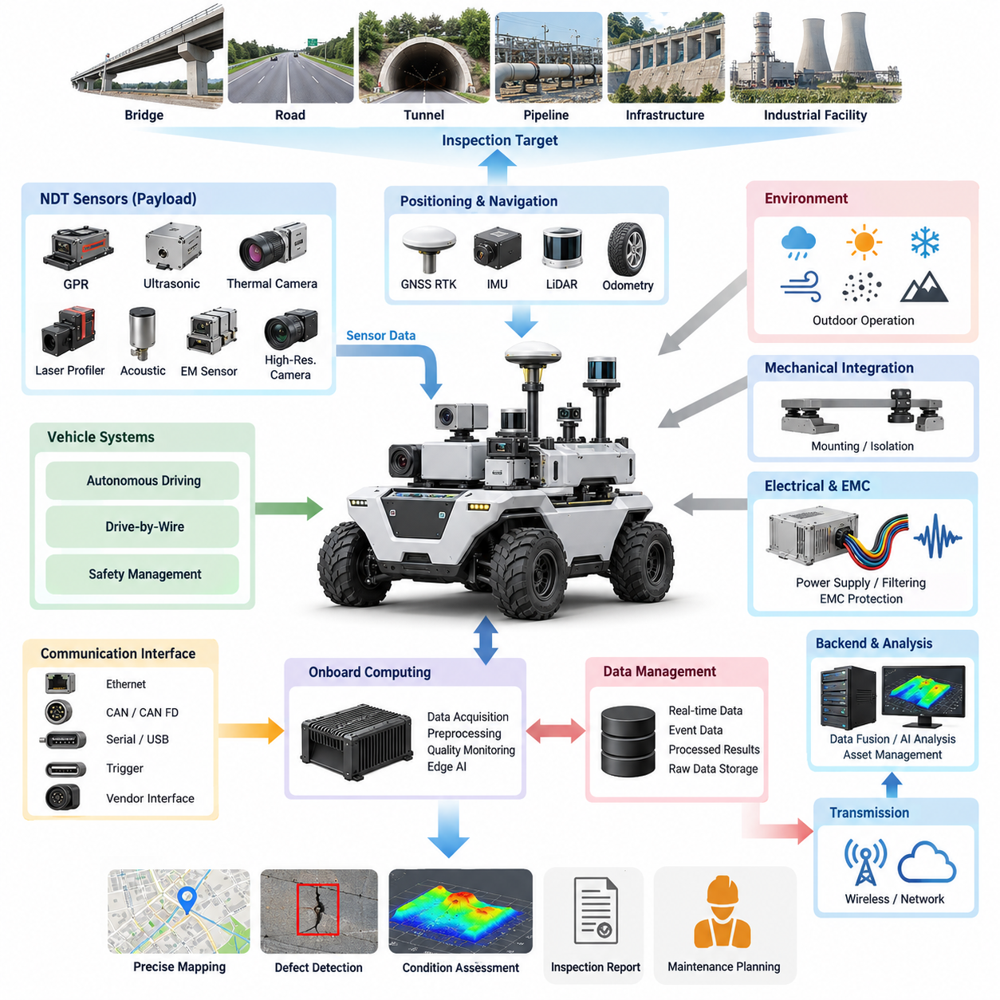
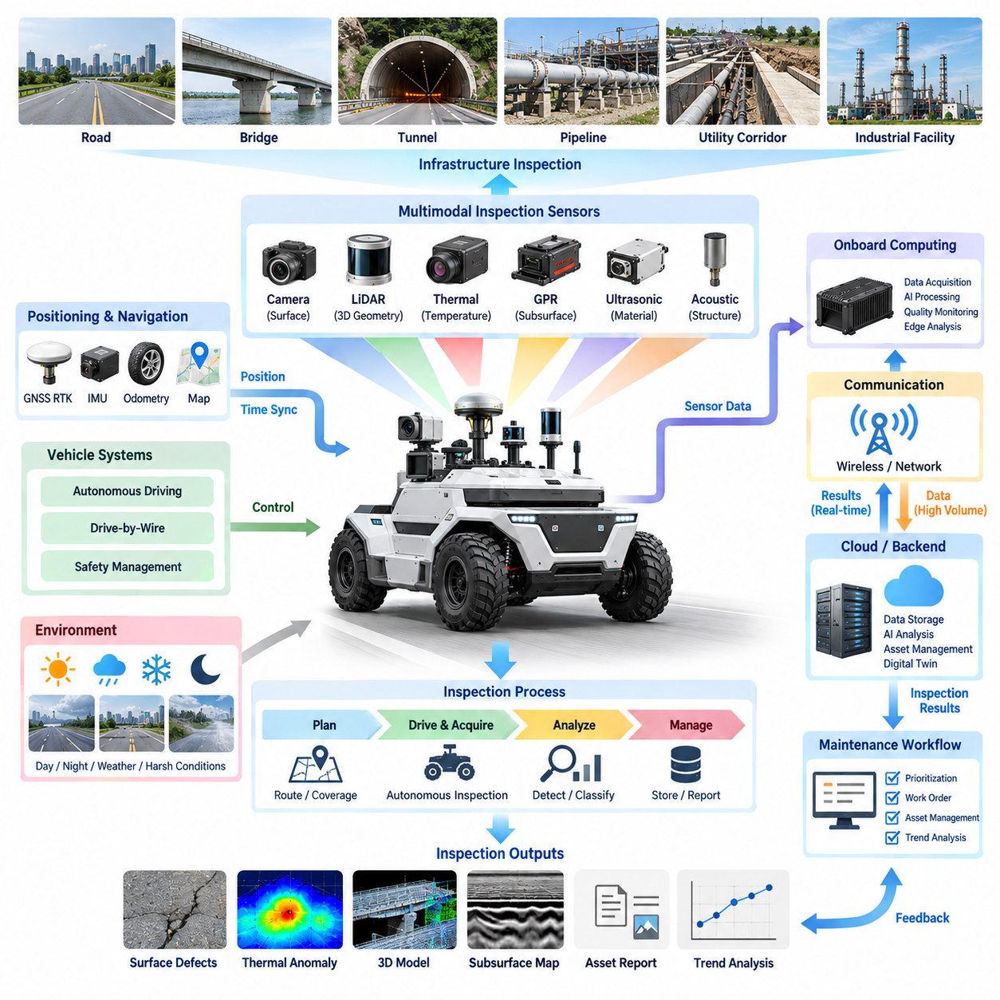
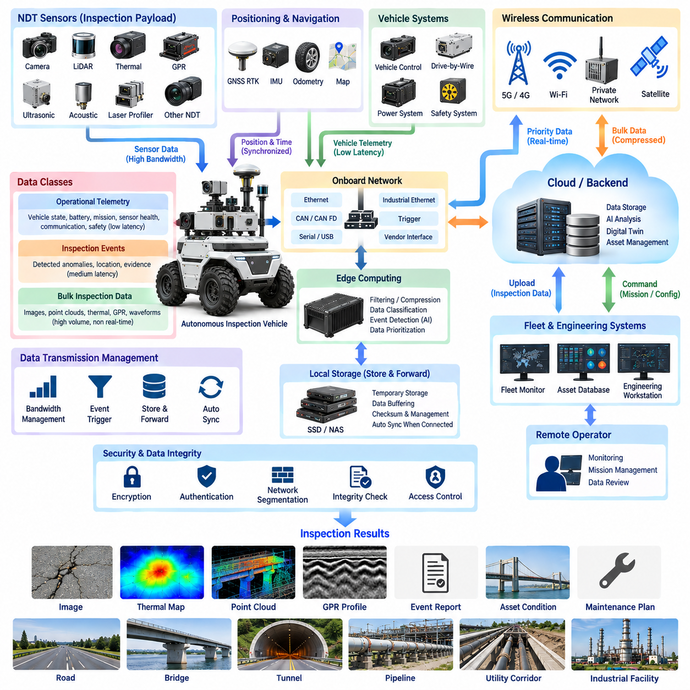
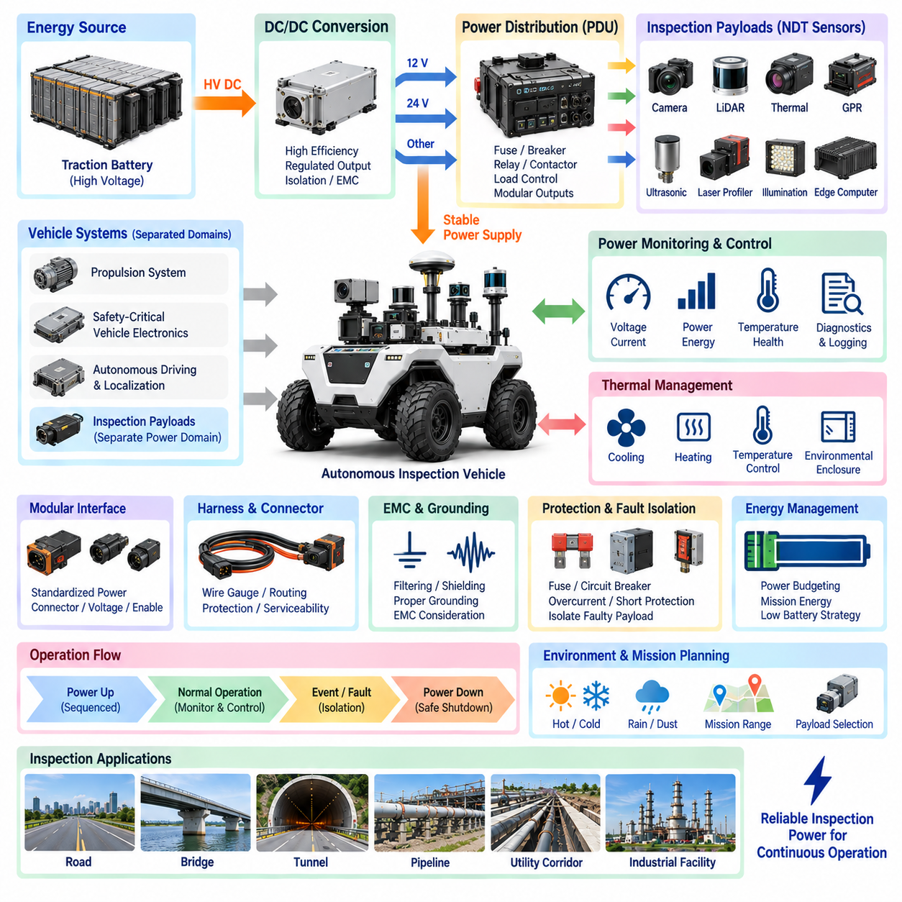
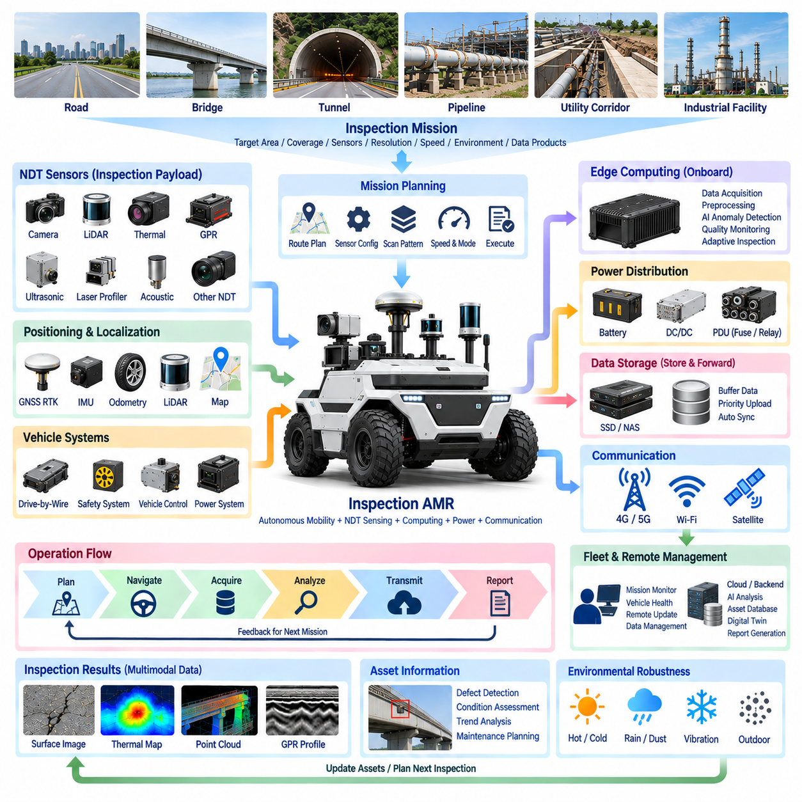

**Volume 17 Outdoor Autonomous Vehicle**

# Chapter 05. Inspection Vehicle

## 05.01. NDT Sensor Integration

{width="7.268055555555556in" height="7.268055555555556in"}

비파괴검사(NDT, Non-Destructive Testing) 센서 통합은 실외 자율주행 점검 차량(Outdoor Autonomous Inspection Vehicle)을 단순한 이동형 관측 플랫폼에서 검사 대상 구조물을 손상시키지 않고 인프라 상태를 평가할 수 있는 측정 시스템(Measurement System)으로 전환한다. 점검 차량 아키텍처(Inspection Vehicle Architecture)에서 NDT 센서는 특수 목적 페이로드(Specialized Payload)로 동작하며, 차량 주행, 위치추정, 컴퓨팅, 전력, 통신 및 안전 기능과 체계적으로 연계되어야 한다.

일반적인 인지 센서(Perception Sensor)가 주로 위치추정(Localization)과 장애물 탐지(Obstacle Detection)에 사용되는 것과 달리, NDT 센서는 구조 건전성(Structural Integrity), 재료 상태(Material Condition), 형상(Geometry), 열적 거동(Thermal Behavior), 지하 또는 내부 이상(Subsurface Anomaly)과 관련된 물리적 특성을 측정한다. 대표적인 점검 페이로드에는 지표투과레이더(GPR, Ground-Penetrating Radar), 초음파 장치(Ultrasonic Device), 열화상 카메라(Thermal Camera), 레이저 프로파일러(Laser Profiler), 음향 센서(Acoustic Sensor), 전자기 계측기(Electromagnetic Instrument), 고해상도 영상 시스템(High-Resolution Imaging System) 등이 포함될 수 있으며, 검사 대상과 요구되는 탐지 깊이에 따라 적절한 센서를 선택한다.

센서 통합은 측정 원리(Measurement Principle)와 차량 움직임(Vehicle Motion) 사이의 관계를 정의하는 것에서 시작한다. 일부 장비는 차량이 연속적으로 주행하는 동안에도 신뢰성 있는 데이터를 획득할 수 있지만, 다른 장비는 일정한 속도, 일정한 센서-표면 거리(Sensor-to-Surface Distance), 안정적인 자세 또는 일시적인 정차가 필요하다. 따라서 자율주행 시스템(Autonomous Driving System)은 NDT 페이로드를 차량 경로계획(Trajectory Planning)과 독립적으로 운용하는 것이 아니라 검사 요구조건을 임무 제약조건(Mission Constraint)으로 처리해야 한다.

기계적 통합(Mechanical Integration)은 측정 품질에 직접적인 영향을 미친다. 실외 차량에 장착된 센서는 진동(Vibration), 충격(Shock), 차체 변형(Chassis Deformation), 서스펜션 움직임(Suspension Movement), 변화하는 노면 형상의 영향을 받는다. 장착 구조물은 민감한 장비를 보호하면서 요구되는 시야(Field of View), 이격거리(Standoff Distance), 정렬(Alignment), 강성(Rigidity)을 유지해야 한다. 진동 절연 장치(Isolation Mechanism)는 유해 진동을 감소시킬 수 있지만, 지나친 유연성은 센서 자체의 움직임을 발생시켜 공간 정확도를 저하시키거나 교정(Calibration)을 어렵게 만들 수 있다.

전기적 통합(Electrical Integration)은 각 장비에 정격전압(Nominal Voltage)을 공급하는 것만으로 충분하지 않다. NDT 페이로드에는 송신기(Transmitter), 고속 데이터 수집 전자장치(High-Speed Acquisition Electronics), 히터(Heater), 조명장치(Illumination Device), 모터 또는 처리장치(Processing Unit)가 포함될 수 있어 전력 요구량이 크게 변동할 수 있다. 전용 전원 분기(Dedicated Power Branch), 적절한 회로 보호(Circuit Protection), 접지(Grounding), 필터링(Filtering), 제어된 기동 순서(Controlled Startup Sequence)를 적용하면 페이로드에서 발생한 전기적 교란이 항법, 드라이브 바이 와이어(DBW, Drive-by-Wire), 안전 및 컴퓨팅 시스템으로 전파되는 것을 방지할 수 있다.

전자파 적합성(EMC, Electromagnetic Compatibility)은 능동형 NDT 장비가 위성항법시스템(GNSS) 수신기, 통신 무선장치, 카메라, 라이다(LiDAR), 차량 제어기 및 대전류 모터 구동장치 근처에서 작동할 때 특히 중요하다. 지표투과레이더(GPR)와 같은 능동형 측정장비는 광대역 전자기 에너지(Broadband Electromagnetic Energy)를 발생시킬 수 있으며, 인버터(Inverter)와 직류변환기(DC/DC Converter)는 민감한 검사 신호에 잡음을 유입시킬 수 있다. 따라서 물리적 이격, 케이블 차폐(Cable Shielding), 접지 전략, 필터링 및 동기화된 운용 모드(Synchronized Operating Mode)를 시스템 수준에서 고려해야 한다.

정확한 검사를 위해서는 모든 측정값이 신뢰할 수 있는 공간 및 시간 기준(Spatial and Temporal Reference)과 연결되어야 한다. 위성항법 실시간 이동측위(GNSS RTK)는 실외 절대 위치를 제공할 수 있으며, 관성측정장치(IMU), 휠 오도메트리(Wheel Odometry), 라이다 위치추정(LiDAR Localization), 차량 상태정보는 위성 신호 수신이 저하되는 상황에서 위치 연속성을 지원할 수 있다. NDT 데이터 획득 시각은 위치추정 타임라인(Localization Timeline)과 정렬되어야 하며, 이를 통해 탐지된 이상을 대략적인 차량 위치가 아니라 정확한 인프라 좌표에 매핑할 수 있다.

다수의 검사 센서를 융합할수록 시간 동기화(Time Synchronization)의 중요성은 더욱 커진다. 열적 이상(Thermal Anomaly), 레이더 반사(Radar Reflection), 표면 균열 영상(Surface Crack Image), 레이저 기반 형상 결함(Laser-Derived Geometric Defect)은 동일한 물리적 위치를 설명하면서도 서로 다른 인터페이스와 처리 파이프라인을 통해 입력될 수 있다. 하드웨어 타임스탬프(Hardware Timestamp), 동기화 클록(Synchronized Clock), 결정론적 획득 트리거(Deterministic Acquisition Trigger), 네트워크 기반 동기화(Network-Based Synchronization)를 사용하면 이러한 이종 측정값을 공통 임무 타임라인(Common Mission Timeline)에서 재구성할 수 있다.

교정(Calibration)은 센서 자체의 고유 특성뿐 아니라 각 NDT 장치와 차량 좌표계(Vehicle Coordinate System) 사이의 기하학적 관계를 포함해야 한다. 장착 위치, 방향, 센서 원점(Sensor Origin), 측정축(Measurement Axis), 유효 센싱 영역(Effective Sensing Footprint)을 정의된 좌표 변환(Transform)으로 표현해야 한다. 센서 브래킷 수준에서는 작아 보이는 교정 오차도 도로, 터널, 교량, 지하 시설물 통로 등 대규모 인프라에 측정값을 투영할 때 상당한 위치 오차로 확대될 수 있다.

차량 탑재 컴퓨팅 아키텍처(Onboard Computing Architecture)는 실시간 데이터 획득(Real-Time Acquisition)과 계산량이 큰 해석 작업을 분리하는 것이 바람직하다. 로컬 엣지 컴퓨터(Local Edge Computer)는 차량 주행 중 원시 센서 스트림(Raw Sensor Stream)을 수집하고 타임스탬프, 품질 모니터링, 압축, 초기 필터링 및 이상 선별(Anomaly Screening)을 수행할 수 있다. 이후 고부하 재구성(Reconstruction), 다중모달 융합(Multimodal Fusion), 과거 데이터 비교 또는 인공지능 기반 결함 분류(AI-Based Defect Classification)는 고성능 온보드 컴퓨팅이나 백엔드 인프라(Backend Infrastructure)에서 수행할 수 있다.

NDT 장비의 통신 인터페이스(Communication Interface)는 매우 다양하다. 산업용 이더넷(Industrial Ethernet), 기가비트 이더넷(Gigabit Ethernet), CAN, CAN FD, 직렬통신(Serial Communication), USB, 트리거 신호선(Trigger Line), 제조사 전용 인터페이스가 하나의 점검 차량 안에서 함께 사용될 수 있다. 각 장비를 응용 소프트웨어에 직접 연결하기보다는 통합 계층(Integration Layer)을 구성하여 센서 상태, 타임스탬프, 측정 메타데이터(Measurement Metadata), 진단정보 및 데이터 전송을 표준화하면서 엔지니어링 분석에 필요한 원시 측정 데이터에 대한 접근성을 유지하는 것이 바람직하다.

점검 데이터(Inspection Data)는 일반적인 차량 텔레메트리(Vehicle Telemetry)보다 훨씬 큰 데이터 용량을 생성할 수 있다. 고해상도 영상, 열화상 시퀀스(Thermal Sequence), 레이더 프로파일(Radar Profile), 포인트 클라우드(Point Cloud), 파형 데이터(Waveform Data)는 장시간 임무 동안 지속적으로 축적된다. 따라서 아키텍처는 실시간 운용 데이터, 이벤트 기반 진단정보(Event-Triggered Diagnostic Information), 처리된 검사 결과 및 보관용 원시 데이터(Archival Raw Data)를 구분해야 한다. 로컬 버퍼링(Local Buffering)을 적용하면 일시적인 통신 단절로 인해 검사 기록에 복구할 수 없는 데이터 공백이 발생하는 것을 방지할 수 있다.

데이터 품질 모니터링(Data Quality Monitoring)은 임무 종료 후에만 수행하는 것이 아니라 데이터 획득 과정에서 실시간으로 수행해야 한다. 시스템은 프레임 누락, 과도한 진동, 센서 유효범위 이탈, 온도 한계, 동기화 오류, GNSS 성능 저하, 통신 장애 또는 비정상적인 신호 통계 변화를 평가할 수 있다. 측정 품질이 정의된 임계값 이하로 떨어지면 차량은 속도를 낮추거나 해당 구간을 반복 주행하고, 경로를 수정하거나 해당 영역을 재검사 대상(Reinspection Target)으로 표시할 수 있다.

센서 융합(Sensor Fusion)은 NDT 측정값을 서로 독립적인 채널이 아니라 통합된 정보로 해석할 때 더 큰 가치를 제공한다. 표면 영상은 가시적인 열화를 탐지하고, 열 센싱(Thermal Sensing)은 비정상적인 열 분포를 파악하며, 형상 프로파일링(Geometric Profiling)은 변형을 정량화하고, 지하 또는 내부 센싱(Subsurface Sensing)은 숨겨진 불연속이나 결함을 탐지할 수 있다. 이러한 관측값을 차량 위치 및 인프라 지도와 결합하면 자산 상태(Asset Condition)를 공간적으로 일관된 형태로 표현할 수 있다.

자율 점검(Autonomous Inspection)을 위해서는 임무 인지형 경로 생성(Mission-Aware Trajectory Generation)도 필요하다. 최적의 주행 경로가 항상 최적의 센싱 경로인 것은 아니다. 검사 계획은 측정 기술에 따라 주행 간격(Lane Spacing), 스캔 중첩(Scanning Overlap), 센서 방향, 최대 속도, 최소 회전반경, 반복 주행 또는 진행 방향 제약조건을 요구할 수 있다. 따라서 임무 계획기(Mission Planner)는 자율주행과 안전 제약조건을 만족하면서 검사 커버리지 요구사항(Inspection Coverage Requirement)을 실행 가능한 차량 경로로 변환해야 한다.

이동 기능(Mobility)과 검사 기능(Inspection)의 기능적 분리(Functional Separation)는 고장 격리(Fault Containment)를 위해 중요하다. NDT 센서의 고장은 일반적으로 조향, 제동, 장애물 탐지 또는 비상정지 기능을 직접 손상시키지 않고 검사 기능만 저하시켜야 한다. 반대로 위치추정이나 차량 제어에 문제가 발생하면 검사 데이터가 신뢰할 수 있는 공간 측정값으로 잘못 제시되지 않도록 해야 한다. 명확한 상태 건전성(Health State)과 고장 전파 규칙(Fault Propagation Rule)을 정의하면 측정 기능 고장과 차량 안전 기능 고장을 구분할 수 있다.

환경 내구성(Environmental Robustness)은 실험실 수준의 센싱 기술을 실제 현장 검사에 적용할 수 있는지를 결정하는 핵심 요소이다. 실외 NDT 페이로드는 비, 먼지, 진흙, 온도 변화, 직사광선, 결로, 진동, 전자기 간섭 및 불규칙한 지형에 노출될 수 있다. 인클로저(Enclosure), 커넥터(Connector), 광학 윈도(Optical Window), 열관리(Thermal Management), 배수구조(Drainage), 세정 장치(Cleaning Mechanism), 장착 보호구조는 센서 사양과 차량의 목표 운용환경을 함께 고려하여 설계해야 한다.

잘 통합된 점검 차량은 최초 센서 관측에서 최종 결함 기록(Defect Record)에 이르는 추적성(Traceability)을 유지해야 한다. 각 검사 결과에는 센서 식별정보, 교정 상태, 획득 시각, 차량 자세 및 위치(Vehicle Pose), 처리 버전(Processing Version), 신뢰도 또는 품질 지표, 관련 원시 데이터 참조정보가 유지되어야 한다. 이러한 추적성은 엔지니어링 검토, 반복 검사, 추세 분석(Trend Analysis), 유지보수 의사결정 및 인공지능 기반 결함 분류 결과의 검증을 지원한다.

따라서 NDT 센서 통합(NDT Sensor Integration)의 최종 목표는 여러 검사 장비를 자율주행 차량에 단순히 장착하는 것이 아니다. 센싱, 이동, 위치추정, 시간 동기화, 전력, 컴퓨팅, 통신, 교정, 진단 및 데이터 관리가 하나의 시스템으로 협조하여 동작하는 통합 측정 아키텍처(Integrated Measurement Architecture)를 구축하는 것이다. 이러한 아키텍처는 이후 점검 차량 장에서 다루는 인프라 점검(Infrastructure Inspection), 데이터 전송(Data Transmission), 검사 페이로드 전력(Payload Power), 점검 자율이동로봇(Inspection AMR) 기능을 구현하기 위한 기술적 기반이 된다.

## 05.02. Infrastructure Inspection

{width="7.268055555555556in" height="7.268055555555556in"}

실외 자율주행 차량(Outdoor Autonomous Vehicle)을 활용한 인프라 점검(Infrastructure Inspection)은 이동성, 센싱, 위치추정 및 자동화된 분석을 결합하여 도로, 교량, 터널, 파이프라인, 유틸리티 통로, 산업시설 및 기타 토목 자산(Civil Asset)의 상태를 평가한다. 점검 차량 아키텍처(Inspection Vehicle Architecture)에서 차량은 사전에 정의된 점검 경로와 운용 제약조건을 준수하면서 지리적으로 참조된 증거(Geographically Referenced Evidence)를 반복적으로 수집할 수 있는 데이터 획득 플랫폼(Data-Acquisition Platform)이 된다.

점검 프로세스(Inspection Process)는 인프라 유지보수 목표(Infrastructure Maintenance Objective)를 측정 가능한 점검 요구사항(Inspection Requirement)으로 변환하는 것에서 시작한다. 서로 다른 자산에는 서로 다른 관측이 필요하다. 도로 표면은 균열, 러팅(Rutting), 침하 및 지하 상태 평가가 필요할 수 있으며, 교량은 구조물 표면 영상, 열적 평가, 기하학적 변형 측정 및 국부적인 재료 검사가 필요할 수 있다. 따라서 차량 임무는 무엇을 측정하고, 어디에서 측정하며, 어느 정도의 공간 해상도(Spatial Resolution)가 필요한지를 정의해야 한다.

자율 이동성(Autonomous Mobility)은 측정 경로를 체계적으로 반복할 수 있다는 점에서 수동 운전 점검 플랫폼보다 중요한 장점을 제공한다. 위성항법 실시간 이동측위(GNSS RTK), 관성측정장치(IMU), 라이다 위치추정(LiDAR Localization), 휠 오도메트리(Wheel Odometry), 인프라 지도(Infrastructure Map)를 결합하여 점검 중 차량 자세 및 위치(Vehicle Pose)를 유지할 수 있다. 정확한 위치추정을 통해 서로 다른 센서와 서로 다른 점검 시점에서 수집한 관측값을 동일한 물리적 위치에 연결할 수 있으며, 이를 기반으로 시간에 따른 상태 변화를 분석할 수 있다.

점검 경로 계획(Inspection Route Planning)은 일반적인 지점 간 자율주행(Point-to-Point Autonomous Navigation)과 다르다. 차량은 센서별 속도, 방향, 간격 및 중첩 조건을 유지하면서 필요한 인프라 표면을 포괄해야 한다. 도로 점검 임무에서는 사전에 정의된 차선을 따라 평행 주행이 필요할 수 있으며, 시설 점검에서는 벽, 파이프, 장비 또는 구조물 경계를 따라 반복적인 경로를 수행해야 할 수 있다. 따라서 점검 범위의 완전성(Coverage Completeness)은 명시적인 임무 성능 요구사항이 된다.

표면 점검(Surface Inspection)은 일반적으로 고해상도 카메라(High-Resolution Camera), 라이다(LiDAR), 레이저 프로파일러(Laser Profiler) 및 관련 광학 센서(Optical Sensor)를 활용한다. 이러한 장치는 균열, 포트홀(Pothole), 표면 열화, 변형, 부품 누락, 부식 관련 시각적 특징 및 기하학적 불규칙성을 식별할 수 있다. 차량 움직임은 영상 선명도와 기하학적 일관성을 유지할 수 있을 정도로 안정적이어야 하며, 조명 및 노출 제어(Illumination and Exposure Control)를 통해 빠르게 변화하는 실외 조명 조건을 보정해야 한다.

열화상 점검(Thermal Inspection)은 가시광 영상만으로는 항상 얻을 수 없는 정보를 추가한다. 온도 패턴(Temperature Pattern)은 인프라와 산업장비에서 비정상 발열, 수분 관련 영향, 단열 문제, 재료 불연속 또는 운용 이상을 나타낼 수 있다. 열 측정값은 태양광, 주변 온도, 바람, 표면 특성 및 점검 시간의 영향을 받으므로 신뢰할 수 있는 해석을 지원하기 위해 환경 정보(Environmental Context)를 열 관측 데이터와 함께 기록해야 한다.

지하 점검(Subsurface Inspection)은 가시적인 인프라 상태를 넘어 점검 능력을 확장한다. 지표투과레이더(GPR, Ground-Penetrating Radar) 및 기타 비파괴검사 센서(NDT Sensor)는 지하 구조물, 포장층, 공동(Void), 불연속부, 매설 물체 또는 재료 경계에 관한 정보를 제공할 수 있다. 이러한 측정값은 차량 위치와 정밀하게 동기화되어야 하며, 이를 통해 탐지된 지하 이상(Subsurface Anomaly)을 독립적인 센서 신호가 아니라 공간적으로 참조된 점검 결과(Spatially Referenced Inspection Result)로 표현할 수 있다.

3차원 점검(Three-Dimensional Inspection)은 인프라 형상을 정량적으로 평가할 수 있도록 한다. 라이다와 레이저 프로파일링(Laser Profiling)은 도로 형상, 구조물 변형, 여유 공간(Clearance), 변위 및 치수 변화를 표현하는 포인트 클라우드(Point Cloud) 또는 표면 프로파일(Surface Profile)을 생성할 수 있다. 반복적인 조사 결과를 일관된 좌표 프레임워크(Coordinate Framework)에 정합하면 서로 다른 점검 시점 사이의 차이를 통해 개별 영상만으로는 쉽게 확인하기 어려운 점진적인 열화나 기하학적 움직임을 탐지할 수 있다.

인프라 점검에는 단일 센서만으로 모든 결함 메커니즘(Defect Mechanism)을 특성화할 수 없기 때문에 다중모달 센싱(Multimodal Sensing)이 필요한 경우가 많다. 가시광 카메라, 열 센서, 라이다, GPR, 음향 장치(Acoustic Device) 및 기타 NDT 장비는 서로 다른 물리적 특성을 관측한다. 이들의 측정값을 공통 공간 및 시간 기준(Common Spatial and Temporal Reference)을 통해 결합하면 표면 외관, 온도, 형상 및 지하 특성을 인프라 상태의 통합된 표현(Unified Representation)으로 구성할 수 있다.

온보드 처리(Onboard Processing)를 활용하면 차량이 임무를 수행하는 동안 점검 품질을 평가할 수 있다. 엣지 컴퓨팅(Edge Computing)은 센서 가용성, 위치추정 정확도, 영상 품질, 신호 강도, 차량 진동, 점검 범위 및 동기화 상태를 모니터링할 수 있다. 초기 인공지능 모델(Preliminary AI Model)은 잠재적인 이상 또는 의심 영역을 식별할 수 있으며, 이를 통해 차량은 점검 지역을 벗어나기 전에 속도를 낮추거나 추가 주행을 수행하고 더 높은 해상도의 측정 데이터를 수집할 수 있다.

점검 신뢰성(Inspection Reliability)은 실제 인프라 이상과 측정 인공물(Measurement Artifact)을 구별하는 능력에 좌우된다. 불량한 조명, 물, 먼지, 식생, 반사 표면, 진동, GNSS 성능 저하, 일시적인 물체 또는 센서 오염은 오해를 유발하는 관측 결과를 만들 수 있다. 따라서 탐지된 이상에는 품질 지표(Quality Indicator)와 상황 정보(Contextual Information)가 함께 제공되어야 하며, 후속 분석을 통해 해당 결과가 실제 물리적 열화인지, 불확실한 증거인지 또는 유효하지 않은 측정인지 판단할 수 있어야 한다.

점검 차량은 센서 관측값과 검사 대상 인프라 자산 사이의 디지털 관계(Digital Relationship)를 유지해야 한다. 측정값은 도로 구간, 교량 구성요소, 터널 구간, 유틸리티 위치 또는 사전에 정의된 점검 영역과 연결할 수 있다. 이러한 자산 중심의 데이터 구성(Asset-Centered Organization)은 비구조적인 센서 파일 집합보다 훨씬 유용하며, 유지보수 담당자가 실제 인프라 구성요소를 기준으로 점검 이력을 조회할 수 있도록 한다.

반복적인 자율 점검(Repeated Autonomous Inspection)은 일회성 결함 탐지를 넘어 상태 모니터링(Condition Monitoring)을 가능하게 한다. 유사한 경로를 반복적으로 주행하고 일관된 교정 및 위치추정 조건을 유지하면 시스템은 수일, 수개월 또는 수년에 걸쳐 수집된 측정값을 비교할 수 있다. 균열 크기, 표면 변형, 열 패턴, 지하 신호 특성 또는 기하학적 프로파일의 변화를 추세(Trend)로 평가하여 열화 속도와 유지보수 우선순위를 결정하는 근거로 활용할 수 있다.

데이터 관리(Data Management)는 처리된 점검 결과뿐 아니라 향후 검증에 필요한 충분한 원천정보(Source Information)를 보존해야 한다. 저장 용량과 점검 정책에 따라 원시 센서 데이터(Raw Sensor Data)를 선택적으로 보관할 수 있으며, 처리된 결과에는 이상 위치 좌표, 결함 분류, 심각도 지표(Severity Indicator), 영상, 프로파일, 포인트 클라우드 및 신뢰도 값(Confidence Value)이 포함될 수 있다. 각 결과는 데이터 획득 시간, 센서 구성, 교정 상태 및 차량 자세와 위치까지 추적 가능해야 한다.

통신 아키텍처(Communication Architecture)는 점검 정보가 차량에서 원격 엔지니어링 시스템(Remote Engineering System)과 자산관리 시스템(Asset Management System)으로 이동하는 방식을 결정한다. 우선순위가 높은 이벤트와 압축된 점검 요약정보는 운용 중 전송할 수 있으며, 대용량 원시 데이터는 더 높은 대역폭의 통신 연결이 확보될 때까지 온보드 저장장치에 유지할 수 있다. 이러한 분리는 지속적인 무선통신에 대한 의존성을 줄이면서 현장 운용 중에도 중요한 점검 결과를 보고할 수 있도록 한다.

안전(Safety)은 점검 생산성(Inspection Productivity)과 독립적으로 유지되어야 한다. 점검 범위를 확대하기 위해 다른 경로가 유리하더라도 차량은 장애물 회피, 운용 경계, 드라이브 바이 와이어(DBW, Drive-by-Wire) 제한, 비상정지 및 최소위험동작(Minimal-Risk Behavior)을 계속 준수해야 한다. 필요한 점검 경로를 안전하게 수행할 수 없는 경우 임무 관리자(Mission Manager)는 점검 목표를 차량 안전 제약보다 우선시키지 않고 미점검 영역(Incomplete Region)을 기록해야 한다.

환경 조건(Environmental Condition)도 점검 계획에 포함되어야 한다. 비, 눈, 먼지, 표면의 물, 극한 온도, 강한 태양광, 어둠 및 전자기 간섭(Electromagnetic Interference)은 특정 센싱 기술의 효과를 감소시킬 수 있다. 시스템은 환경 제한조건(Environmental Limit)을 활용하여 점검을 정상적으로 진행할지, 낮은 신뢰도로 운용할지, 센싱 모드를 변경할지 또는 적절한 환경 조건이 확보될 때까지 특정 측정을 연기할지를 결정할 수 있다.

인프라 점검 결과는 원시 센서 탐지 결과로 남아 있기보다 엔지니어링 정보(Engineering Information)로 변환될 때 가장 높은 가치를 갖는다. 공간적으로 참조된 이상은 분류되고 우선순위가 결정되며 이전 점검 결과와 비교되고 유지보수 워크플로(Maintenance Workflow)와 연결될 수 있다. 지도와 디지털 자산 기록(Digital Asset Record)은 결함 위치, 범위, 신뢰도, 심각도 및 관련 센서 증거를 제시하여 엔지니어가 정밀 검사 또는 물리적 보수가 필요한 위치를 판단할 수 있도록 한다.

따라서 자율 점검 차량(Autonomous Inspection Vehicle)은 물리적 인프라(Physical Infrastructure)와 지속적으로 변화하는 디지털 상태 기록(Digital Condition Record)을 연결하는 역할을 수행한다. 그 효과는 자율주행이나 개별 센서의 성능에만 의존하는 것이 아니라 체계적인 임무 계획, 반복 가능한 위치추정, 다중모달 센싱, 품질 모니터링, 데이터 추적성 및 체계적인 해석의 통합에 의해 결정된다. 이러한 기반은 동일 장에서 이어지는 데이터 전송(Data Transmission), 점검 페이로드 전력(Inspection-Payload Power), 점검 자율이동로봇 사례 아키텍처(Inspection AMR Case Architecture)와 자연스럽게 연결된다.

## 05.03. Data Transmission Architecture

{width="7.268055555555556in" height="7.268055555555556in"}

데이터 전송 아키텍처(Data Transmission Architecture)는 점검 정보가 실외 자율주행 차량(Outdoor Autonomous Vehicle)에서 온보드 저장장치(Onboard Storage), 플릿 시스템(Fleet System), 엔지니어링 워크스테이션(Engineering Workstation), 엣지 인프라(Edge Infrastructure), 클라우드(Cloud) 또는 온프레미스 플랫폼(On-Premise Platform)으로 이동하는 방식을 정의한다. 점검 차량에서 통신은 단일 무선 링크가 아니라 NDT 센서, 위치추정 장치, 차량 제어기, 컴퓨팅 노드, 저장장치 및 원격 서비스를 연결하면서 데이터 무결성과 운용 연속성을 유지하는 계층형 데이터 경로(Layered Data Path)이다.

아키텍처 설계는 운용 중요도, 지연시간(Latency), 대역폭(Bandwidth), 보존 요구사항(Retention Requirement)에 따라 정보를 분류하는 것에서 시작한다. 차량 제어 및 안전 메시지는 예측 가능한 낮은 지연시간이 요구되는 반면 점검 이벤트는 일정 수준의 지연을 허용할 수 있다. 고해상도 영상, 라이다 포인트 클라우드(LiDAR Point Cloud), 열화상 시퀀스(Thermal Sequence), GPR 프로파일 및 기타 원시 NDT 측정 데이터는 상당한 대역폭을 요구하지만 일반적으로 원격 시스템으로 지속적인 실시간 전송이 필요한 것은 아니다.

이러한 차이에 따라 자연스럽게 여러 데이터 클래스(Data Class)가 구성된다. 실시간 운용 텔레메트리(Real-Time Operational Telemetry)에는 차량 자세 및 위치, 속도, 배터리 상태, 임무 상태, 센서 건전성, 통신 품질 및 안전 상태가 포함된다. 점검 이벤트 데이터(Inspection-Event Data)는 탐지된 이상과 이를 뒷받침하는 증거를 포함하며, 대용량 점검 데이터(Bulk Inspection Data)는 정밀 엔지니어링 분석이나 장기 보관을 주목적으로 하는 원시 영상, 포인트 클라우드, 레이더 프로파일, 파형 및 기타 대용량 기록을 포함한다.

온보드 네트워크(Onboard Network)는 데이터 전송 아키텍처의 첫 번째 단계를 구성한다. NDT 장비와 인지 센서(Perception Sensor)는 기가비트 이더넷(Gigabit Ethernet), 산업용 이더넷(Industrial Ethernet), CAN, CAN FD, 직렬 링크(Serial Link), USB 또는 제조사 전용 인터페이스를 사용할 수 있다. 엣지 게이트웨이(Edge Gateway)와 컴퓨팅 노드는 이러한 이종 연결을 제어 가능한 데이터 스트림으로 표준화하면서 원래 측정 상황을 재구성하는 데 필요한 타임스탬프, 센서 식별정보, 교정 메타데이터 및 진단정보를 보존해야 한다.

이더넷(Ethernet)은 카메라, 라이다, 열화상 시스템 및 첨단 NDT 장비가 대용량 연속 데이터 스트림을 생성할 수 있기 때문에 고대역폭 점검 페이로드(High-Bandwidth Inspection Payload)에 특히 적합하다. CAN 또는 CAN FD는 차량 상태, 액추에이터 피드백, 전력 시스템 상태 및 장치 진단과 같은 소규모의 결정론적 정보(Deterministic Information)에 유용하다. 대용량 센서 트래픽과 제어 중심 통신을 분리하면 네트워크 혼잡을 줄이고 점검 기능과 이동 기능 사이의 간섭을 제한할 수 있다.

데이터가 서로 다른 인터페이스와 컴퓨팅 계층을 통과하는 동안에도 시간 동기화(Time Synchronization)는 유지되어야 한다. 센서 타임스탬프는 공통 시스템 클록(Common System Clock)을 기준으로 하여 점검 측정값을 위성항법 실시간 이동측위(GNSS RTK) 위치, 관성측정장치(IMU) 자세, 라이다 위치추정(LiDAR Localization), 차량 상태와 연결할 수 있어야 한다. 정확한 인프라 매핑은 데이터가 백엔드에 도착한 시간이 아니라 실제 측정이 수행된 위치와 시점에 의존하므로 전송 지연을 데이터 획득 시각으로 오인해서는 안 된다.

엣지 데이터 계층(Edge Data Layer)은 정보가 차량 외부로 전송되기 전에 필터링, 집계(Aggregation), 압축, 인코딩 및 우선순위화를 수행할 수 있다. 원시 센서 스트림을 항상 변경 없이 전송할 필요는 없다. 엣지 컴퓨터는 썸네일, 저해상도 미리보기, 이상 특징정보(Anomaly Descriptor), 압축된 포인트 클라우드, 선택된 GPR 구간 또는 요약된 건전성 정보를 생성하면서 향후 엔지니어링 분석을 위해 원본 고정밀 측정값을 로컬 저장장치에 유지할 수 있다.

저장 후 전달(Store-and-Forward) 방식은 전체 임무 구간에서 무선 통신 연결을 보장할 수 없는 실외 점검 차량에 필수적이다. 터널, 지하 공간, 산업시설, 외곽 도로, 항만 및 밀집된 도시 구조물에서는 외부 통신이 중단될 수 있다. 차량은 통신이 단절된 동안에도 점검 데이터를 지속적으로 수집하여 로컬에 저장하고, 적절한 네트워크 연결이 다시 확보되면 자동으로 데이터 동기화를 재개할 수 있어야 한다.

따라서 로컬 저장장치(Local Storage)는 단순한 아카이브가 아니라 통신 아키텍처의 일부로 기능한다. 구조화된 버퍼(Structured Buffer)는 미전송 데이터, 전송 상태, 우선순위, 타임스탬프, 체크섬(Checksum), 목적지 정보를 관리할 수 있다. 통신 연결이 복구되면 시스템은 이미 전달된 데이터와 아직 전송되지 않은 데이터를 구분하여 불필요한 재전송을 방지하고 점검 정보가 누락될 위험을 줄일 수 있다.

외부 연결(External Connectivity)은 배치 환경에 따라 셀룰러 네트워크(Cellular Network), 프라이빗 5G(Private 5G), 와이파이(Wi-Fi), 산업용 무선 시스템 또는 현장 전용 통신 인프라를 조합하여 사용할 수 있다. 통신 관리자(Communication Manager)는 적절한 경로를 선택하기 전에 링크 가용성, 신호 품질, 지연시간, 대역폭 및 비용을 평가해야 한다. 여러 인터페이스를 동시에 운용하여 중요 텔레메트리는 한 연결을 사용하고 대용량 점검 데이터는 별도의 고대역폭 채널을 통해 전송할 수도 있다.

점검 센서가 무선 네트워크의 전송 속도보다 빠르게 데이터를 생성할 경우 대역폭 관리(Bandwidth Management)가 필수적이다. 모든 데이터를 동일한 우선순위로 처리하는 대신 안전 및 운용 텔레메트리를 가장 우선하고, 그다음으로 경보, 이상 증거, 임무 요약정보, 마지막으로 대용량 원시 데이터 순으로 전송할 수 있다. 이러한 계층 구조를 통해 가용 통신 용량이 온보드 데이터 생성률보다 크게 낮더라도 원격 운영자가 상황 인식(Situational Awareness)을 유지할 수 있다.

이벤트 기반 전송(Event-Triggered Transmission)은 불필요한 네트워크 부하를 더욱 감소시킬 수 있다. 온보드 분석 시스템이 균열, 열적 이상, 지하 특징, 위치추정 문제, 센서 고장 또는 안전 관련 이벤트를 탐지하면 차량은 압축된 이벤트 패키지(Event Package)를 즉시 전송할 수 있다. 여기에는 위치, 타임스탬프, 이벤트 유형, 신뢰도, 센서 상태 및 선택된 근거 데이터가 포함될 수 있으며, 전체 원시 데이터셋은 차량 내부에 계속 저장할 수 있다.

원격 모니터링 시스템(Remote Monitoring System)은 단순한 차량-서버 업로드가 아니라 양방향 통신(Bidirectional Communication)을 필요로 한다. 플릿 또는 관제센터 시스템은 임무 할당, 경로 변경, 점검 파라미터, 소프트웨어 구성 또는 추가 데이터 요청을 차량으로 전송할 수 있다. 차량은 이러한 상위 감독 명령(Supervisory Command)을 저수준 드라이브 바이 와이어(DBW, Drive-by-Wire) 제어와 구분하여 불안정한 광역통신이 결정론적인 로컬 차량 제어와 안전 기능을 직접 손상시키지 않도록 해야 한다.

따라서 통신 장애(Communication Failure)는 임무 불안정이 아니라 제어된 성능 저하(Controlled Degradation)를 유발해야 한다. 자율주행, 안전, 위치추정 및 데이터 저장 기능이 정상적으로 유지된다면 클라우드 연결이 끊어졌다고 해서 반드시 차량을 정지시킬 필요는 없다. 운용 정책과 사용할 수 없게 된 정보의 종류에 따라 차량은 승인된 임무를 계속 수행하거나, 사전에 정의된 제한 모드(Restricted Mode)로 전환하거나, 통신 가능 지역으로 복귀하거나, 최소위험상태(Minimal-Risk Condition)로 전환할 수 있다.

데이터 무결성(Data Integrity)은 전체 전송 경로에서 보호되어야 한다. 시퀀스 식별자(Sequence Identifier), 체크섬, 메시지 인증(Message Authentication), 확인응답 메커니즘(Acknowledgement Mechanism), 재시도 정책(Retry Policy)을 사용하여 손상, 중복, 누락 또는 불완전한 데이터 전송을 탐지할 수 있다. 대용량 점검 데이터셋은 관리 가능한 블록으로 분할하여 네트워크가 중단될 때마다 전체 수 기가바이트 데이터를 처음부터 다시 전송하지 않고 검증된 체크포인트(Verified Checkpoint)부터 전송을 재개할 수 있다.

사이버보안(Cybersecurity)은 점검 차량이 물리적 액추에이터와 중요한 인프라 데이터를 원격 네트워크에 연결한다는 점에서 외부 데이터 전송과 분리할 수 없다. 인증(Authentication), 암호화(Encryption), 인증서 또는 키 관리(Certificate or Key Management), 접근제어(Access Control), 네트워크 분할(Network Segmentation), 보안 인터페이스 및 로깅을 통해 차량으로 전달되는 명령과 외부로 전송되는 점검 정보를 모두 보호해야 한다. 원격 엔지니어링 접근은 명확하게 관리되는 게이트웨이를 통해 안전 필수 제어 영역(Safety-Critical Control Domain)과 분리되어야 한다.

백엔드 아키텍처(Backend Architecture)는 전송된 정보를 수신하여 지속적으로 활용할 수 있는 운용 및 엔지니어링 기록으로 변환한다. 실시간 텔레메트리는 플릿 모니터링 대시보드(Fleet Monitoring Dashboard)에 제공될 수 있으며, 점검 이벤트는 자산 상태 데이터베이스(Asset-Condition Database)와 경보 시스템에 저장될 수 있다. 대용량 데이터셋은 객체 저장소(Object Storage), 네트워크 연결 저장장치(NAS), 온프레미스 서버 또는 클라우드 플랫폼으로 전송하여 AI 분석, 다중모달 융합, 재구성, 디지털 트윈(Digital Twin) 처리 및 과거 데이터 비교를 수행할 수 있다.

효과적인 백엔드 시스템은 전송된 데이터와 실제 점검 임무 사이의 추적성(Traceability)을 유지해야 한다. 센서 기록은 차량 식별정보, 임무 식별자(Mission Identifier), 데이터 획득 타임스탬프, 지리적 위치, 교정 상태, 처리 버전 및 인프라 자산과 연결된 상태로 유지되어야 한다. 이러한 메타데이터를 통해 엔지니어는 분석을 재현하고 반복 점검 결과를 비교하며 AI 판단을 검증하고 보고된 결함이 유효하고 완전한 원천 데이터에서 생성되었는지를 확인할 수 있다.

전체 데이터 전송 아키텍처는 항상 유지되는 고대역폭 연결이 아니라 적응형 파이프라인(Adaptive Pipeline)으로 동작한다. 데이터는 센서에서 생성되고, 온보드에서 동기화 및 처리되며, 중요도에 따라 분류되고, 로컬에 저장된 후 네트워크 상태에 따라 선택적으로 전송된다. 이후 목적지에서 데이터의 무결성이 검증되고 플릿 및 엔지니어링 시스템에 통합된다. 이러한 접근방식은 통신 연결이 간헐적이거나 대역폭이 제한된 환경에서도 신뢰성 높은 인프라 점검을 지원한다.

보다 광범위한 로보틱스 전기전자 아키텍처(Robotics Electrical Architecture)에서 이러한 전송 설계는 점검 센싱(Inspection Sensing)을 온보드 컴퓨팅(Onboard Computing), 로보틱스 통신(Robotics Communication), 플릿 통신(Fleet Communication), 클라우드 통신(Cloud Communication), 시간 동기화(Time Synchronization)와 연결하면서 안전 필수 차량 제어(Safety-Critical Vehicle Control)와의 분리를 유지한다. 또한 이는 점검 차량(Inspection Vehicle) 장에서 이어지는 점검 페이로드 전력(Inspection Payload Power)과 전체 점검 자율이동로봇 사례 아키텍처(Inspection AMR Case Architecture)를 구현하기 위한 통신 기반을 제공한다.

## 05.04. Power for Inspection Payload

{width="7.268055555555556in" height="7.268055555555556in"}

점검 페이로드 전력 아키텍처(Inspection Payload Power Architecture)는 실외 자율주행 차량(Outdoor Autonomous Vehicle)이 추진, 자율주행 또는 안전 기능에 영향을 주지 않으면서 특수 점검 장비에 안정적이고 보호되며 제어 가능한 전기에너지를 공급하는 방식을 정의한다. 점검 차량 아키텍처(Inspection Vehicle Architecture)에서 NDT 센서와 지원 전자장치는 전용 페이로드 영역(Dedicated Payload Domain)을 구성하며, 그 전기적 동작은 차량 수준 전력 분배 시스템(Vehicle-Level Power Distribution System)과 조정되어야 한다.

점검 페이로드(Inspection Payload)는 서로 크게 다른 전기적 특성을 가질 수 있다. 카메라, 라이다(LiDAR), 열 센서(Thermal Sensor), 지표투과레이더(GPR), 초음파 장비(Ultrasonic Equipment), 레이저 프로파일러(Laser Profiler), 조명장치(Illumination Unit), 통신장치, 엣지 컴퓨터(Edge Computer), 환경제어 하드웨어(Environmental-Control Hardware)는 서로 다른 전압과 전류 용량을 요구할 수 있다. 따라서 전력 아키텍처는 정격전압, 평균 소비전력, 피크 전류, 기동 특성, 운용 듀티 사이클(Operating Duty Cycle), 허용 전원 중단시간을 정의하는 전체 부하 목록(Load Inventory)에서 시작해야 한다.

효과적인 설계에서는 추진 시스템(Propulsion), 안전 필수 차량 전자장치(Safety-Critical Vehicle Electronics), 자율주행 시스템(Autonomous-Driving System), 점검 페이로드를 각각 제어된 전기 영역(Controlled Electrical Domain)으로 분리한다. 점검 장비는 일반적으로 조향, 제동, 안전 제어기 또는 필수 위치추정 장치와 보호되지 않은 회로를 공유하기보다 전용 전력 분배 분기(Dedicated Distribution Branch)를 통해 전력을 공급받아야 한다. 이러한 분리는 페이로드의 단락, 과부하 또는 과도 교란이 차량의 핵심 기능을 정지시킬 가능성을 제한한다.

차량 배터리는 일반적으로 주 에너지원(Primary Energy Source)으로 사용되지만 점검 장비에는 구동 전원 버스(Traction Bus)와 다른 전압이 필요할 수 있다. 직류변환기(DC/DC Converter)를 사용하면 주 배터리 시스템으로부터 12 V, 24 V 또는 기타 페이로드 전용 전압과 같은 안정화된 저전압 전원(Regulated Low-Voltage Rail)을 생성할 수 있다. 변환기 선정 시 연속 출력전력, 과도 부하 대응능력, 변환 효율, 열적 특성, 전기적 절연 요구사항, 입력전압 변화 및 전자파 적합성(EMC)을 고려해야 한다.

전력 예산(Power Budgeting)은 순간적인 전기 부하뿐 아니라 임무 전체의 에너지(Mission Energy)를 고려해야 한다. 추진에 필요한 에너지는 차량 속도, 지형, 경사, 페이로드 질량 및 환경 조건에 따라 달라지며, 점검 센서와 컴퓨팅 시스템은 여러 시간 동안 연속적으로 작동할 수 있다. 따라서 임무 계획에서는 사용 가능한 모든 에너지를 이동에 할당하기보다 센싱, 처리, 통신, 열관리, 안전 복귀(Safe Return) 및 비상 운용(Contingency Operation)에 필요한 충분한 배터리 용량을 확보해야 한다.

평균 점검 전력이 비교적 낮더라도 피크 부하(Peak Load)는 중요한 설계 요소가 될 수 있다. 능동형 레이더 또는 GPR 송신기, 히터, 조명 시스템, 모터, 펌프, 고성능 컴퓨터 및 통신장비는 짧은 시간 동안 높은 전류를 요구할 수 있다. 여러 장치가 동시에 기동하면 돌입전류(Inrush Current)로 인해 전압 강하, 변환기 정지, 퓨즈 동작 또는 제어기 재부팅이 발생할 수 있다. 기동 순서 제어(Startup Sequencing)와 부하 스케줄링(Load Scheduling)을 통해 이러한 교란을 감소시킬 수 있다.

제어된 전원 기동 순서(Controlled Power-Up Sequence)를 적용하면 차량이 점검 서브시스템을 예측 가능한 순서로 활성화할 수 있다. 먼저 핵심 차량 전자장치와 안전 기능을 안정화하고, 이후 위치추정 및 컴퓨팅 장비, 통신 시스템, 마지막으로 고전력 점검 페이로드를 활성화할 수 있다. 시스템 종료 시에는 페이로드 전원을 차단하기 전에 데이터 획득을 중지하고 저장장치를 동기화하여 손상된 파일이나 불완전한 점검 기록이 발생할 위험을 줄일 수 있다.

회로 보호(Circuit Protection)는 각 페이로드 분기의 전기적 특성과 협조되어야 한다. 퓨즈(Fuse), 전자식 회로차단기(Electronic Circuit Breaker), 릴레이(Relay), 접촉기(Contactor), 지능형 전력분배장치(Intelligent Power-Distribution Device)는 고장이 차량 전체로 전파되기 전에 해당 회로를 격리할 수 있다. 보호 정격은 센서의 정격 소비전력만을 기준으로 선정하지 않고 정상 전류, 기동 전류, 배선 허용전류, 커넥터 정격, 변환기 한계 및 고장 에너지(Fault Energy)를 함께 고려해야 한다.

접지 아키텍처(Grounding Architecture)는 민감한 측정 전자장치가 모터, 인버터(Inverter), 직류변환기, 통신장치 및 대전류 배선 근처에서 작동하기 때문에 점검 장비에서 특히 중요하다. 잘못된 접지는 공통모드 노이즈(Common-Mode Noise), 접지 루프(Ground Loop), 측정 오프셋 또는 불안정한 통신을 발생시킬 수 있다. 따라서 전력 귀환 경로(Power-Return Path), 차체 접지, 케이블 차폐, 센서 접지 및 컴퓨팅 접지를 설치 과정에서 개별적으로 결정하지 않고 체계적으로 정의해야 한다.

전자파 적합성(EMC, Electromagnetic Compatibility)은 전력 분배와 함께 설계되어야 한다. 스위칭 변환기(Switching Converter)와 모터 구동장치는 민감한 NDT 측정에 전도성 또는 방사성 노이즈를 유입시킬 수 있으며, 능동형 점검 장비 자체가 GNSS, 통신 또는 인지 전자장치에 영향을 줄 수도 있다. 필터링, 차폐, 케이블 이격, 적절한 변환기 배치, 제어된 접지 및 전용 전력 분기를 적용하면 전기적 간섭이 점검 데이터 품질 문제로 이어지는 것을 방지할 수 있다.

와이어 하네스 설계(Wire Harness Design)는 이론적인 전력 아키텍처를 실제 차량에 구현하는 연결 요소이다. 전선 굵기(Wire Gauge)는 전압 강하와 온도 상승을 제어하면서 연속 및 피크 전류를 모두 지원해야 한다. 배선 경로는 진동, 마모, 물, 진흙, 날카로운 모서리 및 움직이는 기계 구조물로부터 케이블을 보호해야 한다. 커넥터는 반복적인 현장 유지보수를 고려하여 적절한 전류 용량, 환경 보호, 잠금 기능, 정비성(Serviceability), 오삽입 방지(Polarization)를 제공해야 한다.

전력 분배 시스템은 점검 임무에 따라 서로 다른 센서 조합을 사용할 수 있도록 모듈형 페이로드 설치(Modular Payload Installation)를 지원해야 한다. 표준화된 전기 인터페이스(Standardized Electrical Interface)를 통해 사용 가능한 전압, 최대 전류, 커넥터 계열, 접지, 통신 및 활성화 신호(Enable Signal)를 정의할 수 있다. 이러한 모듈형 인터페이스를 적용하면 차량 전체의 전기 아키텍처를 다시 설계하지 않고도 GPR 패키지, 열화상 점검 패키지, 레이저 프로파일링 시스템 또는 다른 NDT 페이로드를 교체할 수 있다.

지능형 전력 모니터링(Intelligent Power Monitoring)은 단순한 회로 보호를 넘어 운용 정보를 제공한다. 개별 페이로드 분기의 전압, 전류, 전력, 에너지 소비량, 온도 및 고장 상태를 측정할 수 있다. 온보드 컴퓨터(Onboard Computer)는 이러한 정보를 활용하여 비정상적인 소비전력, 장비 열화, 커넥터 문제, 예상하지 못한 전원 차단 또는 에너지 소비 추세를 식별하고 이를 센서 건전성(Sensor Health) 및 임무 기록과 연결할 수 있다.

페이로드 전력 상태(Payload Power Status)는 진단 및 임무 관리(Diagnostic and Mission Management)에도 반영되어야 한다. 점검 센서의 전원이 상실되더라도 차량 자체는 안전성과 이동성을 유지할 수 있지만 점검 임무는 불완전해질 수 있다. 시스템은 어떤 측정 기능이 상실되었는지 식별하고, 영향을 받은 데이터 구간을 표시하며, 임무 지속 가능 여부를 판단하고, 페이로드가 복구된 이후 해당 영역을 다시 점검해야 하는지를 결정해야 한다.

열관리(Thermal Management)와 전력은 밀접하게 연계되어 있다. 직류변환기, GPU, 저장장치, 송신기 및 점검 전자장치는 밀폐된 장비 공간에서 제거해야 할 열을 발생시킨다. 팬, 히터, 펌프 및 기타 열제어 장치(Thermal-Control Device) 역시 전기에너지를 소비한다. 따라서 전력 예산에는 점검 장비 자체뿐 아니라 장비를 허용 온도범위 내에서 유지하는 데 필요한 환경제어 시스템의 소비전력도 포함해야 한다.

실외 운용(Outdoor Operation)은 전력 시스템에 추가적인 문제를 발생시킨다. 저온은 배터리 성능을 감소시키면서 히터의 전력 요구량을 증가시킬 수 있고, 고온은 변환기의 출력능력을 감소시키면서 냉각 요구량을 증가시킬 수 있다. 습기와 오염은 누설전류 또는 커넥터 열화를 유발할 수 있다. 따라서 전기 인클로저(Electrical Enclosure), 방수형 커넥터, 배수, 절연, 부식 방지 및 환경 디레이팅(Environmental Derating)을 페이로드 전력 설계의 일부로 고려해야 한다.

에너지 인지형 임무 관리(Energy-Aware Mission Management)는 남아 있는 배터리 용량과 점검 기능을 동적으로 조정할 수 있다. 가용 에너지가 감소하면 시스템은 계획된 점검, 통신, 데이터 처리 및 복귀 경로를 여전히 안전하게 완료할 수 있는지를 추정할 수 있다. 필요에 따라 비필수 페이로드를 대기모드(Standby Mode)로 전환하거나 고전력 데이터 처리를 연기하고, 항법, 안전 및 핵심 점검 기능을 유지하면서 임무 범위를 축소할 수 있다.

고장 격리(Fault Isolation)는 전력 아키텍처의 핵심 목표이다. 고장 난 점검 페이로드는 차량 전체의 전원을 재설정하지 않고 해당 장치만 분리할 수 있는 것이 바람직하다. 전용 변환기, 분기 회로 보호, 제어 가능한 스위치(Controllable Switch), 건전성 모니터링(Health Monitoring)을 통해 개별 장치 또는 페이로드 그룹을 격리하고 재기동할 수 있다. 이러한 구조는 시스템 전체의 전기적 고장 대신 점검 기능만 제한되는 점진적 성능 저하(Graceful Degradation)를 지원한다.

정비성(Serviceability)은 점검 페이로드가 자주 교체, 교정, 수리 또는 업그레이드될 수 있으므로 초기 설계부터 고려해야 한다. 명확하게 식별된 전력 분기, 접근 가능한 보호장치, 표준화된 커넥터, 측정 가능한 시험 지점(Test Point), 문서화된 전류 제한 및 진단 로그는 현장 유지보수를 단순화한다. 특히 높은 전압의 구동 시스템과 여러 저전압 페이로드 영역을 함께 사용하는 점검 차량에서는 안전한 전기적 격리 절차(Safe Isolation Procedure)가 중요하다.

따라서 완전한 점검 페이로드 전력 아키텍처는 에너지 저장(Energy Storage), 직류변환, 전력 분배, 회로 보호, 접지, 전자파 적합성, 와이어 하네스, 커넥터, 모니터링, 진단, 열관리 및 임무 수준 에너지 제어(Mission-Level Energy Control)를 하나의 체계로 연결한다. 그 목적은 단순히 센서에 전력을 공급하는 것이 아니라 점검 장비에 신뢰성 높은 전력을 제공하면서 자율 이동이나 차량 안전에 영향을 줄 수 있는 전기적 고장으로부터 차량 시스템을 보호하는 것이다.

보다 광범위한 로보틱스 전기전자 아키텍처(Robotics Electrical Architecture)에서 이러한 설계는 점검 차량(Inspection Vehicle) 장을 배터리 및 파워트레인 엔지니어링(Battery and Powertrain Engineering), 퓨즈 및 전력분배장치 설계(Fuse and PDU Design), 접지 및 전자파 적합성(Grounding and EMC), 와이어 하네스 엔지니어링(Wire Harness Engineering), 커넥터 엔지니어링(Connector Engineering), 센서 아키텍처(Sensor Architecture), 컴퓨팅 아키텍처(Compute Architecture)와 연결한다. NDT 센서 통합, 인프라 점검 및 데이터 전송과 함께 페이로드 전력은 이후 다루는 전체 점검 자율이동로봇 사례(Inspection AMR Case)를 구현하기 위한 전기적 기반을 제공한다.

## 05.05. Inspection AMR Case

{width="7.268055555555556in" height="7.268055555555556in"}

점검 자율이동로봇(Inspection AMR)은 자율 이동(Autonomous Mobility), 비파괴검사 센서(NDT Sensor), 위치추정(Localization), 엣지 컴퓨팅(Edge Computing), 전력 분배(Power Distribution), 통신(Communication), 인프라 데이터 관리(Infrastructure Data Management)를 하나의 현장 운용 플랫폼(Field-Operational Platform)으로 통합한 시스템 수준의 구현 사례이다. 점검을 단순한 부가 페이로드 기능으로 취급하는 것이 아니라, 이동과 센싱이 서로 조정된 서브시스템으로 동작하는 반복 가능한 측정 임무(Repeatable Measurement Mission)를 중심으로 차량 전체를 설계한다.

대표적인 임무는 인프라 자산(Infrastructure Asset)과 점검 목표(Inspection Objective)를 정의하는 것에서 시작한다. 도로, 교량, 터널, 유틸리티 통로, 파이프라인, 산업시설 및 대규모 실외 현장은 표면, 기하학적 형상, 열, 음향 또는 지하 상태에 대한 서로 다른 측정 조합을 요구할 수 있다. 따라서 임무 정의에는 대상 영역, 점검 범위, 센서 구성, 요구 공간 해상도(Spatial Resolution), 운용 속도, 환경 제약조건 및 예상 데이터 산출물(Data Product)이 포함된다.

배치 전에 차량은 이러한 요구사항을 실행 가능한 임무 계획(Executable Mission Plan)으로 변환한다. 경로 생성(Route Generation)은 단순한 주행 가능성뿐 아니라 센서 방향, 측정 거리, 주행 간격, 스캔 중첩(Scanning Overlap), 회전 기하구조 및 반복 주행이 필요한 영역까지 고려한다. 위성항법 실시간 이동측위(GNSS RTK) 좌표와 인프라 지도는 전역 점검 영역을 정의할 수 있으며, 로컬 인지(Local Perception)와 장애물 정보는 안전 운용 경계 내에서 차량 움직임을 지속적으로 수정한다.

자율 이동 계층(Autonomous Mobility Layer)은 의미 있는 인프라 상태 모니터링에 필요한 반복성을 제공한다. 위성항법 실시간 이동측위(GNSS RTK)는 실외 절대 위치를 설정하고, 관성측정장치(IMU), 휠 오도메트리(Wheel Odometry), 라이다(LiDAR) 및 기타 위치추정 정보는 차량 자세 및 위치(Vehicle Pose)의 연속성을 유지한다. 드라이브 바이 와이어(DBW, Drive-by-Wire)는 조향, 추진 및 제동 명령을 실행하며, 독립적인 안전 기능은 속도, 장애물, 운용 경계, 비상상황 및 최소위험동작(Minimal-Risk Behavior)을 감독한다.

점검 페이로드(Inspection Payload)는 평가하려는 물리적 특성에 따라 센서를 조합한다. 고해상도 카메라는 가시적 결함을 기록하고, 라이다와 레이저 프로파일러(Laser Profiler)는 형상을 측정하며, 열화상 카메라(Thermal Camera)는 온도 이상을 식별할 수 있다. 지표투과레이더(GPR) 또는 기타 NDT 장비는 숨겨진 구조와 지하 상태를 조사할 수 있으며, 특정 재료나 인프라 구성요소에 추가적인 측정 방식이 필요한 경우 음향, 초음파, 전자기 또는 특수 센서를 추가할 수 있다.

기계적 통합(Mechanical Integration)은 AMR이 이동하는 동안에도 이러한 센서가 유효한 측정을 수행하도록 보장한다. 장착 구조물은 진동, 충격, 차체 움직임 및 실외 환경에 노출되는 상황에서도 센서 정렬, 시야(Field of View), 센싱 거리 및 교정 상태를 유지해야 한다. 필요한 경우 진동 절연장치(Isolation Mechanism), 보호 인클로저(Protective Housing), 조절식 브래킷, 세정 장치 또는 제어형 센서 위치조정 기능을 적용하여 변화하는 노면과 환경 조건에서도 측정 품질을 유지할 수 있다.

전기 아키텍처(Electrical Architecture)는 점검 페이로드 전력을 추진 및 안전 필수 영역(Safety-Critical Domain)과 분리한다. 주 차량 배터리는 보호된 전력 분배와 적절한 직류변환(DC/DC Conversion)을 통해 필요한 페이로드 전압으로 에너지를 공급한다. 전용 퓨즈, 회로차단기, 릴레이, 변환기, 커넥터 및 모니터링되는 전력 분기(Monitored Branch)는 점검 장비의 고장을 격리하면서 차량의 항법, 드라이브 바이 와이어 및 안전 기능이 계속 동작하도록 한다.

센싱, 컴퓨팅, 통신, 난방, 냉각 및 추진이 동일한 유한 에너지 자원(Finite Energy Resource)을 사용하기 때문에 전력 관리(Power Management)는 점검 임무와 연계되어야 한다. 시스템은 임무 에너지 요구량을 추정하고 안전한 임무 완료와 복귀에 충분한 에너지를 확보한다. 점검 요구사항, 잔여 배터리 용량, 환경 조건 및 탐지된 전기적 고장에 따라 페이로드를 선택적으로 활성화하거나 대기모드(Standby Mode)로 전환하거나 격리할 수 있다.

온보드 네트워크(Onboard Network)는 이더넷(Ethernet), CAN, CAN FD, 직렬통신(Serial Communication), USB 및 하드웨어 트리거(Hardware Trigger)와 같은 인터페이스를 통해 이종 센서와 차량 시스템을 연결한다. 고대역폭 점검 트래픽은 결정론적인 차량 제어 통신(Deterministic Vehicle-Control Communication)과 논리적 또는 물리적으로 분리할 수 있다. 이를 통해 대용량 영상, 포인트 클라우드, 열화상 또는 레이더 데이터 스트림이 필수 이동 제어 메시지를 방해하는 것을 방지하고 기능 영역 간 고장 격리를 단순화할 수 있다.

시간 동기화(Time Synchronization)는 개별 측정값을 공간 기반 점검정보(Spatial Inspection Information)로 변환하는 데 필요한 공통 기준을 제공한다. 센서 타임스탬프는 위성항법 실시간 이동측위 위치, 관성측정장치 자세, 차량 움직임 및 위치추정 결과와 연결된다. 따라서 균열 영상, 열적 핫스폿(Thermal Hotspot), 포인트 클라우드 특징 또는 GPR 반사 신호를 데이터 처리가 완료된 시점의 차량 위치가 아니라 실제 데이터가 획득된 물리적 위치에 할당할 수 있다.

엣지 컴퓨팅(Edge Computing)은 점검 지능(Inspection Intelligence)의 첫 번째 단계를 수행한다. 온보드 컴퓨터는 센서 스트림을 획득하고 데이터 품질을 확인하며 필터링과 전처리(Preprocessing)를 수행하고 동기화 상태를 모니터링하며 AI 기반 이상 탐지(AI-Based Anomaly Detection)를 실행할 수 있다. 잠재적 결함이 탐지되면 차량은 속도를 낮추거나 추가 측정, 반복 스캔 또는 고해상도 데이터 획득을 수행하여 점검 대상 지역을 벗어나기 전에 점검 완전성을 향상시킬 수 있다.

데이터 품질(Data Quality)은 후처리 단계에서만 평가하는 것이 아니라 운용 상태(Operational State)의 일부로 관리된다. 과도한 진동, 센서 오염, 프레임 누락, 불량한 조명, 위치추정 성능 저하, 온도 한계, 통신 오류 또는 유효하지 않은 NDT 신호는 측정 신뢰도를 감소시킬 수 있다. 차량은 이러한 조건을 점검 데이터와 함께 기록하고 불확실한 측정값을 유효한 자산 상태 증거로 제시하는 대신 재점검이 필요한 구간을 식별할 수 있다.

로컬 저장장치(Local Storage)는 외부 통신을 사용할 수 없는 상황에서도 연속적인 운용을 지원한다. 대용량 영상, 포인트 클라우드, 열화상 시퀀스, GPR 프로파일 및 원시 NDT 측정값은 저장 후 전달(Store-and-Forward) 전략을 사용하여 온보드에서 버퍼링할 수 있다. 중요 텔레메트리, 경보 및 압축된 이상 보고서는 높은 전송 우선순위를 가지며, 대용량 데이터셋은 와이파이(Wi-Fi), 셀룰러(Cellular), 프라이빗 네트워크(Private Network) 또는 기타 고대역폭 연결이 확보될 때까지 로컬에 저장할 수 있다.

원격 아키텍처(Remote Architecture)는 점검 자율이동로봇을 플릿 관리(Fleet Management), 엔지니어링 시스템, 자산 데이터베이스(Asset Database), 백엔드 AI 플랫폼(Backend AI Platform)과 연결한다. 운영자는 저수준 차량 액추에이터를 직접 제어하지 않고도 임무 진행상황, 차량 건전성, 통신 상태, 점검 범위 및 탐지된 이벤트를 모니터링할 수 있다. 결정론적인 이동 및 안전 제어는 차량 내부에 유지하면서 감독 통신(Supervisory Communication)을 통해 임무 변경사항과 점검 파라미터를 교환할 수 있다.

데이터 획득 이후 다중모달 데이터(Multimodal Data)는 엔지니어링 정보(Engineering Information)로 변환된다. 영상은 가시적 결함 분류를 지원하고, 열 측정값은 비정상 온도 영역을 식별하며, 포인트 클라우드는 변형을 정량화하고, 지하 측정값은 숨겨진 특징을 탐지할 수 있다. 이러한 결과는 공간적으로 정합(Spatial Registration)되고 인프라 구성요소와 연결되어 엔지니어가 도로 구간, 교량 구성요소, 터널 구간, 파이프라인 위치 또는 점검 영역을 기준으로 상태를 검토할 수 있도록 한다.

추적성(Traceability)은 보고된 모든 이상을 최초 측정 상황과 연결한다. 결함 기록(Defect Record)에는 센서 식별정보, 데이터 획득 시간, 지리적 좌표, 차량 자세 및 위치, 교정 상태, 처리 버전, 신뢰도, 품질 지표 및 관련 원시 데이터 참조정보를 유지할 수 있다. 이를 통해 자동화된 분석 결과를 이후에 검증할 수 있으며, 점검 결론이 해당 결과를 생성한 실제 증거와 운용 조건으로부터 분리되는 것을 방지할 수 있다.

반복 임무(Repeated Mission)는 점검 자율이동로봇의 역할을 단순한 결함 탐지에서 인프라 상태 모니터링(Infrastructure Condition Monitoring)으로 확장한다. 유사한 경로, 센서 구성, 교정 상태 및 공간 기준을 반복적으로 재현하면 서로 다른 날짜의 측정값을 정합하고 비교할 수 있다. 균열 크기, 변형, 열 패턴, 표면 프로파일 또는 지하 신호 특성의 변화를 통해 열화 추세(Deterioration Trend)를 파악하고 유지보수 우선순위 설정을 지원할 수 있다.

고장 관리(Fault Management)는 문제가 발생했을 때 임무 지속, 성능 저하 운용(Degraded Operation), 재점검 또는 임무 종료 중 어떤 대응이 필요한지를 결정한다. 개별 NDT 센서의 고장은 차량의 안전 운행을 유지하면서 점검 기능만 감소시킬 수 있지만, 필수 위치추정 또는 안전 기능의 상실은 최소위험상태(Minimal-Risk Condition)로의 전환을 요구할 수 있다. 명확한 건전성 상태(Health State)를 정의하여 점검 생산성이 자율주행 차량의 안전 요구사항보다 우선되는 것을 방지해야 한다.

환경 내구성(Environmental Robustness)은 점검 자율이동로봇이 통제된 실험실이 아닌 실외 현장에서 운용되기 때문에 필수적이다. 비, 먼지, 진흙, 온도 변화, 태양광, 어둠, 진동, 전자기 간섭 및 불규칙한 지형은 차량 운용과 측정 품질 모두에 영향을 미친다. 인클로저, 밀봉(Sealing), 열관리(Thermal Management), 전자파 적합성 설계(EMC Design), 보호된 하네스 배선, 환경 디레이팅(Environmental Derating) 및 임무 제한조건을 종합적으로 적용하여 신뢰성 높은 현장 성능을 유지해야 한다.

완성된 점검 자율이동로봇은 점검 계획, 페이로드 구성, 자율주행, 동기화된 측정 데이터 획득, 데이터 품질 평가, 이상 탐지, 결과 저장 및 전송, 백엔드 분석, 인프라 상태 기록 업데이트로 이어지는 폐루프 운용(Closed Operational Loop)을 형성한다. 유지보수 의사결정과 이전 점검 결과는 이후의 점검 임무에 다시 반영될 수 있으며, 이를 통해 측정, 평가 및 조치(Intervention)가 반복되는 체계적인 순환구조를 구축할 수 있다.

점검 차량(Inspection Vehicle) 장의 최종 사례로서 이러한 아키텍처는 앞에서 다룬 NDT 센서 통합(NDT Sensor Integration), 인프라 점검(Infrastructure Inspection), 데이터 전송 아키텍처(Data Transmission Architecture), 점검 페이로드 전력(Power for Inspection Payload)을 하나의 실제 배치 가능한 자율 시스템(Deployable Autonomous System)으로 통합한다. 이를 통해 보다 광범위한 로보틱스 전기전자 아키텍처(Robotics Electrical Architecture)에서 센싱, 전력, 통신, 컴퓨팅, 위치추정, 안전 및 플릿 운용을 연결하여 실질적인 실외 인프라 점검을 구현하는 방법을 보여준다.
