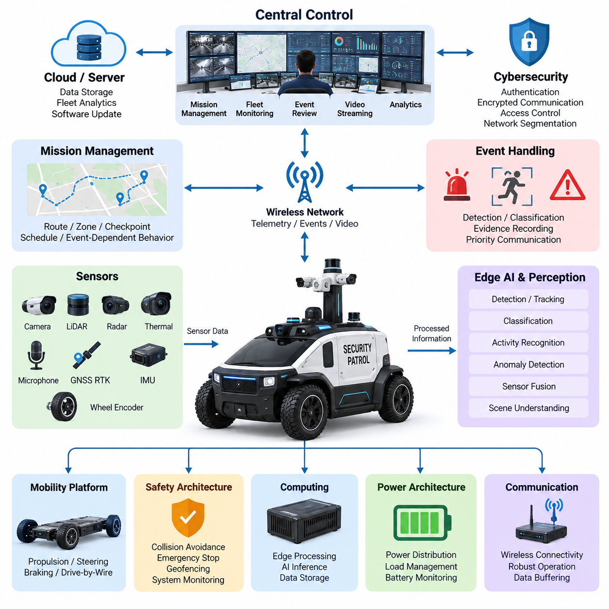
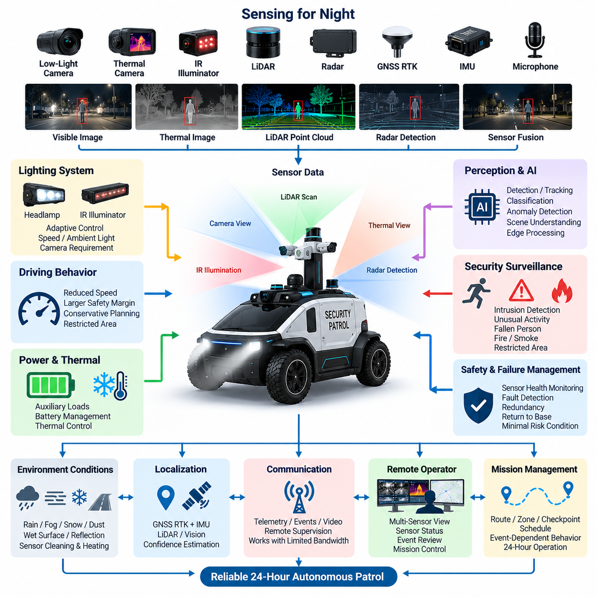
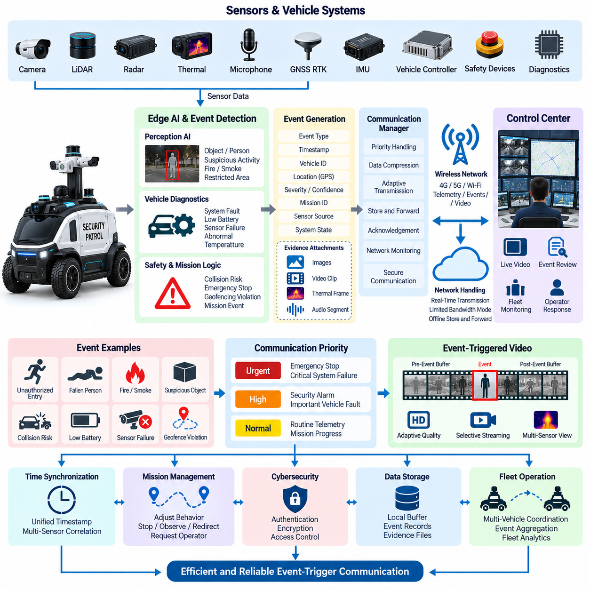
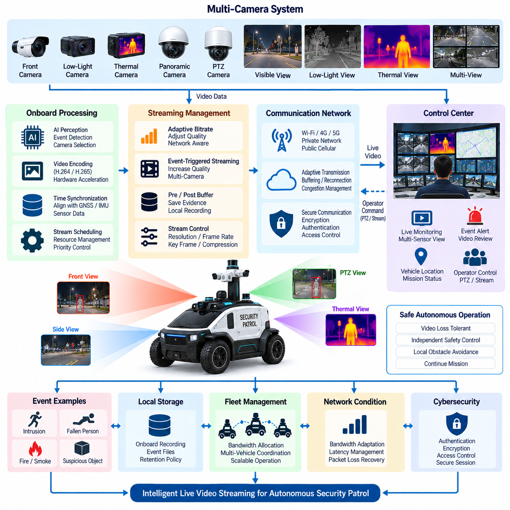
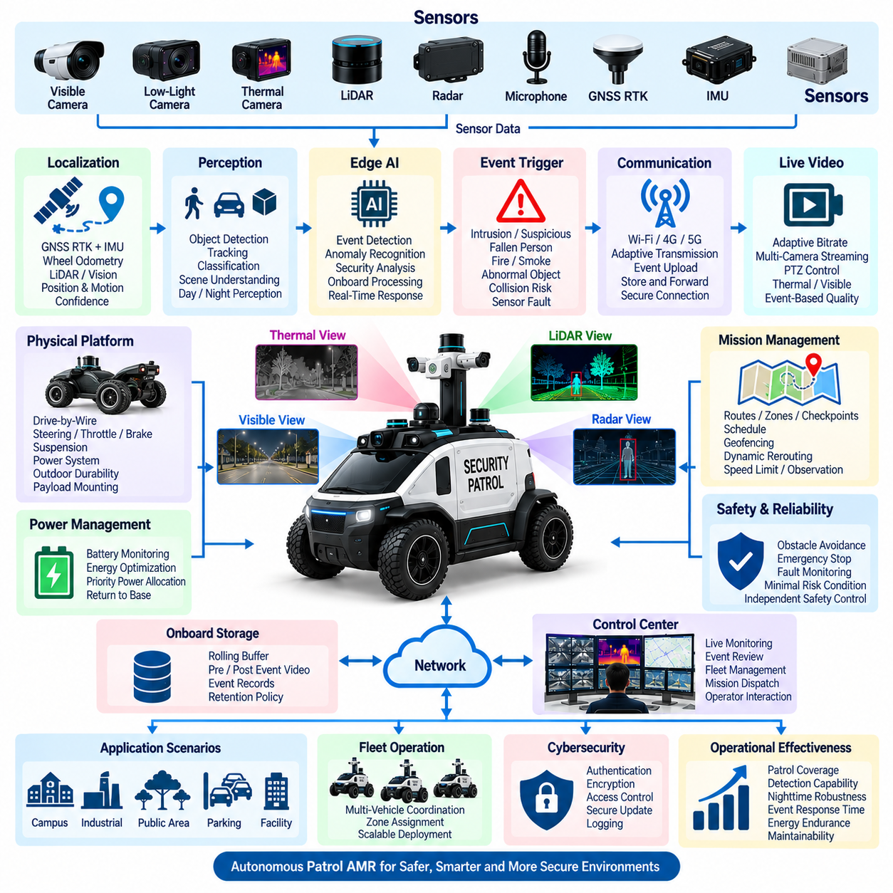

**Volume 17 Outdoor Autonomous Vehicle**

# Chapter 06. Patrol Vehicle

## 06.01. Security Patrol Architecture

{width="7.268055555555556in" height="7.268055555555556in"}

보안 순찰 아키텍처(Security Patrol Architecture)는 실외 자율주행 차량(Outdoor Autonomous Vehicle)을 환경을 지속적으로 관찰하고, 비정상 상황을 탐지하며, 사전에 정의된 정책에 따라 대응하고, 원격 운영자(Remote Operator)와 통신할 수 있는 지속형 이동 보안 노드(Persistent Mobile Security Node)로 전환한다. 이 아키텍처는 보안 작업이 차량의 기본적인 주행, 제어 또는 안전 기능을 저해하지 않도록 하면서 자율 이동(Autonomous Mobility)과 감시 기능(Surveillance Function)을 결합해야 한다.

차량 플랫폼(Vehicle Platform)은 순찰 시스템의 물리적 기반을 형성하며 추진(Propulsion), 조향(Steering), 제동(Braking), 전력 분배(Power Distribution), 컴퓨팅(Computing), 센싱(Sensing), 통신(Communication) 서브시스템을 통합한다. 드라이브 바이 와이어(Drive-by-Wire) 인터페이스는 자율주행 제어기가 차량의 움직임을 명령할 수 있도록 하며, 독립적인 안전 메커니즘(Safety Mechanism)은 이러한 명령을 감독한다. 따라서 순찰 아키텍처는 임무 수준 소프트웨어에 고장이 발생하더라도 기본적인 이동 및 비상 기능을 유지할 수 있는 모빌리티 플랫폼(Mobility Platform) 위에서 동작한다.

위치추정(Localization)은 모든 보안 관측 정보가 정확한 지리적 위치와 연계될 때 더욱 유용해지므로 필수적인 기능이다. GNSS RTK는 실외 절대 위치(Absolute Positioning)를 제공할 수 있으며, 관성측정장치(IMU), 휠 피드백(Wheel Feedback), 라이다(LiDAR), 카메라(Camera) 및 기타 센서는 위성 신호 수신이 저하될 때 위치추정을 지원할 수 있다. 아키텍처는 위치추정 신뢰도(Localization Confidence)를 유지하여 순찰 판단에 추정 위치뿐만 아니라 해당 추정값의 신뢰성까지 반영할 수 있어야 한다.

인지 계층(Perception Layer)은 차량 주변 영역을 지속적으로 관찰한다. 가시광 카메라(Visible Camera)는 사람, 차량, 물체, 경계 및 활동을 인식하기 위한 풍부한 정보를 제공하며, 라이다는 기하학적 인지(Geometric Perception)와 장애물 탐지(Obstacle Detection)를 지원한다. 레이더(Radar), 깊이 카메라(Depth Camera), 열화상 센서(Thermal Sensor), 마이크(Microphone) 또는 기타 임무 센서(Mission Sensor)는 순찰 환경에 따라 이러한 센서 채널을 보완할 수 있다. 각 센서의 출력은 시간 동기화(Time Synchronization)되어 온보드 컴퓨팅(Onboard Computing) 자원에서 처리된다.

보안 인지(Security Perception)는 즉각적인 주행 위험을 넘어서는 사건을 해석해야 한다는 점에서 일반적인 주행 인지(Navigation Perception)와 차이가 있다. 보행자는 주행 시스템에서 단순한 장애물로 인식될 수 있지만, 보안 시스템은 해당 사람이 제한 구역(Restricted Area)에 진입했는지, 바닥에 쓰러졌는지, 비정상적으로 특정 위치에 머물고 있는지 또는 운영자의 주의가 필요한 행동을 보이는지를 판단해야 할 수 있다. 따라서 동일한 센서 정보가 이동성과 보안 해석 모두에 활용될 수 있다.

온보드 엣지 AI(Onboard Edge AI)는 연속적인 센서 스트림(Sensor Stream)을 운용 정보(Operational Information)로 변환하는 컴퓨팅 계층을 제공한다. 탐지(Detection), 추적(Tracking), 분류(Classification), 행동 인식(Activity Recognition), 이상 탐지(Anomaly Detection), 장면 이해(Scene Understanding)는 센서 가까이에서 실행될 수 있으므로 중요한 판단이 지속적인 클라우드 연결(Cloud Connectivity)에 의존하지 않는다. 또한 차량이 모든 원시 센서 스트림을 계속 업로드하는 대신 선별된 사건과 메타데이터(Metadata)를 전송할 수 있어 통신 부하를 줄일 수 있다.

임무 관리(Mission Management)는 순찰 차량이 어디로 이동하고, 무엇을 관찰하며, 탐지된 상황에 어떻게 대응할 것인지를 정의한다. 순찰 임무(Patrol Mission)는 경로(Route), 구역(Zone), 점검 지점(Checkpoint), 관찰 위치(Observation Position), 시간 일정(Time Schedule), 속도 제한(Speed Restriction), 제한 구역 및 사건 의존형 행동(Event-Dependent Behavior)을 포함할 수 있다. 임무 실행은 차량 상태와 연계되어 배터리 상태, 위치추정 신뢰도, 센서 가용성, 날씨, 통신 품질 또는 안전 제한에 따라 계획된 운행을 변경할 수 있어야 한다.

경로 기반 순찰(Route-Based Patrol)은 사전에 정의된 경로를 따라 차량을 반복적으로 이동시키며, 구역 기반 순찰(Zone-Based Patrol)은 임무 계획기(Mission Planner)가 지정된 영역 내에서 경로를 동적으로 선택하도록 한다. 점검 지점에서는 정지, 카메라 회전, 센서 스캔(Sensor Scan), 증거 기록(Evidence Recording), 지정된 시간 동안의 관찰 대기와 같은 추가 작업을 요구할 수 있다. 이러한 메커니즘은 자율주행을 단순한 로봇 이동이 아니라 반복 가능한 보안 프로세스(Security Process)로 전환한다.

중앙 관제 시스템(Central Control System)은 차량이 로컬 자율성(Local Autonomy)을 유지하는 동안 플릿 수준 감독(Fleet-Level Supervision)을 제공한다. 관제센터는 임무를 배포하고, 로봇 위치를 감시하며, 시스템 건전성을 확인하고, 경보를 수신하며, 영상을 요청하고, 사건 정보를 검토하고, 운용 우선순위를 변경할 수 있다. 여러 순찰 차량은 불필요한 중복 없이 서로 다른 구역을 담당하도록 조정될 수 있으며, 특정 차량을 사용할 수 없거나 추가적인 사건 관찰이 필요한 경우 인접 로봇을 재배치할 수 있다.

통신 아키텍처(Communication Architecture)는 사용 가능한 무선 네트워크(Wireless Network)를 통해 온보드 자율주행(Onboard Autonomy)과 원격 감독(Remote Supervision)을 연결한다. 일반 텔레메트리(Routine Telemetry)에는 차량 위치, 임무 상태, 배터리 상태, 센서 건전성, 통신 품질 및 진단 정보가 포함될 수 있다. 보안 사건에는 더 높은 전송 우선순위를 부여하고 타임스탬프(Timestamp), 좌표(Coordinate), 사건 분류(Event Classification), 신뢰도 값(Confidence Value), 스냅샷(Snapshot), 비디오 구간(Video Segment) 및 원격 평가에 필요한 기타 증거 정보를 포함할 수 있다.

통신 단절(Communication Loss)이 발생하더라도 차량의 안전 운행 능력이 자동으로 상실되어서는 안 된다. 실시간 장애물 회피(Obstacle Avoidance), 모션 제어(Motion Control), 비상 정지(Emergency Stopping), 필수 인지(Essential Perception)는 온보드 기능으로 유지된다. 연결 상태가 악화되면 사전에 정의된 정책에 따라 제한된 임무를 계속하거나, 안전한 위치에서 대기하거나, 알려진 통신 가능 지역으로 이동하거나, 기지로 복귀하거나, 최소 위험 상태(Minimal Risk Condition)로 전환할 수 있다. 버퍼링된 데이터(Buffered Data)는 연결 복구 후 전송할 수 있다.

안전 아키텍처(Safety Architecture)는 보안 지능(Security Intelligence)과 논리적으로 분리된 상태를 유지한다. AI 모델이 사건을 보다 자세히 관찰하기 위해 접근하도록 권고하더라도 이동 시스템은 충돌 회피, 속도 제한, 지오펜싱(Geofencing), 액추에이터 제약조건(Actuator Constraint), 비상 정지 요구사항을 계속 준수해야 한다. 안전 감독(Safety Supervision)은 임무 목적과 독립적으로 추진, 조향, 제동, 위치추정, 인지 가용성, 컴퓨팅 건전성, 통신 상태 및 주요 전력 상태를 감시해야 한다.

전력 아키텍처(Power Architecture)는 이동 기능과 지속적인 감시 기능을 모두 지원해야 한다. 일반적으로 추진 시스템이 주요 에너지 부하를 차지하지만 카메라, 라이다, 열화상 센서, 조명, 통신 장비, 엣지 GPU(Edge GPU), 저장장치 및 보조 페이로드(Auxiliary Payload)도 임무 운용시간에 상당한 영향을 미칠 수 있다. 전력 분배 시스템은 차량의 핵심 기능과 임무 페이로드를 분리하고 각 전기 도메인(Electrical Domain)에 적절한 보호, 모니터링, 전력 변환 및 제어된 종료(Controlled Shutdown) 기능을 제공해야 한다.

아키텍처는 순찰 운용 과정에서 생성되는 증거(Evidence)도 보존해야 한다. 중요한 사건에는 일관된 타임스탬프, 차량 위치, 센서 식별 정보(Sensor Identity), 사건 메타데이터, 관련 이미지 또는 영상 및 시스템 상태가 함께 기록되어야 한다. 로컬 저장장치(Local Storage)는 네트워크 단절 상황에서 회복탄력성(Resilience)을 제공하고, 중앙 저장장치(Central Storage)는 장기적인 검토와 플릿 분석(Fleet Analytics)을 지원할 수 있다. 경보와 해당 경보를 발생시킨 원본 센서 관측 사이의 추적성(Traceability)을 유지하는 것은 자율 시스템이 사건을 발생시킨 이유를 이해하는 데 중요하다.

사이버보안(Cybersecurity)은 차량 제어 기능과 감시 정보를 모두 보호한다. 원격 인터페이스(Remote Interface)는 인증된 접근(Authenticated Access), 암호화 통신(Encrypted Communication), 권한 제어(Controlled Privileges), 안전한 자격증명 관리(Secure Credential Management), 보호된 소프트웨어 업데이트(Protected Software Update), 적절한 네트워크 분리(Network Segmentation)를 필요로 한다. 차량 제어 트래픽, 안전 관련 통신, 진단 인터페이스, 영상 스트림 및 플릿 서비스를 하나의 제한 없는 네트워크 도메인으로 취급해서는 안 된다. 하나의 서비스가 침해될 경우 플랫폼 전체로 문제가 확산될 수 있기 때문이다.

성숙한 보안 순찰 아키텍처는 따라서 긴밀하게 연계되면서도 기능적으로 분리된 이동성(Mobility), 인지(Perception), 보안 AI(Security AI), 임무 관리, 안전, 통신, 전력 및 플릿 계층(Fleet Layer)으로 구성된다. 로컬 자율성은 즉각적인 물리적 운행을 가능하게 하며, 중앙 감독(Central Supervision)은 보다 광범위한 상황 인식과 다중 차량 조정(Multi-Vehicle Coordination)을 제공한다. 이러한 분산 구조(Distributed Architecture)는 개별 센서, 통신 링크 또는 외부 서비스가 일시적으로 사용할 수 없더라도 순찰 차량이 의미 있는 운용을 지속할 수 있도록 한다.

결과적으로 순찰 차량은 단순한 이동형 카메라 플랫폼(Mobile Camera Platform)을 넘어선다. 실외 환경을 자율주행하고, 지정된 영역을 지속적으로 관찰하며, 사건을 해석하고, 증거를 보존하고, 중요한 정보를 전달하며, 안전 제약조건을 유지하면서 임무를 조정할 수 있는 사이버 물리 보안 시스템(Cyber-Physical Security System)이 된다. 이러한 아키텍처는 이후 시스템 설계 단계에서 다루는 야간 운행(Night Operation), 사건 트리거 통신(Event-Trigger Communication), 실시간 영상 스트리밍(Live Video Streaming), 통합 순찰 자율이동로봇(Integrated Patrol AMR) 응용을 위한 기반을 제공한다.

## 06.02. Night Operation Design

{width="7.268055555555556in" height="7.268055555555556in"}

야간 운행 설계(Night Operation Design)는 자연광이 부족하거나 조명 조건이 크게 변화하는 환경에서도 실외 자율 순찰 차량(Outdoor Autonomous Patrol Vehicle)이 안전한 이동, 신뢰성 높은 인지, 효과적인 감시 기능을 유지하도록 한다. 어둠은 단순히 카메라의 가시성만 변화시키는 것이 아니라 객체 대비, 위치추정 신뢰도(Localization Confidence), 사람 탐지, 환경 해석, 운영자의 상황 인식에도 영향을 미친다. 따라서 차량은 야간 운행을 단순한 조명 조건이 아니라 통합된 시스템 운용 모드(System Operating Mode)로 다루어야 한다.

인지 아키텍처(Perception Architecture)는 가시광에 대한 의존성이 서로 다른 센싱 방식(Sensing Modality)을 결합해야 한다. 저조도 카메라(Low-Light Camera)는 중간 수준의 조명에서도 색상과 의미 정보를 유지할 수 있으며, 열화상 또는 적외선 센서(Thermal or Infrared Sensor)는 가시광 영상의 신뢰성이 저하될 때 사람, 동물, 차량 및 열원을 탐지할 수 있다. 라이다(LiDAR)와 레이더(Radar)는 주변 조명에 거의 의존하지 않는 기하학적 정보 또는 거리 정보를 제공하여 야간 자율주행을 위한 상호보완적 인지 채널을 구성한다.

가시광 카메라(Visible Camera)는 순찰 경로를 따라 조명 조건이 빠르게 변화할 수 있으므로 세심한 제어가 필요하다. 차량은 밝게 조명된 출입구에서 어두운 도로로 이동하거나, 가로등 바로 아래를 지나거나, 접근하는 차량의 전조등을 마주하거나, 반사 표면을 관찰할 수 있다. 자동 노출(Automatic Exposure), 게인 제어(Gain Control), 광역동범위 영상(High-Dynamic-Range Imaging), 눈부심 억제(Glare Suppression), 영상 품질 모니터링(Image-Quality Monitoring)을 통해 일시적인 조명 변화가 인지 성능을 인지하지 못한 상태에서 저하시키는 것을 방지해야 한다.

적외선 조명(Infrared Illumination)은 추가적인 가시광 조명이 사람에게 방해가 되거나 순찰 차량의 존재를 불필요하게 노출하는 장소에서 영상 성능을 향상시킬 수 있다. 근적외선 조명기(Near-Infrared Illuminator)는 호환 카메라를 지원할 수 있지만 유효 거리, 빔 패턴(Beam Pattern), 전력 소비, 반사 특성 및 눈 안전(Eye Safety) 제약조건을 고려해야 한다. 조명은 카메라 시야각(Field of View)과 조정되어야 하며, 과도한 근거리 반사로 인해 더 먼 거리의 객체 가시성이 저하되지 않도록 해야 한다.

열화상 영상(Thermal Imaging)은 반사된 가시광이 아니라 물체에서 방출되는 열복사(Thermal Radiation)를 관측하므로 중요한 야간 센싱 채널을 제공한다. 열화상 카메라(Thermal Camera)는 어둠 속에서 사람을 탐지하고, 비정상적인 열원을 찾으며, 시각적으로 어려운 장면에서도 감시 기능을 유지하는 데 도움을 줄 수 있다. 그러나 온도 유사성, 날씨, 표면 재질 및 환경 조건에 따라 식별 능력이 저하될 수 있으므로 열화상 센서는 다른 센싱 방식과 상호보완적으로 사용해야 한다.

라이다(LiDAR)는 장면의 밝기와 무관하게 3차원 또는 평면 기하학 측정값을 제공하여 야간 운행을 지원한다. 장애물을 탐지하고, 주행 가능 공간(Free Space)을 추정하며, 가시광 카메라의 대비가 낮은 상황에서도 위치추정을 지원할 수 있다. 레이더는 광학 센싱(Optical Sensing)이 저하되는 조건에서 추가적인 강건성(Robustness)을 제공한다. 센서 융합(Sensor Fusion)은 단일 야간 센서가 완전한 환경 이해를 제공한다고 가정하지 않고 각 센서의 상호보완적인 특성을 결합해야 한다.

위치추정(Localization)은 주간과 야간 조건 사이의 전환 과정에서도 안정적으로 유지되어야 한다. GNSS RTK와 관성측정장치(IMU)는 조명에 직접적으로 의존하지 않으며, 라이다 기반 위치추정(LiDAR-Based Localization)은 추가적인 기하학적 일관성을 제공할 수 있다. 비전 기반 위치추정(Vision-Based Localization)은 특히 조명이 부족하거나 반복적인 환경에서 특징점 품질이 저하될 수 있다. 따라서 위치추정 시스템은 신뢰도를 평가하고 개별 센싱 방식의 기여도를 동적으로 조정해야 한다.

야간 장애물 탐지(Nighttime Obstacle Detection)는 취약한 도로 이용자(Vulnerable Road User)와 시각적 특징이 약한 물체에 특별한 주의를 기울여야 한다. 어두운 옷을 입은 보행자, 동물, 낮은 높이의 장애물, 조명이 없는 자전거, 임시 차단물, 가로등 범위를 벗어난 물체는 가시광 카메라만으로 인식하기 어려울 수 있다. 기하학적 탐지, 열 신호(Thermal Signature), 움직임 정보(Motion Information), 의미 기반 인지(Semantic Perception)를 결합하면 모션 계획기(Motion Planner)가 적절한 대응을 결정하기 전에 보다 신뢰성 높은 판단 근거를 확보할 수 있다.

순찰 차량은 야간 인지 신뢰도(Nighttime Perception Confidence)가 저하될 경우 주행 행동을 적응적으로 변경해야 한다. 속도 감소, 정지거리 증가, 보수적인 경로 계획(Conservative Path Planning), 더 큰 안전 여유(Safety Margin), 관측이 어려운 구역에서의 운행 제한을 통해 위험을 줄일 수 있다. 차량이 환경을 이해하는 능력이 크게 저하된 상태에서 주간과 동일한 주행 행동을 지속하지 않도록 인지 신뢰도를 이동 정책(Mobility Policy)과 직접 연계해야 한다.

야간 보안 감시(Nighttime Security Surveillance)는 주행 안전을 넘어서는 기능을 포함한다. 시스템은 무단 침입(Unauthorized Entry), 비정상적인 움직임, 쓰러진 사람(Fallen Person), 의심스러운 정지 물체, 연기, 화재 또는 제한 구역에서의 활동을 탐지해야 할 수 있다. 엣지 AI(Edge AI)는 가시광, 적외선, 열화상, 음향 및 기하학 정보를 로컬에서 분석할 수 있어 통신 대역폭이 제한되거나 원격 운영자가 실시간 영상을 지속적으로 감시하지 않는 상황에서도 사건 탐지(Event Detection)를 유지할 수 있다.

조명(Lighting)은 단순한 부가 장치가 아니라 능동적인 차량 서브시스템(Active Vehicle Subsystem)이 된다. 전조등(Headlamp)은 주행을 지원하며, 보조 조명(Auxiliary Illumination)은 카메라 인지를 지원하거나 사건 발생 시 현장 가시성을 제공할 수 있다. 조명 제어는 차량 속도, 경로 형상, 주변 밝기, 카메라 요구조건, 탐지된 객체 및 임무 조건에 따라 조정될 수 있다. 아키텍처는 조명 변화가 반복적인 노출 불안정이나 광학 센서 간 간섭을 발생시키지 않도록 해야 한다.

야간 운행은 순찰 차량의 전력 프로파일(Power Profile)에도 변화를 준다. 전조등, 적외선 조명기, 열화상 카메라, 히터(Heater), 통신 장비, 엣지 컴퓨터(Edge Computer), 지속적인 영상 처리가 장시간 동시에 동작할 수 있다. 따라서 배터리 운용시간(Battery Endurance) 계산에는 야간 보조 부하(Nighttime Auxiliary Load)가 포함되어야 한다. 전력 관리(Power Management)는 낮은 우선순위의 감시 또는 편의 부하보다 추진, 안전 제어기, 위치추정, 필수 인지 및 통신 기능에 우선적으로 전력을 공급할 수 있어야 한다.

열 관리(Thermal Management)는 전력 관리와 함께 고려해야 한다. 지속적인 AI 추론(AI Inference), 영상 인코딩(Video Encoding), 센서 운용 및 통신은 외부 온도가 낮더라도 열을 발생시킨다. 반대로 저온 또는 습한 환경에서는 카메라, 배터리, 디스플레이 또는 광학 윈도(Optical Window)에 가열 기능이 필요할 수 있다. 시스템은 온도와 전력 소비를 함께 감시하여 열 보호(Thermal Protection) 기능으로 인해 핵심 야간 인지 기능이 예상치 못하게 중단되지 않도록 해야 한다.

환경 조건(Environmental Condition)은 단순한 어둠보다 야간 운행을 더욱 어렵게 만들 수 있다. 비, 안개, 눈, 먼지, 결로(Condensation), 젖은 노면, 반사 표면은 카메라 영상, 라이다 반사값, 레이더 관측 및 조명 특성을 변화시킬 수 있다. 광학 윈도에 맺힌 물방울은 눈부심이나 영상 왜곡을 발생시킬 수 있다. 따라서 센서 하우징(Sensor Housing), 세척 장치(Cleaning Mechanism), 가열, 발수 보호(Hydrophobic Protection), 진단 모니터링(Diagnostic Monitoring)을 야간 운용 아키텍처의 일부로 고려해야 한다.

원격 운영자(Remote Operator)에게는 차량의 실제 야간 인지 능력을 정확하게 나타내는 정보가 제공되어야 한다. 가시광 카메라 영상이 어둡게 보이더라도 열화상 또는 라이다 센싱은 정상적으로 동작할 수 있으므로 실시간 영상만으로 판단하면 오해가 발생할 수 있다. 관제 인터페이스(Control Interface)는 센서 상태, 위치추정 신뢰도, 통신 품질, 탐지된 사건 및 선택된 대체 영상을 함께 제공할 수 있다. 이를 통해 운영자는 실제 환경 위험과 특정 센서 채널의 성능 저하를 구분할 수 있다.

고장 관리(Failure Management)는 주요 야간 기능이 상실되었을 때의 대응을 정의해야 한다. 하나의 카메라가 고장난 경우 중복 센서(Redundant Sensor)를 이용해 운행을 계속할 수 있지만, 여러 인지 채널이 동시에 저하되면 감속, 임무 제한, 기지 복귀(Return to Base), 최소 위험 상태(Minimal Risk Condition) 전환이 필요할 수 있다. 센서 건전성 모니터링(Sensor-Health Monitoring)은 렌즈 가림, 비정상 영상 밝기, 프레임 손실, 열적 고장, 통신 오류 등을 숨겨진 운용 위험으로 발전하기 전에 탐지해야 한다.

야간 운행 설계(Night Operation Design)는 결과적으로 인지, 위치추정, 조명, 자율주행, 보안 AI(Security AI), 전력, 열 관리, 통신 및 안전 감독(Safety Supervision)을 하나의 통합 운용 모드(Unified Operating Mode)로 결합한다. 성공적인 순찰 차량은 단순히 해가 진 이후에도 계속 주행하는 차량이 아니라 어둠이 센싱 능력을 어떻게 변화시키는지 인식하고 이에 따라 동작을 동적으로 조정하는 시스템이다. 이러한 시스템 수준 접근(System-Level Approach)은 신뢰성 높은 24시간 자율 순찰(Twenty-Four-Hour Autonomous Patrol)과 이후의 사건 트리거 기반 보안 운용(Event-Triggered Security Operation)을 위한 기반을 제공한다.

## 06.03. Event Trigger Communication

{width="7.268055555555556in" height="7.268055555555556in"}

사건 트리거 통신(Event-Trigger Communication)은 자율 순찰 차량(Autonomous Patrol Vehicle)이 모든 데이터를 동일한 우선순위로 지속적으로 전송하는 대신 운용 중요도(Operational Significance)에 따라 정보를 전송하도록 한다. 차량은 일반적으로 센서, 영상, 진단, 위치추정 및 임무와 관련된 대량의 데이터를 생성하지만, 이 가운데 즉각적인 원격 대응이 필요한 정보는 일부에 불과하다. 사건 기반 통신(Event-Driven Communication)은 중요한 온보드 관측 결과를 관제센터(Control Center)를 위한 우선순위 메시지(Prioritized Message)로 변환한다.

통신 아키텍처(Communication Architecture)는 지속적인 온보드 센싱(Onboard Sensing)과 상태 모니터링(State Monitoring)에서 시작된다. 카메라(Camera), 라이다(LiDAR), 레이더(Radar), 열화상 센서(Thermal Sensor), 마이크(Microphone), GNSS RTK, 관성측정장치(IMU), 차량 제어기, 안전 장치 및 진단 모듈(Diagnostic Module)은 서로 다른 주기로 데이터를 생성한다. 엣지 컴퓨팅(Edge Computing)은 이러한 스트림을 로컬에서 처리하고 운용 정보를 추출하여 모든 원시 측정값을 무선 네트워크로 전송하는 대신 의미 있는 사건을 전달할 수 있도록 한다.

사건(Event)은 인지 AI(Perception AI), 차량 진단(Vehicle Diagnostics), 안전 제어기(Safety Controller), 임무 로직(Mission Logic), 지오펜싱(Geofencing), 통신 모니터링 또는 운영자의 직접 명령에서 발생할 수 있다. 대표적인 보안 사건에는 무단 침입(Unauthorized Entry), 의심스러운 움직임(Suspicious Movement), 쓰러진 사람(Fallen Person), 연기, 화재, 방치된 물체 또는 제한 구역(Restricted Zone) 내 활동이 포함된다. 차량 관련 트리거에는 충돌 위험, 비상 정지(Emergency Stop) 작동, 액추에이터 고장, 위치추정 성능 저하, 배터리 부족, 센서 고장 또는 비정상적인 시스템 온도가 포함될 수 있다.

사건 탐지(Event Detection)와 사건 통신(Event Communication)은 분리되어야 한다. 비정상적인 상황을 식별하는 기능과 해당 정보를 얼마나 긴급하게 전송해야 하는지를 결정하는 기능은 서로 다른 역할이기 때문이다. 탐지 계층(Detection Layer)은 어떤 사건이 발생했는지를 판단하고, 통신 정책(Communication Policy)은 심각도(Severity), 신뢰도(Confidence), 임무 상황, 네트워크 가용성 및 필요한 대응을 평가한다. 이러한 분리를 통해 기본 인지 또는 안전 알고리즘을 변경하지 않고도 통신 동작을 변경할 수 있다.

각 사건은 원격 시스템이 상황을 이해할 수 있도록 구조화된 메타데이터(Structured Metadata)로 표현되어야 한다. 메시지에는 사건 식별자(Event Identifier), 사건 유형, 타임스탬프(Timestamp), 차량 식별 정보, 지리적 위치, 위치추정 신뢰도(Localization Confidence), 심각도 수준, 탐지 신뢰도(Detection Confidence), 임무 식별자, 센서 소스 및 시스템 상태가 포함될 수 있다. 이미지, 짧은 비디오 클립(Video Clip), 열화상 프레임(Thermal Frame), 오디오 구간 또는 기타 증거도 동일한 사건 기록과 연계할 수 있다.

정확한 시간 동기화(Time Synchronization)는 여러 센서와 컴퓨팅 노드(Computing Node)에서 증거가 생성될 수 있기 때문에 필수적이다. 카메라 프레임, 라이다 측정값, 열화상 이미지, 차량 상태 및 진단 기록은 가능한 경우 공통 시간 기준(Common Time Reference)에 맞추어 연계되어야 한다. 일관된 타임스탬프를 사용하면 관제센터가 사건 발생 전, 발생 중, 발생 후의 상황을 재구성할 수 있으며 서로 다른 시점의 증거가 동시에 발생한 것으로 잘못 해석되는 것을 방지할 수 있다.

통신 우선순위(Communication Priority)는 정보의 운용 중요도를 반영해야 한다. 배터리 상태, 위치, 임무 진행 상태 및 정상적인 진단 정보와 같은 일반 텔레메트리(Routine Telemetry)는 주기적인 저우선순위 전송을 사용할 수 있다. 보안 경보와 중요한 차량 고장은 더 높은 우선순위가 필요하며, 비상 정지 사건, 즉각적인 충돌 위험 또는 치명적인 시스템 고장은 긴급 통보(Urgent Notification)가 필요할 수 있다. 우선순위 처리는 일반 트래픽으로 인해 안전 관련 정보의 전송이 지연되는 것을 방지한다.

사건 트리거 통신은 무선 통신 대역폭(Wireless Bandwidth) 사용량을 크게 줄일 수 있다. 모든 고해상도 카메라 스트림을 지속적으로 전송하는 대신 차량은 로컬 추론(Local Inference)을 수행하면서 순환 데이터 버퍼(Rolling Data Buffer)를 유지할 수 있다. 사건이 발생하면 시스템은 트리거 이전 일정 기간의 관련 정보를 보존하고 이후에도 기록을 계속한다. 이렇게 생성된 사건 패키지(Event Package)는 정상 순찰 중 지속적인 고대역폭 전송 없이도 상황을 이해하는 데 필요한 증거를 제공한다.

순환 버퍼(Rolling Buffer)는 가장 중요한 증거가 사건이 공식적으로 인식되기 이전에 발생할 수 있기 때문에 특히 유용하다. 예를 들어 AI 모델은 여러 프레임을 분석한 이후에야 사람이 쓰러졌다고 판단할 수 있다. 트리거 이후의 데이터만 저장한다면 사고가 발생하기까지의 과정이 손실될 수 있다. 따라서 트리거 이전 버퍼링(Pre-Trigger Buffering)과 트리거 이후 버퍼링(Post-Trigger Buffering)은 사건 재구성, 운영자 이해 및 이후 시스템 분석의 품질을 향상시킨다.

네트워크 상태(Network Condition)는 사건 자체의 의미를 변경하지 않으면서 사건 데이터의 전달 방법에 영향을 주어야 한다. 연결 상태가 양호할 경우 메타데이터, 이미지 및 영상을 즉시 전송할 수 있다. 대역폭이 제한된 경우에는 간결한 경보와 핵심 메타데이터를 먼저 전송하고 이후 압축된 이미지 또는 영상을 전달할 수 있다. 대용량 증거 파일은 네트워크 용량이 개선될 때까지 로컬에 저장하면서 핵심 통보 기능은 계속 유지할 수 있다.

통신 단절(Communication Loss) 상황에서는 저장 후 전달(Store-and-Forward) 기능이 필요하다. 차량이 오프라인 상태일 때 생성된 사건은 타임스탬프, 우선순위 및 증거 참조 정보와 함께 보호된 로컬 저장장치(Protected Local Storage)에 보관되어야 한다. 연결이 복구되면 통신 관리자(Communication Manager)는 중요도와 경과 시간에 따라 대기 중인 기록을 전송할 수 있다. 중복 탐지(Duplicate Detection)와 확인 응답(Acknowledgement) 메커니즘은 사건이 인지되지 못한 상태로 손실되거나 관제센터에서 반복적으로 처리되는 것을 방지한다.

확인 응답(Acknowledgement)은 성공적인 패킷 전송이 반드시 원격 애플리케이션의 사건 수신 및 처리를 의미하지 않기 때문에 높은 우선순위 경보에서 중요하다. 시스템은 메시지 전송(Message Transmission), 서버 수신(Server Reception), 사건 등록(Event Registration), 운영자 확인(Operator Acknowledgement)을 구분할 수 있다. 필요한 확인 응답이 수신되지 않을 경우 에스컬레이션 정책(Escalation Policy)에 따라 경보를 재전송하거나 대체 통신 채널을 사용하거나 다른 감독 서비스(Supervisory Service)에 통보할 수 있다.

사건 트리거 통신은 임무 관리(Mission Management)와도 상호작용해야 한다. 비정상적인 상황이 탐지되면 순찰 차량은 감속하거나, 정지하거나, 관찰 위치에 머무르거나, 센서 방향을 변경하거나, 허용된 거리까지 접근하거나, 운영자의 개입을 요청할 수 있다. 따라서 통신 메시지는 차량이 무엇을 탐지했는지만 나타내는 것이 아니라 어떠한 자율 대응(Autonomous Response)이 시작되었으며 추가적인 원격 승인이 필요한지 여부도 표현해야 한다.

실시간 영상(Live Video)은 항상 최대 품질로 동작하는 대신 사건 의존형 서비스(Event-Dependent Service)로 활성화할 수 있다. 보안 경보가 발생하면 관련 카메라 스트림을 요청하거나 프레임률(Frame Rate) 또는 해상도(Resolution)를 높이고, 열화상 영상을 활성화하거나 운영자에게 여러 센서 영상을 제공할 수 있다. 사건이 해결되면 스트리밍은 정상적인 저대역폭 상태로 복귀할 수 있다. 이러한 적응형 접근(Adaptive Approach)은 제한된 무선 자원과 상황 인식(Situational Awareness) 사이의 균형을 제공한다.

사이버보안(Cybersecurity)은 사건 메시지가 민감한 감시 정보를 포함할 수 있으며 원격 차량 동작을 시작할 수도 있기 때문에 필수적이다. 시스템 요구사항에 따라 인증(Authentication), 암호화(Encryption), 메시지 무결성 보호(Message Integrity Protection), 접근 제어(Access Control), 안전한 세션 관리(Secure Session Management), 보호된 자격증명(Protected Credentials)을 적용해야 한다. 관제센터에서 전송되는 명령은 텔레메트리와 명확하게 구분되어 비인가 메시지가 정상적인 임무 또는 차량 명령으로 해석되지 않도록 해야 한다.

사건 통신은 이후 분석을 위한 추적성(Traceability)도 유지해야 한다. 시스템은 원본 센서 관측(Original Sensor Observation), AI 추론 결과(AI Inference Result), 사건 판단(Event Decision), 전송된 메시지, 운영자 대응 및 이후 차량 동작 사이의 관계를 유지해야 한다. 이러한 기록은 사고 조사(Incident Investigation), 시스템 검증(System Validation), AI 성능 평가, 유지보수 진단 및 순찰 차량 플릿 전체의 사건 정책 개선을 지원한다.

플릿 운용(Fleet Operation)은 여러 차량이 동시에 사건을 생성할 수 있기 때문에 추가적인 요구사항을 발생시킨다. 중앙 시스템은 사건을 발생시킨 차량을 식별하고, 필요한 경우 관련 사건을 통합하며, 불필요한 중복을 억제하고, 플릿 전체에서 사건의 우선순위를 결정해야 한다. 인접 차량을 재배치하여 추가적인 관찰을 수행할 수 있으며, 플릿 분석(Fleet Analytics)을 통해 단일 차량만으로는 확인하기 어려운 반복 사건 위치, 통신 취약 지역 또는 비정상 패턴을 파악할 수 있다.

강건한 사건 트리거 통신 아키텍처(Robust Event-Trigger Communication Architecture)는 결과적으로 공통 사건 모델(Common Event Model)을 통해 인지, 엣지 AI(Edge AI), 임무 로직, 안전 모니터링, 로컬 저장장치, 무선 네트워크, 실시간 영상 및 중앙 플릿 감독(Central Fleet Supervision)을 연결한다. 이를 통해 순찰 차량은 긴급 정보와 상황적 증거(Contextual Evidence)를 보존하면서 필요한 정보를 선택적으로 통신할 수 있다. 이러한 접근 방식은 자율 보안 플릿(Autonomous Security Fleet)을 위한 확장 가능한 통신 구조를 제공하며 효율적인 실시간 영상 스트리밍(Live Video Streaming)과 통합 순찰 자율이동로봇(Integrated Patrol AMR) 운용을 위한 기반을 구축한다.

## 06.04. Live Video Streaming

{width="7.268055555555556in" height="7.268055555555556in"}

실시간 영상 스트리밍(Live Video Streaming)은 원격 운영자(Remote Operator)가 자율 순찰 차량(Autonomous Patrol Vehicle)과 주변 환경을 지속적으로 또는 필요할 때 시각적으로 확인할 수 있도록 한다. 일반적인 텔레메트리(Telemetry)와 달리 영상은 지속적으로 대용량 데이터를 생성하며 주행, 안전, 임무 및 사건 통신과 함께 동작해야 한다. 따라서 스트리밍 아키텍처(Streaming Architecture)는 안전한 자율 운행에 필요한 자원을 침해하지 않으면서 유용한 상황 인식(Situational Awareness)을 제공해야 한다.

순찰 차량에는 여러 대의 가시광 카메라(Visible Camera), 저조도 카메라(Low-Light Camera), 열화상 카메라(Thermal Camera), 파노라마 카메라(Panoramic Camera), 팬-틸트-줌 카메라(PTZ Camera)가 탑재될 수 있으며, 각각 서로 다른 해상도와 프레임률(Frame Rate)의 독립적인 영상 스트림을 생성한다. 모든 카메라를 항상 최고 품질로 전송하는 것은 일반적으로 비효율적이다. 온보드 시스템(Onboard System)은 임무 상황, 운영자 요청, 탐지된 사건, 차량 진행 방향 및 사용 가능한 네트워크 용량에 따라 스트림을 선택하고 필요한 경우 다른 채널은 로컬에 저장해야 한다.

영상 획득(Video Acquisition)은 적절한 고대역폭 연결을 통해 온보드 컴퓨팅(Onboard Computing)에 연결된 카메라 인터페이스(Camera Interface)에서 시작된다. 영상 프레임에는 가능한 한 획득 시점에 가까운 시점에서 타임스탬프(Timestamp)를 부여하여 GNSS RTK 위치, 관성측정장치(IMU) 데이터, 라이다(LiDAR) 관측, 차량 상태 및 탐지된 사건과 연계할 수 있도록 해야 한다. 일관된 시간 동기화(Time Synchronization)는 운영자와 이후 분석 시스템이 특정 위치와 시점에서 차량이 관측한 내용을 재구성할 수 있도록 한다.

원시 카메라 데이터(Raw Camera Data)는 일반적으로 실제 무선 전송에 사용하기에는 지나치게 크기 때문에 온보드 영상 인코딩(Onboard Video Encoding)이 필수적이다. 하드웨어 가속 코덱(Hardware-Accelerated Codec)은 자율주행 프로세서에 부과되는 연산 부하를 최소화하면서 필요한 대역폭을 줄일 수 있다. 해상도, 프레임률, 비트레이트(Bitrate), 키 프레임 간격(Key-Frame Interval), 압축 수준은 모든 카메라와 네트워크 조건에 하나의 고정 설정을 적용하는 대신 운용 목적에 따라 선택해야 한다.

엣지 컴퓨팅(Edge Computing)은 어떤 시각 정보를 차량 외부로 전송할 것인지 결정하는 핵심 역할을 수행한다. AI 인지(AI Perception)는 사람, 차량, 화재, 연기, 제한 구역 활동 또는 기타 임무 관련 상황을 식별하고 해당 사건을 관련 영상과 연계할 수 있다. 모든 영상을 지속적으로 스트리밍하는 대신 정상 순찰에서는 저대역폭 모니터링(Low-Bandwidth Monitoring)을 제공하고 중요한 사건이 발생하면 영상 품질을 자동으로 높일 수 있다.

적응형 비트레이트 제어(Adaptive Bitrate Control)는 변화하는 무선 통신 상태에 스트리밍 시스템이 대응할 수 있도록 한다. 사용 가능한 대역폭이 감소하면 차량은 운영자가 상황을 확인할 수 있는 수준을 유지하면서 비트레이트, 해상도 또는 프레임률을 낮출 수 있다. 연결 상태가 개선되면 품질을 다시 높일 수 있다. 이러한 조정은 불안정한 반복 변화를 방지할 수 있을 정도로 점진적으로 이루어져야 하며, 핵심 텔레메트리와 안전 관련 통신은 고품질 영상보다 높은 우선순위를 유지해야 한다.

통신 경로(Communication Path)는 운용 현장에 따라 와이파이(Wi-Fi), 사설 LTE 또는 5G(Private LTE or 5G), 공용 셀룰러 네트워크(Public Cellular Network) 또는 기타 무선 인프라를 사용할 수 있다. 실외 이동으로 인해 신호 강도, 지연시간(Latency), 패킷 손실(Packet Loss), 사용 가능한 대역폭은 지속적으로 변화한다. 따라서 스트리밍 아키텍처는 무선 링크를 고정된 유선 연결처럼 간주하지 않고 불완전한 연결을 전제로 버퍼링(Buffering), 재연결(Reconnection), 혼잡 관리(Congestion Management), 세션 복구(Session Recovery)를 제공해야 한다.

영상이 운영자의 능동적인 감독(Active Operator Supervision)을 지원할 경우 지연시간은 핵심 파라미터가 된다. 과도한 지연이 발생하면 화면에 표시되는 장면과 차량의 현재 물리적 상황 사이에 상당한 차이가 발생할 수 있다. 영상 획득, 인코딩, 버퍼링, 네트워크 전송, 디코딩(Decoding), 화면 표시는 각각 종단간 지연시간(End-to-End Latency)에 영향을 준다. 아키텍처는 영상이 수동 모니터링, 사건 검토 또는 시간 민감형 원격 상호작용 중 어떤 목적으로 사용되는지에 따라 이러한 단계를 제어해야 한다.

실시간 영상은 안전 필수 차량 제어(Safety-Critical Vehicle Control)와 분리된 상태를 유지해야 한다. 영상 스트림이 손실되거나 정지하거나 지연되더라도 로컬 장애물 회피(Local Obstacle Avoidance), 비상 정지(Emergency Stopping), 자율 이동 안전 기능이 중단되어서는 안 된다. 원격 영상이 사용할 수 없는 상황에서도 차량은 온보드 인지(Onboard Perception)와 안전 제어기(Safety Controller)를 계속 사용해야 한다. 이러한 분리는 통신 품질이 기본적인 자율주행 기능의 의도하지 않은 종속 조건이 되는 것을 방지한다.

사건 트리거 영상 스트리밍(Event-Triggered Streaming)은 지속적인 고품질 전송보다 높은 효율성을 제공할 수 있다. 보안 AI(Security AI)가 무단 침입, 쓰러진 사람, 의심스러운 활동, 연기, 화재 또는 기타 사전에 정의된 사건을 탐지하면 통신 관리자(Communication Manager)는 가장 관련성이 높은 카메라를 활성화하고 영상 품질을 높인 후 관제센터(Control Center)에 알릴 수 있다. 원격 상황 이해에 도움이 되는 경우 추가적인 열화상 영상 또는 다른 각도의 영상 스트림도 활성화할 수 있다.

사건 이전 및 이후 영상 버퍼링(Pre-Event and Post-Event Video Buffering)은 탐지된 사건 전후의 상황 정보를 제공한다. 순환형 온보드 버퍼(Rolling Onboard Buffer)는 반드시 전송하지 않더라도 최근 일정 시간의 영상을 지속적으로 보존한다. 사건이 트리거되면 시스템은 사건 발생 이전 영상을 보호하고 이후에도 녹화를 계속한다. 이를 통해 운영자는 탐지된 상황뿐만 아니라 해당 상황에 이르게 된 과정까지 확인할 수 있어 사건 해석과 증거 품질(Evidence Quality)을 향상시킬 수 있다.

다중 카메라 스트리밍(Multi-Camera Streaming)은 인코딩 채널, GPU 용량, 저장장치 대역폭 및 무선 대역폭이 제한되어 있으므로 자원 중재(Resource Arbitration)가 필요하다. 차량 감독에 필요한 전방 카메라는 보조 영상보다 높은 우선순위를 가질 수 있으며, 사건을 향하고 있는 PTZ 또는 열화상 카메라는 일시적으로 가장 높은 우선순위를 부여받을 수 있다. 따라서 스트림 스케줄링(Stream Scheduling)은 임무 상태, 사건 심각도, 운영자 선택 및 시스템 자원 사용률을 함께 고려해야 한다.

팬-틸트-줌 카메라(Pan-Tilt-Zoom Camera)는 운영자 또는 온보드 AI가 특정 객체나 위치로 관찰 방향을 조정할 수 있도록 하여 순찰 감시 범위를 확장한다. PTZ 명령은 카메라 이동으로 인해 다른 관찰 요구사항이 방해받지 않도록 영상 피드백(Video Feedback) 및 임무 정책(Mission Policy)과 조정되어야 한다. 자율 추적(Autonomous Tracking)은 차량이 안전거리를 유지하고 승인된 순찰 행동을 계속 수행하는 동안 대상이 카메라 시야각(Field of View) 내에 유지되도록 할 수 있다.

관제센터는 영상을 독립된 이미지로만 표시하는 대신 상황 정보(Contextual Information)와 함께 제공해야 한다. 차량 위치, 진행 방향, 임무 상태, 카메라 식별 정보, 타임스탬프, 사건 분류(Event Classification), 센서 건전성(Sensor Health), 통신 품질 및 위치추정 신뢰도(Localization Confidence)는 운영자가 화면의 내용을 정확하게 해석하는 데 도움을 줄 수 있다. 여러 센서 영상이 제공되는 경우 사건과 환경 조건에 따라 가시광 및 열화상 영상을 선택하거나 함께 표시할 수 있다.

실시간 스트리밍이 가능하더라도 로컬 녹화(Local Recording)는 중요하다. 네트워크 단절, 일시적인 혼잡 또는 서버 고장으로 인해 지속적인 원격 수신이 불가능할 수 있지만 온보드 저장장치(Onboard Storage)는 운용 증거를 보존할 수 있다. 녹화 파일은 타임스탬프, 임무 식별자(Mission Identifier), 사건 기록 및 차량 정보와 연계되어야 한다. 저장장치 관리(Storage Management)는 중요한 사건 영상을 보호하면서 용량이 부족해질 경우 일반 데이터를 덮어쓸 수 있도록 보존 정책(Retention Policy)을 적용할 수 있다.

사이버보안(Cybersecurity)은 감시 영상의 기밀성(Confidentiality)과 스트리밍 제어의 무결성(Integrity)을 모두 보호해야 한다. 인증(Authentication), 암호화(Encryption), 접근 제어(Access Control), 안전한 세션 설정(Secure Session Establishment), 자격증명 보호(Credential Protection), 로그 기록(Logging)을 통해 비인가 영상 열람이나 조작을 방지해야 한다. 카메라 선택, PTZ 제어, 스트림 활성화, 녹화 요청 및 설정 변경은 보안 운용과 개인정보 보호(Privacy)에 영향을 미칠 수 있으므로 적절한 권한 부여(Authorization)가 필요하다.

플릿 규모 배치(Fleet-Scale Deployment)에서는 여러 순찰 차량이 동일한 무선 및 백엔드 인프라(Backend Infrastructure)를 공유할 수 있으므로 대역폭 관리가 더욱 복잡해진다. 네트워크 용량이 충분하지 않은 경우 중앙 시스템은 모든 차량에서 동시에 최고 품질의 영상 스트림을 요청하지 않아야 한다. 플릿 수준 정책(Fleet-Level Policy)은 활성 사건, 임무 우선순위, 운영자 요구 및 통신 상태에 따라 대역폭을 할당하고 일반 차량은 저대역폭 모니터링 모드를 유지하도록 할 수 있다.

강건한 실시간 영상 스트리밍 아키텍처(Robust Live Video Streaming Architecture)는 결과적으로 카메라 영상 획득, 시간 동기화, 엣지 처리(Edge Processing), 하드웨어 인코딩(Hardware Encoding), 적응형 전송(Adaptive Transmission), 사건 트리거(Event Triggering), 로컬 버퍼링(Local Buffering), 사이버보안 및 원격 시각화(Remote Visualization)를 통합한다. 영상은 통제되지 않는 연속 데이터 소스가 아니라 지능형 임무 서비스(Intelligent Mission Service)로 동작한다. 이러한 아키텍처는 통신 자원과 자율 순찰 운용의 독립적인 안전성을 보존하면서 확장 가능한 상황 인식 기능을 제공한다.

## 06.05. Patrol AMR Case

{width="7.268055555555556in" height="7.268055555555556in"}

순찰 자율이동로봇(Patrol Autonomous Mobile Robot)은 자율주행(Autonomous Driving), 보안 감시(Security Surveillance), 엣지 지능(Edge Intelligence), 통신(Communication), 플릿 감독(Fleet Supervision)을 하나의 실외 운용 플랫폼(Outdoor Operational Platform)에 통합한 시스템이다. 이 사례는 지속적인 순찰을 위해 설계된 차량이 임무 지능(Mission Intelligence)과 안전 필수 차량 제어(Safety-Critical Vehicle Control)를 분리하면서 이동 임무와 보안 임무를 결합하는 방법을 보여준다.

물리적 플랫폼(Physical Platform)은 실외 운용을 위한 추진(Propulsion), 조향(Steering), 제동(Braking), 현가장치(Suspension), 전력(Electrical Power), 환경 보호(Environmental Protection), 페이로드 장착(Payload Mounting) 기능을 제공한다. 드라이브 바이 와이어(Drive-by-Wire) 인터페이스는 자율 이동 명령을 조향, 스로틀, 제동 제어기와 연결하며, 독립적인 안전 메커니즘(Safety Mechanism)은 차량의 동작을 감독한다. 플랫폼은 도로, 보행 구역, 캠퍼스, 산업시설 및 기타 지정된 순찰 구역에서 장시간 반복 운용을 지원해야 한다.

위치추정(Localization)은 GNSS RTK와 관성측정장치(IMU), 휠 피드백(Wheel Feedback), 보조 인지 센서를 결합하여 차량의 위치와 움직임을 정확하게 추정한다. 건물이나 기반시설로 인해 위성 신호 수신이 저하되는 장소에서는 라이다 또는 비전 기반 위치추정(LiDAR or Vision-Based Localization)이 추가 정보를 제공할 수 있다. 경로 실행, 지오펜싱(Geofencing), 사건 좌표, 증거 기록 및 안전한 자율 동작이 신뢰성 높은 공간 정보에 의존하므로 위치추정 신뢰도(Localization Confidence)를 지속적으로 평가해야 한다.

인지 시스템(Perception System)은 운용 환경에 따라 가시광 카메라(Visible Camera), 저조도 카메라(Low-Light Camera), 라이다(LiDAR), 레이더(Radar), 열화상 영상(Thermal Imaging) 및 기타 임무 센서(Mission Sensor)를 통합한다. 이러한 센서는 자율주행과 보안 관찰에 모두 사용된다. 기하학적 센서(Geometric Sensor)는 장애물과 주행 가능 공간을 식별하며, 가시광 및 열화상 센서는 사람, 차량, 물체, 환경 조건 및 순찰 차량 주변에서 발생하는 활동에 대한 의미 정보를 제공한다.

엣지 AI(Edge AI)는 연속적인 센서 스트림(Sensor Stream)을 차량 가까이에서 운용 지능(Operational Intelligence)으로 변환한다. 탐지(Detection), 추적(Tracking), 분류(Classification), 이상 인식(Anomaly Recognition), 장면 이해(Scene Understanding), 보안 사건 분석(Security-Event Analysis)을 지속적인 클라우드 처리에 의존하지 않고 온보드에서 실행할 수 있다. 이러한 로컬 지능(Local Intelligence)은 AMR이 환경 변화에 즉시 대응하면서 모든 원시 센서 스트림 대신 압축된 사건 정보를 관제센터로 전송할 수 있도록 한다.

일반적인 순찰 임무(Patrol Mission)는 경로(Route), 구역(Zone), 점검 지점(Checkpoint), 일정(Schedule), 관찰 작업(Observation Task)을 중심으로 구성된다. 차량은 사전에 정의된 순찰 경로를 반복적으로 주행하고, 지정된 점검 지점에서 정지하거나, 특정 영역을 스캔하거나, 임무 조건에 따라 동적으로 경로를 변경할 수 있다. 지오펜싱은 승인된 영역 밖으로의 운행을 방지하며, 임무 규칙(Mission Rule)은 속도 제한, 관찰 시간, 제한 구역 및 비정상 사건에 대한 대응 방법을 정의한다.

야간 운행(Night Operation)은 다중 모달 인지(Multimodal Perception)의 중요성을 보여준다. 저조도 카메라는 일정 수준의 조명이 존재하는 환경에서 시각 정보를 유지하고, 열화상 센서는 사람과 열원 탐지를 지원하며, 라이다 또는 레이더는 가시광에 의존하지 않고 기하학적 환경 인식을 유지한다. 적응형 조명(Adaptive Lighting), 적외선 조명(Infrared Illumination), 노출 제어(Exposure Control), 보수적인 야간 주행 정책(Conservative Nighttime Driving Policy)은 환경 가시성이 저하될 때에도 AMR이 유효한 인지 성능을 유지하도록 지원한다.

차량은 인지 및 위치추정 신뢰도에 따라 이동 동작을 적응적으로 조정한다. 환경 조건이 양호한 경우 승인된 운행 속도로 정상적인 자율 순찰을 지속할 수 있다. 가시성, 센서 가용성, 위치추정 품질 또는 환경 조건이 저하되면 시스템은 속도를 낮추고, 안전 여유(Safety Margin)를 증가시키며, 운행 영역을 제한하거나, 임무를 일시 중지하고, 기지 복귀(Return to Base)를 수행하거나, 사전에 정의된 최소 위험 상태(Minimal Risk Condition)로 전환할 수 있다.

보안 사건(Security Event)은 온보드 지능 또는 차량 모니터링 시스템이 주의가 필요한 상태를 식별할 때 생성된다. 대표적인 사례에는 무단 침입(Unauthorized Entry), 의심스러운 활동(Suspicious Activity), 쓰러진 사람(Fallen Person), 연기, 화재, 비정상적인 정지 물체, 차단된 경로, 충돌 위험, 센서 고장 또는 비상 정지(Emergency Stop) 작동 등이 있다. 각 사건은 타임스탬프(Timestamp), 차량 위치, 분류(Classification), 신뢰도 수준, 센서 소스, 임무 상황 및 관련 증거와 연계된다.

사건 트리거 통신(Event-Trigger Communication)은 정상 운행 중 순찰 시스템이 불필요하게 네트워크 대역폭을 소비하는 것을 방지한다. 위치, 배터리 상태, 임무 진행 상태, 시스템 건전성(System Health)과 같은 일반 텔레메트리(Routine Telemetry)는 주기적으로 전송할 수 있다. 중요한 사건이 발생하면 통신 우선순위가 높아지고 차량은 관련 메타데이터(Metadata), 이미지, 비디오 구간(Video Segment), 열화상 정보 또는 원격 평가에 필요한 기타 증거와 함께 경보를 전송한다.

순환형 온보드 버퍼(Rolling Onboard Buffer)는 중요한 사건의 직전과 직후에 생성된 센서 및 영상 정보를 보존한다. 이를 통해 운영자는 AI 모델이 경보를 발생시킨 순간만 확인하는 것이 아니라 사건이 어떻게 진행되었는지를 재구성할 수 있다. 사건 기록은 네트워크가 단절된 동안 보호된 로컬 저장장치(Protected Local Storage)에 유지되며 통신이 다시 가능해지면 중앙 시스템으로 전달할 수 있다.

실시간 영상 스트리밍(Live Video Streaming)은 원격 운영자가 순찰 환경을 직접 시각적으로 확인할 수 있도록 한다. 모든 카메라를 항상 최고 품질로 전송하는 대신 시스템은 적응형 비트레이트(Adaptive Bitrate), 선택적 카메라 활성화(Selective Camera Activation), 하드웨어 영상 인코딩(Hardware Video Encoding), 사건 트리거 기반 품질 변경(Event-Triggered Quality Change)을 사용할 수 있다. 사건, 임무 요구사항, 네트워크 용량 및 운영자 요청에 따라 가시광, 열화상, 파노라마 또는 PTZ 영상을 선택할 수 있다.

무선 통신(Wireless Communication)은 사용 가능한 와이파이(Wi-Fi), 셀룰러(Cellular), 사설 네트워크(Private Network) 또는 기타 현장 인프라를 통해 순찰 AMR과 중앙 관제 시스템(Central Control System)을 연결한다. 차량이 이동함에 따라 실외 무선 품질이 변화하므로 통신 아키텍처는 버퍼링(Buffering), 재연결(Reconnection), 적응형 전송(Adaptive Transmission), 저장 후 전달(Store-and-Forward)을 지원한다. 자율주행과 핵심 안전 기능은 온보드에서 유지되어 일시적인 네트워크 단절이 차량의 안전 능력을 직접적으로 상실시키지 않도록 한다.

중앙 관제 시스템은 임무 배정(Mission Dispatch), 플릿 모니터링(Fleet Monitoring), 사건 검토(Event Review), 실시간 영상 접근, 차량 건전성 감독(Vehicle-Health Supervision), 운영자 상호작용을 제공한다. 여러 순찰 AMR은 서로 다른 구역을 분담하여 감시할 수 있으며 플릿 관리자(Fleet Manager)는 경로와 임무 우선순위를 조정한다. 특정 로봇을 사용할 수 없거나 사건에 대한 추가 관찰이 필요한 경우 플릿 수준 운용 정책(Fleet-Level Operational Policy)에 따라 인접 차량을 재배치할 수 있다.

전력 관리(Power Management)는 추진에 필요한 전력과 인지 센서, 엣지 GPU(Edge GPU), 통신 장비, 조명, 열화상 카메라, 저장장치 및 보조 장치에서 지속적으로 발생하는 전기 부하를 통합적으로 관리한다. 배터리 상태는 임무 계획과 기지 복귀 결정에 영향을 준다. 사용 가능한 전력이 제한되면 핵심 이동, 안전, 위치추정, 인지 및 통신 기능이 비필수 페이로드(Nonessential Payload)보다 높은 우선순위를 갖는다.

안전 아키텍처(Safety Architecture)는 보안 임무 목표와 독립적으로 유지된다. AI가 조사가 필요한 사건을 식별하더라도 차량 이동은 장애물 회피(Obstacle Avoidance), 속도 제한, 지오펜싱, 제동 제약조건, 비상 정지 요구사항, 액추에이터 감독(Actuator Supervision)을 계속 만족해야 한다. 고장 모니터링(Fault Monitoring)은 자율 운행을 지속할 수 있는지를 판단하기 전에 핵심 센서, 컴퓨팅 자원, 통신 인터페이스, 전력 상태, 조향, 추진 및 제동 시스템을 평가한다.

사이버보안(Cybersecurity)은 차량 운용과 감시 정보를 모두 보호한다. 인증(Authentication), 암호화(Encryption), 접근 제어(Access Control), 네트워크 분리(Network Segmentation), 안전한 자격증명(Secure Credentials), 보호된 소프트웨어 업데이트(Protected Software Update), 로그 기록(Logging)은 차량 명령, 카메라, 기록된 증거 또는 플릿 서비스에 대한 비인가 접근을 방지한다. 원격 PTZ 제어, 임무 변경, 영상 접근 및 차량 명령은 물리적 운용이나 보안 업무에 직접적인 영향을 줄 수 있으므로 통제된 권한 부여(Controlled Authorization)가 필요하다.

통합 순찰 AMR 사례(Integrated Patrol AMR Case)는 결과적으로 온보드 자율성(Onboard Autonomy)이 즉각적인 인지 및 이동 판단을 수행하고 중앙 인프라(Central Infrastructure)가 보다 광범위한 감독과 플릿 조정을 제공하는 분산 사이버 물리 아키텍처(Distributed Cyber-Physical Architecture)를 보여준다. 보안 AI, 사건 트리거 통신, 실시간 영상, 로컬 증거 저장, 야간 운행, 안전 모니터링 및 임무 관리는 안전한 차량 운행이 지속적인 원격 연결에 의존하지 않도록 하면서 상호 협력한다.

성공적인 순찰 AMR은 결과적으로 주행 정확도만으로 평가되지 않는다. 순찰 범위(Patrol Coverage), 탐지 능력(Detection Capability), 야간 강건성(Nighttime Robustness), 사건 대응 시간(Event Response Time), 통신 회복탄력성(Communication Resilience), 증거 무결성(Evidence Integrity), 에너지 운용시간(Energy Endurance), 안전 동작(Safety Behavior), 사이버보안, 유지보수성(Maintainability), 플릿 확장성(Fleet Scalability)이 종합적으로 운용 효과성(Operational Effectiveness)을 결정한다. 이러한 기능의 통합은 실외 자율주행 차량을 지속적이고 지능적이며 원격 감독이 가능한 보안 순찰 시스템(Security Patrol System)으로 전환한다.
