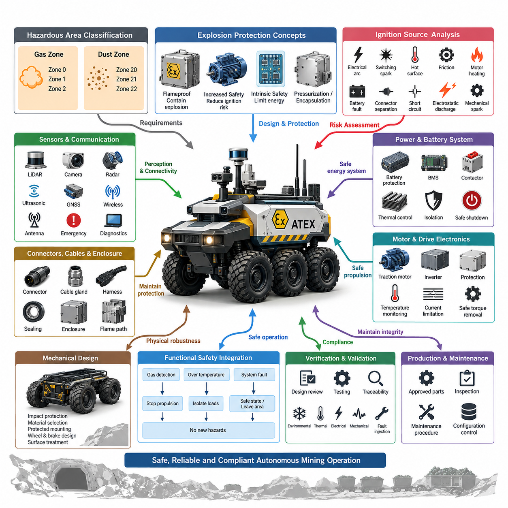
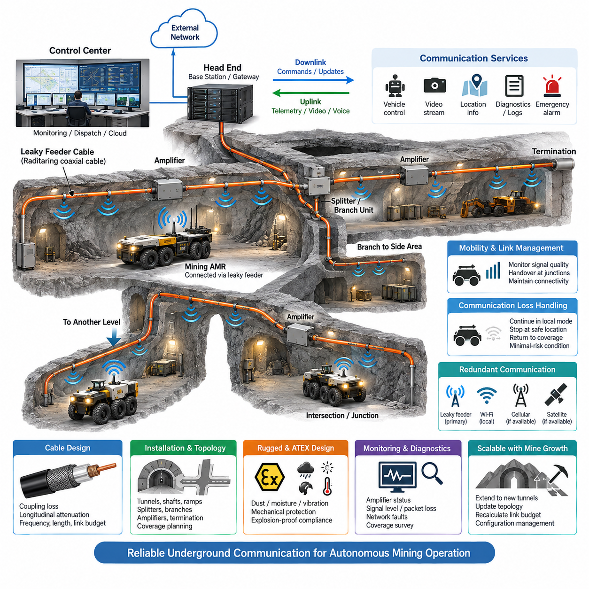
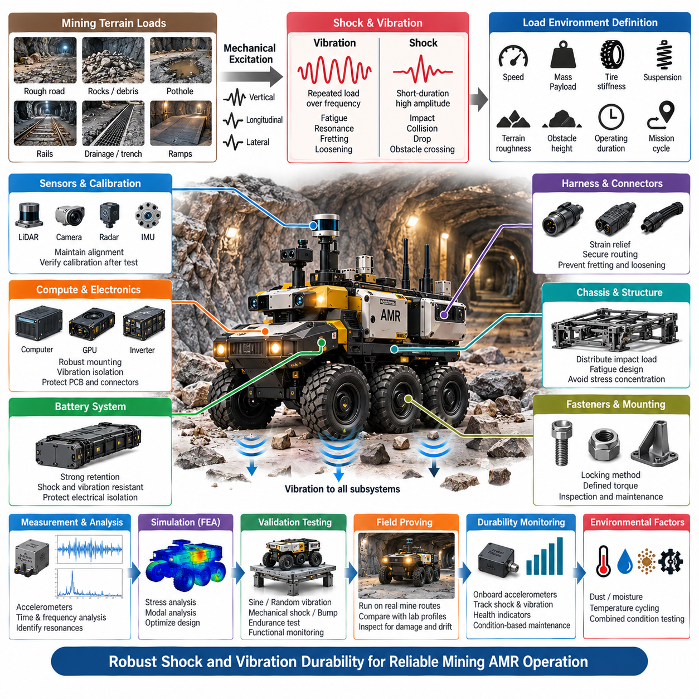
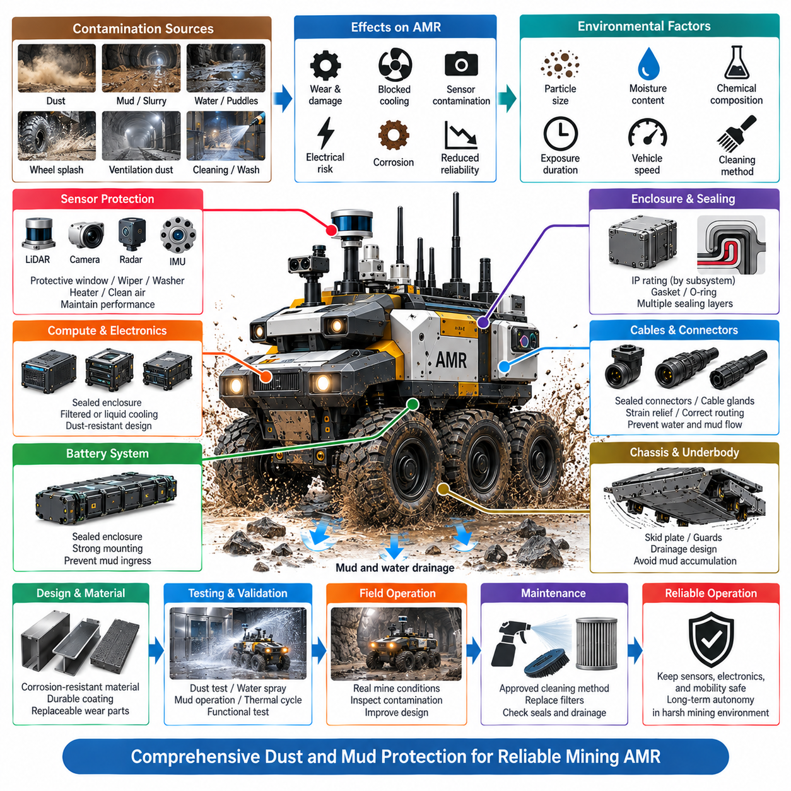
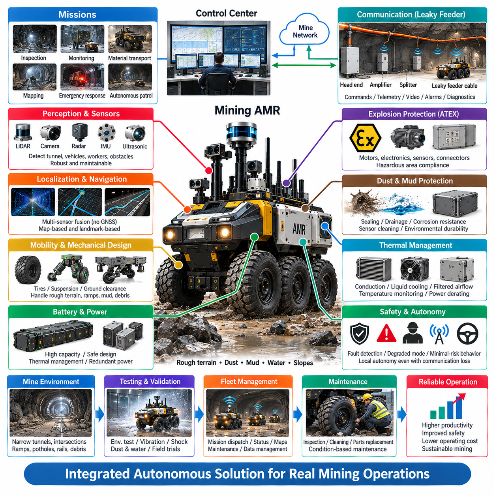

**Volume 17 Outdoor Autonomous Vehicle**

# Chapter 07. Mining AMR

## 07.01. Explosion Proof Design (ATEX)

{width="7.268055555555556in" height="7.268055555555556in"}

방폭 설계(Explosion-Proof Design)는 메탄(Methane), 가연성 분진(Combustible Dust), 연료 증기(Fuel Vapor) 또는 기타 위험 물질로 인해 폭발성 분위기(Explosive Atmosphere)가 형성될 수 있는 광산에서 운용되는 자율이동로봇(Autonomous Mobile Robot, AMR)의 핵심 요구사항이다. 설계 목적은 단순히 외함(Enclosure)을 강화하는 것이 아니라 정상 운전과 예측 가능한 고장 조건에서 전기적, 열적, 기계적 및 정전기적 점화원(Ignition Source)이 연소를 일으키지 않도록 하는 것이다.

ATEX 엔지니어링(ATEX Engineering)은 필요한 보호 개념(Protection Concept)이 폭발성 분위기의 발생 위치와 빈도에 따라 달라지므로 위험구역 분류(Hazardous-Area Classification)에서 시작한다. 가스 환경은 일반적으로 Zone 0, 1, 2로 분류되고, 가연성 분진 환경은 Zone 20, 21, 22로 구분된다. 따라서 광산용 AMR은 차량 아키텍처를 완성한 후 방폭 기능을 추가하는 방식이 아니라 문서화된 운용 구역(Operational Zone)을 전제로 처음부터 설계되어야 한다.

지하 광산(Underground Mining)용 장비는 폭발성 갱내가스(Firedamp)와 가연성 분진이 심각한 기계적·환경적 조건과 동시에 존재할 수 있으므로 특별한 고려가 필요하다. 보호 전략은 구동장치(Traction Drive), 배터리(Battery), 전력분배(Power Distribution), 컴퓨팅 장치(Computing Unit), 센서(Sensor), 통신장비(Communication Equipment), 커넥터(Connector), 조명(Lighting), 제동장치(Braking Device), 보조 탑재체(Auxiliary Payload)를 포함한 로봇 전체를 하나의 통합 시스템으로 고려해야 한다. 개별 부품의 인증만으로 조립된 AMR 전체의 적합성이 자동으로 보장되지는 않는다.

점화원 분석(Ignition-Source Analysis)은 전기 아크(Electrical Arc), 개폐 스파크(Switching Spark), 고온 표면(Hot Surface), 모터 발열(Motor Heating), 배터리 고장(Battery Fault), 커넥터 분리(Connector Separation), 단락(Short Circuit), 정전기 방전(Electrostatic Discharge), 마찰(Friction), 기계적 스파크(Mechanically Generated Spark)를 체계적으로 식별해야 한다. 각 점화원은 정상 운전, 예상되는 이상 상태 및 관련 고장 조건에서 평가되어야 하며, 분석 결과는 위험구역 가정과 부품 선정, 보호 방법, 검증 활동 및 운용 제한을 연결하는 핵심 엔지니어링 자료가 된다.

하나의 광산용 로봇에는 여러 방폭 보호 개념(Explosion-Protection Concept)을 조합하여 적용할 수 있다. 내압 방폭 외함(Flameproof Enclosure)은 내부 폭발을 견디면서 화염 전파를 방지하고, 안전증 방폭(Increased Safety)은 아크, 과도한 온도 및 절연 고장의 발생 가능성을 감소시킨다. 본질안전(Intrinsic Safety)은 적합한 저전력 회로에서 사용 가능한 전기적·열적 에너지를 제한한다. 장비 기능과 인증 전략에 따라 몰딩 또는 캡슐화(Encapsulation), 압력 방폭(Pressurization) 등의 보호 방식도 적용할 수 있다.

온도 제어(Temperature Control)는 전기 스파크가 발생하지 않더라도 점화 위험이 존재할 수 있기 때문에 특히 중요하다. 모터(Motor), 브레이크(Brake), 전력변환기(Power Converter), 배터리(Battery), 프로세서(Processor), GPU, 조명 모듈(Lighting Module), 저항성 부품(Resistive Component)은 지속적인 광산 운전 중 상당한 열을 발생시킬 수 있다. 따라서 열 설계(Thermal Design)는 부하 프로파일(Load Profile), 주변 환경 조건, 냉각 성능 저하, 부품 공차 및 고장 시나리오를 고려하여 최악 조건의 표면 온도(Worst-Case Surface Temperature)를 설정하고 해당 온도 제한을 만족하도록 설계해야 한다.

배터리 아키텍처(Battery Architecture)는 자율로봇이 위험 환경으로부터 단순히 분리할 수 없는 고에너지 이동형 전원(Mobile High-Energy Electrical Source)을 탑재하므로 특별한 설계가 필요하다. 셀 고장(Cell Fault), 과전류(Overcurrent), 내부 단락(Internal Short Circuit), 접촉기 개폐(Contactor Switching), 충전 인터페이스(Charging Interface), 열 전파(Thermal Propagation)는 기계적·전기적 보호를 통합하여 대응해야 한다. 배터리 감시(Battery Monitoring), 전류 보호(Current Protection), 온도 감시(Temperature Supervision), 절연 전략(Isolation Strategy), 제어된 셧다운(Controlled Shutdown), 외함 설계가 상호 보완적인 보호 계층으로 동작해야 한다.

모터 및 구동 전자장치(Drive Electronics)는 또 다른 주요 점화 위험원이다. 구동 모터(Traction Motor)는 권선과 하우징의 온도를 상승시킬 수 있으며, 인버터(Inverter)는 고주파 스위칭 소자와 상당한 저장 전기에너지(Stored Electrical Energy)를 포함한다. 따라서 인증된 모터 구조, 보호된 전력전자장치(Power Electronics), 케이블 인입 시스템(Cable Entry System), 과열 감시(Overtemperature Monitoring), 전류 제한(Current Limitation), 고장 검출(Fault Detection), 안전 토크 차단(Safe Torque Removal)을 통합하여 추진 시스템 고장이 통제되지 않는 점화원으로 발전하지 않도록 해야 한다.

커넥터(Connector), 케이블 글랜드(Cable Gland), 와이어 하니스(Wire Harness), 외함 인터페이스(Enclosure Interface)는 차량 전체에서 방폭 보호 개념을 유지해야 한다. 적절한 보호 방식을 적용한 외함도 부적절한 글랜드, 커넥터, 실(Seal) 또는 정비 과정의 변경으로 예상하지 못한 화염 경로(Flame Path)나 환경 유입 경로가 발생하면 보호 성능을 상실할 수 있다. 하니스 라우팅(Harness Routing)은 지속적인 지하 운전에서 발생하는 마모, 압착, 진동, 굽힘, 오염 및 기계적 충격에도 견딜 수 있어야 한다.

센서 및 통신장비(Sensor and Communication Equipment)는 자율운전에 광범위한 외부 인지(External Perception)와 연결성(Connectivity)이 필요하므로 까다로운 통합 문제를 발생시킨다. 라이다(LiDAR), 카메라(Camera), 레이더(Radar), 초음파 센서(Ultrasonic Sensor), 적용 가능한 경우의 GNSS 관련 장비, 무선통신장치(Wireless Radio), 안테나(Antenna), 비상장치(Emergency Device), 진단 인터페이스(Diagnostic Interface)를 잠재적인 점화원으로 평가해야 한다. 인증 제품을 사용할 수 없다면 보호 외함, 에너지 제한(Energy Limitation), 절연 장벽(Isolation Barrier) 또는 적절한 보호 구획으로 전자장치를 이동시키는 아키텍처가 필요할 수 있다.

기능안전(Functional Safety)과 방폭 보호(Explosion Protection)는 독립적인 인증 활동이 아니라 하나의 시스템으로 함께 설계되어야 한다. 가스 검출, 과도한 온도, 외함 이상, 배터리 이상 또는 보호 시스템 고장이 감지되면 AMR은 추진력을 정지하고 특정 부하를 차단하거나 사전에 정의된 안전 상태(Safe State)로 전환해야 하며, 이동이 허용되는 경우 위험구역에서 벗어나야 할 수도 있다. 이러한 전환 과정에서 급제동, 접촉기 동작 또는 필수 안전 기능의 통제되지 않은 상실로 새로운 위험이 발생해서는 안 된다.

기계 설계(Mechanical Design) 역시 점화 방지에 직접적으로 기여한다. 암석, 철제 구조물, 레일, 광산 장비 또는 잔해와의 충돌은 스파크, 외함 변형, 케이블 손상 또는 밀봉 건전성(Sealing Integrity) 상실을 일으킬 수 있다. 따라서 재료 선정(Material Selection), 충격 보호(Impact Protection), 커넥터 보호, 센서 보호 장착, 휠 및 브레이크 설계, 구조적 간극(Structural Clearance), 적절한 표면 처리(Surface Treatment)를 방폭 위험 평가에 포함해야 하며, ATEX 엔지니어링을 전기 부품에만 한정해서는 안 된다.

검증(Verification)은 최종 인증시험(Certification Test)만으로 이루어져서는 안 된다. 설계 검토(Design Review)는 위험구역 분류와 점화 위험 평가에서부터 보호 개념, 부품 인증서(Component Certificate), 열 계산(Thermal Calculation), 도면, 설치 요구사항 및 검사 절차까지 추적성(Traceability)을 유지해야 한다. 환경, 열, 전기, 기계 및 고장주입시험(Fault-Injection Test)을 통해 통합된 AMR이 실제 광산 부하와 예측 가능한 성능 저하 조건에서도 보호 설계의 기본 가정을 지속적으로 만족하는지 입증해야 한다.

생산 및 유지보수 관리(Production and Maintenance Control) 역시 중요하다. 방폭 성능은 로봇의 전체 수명주기(Lifecycle) 동안 구성 건전성(Configuration Integrity)이 유지되어야 하기 때문이다. 교체용 커넥터, 외함 체결부품, 케이블 글랜드, 실, 배터리, 모터 및 전자 모듈은 승인된 사양을 준수해야 한다. 유지보수 문서에는 검사 주기(Inspection Interval), 금지된 변경사항, 체결 토크 요구사항, 손상 부품 판정 기준 및 정비나 현장 수리 후 보호 기능을 복원하기 위한 절차가 명확하게 정의되어야 한다.

견고한 ATEX 기반 광산용 AMR 아키텍처(ATEX-Oriented Mining AMR Architecture)는 방폭 보호를 요구사항 정의부터 폐기까지 이어지는 시스템 수준 설계 제약조건(System-Level Design Constraint)으로 다룬다. 위험구역에 대한 가정은 장비 선정을 결정하고, 점화 위험 분석은 보호 대책을 결정하며, 열·전기적 감시는 안전 운전을 지원하고, 통제된 형상관리(Configuration Management)는 인증 상태를 유지한다. 이러한 통합 접근법을 통해 자율주행(Autonomy), 고전력 전기 시스템(High-Power Electrical System), 환경 인지(Perception), 연결성(Connectivity)을 위험한 광산 환경의 엄격한 안전 요구조건과 양립시킬 수 있다.

## 07.02. Mining Communication (Leaky Feeder)

{width="7.268055555555556in" height="7.268055555555556in"}

지하 광산 통신(Underground Mining Communication)은 지상 무선 네트워크(Surface Wireless Network)와 근본적으로 다른 환경 조건을 가진다. 암반 구조, 터널, 금속 인프라, 광산 장비 및 불규칙한 굴착 형상은 일반적인 무선 신호를 심각하게 감쇠시키고 광범위한 비가시선 영역(Non-Line-of-Sight Region)을 형성한다. 따라서 광산용 자율이동로봇(Autonomous Mobile Robot, AMR)에는 긴 터널, 변화하는 광산 구조, 위험구역 및 지속적인 차량 이동에 특화된 통신 아키텍처(Communication Architecture)가 필요하다.

누설 급전선 시스템(Leaky Feeder System)은 지하 터널을 따라 설치된 특수 구조의 동축 케이블(Coaxial Cable)에서 무선주파수 에너지(Radio-Frequency Energy)를 의도적으로 방사하고 다시 결합하도록 함으로써 무선 통신 영역을 제공한다. 전자기 에너지를 내부에 가두도록 설계된 일반 동축 케이블과 달리 누설 급전선(Leaky Feeder)은 광산 전체에 연장된 분산 안테나(Distributed Antenna)처럼 동작한다. 따라서 이동형 무선장치와 로봇 통신장치는 일반 액세스 포인트(Access Point)만으로 충분한 통신 영역을 확보하기 어려운 장소에서도 연결성을 유지할 수 있다.

기본 아키텍처는 헤드엔드 통신장치(Head-End Communication Unit), 누설 동축 케이블(Leaky Coaxial Cable), 선로 증폭기(Line Amplifier), 전원공급장치(Power Supply), 분기 부품(Branching Component), 종단장치(Termination Device), 이동형 무선 인터페이스(Mobile Radio Interface)로 구성된다. 헤드엔드(Head End)는 지하 통신 인프라를 관제, 제어 또는 외부 네트워크와 연결하고, 케이블은 터널을 따라 무선 신호를 분배한다. 양방향 통신(Bidirectional Communication)을 통해 광산용 AMR로 제어 명령을 전달하는 하향링크(Downlink)와 로봇의 텔레메트리, 경보, 음성 및 운용 정보를 전달하는 상향링크(Uplink)를 모두 지원할 수 있다.

케이블 특성(Cable Characteristics)은 시스템 성능에 직접적인 영향을 준다. 결합 손실(Coupling Loss)은 케이블과 주변 무선장치 사이에서 무선 에너지가 얼마나 효율적으로 전달되는지를 나타내며, 종방향 감쇠(Longitudinal Attenuation)는 에너지가 케이블을 따라 전파되면서 발생하는 신호 손실을 의미한다. 강한 방사는 국부적인 통신 범위를 개선할 수 있지만 장거리 전송 손실을 증가시킬 수 있으므로 두 특성 사이의 균형이 필요하다. 따라서 케이블 선정은 운용 주파수, 터널 길이, 요구 통신거리, 설치 형상 및 예상 링크 마진(Link Margin)을 고려하여 수행해야 한다.

긴 지하 통신 경로에서는 누적되는 케이블 및 결합 손실을 보상하기 위해 계산된 간격으로 증폭기(Amplifier)를 설치해야 한다. 증폭기 간격은 공칭 케이블 감쇠만으로 결정할 수 없으며 커넥터, 분배기(Splitter), 분기, 설치 굴곡, 노화 및 환경 영향도 링크 버짓(Link Budget)에 포함해야 한다. 엔지니어링 분석에서는 양방향 통신의 최악 조건 신호 수준을 계산하고 장비 공차, 광산 확장 및 변화하는 전파 조건을 고려한 충분한 마진을 확보해야 한다.

실제 광산에는 교차로, 수직갱(Shaft), 경사로(Ramp), 생산 레벨(Production Level), 대피구역(Refuge Area), 적재구역(Loading Zone), 장비실 등이 존재하므로 터널 토폴로지(Tunnel Topology)는 추가적인 복잡성을 발생시킨다. 분배기와 분기장치(Branch Unit)를 사용하여 누설 급전선 네트워크를 이러한 구역으로 확장할 수 있지만 각각의 분기는 추가적인 감쇠를 발생시킨다. 따라서 네트워크 계획에서는 실제 광산 토폴로지를 반영하여 통신 범위를 유지하는 데 필요한 분기, 증폭기, 종단점, 이중화 경로(Redundant Route), 통신 게이트웨이(Communication Gateway)의 위치를 결정해야 한다.

자율 광산용 AMR에서 누설 급전선은 단순히 와이파이(Wi-Fi)를 대체하는 장치가 아니라 보다 광범위한 통신 아키텍처의 일부로 고려되어야 한다. 대역폭은 낮지만 신뢰성이 높은 통신 채널을 통해 차량 상태, 비상 메시지, 배차 명령(Dispatch Command), 위치정보 및 최소위험 지시(Minimal-Risk Instruction)를 전달할 수 있다. 카메라 스트림, 지도 전송, 소프트웨어 업데이트 또는 대용량 진단 데이터가 필요한 경우에는 보완적인 통신 기술을 이용하여 더 높은 대역폭을 제공할 수 있다.

로봇의 통신 인터페이스(Communication Interface)는 안전 관련 운용 데이터와 대역폭을 많이 사용하는 애플리케이션 트래픽(Application Traffic)을 분리하는 것이 바람직하다. 차량 상태, 비상정지 협조(Emergency-Stop Coordination), 임무 제어, 상태 감시 및 중요 경보에는 예측 가능한 전달 특성이 필요하지만 영상, 인지 데이터 및 대용량 로그는 서로 다른 지연시간과 가용성 조건을 허용할 수 있다. 이러한 분리는 대용량 데이터 전송이 필수적인 제어 및 감독 기능에 필요한 통신 자원을 소모하는 것을 방지한다.

이동성 관리(Mobility Management)는 AMR이 방사 케이블, 증폭기, 분기장치 및 기타 통신 인프라에 대한 상대적 위치를 지속적으로 변경하기 때문에 특히 중요하다. 교차로, 케이블 단절 구간, 장비실 또는 대형 장비가 일시적으로 전파 환경을 변화시키는 위치에서는 링크 품질(Link Quality)이 달라질 수 있다. 로봇은 통신 품질을 지속적으로 감시하고 정의된 임계값(Threshold)을 사용하여 연결성이 안전한 자율운전에 필요한 수준 이하로 떨어지기 전에 성능 저하를 감지해야 한다.

통신 상실(Loss of Communication)은 예상하지 못한 소프트웨어 예외가 아니라 지하 운전 중 발생할 수 있는 정상적인 시스템 조건으로 취급해야 한다. 자율주행 차량은 외부 통신 링크가 저하되거나 사용할 수 없을 때에도 로컬에서 유지할 수 있는 기능을 사전에 정의해야 한다. 임무와 안전 요구사항에 따라 제한된 자율운전 영역(Limited Autonomous Envelope)에서 계속 운행하거나, 안전한 위치에서 정지하거나, 통신이 확보된 구역으로 복귀하거나, 통신이 복구될 때까지 사전에 정의된 최소위험상태(Minimal-Risk Condition)로 전환할 수 있다.

이중화(Redundancy)는 중요 광산 운용에서 통신 가용성(Communication Availability)을 크게 향상시킬 수 있다. 누설 급전선은 주요 지하 무선 통신 경로를 제공하고, 추가적인 무선, 유선 또는 국부 네트워크 기술이 보완적인 연결성을 제공할 수 있다. AMR에 탑재된 통신 관리자(Communication Manager)는 링크 상태를 평가하고 가용성, 지연시간, 대역폭 및 임무 중요도에 따라 적절한 경로를 선택함으로써 단일 통신 매체에 대한 불필요한 의존을 방지할 수 있다.

광산 통신 하드웨어(Mining Communication Hardware)는 진동, 충격, 습기, 분진, 진흙, 온도 변화, 부식 및 기계적 손상에도 견딜 수 있어야 한다. 케이블 라우팅(Cable Routing)은 누설 급전선의 의도된 무선 특성을 유지하면서 차량, 낙하물, 발파 작업 및 유지보수 작업으로부터 케이블을 보호해야 한다. 하나의 손상된 구간이 상당한 범위의 지하 통신을 저하시킬 수 있으므로 커넥터, 증폭기, 전원 인터페이스 및 분기장치에는 적절한 환경적·기계적 보호가 요구된다.

위험한 지하 환경에서는 통신장비가 적용되는 방폭 아키텍처(Explosion-Protection Architecture)와 호환되어야 한다. 증폭기, 전원공급장치, 무선장치, 커넥터 및 관련 전기 인터페이스는 부적절한 장비가 위험구역에 설치될 경우 점화원(Ignition Source)이 될 수 있다. 따라서 통신 설계는 장비 선정, 설치 방법, 에너지 분배, 외함 개념(Enclosure Concept), 유지보수 절차 및 광산용 AMR 시스템 전체의 ATEX 전략과 위험구역 요구사항을 연계해야 한다.

감시 및 진단(Monitoring and Diagnostics)은 점진적인 성능 저하를 개별 로봇의 통신 장애만으로 발견하기 어려울 수 있기 때문에 필수적이다. 기술적으로 가능한 경우 인프라는 증폭기 상태, 전원 조건, 신호 수준, 네트워크 고장 및 구간별 가용성을 감시할 수 있어야 한다. 로봇 측에서는 수신 신호 강도(Received Signal Strength), 패킷 손실(Packet Loss), 지연시간(Latency), 연결 끊김 이벤트 및 위치를 기록함으로써 통신 성능을 특정 터널 구간과 반복되는 운용 조건에 연계하여 분석할 수 있다.

시운전(Commissioning)에서는 이론적인 링크 버짓 계산에만 의존하지 않고 실제 광산 전체에서 통신 범위 조사(Coverage Survey)를 수행해야 한다. 주행 경로, 교차로, 경사로, 적재구역, 회전 지점 및 기타 운용상 중요한 위치에서 측정이 이루어져야 한다. 차량, 금속 구조물 및 변화하는 광산 형상은 통신 인프라 설치 이후에도 무선 전파 특성을 변화시킬 수 있으므로 실제 광산 장비가 주변에서 운전되는 조건을 포함한 시험이 유용하다.

누설 급전선 네트워크(Leaky Feeder Network)는 광산 자체의 변화와 함께 지속적으로 발전해야 한다. 굴착 작업은 새로운 터널을 계속 생성하고 생산구역은 이동하며 일부 경로는 사용이 중단되거나 물리적으로 변경될 수 있다. 따라서 통신 엔지니어링에서는 통제된 확장 절차, 최신 토폴로지 문서, 증폭기 및 분기 손실의 재계산, 형상관리(Configuration Management), 주기적인 통신 범위 검증을 수행하여 자율주행 차량의 운용이 오래된 지하 연결성 정보에 의존하지 않도록 해야 한다.

적절하게 설계된 누설 급전선 아키텍처(Leaky Feeder Architecture)는 궁극적으로 지하 광산의 물리적 구조를 따라 구축되는 통신 백본(Communication Backbone)을 제공한다. 분산 무선 통신 범위, 체계적으로 설계된 링크 버짓, 증폭, 분기, 진단, 이동성 관리, 통신 상실 대응 및 보완 네트워크를 통합함으로써 신뢰성 높은 AMR 감독과 데이터 교환을 지원할 수 있다. 이러한 인프라는 단순한 터널 무선설비가 아니라 확장 가능한 자율 광산(Scalable Autonomous Mining)을 구현하기 위한 핵심 기반 계층(Enabling Layer)이 된다.

## 07.03. Shock and Vibration Durability

{width="7.268055555555556in" height="7.268055555555556in"}

충격 및 진동 내구성(Shock and Vibration Durability)은 지하 광산 도로가 일반적인 실내 자율이동로봇(AMR) 환경보다 훨씬 강한 기계적 가진(Mechanical Excitation)에 차량을 지속적으로 노출시키기 때문에 광산용 자율이동로봇(Autonomous Mobile Robot)의 핵심 설계 요구사항이다. 파쇄된 암석, 포트홀(Pothole), 레일, 배수로, 경사로, 잔해 및 불규칙한 터널 노면은 반복적인 수직·종방향·횡방향 하중을 발생시키며, 이러한 입력은 섀시(Chassis)를 통해 배터리, 컴퓨터, 센서, 커넥터, 하니스 및 정밀 전자장치로 전달된다.

충격(Shock)과 진동(Vibration)은 서로 상호작용하지만 서로 다른 하중 메커니즘(Load Mechanism)으로 다루어야 한다. 진동은 다양한 주파수 영역에서 반복적으로 발생하는 동적 가진(Dynamic Excitation)으로 피로(Fatigue), 공진(Resonance), 커넥터 프레팅(Fretting), 체결부 풀림 및 누적 구조 손상을 유발할 수 있다. 충격은 휠 충돌, 낙하, 차량 충돌 또는 급격한 장애물 통과 등으로 발생하는 짧은 시간의 고진폭 사건이다. 따라서 광산용 AMR 내구 전략은 누적 피로와 개별적인 극한 충격을 모두 고려해야 한다.

엔지니어링 과정은 대표적인 기계적 하중 환경(Mechanical Load Environment)을 정의하는 것에서 시작한다. 차량 질량, 탑재하중(Payload), 속도, 휠 직경, 타이어 강성(Tire Stiffness), 서스펜션 특성, 노면 거칠기, 장애물 높이, 운용시간 및 예상 임무 사이클(Mission Cycle)은 로봇이 받는 하중에 영향을 미친다. 실제 지하 지형에서 발생하는 불규칙하고 국부적인 충격을 실험실 가정만으로 완전히 재현하기 어렵기 때문에 대표적인 광산 주행 경로에서 측정한 데이터가 특히 중요하다.

휠 어셈블리(Wheel Assembly), 섀시, 배터리 외함(Battery Enclosure), 컴퓨팅 구획(Compute Compartment), 센서 마스트(Sensor Mast) 및 기타 중요 위치에 설치한 가속도계(Accelerometer)를 통해 기계적 에너지가 차량 전체로 전달되는 특성을 분석할 수 있다. 시간영역 가속도 기록(Time-Domain Acceleration Record)은 개별 충격을 나타내며, 주파수영역 분석(Frequency-Domain Analysis)은 주요 가진 주파수와 구조 공진을 식별한다. 이러한 측정값은 모든 서브시스템에 동일한 시험 강도를 적용하는 대신 현실적인 부품 요구사항과 실험실 진동 프로파일을 정의하는 기반이 된다.

공진 제어(Resonance Control)는 입력 주파수가 구조물의 고유진동수(Natural Frequency)에 접근하면 비교적 작은 가진으로도 심각한 국부 운동이 발생할 수 있기 때문에 필수적이다. 센서 마스트, 장비 트레이(Equipment Tray), 외함 패널, 인쇄회로기판 어셈블리(PCB Assembly), 안테나, 냉각 모듈 및 배터리 지지구조는 각각 서로 다른 동적 거동(Dynamic Behavior)을 나타낼 수 있다. 모달 해석(Modal Analysis)과 실물 시험을 통해 주요 모드(Critical Mode)를 식별하고, 현장 피로 고장이 발생하기 전에 강성, 질량 분포, 감쇠, 장착 위치 또는 방진 특성을 조정해야 한다.

섀시(Chassis)는 주요 기계적 하중 전달 경로(Load Path)를 형성하며 과도한 변형이나 국부적인 응력 집중 없이 충격력을 분산시켜야 한다. 프레임 접합부, 용접부, 브래킷, 크로스멤버(Cross-Member), 서스펜션 인터페이스, 탑재체 마운트 및 보호구조는 정적 강도만으로 평가하지 않고 피로 중심 설계(Fatigue-Oriented Design)를 적용해야 한다. 극한 구조 강도보다 상당히 낮은 반복 하중도 충분한 운용 사이클이 누적되면 균열을 발생시킬 수 있으므로 수명주기 내구성(Lifecycle Durability)은 광산 차량 구조 엔지니어링의 중요한 요소가 된다.

배터리 시스템(Battery System)은 상당한 질량과 높은 저장 에너지(Stored Energy)를 동시에 가지므로 특히 견고한 기계적 통합이 요구된다. 반복 진동은 셀 연결부, 버스바(Busbar), 접촉기(Contactor), 센싱 와이어, 냉각 인터페이스 및 외함 마운트를 손상시킬 수 있으며, 심각한 충격은 배터리 팩을 변형시키거나 전기 절연을 손상시킬 수 있다. 배터리 고정구조는 다방향 하중에서 과도한 움직임을 방지해야 하며, 예측 가능한 충격이 2차적인 전기적 또는 열적 위험으로 이어지지 않도록 설계해야 한다.

컴퓨팅 하드웨어(Compute Hardware)와 전력전자장치(Power Electronics) 역시 제어된 기계적 환경이 필요하다. 엣지 컴퓨터(Edge Computer), GPU 모듈, 인버터(Inverter), DC/DC 컨버터, 전력분배장치(Power Distribution Unit, PDU), 제어 ECU에는 인쇄회로기판, 솔더 접합부(Solder Joint), 커넥터, 냉각장치 및 상대적으로 무거운 내부 부품이 포함된다. 장착 전략에는 견고한 구조적 지지와 적절하게 선정된 방진장치(Vibration Isolation)를 함께 적용할 수 있지만, 과도한 방진으로 큰 변위가 발생하거나 유해한 저주파 공진이 형성되지 않도록 해야 한다.

인지 센서(Perception Sensor)는 기계적 내구성과 측정 정확도가 밀접하게 연관되어 있으므로 추가적인 주의가 필요하다. 라이다(LiDAR), 카메라(Camera), 레이더(Radar), 관성측정장치(Inertial Measurement Unit, IMU) 및 기타 센서는 진동 이후에도 전기적으로 정상 작동할 수 있지만 장착 형상이 변하여 캘리브레이션(Calibration) 성능이 저하될 수 있다. 따라서 센서 브래킷은 반복 하중에서도 위치와 방향을 유지해야 하며, 내구성 검증에는 센서의 데이터 출력 여부뿐만 아니라 시험 후 캘리브레이션 검사(Post-Test Calibration Check)도 포함해야 한다.

하니스(Harness)와 커넥터(Connector)는 상대 운동이 단자, 백셸(Backshell), 클램프 및 케이블 전이부에 응력을 집중시킬 수 있기 때문에 빈번한 내구 취약 지점이 된다. 진동은 프레팅 부식(Fretting Corrosion), 간헐적 접촉 불량, 도체 피로(Conductor Fatigue), 실 손상 또는 커넥터 이탈을 발생시킬 수 있다. 하니스 라우팅(Harness Routing)은 적절한 변형률 완화(Strain Relief), 굽힘 반경, 마모 보호, 견고한 클램핑 및 충분한 서비스 루프(Service Loop)를 제공하면서 구조 공진 부근에서 크게 진동할 수 있는 비지지 케이블 구간을 최소화해야 한다.

체결부 전략(Fastener Strategy) 역시 고진동 광산 플랫폼에서 중요하다. 센서, 전자장치, 배터리 팩, 커버, 구조 모듈 및 보호 가드에 사용되는 볼트 체결부(Bolted Joint)는 접합 설계나 조립 관리가 적절하지 않으면 점차 체결 예압(Preload)을 상실할 수 있다. 중요도에 따라 적절한 풀림 방지 방법(Locking Method), 규정 체결 토크, 접합면 설계, 검사 요구사항 및 토크 추적성(Torque Traceability)을 설정해야 한다. 유지보수 절차에서는 가혹한 현장 운용 후 주기적으로 점검해야 하는 체결부를 명확히 정의해야 한다.

환경 조건(Environmental Condition)은 진동으로 인한 열화를 더욱 가속할 수 있다. 분진과 진흙은 손상된 실을 통해 침투할 수 있고, 습기는 프레팅 접촉면의 부식을 촉진하며, 온도 사이클링(Temperature Cycling)은 재료 강성, 접합부 예압 및 방진재 특성을 변화시킬 수 있다. 따라서 충격 및 진동 내구성을 환경 보호(Environmental Protection)와 독립적으로 고려해서는 안 된다. 진동, 온도, 습기 및 오염을 개별적으로 평가할 때 나타나지 않는 고장 메커니즘이 복합환경시험(Combined-Condition Testing)을 통해 발견될 수 있다.

시뮬레이션(Simulation)은 시제품 시험 전에 구조적 취약점을 식별할 수 있는 효율적인 방법을 제공한다. 유한요소해석(Finite Element Analysis, FEA)을 통해 섀시와 장착 구조의 응력 분포, 모달 주파수(Modal Frequency), 변형 및 하중 전달 특성을 예측할 수 있다. 타이어 거동, 접합부 강성, 감쇠, 탑재하중 분포 및 실제 노면 가진을 이상화된 모델만으로 정확히 예측하기 어렵기 때문에 시뮬레이션 모델은 시제품에서 측정된 실제 데이터와 단계적으로 상관성 검증(Correlation)을 수행해야 한다.

실험실 검증(Laboratory Validation)에는 부품 및 차량 수준 요구사항에 따라 정현파 진동(Sinusoidal Vibration), 랜덤 진동(Random Vibration), 기계적 충격(Mechanical Shock), 범프(Bump) 및 내구시험(Endurance Testing)을 포함할 수 있다. 경계조건(Boundary Condition)이 시험 결과에 큰 영향을 미치므로 가능한 경우 실제 장착 방향과 운용 상태를 재현해야 한다. 가진이 종료되면 사라질 수 있는 간헐적 전기 고장을 발견하기 위해 시험 중 지속적인 기능 감시, 통신 및 진단 로깅(Diagnostic Logging)을 수행하는 것이 중요하다.

차량 수준 실증시험(Vehicle-Level Proving)은 대표적인 거친 노면, 장애물, 경사로, 연결부 및 충격 구간을 AMR이 반복 주행하도록 함으로써 실험실 시험을 보완해야 한다. 계측된 내구 주행로(Instrumented Durability Route)를 이용하면 측정된 실제 하중을 실험실 시험 프로파일과 비교하고, 가속 내구시험(Accelerated Durability Test)이 비현실적인 고장 모드를 만들지 않으면서 현장 가혹도를 적절히 재현하는지 판단할 수 있다. 누적 주행거리에 따라 구조 균열, 체결부 풀림, 커넥터 열화, 캘리브레이션 드리프트(Calibration Drift), 외함 손상 및 진동 특성 변화를 지속적으로 검사해야 한다.

내구성 감시(Durability Monitoring)는 차량에 탑재된 가속도계와 진단 소프트웨어를 이용하여 배치 이후에도 계속 수행할 수 있다. 반복 충격 이벤트, 누적 진동 노출량, 운용시간, 노면 가혹도 및 부품 온도를 축적하여 장비 건전성 지표(Equipment-Health Indicator)로 활용할 수 있다. 이러한 데이터를 유지보수 기록과 결합하면 상태기반 유지보수(Condition-Based Maintenance)를 지원하고, 가시적인 손상이 운용 고장으로 발전하기 전에 비정상적으로 심한 기계적 하중을 받는 차량이나 부품을 식별할 수 있다.

견고한 광산용 AMR은 충격 및 진동 내구성(Shock and Vibration Durability)을 전체 기계, 전기, 센싱 및 컴퓨팅 아키텍처에 걸쳐 통합적으로 설계해야 한다. 노면 하중을 특성화하고, 하중 전달 경로를 이해하며, 공진을 제어하고, 핵심 부품을 보호하고, 실험실 시험 결과와 현장 측정값의 상관성을 확보해야 한다. 이러한 시스템 수준 접근법(System-Level Approach)을 통해 가혹한 지하 환경에서 장기간 운용되는 동안 구조적 건전성(Structural Integrity), 전기적 연속성(Electrical Continuity), 센서 캘리브레이션 및 자율주행 기능을 지속적으로 유지할 수 있다.

## 07.04. Dust and Mud Protection

{width="7.268055555555556in" height="7.268055555555556in"}

분진 및 진흙 보호(Dust and Mud Protection)는 지하 광산 환경에서 차량이 미세 광물 입자, 젖은 토양, 슬러리(Slurry), 고인 물 및 회전하는 휠에서 튀어 오르는 물질에 지속적으로 노출되기 때문에 광산용 자율이동로봇(Autonomous Mobile Robot, AMR)의 핵심 내구성 요구사항이다. 이러한 오염물질은 기계 및 전기 시스템 내부로 침투하고, 냉각 경로를 막으며, 광학 센서 성능을 저하시키고, 전도성 또는 부식성 침전물을 형성하여 차량의 신뢰성을 점진적으로 감소시킬 수 있다.

보호 엔지니어링(Protection Engineering)은 광산 임무 전체에서 발생할 수 있는 현실적인 오염원(Contamination Source)과 노출 메커니즘(Exposure Mechanism)을 식별하는 것에서 시작한다. 공기 중 분진은 환기구와 압력 차이를 통해 유입될 수 있으며, 진흙과 물은 휠 비산, 웅덩이, 배수로, 세척 작업 및 젖은 터널 표면과의 직접적인 접촉을 통해 차량에 도달할 수 있다. 따라서 입자 크기, 수분 함량, 화학적 조성, 노출시간, 차량 속도 및 세척 방법을 환경 요구사항(Environmental Requirement)에 포함해야 한다.

침투 보호(Ingress Protection)는 AMR 전체에 하나의 외함 등급을 적용하기보다 서브시스템 수준에서 정의해야 한다. 배터리 구획, 전력분배장치(Power Distribution Unit), 컴퓨팅 모듈(Compute Module), 모터 제어기, 센서, 커넥터, 정션 박스(Junction Box) 및 통신장비는 설치 위치와 오염 발생 시 결과에 따라 서로 다른 보호 수준이 필요할 수 있다. IP 등급(IP Rating)은 유용한 설계 기준을 제공하지만 실제 광산 운용의 성공 여부는 설치 세부사항, 인터페이스, 노화 및 유지보수 조건에도 좌우된다.

외함 아키텍처(Enclosure Architecture)는 민감한 전자장치 내부로 분진, 진흙 및 물이 침투하는 것을 방지하는 일차적인 보호 장벽이다. 커버, 도어, 서비스 패널, 케이블 관통부, 환기 인터페이스 및 기계적 접합부는 오염물질이 밀봉면(Sealing Surface)을 직접 향하지 않도록 설계해야 한다. 중첩 구조(Overlapping Structure), 배수 경로, 보호된 개구부, 적절한 개스킷 압축(Gasket Compression) 및 제어된 체결을 적용하면 하나의 실(Seal)에만 의존하지 않는 다중 방어 계층을 구축할 수 있다.

밀봉 재료(Sealing Material)는 진동, 온도 변화, 반복 압축, 광물 오염, 오일 및 반복적인 유지보수에도 보호 성능을 유지해야 한다. 개스킷(Gasket)과 O-링(O-Ring)은 연마성 입자가 밀봉면에 축적되면 탄성을 잃거나 손상될 수 있다. 실 형상(Seal Geometry)은 과도한 변형 없이 예측 가능한 압축력을 제공해야 하며, 정비 절차에서는 외함을 닫기 전에 밀봉면을 검사하고 청소하여 잔류 이물질이 의도하지 않은 누설 경로(Leakage Path)를 형성하지 않도록 해야 한다.

케이블 인입부(Cable Entry)와 커넥터(Connector)는 외함 관통부와 기계적으로 유연한 인터페이스가 결합되어 있기 때문에 대표적인 오염 침투 경로가 된다. 케이블 글랜드(Cable Gland), 커넥터 실, 백셸(Backshell), 보호 부트(Boot) 및 미사용 포트는 진동과 케이블 움직임이 발생하는 조건에서도 필요한 환경 보호 성능을 유지해야 한다. 커넥터 방향은 물이 고이는 것을 방지하도록 설계하고, 하니스 라우팅(Harness Routing)은 중력, 모세관 작용(Capillary Action) 또는 반복적인 차량 움직임으로 인해 진흙이 케이블을 따라 전기 인터페이스로 이동하지 않도록 구성해야 한다.

진흙(Mud)은 단순한 수분 침투 이상의 문제를 발생시키며 무거운 기계적 침전물로 축적될 수 있다. 휠, 서스펜션 부품, 조향기구, 브레이크, 액추에이터 및 냉각 표면 주변에 쌓인 물질은 움직임을 제한하거나 부하를 증가시킬 수 있다. 기계적 형상(Mechanical Geometry)은 슬러리가 축적될 수 있는 공간을 최소화하고 오염된 상태에서도 충분한 작동 간극을 제공해야 하며, 반복 임무 중 물질이 계속 압축되는 대신 차량에서 자연스럽게 배출될 수 있도록 설계해야 한다.

분진 관리(Dust Management)는 냉각 시스템(Cooling System)에서 특히 중요하다. 고성능 엣지 컴퓨터(Edge Computer), GPU, 모터 드라이브, DC/DC 컨버터 및 배터리 시스템은 상당한 열을 발생시키지만 환경과 연결된 개구부는 직접적인 오염 유입 경로가 될 수 있다. 가능한 경우 민감한 전자장치에는 밀폐형 전도 냉각(Sealed Conduction Cooling) 또는 액체 냉각(Liquid Cooling) 아키텍처를 적용하는 것이 바람직하다. 필터식 공랭이 필요한 경우 필터 오염, 압력 강하, 교체 주기, 팬 성능 저하 및 필터 막힘 감지를 열 설계(Thermal Design)에 포함해야 한다.

인지 센서(Perception Sensor)는 측정 성능을 크게 저하시키지 않으면서 보호해야 한다. 라이다(LiDAR) 윈도, 카메라 렌즈, 레이더 커버 또는 조명 표면의 분진막, 진흙 비산, 물방울 및 결로(Condensation)는 감지거리를 감소시키고 잘못된 탐지 또는 미탐지를 발생시킬 수 있다. 센서 위치는 휠의 직접적인 비산과 충격 노출을 줄이도록 선정해야 하며, 임무의 가혹도에 따라 보호창, 에어 클리닝(Air Cleaning), 와이퍼, 워셔, 소수성 표면(Hydrophobic Surface), 히터 또는 기타 세척 메커니즘을 적용할 수 있다.

센서 오염(Sensor Contamination)은 단순한 기계적 청결 문제가 아니라 자율주행 문제(Autonomy Problem)로도 다루어야 한다. 가능한 경우 인지 시스템은 비정상적인 신호 저하를 감지하고 이를 실제 환경 변화와 구분할 수 있어야 한다. 카메라 대비 감소, 라이다 반사 신호 저하, 지속적인 시야 가림 또는 센서 융합(Sensor Fusion)의 불일치는 진단, 세척 동작, 속도 저감, 센서 이중화(Sensor Redundancy), 임무 제한 또는 적절한 안전 운전 상태(Safe Operating Condition)로의 전환을 유발할 수 있다.

차량 하부(Underbody)는 돌, 슬러리, 고인 물 및 타이어에 의해 밀려나는 물질에 직접 노출되므로 특히 강력한 보호가 필요하다. 배터리 하우징, 구동 전력 케이블, 브레이크 라인, 통신 하니스, 커넥터 및 하부 구조 근처에 설치된 센서는 직접적인 충격과 비산으로부터 보호되어야 한다. 스키드 플레이트(Skid Plate), 가드, 보호 라우팅 통로(Protected Routing Corridor), 매립형 인터페이스(Recessed Interface) 및 배수 구조를 적용하면 환경 노출이 물리적 손상으로 발전하는 것을 방지할 수 있다.

배수(Drainage)는 모든 외부 공간에 물이 도달하는 것을 완전히 차단하는 것이 현실적으로 어려울 수 있기 때문에 밀봉만큼 중요하다. 구조 채널, 장비 트레이, 센서 하우징 및 차체 패널은 물이나 진흙을 머금는 형상을 피해야 한다. 배수 경로는 차량이 예상되는 경사면에 주차된 상태에서도 정상적으로 기능해야 하며, 배출된 오염물질이 커넥터, 브레이크, 센서, 냉각 인터페이스 또는 기타 취약한 부품으로 흘러가지 않도록 배수구 위치를 결정해야 한다.

재료 선정(Material Selection)과 표면 처리(Surface Treatment)는 장기간의 오염 저항성에 영향을 미친다. 연마성 광물 분진은 코팅을 마모시킬 수 있으며, 물과 화학적으로 활성화된 광산 침전물은 보호 표면이 손상된 후 부식을 가속할 수 있다. 따라서 내식성 재료(Corrosion-Resistant Material), 적절한 코팅, 보호된 체결부, 갈바닉 적합성(Galvanic Compatibility) 및 교체 가능한 마모 표면을 밀봉 설계와 함께 고려해야 한다. 노출된 인터페이스는 초기 인증시험을 견디는 데 그치지 않고 장기간 오염된 이후에도 정비가 가능해야 한다.

세척 및 유지보수(Cleaning and Maintenance)는 광산 로봇에서 축적된 분진과 진흙을 빈번하게 제거해야 할 수 있으므로 제품 설계 단계부터 고려해야 한다. 고압 세척(Pressure Washing)이나 강한 세척 작업은 정상적인 차량 운용과 크게 다른 수압 부하를 발생시키며, 보호가 부족한 인터페이스 내부로 오염물질을 밀어 넣을 수 있다. 승인된 세척 방향, 압력 및 거리 제한, 보호된 서비스 커넥터, 접근 가능한 배수구, 교체형 필터 및 검사 지점을 정의하여 유지보수 작업 자체가 AMR을 손상시키지 않도록 해야 한다.

검증(Validation)은 각 환경 스트레스를 독립적으로 평가하는 데 그치지 않고 실제적인 분진, 물, 진흙, 진동, 온도 및 차량 운전 조건의 조합을 재현해야 한다. 분진 챔버 시험(Dust-Chamber Testing), 물 분사, 비산 노출, 진흙 주행, 열 사이클링(Thermal Cycling) 및 오염 상태 내구주행을 통해 실과 접합부가 기계적으로 노화된 이후에만 나타나는 누설 경로를 발견할 수 있다. 시험 중 기능 감시(Functional Monitoring)를 통해 전원, 통신, 센싱, 컴퓨팅 및 안전 기능이 지속적으로 정상 동작하는지 확인해야 한다.

현장 검사(Field Inspection)는 실제 차량 형상과 광산 환경이 오염 패턴에 큰 영향을 미치기 때문에 필수적인 피드백을 제공한다. 엔지니어는 진흙이 축적되는 위치, 연마성 입자를 머금는 실, 운행 후 물이 남는 위치 및 빈번한 세척이 필요한 센서를 조사해야 한다. 이러한 관찰 결과는 이론적인 외함 분석만으로 판단하는 것보다 실드(Shield), 배수 경로, 밀봉 인터페이스, 센서 위치, 하니스 라우팅 및 유지보수 주기를 효과적으로 개선하는 데 활용할 수 있다.

견고한 광산용 AMR은 분진 및 진흙 보호(Dust and Mud Protection)를 단순한 방수 외함의 집합이 아니라 통합 환경 아키텍처(Integrated Environmental Architecture)로 설계해야 한다. 밀봉, 배수, 냉각, 재료 선정, 센서 세척, 차량 하부 보호, 진단, 유지보수 및 검증이 상호 연계되어 작동해야 한다. 이러한 접근법을 통해 오염된 지하 환경에서 장기간 운용되는 동안 전기적 건전성(Electrical Integrity), 열 성능(Thermal Performance), 인지 품질(Perception Quality), 기계적 이동성(Mechanical Mobility) 및 자율주행 기능을 지속적으로 유지할 수 있다.

## 07.05. Mining AMR Case

{width="7.268055555555556in" height="7.268055555555556in"}

광산용 자율이동로봇(Mining Autonomous Mobile Robot)은 일반적인 이동성, 통신, 센싱 및 유지보수에 관한 기존 가정을 그대로 적용하기 어려운 환경에 특화된 실외 자율주행 차량(Outdoor Autonomous Vehicle)의 한 유형이다. 실용적인 광산용 AMR은 견고한 이동성(Rugged Locomotion), 자율주행(Autonomous Navigation), 위험구역 보호(Hazardous-Area Protection), 복원력 있는 통신(Resilient Communication), 환경 내구성(Environmental Durability), 원격 감독(Remote Supervision)을 하나의 통합 플랫폼으로 결합하여 지하 생산 인프라 내에서 신뢰성 있게 운용할 수 있어야 한다.

대표적인 광산용 AMR 임무에는 터널 점검(Tunnel Inspection), 환경 모니터링(Environmental Monitoring), 장비 감시, 자재 운송, 비상 정찰(Emergency Reconnaissance), 인프라 매핑(Infrastructure Mapping), 자율 순찰(Autonomous Patrol) 등이 포함될 수 있다. 이러한 임무는 로봇이 사람의 직접적인 시야를 벗어나 좁은 통로, 교차로, 경사로 및 생산구역을 이동하도록 요구하는 경우가 많다. 따라서 차량은 로컬 자율주행 능력(Local Autonomous Capability)을 유지하면서 임무 배차, 상태 보고, 경보 및 운용 협조를 위해 광산 관제센터(Mine Control Center)와 통합되어야 한다.

이동 플랫폼(Mobility Platform)은 개발이 완료된 실내 AMR을 개조하는 방식이 아니라 실제 광산 지형을 기준으로 설계되어야 한다. 불규칙한 암석 노면, 포트홀(Pothole), 배수로, 레일, 잔해, 경사면, 진흙 및 고인 물에 대응하기 위해 적절한 최저지상고(Ground Clearance), 구동력(Traction), 타이어 선정, 조향 형상(Steering Geometry), 서스펜션 특성 및 구조 강도가 필요하다. 차량 크기 또한 터널 폭, 회전 공간, 장비와의 간극, 대피구역 및 대형 광산 장비와의 상호작용을 고려해야 한다.

위치추정 및 내비게이션(Localization and Navigation)은 지하 운용에서 일반적인 위성항법시스템(GNSS)의 사용이 제한되거나 불가능하기 때문에 여러 상호 보완적인 정보원을 필요로 한다. 광산 구성에 따라 라이다(LiDAR), 카메라(Camera), 레이더(Radar), 관성측정장치(IMU), 휠 오도메트리(Wheel Odometry), 지도화된 랜드마크(Mapped Landmark), 인프라 기준정보를 위치추정에 활용할 수 있다. 센서 융합(Sensor Fusion)은 개별 센서 채널의 일시적인 성능 저하를 허용하면서 위치추정 신뢰도(Localization Confidence)를 지속적으로 평가하여 항법 확실성이 감소할 경우 자율주행 시스템이 속도나 주행 동작을 조정할 수 있도록 해야 한다.

인지 아키텍처(Perception Architecture)는 정적인 광산 지형뿐만 아니라 동적인 운용 위험요소도 인식해야 한다. AMR은 작업자, 차량, 기계장비, 낙석, 임시 장애물, 케이블, 물, 분진 구름 및 기존 지도와 달라진 터널 환경을 만날 수 있다. 라이다, 카메라, 레이더, 초음파 센싱(Ultrasonic Sensing) 및 적절한 환경 센서(Environmental Sensor)를 통해 상호 보완적인 관측정보를 확보할 수 있다. 센서 배치는 동시에 감지 범위, 캘리브레이션 안정성(Calibration Stability), 충격 보호, 오염 저항성 및 정비성을 만족해야 한다.

위험구역 운용(Hazardous-Area Operation)은 전체 전기 아키텍처(Electrical Architecture)에 걸친 요구사항을 발생시킨다. 모터, 배터리, 전력전자장치(Power Electronics), 컴퓨팅 장비, 센서, 커넥터, 통신장치 및 보조 탑재체(Auxiliary Payload)를 잠재적인 점화원(Ignition Source)으로 평가해야 한다. ATEX 또는 이에 상응하는 방폭 요구사항(Explosion-Protection Requirement)이 적용되는 경우 위험구역 가정, 장비 카테고리, 보호 개념(Protection Concept), 온도 제한, 설치 세부사항 및 유지보수 관리를 시제품 완성 후 추가하는 것이 아니라 개발 초기부터 설계에 반영해야 한다.

통신은 지하 터널 구조를 따라 설치되는 누설 급전선 네트워크(Leaky Feeder Network)를 통해 지원할 수 있다. 방사 케이블(Radiating Cable)은 분산 안테나(Distributed Antenna)처럼 동작하며, 헤드엔드 장비(Head-End Equipment), 증폭기, 분배기(Splitter), 분기장치 및 종단장치를 통해 생산 레벨과 교차로까지 통신 연결성을 확장한다. AMR은 이 인프라를 이용하여 명령, 텔레메트리(Telemetry), 경보, 위치정보, 진단 및 선택적인 데이터 서비스를 전달할 수 있으며, 필요한 경우 보완 네트워크를 통해 추가적인 대역폭이나 통신 이중화(Redundancy)를 확보할 수 있다.

통신 상실(Communication Loss)이 곧바로 차량 안전 기능의 상실로 이어져서는 안 된다. 차량 탑재 자율주행 및 안전 아키텍처(Onboard Autonomy and Safety Architecture)는 대역폭 저하, 높은 지연시간, 간헐적인 통신 연결 및 완전한 통신 단절에 대한 동작을 정의해야 한다. 임무 조건에 따라 AMR은 제한된 자율운전 영역(Restricted Autonomous Envelope)에서 운행을 계속하거나, 속도를 낮추거나, 지정된 안전 위치에 정지하거나, 통신이 확보된 지역으로 복귀하거나, 최소위험상태(Minimal-Risk Condition)로 전환할 수 있다. 따라서 필수적인 의사결정은 지속적인 클라우드 연결 없이도 로컬에서 수행할 수 있어야 한다.

반복적인 지형 가진(Terrain Excitation)이 모든 서브시스템으로 전달되기 때문에 기계적 내구성(Mechanical Durability)은 광산용 AMR 사례에서 핵심적인 요소이다. 충격 및 진동은 섀시의 피로, 체결부 풀림, 배터리 연결부 손상, 커넥터 프레팅(Connector Fretting), 회로기판 응력 및 센서 캘리브레이션 변화를 발생시킬 수 있다. 현실적인 내구성 요구사항을 설정하고 검증하기 위해 가속도계 측정, 모달 해석(Modal Analysis), 유한요소 시뮬레이션(Finite Element Simulation), 실험실 진동시험, 기계적 충격시험 및 대표적인 광산 주행로 내구시험을 결합해야 한다.

배터리 및 전력 아키텍처(Battery and Power Architecture)는 임무 수행시간, 구동 피크 전력, 컴퓨팅 부하, 센서 운용, 통신장비 및 안전 기능을 동시에 지원해야 한다. 기계적 고정(Mechanical Retention), 전기적 보호, 온도 감시, 접촉기 제어(Contactor Control), 절연 감시(Isolation Supervision), 제어된 셧다운(Controlled Shutdown)을 통해 정상 및 비정상 운용 상태에서 에너지 시스템을 보호해야 한다. 전력분배(Power Distribution)는 안전 필수 부하(Safety-Critical Load)를 우선하도록 설계하여 고전력 탑재체 또는 보조 서브시스템의 고장이 필수적인 차량 기능까지 불필요하게 정지시키지 않도록 해야 한다.

분진, 진흙, 슬러리(Slurry) 및 물은 또 다른 시스템 수준의 엔지니어링 문제를 발생시킨다. 오염은 냉각, 센서, 커넥터, 가동기구, 브레이크, 하니스 및 구조 내부 공간에도 영향을 미치므로 단순히 밀폐형 전자장치를 적용하는 것만으로 환경 보호(Environmental Protection)를 달성할 수 없다. 따라서 외함 밀봉(Enclosure Sealing), 배수, 보호된 케이블 라우팅, 차량 하부 인터페이스 보호, 내식성 재료, 센서 세척 및 오염 상태를 고려한 유지보수를 하나의 통합된 환경 아키텍처(Environmental Architecture)로 구성해야 한다.

고성능 컴퓨팅 장비가 밀폐 또는 방폭 구조와 함께 사용되어야 하므로 열관리(Thermal Management)는 더욱 어려워진다. 엣지 컴퓨터(Edge Computer), GPU, 모터 드라이브, 컨버터 및 배터리는 상당한 열을 발생시키지만 개방형 공기 흐름은 민감한 장비 내부로 광물 분진을 유입시킬 수 있다. 플랫폼 요구사항에 따라 전도 냉각(Conduction Cooling), 액체 냉각(Liquid Cooling), 열교환기(Heat Exchanger), 보호된 공기 흐름, 온도 감시 및 전력 디레이팅(Power Derating)을 조합할 수 있다. 열 성능은 오염 및 냉각 성능 저하 조건에서도 검증되어야 한다.

안전 아키텍처(Safety Architecture)는 자율주행, 추진, 제동, 통신, 전력, 센싱, 열 상태 및 위험환경 지표를 감독해야 한다. 고장은 지속적인 운용에 미치는 영향에 따라 분류해야 하며, 차량은 비상정지에만 의존하지 않고 통제된 성능 저하 상태(Controlled Degraded State)를 단계적으로 거쳐 전환할 수 있어야 한다. 최소위험전략(Minimal-Risk Strategy)은 주변 터널 환경까지 고려해야 한다. 교차로, 경사로, 대피 경로 또는 가동 중인 장비 이동 경로에서 즉시 정지하는 행위 자체가 새로운 운용 위험을 발생시킬 수 있기 때문이다.

플릿 통합(Fleet Integration)은 개별 광산 로봇을 광산 운영 시스템(Mine Operating System)의 일부로 전환한다. 중앙 플랫폼은 임무 배차, 로봇 상태, 경로 협조, 유지보수 정보, 경보, 지도 및 과거 운용 데이터를 관리할 수 있다. 여러 AMR은 관련 인프라 정보를 공유하면서도 로컬 충돌회피(Local Collision Avoidance)와 안전 제어 권한(Safety Authority)을 유지해야 한다. 터널 가용성, 통신 범위, 제한구역 또는 운용 우선순위의 변경사항은 통제되고 추적 가능한 형상 업데이트(Configuration Update)를 통해 배포되어야 한다.

유지보수 엔지니어링(Maintenance Engineering)은 오염, 진동 및 가혹한 운용 사이클이 차량 상태를 점진적으로 변화시키기 때문에 특히 중요하다. 검사 대상에는 실(Seal), 케이블 글랜드(Cable Gland), 커넥터, 체결부, 센서 윈도, 냉각 인터페이스, 배터리 마운트, 타이어, 브레이크, 구조 접합부 및 보호 가드가 포함되어야 한다. 탑재 진단 시스템(Onboard Diagnostics)은 충격 노출량, 온도 이력, 통신 품질, 오염 지표, 운용시간 및 고장 이벤트를 누적하여 고정된 정비 주기에만 의존하지 않는 상태기반 유지보수(Condition-Based Maintenance)를 지원할 수 있다.

검증(Validation)은 서브시스템 시험에서 시작하여 대표적인 광산 조건에서의 통합 차량 운용으로 발전해야 한다. 환경, 전기, 열, 통신, 충격, 진동, 오염, 제동, 인지, 내비게이션 및 고장 대응 시험은 최종적으로 차량 수준에서 통합되어야 한다. 현장시험(Field Trial)에는 실제적인 주행 경로, 통신 음영지역(Communication Shadow), 분진 및 진흙 노출, 장애물, 경사면, 교차로, 지도 변화 및 성능이 저하된 센서 조건을 포함하여 독립적으로 설계된 보호 메커니즘 사이의 상호작용까지 평가해야 한다.

성공적인 광산용 AMR 사례(Mining AMR Case)는 특정한 하나의 자율주행 기술이 아니라 전체 시스템의 통합(System Integration)에 의해 결정된다. 방폭 보호(Explosion Protection), 누설 급전선 통신(Leaky-Feeder Communication), 충격 및 진동 내구성(Shock and Vibration Durability), 분진 및 진흙 보호(Dust and Mud Protection), 인지, 위치추정, 전력, 열관리, 기능안전(Functional Safety), 플릿 감독(Fleet Supervision), 유지보수가 서로 보완하고 강화하도록 설계되어야 한다. 이러한 요소가 하나의 통합 시스템(Unified System)으로 엔지니어링될 때 AMR은 가혹한 지하 광산 환경에서 지속적으로 운용할 수 있는 신뢰성 높은 자율화 자산(Autonomous Asset)이 될 수 있다.
