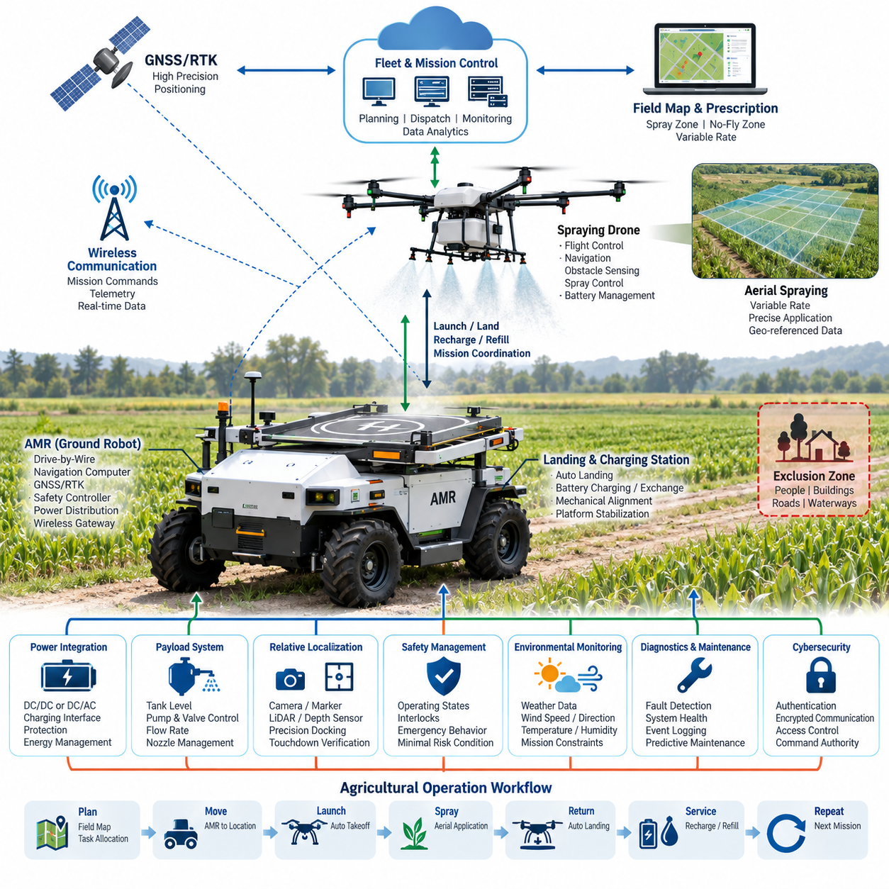
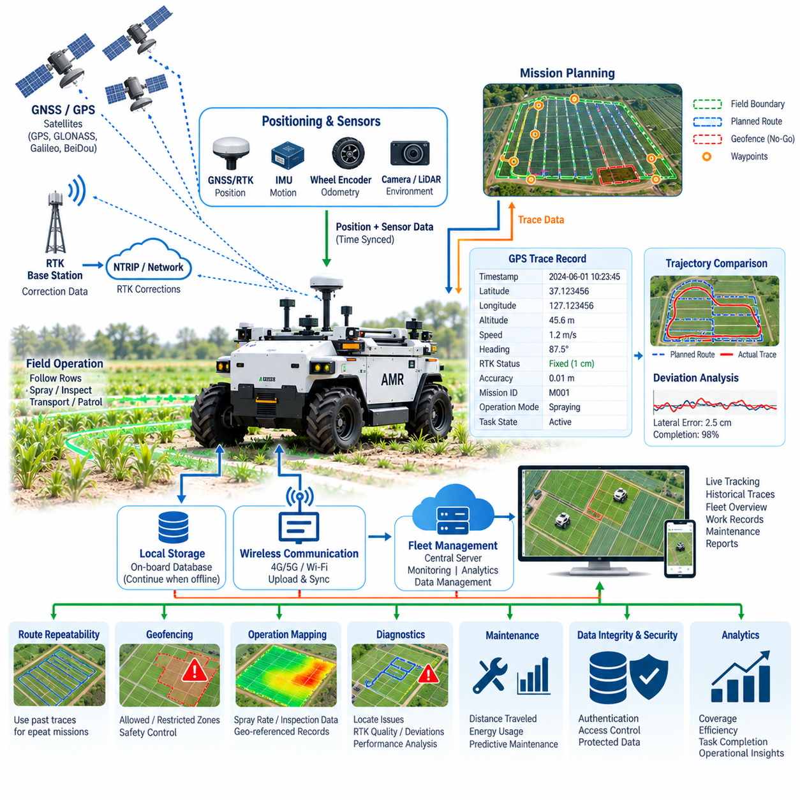
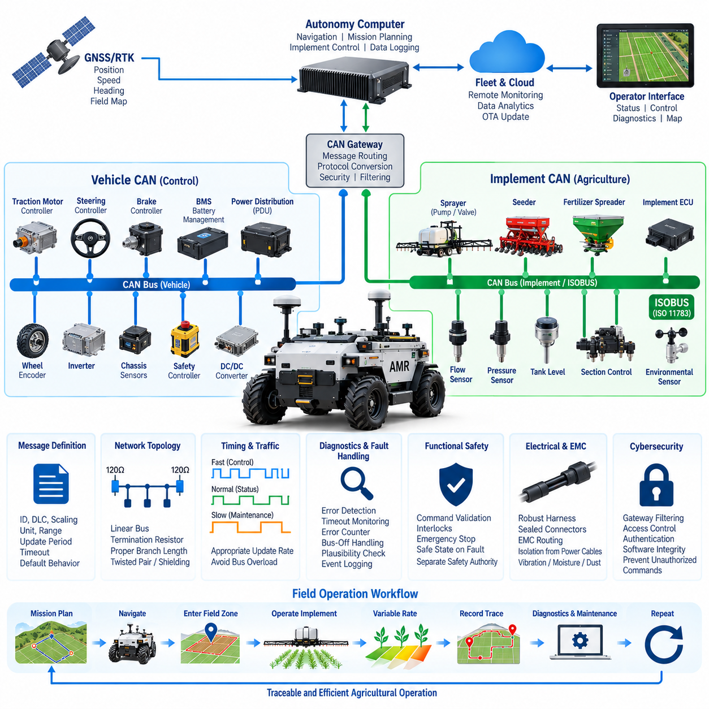
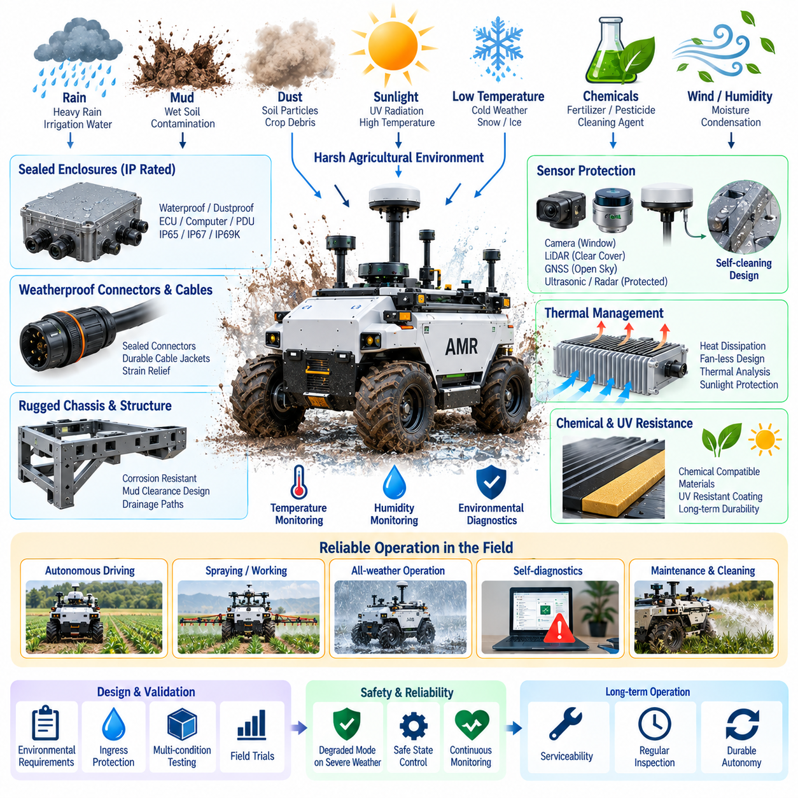
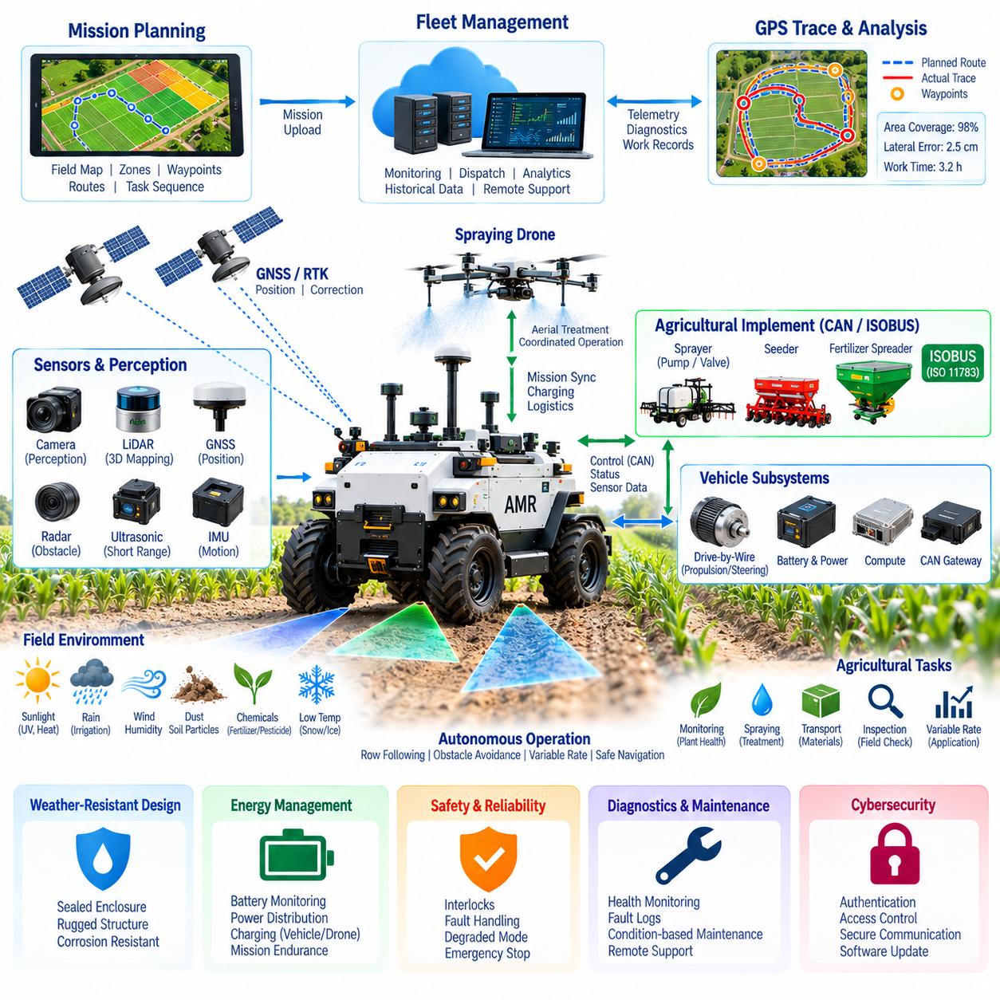

**Volume 17 Outdoor Autonomous Vehicle**

# Chapter 08. Agriculture AMR

## 08.01. Spraying Drone Integration

{width="7.268055555555556in" height="7.268055555555556in"}

살포 드론 통합(Spraying Drone Integration)은 농업용 자율이동로봇(Agricultural Autonomous Mobile Robot)을 단순한 지상 차량(Ground Vehicle)에서 지상-공중 협업 로봇 시스템(Coordinated Ground--Air Robotic System)으로 확장한다. 자율이동로봇(AMR)은 이동형 물류, 센싱(Sensing), 충전 및 통신 플랫폼 역할을 수행하고, 드론(Drone)은 지상에서 접근하기 어렵거나 비효율적인 농작물 구역의 공중 살포(Aerial Spraying)를 담당한다. 이러한 구조는 실외 자율주행 차량(Outdoor Autonomous Vehicle)의 농업용 AMR(Agriculture AMR) 영역에 해당한다.

통합의 핵심 문제는 단순히 드론을 자율이동로봇(AMR)에 탑재하거나 운반하는 것이 아니다. 지상 로봇(Ground Robot)과 비행체(Aerial Vehicle)는 공통 임무 아키텍처(Common Mission Architecture)를 통해 연결되는 두 개의 자율 서브시스템(Autonomous Subsystem)으로 동작해야 한다. 임무 계획(Mission Planning)은 지상 작업과 공중 살포 작업의 영역을 결정하며, 상위 제어기(Supervisory Controller)는 이륙, 비행, 살포, 복귀, 착륙, 보충 및 후속 임무를 조정한다.

일반적인 시스템은 차량(Vehicle), 드론(Drone), 페이로드(Payload), 통신(Communication), 측위(Positioning), 상위 제어(Supervisory Control) 계층으로 아키텍처를 구분한다. 자율이동로봇(AMR)은 자체 드라이브 바이 와이어(Drive-by-Wire) 제어기, 항법 컴퓨터(Navigation Computer), 위성항법/실시간 이동측위(GNSS/RTK) 수신기, 안전 제어기(Safety Controller), 전력 분배 시스템(Power Distribution System), 무선 게이트웨이(Wireless Gateway)를 포함한다. 드론은 통신이 일시적으로 끊어져도 독립적으로 안정화할 수 있도록 비행 제어, 추진, 항법, 장애물 감지, 살포 제어 및 배터리 관리 기능을 갖는다.

두 플랫폼이 동일한 농업 좌표계(Agricultural Coordinate System)에서 작동하기 때문에 정밀한 공간적 협조(Spatial Coordination)가 필수적이다. 위성항법/실시간 이동측위(GNSS/RTK)는 자율이동로봇(AMR), 드론, 농경지 지도(Field Map), 작물 열(Crop Row), 출입 제한 구역(Exclusion Zone), 살포 영역(Spray Polygon)에 공통 글로벌 기준(Global Reference)을 제공할 수 있다. 임무 서버(Mission Server)는 농업 작업 정의를 지리적 경로로 변환하여 작업자, 도로, 건물, 수로 및 인접 농경지로부터 적절한 안전거리를 유지하면서 허가된 구역만 살포하도록 한다.

통신 아키텍처(Communication Architecture)는 임무 수준 통신(Mission-Level Communication)과 비행 필수 제어(Flight-Critical Control)를 구분해야 한다. 임무 업로드, 이륙 승인, 목표 영역 할당, 복귀 요청, 원격측정(Telemetry) 보고 및 페이로드 상태와 같은 상위 명령은 자율이동로봇(AMR)의 통신 게이트웨이를 통해 전달될 수 있다. 반면 비행 안정화와 즉각적인 항공기 제어는 드론 내부에서 수행하여 지상 통신 링크가 끊어지더라도 비행체 자체가 직접 불안정해지지 않도록 해야 한다.

자율이동로봇(AMR)은 단순한 운반체가 아니라 이동형 드론 기지국(Mobile Drone Base Station)으로 기능할 수 있다. 전용 착륙 데크(Landing Deck)는 기계적 정렬, 착륙 감지, 전기 충전, 배터리 교환 인터페이스 및 운송 중 보호 기능을 제공할 수 있다. 지상 플랫폼은 임무 사이에 스스로 위치를 변경하여 드론의 비살포 이동 비행거리를 줄이고, 연속되는 처리 구역에 가까운 임시 이착륙 지점에서 드론을 운용할 수 있도록 한다.

전기적 통합(Electrical Integration)에서는 추진 전력(Propulsion Power)과 보조 페이로드 전력(Auxiliary Payload Power)을 신중하게 분리해야 한다. 충전기 아키텍처에 따라 자율이동로봇(AMR) 배터리는 적절히 절연된 직류/직류 변환기(DC/DC Converter) 또는 직류/교류 변환기(DC/AC Converter)를 통해 드론 충전기에 전력을 공급할 수 있다. 반복적인 드론 충전으로 인해 AMR의 안전 복귀 능력이 저하되지 않도록 전류 제한, 퓨즈 협조(Fuse Coordination), 커넥터 정격, 열 보호, 접지 전략 및 배터리 충전상태(State of Charge) 임계값을 설계해야 한다.

살포 기능은 추가적인 페이로드 제어 영역(Payload-Control Domain)을 형성한다. 드론은 비행 속도, 고도, 노즐 특성, 펌프 압력, 유량(Flow Rate), 명령된 살포량(Application Rate)을 상호 조정해야 한다. 임무 시스템은 이러한 매개변수를 지리적 처리 구역과 연계할 수 있으며, 이를 통해 서로 다른 작물 구역에 서로 다른 살포량을 적용하는 가변 살포(Variable-Rate Spraying)가 가능해진다. 살포 실행 데이터에는 시간 정보와 지리적 위치를 함께 기록하여 이후 추적성과 분석에 활용해야 한다.

페이로드 모니터링(Payload Monitoring)은 탱크 수위 또는 예상 잔량, 펌프 상태, 유량 정보, 밸브 상태 및 관련 고장 조건을 포함해야 한다. 상위 제어 시스템(Supervisory System)은 명령된 살포량과 실제 측정된 공급량을 비교하여 탱크 고갈, 노즐 막힘, 펌프 고장, 비정상적인 압력 변화 또는 과도한 소비와 같은 이상 상태를 탐지할 수 있다. 이를 통해 불확실한 처리 품질로 임무를 계속 수행하는 대신 임무를 중단하거나 수정할 수 있다.

착륙 인터페이스(Landing Interface)는 가장 까다로운 물리적 통합 지점 중 하나이다. 농경지의 불규칙한 지형은 자율이동로봇(AMR) 차체의 피치(Pitch) 또는 롤(Roll)을 발생시킬 수 있으며, 바람과 차량 진동은 정밀 착륙을 어렵게 만든다. 따라서 AMR이 정지하고, 플랫폼 자세가 허용 범위에 있음을 확인하고, 착륙 안전 상태를 설정한 후, 최종 접근 과정에서 드론에 점차 정밀한 상대 위치 정보를 제공하는 명확한 도킹 절차(Docking Sequence)가 필요하다.

상대 측위(Relative Localization)는 착륙 플랫폼 주변에서 위성항법/실시간 이동측위(GNSS/RTK)를 보완할 수 있다. 카메라(Camera), 기준 마커(Fiducial Marker), 깊이 센싱(Depth Sensing), 라이다(LiDAR) 또는 기타 로컬 측위 기술(Local Positioning Technology)을 활용하여 센티미터 수준의 상대 정렬이 필요한 최종 유도(Terminal Guidance)를 지원할 수 있다. 특히 착륙 이후 자동 충전이나 기계적 고정이 수행되는 경우에는 단순히 특정 좌표에 도달한 것을 착륙 완료로 간주하지 않고 실제 접지(Touchdown)를 검증된 상태로 관리해야 한다.

안전 협조(Safety Coordination)를 위해서는 두 장비 모두에 명확한 운용 상태(Operating State)를 정의해야 한다. 드론이 이륙 또는 착륙 중이거나, 충분히 고정되지 않았거나, 충전 인터페이스에 연결된 상태에서는 자율이동로봇(AMR)이 주행을 시작해서는 안 된다. 마찬가지로 지상 차량이 움직이고 있거나, 착륙 플랫폼의 위치가 부적절하거나, 보호 영역 내에 사람이 감지되거나, 필요한 통신, 측위, 기상 또는 페이로드 조건이 충족되지 않는 경우에는 드론 이륙을 금지해야 한다.

비상 동작(Emergency Behavior)은 단일 제어기에 의존하지 않고 분산되어야 한다. 드론은 배터리 부족, 항법 성능 저하, 추진계 고장, 통신 손실 또는 위험한 비행 조건에 대해 자율적인 대응 기능을 가져야 하며, 자율이동로봇(AMR) 역시 이동계 고장에 대한 자체 최소위험상태(Minimal-Risk Behavior)를 갖추어야 한다. 상위 제어 계층은 이러한 대응을 조정하지만, 하나의 고장이 두 플랫폼의 기본 안전 기능을 동시에 상실시키는 단일고장점(Single Point of Failure)이 되어서는 안 된다.

살포 작업에서는 성공적인 항법이 반드시 성공적인 농약 또는 처리제 적용을 의미하지 않기 때문에 환경 정보(Environmental Information)가 특히 중요하다. 풍속과 풍향은 비산(Drift)에 영향을 미칠 수 있으며, 강우, 온도, 습도 및 빠르게 변화하는 국지적 환경 조건은 임무 적합성에 영향을 준다. 따라서 기상 정보(Weather Information)를 임무 제약조건으로 사용하여 운용을 위해 정의된 환경 한계를 초과하면 살포 임무를 연기하거나 수정하거나 종료할 수 있다.

임무 계획(Mission Planning)은 농경지 지도, 작물 정보, 처리 처방(Treatment Prescription), AMR 주행 가능성, 드론 비행 지속시간, 페이로드 용량, 충전 요구사항 및 운용 제한을 통합할 수 있다. 각 로봇을 독립적으로 계획하는 대신 AMR이 지원 지점으로 이동하고, 드론이 지정 구역을 처리한 후 복귀하여 정비 또는 보급을 받고, AMR이 다음 전략적 위치로 이동하면서 다시 드론을 출격시키는 통합 작업 흐름을 최적화할 수 있다.

플릿 통합(Fleet Integration)은 이러한 개념을 단일 AMR-드론 조합을 넘어 확장한다. 중앙 제어 시스템(Central Control System)은 여러 농업 로봇, 드론, 충전 자원, 처리 구역 및 임무 우선순위를 관리할 수 있다. 각 비행 임무에서 생성되는 원격측정과 살포 기록은 전체 플릿 데이터 아키텍처(Fleet Data Architecture)와 연결되어 운용 모니터링, 유지보수 계획, 자원 활용도 분석 및 계획된 농업 작업과 실제 수행 결과의 비교를 지원한다.

무선 인터페이스가 독립적으로 이동하는 두 기계를 연결하기 때문에 사이버보안(Cybersecurity)과 명령 권한(Command Authority)도 중요하다. 임무 명령은 인증되어야 하고, 통신 채널은 보호되어야 하며, 소프트웨어 식별정보(Software Identity)를 관리하고 허가되지 않은 이륙 또는 살포 명령을 거부해야 한다. 시스템은 각 운용 상태에 대한 제어권을 명확히 정의하고, 현장 작업자, 원격 플릿 시스템, AMR 제어기 및 드론 제어 서브시스템에서 발생하는 상충 명령을 방지해야 한다.

진단(Diagnostics)은 개별 플랫폼뿐 아니라 두 플랫폼 사이의 인터페이스까지 포함해야 한다. 주요 통합 고장에는 드론 통신 불가, 충전기 고장, 도킹 센서 불일치, 위성항법/실시간 이동측위(GNSS/RTK) 성능 저하, 호환되지 않는 임무 데이터, 부족한 AMR 에너지 예비량, 부족한 드론 배터리, 페이로드 고갈 및 기계적 고정 확인 실패 등이 포함된다. 동기화된 진단 이벤트를 기록하면 지상-공중 시스템 경계를 가로질러 발생하는 복합 고장을 재구성할 수 있다.

로봇 전기전자 아키텍처(Robotics Electrical Architecture)의 관점에서 살포 드론 통합(Spraying Drone Integration)은 실외 자율주행 차량(Outdoor Autonomous Vehicle)이 또 다른 자율 기계를 지원하는 이동형 인프라 노드(Mobile Infrastructure Node)로 발전하는 방식을 보여준다. 더 넓은 로봇 공학 체계에서는 이러한 통합이 통신, 캘리브레이션(Calibration), 배터리 및 파워트레인(Powertrain), 안전, 인지(Perception), 컴퓨팅(Compute), 시험 및 검증 분야와 연결되며, 신뢰성 높은 통합은 하나의 인터페이스 기술이 아니라 전기전자 및 시스템 수준의 통합 공학에 의해 달성된다.

## 08.02. GPS Tracing Design

{width="7.268055555555556in" height="7.268055555555556in"}

농업용 자율이동로봇(Agricultural Autonomous Mobile Robot)의 GPS 궤적 추적 설계(GPS Tracing Design)는 차량이 어디를 주행했는지, 어디에서 농업 작업을 수행했는지, 계획된 경로를 얼마나 정확하게 추종했는지를 연속적인 공간 기록(Spatial Record)으로 구축한다. 농업용 AMR(Agriculture AMR) 아키텍처에서 이 기능은 측위(Positioning), 항법(Navigation), 임무 수행(Mission Execution), 농경지 지도화(Field Mapping), 운용 기록(Operational Records)을 하나의 공통 지리적 프레임워크(Geographic Framework)로 연결한다.

추적 시스템(Tracing System)은 위도, 경도, 고도, 속도, 방향 관련 정보 및 측위 품질(Positioning Quality)을 지속적으로 추정하는 글로벌 측위 소스(Global Positioning Source)에서 시작한다. 일반 GPS는 대략적인 추적에는 충분할 수 있지만, 농업용 자율주행에서는 차량이 작물 열(Crop Row), 처리 경계, 점검 경로 또는 정밀하게 정의된 작업 통로를 반복적으로 추종해야 하므로 RTK 보정(RTK Correction)을 사용하는 위성항법시스템(GNSS)이 필요한 경우가 많다.

GPS 궤적 추적(GPS Tracing)은 자율 측위(Autonomous Localization) 자체와 구분되어야 한다. 측위(Localization)는 즉각적인 항법과 제어를 위해 로봇의 현재 자세(Pose)를 결정하는 반면, 궤적 추적은 시간과 운용 상황에 연계된 과거 위치의 연속적인 기록을 저장한다. 생성된 궤적(Trajectory)은 차량 이동을 지속적으로 표현하는 디지털 기록이 되며, 이후 시각화, 분석, 계획 경로와의 비교 또는 완료된 농업 작업과의 연계에 활용할 수 있다.

따라서 각 궤적 기록(Trace Record)은 단순한 지리 좌표 이상의 정보를 포함해야 한다. 실용적인 기록에는 타임스탬프(Timestamp), 위도, 경도, 고도, 측위 상태, 예상 정확도, 차량 속도, 진행 방향(Heading), 임무 식별자(Mission Identifier), 운용 모드 및 관련 작업 상태를 결합할 수 있다. 추가 필드를 통해 차량이 항법, 살포, 점검, 자재 운송, 대기, 도킹(Docking) 또는 비정상 상태 대응 중이었는지도 기록할 수 있다.

GPS 궤적을 다른 로봇 정보와 결합하려면 시간 동기화(Time Synchronization)가 필수적이다. GNSS 관측값, 관성측정장치(IMU) 측정값, 휠 오도메트리(Wheel Odometry), 카메라 프레임, 라이다(LiDAR) 데이터, CAN 메시지, 액추에이터(Actuator) 상태 및 농업용 페이로드(Payload) 정보는 충분히 일관된 시간 기준을 사용해야 한다. 동기화가 이루어지지 않으면 보고된 이벤트의 지리적 위치와 실제 센서 관측 또는 액추에이터 동작이 발생한 위치가 서로 달라질 수 있다.

추적 아키텍처(Tracing Architecture)는 원시 측위 데이터(Raw Positioning Data)와 처리된 운용 궤적(Processed Operational Trajectory)을 분리할 수 있다. 원시 GNSS 측정값과 수신기 상태는 진단 및 사후 분석에 유용한 정보를 보존하며, 항법 시스템은 GNSS, RTK, IMU 및 차량 운동 정보를 이용해 필터링된 위치 추정값을 생성한다. 이후 운용 궤적은 측위 시스템이 기준값으로 선택한 위치 추정값과 신뢰도 또는 품질 상태를 함께 저장할 수 있다.

센티미터 수준의 측위 정확도가 항상 유지된다고 가정할 수 없기 때문에 RTK 상태(RTK Status)를 반드시 보존해야 한다. 수신기는 위성 가시성, 보정정보 가용성, 다중경로(Multipath), 대기 조건, 통신 품질 및 주변 구조물에 따라 고정 RTK(Fixed RTK), 부동 RTK(Float RTK), 차분 측위(Differential), 단독 측위(Standalone) 또는 성능 저하 상태 사이를 전환할 수 있다. 측위 품질 메타데이터가 없는 궤적은 불확실한 위치까지 동일한 정확도를 가진 것처럼 잘못 표현할 수 있다.

농업 환경은 차량 이동이 반복적인 기하학적 패턴을 따르는 경우가 많기 때문에 고유한 궤적 추적 요구사항을 가진다. 작물 열(Crop Row), 과수원 통로(Orchard Lane), 온실 접근로, 농경지 경계(Field Boundary), 두렁 및 선회 구역(Headland), 진입로, 처리 영역(Treatment Polygon)을 지리적 객체로 표현할 수 있다. 기록된 궤적을 이러한 기준과 비교하면 AMR이 의도된 운용 통로 내에서 주행했는지를 평가할 수 있다.

경로 추적(Route Tracing)은 반복 주행성(Repeatability)도 지원한다. 검증된 경로가 기록되면 환경 및 안전 조건이 적절하다는 전제에서 이후 임무의 기준 경로로 활용할 수 있다. 반복 주행은 작물 모니터링, 살포 지원, 점검, 물류 및 계절별 데이터 수집에 유용하며, 서로 다른 시점에서 획득한 측정 데이터를 대략적으로 동일한 지리적 위치를 기준으로 비교할 수 있게 한다.

계획 경로(Planned Route)와 실제 궤적(Actual Trajectory)은 서로 다른 데이터 객체로 유지해야 한다. 계획 경로는 임무 시스템이 AMR을 주행시키려고 의도한 위치를 나타내고, 실제 궤적은 차량이 실제로 이동한 위치를 나타낸다. 두 데이터를 비교하면 횡방향 편차(Lateral Deviation), 종방향 진행도, 누락 구간, 예상하지 못한 우회, 정지 위치, 경로 완료율 및 측위 또는 이동 성능이 저하된 영역을 계산할 수 있다.

샘플링 전략(Sampling Strategy)은 궤적 품질과 저장 용량 모두에 영향을 준다. 위치점(Position Point)은 시간 간격, 이동 거리, 차량 상태 전환 또는 이러한 조건들의 조합에 따라 기록할 수 있다. 지나치게 성긴 샘플링은 짧은 경로 이탈이나 조향 동작을 놓칠 수 있고, 불필요하게 조밀한 기록은 통신 및 저장 부하를 증가시킨다. 따라서 요구 해상도는 차량 속도, 항법 정확도, 농경지 형상 및 향후 분석 목적에 맞추어 결정해야 한다.

GPS 또는 GNSS 좌표에는 갑작스러운 위치 점프, 중복 샘플, 일시적 데이터 손실 또는 물리적으로 불가능한 이동이 포함될 수 있으므로 궤적 필터링(Trace Filtering)을 신중하게 설계해야 한다. 검증 과정에서는 연속 위치 사이의 시간, 차량 속도, IMU 동작, 휠 움직임 및 수신기 품질 지표를 비교할 수 있다. 의심스러운 관측값을 신뢰할 수 있는 차량 이동으로 처리하기보다 품질 정보와 함께 표시하는 것이 바람직하다.

GNSS를 일시적으로 사용할 수 없을 경우 IMU, 휠 오도메트리, 라이다(LiDAR), 카메라 또는 기타 가용 센서를 기반으로 하는 통합 측위(Integrated Localization)를 이용하여 궤적을 계속 생성할 수 있다. 그러나 추적 시스템은 GNSS가 직접 지원한 위치와 성능 저하 상태에서 추정된 위치를 명확하게 구분해야 한다. 신뢰할 수 있는 GNSS/RTK 정보가 복구되면 측위 아키텍처는 궤적을 다시 정합하면서도 통신 또는 측위 단절에 대한 진단 정보를 보존할 수 있다.

지오펜싱(Geofencing)은 동일한 지리적 프레임워크를 직접 활용할 수 있다. 시스템은 허용 운용 구역, 제한 구역, 농경지 경계, 도로, 수로, 건물, 작업자 활동 구역 또는 기타 출입 금지 영역을 정의할 수 있다. 현재 위치를 이러한 지리적 제약조건과 지속적으로 비교함으로써 경계에 접근하거나 경계를 침범할 경우 임무 또는 안전 아키텍처가 경고, 감속, 정지 또는 사전에 정의된 다른 대응을 수행할 수 있다.

궤적 추적은 농업용 페이로드 정보(Agricultural Payload Information)와 결합할 때 특히 높은 가치를 제공한다. 살포 작업을 지원하는 차량은 지리적 위치와 살포 활성화 상태, 살포량(Application Rate), 탱크 상태 또는 드론 이륙 위치를 연계할 수 있다. 점검 시스템은 위치를 작물 상태 감지 결과, 영상, 열화상 관측 또는 환경 측정값과 연결하여 개별 센서 파일이 아니라 지리적으로 참조된 농업 기록(Geo-Referenced Agricultural Record)을 생성할 수 있다.

AMR은 로컬 궤적 데이터베이스(Local Trace Database)를 유지하면서 선택된 정보를 중앙 제어 시스템(Central Control System)에 동시에 전송할 수 있다. 로컬 저장은 무선 통신이 끊어진 동안에도 기록의 연속성을 보장하고, 플릿 통신(Fleet Communication)은 원격 시각화 및 임무 감독을 지원한다. 연결이 복구되면 모든 원시 센서 데이터를 지속적으로 고대역폭으로 전송하지 않고도 버퍼링된 궤적 기록을 중앙 데이터베이스와 동기화할 수 있다.

플릿 관리 시스템(Fleet Management System)은 현재 로봇 위치와 함께 과거 궤적, 임무 경로, 농경지 경계 및 운용 상태를 시각화할 수 있다. 여러 농업용 AMR을 운용하는 경우 이러한 지리적 표현은 관리자가 작업 범위, 차량 분포, 진행 상황, 혼잡 및 잔여 작업을 파악하는 데 도움을 준다. 궤적 데이터는 특정 임무 기간에 특정 지역을 실제로 방문하거나 처리했다는 운용 증거로도 활용할 수 있다.

궤적 기록은 운용 증거(Operational Evidence)가 될 수 있으므로 데이터 무결성(Data Integrity)이 중요하다. 모든 궤적은 일관된 타임스탬프, 좌표 기준 정의(Coordinate Reference Definition), 차량 식별정보, 임무 식별정보 및 측위 품질 정보를 유지해야 한다. 데이터베이스 또는 파일 형식은 좌표계 사이의 혼동을 방지하고 지리적 위도·경도와 투영 지도 좌표(Projected Map Coordinate) 또는 로봇 로컬 좌표계(Robot-Local Coordinate Frame)를 명확히 구분해야 한다.

진단(Diagnostics)은 궤적 정보를 활용하여 반복적으로 발생하는 측위 또는 항법 문제를 식별할 수 있다. 특정 구조물, 식생, 지형 특징 또는 통신 음영지역 근처에서 RTK 품질이 반복적으로 저하되는 경우 과거 궤적을 분석하여 공간적 패턴을 확인할 수 있다. 유사한 분석을 통해 반복적인 경로 이탈, 휠 슬립(Wheel Slip) 발생 구역, 어려운 회전 구간, 과도한 정지 또는 자율주행 기능이 자주 개입을 요구하는 위치를 식별할 수 있다.

궤적 데이터는 유지보수(Maintenance)와 성능 분석에도 활용된다. 검증된 궤적으로부터 실제 이동거리를 계산하고 이를 운용시간, 배터리 소비량, 모터 데이터, 서스펜션 하중 또는 페이로드 작동 정보와 결합할 수 있다. 따라서 유지보수 주기를 단순한 달력 시간이 아니라 실제 차량 사용량에 기반하여 설정할 수 있으며, 에너지 분석을 통해 지속적으로 비정상적으로 높은 추진 에너지를 요구하는 농경지 구간도 식별할 수 있다.

사이버보안(Cybersecurity)과 접근 제어(Access Control)는 실시간 위치 정보와 과거 궤적 기록 모두를 보호해야 한다. 계획 경로, 지오펜스 또는 기록된 궤적을 무단으로 변경하면 자율주행 운용이 위험해지거나 운용 기록의 신뢰성이 훼손될 수 있다. 따라서 인증(Authentication), 명령 권한 제어(Command Authority), 보호된 통신, 이벤트 로깅(Event Logging), 적절한 데이터 접근 권한을 차량 측위 서브시스템부터 플릿 수준의 지리 데이터베이스까지 적용해야 한다.

견고한 GPS 궤적 추적 설계(GPS Tracing Design)는 궁극적으로 차량의 이동을 구조화된 운용 데이터(Structured Operational Data)로 변환한다. 농업용 AMR(Agriculture AMR) 아키텍처는 GPS를 단순한 항법 센서로만 취급하지 않고 지리적으로 참조된 이력 데이터를 이용하여 자율주행, 작업 수행, 페이로드 활동, 안전 제약조건, 플릿 감독, 진단 및 데이터 분석을 연결한다. 이를 통해 궤적은 로봇이 어디로 이동했는지뿐만 아니라 이동 경로를 따라 로봇 시스템이 무엇을 수행했는지를 나타내는 핵심 디지털 기록(Digital Record)이 된다.

## 08.03. Agricultural CAN Integration

{width="7.268055555555556in" height="7.268055555555556in"}

농업용 CAN 통합(Agricultural CAN Integration)은 자율 농업용 이동로봇(Autonomous Agricultural Mobile Robot)의 추진 제어기, 조향 시스템, 센서, 전력전자 장치, 작업기(Implement), 농업용 페이로드(Agricultural Payload)를 연결하는 통신 백본(Communication Backbone)을 제공한다. 농업용 AMR(Agriculture AMR) 아키텍처에서 CAN 네트워크는 독립적으로 개발된 전기전자 서브시스템을 하나의 협조된 기계 시스템으로 통합하여 운용 상태, 명령, 진단 및 안전 정보를 현장 작업 중 안정적으로 교환할 수 있게 한다.

기본 아키텍처는 일반적으로 차량 제어 통신(Vehicle-Control Communication)과 작업기 및 응용 통신(Implement and Application Communication)을 분리한다. 차량 네트워크는 드라이브 바이 와이어(Drive-by-Wire), 조향, 제동, 모터 제어, 배터리 관리 및 섀시 상태와 관련된 정보를 전달하고, 농업용 인터페이스 네트워크(Agricultural Interface Network)는 살포기, 펌프, 밸브, 파종기, 비료 살포 장비, 환경 센서 및 기타 농작업 장치를 연결한다. 게이트웨이(Gateway)는 이러한 영역 사이에서 선택된 정보를 교환할 수 있다.

CAN은 결정론적 메시지 중재(Deterministic Message Arbitration), 차동 신호(Differential Signaling), 오류 검출, 재전송 메커니즘 및 전기적 잡음이 많은 환경에서의 견고한 동작 특성을 제공하기 때문에 농업기계에 특히 적합하다. 농업용 로봇은 모터, 인버터, 펌프, 릴레이, 직류/직류 변환기(DC/DC Converter), GNSS 수신기, 컴퓨터 및 다양한 센서를 결합하므로 통신 인터페이스는 전자기 간섭, 진동, 온도 변화, 습기 및 장시간 운용 환경을 견딜 수 있어야 한다.

CAN 물리 계층(Physical CAN Layer)은 임의적인 배선이 아니라 제어된 버스 토폴로지(Bus Topology)를 필요로 한다. 일반적인 CAN 네트워크는 양쪽 물리적 끝단에 종단 저항(Termination Resistance)을 배치한 선형 백본(Linear Backbone)을 사용하며, 분기 길이는 선택된 비트 전송률(Bit Rate)과 하네스 구성에 적합해야 한다. 케이블 임피던스, 연선(Twisted Pair) 구조, 차폐 전략, 커넥터 품질, 접지 및 고전류 모터 케이블과의 배선 경로는 통신 신뢰성에 직접적인 영향을 준다.

장치 수가 증가할수록 네트워크 분할(Network Segmentation)이 중요해진다. 추진 및 조향 제어기는 전용 제어 CAN(Control CAN)을 사용하고, 배터리 및 전력 분배 장치는 별도의 네트워크를 사용하며, 농업용 작업기는 작업기 CAN(Implement CAN)을 사용할 수 있다. 이러한 구조는 트래픽 부하와 고장 전파를 제한하면서 서로 다른 갱신 주기와 인터페이스 정책을 적용할 수 있게 한다. 중앙 차량 제어기 또는 게이트웨이는 이러한 네트워크 사이의 통신을 제어한다.

농업기계와의 호환성을 위해 CAN 통합에는 일반적으로 아이소버스(ISOBUS)라고 불리는 ISO 11783의 원리를 적용할 수 있다. ISOBUS는 CAN 기반 네트워크를 기반으로 농업 통신 기능을 구축하며 트랙터, 작업기, 제어기 및 운전자 인터페이스 사이의 표준화된 통신 메커니즘을 제공한다. 자율이동로봇(AMR)도 기존 농업 차량용으로 개발된 작업기를 통합할 때 이러한 호환 개념을 활용할 수 있다.

통합 아키텍처는 모든 CAN 메시지를 명확하게 정의해야 한다. 각 신호에는 식별자(Identifier), 데이터 길이, 바이트 위치, 스케일링 계수(Scaling Factor), 오프셋(Offset), 단위, 유효 범위, 갱신 주기, 타임아웃(Timeout), 기본 동작 및 소유권(Ownership)이 정의되어야 한다. 명령과 상태 신호를 비공식적으로 정의하면 AMR 제어기, 작업기 제어기, 게이트웨이 및 외부 농업 장비 사이에서 신호 해석의 불일치가 발생할 수 있다.

메시지 타이밍(Message Timing)은 각 서브시스템의 동특성에 맞추어야 한다. 조향각, 휠 속도, 구동 토크, 브레이크 상태 및 안전 관련 상태 정보는 일반적으로 탱크 수위, 온도, 누적 운전시간 또는 유지보수 정보보다 빠른 주기의 통신이 필요하다. 적절한 전송 주기를 설계하면 불필요한 버스 사용률(Bus Utilization)을 줄이면서 시간 임계 제어 정보가 충분한 빈도로 수신 제어기에 도달하도록 할 수 있다.

농업용 페이로드 제어(Agricultural Payload Control)는 CAN을 통해 차량 운동과 긴밀하게 연계할 수 있다. 예를 들어 살포 시스템은 차량 속도, 운용 상태, 임무 활성화 신호 및 요구 살포량(Application Rate)을 수신하고 펌프 상태, 압력, 유량, 밸브 상태, 탱크 수위 및 진단 정보를 반환할 수 있다. 제어기는 차량 속도에 따라 살포량을 조절하여 AMR이 가속하거나 감속하더라도 단위 면적당 적용량을 일정하게 유지할 수 있다.

지리적 작업 수행(Geographic Task Execution)도 CAN 아키텍처와 연결할 수 있다. GNSS/RTK와 임무 계획(Mission Planning) 기능은 AMR이 처리 구역에 진입하는 시점을 판단하고, 상위 컴퓨터(Supervisory Computer)는 지리적 임무 결정을 작업기 명령으로 변환한다. 이후 CAN은 펌프, 밸브, 액추에이터 또는 기타 농업 장비를 작동시키는 로컬 기계 수준 인터페이스를 제공하여 디지털 농경지 처방(Digital Field Prescription)을 실제 물리적 작업으로 연결한다.

안전을 위해 일반 통신(Ordinary Communication)과 안전 권한(Safety Authority)을 분리해야 한다. 유효한 CAN 프레임을 수신했다는 사실만으로 액추에이터가 요청된 동작을 실행해서는 안 된다. 제어기는 명령을 승인하기 전에 운용 모드, 활성화 조건, 인터록(Interlock), 통신 상태, 비상정지(Emergency Stop) 상태, 차량 움직임 및 기타 관련 안전 조건을 평가해야 한다. 필요한 조건이 사라질 경우 핵심 출력은 사전에 정의된 안전 상태(Safe State)로 전환되어야 한다.

통신 타임아웃 모니터링(Communication Timeout Monitoring)은 이러한 동작의 핵심 요소이다. 중요한 모든 주기 메시지에는 예상 수신 간격이 정의되어야 하며, 수신 제어기는 메시지가 누락되거나 과도하게 지연되는 상황을 감지해야 한다. 조향 명령, 추진 상태, 작업기 활성화 정보 또는 안전 상태 정보가 손실되면 해당 기능에 적합한 대응을 수행해야 하며, 이는 진단 보고부터 제어된 정지 또는 최소위험상태(Minimal-Risk Condition)로의 전환까지 포함할 수 있다.

CAN 오류 처리(CAN Error Handling) 역시 시스템 진단에 포함되어야 한다. 오류 카운터(Error Counter), 오류 수동 상태(Error-Passive State), 버스 오프(Bus-Off), 반복적인 프레임 오류, 통신 리셋 및 게이트웨이 고장은 하네스 손상, 커넥터 열화, 전자기 간섭, 잘못된 종단, 호환되지 않는 비트 전송률 또는 전자제어장치(ECU) 고장을 나타낼 수 있다. 이러한 이벤트를 기록하면 현장 고장을 설명하기 어려운 간헐적 현상으로 남겨두지 않고 체계적으로 분석할 수 있다.

진단(Diagnostics)은 통신 고장뿐만 아니라 응용 계층 고장(Application-Level Fault)도 식별해야 한다. 정상적인 CAN 링크에서도 잘못된 센서 값, 상충되는 운용 상태, 오래된 정보 또는 허용 범위를 벗어난 명령이 전달될 수 있다. 따라서 타당성 검사(Plausibility Checking)는 수신 정보와 물리적 예상값 및 관련 신호를 비교한다. 휠 속도는 차량 움직임과, 펌프 명령은 측정 유량과, 밸브 명령은 실제 살포 동작과 비교할 수 있다.

농업 장비와 자율주행 차량이 서로 다른 프로토콜 또는 메시지 규칙을 사용하는 경우 게이트웨이(Gateway)는 중요한 역할을 수행한다. 게이트웨이는 식별자 변환, 신호 스케일 변환, 트래픽 필터링, 명령 권한 적용, 이벤트 타임스탬프 기록 및 상위 소프트웨어에 대한 선택적 정보 제공을 수행할 수 있다. 또한 모든 내부 메시지를 직접 노출하지 않고 CAN 또는 CAN FD 네트워크를 이더넷(Ethernet), ROS 2, 플릿 통신, 진단 또는 클라우드 인터페이스와 연결할 수 있다.

더 큰 데이터 페이로드나 높은 데이터 전송률이 필요한 경우 CAN FD를 고려할 수 있지만 기존 농업 장비와의 호환성을 신중하게 평가해야 한다. 기존 CAN은 임베디드 기계 시스템에서 여전히 광범위하게 사용되므로 농업용 AMR은 여러 네트워크 기술을 동시에 운용할 수 있다. 고대역폭 인지 데이터는 이더넷 계열 네트워크에 적합하고, CAN은 소형 제어, 상태, 진단 및 액추에이터 메시지에 적합하다.

자율주행 컴퓨팅 플랫폼(Autonomous Compute Platform)이 예측 가능한 로컬 동작을 요구하는 임베디드 제어 기능까지 직접 대체해서는 안 된다. 고성능 컴퓨터는 항법, 임무, 인지 및 농업 작업 의사결정을 수행할 수 있지만, 전용 전자제어장치(ECU)는 모터 제어, 조향 루프, 배터리 보호, 펌프 조절과 같은 실시간 기능을 계속 담당해야 한다. CAN은 상위 자율주행 시스템이 이러한 결정론적 임베디드 제어기를 조정하는 경계 인터페이스를 형성한다.

전기적 전원 상태(Electrical Power State)는 네트워크 상태와 함께 조정되어야 한다. 시동 과정에서 제어기들이 서로 다른 시점에 활성화될 수 있으므로 조기 명령을 방지하는 초기화 절차(Initialization Sequence)가 필요하다. 종료 과정에서는 진단 기록을 보존하고, 작업기를 안전 상태로 전환하며, 추진 시스템을 적절하게 비활성화하고, 무제어 전원 차단으로 인한 통신 오류를 방지해야 한다. 에너지 효율적인 대기 운용을 위해 웨이크업(Wake-Up)과 슬립(Sleep) 동작도 정의해야 한다.

하네스 엔지니어링(Harness Engineering)은 실외 농업용 CAN 네트워크에서 특히 중요하다. 커넥터와 케이블은 물, 진흙, 먼지, 비료, 화학물질, 진동, 반복 굽힘, 자외선 및 기계적 충격에 노출될 수 있다. 방수형 커넥터(Sealed Connector), 적절한 케이블 외피, 스트레인 릴리프(Strain Relief), 보호 배선, 서비스 루프(Service Loop), 적절한 스플라이스(Splice) 방식 및 접근 가능한 진단 지점은 장기간 통신 신뢰성에 직접적으로 기여한다.

전자파 적합성(Electromagnetic Compatibility)은 물리적 배선과 함께 고려해야 한다. 모터 상 케이블, 인버터 스위칭, 펌프, 솔레노이드, 컨택터, 충전 장비 및 직류/직류 변환기는 전기적 잡음을 발생시킬 수 있다. CAN 배선은 정의된 전자파 적합성(EMC) 전략에 따라 배치하고 접지해야 하며, 가능한 경우 고전류 스위칭 도체와 충분한 거리를 확보해야 한다. 차폐(Shielding)는 접지 경로를 고려하지 않은 채 추가하는 것이 아니라 전체 시스템 관점에서 설계해야 한다.

문서화된 네트워크 데이터베이스(Network Database)와 진단 인터페이스(Diagnostic Interface)는 정비성(Serviceability)을 향상시킨다. 정비 담당자는 노드를 식별하고, 관련 메시지를 관찰하고, 진단 고장 정보를 읽고, 버스 부하를 확인하고, 오류 상태를 검사하며, 액추에이터 또는 센서 통신을 검증할 수 있어야 한다. 농업 작업기, 차량 제어기 및 자율주행 소프트웨어가 제품 세대에 따라 독립적으로 발전하기 때문에 버전 관리된 신호 정의(Version-Controlled Signal Definition)가 특히 중요하다.

CAN이 게이트웨이를 통해 무선 네트워크, 플릿 시스템 또는 원격 유지보수 네트워크와 연결되면서 사이버보안(Cybersecurity)의 중요성이 더욱 증가한다. 전통적인 CAN 버스는 자체적인 보안 메커니즘이 제한적이므로 외부 인터페이스에서는 차량 네트워크에 전달할 수 있는 원격 명령을 제한해야 한다. 인증(Authentication), 게이트웨이 필터링, 접근 제어, 소프트웨어 무결성, 진단 권한 관리 및 이벤트 로깅을 통해 허가되지 않은 명령이 물리적 액추에이터까지 전달되는 것을 방지해야 한다.

농업용 CAN 통합(Agricultural CAN Integration)은 궁극적으로 농업용 AMR(Agriculture AMR)의 기계 수준 신경망(Machine-Level Nervous System)을 구축한다. CAN은 자율주행 컴퓨팅을 추진, 조향, 에너지 관리, 안전 제어기 및 농작업 장치와 연결하면서 물리적 하드웨어 가까이에서 결정론적 임베디드 제어를 유지한다. 측위, 플릿 통신, 진단, 전기적 보호 및 견고한 하네스 엔지니어링과 결합된 CAN 아키텍처는 실제 농업 환경에서 자율 시스템의 의사결정을 제어 가능하고 추적 가능한 물리적 동작으로 변환한다.

## 08.04. Weather Resistant Design

{width="7.268055555555556in" height="7.268055555555556in"}

농업용 자율이동로봇(Agricultural Autonomous Mobile Robot)의 내후성 설계(Weather-Resistant Design)는 차량이 비, 관개수, 진흙, 먼지, 습도, 온도 변화, 태양광, 농업용 화학물질 및 오염된 농경지 표면에 지속적으로 노출되는 환경에서도 안정적인 운용을 보장한다. 농업용 AMR(Agriculture AMR) 아키텍처에서 환경 보호(Environmental Protection)는 개별 부품만이 아니라 전체 전기, 기계, 센싱, 컴퓨팅, 통신 및 전력 시스템을 포괄해야 한다.

설계 과정은 환경 운용 범위(Environmental Operating Envelope)를 정의하는 것에서 시작한다. 예상 강우 강도, 고인 물, 먼지 농도, 진흙 노출, 온도 범위, 습도, 일사량, 바람, 결로, 세척 절차 및 화학물질 접촉 조건을 대상 농업 환경에 맞추어 식별해야 한다. 이러한 조건은 인클로저(Enclosure), 커넥터, 케이블, 센서, 냉각 시스템, 배터리, 액추에이터 및 구조 인터페이스에 대한 공학적 요구사항이 된다.

침투 보호(Ingress Protection)는 물과 입자성 오염물질이 실외 전자장치를 빠르게 열화시킬 수 있기 때문에 기본적인 요구사항이다. 전자제어장치(ECU), 전력 분배 장치, 통신 게이트웨이 및 컴퓨팅 모듈은 적절하게 밀폐된 인클로저 내부에 설치해야 한다. 요구되는 IP 등급(IP Rating)은 모든 부품에 동일한 보호 수준을 일률적으로 적용하기보다 실제 노출 환경을 기반으로 선정해야 한다.

수분 관리(Water Management)는 모든 개구부를 단순히 밀폐하는 것 이상의 설계를 요구한다. 차량 형상은 빗물과 관개수가 전자장치, 커넥터, 센서, 충전 인터페이스 및 케이블 관통부 주변에 고이지 않도록 해야 한다. 경사진 표면, 배수 채널, 물 흐름 경로, 보호된 커넥터 방향 및 적절한 위치의 배수구를 이용하여 인클로저 씰이 최종 보호 장벽이 되기 전에 물을 민감한 부품으로부터 멀리 유도할 수 있다.

밀폐 인터페이스(Sealing Interface)는 반복적인 정비 작업 이후 환경 보호 성능이 저하될 수 있으므로 세심한 기계 설계가 필요하다. 개스킷(Gasket), 오링(O-Ring), 케이블 글랜드(Cable Gland), 점검 커버, 커넥터 씰 및 인클로저 접합부는 진동, 온도 사이클 및 노화 과정에서도 적절한 압축력을 유지해야 한다. 정비 후에도 최초의 밀폐 성능이 자동으로 유지된다고 가정하지 말고 씰이 올바르게 교체되고 재장착되도록 정비 절차를 정의해야 한다.

결로(Condensation)는 직접적인 수분 침투와는 다른 문제를 발생시킨다. 밀폐된 인클로저 내부에 습한 공기가 존재하면 온도 변화로 내부 표면 온도가 이슬점(Dew Point) 이하로 떨어질 때 응축수가 발생할 수 있다. 압력 평형 멤브레인(Pressure-Equalization Membrane), 제어된 환기, 내습성 소재, 컨포멀 코팅(Conformal Coating), 열관리 및 적절한 인클로저 배치를 통해 외부 물과 오염물질에 대한 보호 성능을 유지하면서 결로 위험을 줄일 수 있다.

먼지 보호(Dust Protection)는 건조한 농업 환경에서 특히 중요하다. 토양 입자, 작물 잔해, 비료 분진 및 미세 유기물은 냉각 시스템, 광학 센서, 기계 관절 및 전기 인터페이스 주변에 축적될 수 있다. 인클로저 설계는 먼지의 직접적인 유입을 최소화해야 하며, 노출된 부품은 오염으로 인해 과도한 열저항, 광학 성능 저하, 기계적 고착 또는 전기적 누설 경로가 발생하지 않도록 설계해야 한다.

진흙(Mud)은 기계적 문제와 전기적 문제를 동시에 발생시킨다. 진흙은 센서를 덮고 배수 경로를 차단하며 휠과 서스펜션 주변에 축적되고 커넥터에 습기를 지속적으로 유지시키며 차량 질량을 증가시킬 수 있다. 하부 섀시 가까이에 배치되는 부품에는 추가적인 차폐 또는 보호 배치가 필요하다. 진흙 배출 구조(Mud-Clearance Geometry)는 취약한 하드웨어 주변에 오염물이 지속적으로 쌓이지 않고 차량 외부로 배출될 수 있도록 설계해야 한다.

전자장치를 외부 환경으로부터 밀폐하면 열관리 설계(Thermal Design)가 더욱 어려워진다. 고성능 컴퓨터, 모터 제어기, 직류/직류 변환기(DC/DC Converter), 충전기, 통신 장비 및 배터리는 열을 발생시키며, 직사광선은 로봇이 정지한 상태에서도 인클로저 온도를 높일 수 있다. 따라서 열해석(Thermal Analysis)은 내부 발열, 태양 복사 부하(Solar Loading), 주변 온도, 공기 흐름, 인클로저 열전도도 및 운용 듀티 사이클(Duty Cycle)을 동시에 고려해야 한다.

가능한 경우 수동 열관리(Passive Thermal Management)를 적용하는 것이 바람직하다. 팬과 외부 공기 유입 경로는 추가적인 오염 위험을 만들기 때문이다. 히트 스프레더(Heat Spreader), 열전도성 인클로저 벽, 섀시 장착형 방열판, 열 인터페이스 재료(Thermal Interface Material) 및 발열 부품의 분리 배치를 이용하면 오염된 외기를 전자장치 내부로 유입하지 않고 열을 전달할 수 있다. 강제 냉각이 필요한 경우에는 오염 축적 이후에도 예측 가능한 성능과 정비성을 확보하도록 필터형 또는 격리형 냉각 구조를 설계해야 한다.

저온 운용(Low-Temperature Operation)은 또 다른 제약조건을 발생시킨다. 배터리 출력 성능과 충전 수용성, 윤활 특성, 디스플레이 성능, 센서 동작, 케이블 유연성 및 워밍업 과정의 결로 특성이 저온에서 달라질 수 있다. 따라서 시동 로직은 온도에 따른 운용 제한, 예열(Preheating), 출력 제한 운전 또는 배터리와 전자장치가 허용 온도 범위에 도달할 때까지 충전을 지연하는 기능을 포함할 수 있다.

태양광 노출(Solar Exposure)은 열적 거동과 장기적인 재료 내구성 모두에 영향을 준다. 자외선(UV Radiation)은 플라스틱, 케이블 외피, 씰, 라벨, 광학 커버 및 노출된 고분자 부품을 열화시킬 수 있다. 따라서 실외용 재료는 자외선 내성을 고려하여 선정해야 하며, 보호 코팅, 커버 및 부품 배치를 통해 직접적인 노출을 줄일 수 있다. 표면 색상과 태양광 흡수율(Solar Absorptivity)도 장시간 일사 조건에서 인클로저 온도에 영향을 준다.

농업용 화학물질(Agricultural Chemicals)은 실내용 AMR에서는 일반적으로 경험하지 않는 환경 조건을 만든다. 비료, 농약, 제초제, 세척제, 오일 및 기타 물질이 섀시, 하네스, 커넥터, 씰, 센서 및 코팅과 접촉할 수 있다. 방수 성능을 갖춘 부품이라도 화학물질에 노출되면 팽윤, 균열, 부식, 변색 또는 기계적 강도 저하가 발생할 수 있으므로 재료 호환성(Material Compatibility)을 평가해야 한다.

부식 방지(Corrosion Protection)는 금속 구조물과 전기 인터페이스를 함께 고려해야 한다. 습기, 비료, 화학물질 및 오염된 토양은 체결부품, 브래킷, 섀시 구조물, 커넥터 접점 및 접지 지점의 부식을 가속할 수 있다. 적절한 소재, 도금, 코팅, 밀폐형 전기 접점, 배수 구조, 갈바닉 호환성(Galvanic Compatibility) 및 제어된 접지 인터페이스를 적용하여 차량 수명 동안 구조적 건전성과 안정적인 전기 저항을 유지해야 한다.

하네스 설계(Harness Design)는 내후성의 중요한 부분이다. 실외 케이블에는 적절한 외피, 밀폐형 커넥터, 스트레인 릴리프(Strain Relief), 마모 보호, 제어된 굽힘 반경 및 물이 고이거나 직접적인 기계 손상을 받을 수 있는 위치를 피하는 배선이 필요하다. 하네스 분기부는 불필요하게 위쪽을 향하는 커넥터 인터페이스를 피하고, 서비스 루프(Service Loop)와 고정 지점은 진동과 차량 운동이 씰이나 단자에 반복적인 하중을 가하지 않도록 해야 한다.

센서 보호(Sensor Protection)는 환경 밀폐와 측정 성능 사이의 균형이 필요하다. 카메라는 투명한 광학 윈도우가 필요하고, 라이다(LiDAR)는 방해받지 않는 투과 표면이 필요하며, GNSS 안테나는 적절한 상공 가시성(Sky Visibility)을 확보해야 한다. 초음파 및 레이더 센서도 각각의 설치 제약조건을 가진다. 따라서 보호 커버는 허용할 수 없는 감쇠, 반사, 왜곡 또는 사각지대를 발생시키지 않으면서 물, 먼지, 충격 및 화학물질에 견딜 수 있어야 한다.

센서 오염(Sensor Contamination)은 단순한 유지보수 문제가 아니라 하나의 운용 상태(Operational State)로 취급해야 한다. 진흙, 물방울, 먼지, 곤충, 작물 잔해 또는 화학물질 잔류물은 센서가 전기적으로 정상인 상태에서도 인지 성능(Perception Performance)을 저하시킬 수 있다. 시스템은 신호 품질과 센서 신뢰도를 모니터링하여 인지 성능 저하를 식별하고 세척을 요청하거나 운용 성능을 제한하거나 적절한 안전 상태로 전환할 수 있다.

세척 전략(Cleaning Strategy)은 차량 초기 설계 단계부터 고려해야 한다. 농업 장비는 빈번한 세척이 필요할 수 있지만 고압수는 씰에 큰 부하를 주고 일반적인 강우에는 견딜 수 있는 인터페이스 내부까지 오염물을 밀어 넣을 수 있다. 따라서 부품, 라벨, 통풍구, 충전 포트, 커넥터 및 센서 윈도우는 필요한 경우 압력, 분사 방향, 온도 및 세척 화학물질에 대한 제한을 포함하는 명확한 세척 절차를 기준으로 설계해야 한다.

기상 조건(Weather Conditions)은 접지력과 자율 이동성에도 영향을 준다. 젖은 토양, 진흙, 눈, 얼음, 느슨한 지면 및 고인 물은 타이어 마찰, 휠 슬립(Wheel Slip), 제동거리, 조향 응답 및 주행 가능성(Traversability)을 변화시킨다. 환경 센싱과 차량 동역학 정보를 결합하여 자율주행 시스템이 속도를 줄이고, 경로 계획을 변경하고, 부적합한 지형을 회피하거나 이동성 안전 여유가 부족할 경우 임무를 종료하도록 할 수 있다.

전기전자 아키텍처(Electrical Architecture)는 환경 영향이 심각한 고장으로 발전하기 전에 이를 감지할 수 있어야 한다. 온도 센서, 습도 모니터링, 절연 진단, 전류 모니터링, 인클로저 상태, 배터리 온도, 냉각 시스템 상태 및 통신 진단은 비정상 조건의 초기 징후를 제공할 수 있다. 환경 데이터에는 타임스탬프를 기록하고 차량 고장 정보와 연계하여 반복적으로 발생하는 기상 의존성 문제를 플릿 분석(Fleet Analysis)에서 식별할 수 있도록 해야 한다.

충전 및 고전류 연결부는 실외 환경에서 취약하기 때문에 전력 인터페이스(Power Interface)에 특별한 주의가 필요하다. 커넥터 상태가 안전하지 않을 경우 충전을 금지해야 하며, 노출 접점은 물, 진흙, 화학물질 및 전도성 이물질로부터 보호해야 한다. 기계적 커버, 인터록(Interlock), 접촉 상태 감지, 절연 전략 및 제어된 연결 순서를 통해 통전된 인터페이스가 환경적 고장 지점이 되는 것을 방지할 수 있다.

기능 안전(Functional Safety)은 환경에 따른 성능 저하를 고려해야 한다. 컴퓨터의 전원이 유지된다는 이유만으로 로봇이 완전한 자율주행 성능을 계속 사용해서는 안 된다. 센서 가시성 상실, 과도한 온도, 수분 침투 징후, 심각한 휠 슬립, 통신 성능 저하 또는 위험한 기상 조건은 자율주행 판단의 유효성을 감소시킬 수 있다. 안전 아키텍처는 이러한 환경 조건에 대한 성능 저하 모드(Degraded Mode)와 최소위험 대응(Minimal-Risk Response)을 정의해야 한다.

검증(Validation)은 각각의 환경 조건을 개별적으로 시험하는 것에 그치지 않고 현실적인 복합 환경 스트레스(Combined Environmental Stress)를 재현해야 한다. 수분 노출 후 진동, 습도를 포함한 온도 사이클, 진흙 오염 후 세척, 화학물질 노출 후 기계적 스트레스 및 밀폐 운전 상태에서의 열부하 시험은 단순한 부품 시험에서 발견하기 어려운 고장 메커니즘을 확인할 수 있다. 농업 환경의 오염 패턴을 실험실에서 완전히 재현하기 어렵기 때문에 실제 현장 시험(Field Trial)도 중요하다.

유지보수 절차(Maintenance Procedure)는 제품의 전체 수명주기 동안 내후성을 유지하도록 설계해야 한다. 씰, 커넥터, 하네스 손상, 부식, 배수 경로, 센서 윈도우, 통풍구, 보호 코팅 및 인클로저 체결부의 점검을 정기적인 정비 항목에 포함해야 한다. 따라서 환경 보호는 최초 제작 시에만 확보되는 특성이 아니라 노화, 수리 작업, 충격 및 반복적인 현장 운용에 따라 상태가 변화할 수 있는 유지관리 가능한 시스템(Maintainable System)으로 다루어야 한다.

내후성 설계(Weather-Resistant Design)는 궁극적으로 변화하는 실외 환경에서도 농업용 AMR(Agriculture AMR)이 자율 운용 능력을 유지하도록 한다. 성공적인 환경 보호는 인클로저 설계, 배수, 밀폐, 열관리, 부식 방지, 화학적 호환성, 견고한 하네스, 센서 보호, 진단, 안전 로직, 검증 및 유지보수를 통합한다. 목표는 단순히 부품을 건조하게 유지하는 것이 아니라 실제 농업 운용 전반에서 신뢰할 수 있는 인지, 컴퓨팅, 통신, 전력, 제어 및 물리적 동작을 지속적으로 유지하는 것이다.

## 08.05. Agriculture AMR Case

{width="7.268055555555556in" height="7.268055555555556in"}

농업용 AMR 사례(Agriculture AMR Case)는 자율 이동(Autonomous Mobility), 정밀 측위(Precision Positioning), 농업용 작업기(Agricultural Implement), 환경 보호(Environmental Protection), 통신 및 플릿 수준 지능(Fleet-Level Intelligence)을 하나의 실외 로봇 플랫폼으로 통합한 시스템을 나타낸다. 실외 자율주행 차량(Outdoor Autonomous Vehicle) 아키텍처에서 농업용 AMR은 점검, 순찰, 광산, 항만 및 스마트시티 특수 차량과 함께 구성되지만, 반복적인 농경지 작업과 농업 환경에 특화된 임무를 수행한다.

운용 개념(Operational Concept)은 작물 열(Crop Row), 농경지 경계(Field Boundary), 과수원, 농업용 도로 및 지정된 작업 구역 사이를 이동할 수 있는 자율 지상 차량(Autonomous Ground Vehicle)에서 시작한다. 차량은 위성항법/실시간 이동측위(GNSS/RTK)를 온보드 항법(Onboard Navigation) 및 인지(Perception)와 결합하여 지리적으로 정의된 임무를 수행한다. 농업 작업에는 살포 지원, 점검, 작물 모니터링, 자재 운송, 작업기 운용 및 공중 로봇 시스템과의 협업이 포함될 수 있다.

일반적인 농업용 AMR은 견고한 이동형 섀시, 드라이브 바이 와이어(Drive-by-Wire) 기반 추진 및 조향 시스템, 배터리 및 전력 분배 시스템, 자율주행 컴퓨팅 플랫폼(Autonomous Computing Platform), GNSS/RTK, 관성측정장치(IMU), 라이다(LiDAR), 카메라, 통신 게이트웨이 및 농업용 페이로드 인터페이스를 포함한다. 이러한 서브시스템은 농업 응용마다 전체 자율주행 아키텍처를 새롭게 설계하지 않고 임무별 장비를 설치할 수 있는 공통 차량 플랫폼(Common Vehicle Platform)을 형성한다.

정밀 측위(Precision Positioning)는 농경지 운용을 위한 지리적 기반을 제공한다. GNSS/RTK를 이용하면 로봇 위치를 작물 열, 처리 구역(Treatment Zone), 농경지 경계, 웨이포인트(Waypoint), 출입 제한 구역(Exclusion Area) 및 이전에 기록된 궤적과 연계할 수 있다. 항법 시스템은 이러한 글로벌 측위 정보를 IMU, 휠 오도메트리(Wheel Odometry), 라이다 및 카메라 관측값과 결합하여 실제 운용 중 GNSS 품질이 변하더라도 차량 측위(Localization)를 유지할 수 있다.

임무 계획(Mission Planning)은 농업 요구사항을 실행 가능한 로봇 작업으로 변환한다. 농경지 지도(Field Map)는 작물 형상, 주행 가능 통로, 두렁 및 선회 구역(Headland), 제한 구역, 처리 영역, 도킹 위치 및 서비스 지점을 포함할 수 있다. 임무 시스템은 이러한 지리적 객체를 이용하여 경로와 작업 순서를 생성하며, AMR은 자신의 위치, 운용 상태, 잔여 에너지, 페이로드 상태 및 임무 진행도를 지속적으로 보고한다.

GPS 궤적 추적(GPS Tracing)은 실제 차량 이동에 대한 지속적인 기록을 제공한다. 계획 경로(Planned Route)와 실제 주행 궤적(Executed Trajectory)을 분리하여 횡방향 편차, 누락 구역, 정지 위치, 우회 및 임무 완료도를 운용 후 평가할 수 있다. 타임스탬프가 포함된 궤적은 살포, 점검, 페이로드 작동, 에너지 소비 또는 감지된 농업 상태와 연계하여 차량 이동 이력을 지리적으로 참조된 작업 기록(Geo-Referenced Work Record)으로 변환할 수 있다.

중요한 활용 사례 중 하나는 살포 드론(Spraying Drone)과의 통합이다. 농업용 AMR은 드론을 운반하고, 충전 또는 배터리 서비스를 제공하고, 보충 작업을 지원하고, 임무 정보를 교환하며, 임시 이착륙 지점을 제공하는 이동형 지상 기지(Mobile Ground Station)로 운용할 수 있다. 드론이 공중 처리 작업을 수행하는 동안 AMR은 임무 사이에 위치를 변경함으로써 지상-공중 협업 농업 로봇 시스템(Coordinated Ground--Air Agricultural Robotic System)을 구성한다.

이러한 구성에서는 임무 제어(Mission Control)가 각 플랫폼에 적합한 작업을 할당한다. 지상 로봇은 이동, 물류, 로컬 인프라 및 필요에 따라 지상 기반 농업 작업을 담당하고, 드론은 공중 접근이 더 효율적인 영역을 처리한다. 공유된 GNSS/RTK 기준과 지리적 임무 정의를 통해 두 기계는 동일한 농경지 지도, 처리 구역, 출입 제한 영역 및 운용 기록을 기준으로 협업할 수 있다.

농업용 CAN 통합(Agricultural CAN Integration)은 자율 시스템의 의사결정을 실제 농업 장비와 연결한다. 별도의 CAN 네트워크를 이용하여 추진, 조향, 제동, 배터리 관리, 안전 제어기 및 농업용 작업기를 지원할 수 있다. 살포기, 펌프, 밸브, 파종기, 비료 장비, 유량 센서, 압력 센서 및 기타 장치는 구조화된 차량 통신 아키텍처를 통해 명령과 상태 정보를 교환하며, 게이트웨이는 임베디드 네트워크와 상위 자율주행 소프트웨어를 연결한다.

ISO 11783 또는 아이소버스(ISOBUS)와 같은 CAN 기반 농업 통신 개념과의 호환성은 적절한 농업용 작업기 통합을 단순화할 수 있다. 자율주행 컴퓨터는 항법과 임무 정보를 기반으로 수행해야 할 작업을 결정하고, 전용 임베디드 제어기(Embedded Controller)는 결정론적 로컬 제어를 실행한다. 이러한 분리를 통해 예측 가능한 액추에이터 동작을 유지하면서 상위 자율 시스템이 복잡한 농업 작업을 조정할 수 있다.

가변 살포 및 작업(Variable-Rate Operation)은 디지털 계획과 물리적 제어 사이의 연결을 보여준다. 지리적 처방(Geographic Prescription)은 농경지 구역마다 서로 다른 처리 요구사항을 정의할 수 있다. AMR이 각 구역에 진입하면 임무 제어기가 필요한 운용 파라미터를 선택하고, CAN으로 연결된 장비가 펌프, 밸브, 유량 또는 기타 작업기 기능을 제어한다. 차량 속도와 측정된 적용 데이터를 이용하여 목표 처리량을 유지할 수 있다.

플랫폼은 농업 특유의 환경 조건에서도 안정적으로 동작해야 한다. 비, 관개수, 진흙, 먼지, 습도, 태양광, 온도 변화, 비료, 농약 및 세척 과정은 전기전자 및 기계 설계에 영향을 준다. 따라서 내후성 인클로저(Weather-Resistant Enclosure), 밀폐형 커넥터, 보호된 하네스, 내식성 소재, 배수 구조, 열관리 및 화학적 호환성을 갖는 부품은 차량 아키텍처의 기본 요소가 된다.

센서는 전기적 고장이 발생하기 전에 환경 오염으로 인지 성능이 저하될 수 있기 때문에 특별한 보호가 필요하다. 카메라, 라이다, GNSS 안테나, 레이더 및 기타 센서는 물, 진흙, 먼지, 작물 잔해 및 화학물질에 견디면서 필요한 시야와 신호 특성을 유지해야 한다. 센서 오염(Sensor Contamination)을 운용 상태로 모니터링하여 인지 신뢰도가 부족해지면 AMR이 세척을 요청하거나 자율 운용 성능을 제한하도록 할 수 있다.

기상 조건(Weather Conditions)은 차량 동역학과 임무 수행 가능성에도 영향을 준다. 젖은 토양과 진흙은 휠 슬립(Wheel Slip)을 증가시킬 수 있으며, 고인 물, 눈, 얼음 또는 느슨한 지면은 제동과 조향 특성을 변화시킨다. 따라서 환경 정보와 차량 운동 측정값을 속도 제한, 경로 선택, 주행 가능성 평가(Traversability Assessment) 및 임무 지속 여부 결정에 활용하여 환경 보호를 단순한 인클로저 설계 문제 이상으로 다루어야 한다.

AMR이 추진, 자율주행 컴퓨팅, 센서, 농업용 작업기, 통신 및 잠재적인 드론 충전을 동시에 지원하면 에너지 관리(Energy Management)가 중요해진다. 전력 아키텍처는 임무 페이로드에 필요한 에너지를 공급하면서 차량의 안전 복귀를 위한 충분한 예비 에너지를 유지해야 한다. 상위 제어 시스템은 배터리 상태, 전력 요구량, 열 상태, 충전 기회 및 예상 잔여 임무 거리를 함께 고려할 수 있다.

안전 아키텍처(Safety Architecture)는 자율 이동과 농업 장비의 동작을 조정한다. 추진, 조향, 살포, 드론 운용, 충전 및 기타 물리적 동작에는 유효한 운용 상태와 인터록(Interlock)이 필요하다. 통신 손실, 측위 성능 저하, 위험한 기상 조건, 센서 오염, 과도한 휠 슬립, 에너지 부족, 작업기 고장 또는 비상정지(Emergency Stop)는 성능 저하 운전, 제어된 정지 또는 정의된 최소위험상태(Minimal-Risk Condition)로의 전환을 유발할 수 있다.

AMR과 플릿 시스템(Fleet System) 사이의 통신은 원격 임무 감독(Remote Mission Supervision)을 지원한다. 선택적으로 전송되는 원격측정(Telemetry)에는 위치, 궤적, 운용 모드, 작업 상태, 배터리 상태, 페이로드 상태, 진단 정보, 환경 측정값 및 임무 진행도가 포함될 수 있다. 무선 통신이 중단된 동안에는 로컬 저장소가 기록을 보존하고, 연결 복구 후 동기화하여 지속적인 네트워크 연결에 의존하지 않고 중앙 시스템에서 연속적인 운용 이력을 유지할 수 있다.

플릿 관리(Fleet Management)는 단일 자율 기계의 운용을 협업형 농업 작업으로 확장한다. 여러 AMR, 살포 드론, 작업기, 충전소, 서비스 지점 및 농경지 임무를 하나의 공통 관리 환경에서 표현할 수 있다. 임무 배차(Mission Dispatch)는 위치, 기능, 에너지 상태, 페이로드 가용성, 운용 우선순위 및 잔여 작업을 기반으로 자원을 할당하여 대규모 농업 현장의 전체 자원 활용도를 향상시킬 수 있다.

진단(Diagnostics)은 또 다른 통합 계층을 제공한다. 차량 제어기는 추진, 조향, 배터리, CAN, 센서, 통신, 열, 환경 및 작업기 관련 고장을 보고할 수 있다. 이러한 이벤트를 GPS 궤적과 임무 상태에 시간적으로 동기화하면 운용자는 무엇이 고장 났는지만이 아니라 고장이 어디에서 발생했고, 당시 로봇이 어떤 작업을 수행하고 있었으며, 어떤 환경 조건에 있었는지를 함께 파악할 수 있다.

과거 데이터(Historical Data)는 성능 및 유지보수 분석에 활용할 수 있다. 반복된 궤적을 분석하면 측위 문제, 어려운 지형, 휠 슬립 구역, 통신 음영지역 또는 비효율적인 경로를 식별할 수 있다. 이동거리, 운전시간, 배터리 소비량, 페이로드 사용량, 열부하 및 고장 이력을 이용하면 상태 기반 유지보수(Condition-Based Maintenance)를 지원하고 이후 임무와 차량 구성을 개선하기 위한 정량적 근거를 확보할 수 있다.

사이버보안(Cybersecurity)은 디지털 임무 계획과 실제 농업 작업 사이의 연결을 보호한다. 무선 명령, 플릿 인터페이스, 진단 접근, CAN 게이트웨이, 소프트웨어 업데이트 및 저장된 지리적 기록에는 적절한 인증(Authentication)과 접근 제어(Access Control)가 필요하다. 특히 차량 이동, 작업기 활성화, 살포, 드론 이륙 또는 충전과 같은 중요 명령은 연결된 네트워크를 통해 전달되었다는 이유만으로 승인되어서는 안 된다.

따라서 농업용 AMR 사례(Agriculture AMR Case)는 독립적인 자율주행 차량이 아니라 완전한 피지컬 AI 시스템(Physical AI System)을 보여준다. 인지(Perception)는 환경 인식을 형성하고, GNSS/RTK는 지리적 맥락을 제공하며, 자율주행 컴퓨팅은 행동을 결정한다. CAN 연결 제어기는 물리적 명령을 실행하고, 페이로드 시스템은 농업 작업을 수행하며, 플릿 소프트웨어는 자원을 조정하고 작업 결과를 기록한다. 환경 보호와 안전은 실제 농경지 조건에서도 이러한 기능을 유지하도록 한다.

시스템 수준에서 성공적인 농업용 AMR 엔지니어링은 측위, 드라이브 바이 와이어, 통신, 전력, 센싱, 컴퓨팅, 안전, 내후성, 페이로드 통합, 진단 및 플릿 관리 사이의 상호작용에 의해 결정된다. 이는 농업 자율화가 하나의 항법 알고리즘이나 센서만으로 구현되는 것이 아니라 여러 서브시스템을 체계적으로 통합하는 로봇 전기전자 아키텍처(Robotics Electrical Architecture)를 통해 완성된다는 것을 보여준다.

최종적으로 이러한 플랫폼은 하나의 작업에만 특화된 기계가 아니라 재사용 가능한 자율 농업 인프라(Reusable Autonomous Agricultural Infrastructure)로 기능할 수 있다. 임무 소프트웨어와 호환 가능한 페이로드를 변경함으로써 동일한 AMR 기반 플랫폼에서 모니터링, 살포, 점검, 물류, 처리 작업 및 드론 협업 운용을 지원할 수 있으며, 다양한 농업 응용 분야에서 공통 전기전자, 통신, 측위, 안전 및 플릿 아키텍처를 지속적으로 활용할 수 있다.
