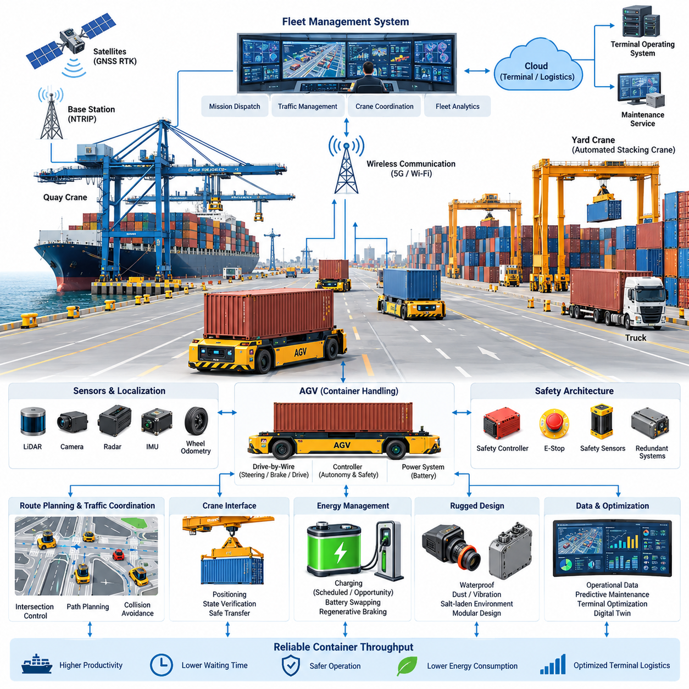
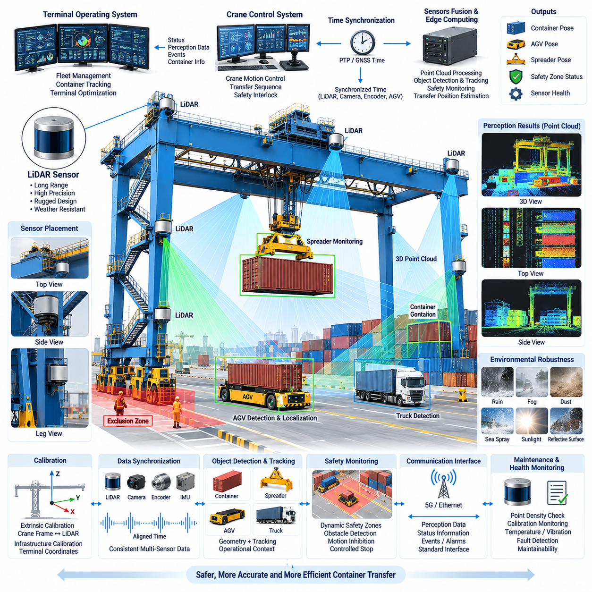
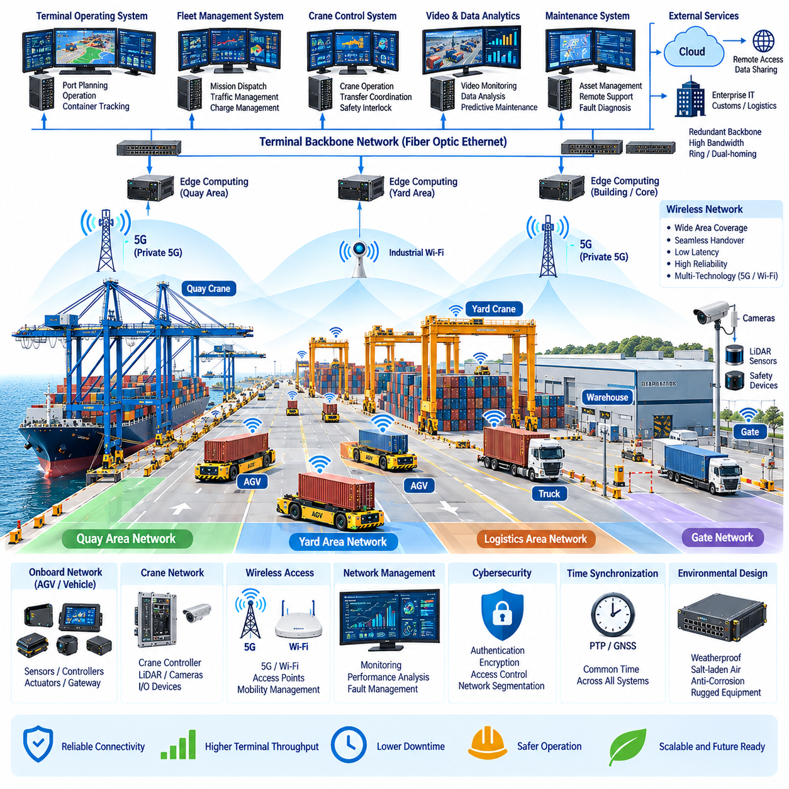
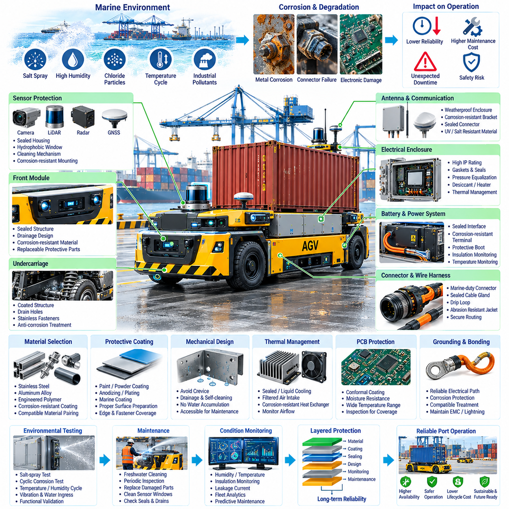
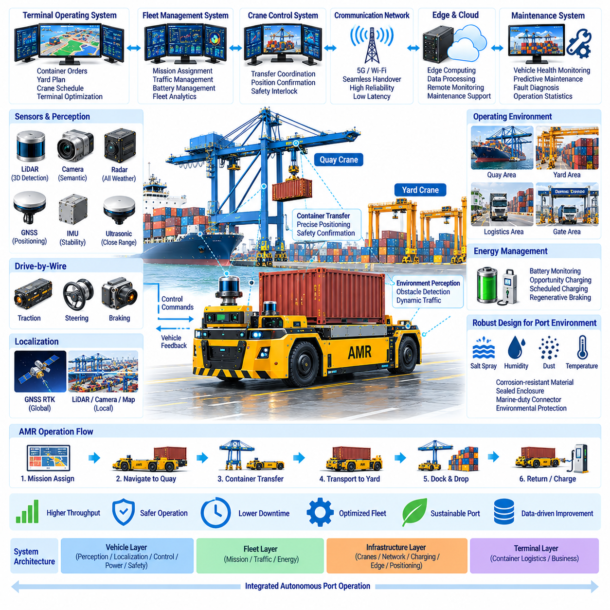

**Volume 17 Outdoor Autonomous Vehicle**


# Chapter 09. Port AMR

##  

## 09.01. AGV Container Handling

{width="7.268055555555556in" height="7.268055555555556in"}

Port container handling with automated guided vehicles requires a system architecture that combines heavy-load mobility, precise positioning, reliable communication, and deterministic safety control. Unlike conventional indoor AGVs, container-handling vehicles operate across large outdoor terminals where road geometry, container stacks, cranes, trucks, workers, and other autonomous machines continuously interact. The AGV must therefore be engineered as part of a coordinated terminal transportation system rather than as an isolated mobile robot.

A container AGV typically transports standardized containers between quay cranes, transfer zones, container yards, and automated stacking cranes. The mechanical platform must support high payloads while maintaining predictable steering and braking characteristics under changing load conditions. Vehicle dynamics vary significantly between unloaded and fully loaded operation, so propulsion, steering, suspension, braking, and tire characteristics must be modeled across the complete operating envelope rather than optimized for only one nominal condition.

Container pickup and transfer require much greater positioning precision than ordinary point-to-point transportation. The vehicle must align its load interface with crane or transfer equipment while maintaining safe clearance from surrounding infrastructure. GNSS RTK can provide accurate global positioning in open terminal areas, while LiDAR, cameras, radar, wheel odometry, and IMU measurements provide complementary relative localization. Sensor fusion becomes particularly important near cranes and container stacks where satellite visibility may deteriorate because of multipath and obstruction.

The localization architecture should distinguish between global navigation accuracy and final docking accuracy. Global GNSS-based localization guides the AGV through terminal roads, but the final approach to a crane or transfer station can use infrastructure landmarks, LiDAR geometry, visual markers, or local reference targets. This hierarchical localization strategy prevents temporary GNSS degradation from directly affecting container alignment and allows the vehicle to transition smoothly from meter-scale route planning to centimeter-class terminal positioning.

Route planning in a container terminal is fundamentally a traffic coordination problem. Multiple AGVs may share intersections, crane approaches, transfer lanes, charging stations, and waiting zones, creating dependencies that cannot be resolved by independent shortest-path planning. A central fleet management system can allocate missions, reserve road segments, sequence intersection access, and coordinate vehicle arrival with crane schedules. Local autonomy remains responsible for immediate obstacle avoidance and emergency response when unexpected conditions invalidate the centrally planned trajectory.

Mission dispatch should consider more than transportation distance. Quay crane productivity, yard crane availability, container priority, vehicle battery state, congestion, maintenance status, and predicted travel time can all influence AGV assignment. A sophisticated scheduler therefore treats the fleet as a distributed logistics resource. The objective is not simply to maximize individual vehicle utilization but to minimize crane waiting, container transfer delay, empty travel, traffic conflicts, and energy consumption across the complete terminal operation.

Container terminals create demanding perception conditions because large metallic structures generate occlusion, reflection, and rapidly changing visibility. Containers can form temporary corridors that differ from previously mapped environments, while trucks and handling equipment introduce dynamic obstacles with large blind areas. LiDAR provides accurate geometric measurements, cameras contribute semantic information, and radar can improve robustness in rain, fog, dust, or difficult illumination. Redundant perception should be designed so that degradation of one sensing modality does not immediately eliminate safe mobility.

Safety architecture must separate normal autonomous control from independent protective functions. The primary autonomy system performs perception, localization, prediction, planning, and motion control, while safety controllers supervise critical conditions such as excessive speed, obstacle proximity, steering faults, brake faults, communication loss, or localization uncertainty. Emergency-stop circuits and safety-rated sensing can command controlled deceleration or direct stopping independently of high-level AI. The resulting architecture limits the consequences of software, sensor, network, or compute failures.

Drive-by-wire functionality is essential because propulsion, steering, and braking must accept electronically generated commands while reporting their actual state to supervisory controllers. Command and feedback channels should support plausibility checks so that requested steering angle, wheel speed, braking force, and measured vehicle response can be continuously compared. Fault detection must distinguish transient disturbances from conditions requiring degraded operation, mission cancellation, or a minimal-risk stop, especially when the AGV is carrying a heavy container.

Communication connects the AGV to fleet control, terminal operating systems, crane controllers, charging infrastructure, and maintenance services. Wireless connectivity must tolerate handovers and temporary packet loss as vehicles move through large yards surrounded by steel structures. Safety-critical local motion should therefore never depend entirely on uninterrupted cloud or central communication. The AGV must retain sufficient onboard intelligence to stop safely, preserve localization state, and recover or request assistance when external communication becomes unavailable.

Crane coordination represents one of the defining interfaces of port AGV operation. The vehicle must approach the designated transfer position, confirm identity and mission state, achieve acceptable alignment, establish a safe stationary condition, and exchange readiness information before container transfer begins. Crane and AGV states should be mutually verified so that lifting or lowering cannot proceed under ambiguous conditions. This interface transforms two independently controlled machines into a temporarily synchronized material-handling system.

Energy architecture must account for high vehicle mass, frequent acceleration and braking, auxiliary compute loads, environmental conditioning, and long operating hours. Battery sizing should be based on realistic terminal duty cycles rather than simple constant-speed range calculations. Opportunity charging, scheduled charging, battery swapping, or combinations of these approaches can be coordinated by fleet software. Regenerative braking can recover part of the kinetic energy during repeated deceleration, although braking safety must remain independent of regenerative capability.

Outdoor port operation also places significant demands on electrical and environmental robustness. Connectors, enclosures, harnesses, antennas, sensors, and exposed metallic components must withstand vibration, moisture, temperature variation, dust, and corrosive salt-laden air. Electrical architecture should isolate noisy propulsion equipment from perception and computing systems through appropriate grounding, shielding, filtering, and power distribution. Serviceable modular design is valuable because terminal equipment must often return to operation quickly after maintenance.

Operational data collected from AGVs can support continuous optimization of the terminal. Vehicle trajectories, localization confidence, obstacle events, energy consumption, component temperatures, braking behavior, mission delays, communication quality, and fault codes can be aggregated into fleet analytics. Historical data enables congestion analysis and predictive maintenance, while real-time telemetry supports dispatch decisions. Digital representations of terminal traffic can also be used to evaluate scheduling strategies before applying them to operating vehicles.

A mature container-handling architecture therefore forms a layered cyber-physical system extending from vehicle actuators to terminal-level logistics. The onboard layer provides sensing, localization, motion control, and immediate safety; the fleet layer coordinates missions and traffic; the infrastructure layer connects cranes, transfer stations, charging facilities, and communication networks; and the terminal management layer optimizes container flow. These layers must exchange clearly defined states while preserving local safety authority.

The ultimate performance metric is not autonomous driving alone but reliable container throughput. A technically advanced AGV that frequently waits for cranes, creates traffic conflicts, requires manual recovery, or consumes excessive charging time can reduce overall terminal productivity. Successful engineering consequently requires simultaneous optimization of vehicle autonomy, electrical architecture, safety, fleet scheduling, crane interfaces, communications, energy management, and maintainability. Container AGVs become most valuable when their autonomy is designed as an integrated component of the entire automated port ecosystem.

항만 컨테이너 처리를 위한 무인운반차(Automated Guided Vehicle, AGV)는 고하중 이동성(Heavy-load Mobility), 정밀 위치결정(Precise Positioning), 신뢰성 높은 통신(Reliable Communication), 결정론적 안전 제어(Deterministic Safety Control)를 결합한 시스템 아키텍처(System Architecture)를 필요로 한다. 일반적인 실내 무인운반차(AGV)와 달리 컨테이너 처리 차량은 도로 구조, 컨테이너 적재 구역, 크레인, 트럭, 작업자, 다른 자율주행 장비가 지속적으로 상호작용하는 대규모 야외 터미널에서 운행한다. 따라서 무인운반차(AGV)는 독립적인 이동 로봇이 아니라 통합된 터미널 운송 시스템(Terminal Transportation System)의 일부로 설계되어야 한다.

컨테이너 무인운반차(Container AGV)는 일반적으로 안벽 크레인(Quay Crane), 환적 구역(Transfer Zone), 컨테이너 야드(Container Yard), 자동 적재 크레인(Automated Stacking Crane) 사이에서 표준화된 컨테이너를 운송한다. 기계 플랫폼(Mechanical Platform)은 높은 적재하중(Payload)을 지지하면서 하중 변화에도 예측 가능한 조향 및 제동 특성을 유지해야 한다. 차량 동역학(Vehicle Dynamics)은 공차 상태와 최대 적재 상태에서 크게 달라지므로 구동, 조향, 현가, 제동 및 타이어 특성은 하나의 정격 조건이 아니라 전체 운행 영역(Operating Envelope)을 기준으로 모델링해야 한다.

컨테이너의 인수 및 이송에는 일반적인 지점 간 운송(Point-to-Point Transportation)보다 훨씬 높은 위치결정 정밀도(Positioning Accuracy)가 필요하다. 차량은 주변 인프라와 안전거리를 유지하면서 적재 인터페이스(Load Interface)를 크레인이나 이송 장비와 정확하게 정렬해야 한다. 개방된 터미널에서는 위성항법 정밀측위(GNSS RTK)가 정확한 전역 위치(Global Position)를 제공하며, 라이다(LiDAR), 카메라(Camera), 레이더(Radar), 휠 오도메트리(Wheel Odometry), 관성측정장치(IMU)는 상호보완적인 상대 위치정보(Relative Localization)를 제공한다. 특히 크레인이나 컨테이너 적재물로 인해 다중경로(Multipath)와 신호 차단이 발생하는 구역에서는 센서 융합(Sensor Fusion)이 중요하다.

위치추정 아키텍처(Localization Architecture)는 전역 주행 정확도(Global Navigation Accuracy)와 최종 도킹 정확도(Final Docking Accuracy)를 구분해야 한다. 전역 위성항법 기반 위치추정(GNSS-based Localization)은 터미널 도로에서 무인운반차(AGV)를 유도하지만, 크레인이나 이송 스테이션으로 최종 접근할 때에는 인프라 랜드마크(Infrastructure Landmark), 라이다 형상(LiDAR Geometry), 시각 마커(Visual Marker), 지역 기준 표적(Local Reference Target)을 사용할 수 있다. 이러한 계층형 위치추정(Hierarchical Localization)은 일시적인 위성항법 성능 저하가 컨테이너 정렬에 직접 영향을 주는 것을 방지하고, 차량이 미터급 경로 계획에서 센티미터급 정밀 위치결정으로 자연스럽게 전환할 수 있도록 한다.

컨테이너 터미널의 경로 계획(Route Planning)은 본질적으로 교통 조정 문제(Traffic Coordination Problem)이다. 여러 무인운반차(AGV)가 교차로, 크레인 접근로, 이송 차선, 충전소, 대기 구역을 공유하기 때문에 각각의 차량이 독립적으로 최단 경로만 계산해서는 해결할 수 없는 상호 의존성이 발생한다. 중앙 차량군 관리 시스템(Central Fleet Management System)은 임무를 할당하고, 도로 구간을 예약하며, 교차로 진입 순서를 결정하고, 차량 도착 시간을 크레인 일정과 조정할 수 있다. 동시에 로컬 자율주행(Local Autonomy)은 예상하지 못한 상황으로 중앙 계획 경로가 유효하지 않게 되었을 때 즉각적인 장애물 회피와 비상 대응을 담당한다.

임무 배차(Mission Dispatch)는 단순한 운송 거리 이상의 요소를 고려해야 한다. 안벽 크레인 생산성(Quay Crane Productivity), 야드 크레인 가용성(Yard Crane Availability), 컨테이너 우선순위(Container Priority), 차량 배터리 상태(Battery State), 교통 혼잡(Congestion), 정비 상태(Maintenance Status), 예상 이동시간(Predicted Travel Time)이 모두 무인운반차 할당에 영향을 줄 수 있다. 따라서 고도화된 스케줄러(Scheduler)는 차량군 전체를 분산형 물류 자원(Distributed Logistics Resource)으로 취급하며, 개별 차량의 가동률뿐만 아니라 크레인 대기, 컨테이너 이송 지연, 공차 이동, 교통 충돌 및 전체 에너지 소비를 최소화해야 한다.

컨테이너 터미널은 대형 금속 구조물로 인해 가림(Occlusion), 반사(Reflection), 급격한 가시성 변화가 발생하는 까다로운 인지 환경(Perception Environment)을 형성한다. 컨테이너는 기존 지도와 다른 임시 통로를 만들 수 있으며, 트럭과 하역 장비는 넓은 사각지대를 가진 동적 장애물(Dynamic Obstacle)을 형성한다. 라이다(LiDAR)는 정확한 기하학적 정보를 제공하고, 카메라(Camera)는 의미론적 정보(Semantic Information)를 제공하며, 레이더(Radar)는 비, 안개, 먼지 또는 불리한 조명 환경에서 강인성을 높일 수 있다. 하나의 센싱 방식이 성능 저하를 일으켜도 즉시 안전 운행 능력을 상실하지 않도록 중복 인지(Redundant Perception)를 설계해야 한다.

안전 아키텍처(Safety Architecture)는 정상 자율주행 제어(Normal Autonomous Control)와 독립적인 보호 기능(Independent Protective Function)을 분리해야 한다. 주 자율주행 시스템은 인지, 위치추정, 예측, 계획 및 모션 제어(Motion Control)를 수행하고, 안전 제어기(Safety Controller)는 과속, 장애물 근접, 조향 고장, 제동 고장, 통신 손실, 위치추정 불확실성과 같은 핵심 상태를 감시한다. 비상정지 회로(Emergency-stop Circuit)와 안전등급 센싱(Safety-rated Sensing)은 상위 인공지능(AI)과 독립적으로 제어 감속이나 직접 정지를 명령할 수 있어야 한다. 이러한 구조는 소프트웨어, 센서, 네트워크 또는 연산 장치 고장의 영향을 제한한다.

전자식 차량제어(Drive-by-Wire, DBW)는 구동, 조향 및 제동 시스템이 전자적으로 생성된 명령을 수신하면서 실제 상태를 상위 제어기에 피드백해야 하기 때문에 필수적이다. 명령 및 피드백 채널(Command and Feedback Channel)은 요구 조향각, 휠 속도, 제동력과 실제 차량 응답을 지속적으로 비교할 수 있도록 타당성 검사(Plausibility Check)를 지원해야 한다. 특히 무거운 컨테이너를 운송할 때 고장 진단(Fault Detection)은 일시적 이상과 성능저하 운행(Degraded Operation), 임무 취소(Mission Cancellation), 최소위험정지(Minimal-risk Stop)가 필요한 상황을 구분할 수 있어야 한다.

통신(Communication)은 무인운반차(AGV)를 차량군 제어(Fleet Control), 터미널 운영 시스템(Terminal Operating System), 크레인 제어기(Crane Controller), 충전 인프라(Charging Infrastructure), 유지보수 서비스(Maintenance Service)와 연결한다. 무선 연결은 차량이 철제 구조물로 둘러싸인 대규모 야드를 이동할 때 핸드오버(Handover)와 일시적인 패킷 손실(Packet Loss)을 견딜 수 있어야 한다. 따라서 안전이 중요한 로컬 주행(Local Motion)은 클라우드 또는 중앙 통신의 지속적인 연결에 전적으로 의존해서는 안 된다. 외부 통신이 중단되더라도 차량은 안전하게 정지하고 위치 상태를 유지하며 복구하거나 지원을 요청할 수 있는 충분한 온보드 지능(Onboard Intelligence)을 유지해야 한다.

크레인 협조(Crane Coordination)는 항만 무인운반차 운용을 정의하는 핵심 인터페이스 중 하나이다. 차량은 지정된 이송 위치로 접근하고, 차량 식별정보와 임무 상태를 확인하며, 허용 가능한 정렬 정밀도를 확보한 뒤 안전한 정지 상태를 형성하고 컨테이너 이송 전에 준비 상태 정보를 교환해야 한다. 크레인과 무인운반차(AGV)의 상태는 상호 검증(Mutual Verification)되어야 하며, 불확실한 상태에서는 컨테이너의 인양이나 하강이 진행되지 않아야 한다. 이러한 인터페이스는 독립적으로 제어되는 두 장비를 일시적으로 동기화된 물류 처리 시스템(Synchronized Material-handling System)으로 전환한다.

에너지 아키텍처(Energy Architecture)는 높은 차량 질량, 빈번한 가속 및 감속, 보조 연산장치 부하, 환경 제어 장치, 장시간 운행을 고려해야 한다. 배터리 용량(Battery Sizing)은 단순한 정속 주행거리 계산이 아니라 실제 터미널 운행 사이클(Terminal Duty Cycle)을 기반으로 결정해야 한다. 기회 충전(Opportunity Charging), 계획 충전(Scheduled Charging), 배터리 교환(Battery Swapping) 또는 이들의 조합을 차량군 소프트웨어(Fleet Software)가 조정할 수 있다. 회생제동(Regenerative Braking)은 반복되는 감속 과정에서 운동에너지 일부를 회수할 수 있지만, 제동 안전성은 회생제동 기능과 독립적으로 보장되어야 한다.

야외 항만 운용은 전기적 및 환경적 강건성(Electrical and Environmental Robustness)에도 높은 요구사항을 부과한다. 커넥터(Connector), 인클로저(Enclosure), 와이어 하니스(Wire Harness), 안테나(Antenna), 센서(Sensor), 외부 노출 금속 부품은 진동, 습기, 온도 변화, 먼지 및 염분을 포함한 부식성 공기(Salt-laden Air)를 견뎌야 한다. 전기 아키텍처(Electrical Architecture)는 적절한 접지(Grounding), 차폐(Shielding), 필터링(Filtering), 전력 분배(Power Distribution)를 통해 노이즈가 큰 구동 장비를 인지 및 컴퓨팅 시스템과 격리해야 한다. 터미널 장비는 정비 후 빠르게 운용에 복귀해야 하므로 정비 가능한 모듈형 설계(Serviceable Modular Design)가 중요하다.

무인운반차에서 수집되는 운용 데이터(Operational Data)는 터미널의 지속적인 최적화에 활용할 수 있다. 차량 궤적, 위치추정 신뢰도, 장애물 이벤트, 에너지 소비, 부품 온도, 제동 거동, 임무 지연, 통신 품질, 고장 코드 등을 차량군 데이터 분석(Fleet Analytics)에 통합할 수 있다. 과거 데이터는 혼잡 분석과 예지정비(Predictive Maintenance)에 활용되며, 실시간 원격측정(Real-time Telemetry)은 배차 의사결정을 지원한다. 또한 터미널 교통의 디지털 표현(Digital Representation)을 이용하면 실제 차량군에 적용하기 전에 다양한 스케줄링 전략을 평가할 수 있다.

성숙한 컨테이너 처리 아키텍처(Container-handling Architecture)는 차량 액추에이터(Actuator)부터 터미널 수준의 물류까지 확장되는 계층형 사이버 물리 시스템(Cyber-physical System)을 형성한다. 온보드 계층(Onboard Layer)은 센싱, 위치추정, 모션 제어 및 즉각적인 안전을 담당하고, 차량군 계층(Fleet Layer)은 임무와 교통을 조정한다. 인프라 계층(Infrastructure Layer)은 크레인, 이송 스테이션, 충전 설비 및 통신망을 연결하며, 터미널 관리 계층(Terminal Management Layer)은 전체 컨테이너 흐름을 최적화한다. 각 계층은 로컬 안전 권한(Local Safety Authority)을 유지하면서 명확하게 정의된 상태정보를 교환해야 한다.

궁극적인 성능 지표(Performance Metric)는 자율주행 자체가 아니라 신뢰할 수 있는 컨테이너 처리량(Container Throughput)이다. 기술적으로 뛰어난 무인운반차(AGV)라도 크레인을 자주 기다리거나, 교통 충돌을 유발하거나, 수동 복구가 빈번하거나, 과도한 충전시간을 필요로 한다면 전체 터미널 생산성을 저하시킬 수 있다. 따라서 성공적인 시스템 엔지니어링(System Engineering)은 차량 자율주행, 전기 아키텍처, 안전, 차량군 스케줄링, 크레인 인터페이스, 통신, 에너지 관리 및 유지보수성을 동시에 최적화해야 한다. 컨테이너 무인운반차(Container AGV)는 자율성이 전체 자동화 항만 생태계(Automated Port Ecosystem)의 통합 구성요소로 설계될 때 가장 높은 가치를 제공한다.

##  

## 09.02. Crane LiDAR Integration

{width="7.268055555555556in" height="7.268055555555556in"}

Crane LiDAR integration provides precise three-dimensional perception around quay cranes, automated stacking cranes, rail-mounted gantry cranes, and container transfer zones. Unlike LiDAR mounted on a mobile vehicle, crane-mounted sensors observe operations from elevated or structurally fixed positions and can continuously measure containers, spreaders, AGVs, trucks, crane structures, and surrounding obstacles. The integration therefore functions as both an infrastructure perception system and an important interface between crane automation and autonomous port vehicles.

The primary objective of crane-mounted LiDAR is to create reliable geometric awareness within areas where container transfer requires high positioning accuracy. A LiDAR sensor emits laser pulses and measures their return time to construct point clouds representing nearby surfaces. When installed at suitable locations on the crane structure, these point clouds can describe container edges, vehicle roofs, lane boundaries, spreader positions, obstacles, and structural elements, providing spatial information that complements cameras and other sensing technologies.

Sensor placement strongly affects the quality of crane perception. A sensor mounted too high may provide broad coverage but lose useful detail near the ground, while a low-mounted sensor can suffer severe occlusion from containers and vehicles. Multiple LiDAR units can therefore be distributed across crane legs, trolley structures, crossbeams, or transfer areas to obtain overlapping fields of view. The installation geometry should minimize blind zones while avoiding direct interference from moving crane mechanisms and container handling equipment.

Accurate calibration is essential because raw LiDAR measurements are expressed in each sensor\'s local coordinate frame. Extrinsic calibration determines the translation and rotation between the LiDAR and the crane reference frame, while infrastructure calibration relates that reference frame to terminal coordinates. Once these transformations are established, observations from multiple sensors can be combined into a consistent spatial representation and compared directly with AGV positions, crane trajectories, container locations, and predefined transfer points.

Time synchronization becomes particularly important when crane components, spreaders, containers, and vehicles are moving simultaneously. Measurements captured at different times can create apparent geometric displacement even when the individual sensors are correctly calibrated. Hardware timestamps, synchronized clocks, or network-based synchronization can align LiDAR data with crane encoder values, AGV telemetry, cameras, and control messages. Accurate temporal alignment allows the system to reconstruct the operational scene at a common reference time.

Container detection can exploit the strong geometric structure of standardized cargo units. Planar surfaces, rectangular boundaries, corners, and known dimensional relationships can be extracted from LiDAR point clouds to estimate container position and orientation. Rather than depending only on object classification, the system can combine geometric fitting with tracking and operational context. This approach is useful during loading and unloading because partial container visibility may occur while the spreader, crane structure, or neighboring stacks block portions of the LiDAR field of view.

Spreader monitoring is another important application of crane LiDAR. During container pickup or placement, the spreader must approach the target with controlled horizontal and vertical alignment. LiDAR observations can estimate relative displacement between the spreader, container, vehicle, and surrounding structures. These measurements can supplement crane encoders and other positioning sensors, enabling independent verification of approach geometry and supporting detection of abnormal swing, misalignment, unexpected obstacles, or incorrect container positioning before transfer continues.

AGV integration requires the crane perception system to understand both vehicle location and the designated container transfer position. As an AGV approaches the crane, infrastructure LiDAR can detect its body geometry and estimate its position relative to the transfer zone. This independent measurement can be compared with the AGV\'s own GNSS RTK, LiDAR, IMU, or odometry estimate. Agreement between vehicle and infrastructure localization increases confidence that the AGV has reached the correct position before container loading or unloading begins.

The final docking stage can use crane LiDAR as a local high-precision reference independent of satellite navigation. Large cranes, stacked containers, and metallic structures may degrade GNSS reception through obstruction and multipath effects. Infrastructure LiDAR observes the AGV directly within the crane coordinate frame and can therefore provide relative position and heading measurements during the final approach. This enables hierarchical localization in which GNSS supports terminal navigation while crane perception supports centimeter-class alignment near the transfer point.

Crane LiDAR can also establish dynamic safety zones around active handling operations. Point-cloud processing can identify vehicles, workers, equipment, or unexpected objects entering restricted regions beneath or around the crane. Safety logic can compare detected objects with configured exclusion zones and current crane operating states. When an unsafe condition is detected, the system can issue warnings, inhibit specific crane motions, delay container transfer, or request a controlled stop according to the safety architecture and operational authority assigned to the perception system.

Occlusion management is critical because port environments contain large objects that frequently block one another. A single LiDAR may lose sight of an AGV when a container passes through its field of view or when adjacent equipment occupies the same line of sight. Overlapping sensors positioned at different heights and viewing angles can reduce this vulnerability. Multi-LiDAR fusion should preserve sensor identity and confidence so that temporary loss of one viewpoint does not incorrectly appear as disappearance of the tracked object.

Environmental conditions also influence LiDAR performance. Rain, fog, airborne dust, sea spray, reflective surfaces, and direct sunlight can introduce noise or reduce effective detection range. Sensor housings require suitable environmental protection, while optical windows may need contamination monitoring or cleaning mechanisms. Software should reject isolated returns, detect degraded point-cloud quality, and adjust confidence when environmental conditions reduce perception reliability rather than treating all measurements as equally trustworthy.

Data processing can be divided between edge computing near the crane and higher-level terminal infrastructure. Time-critical functions such as point-cloud filtering, object detection, tracking, safety-zone monitoring, and transfer-position estimation are well suited to local edge processors. Processed object states and health information can then be transmitted to crane controllers, fleet management systems, or terminal operating systems. This reduces network bandwidth while ensuring that immediate crane decisions do not depend entirely on remote cloud connectivity.

Communication interfaces must provide clear ownership of commands and state information. The LiDAR subsystem may publish detected objects, AGV pose, container pose, spreader alignment, safety-zone status, confidence values, and sensor health, while the crane controller provides motion state and transfer sequence information. The fleet system can provide AGV identity and mission context. Explicit interface definitions prevent perception information from being interpreted differently by the crane, AGV, and terminal control layers.

Sensor health monitoring should operate continuously because contamination, vibration, cable faults, network interruption, calibration drift, or hardware failure can gradually degrade perception. Diagnostic functions can monitor point density, expected static landmarks, temperature, communication latency, timestamp consistency, and calibration residuals. When confidence falls below an acceptable threshold, the system should identify the degraded sensor and transition to an appropriate operating mode rather than continuing automated container transfer with unverified perception.

Mechanical integration must account for the severe environment experienced by crane-mounted electronics. LiDAR brackets require sufficient stiffness to preserve calibration despite vibration, shock, wind, and repeated crane motion. Connectors and harnesses need protection against moisture, salt-laden air, abrasion, and electromagnetic interference. Installation locations should also permit inspection, cleaning, calibration, and replacement without excessive crane downtime, making maintainability an important part of the perception architecture rather than an afterthought.

A mature crane LiDAR architecture ultimately creates a shared perception layer between infrastructure and autonomous vehicles. The crane observes the transfer zone from a stable external viewpoint, while the AGV observes the same environment from its onboard sensors. Combining these perspectives provides redundancy and reduces dependence on any single localization source. Through calibrated coordinates, synchronized measurements, reliable communication, health monitoring, and safety supervision, crane LiDAR integration enables more accurate container alignment, safer transfers, reduced waiting time, and higher overall terminal automation performance.

크레인 라이다 통합(Crane LiDAR Integration)은 안벽 크레인(Quay Crane), 자동 적재 크레인(Automated Stacking Crane), 레일 장착형 갠트리 크레인(Rail-mounted Gantry Crane), 컨테이너 이송 구역(Container Transfer Zone) 주변에 정밀한 3차원 인지(Three-dimensional Perception)를 제공한다. 이동 차량에 장착되는 라이다와 달리 크레인 장착 센서는 높은 위치 또는 구조적으로 고정된 위치에서 작업 영역을 관측하며 컨테이너, 스프레더(Spreader), 무인운반차(AGV), 트럭, 크레인 구조물 및 주변 장애물을 지속적으로 측정할 수 있다. 따라서 이러한 통합은 인프라 인지 시스템(Infrastructure Perception System)이면서 크레인 자동화와 자율주행 항만 차량을 연결하는 핵심 인터페이스로 기능한다.

크레인 장착 라이다(Crane-mounted LiDAR)의 주요 목적은 높은 위치 정밀도가 요구되는 컨테이너 이송 구역에서 신뢰할 수 있는 기하학적 상황 인식(Geometric Awareness)을 구축하는 것이다. 라이다 센서는 레이저 펄스를 방출하고 반사되어 돌아오는 시간을 측정하여 주변 표면을 표현하는 포인트 클라우드(Point Cloud)를 생성한다. 크레인 구조물의 적절한 위치에 설치하면 컨테이너 모서리, 차량 상부, 차선 경계, 스프레더 위치, 장애물 및 구조물을 표현할 수 있어 카메라 등의 다른 센싱 기술을 보완하는 공간 정보를 제공한다.

센서 배치(Sensor Placement)는 크레인 인지 품질에 큰 영향을 미친다. 센서를 지나치게 높은 위치에 설치하면 넓은 영역을 관측할 수 있지만 지면 부근의 유용한 세부정보가 감소할 수 있으며, 낮은 위치에 설치하면 컨테이너와 차량으로 인해 심각한 가림(Occlusion)이 발생할 수 있다. 따라서 여러 라이다를 크레인 다리, 트롤리 구조물, 크로스빔(Crossbeam) 또는 이송 구역에 분산 배치하여 중첩 시야(Overlapping Field of View)를 확보할 수 있다. 설치 형상은 이동하는 크레인 기구와 컨테이너 취급 장비의 직접적인 간섭을 피하면서 사각지대를 최소화하도록 설계해야 한다.

원시 라이다 측정값은 각 센서의 로컬 좌표계(Local Coordinate Frame)를 기준으로 표현되기 때문에 정확한 캘리브레이션(Calibration)이 필수적이다. 외부 캘리브레이션(Extrinsic Calibration)은 라이다와 크레인 기준 좌표계(Crane Reference Frame) 사이의 병진 및 회전 관계를 결정하고, 인프라 캘리브레이션(Infrastructure Calibration)은 해당 기준 좌표계를 터미널 좌표계(Terminal Coordinates)와 연결한다. 이러한 변환 관계가 확립되면 여러 센서의 관측값을 일관된 공간 표현으로 결합하고 무인운반차 위치, 크레인 궤적, 컨테이너 위치 및 사전 정의된 이송 지점과 직접 비교할 수 있다.

시간 동기화(Time Synchronization)는 크레인 구성요소, 스프레더, 컨테이너 및 차량이 동시에 움직이는 상황에서 특히 중요하다. 서로 다른 시간에 획득한 측정값은 개별 센서가 정확하게 캘리브레이션되어 있더라도 겉보기 기하학적 변위(Apparent Geometric Displacement)를 발생시킬 수 있다. 하드웨어 타임스탬프(Hardware Timestamp), 동기화된 클록(Synchronized Clock), 네트워크 기반 동기화(Network-based Synchronization)를 이용하여 라이다 데이터와 크레인 엔코더 값, 무인운반차 원격측정 정보, 카메라 및 제어 메시지를 정렬할 수 있다. 정확한 시간 정렬은 시스템이 동일한 기준 시점에서 운용 장면을 재구성할 수 있도록 한다.

컨테이너 검출(Container Detection)은 표준화된 화물 컨테이너가 가지는 명확한 기하학적 구조를 활용할 수 있다. 평면 표면, 직사각형 경계, 모서리 및 알려진 치수 관계를 라이다 포인트 클라우드에서 추출하여 컨테이너의 위치와 방향을 추정할 수 있다. 시스템은 객체 분류(Object Classification)에만 의존하지 않고 기하학적 피팅(Geometric Fitting), 추적(Tracking), 운용 상황정보(Operational Context)를 결합할 수 있다. 이러한 접근은 스프레더, 크레인 구조물 또는 인접 컨테이너 스택으로 인해 컨테이너 일부만 관측되는 상하역 과정에서 특히 유용하다.

스프레더 모니터링(Spreader Monitoring)은 크레인 라이다의 또 다른 중요한 응용 분야이다. 컨테이너를 들어 올리거나 내려놓는 과정에서 스프레더는 목표물에 대해 제어된 수평 및 수직 정렬 상태로 접근해야 한다. 라이다 관측을 이용하여 스프레더, 컨테이너, 차량 및 주변 구조물 사이의 상대 변위(Relative Displacement)를 추정할 수 있다. 이러한 측정은 크레인 엔코더와 다른 위치 센서를 보완하며, 접근 형상의 독립적인 검증과 비정상적인 흔들림(Swing), 오정렬(Misalignment), 예상하지 못한 장애물 또는 잘못된 컨테이너 위치를 이송 작업이 계속되기 전에 검출하도록 지원한다.

무인운반차 통합(AGV Integration)을 위해서는 크레인 인지 시스템이 차량의 위치와 지정된 컨테이너 이송 위치를 모두 이해해야 한다. 무인운반차가 크레인에 접근하면 인프라 라이다(Infrastructure LiDAR)는 차량의 차체 형상을 검출하고 이송 구역을 기준으로 차량 위치를 추정할 수 있다. 이 독립적인 측정값은 무인운반차 자체의 위성항법 정밀측위(GNSS RTK), 라이다, 관성측정장치(IMU) 또는 오도메트리(Odometry) 기반 위치추정 결과와 비교할 수 있다. 차량과 인프라 위치추정 결과가 일치하면 컨테이너 상하역을 시작하기 전에 무인운반차가 정확한 위치에 도달했다는 신뢰도를 높일 수 있다.

최종 도킹 단계(Final Docking Stage)에서는 크레인 라이다를 위성항법과 독립적인 로컬 고정밀 기준(Local High-precision Reference)으로 활용할 수 있다. 대형 크레인, 적재된 컨테이너 및 금속 구조물은 신호 차단과 다중경로(Multipath) 현상을 통해 위성항법 수신 성능을 저하시킬 수 있다. 인프라 라이다는 크레인 좌표계에서 무인운반차를 직접 관측하므로 최종 접근 과정에서 상대 위치와 방향을 제공할 수 있다. 이를 통해 위성항법은 터미널 주행을 지원하고 크레인 인지는 이송 지점 부근에서 센티미터급 정렬을 지원하는 계층형 위치추정(Hierarchical Localization)을 구현할 수 있다.

크레인 라이다는 활성화된 하역 작업 영역 주변에 동적 안전 구역(Dynamic Safety Zone)을 설정하는 데에도 활용할 수 있다. 포인트 클라우드 처리를 통해 크레인 아래 또는 주변 제한구역으로 진입하는 차량, 작업자, 장비 또는 예상하지 못한 물체를 식별할 수 있다. 안전 로직(Safety Logic)은 검출된 객체를 설정된 접근금지 구역(Exclusion Zone) 및 현재 크레인 운용 상태와 비교한다. 위험한 상태가 검출되면 시스템은 경고를 발생시키고 특정 크레인 동작을 억제하거나 컨테이너 이송을 지연시키며, 인지 시스템에 부여된 안전 아키텍처와 운용 권한에 따라 제어 정지(Controlled Stop)를 요청할 수 있다.

항만 환경에는 서로를 빈번하게 가리는 대형 객체가 존재하기 때문에 가림 관리(Occlusion Management)가 중요하다. 하나의 라이다만 사용하는 경우 컨테이너가 시야를 통과하거나 인접 장비가 동일한 관측선을 차단하면 무인운반차를 일시적으로 관측하지 못할 수 있다. 서로 다른 높이와 관측 각도에 중첩 센서를 설치하면 이러한 취약성을 줄일 수 있다. 다중 라이다 융합(Multi-LiDAR Fusion)은 센서별 식별정보와 신뢰도(Confidence)를 유지하여 하나의 시점(Viewpoint)이 일시적으로 손실되더라도 추적 중인 객체가 사라진 것으로 잘못 판단하지 않도록 해야 한다.

환경 조건(Environmental Conditions) 역시 라이다 성능에 영향을 준다. 비, 안개, 공기 중 먼지, 해수 비말(Sea Spray), 반사 표면 및 직사광선은 노이즈를 발생시키거나 유효 검출거리를 감소시킬 수 있다. 센서 하우징(Sensor Housing)은 적절한 환경 보호 기능을 갖추어야 하며, 광학창(Optical Window)은 오염 상태 모니터링이나 세척 장치가 필요할 수 있다. 소프트웨어는 고립된 반사 신호를 제거하고 포인트 클라우드 품질 저하를 검출하며, 모든 측정값을 동일하게 신뢰하는 대신 환경 상태에 따라 인지 신뢰도를 조정해야 한다.

데이터 처리는 크레인 주변의 엣지 컴퓨팅(Edge Computing)과 상위 터미널 인프라로 분리할 수 있다. 포인트 클라우드 필터링, 객체 검출, 추적, 안전 구역 감시 및 이송 위치 추정과 같이 시간에 민감한 기능은 로컬 엣지 프로세서(Local Edge Processor)에 적합하다. 처리된 객체 상태와 시스템 상태정보(Health Information)는 크레인 제어기, 차량군 관리 시스템(Fleet Management System) 또는 터미널 운영 시스템(Terminal Operating System)으로 전송할 수 있다. 이를 통해 네트워크 대역폭을 줄이는 동시에 즉각적인 크레인 의사결정이 원격 클라우드 연결에 전적으로 의존하지 않도록 할 수 있다.

통신 인터페이스(Communication Interface)는 명령과 상태정보에 대한 명확한 소유권을 제공해야 한다. 라이다 서브시스템(LiDAR Subsystem)은 검출 객체, 무인운반차 자세(AGV Pose), 컨테이너 자세(Container Pose), 스프레더 정렬 상태, 안전 구역 상태, 신뢰도 값 및 센서 건전성(Sensor Health)을 제공할 수 있으며, 크레인 제어기는 동작 상태와 이송 시퀀스 정보를 제공한다. 차량군 시스템(Fleet System)은 무인운반차 식별정보와 임무 상황정보를 제공할 수 있다. 명확한 인터페이스 정의는 동일한 인지정보가 크레인, 무인운반차 및 터미널 제어 계층에서 서로 다르게 해석되는 것을 방지한다.

오염, 진동, 케이블 고장, 네트워크 단절, 캘리브레이션 드리프트(Calibration Drift), 하드웨어 고장 등은 인지 성능을 점진적으로 저하시킬 수 있기 때문에 센서 건전성 모니터링(Sensor Health Monitoring)은 지속적으로 수행되어야 한다. 진단 기능은 포인트 밀도(Point Density), 예상되는 정적 랜드마크, 온도, 통신 지연시간, 타임스탬프 일관성 및 캘리브레이션 잔차(Calibration Residual)를 감시할 수 있다. 신뢰도가 허용 가능한 임계값 이하로 떨어지면 검증되지 않은 인지정보로 자동 컨테이너 이송을 계속하는 대신 성능이 저하된 센서를 식별하고 적절한 운용 모드로 전환해야 한다.

기계적 통합(Mechanical Integration)은 크레인에 장착되는 전자장비가 경험하는 가혹한 환경을 고려해야 한다. 라이다 브래킷(LiDAR Bracket)은 진동, 충격, 바람 및 반복적인 크레인 동작에도 캘리브레이션을 유지할 수 있도록 충분한 강성을 확보해야 한다. 커넥터와 와이어 하니스(Wire Harness)는 습기, 염분을 포함한 공기, 마모 및 전자기 간섭(Electromagnetic Interference)으로부터 보호되어야 한다. 설치 위치 역시 과도한 크레인 가동중단 없이 검사, 세척, 캘리브레이션 및 교체가 가능해야 하므로 유지보수성(Maintainability)은 사후 고려사항이 아니라 인지 아키텍처의 중요한 설계 요소가 된다.

성숙한 크레인 라이다 아키텍처(Crane LiDAR Architecture)는 궁극적으로 인프라와 자율주행 차량 사이에 공유 인지 계층(Shared Perception Layer)을 구축한다. 크레인은 안정적인 외부 시점에서 이송 구역을 관측하고, 무인운반차는 자체 온보드 센서를 통해 동일한 환경을 관측한다. 이러한 서로 다른 관측 시점을 결합하면 중복성(Redundancy)이 확보되고 하나의 위치추정 소스에 대한 의존도를 낮출 수 있다. 캘리브레이션된 좌표계, 동기화된 측정값, 신뢰성 높은 통신, 건전성 모니터링 및 안전 감독을 통해 크레인 라이다 통합은 보다 정확한 컨테이너 정렬, 안전한 이송, 대기시간 감소 및 전체 터미널 자동화 성능 향상을 가능하게 한다.

##  

## 09.03. Port Communication Network

{width="7.268055555555556in" height="7.268055555555556in"}

Port communication networks provide the digital infrastructure that connects autonomous guided vehicles, cranes, terminal operating systems, fleet controllers, safety systems, maintenance platforms, and field equipment across a large container terminal. Unlike conventional factory networks, port networks must support mobile machines operating over kilometers of outdoor infrastructure while maintaining reliable connectivity around ships, cranes, container stacks, warehouses, gates, and rapidly changing metallic obstacles.

A modern port communication architecture is typically organized into several interconnected layers. Vehicle and machine networks connect onboard sensors, controllers, actuators, and gateways; wireless access networks provide mobility across operational areas; the terminal backbone transports high-volume data between zones; and edge or data-center networks connect fleet management, terminal operating systems, analytics, storage, and external services. Clear separation between these layers simplifies scalability, security, maintenance, and fault isolation.

Autonomous vehicles impose particularly demanding communication requirements because they continuously exchange mission commands, position information, vehicle status, traffic coordination messages, diagnostics, and operational events. Some applications additionally transmit camera images, LiDAR-derived information, or live video. Network design must therefore distinguish low-bandwidth but latency-sensitive control information from high-bandwidth perception and monitoring traffic, preventing large data transfers from degrading time-critical operational communication.

Wireless communication is essential because AGVs, autonomous trucks, inspection robots, and other mobile equipment cannot depend on fixed connections. Industrial Wi-Fi, private 5G, or combinations of multiple wireless technologies can provide terminal coverage depending on performance and deployment requirements. Access points or radio units should be positioned according to actual propagation conditions, considering crane structures, container stacks, buildings, ships, terrain, and vehicle routes rather than assuming unobstructed theoretical coverage.

Container stacks create one of the most difficult radio environments within a port. Large steel surfaces can block line-of-sight paths, generate multipath propagation, and create temporary radio shadows as containers are continuously moved. A network that performs well when a yard is empty may behave differently when stacks reach operational height. Radio planning should therefore evaluate representative container configurations and provide overlapping coverage so that mobile equipment can maintain connectivity when one communication path becomes degraded.

Mobility management must support seamless handover as vehicles move between wireless cells. An AGV may travel continuously from a quay crane through transfer roads to a distant container yard while maintaining an active fleet connection. Excessive handover delay, packet loss, or temporary disconnection can interrupt telemetry and coordination. The network should therefore optimize cell boundaries, roaming behavior, authentication, and redundant coverage according to actual vehicle speed and mission routes.

Private 5G can provide useful capabilities for large automated terminals through managed spectrum, mobility support, quality-of-service mechanisms, and scalable connectivity for many mobile devices. Different traffic classes can be assigned according to operational importance, allowing critical vehicle messages to receive different treatment from maintenance downloads or video streams. However, autonomous vehicle safety should not rely exclusively on continuous 5G availability; local controllers must retain authority to respond safely when communication is unavailable.

Industrial Wi-Fi remains valuable for many port applications because of its mature ecosystem, high data rates, and relatively flexible deployment. It can support maintenance areas, workshops, charging stations, warehouses, crane structures, and selected outdoor zones. When Wi-Fi is used for moving AGVs, access-point density and roaming configuration become critical. Hybrid architectures can combine Wi-Fi and cellular connectivity so that each technology is applied where its technical and economic characteristics provide the greatest advantage.

The wired backbone forms the stable foundation beneath the wireless network. Fiber-optic Ethernet is particularly suitable for long-distance connections between quay areas, yard zones, control buildings, edge computing facilities, and data centers because it provides high bandwidth and resistance to electromagnetic interference. Redundant fiber paths can prevent a single cable or network-device failure from isolating major terminal areas. Ring, dual-homing, or redundant switching architectures can be selected according to availability requirements.

Edge computing reduces dependence on distant central servers by placing computation close to cranes, vehicle zones, or operational clusters. Local edge systems can process perception data, aggregate telemetry, support traffic management, cache maps, and maintain selected services during temporary backbone disturbances. This architecture also reduces unnecessary transmission of raw sensor data. Instead of continuously forwarding complete LiDAR or camera streams, edge processors can transmit processed objects, events, health information, and operational summaries.

Communication between cranes and AGVs requires clearly defined machine states and transfer protocols. Before container loading or unloading, the AGV and crane systems may exchange vehicle identity, assigned transfer position, arrival state, alignment status, readiness, safety state, and completion confirmation. These messages should be deterministic at the application level so that both machines share an unambiguous understanding of the transfer sequence. Loss of communication must lead to a predefined safe operational response rather than an undefined intermediate state.

Fleet management communication coordinates many vehicles as a single logistics system. The fleet controller distributes missions, traffic reservations, route updates, charging assignments, and operational priorities while receiving position, battery state, fault information, and mission progress from each vehicle. Communication capacity should be designed for fleet growth because message volume increases as more autonomous machines are deployed. Network architecture must support expansion without requiring fundamental redesign of the entire terminal communication system.

Quality of service is important when multiple applications share the same infrastructure. Emergency events, safety-related status, vehicle control coordination, and crane transfer messages should receive higher communication priority than software downloads, historical data synchronization, or noncritical video. Traffic classification, prioritization, bandwidth management, and congestion control can preserve predictable behavior during peak network load. Performance should be evaluated using latency, jitter, packet loss, throughput, availability, and recovery time rather than bandwidth alone.

Time synchronization provides a common temporal reference across distributed machines and sensors. GNSS time, Precision Time Protocol, or other synchronized clock mechanisms can align LiDAR measurements, camera frames, crane encoders, AGV telemetry, event logs, and control messages. Accurate timestamps are essential when reconstructing incidents or combining data from multiple systems. Time synchronization therefore becomes part of both real-time operation and engineering traceability across the automated terminal.

Network segmentation protects critical operational systems from unnecessary traffic and cyber exposure. Vehicle control, crane automation, safety systems, terminal management, maintenance, video surveillance, guest access, and enterprise IT should not automatically share unrestricted connectivity. VLANs, routing policies, firewalls, access control, and industrial security gateways can establish controlled communication boundaries. Segmentation also limits the propagation of configuration errors, broadcast storms, compromised devices, and other network disturbances.

Cybersecurity must be incorporated into port communication architecture from the beginning because connected vehicles and cranes interact directly with physical equipment. Device authentication, encrypted communication, certificate management, secure remote access, network monitoring, software integrity, and controlled update mechanisms reduce the attack surface. Security policies must nevertheless support practical maintenance, since excessive complexity can encourage unsafe workarounds. Identity and access privileges should therefore correspond to clearly defined operational roles.

Network health monitoring should continuously measure communication quality throughout the terminal. Access-point status, signal strength, handover events, packet loss, latency, switch utilization, fiber-link condition, device temperature, and abnormal traffic can be collected into a network management platform. Correlating communication metrics with AGV routes helps identify recurring radio shadows or congestion zones. Predictive analysis can then support maintenance before network degradation begins to affect container operations.

Environmental durability is another major requirement because port communication equipment operates under rain, humidity, temperature variation, vibration, dust, strong sunlight, and salt-laden air. Outdoor antennas, enclosures, connectors, switches, and cable systems require appropriate environmental protection and corrosion resistance. Equipment placement should also consider maintainability, lightning protection, grounding, electromagnetic compatibility, and physical access so that network infrastructure remains reliable throughout long-term terminal operation.

A resilient port network should assume that individual communication links and devices will eventually fail. Redundant wireless coverage, alternative backbone routes, duplicated critical switches, local autonomy, buffered data, and graceful degradation allow operations to continue safely during partial failures. AGVs should retain sufficient onboard maps, mission context, perception, and safety logic to reach a safe condition without central connectivity. Communication redundancy therefore complements, rather than replaces, autonomous local decision-making.

The complete port communication network ultimately functions as the nervous system of an automated terminal. It connects vehicle autonomy, crane control, fleet management, safety supervision, edge computing, terminal operations, maintenance, and data analytics into a coordinated cyber-physical environment. When wireless mobility, fiber backbone, traffic prioritization, time synchronization, cybersecurity, redundancy, environmental protection, and continuous monitoring are engineered together, the network enables safer vehicle coordination, faster container transfer, higher equipment availability, and more predictable terminal throughput.

항만 통신 네트워크(Port Communication Network)는 대규모 컨테이너 터미널 전역에서 무인운반차(Automated Guided Vehicle, AGV), 크레인, 터미널 운영 시스템(Terminal Operating System), 차량군 제어기(Fleet Controller), 안전 시스템(Safety System), 유지보수 플랫폼(Maintenance Platform), 현장 장비를 연결하는 디지털 인프라(Digital Infrastructure)를 제공한다. 일반적인 공장 네트워크와 달리 항만 네트워크는 선박, 크레인, 컨테이너 적재 구역, 창고, 게이트 및 지속적으로 변화하는 금속 장애물 주변에서 운행하는 이동 장비에 대해 수 킬로미터 규모의 야외 인프라 전반에서 신뢰성 높은 연결성을 지원해야 한다.

현대적인 항만 통신 아키텍처(Port Communication Architecture)는 일반적으로 여러 개의 상호 연결된 계층으로 구성된다. 차량 및 기계 네트워크(Vehicle and Machine Network)는 온보드 센서, 제어기, 액추에이터 및 게이트웨이를 연결하고, 무선 접속 네트워크(Wireless Access Network)는 운용 구역 전반에서 이동성을 제공한다. 터미널 백본(Terminal Backbone)은 구역 사이의 대용량 데이터를 전송하며, 엣지 또는 데이터센터 네트워크(Edge or Data-center Network)는 차량군 관리, 터미널 운영 시스템, 데이터 분석, 저장장치 및 외부 서비스를 연결한다. 이러한 계층을 명확하게 분리하면 확장성, 보안, 유지보수 및 고장 격리가 용이해진다.

자율주행 차량(Autonomous Vehicle)은 임무 명령, 위치정보, 차량 상태, 교통 조정 메시지, 진단정보 및 운용 이벤트를 지속적으로 교환하기 때문에 통신에 특히 높은 요구조건을 부과한다. 일부 응용에서는 카메라 영상, 라이다 기반 정보 또는 실시간 영상(Live Video)도 전송한다. 따라서 네트워크 설계에서는 대역폭은 작지만 지연시간에 민감한 제어정보와 대역폭을 많이 사용하는 인지 및 모니터링 트래픽을 구분하여 대용량 데이터 전송이 시간에 민감한 운용 통신을 저해하지 않도록 해야 한다.

무선 통신(Wireless Communication)은 무인운반차, 자율주행 트럭, 점검 로봇 및 기타 이동 장비가 고정 연결에 의존할 수 없기 때문에 필수적이다. 산업용 와이파이(Industrial Wi-Fi), 사설 5G(Private 5G) 또는 여러 무선 기술의 조합을 성능 및 구축 요구조건에 따라 적용하여 터미널을 커버할 수 있다. 액세스 포인트(Access Point)나 무선 장치(Radio Unit)는 장애물이 없는 이론적 통신 범위를 가정하기보다 크레인 구조물, 컨테이너 스택, 건물, 선박, 지형 및 차량 운행 경로를 고려한 실제 전파 조건을 기준으로 배치해야 한다.

컨테이너 스택(Container Stack)은 항만에서 가장 어려운 무선 환경 중 하나를 형성한다. 대형 철제 표면은 가시선(Line-of-Sight)을 차단하고 다중경로 전파(Multipath Propagation)를 발생시키며, 컨테이너가 지속적으로 이동함에 따라 일시적인 무선 음영지역(Radio Shadow)을 만들 수 있다. 야드가 비어 있을 때 우수한 성능을 보이는 네트워크도 컨테이너가 실제 운용 높이까지 적재되면 다른 특성을 나타낼 수 있다. 따라서 무선망 설계는 대표적인 컨테이너 적재 구성을 평가하고 하나의 통신 경로가 저하되더라도 이동 장비가 연결을 유지할 수 있도록 중첩 통신 영역(Overlapping Coverage)을 제공해야 한다.

이동성 관리(Mobility Management)는 차량이 서로 다른 무선 셀(Wireless Cell) 사이를 이동할 때 끊김 없는 핸드오버(Seamless Handover)를 지원해야 한다. 무인운반차는 안벽 크레인에서 이송 도로를 지나 멀리 떨어진 컨테이너 야드까지 이동하면서 차량군 연결을 계속 유지할 수 있다. 과도한 핸드오버 지연, 패킷 손실 또는 일시적인 통신 단절은 원격측정과 협조 제어를 방해할 수 있다. 따라서 실제 차량 속도와 임무 경로를 기준으로 셀 경계, 로밍 동작(Roaming Behavior), 인증 및 중복 통신 범위를 최적화해야 한다.

사설 5G(Private 5G)는 관리형 주파수(Managed Spectrum), 이동성 지원, 서비스 품질(Quality of Service, QoS) 메커니즘 및 다수의 이동 장비를 위한 확장 가능한 연결성을 통해 대규모 자동화 터미널에 유용한 기능을 제공할 수 있다. 운용 중요도에 따라 서로 다른 트래픽 등급(Traffic Class)을 지정하여 핵심 차량 메시지를 유지보수 다운로드나 영상 스트림과 다르게 처리할 수 있다. 그러나 자율주행 차량의 안전은 지속적인 5G 연결에만 의존해서는 안 되며, 통신을 사용할 수 없는 상황에서도 로컬 제어기(Local Controller)가 안전하게 대응할 수 있는 제어 권한을 유지해야 한다.

산업용 와이파이(Industrial Wi-Fi)는 성숙한 생태계, 높은 데이터 전송률 및 비교적 유연한 구축 특성으로 인해 다양한 항만 응용에서 여전히 중요한 역할을 한다. 유지보수 구역, 정비소, 충전소, 창고, 크레인 구조물 및 일부 야외 구역을 지원할 수 있다. 이동하는 무인운반차에 와이파이를 적용하는 경우 액세스 포인트 밀도와 로밍 설정이 중요하다. 하이브리드 아키텍처(Hybrid Architecture)는 와이파이와 셀룰러 연결을 결합하여 각 기술의 기술적·경제적 특성이 가장 유리한 영역에 적용할 수 있다.

유선 백본(Wired Backbone)은 무선 네트워크를 지원하는 안정적인 기반을 형성한다. 광섬유 이더넷(Fiber-optic Ethernet)은 높은 대역폭과 전자기 간섭(Electromagnetic Interference)에 대한 강인성을 제공하기 때문에 안벽 구역, 야드 구역, 관제 건물, 엣지 컴퓨팅 시설 및 데이터센터 사이의 장거리 연결에 특히 적합하다. 중복 광섬유 경로(Redundant Fiber Path)를 구성하면 단일 케이블이나 네트워크 장비의 고장으로 주요 터미널 구역 전체가 고립되는 것을 방지할 수 있다. 가용성 요구조건에 따라 링(Ring), 이중 연결(Dual-homing) 또는 중복 스위칭(Redundant Switching) 아키텍처를 선택할 수 있다.

엣지 컴퓨팅(Edge Computing)은 크레인, 차량 운행 구역 또는 운용 클러스터 가까이에 연산 자원을 배치하여 원격 중앙 서버에 대한 의존성을 줄인다. 로컬 엣지 시스템(Local Edge System)은 인지 데이터를 처리하고, 원격측정 정보를 집계하며, 교통 관리를 지원하고, 지도를 캐싱하며, 일시적인 백본 장애가 발생하더라도 일부 서비스를 유지할 수 있다. 또한 불필요한 원시 센서 데이터 전송을 줄일 수 있다. 전체 라이다 또는 카메라 스트림을 지속적으로 전달하는 대신 엣지 프로세서가 처리한 객체, 이벤트, 시스템 건전성 정보 및 운용 요약정보를 전송할 수 있다.

크레인과 무인운반차 사이의 통신은 명확하게 정의된 기계 상태(Machine State)와 이송 프로토콜(Transfer Protocol)을 필요로 한다. 컨테이너를 적재하거나 하역하기 전에 무인운반차와 크레인 시스템은 차량 식별정보, 지정된 이송 위치, 도착 상태, 정렬 상태, 준비 상태, 안전 상태 및 작업 완료 확인정보를 교환할 수 있다. 이러한 메시지는 두 기계가 이송 시퀀스를 명확하고 동일하게 이해할 수 있도록 응용 계층(Application Level)에서 결정론적으로 정의되어야 한다. 통신이 손실되면 불명확한 중간 상태가 아니라 사전에 정의된 안전 운용 상태로 전환되어야 한다.

차량군 관리 통신(Fleet Management Communication)은 다수의 차량을 하나의 물류 시스템으로 조정한다. 차량군 제어기(Fleet Controller)는 임무, 교통 구간 예약, 경로 업데이트, 충전 할당 및 운용 우선순위를 배포하고 각 차량으로부터 위치, 배터리 상태, 고장정보 및 임무 진행상태를 수신한다. 자율주행 장비가 증가하면 메시지 양도 함께 증가하므로 통신 용량은 차량군 확장을 고려하여 설계해야 한다. 네트워크 아키텍처는 터미널 통신 시스템 전체를 근본적으로 재설계하지 않고도 규모를 확장할 수 있어야 한다.

서비스 품질(Quality of Service, QoS)은 여러 응용이 동일한 인프라를 공유할 때 중요하다. 비상 이벤트, 안전 관련 상태, 차량 제어 협조 및 크레인 이송 메시지는 소프트웨어 다운로드, 과거 데이터 동기화 또는 중요도가 낮은 영상보다 높은 통신 우선순위를 가져야 한다. 트래픽 분류, 우선순위 지정, 대역폭 관리 및 혼잡 제어(Congestion Control)를 통해 네트워크 부하가 최고 수준에 도달하더라도 예측 가능한 동작을 유지할 수 있다. 성능은 단순한 대역폭뿐만 아니라 지연시간, 지터(Jitter), 패킷 손실, 처리량, 가용성 및 복구시간을 이용하여 평가해야 한다.

시간 동기화(Time Synchronization)는 분산된 기계와 센서에 공통 시간 기준(Common Temporal Reference)을 제공한다. 위성항법 시간(GNSS Time), 정밀 시간 프로토콜(Precision Time Protocol, PTP) 또는 기타 동기화 클록 메커니즘을 이용하여 라이다 측정값, 카메라 프레임, 크레인 엔코더, 무인운반차 원격측정, 이벤트 로그 및 제어 메시지를 시간적으로 정렬할 수 있다. 정확한 타임스탬프는 사고를 재구성하거나 여러 시스템에서 생성된 데이터를 결합할 때 필수적이다. 따라서 시간 동기화는 실시간 운용뿐만 아니라 자동화 터미널 전반의 엔지니어링 추적성(Engineering Traceability)을 위한 핵심 요소가 된다.

네트워크 분할(Network Segmentation)은 핵심 운용 시스템을 불필요한 트래픽과 사이버 위협 노출로부터 보호한다. 차량 제어, 크레인 자동화, 안전 시스템, 터미널 관리, 유지보수, 영상 감시, 게스트 접속 및 기업 정보기술(Enterprise IT)이 제한 없이 동일한 네트워크를 공유해서는 안 된다. 가상 근거리 통신망(VLAN), 라우팅 정책, 방화벽, 접근 제어 및 산업용 보안 게이트웨이(Industrial Security Gateway)를 이용하여 통제된 통신 경계를 구축할 수 있다. 이러한 분할은 설정 오류, 브로드캐스트 폭주(Broadcast Storm), 침해된 장치 및 기타 네트워크 장애가 전체 시스템으로 확산되는 것도 제한한다.

사이버보안(Cybersecurity)은 연결된 차량과 크레인이 실제 물리 장비와 직접 상호작용하기 때문에 항만 통신 아키텍처 설계 초기부터 포함되어야 한다. 장치 인증(Device Authentication), 암호화 통신, 인증서 관리(Certificate Management), 안전한 원격 접속, 네트워크 모니터링, 소프트웨어 무결성 및 통제된 업데이트 메커니즘은 공격 표면(Attack Surface)을 줄인다. 그러나 보안 정책은 실질적인 유지보수 작업도 지원해야 하며, 지나치게 복잡한 보안 체계는 위험한 우회 방법을 유발할 수 있다. 따라서 장치 및 사용자 신원과 접근 권한은 명확하게 정의된 운용 역할에 대응하도록 설계해야 한다.

네트워크 건전성 모니터링(Network Health Monitoring)은 터미널 전체에서 통신 품질을 지속적으로 측정해야 한다. 액세스 포인트 상태, 신호 강도, 핸드오버 이벤트, 패킷 손실, 지연시간, 스위치 사용률, 광섬유 링크 상태, 장비 온도 및 비정상 트래픽을 네트워크 관리 플랫폼(Network Management Platform)에 수집할 수 있다. 통신 품질 지표를 무인운반차 운행 경로와 연계하면 반복적으로 발생하는 무선 음영지역이나 혼잡 구역을 식별할 수 있다. 이후 예측 분석(Predictive Analysis)을 통해 네트워크 성능 저하가 컨테이너 운용에 영향을 미치기 전에 유지보수를 수행할 수 있다.

항만 통신 장비는 비, 습도, 온도 변화, 진동, 먼지, 강한 직사광선 및 염분을 포함한 공기에 노출되므로 환경 내구성(Environmental Durability) 역시 주요 요구조건이다. 야외 안테나, 인클로저, 커넥터, 스위치 및 케이블 시스템에는 적절한 환경 보호와 내식성(Corrosion Resistance)이 필요하다. 장비 배치 시에는 유지보수성, 낙뢰 보호(Lightning Protection), 접지, 전자기 적합성(Electromagnetic Compatibility, EMC), 물리적 접근성도 고려하여 장기간 터미널 운용에서도 네트워크 인프라의 신뢰성을 유지해야 한다.

회복탄력성이 높은 항만 네트워크(Resilient Port Network)는 개별 통신 링크와 장비가 언젠가는 고장날 수 있다는 전제를 기반으로 설계해야 한다. 중복 무선 커버리지, 대체 백본 경로, 중요 스위치 이중화, 로컬 자율성(Local Autonomy), 데이터 버퍼링(Data Buffering), 단계적 성능저하(Graceful Degradation)를 통해 부분적인 장애 상황에서도 안전한 운용을 지속할 수 있다. 무인운반차는 중앙 연결이 없어도 안전 상태에 도달할 수 있도록 충분한 온보드 지도, 임무 상황정보, 인지 기능 및 안전 로직을 유지해야 한다. 따라서 통신 중복성(Communication Redundancy)은 자율적인 로컬 의사결정을 대체하는 것이 아니라 이를 보완한다.

완전한 항만 통신 네트워크(Port Communication Network)는 궁극적으로 자동화 터미널의 신경계(Nervous System)와 같은 역할을 수행한다. 차량 자율주행, 크레인 제어, 차량군 관리, 안전 감독, 엣지 컴퓨팅, 터미널 운영, 유지보수 및 데이터 분석을 하나의 조정된 사이버 물리 환경(Cyber-physical Environment)으로 연결한다. 무선 이동성, 광섬유 백본, 트래픽 우선순위, 시간 동기화, 사이버보안, 중복성, 환경 보호 및 지속적인 모니터링을 통합적으로 설계하면 더욱 안전한 차량 협조, 빠른 컨테이너 이송, 높은 장비 가용성 및 예측 가능한 터미널 처리량(Terminal Throughput)을 구현할 수 있다.

##  

## 09.04. Salt Air Protection Design

{width="7.268055555555556in" height="7.268055555555556in"}

Salt-air protection design is a critical engineering requirement for autonomous vehicles and robotic systems operating in seaports, coastal logistics terminals, offshore facilities, and other marine environments. Airborne chloride particles, sea spray, high humidity, condensation, temperature cycling, and industrial pollutants can accelerate corrosion of metals and degradation of electrical components. Protection must therefore be treated as a system-level reliability function rather than as a simple enclosure requirement.

Salt contamination becomes particularly damaging when moisture is present because deposited chloride ions create conductive electrolytes on exposed surfaces. These films accelerate electrochemical corrosion and can increase leakage currents between electrical conductors. Repeated wetting and drying cycles may concentrate salts over time, meaning equipment that appears dry can still retain contamination capable of causing progressive damage. Long-term exposure must therefore be considered even when direct seawater contact is unlikely.

Material selection provides the first layer of protection against the marine environment. Structural components, brackets, fasteners, electrical enclosures, connector shells, and mounting hardware should be selected according to corrosion resistance and expected exposure severity. Stainless steels, appropriately treated aluminum alloys, engineered polymers, and corrosion-resistant coatings can reduce degradation. Material compatibility is equally important because dissimilar metals in electrical contact can create galvanic corrosion when moisture and salt provide an electrolyte.

Galvanic corrosion should be controlled through careful material pairing, electrical isolation, surface treatment, and drainage design. When two metals with significantly different electrochemical potentials are connected in a wet saline environment, the less noble material may corrode rapidly. Insulating washers, bushings, coatings, sealants, or compatible intermediate materials can interrupt the galvanic path. Mechanical designers should evaluate complete assemblies rather than considering the corrosion resistance of individual parts independently.

Protective coatings provide an additional barrier between metallic surfaces and the environment. Paint systems, powder coatings, conversion coatings, anodizing, plating, and specialized marine coatings can be selected according to substrate material and operating conditions. Coating performance depends strongly on surface preparation, thickness, adhesion, edge coverage, and resistance to mechanical damage. Scratches around fasteners, sharp edges, welds, and service openings require particular attention because localized coating failure can initiate concentrated corrosion.

Electrical and electronic enclosures must prevent salt spray and moisture from reaching sensitive circuitry while allowing practical thermal management and servicing. Appropriate ingress protection should be selected according to mounting location and exposure. Gaskets, cable glands, sealed connectors, access covers, and enclosure joints must form a coordinated sealing system. A high enclosure rating alone does not guarantee reliability if installation holes, improperly compressed seals, damaged cables, or maintenance procedures create uncontrolled leakage paths.

Condensation requires separate consideration because a sealed enclosure can still contain moisture. Daily temperature changes may cause internal air to reach its dew point, allowing water to condense on circuit boards, connectors, and metallic surfaces. Pressure-equalization membranes, controlled ventilation, desiccants, heaters, drainage, or environmental conditioning can be used according to the application. Thermal design and moisture protection should therefore be developed together rather than treating sealing and cooling as independent engineering tasks.

Connectors are especially vulnerable because they combine conductive contacts, mechanical interfaces, sealing surfaces, and repeated service operations. Marine-duty connectors should provide suitable environmental sealing, corrosion-resistant shells and contacts, secure locking mechanisms, and compatible cable seals. Unused connector positions require proper protective caps or cavity seals. Connector orientation should prevent standing water, and harness routing should avoid configurations that allow water to travel along cables directly toward electrical interfaces.

Wire harness protection must address salt exposure, abrasion, vibration, flexing, and water migration. Cable jackets, conduits, braided sleeves, heat-shrink materials, clamps, and protective channels should be selected for outdoor durability. Harness branches should include appropriate drip loops where necessary so that water does not naturally flow toward connectors or electronic modules. Clamps and routing points must prevent movement from damaging protective layers, particularly on vehicles exposed to continuous vibration and repeated shock loads.

Printed circuit boards and electronic modules may require conformal coating when environmental sealing alone cannot provide sufficient protection. Conformal coatings can reduce moisture-related leakage, corrosion, and contamination effects by covering conductors and component surfaces with a protective dielectric layer. Coating selection must consider adhesion, temperature range, repairability, chemical compatibility, and coverage around component leads. Manufacturing inspection is essential because voids or incomplete coverage can significantly reduce protection effectiveness.

Sensors require special treatment because optical, acoustic, radar, GNSS, and LiDAR devices cannot simply be enclosed behind arbitrary protective barriers. Sensor housings and connectors can be sealed, but sensing surfaces must remain functional. LiDAR windows and camera lenses may require hydrophobic surfaces, contamination monitoring, cleaning mechanisms, or replaceable protective windows. Radar covers must maintain suitable electromagnetic properties, while GNSS antennas require corrosion-resistant mounting and sealing without degrading radio-frequency performance.

Cooling systems introduce additional salt-air exposure paths. Air-cooled electronics that draw external air through heat sinks or filters can accumulate chloride contamination internally, while exposed heat exchangers may suffer corrosion and reduced thermal performance. Where practical, sealed conduction cooling or isolated liquid-cooling architectures can reduce direct environmental exposure. If forced-air cooling is unavoidable, filtration, replaceable filters, corrosion-resistant heat exchangers, inspection intervals, and airflow monitoring should be incorporated into the maintenance strategy.

Battery systems, power distribution units, inverters, motor controllers, and high-current connectors require particularly robust protection because corrosion can increase contact resistance and generate localized heating. Sealed interfaces, corrosion-resistant terminals, controlled torque, protective boots, and appropriate surface treatments help preserve electrical integrity. Diagnostic systems can monitor voltage drop, temperature, insulation condition, and abnormal current behavior to identify degradation before corrosion develops into a functional or safety-critical failure.

Grounding and bonding design must remain electrically effective throughout the equipment lifetime. Corrosion at bonding interfaces can increase impedance and degrade electromagnetic compatibility, fault-current paths, or lightning protection. Bonding surfaces may therefore require controlled preparation, compatible conductive treatments, sealing after assembly, and periodic inspection. Protective coatings should not unintentionally isolate interfaces that require electrical continuity, making corrosion protection and grounding design closely interconnected engineering disciplines.

Mechanical geometry can significantly influence corrosion resistance. Horizontal cavities, overlapping plates, unsealed seams, blind holes, and poorly drained channels can trap salty water and contamination. Components should therefore be shaped and oriented to promote drainage, drying, and cleaning. Crevices should be minimized where practical, and drain paths should remain functional throughout the vehicle operating attitude. Good geometric design can prevent persistent moisture accumulation before additional coatings or sealing technologies are required.

Environmental validation should reproduce representative marine exposure rather than relying only on visual inspection. Salt-spray or cyclic corrosion testing can evaluate coatings, materials, connectors, assemblies, and manufacturing processes under accelerated conditions. Temperature and humidity cycling, vibration, water ingress, electrical operation, and corrosion exposure may also need to be combined because real equipment experiences multiple stresses simultaneously. Testing should focus on functional degradation as well as visible corrosion.

Maintenance strategy is an integral part of salt-air protection. Periodic freshwater cleaning can remove deposited chlorides before they accumulate to damaging levels, while inspections can identify coating damage, corrosion around fasteners, degraded seals, blocked drains, contaminated sensor windows, and connector deterioration. Maintenance intervals should reflect actual exposure severity and operating history. Easily accessible inspection points and replaceable protective components can substantially reduce lifecycle cost and vehicle downtime.

Condition monitoring can make corrosion management more predictive. Humidity sensors, enclosure temperature measurements, insulation monitoring, connector temperature trends, leakage-current detection, and maintenance records can provide evidence of environmental degradation. Fleet analytics can compare failures with vehicle routes and exposure zones, helping engineers identify locations where sea spray or contamination is unusually severe. These observations can guide both maintenance scheduling and future design improvements.

A mature salt-air protection architecture combines material selection, compatible metal pairing, coatings, enclosure sealing, connector engineering, harness protection, moisture control, thermal management, sensor protection, grounding, drainage, testing, diagnostics, and maintenance into one coordinated design process. No single coating or ingress rating can guarantee long-term reliability. Layered protection ensures that failure of one barrier does not immediately expose critical electrical and electronic systems to the marine environment.

For port autonomous vehicles, effective salt-air protection directly supports availability, safety, localization reliability, communication stability, and predictable maintenance. Vehicles that operate continuously between quay cranes, container yards, charging stations, and logistics areas may accumulate environmental exposure for thousands of operating hours. Designing corrosion resistance as part of the electrical and mechanical architecture enables autonomous port equipment to maintain performance over its intended service life while reducing unexpected failures and operational downtime.

염해 공기 보호 설계(Salt-air Protection Design)는 항만, 해안 물류 터미널, 해양 시설 및 기타 해양 환경에서 운용되는 자율주행 차량과 로봇 시스템의 핵심 엔지니어링 요구사항이다. 공기 중 염화물 입자, 해수 비말(Sea Spray), 높은 습도, 결로, 온도 사이클 및 산업 오염물질은 금속 부식과 전기 부품의 열화를 가속할 수 있다. 따라서 보호 설계는 단순한 인클로저(Enclosure) 요구사항이 아니라 시스템 수준 신뢰성 기능(System-level Reliability Function)으로 다루어야 한다.

염분 오염(Salt Contamination)은 수분이 존재할 때 특히 위험해지는데, 표면에 침착된 염화물 이온이 노출된 표면에 전도성 전해질(Conductive Electrolyte)을 형성하기 때문이다. 이러한 막은 전기화학적 부식을 가속하고 전기 도체 사이의 누설전류를 증가시킬 수 있다. 반복되는 습윤 및 건조 사이클은 시간이 지남에 따라 염분을 농축시킬 수 있으므로 외관상 건조한 장비에도 점진적인 손상을 유발할 수 있는 오염물질이 남아 있을 수 있다. 따라서 직접적인 해수 접촉 가능성이 낮더라도 장기간 노출을 고려해야 한다.

재료 선정(Material Selection)은 해양 환경에 대한 첫 번째 보호 계층을 제공한다. 구조 부품, 브래킷, 체결부품, 전기 인클로저, 커넥터 셸 및 장착 하드웨어는 내식성(Corrosion Resistance)과 예상되는 노출 수준을 기준으로 선정해야 한다. 스테인리스강, 적절하게 표면 처리된 알루미늄 합금, 엔지니어링 폴리머 및 내식성 코팅을 이용하면 열화를 줄일 수 있다. 서로 다른 금속이 전기적으로 접촉하면 수분과 염분이 전해질 역할을 하여 갈바닉 부식(Galvanic Corrosion)이 발생할 수 있으므로 재료 간 적합성(Material Compatibility)도 중요하다.

갈바닉 부식(Galvanic Corrosion)은 신중한 재료 조합, 전기적 절연, 표면 처리 및 배수 설계를 통해 제어해야 한다. 전기화학적 전위가 크게 다른 두 금속이 습한 염수 환경에서 연결되면 상대적으로 덜 귀한 금속(Less Noble Metal)이 빠르게 부식될 수 있다. 절연 와셔, 부싱, 코팅, 실런트(Sealant) 또는 적합한 중간 재료를 이용하여 갈바닉 경로를 차단할 수 있다. 기계 설계자는 개별 부품의 내식성만 고려하지 말고 전체 조립체(Assembly)를 기준으로 평가해야 한다.

보호 코팅(Protective Coating)은 금속 표면과 외부 환경 사이에 추가적인 보호 장벽을 제공한다. 도장 시스템, 분체 도장(Powder Coating), 화성피막(Conversion Coating), 양극산화(Anodizing), 도금 및 특수 해양용 코팅을 모재와 운용 조건에 따라 선택할 수 있다. 코팅 성능은 표면 전처리, 두께, 접착력, 모서리 피복 및 기계적 손상에 대한 저항성에 크게 좌우된다. 특히 체결부 주변, 날카로운 모서리, 용접부 및 정비용 개구부의 긁힘은 국부적인 코팅 손상을 통해 집중 부식을 시작할 수 있으므로 주의해야 한다.

전기 및 전자 인클로저(Electrical and Electronic Enclosure)는 실질적인 열관리와 정비성을 유지하면서 염수 비말과 수분이 민감한 회로에 도달하지 못하도록 해야 한다. 설치 위치와 노출 환경에 따라 적절한 방진·방수 등급(Ingress Protection)을 선정해야 한다. 가스켓, 케이블 글랜드(Cable Gland), 밀폐형 커넥터, 점검 커버 및 인클로저 접합부는 하나의 통합된 밀봉 시스템(Sealing System)을 구성해야 한다. 높은 인클로저 등급 자체만으로는 설치 구멍, 잘못 압축된 실링, 손상된 케이블 또는 정비 과정에서 발생하는 비정상적인 침투 경로를 막을 수 없다.

결로(Condensation)는 밀폐된 인클로저 내부에도 수분이 존재할 수 있기 때문에 별도로 고려해야 한다. 일교차로 인해 내부 공기가 이슬점(Dew Point)에 도달하면 회로기판, 커넥터 및 금속 표면에 물이 응축될 수 있다. 적용 환경에 따라 압력 평형 멤브레인(Pressure-equalization Membrane), 제어 환기, 제습제, 히터, 배수 또는 환경 제어를 사용할 수 있다. 따라서 밀봉과 냉각을 서로 독립적인 설계 문제로 취급하지 말고 열 설계(Thermal Design)와 수분 보호(Moisture Protection)를 함께 개발해야 한다.

커넥터(Connector)는 전도성 접점, 기계적 인터페이스, 밀봉 표면 및 반복적인 정비 작업이 결합되는 부품이므로 특히 취약하다. 해양용 커넥터(Marine-duty Connector)는 적절한 환경 밀봉, 내식성 셸과 접점, 확실한 잠금 구조 및 케이블과 호환되는 실링 구조를 갖추어야 한다. 사용하지 않는 커넥터 위치에는 적절한 보호 캡이나 캐비티 실(Cavity Seal)을 적용해야 한다. 커넥터 방향은 물이 고이지 않도록 설계해야 하며, 하니스 배선은 물이 케이블을 따라 전기 인터페이스로 직접 이동하는 구조를 피해야 한다.

와이어 하니스 보호(Wire Harness Protection)는 염분 노출, 마모, 진동, 굽힘 및 수분 이동을 모두 고려해야 한다. 케이블 재킷, 전선관, 편조 슬리브(Braided Sleeve), 열수축 소재, 클램프 및 보호 채널은 야외 환경 내구성을 기준으로 선정해야 한다. 필요한 경우 하니스 분기부에 적절한 드립 루프(Drip Loop)를 적용하여 물이 커넥터나 전자 모듈 방향으로 자연스럽게 흐르지 않도록 해야 한다. 특히 지속적인 진동과 반복 충격에 노출되는 차량에서는 클램프와 배선 지점의 움직임으로 보호층이 손상되지 않도록 해야 한다.

환경 밀봉만으로 충분한 보호를 제공할 수 없는 경우 인쇄회로기판(Printed Circuit Board, PCB)과 전자 모듈에는 컨포멀 코팅(Conformal Coating)이 필요할 수 있다. 컨포멀 코팅은 도체와 부품 표면을 보호 유전체층(Protective Dielectric Layer)으로 덮어 수분에 의한 누설, 부식 및 오염 영향을 줄일 수 있다. 코팅 선정 시 접착력, 온도 범위, 수리 가능성, 화학적 적합성 및 부품 리드 주변의 피복 상태를 고려해야 한다. 공극이나 불완전한 코팅은 보호 효과를 크게 저하시킬 수 있으므로 제조 과정의 검사가 필수적이다.

센서(Sensor)는 광학, 음향, 레이더, 위성항법(GNSS), 라이다(LiDAR) 장치를 임의의 보호막 뒤에 단순히 밀폐할 수 없기 때문에 특별한 보호가 필요하다. 센서 하우징과 커넥터는 밀폐할 수 있지만 실제 센싱 표면은 정상적인 기능을 유지해야 한다. 라이다 윈도와 카메라 렌즈에는 소수성 표면(Hydrophobic Surface), 오염 모니터링, 세척 장치 또는 교체 가능한 보호 윈도가 필요할 수 있다. 레이더 커버는 적절한 전자기 특성을 유지해야 하며, 위성항법 안테나는 무선주파수 성능을 저하시키지 않으면서 내식성 장착 및 밀봉 구조를 확보해야 한다.

냉각 시스템(Cooling System)은 추가적인 염해 공기 노출 경로를 만들 수 있다. 외부 공기를 히트싱크나 필터를 통해 유입하는 공랭식 전자장비는 내부에 염화물 오염이 축적될 수 있으며, 외부에 노출된 열교환기는 부식과 열성능 저하를 경험할 수 있다. 가능한 경우 밀폐형 전도 냉각(Sealed Conduction Cooling)이나 격리된 액체 냉각(Isolated Liquid Cooling) 아키텍처를 적용하면 직접적인 환경 노출을 줄일 수 있다. 강제 공랭이 불가피하다면 필터링, 교체형 필터, 내식성 열교환기, 점검 주기 및 공기 흐름 모니터링을 유지보수 전략에 포함해야 한다.

배터리 시스템, 전력분배장치(Power Distribution Unit, PDU), 인버터, 모터 제어기 및 고전류 커넥터는 부식으로 접촉저항이 증가하고 국부적인 발열이 발생할 수 있으므로 특히 강건한 보호가 필요하다. 밀폐형 인터페이스, 내식성 단자, 관리된 체결 토크, 보호 부트(Protective Boot) 및 적절한 표면 처리는 전기적 건전성을 유지하는 데 도움이 된다. 진단 시스템은 전압 강하, 온도, 절연 상태 및 비정상 전류 거동을 감시하여 부식이 기능적 또는 안전 관련 고장으로 발전하기 전에 열화를 식별할 수 있다.

접지 및 본딩 설계(Grounding and Bonding Design)는 장비의 전체 수명 동안 전기적으로 유효한 상태를 유지해야 한다. 본딩 인터페이스의 부식은 임피던스를 증가시켜 전자기 적합성, 고장전류 경로 또는 낙뢰 보호 성능을 저하시킬 수 있다. 따라서 본딩 표면에는 관리된 표면 전처리, 적합한 전도성 처리, 조립 후 밀봉 및 주기적인 검사가 필요할 수 있다. 보호 코팅이 전기적 연속성이 필요한 인터페이스를 의도하지 않게 절연해서는 안 되므로 부식 보호와 접지 설계는 밀접하게 연계된 엔지니어링 분야이다.

기계적 형상(Mechanical Geometry)은 내식성에 상당한 영향을 줄 수 있다. 수평 캐비티, 겹쳐진 판재, 밀봉되지 않은 이음부, 막힌 구멍 및 배수가 불량한 채널은 염수와 오염물질을 가둘 수 있다. 따라서 부품의 형상과 방향은 배수, 건조 및 세척을 촉진하도록 설계해야 한다. 가능한 범위에서 틈새(Crevice)를 최소화하고 차량의 다양한 운행 자세에서도 배수 경로가 정상적으로 기능하도록 해야 한다. 우수한 기하학적 설계는 추가적인 코팅이나 밀봉 기술을 적용하기 전에 지속적인 수분 축적 자체를 방지할 수 있다.

환경 검증(Environmental Validation)은 단순한 육안검사에 의존하지 않고 대표적인 해양 노출 환경을 재현해야 한다. 염수 분무 시험(Salt-spray Test) 또는 복합 부식 시험(Cyclic Corrosion Test)을 이용하여 코팅, 재료, 커넥터, 조립체 및 제조 공정을 가속된 조건에서 평가할 수 있다. 실제 장비는 여러 스트레스를 동시에 경험하므로 온도·습도 사이클, 진동, 수분 침투, 전기적 작동 및 부식 노출을 조합한 시험도 필요할 수 있다. 시험은 눈에 보이는 부식뿐만 아니라 기능적 성능 저하(Functional Degradation)까지 평가해야 한다.

유지보수 전략(Maintenance Strategy)은 염해 공기 보호 설계의 필수적인 구성요소이다. 주기적인 담수 세척(Freshwater Cleaning)을 통해 침착된 염화물이 손상을 일으킬 정도로 축적되기 전에 제거할 수 있으며, 검사를 통해 코팅 손상, 체결부 주변의 부식, 열화된 실링, 막힌 배수구, 오염된 센서 윈도 및 커넥터 열화를 발견할 수 있다. 유지보수 주기는 실제 노출 강도와 운용 이력을 반영해야 한다. 접근하기 쉬운 점검 지점과 교체 가능한 보호 부품은 수명주기 비용과 차량 가동중단 시간을 크게 줄일 수 있다.

상태 모니터링(Condition Monitoring)을 적용하면 부식 관리를 보다 예측적으로 수행할 수 있다. 습도 센서, 인클로저 온도 측정, 절연 모니터링, 커넥터 온도 추세, 누설전류 검출 및 유지보수 기록을 통해 환경적 열화의 징후를 파악할 수 있다. 차량군 데이터 분석(Fleet Analytics)은 고장과 차량 운행 경로 및 노출 구역을 비교하여 해수 비말이나 오염이 특히 심한 위치를 식별할 수 있다. 이러한 관측 결과는 유지보수 일정뿐만 아니라 향후 설계 개선에도 활용할 수 있다.

성숙한 염해 공기 보호 아키텍처(Salt-air Protection Architecture)는 재료 선정, 금속 간 적합성, 코팅, 인클로저 밀봉, 커넥터 엔지니어링, 하니스 보호, 수분 제어, 열관리, 센서 보호, 접지, 배수, 시험, 진단 및 유지보수를 하나의 통합된 설계 프로세스로 결합한다. 하나의 코팅이나 방진·방수 등급만으로 장기간의 신뢰성을 보장할 수는 없다. 계층형 보호(Layered Protection)를 적용하면 하나의 보호 장벽이 손상되더라도 핵심 전기 및 전자 시스템이 즉시 해양 환경에 노출되는 것을 방지할 수 있다.

항만 자율주행 차량(Port Autonomous Vehicle)에서 효과적인 염해 공기 보호는 장비 가용성, 안전성, 위치추정 신뢰성, 통신 안정성 및 예측 가능한 유지보수를 직접적으로 지원한다. 안벽 크레인, 컨테이너 야드, 충전소 및 물류 구역 사이를 지속적으로 운행하는 차량은 수천 시간에 걸쳐 환경적 노출이 누적될 수 있다. 내식성을 전기 및 기계 아키텍처의 일부로 설계하면 자율화 항만 장비가 목표 서비스 수명 동안 성능을 유지하면서 예상하지 못한 고장과 운용 중단시간을 줄일 수 있다.

##  

## 09.05. Port AMR Case

{width="7.268055555555556in" height="7.268055555555556in"}

Port autonomous mobile robots represent the integration of heavy-duty mobility, outdoor autonomy, terminal communication, safety engineering, and logistics coordination into a single operational platform. Unlike indoor AMRs, a port AMR operates across quay areas, container yards, transfer lanes, warehouses, charging zones, and gates while interacting with cranes, trucks, workers, and other autonomous machines. Its design must therefore optimize terminal-level container flow rather than autonomous driving performance alone.

A representative port AMR mission begins when the terminal operating system assigns a container movement between a quay crane and a designated yard location. The fleet management system evaluates available vehicles, traffic conditions, battery state, crane schedules, and mission priority before dispatching an appropriate AMR. The vehicle then receives the destination, route constraints, transfer information, and operational context required to execute the mission while remaining coordinated with the broader terminal logistics process.

Outdoor localization combines global and local positioning technologies. GNSS RTK can provide centimeter-class positioning in open terminal areas, while IMU, wheel odometry, LiDAR, cameras, and radar maintain localization continuity and environmental awareness. Near cranes or dense container stacks, satellite signals may become degraded by obstruction and multipath effects. The AMR can therefore transition toward infrastructure-relative localization using LiDAR geometry, landmarks, crane sensors, or predefined docking references during precision transfer operations.

Perception must remain reliable in a highly dynamic environment containing container stacks, trucks, cranes, workers, temporary equipment, and continuously changing traffic patterns. LiDAR provides accurate geometric information, cameras contribute semantic interpretation, radar improves robustness under difficult weather or visibility, and ultrasonic or short-range sensors can support close-proximity detection. Multi-sensor fusion allows the vehicle to maintain a consistent environmental model even when one sensing modality temporarily becomes unreliable.

Route planning is coordinated at both fleet and vehicle levels. The fleet management system can reserve road segments, manage intersections, distribute traffic across alternative routes, and sequence vehicles approaching crane transfer zones. The onboard planner follows the assigned route while reacting to local obstacles and unexpected changes. This hierarchical approach prevents hundreds of vehicles from independently competing for the same infrastructure while preserving sufficient local autonomy for immediate collision avoidance and safe maneuvering.

Container transfer requires precise synchronization between the AMR and crane. As the vehicle approaches the assigned transfer position, its onboard localization estimate can be compared with crane-mounted LiDAR or other infrastructure measurements. The vehicle confirms identity, mission, position, heading, stationary state, and safety status before declaring readiness. The crane subsequently verifies its own transfer conditions, creating a mutual state-confirmation process before the spreader begins lifting or lowering the container.

Drive-by-wire systems provide electronic control of propulsion, steering, and braking. Commanded values are continuously compared with actuator feedback, vehicle velocity, steering position, and braking response to detect inconsistencies. Because vehicle dynamics change significantly between unloaded and container-loaded conditions, motion control must adapt acceleration, turning, stopping distance, and trajectory behavior to the current payload. Heavy-load operation therefore requires conservative safety margins and predictable control performance throughout the complete operating envelope.

The safety architecture remains independent from normal autonomous decision-making wherever practical. Safety controllers supervise emergency stops, obstacle proximity, excessive speed, steering or brake faults, localization uncertainty, communication loss, and critical compute failures. When normal operation cannot continue safely, the vehicle transitions toward a predefined degraded state or minimal-risk condition. Local safety authority ensures that loss of a fleet server, wireless connection, or high-level AI process does not prevent the AMR from executing a controlled stop.

Communication connects the AMR with fleet management, crane controllers, terminal operating systems, edge computing nodes, charging infrastructure, and maintenance platforms. Private 5G, industrial Wi-Fi, or hybrid wireless architectures can provide mobility across the terminal, while fiber-optic Ethernet forms the infrastructure backbone. Communication design should prioritize mission and safety-related information over large diagnostic or video transfers and support seamless handover as vehicles move between quay, yard, logistics, and gate communication zones.

The AMR should remain operationally safe during temporary network degradation. Onboard maps, current mission context, perception, localization, trajectory control, and safety functions allow the vehicle to respond locally without continuous central commands. If communication cannot be restored within acceptable limits, the AMR can stop at a safe location or enter a predefined recovery state. Buffered operational data can later be synchronized when connectivity returns, preventing short communication interruptions from causing uncontrolled vehicle behavior.

Energy management is integrated with fleet scheduling rather than treated as an isolated vehicle function. Battery state, predicted mission consumption, charging availability, queue length, and future workload can influence mission assignment. Opportunity charging can be performed during naturally occurring idle periods, while scheduled charging or battery swapping may support continuous terminal operation. Regenerative braking can recover energy during repeated deceleration, although safe braking capability must remain available independently of regenerative performance.

Port exposure creates severe environmental requirements for the vehicle electrical and mechanical architecture. Salt spray, chloride particles, humidity, condensation, rain, dust, temperature cycling, vibration, and sunlight can degrade structures, connectors, sensors, electronics, and power systems. Corrosion-resistant materials, protective coatings, sealed enclosures, marine-duty connectors, protected wire harnesses, controlled drainage, and moisture management form multiple defensive layers that preserve reliability during long-term coastal operation.

Sensors require protection without degrading perception performance. Camera lenses and LiDAR windows must remain optically clear, radar covers must preserve radio-frequency characteristics, and GNSS antennas require environmentally sealed mounting. Hydrophobic surfaces, cleaning mechanisms, contamination detection, replaceable windows, and corrosion-resistant brackets can maintain sensor availability. Sensor health monitoring should detect contamination or abnormal data quality so that environmental degradation is not incorrectly interpreted as valid perception information.

The electrical architecture must also preserve grounding, bonding, electromagnetic compatibility, and power integrity throughout the vehicle lifetime. Corrosion at high-current terminals or bonding interfaces can increase resistance, generate heat, and degrade fault-current paths. Power distribution units, battery connections, motor controllers, compute systems, and sensor supplies therefore require protected interfaces and diagnostic monitoring. Voltage, current, temperature, insulation, and communication health information can support early identification of developing electrical faults.

Maintenance becomes increasingly data-driven as the fleet accumulates operating hours. Each AMR can report component temperatures, battery performance, actuator behavior, network quality, localization confidence, sensor health, corrosion-related observations, fault codes, and mission statistics. Fleet analytics can identify recurring degradation patterns associated with particular routes or environmental zones. Predictive maintenance then allows components to be serviced before deterioration causes mission interruption or unexpected terminal downtime.

Edge and terminal-level analytics extend this information beyond individual vehicle maintenance. Mission duration, crane waiting time, traffic congestion, empty travel distance, charging utilization, transfer accuracy, and recovery events can be analyzed together to identify system-level inefficiencies. A digital representation of terminal operations can evaluate alternative dispatch rules or traffic strategies before deployment. The AMR fleet therefore becomes both a transportation system and a distributed source of operational intelligence.

A mature port AMR system is consequently organized as several cooperating layers. The vehicle layer contains perception, localization, drive-by-wire, power, onboard computing, and local safety; the fleet layer manages missions and traffic; the infrastructure layer provides cranes, wireless networks, charging, edge computing, and positioning references; and the terminal layer manages container logistics and business priorities. Defined interfaces allow these layers to cooperate without transferring critical local safety authority to remote systems.

Operational validation must evaluate the complete system rather than testing autonomous driving functions independently. Representative scenarios should include loaded and unloaded driving, crane docking, intersections, communication handovers, GNSS degradation, sensor obstruction, emergency stops, wet surfaces, salt exposure, charging operations, and component faults. Performance can then be measured using transfer accuracy, mission completion rate, intervention frequency, stopping behavior, communication availability, energy consumption, and recovery capability.

The success of a port AMR deployment is ultimately determined by reliable container throughput and equipment availability. Faster autonomous driving provides little value if vehicles create crane waiting, traffic congestion, charging bottlenecks, or frequent maintenance interruptions. Effective port automation therefore emerges from coordinated optimization of autonomy, fleet scheduling, crane integration, communication, electrical reliability, environmental protection, safety, energy, and maintenance. The port AMR becomes a coordinated element of the entire automated terminal rather than merely a driverless transport vehicle.

항만 자율이동로봇(Port Autonomous Mobile Robot, Port AMR)은 고하중 이동성(Heavy-duty Mobility), 야외 자율주행(Outdoor Autonomy), 터미널 통신(Terminal Communication), 안전 엔지니어링(Safety Engineering), 물류 조정(Logistics Coordination)을 하나의 운용 플랫폼으로 통합한 시스템이다. 실내 자율이동로봇(Indoor AMR)과 달리 항만 자율이동로봇은 안벽 구역, 컨테이너 야드, 이송 차선, 창고, 충전 구역 및 게이트를 이동하면서 크레인, 트럭, 작업자 및 다른 자율주행 장비와 상호작용한다. 따라서 설계 목표는 자율주행 성능 자체가 아니라 터미널 수준의 컨테이너 흐름(Container Flow)을 최적화하는 데 있어야 한다.

대표적인 항만 자율이동로봇 임무는 터미널 운영 시스템(Terminal Operating System)이 안벽 크레인(Quay Crane)과 지정된 야드 위치 사이의 컨테이너 이동을 할당하면서 시작된다. 차량군 관리 시스템(Fleet Management System)은 적절한 자율이동로봇을 배차하기 전에 사용 가능한 차량, 교통 상황, 배터리 상태, 크레인 일정 및 임무 우선순위를 평가한다. 이후 차량은 전체 터미널 물류 프로세스와 협조된 상태로 임무를 수행하는 데 필요한 목적지, 경로 제약조건, 이송정보 및 운용 상황정보(Operational Context)를 수신한다.

야외 위치추정(Outdoor Localization)은 전역 및 로컬 위치결정 기술을 결합한다. 위성항법 정밀측위(GNSS RTK)는 개방된 터미널 구역에서 센티미터급 위치정보를 제공할 수 있으며, 관성측정장치(IMU), 휠 오도메트리(Wheel Odometry), 라이다(LiDAR), 카메라 및 레이더는 위치추정 연속성과 환경 인식을 유지한다. 크레인 또는 밀집된 컨테이너 스택 주변에서는 신호 차단과 다중경로(Multipath) 현상으로 위성 신호가 저하될 수 있다. 따라서 정밀 이송 작업에서는 라이다 형상, 랜드마크, 크레인 센서 또는 사전 정의된 도킹 기준을 이용하는 인프라 상대 위치추정(Infrastructure-relative Localization)으로 전환할 수 있다.

인지(Perception)는 컨테이너 스택, 트럭, 크레인, 작업자, 임시 장비 및 지속적으로 변화하는 교통 패턴이 존재하는 매우 동적인 환경에서도 신뢰성을 유지해야 한다. 라이다는 정확한 기하학적 정보를 제공하고, 카메라는 의미론적 해석(Semantic Interpretation)을 지원하며, 레이더는 악천후 또는 불리한 가시성 조건에서 강인성을 높이고, 초음파 또는 단거리 센서는 근접 장애물 검출을 지원할 수 있다. 다중 센서 융합(Multi-sensor Fusion)을 통해 하나의 센싱 방식이 일시적으로 신뢰성을 잃더라도 차량은 일관된 환경 모델을 유지할 수 있다.

경로 계획(Route Planning)은 차량군과 개별 차량의 두 수준에서 조정된다. 차량군 관리 시스템은 도로 구간을 예약하고, 교차로를 관리하며, 대체 경로로 교통량을 분산시키고, 크레인 이송 구역에 접근하는 차량의 순서를 조정할 수 있다. 온보드 경로 계획기(Onboard Planner)는 할당된 경로를 따라 이동하면서 로컬 장애물과 예상하지 못한 변화에 대응한다. 이러한 계층형 접근방식(Hierarchical Approach)은 수많은 차량이 동일한 인프라를 독립적으로 경쟁하는 것을 방지하면서 즉각적인 충돌 회피와 안전한 기동에 필요한 로컬 자율성(Local Autonomy)을 유지한다.

컨테이너 이송(Container Transfer)은 자율이동로봇과 크레인 사이의 정밀한 동기화를 필요로 한다. 차량이 지정된 이송 위치에 접근하면 온보드 위치추정 결과를 크레인 장착 라이다(Crane-mounted LiDAR) 또는 기타 인프라 측정정보와 비교할 수 있다. 차량은 준비 상태를 선언하기 전에 식별정보, 임무, 위치, 방향, 정지 상태 및 안전 상태를 확인한다. 이후 크레인도 자체 이송 조건을 검증하여 스프레더(Spreader)가 컨테이너를 들어 올리거나 내려놓기 전에 상호 상태 확인 절차(Mutual State-confirmation Process)를 형성한다.

전자식 차량제어(Drive-by-Wire, DBW) 시스템은 구동, 조향 및 제동을 전자적으로 제어한다. 명령값은 액추에이터 피드백, 차량 속도, 조향 위치 및 제동 응답과 지속적으로 비교되어 불일치를 검출한다. 차량 동역학(Vehicle Dynamics)은 공차 상태와 컨테이너 적재 상태에서 크게 달라지므로 모션 제어(Motion Control)는 현재 적재하중에 따라 가속, 선회, 정지거리 및 궤적 거동을 조정해야 한다. 따라서 고하중 운용에서는 전체 운용 영역(Operating Envelope)에 걸쳐 보수적인 안전 여유와 예측 가능한 제어 성능이 요구된다.

안전 아키텍처(Safety Architecture)는 가능한 범위에서 정상적인 자율 의사결정 기능과 독립적으로 구성된다. 안전 제어기(Safety Controller)는 비상정지, 장애물 근접, 과속, 조향 또는 제동 고장, 위치추정 불확실성, 통신 손실 및 주요 연산장치 고장을 감시한다. 정상 운용을 안전하게 지속할 수 없는 경우 차량은 사전에 정의된 성능저하 상태(Degraded State) 또는 최소위험상태(Minimal-risk Condition)로 전환한다. 로컬 안전 권한(Local Safety Authority)은 차량군 서버, 무선 연결 또는 상위 인공지능 프로세스가 손실되더라도 자율이동로봇이 제어된 정지(Controlled Stop)를 수행할 수 있도록 보장한다.

통신(Communication)은 자율이동로봇을 차량군 관리, 크레인 제어기, 터미널 운영 시스템, 엣지 컴퓨팅 노드(Edge Computing Node), 충전 인프라 및 유지보수 플랫폼과 연결한다. 사설 5G(Private 5G), 산업용 와이파이(Industrial Wi-Fi) 또는 하이브리드 무선 아키텍처(Hybrid Wireless Architecture)를 이용하여 터미널 전역의 이동성을 지원할 수 있으며, 광섬유 이더넷(Fiber-optic Ethernet)은 인프라 백본(Infrastructure Backbone)을 구성한다. 통신 설계는 대용량 진단정보나 영상 전송보다 임무 및 안전 관련 정보를 우선하고, 차량이 안벽, 야드, 물류 및 게이트 통신 구역 사이를 이동할 때 끊김 없는 핸드오버(Seamless Handover)를 지원해야 한다.

자율이동로봇은 일시적인 네트워크 성능 저하 상황에서도 운용 안전성을 유지해야 한다. 온보드 지도, 현재 임무 상황정보, 인지, 위치추정, 궤적 제어 및 안전 기능을 통해 차량은 지속적인 중앙 명령 없이도 로컬에서 대응할 수 있다. 허용 가능한 시간 내에 통신이 복구되지 않으면 자율이동로봇은 안전한 위치에 정지하거나 사전에 정의된 복구 상태(Recovery State)로 진입할 수 있다. 버퍼링된 운용 데이터(Buffered Operational Data)는 연결이 복구된 후 동기화할 수 있으므로 짧은 통신 중단이 제어되지 않은 차량 동작으로 이어지는 것을 방지할 수 있다.

에너지 관리(Energy Management)는 독립적인 차량 기능으로 취급하지 않고 차량군 스케줄링(Fleet Scheduling)과 통합한다. 배터리 상태, 예상 임무 에너지 소비량, 충전기 가용성, 대기열 길이 및 향후 작업량이 임무 할당에 영향을 줄 수 있다. 자연적으로 발생하는 유휴시간에는 기회 충전(Opportunity Charging)을 수행할 수 있으며, 계획 충전(Scheduled Charging)이나 배터리 교환(Battery Swapping)을 통해 연속적인 터미널 운용을 지원할 수 있다. 회생제동(Regenerative Braking)은 반복적인 감속 과정에서 에너지를 회수할 수 있지만 안전한 제동 기능은 회생제동 성능과 독립적으로 유지되어야 한다.

항만 환경은 차량의 전기 및 기계 아키텍처에 매우 가혹한 환경 요구조건을 부과한다. 염수 비말(Salt Spray), 염화물 입자(Chloride Particle), 습도, 결로, 비, 먼지, 온도 사이클, 진동 및 직사광선은 구조물, 커넥터, 센서, 전자장비 및 전력 시스템을 열화시킬 수 있다. 내식성 재료, 보호 코팅, 밀폐형 인클로저(Sealed Enclosure), 해양용 커넥터(Marine-duty Connector), 보호된 와이어 하니스, 제어된 배수 및 수분 관리는 장기간 해안 환경에서 신뢰성을 유지하는 다중 보호 계층을 형성한다.

센서(Sensor)는 인지 성능을 저하시키지 않으면서 보호되어야 한다. 카메라 렌즈와 라이다 윈도는 광학적 투명성을 유지해야 하고, 레이더 커버는 무선주파수 특성을 보존해야 하며, 위성항법 안테나는 환경적으로 밀폐된 장착 구조를 필요로 한다. 소수성 표면(Hydrophobic Surface), 세척 장치, 오염 검출, 교체 가능한 윈도 및 내식성 브래킷을 이용하여 센서 가용성을 유지할 수 있다. 센서 건전성 모니터링(Sensor Health Monitoring)은 오염이나 비정상적인 데이터 품질을 검출하여 환경적 열화가 정상적인 인지정보로 잘못 해석되지 않도록 해야 한다.

전기 아키텍처(Electrical Architecture)는 차량의 전체 수명 동안 접지, 본딩(Bonding), 전자기 적합성(Electromagnetic Compatibility, EMC) 및 전력 무결성(Power Integrity)을 유지해야 한다. 고전류 단자 또는 본딩 인터페이스의 부식은 저항을 증가시키고 발열을 발생시키며 고장전류 경로를 저하시킬 수 있다. 따라서 전력분배장치(Power Distribution Unit, PDU), 배터리 연결부, 모터 제어기, 컴퓨팅 시스템 및 센서 전원에는 보호된 인터페이스와 진단 모니터링이 필요하다. 전압, 전류, 온도, 절연 및 통신 건전성 정보를 이용하면 진행 중인 전기적 고장을 조기에 식별할 수 있다.

차량군의 누적 운용시간이 증가하면서 유지보수(Maintenance)는 점차 데이터 기반 방식으로 전환된다. 각 자율이동로봇은 부품 온도, 배터리 성능, 액추에이터 거동, 네트워크 품질, 위치추정 신뢰도, 센서 건전성, 부식 관련 관측정보, 고장 코드 및 임무 통계를 보고할 수 있다. 차량군 데이터 분석(Fleet Analytics)은 특정 운행 경로나 환경 구역과 연관된 반복적인 열화 패턴을 식별할 수 있다. 이를 기반으로 한 예지정비(Predictive Maintenance)는 부품의 열화가 임무 중단이나 예상하지 못한 터미널 가동중단을 발생시키기 전에 정비를 수행할 수 있도록 한다.

엣지 및 터미널 수준 데이터 분석(Edge and Terminal-level Analytics)은 이러한 정보를 개별 차량의 유지보수 영역을 넘어 확장한다. 임무 소요시간, 크레인 대기시간, 교통 혼잡, 공차 이동거리, 충전기 이용률, 이송 정확도 및 복구 이벤트를 함께 분석하여 시스템 수준의 비효율성을 식별할 수 있다. 터미널 운용의 디지털 표현(Digital Representation)을 이용하면 실제 배포 전에 다양한 배차 규칙이나 교통 전략을 평가할 수 있다. 따라서 자율이동로봇 차량군은 운송 시스템인 동시에 분산된 운용 지능(Distributed Operational Intelligence)의 데이터 공급원이 된다.

성숙한 항만 자율이동로봇 시스템(Port AMR System)은 결과적으로 여러 개의 협력 계층으로 구성된다. 차량 계층(Vehicle Layer)은 인지, 위치추정, 전자식 차량제어, 전력, 온보드 컴퓨팅 및 로컬 안전을 포함하며, 차량군 계층(Fleet Layer)은 임무와 교통을 관리한다. 인프라 계층(Infrastructure Layer)은 크레인, 무선 네트워크, 충전 설비, 엣지 컴퓨팅 및 위치결정 기준을 제공하고, 터미널 계층(Terminal Layer)은 컨테이너 물류와 비즈니스 우선순위를 관리한다. 명확하게 정의된 인터페이스를 통해 각 계층은 핵심적인 로컬 안전 권한을 원격 시스템으로 이전하지 않으면서 상호 협력할 수 있다.

운용 검증(Operational Validation)은 자율주행 기능을 개별적으로 시험하는 것이 아니라 전체 시스템을 대상으로 수행해야 한다. 대표적인 시험 시나리오에는 적재 및 공차 주행, 크레인 도킹, 교차로 통과, 통신 핸드오버, 위성항법 성능 저하, 센서 가림, 비상정지, 젖은 노면, 염분 노출, 충전 작업 및 부품 고장이 포함되어야 한다. 이후 이송 정확도, 임무 완료율, 개입 빈도, 정지 거동, 통신 가용성, 에너지 소비 및 복구 능력을 이용하여 성능을 평가할 수 있다.

항만 자율이동로봇 구축(Port AMR Deployment)의 성공은 궁극적으로 신뢰할 수 있는 컨테이너 처리량(Container Throughput)과 장비 가용성(Equipment Availability)에 의해 결정된다. 차량이 크레인 대기, 교통 혼잡, 충전 병목 또는 빈번한 유지보수 중단을 발생시킨다면 더 빠른 자율주행 자체는 큰 가치를 제공하지 못한다. 따라서 효과적인 항만 자동화(Port Automation)는 자율주행, 차량군 스케줄링, 크레인 통합, 통신, 전기적 신뢰성, 환경 보호, 안전, 에너지 및 유지보수를 조정하여 최적화함으로써 구현된다. 항만 자율이동로봇은 단순한 무인 운송차량이 아니라 전체 자동화 터미널(Automated Terminal)을 구성하는 협조된 핵심 요소가 된다.
