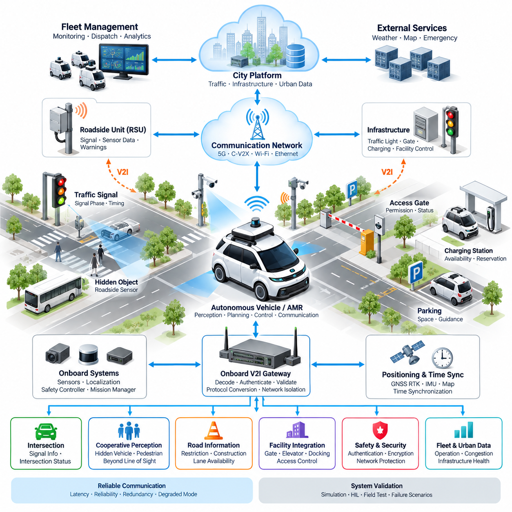
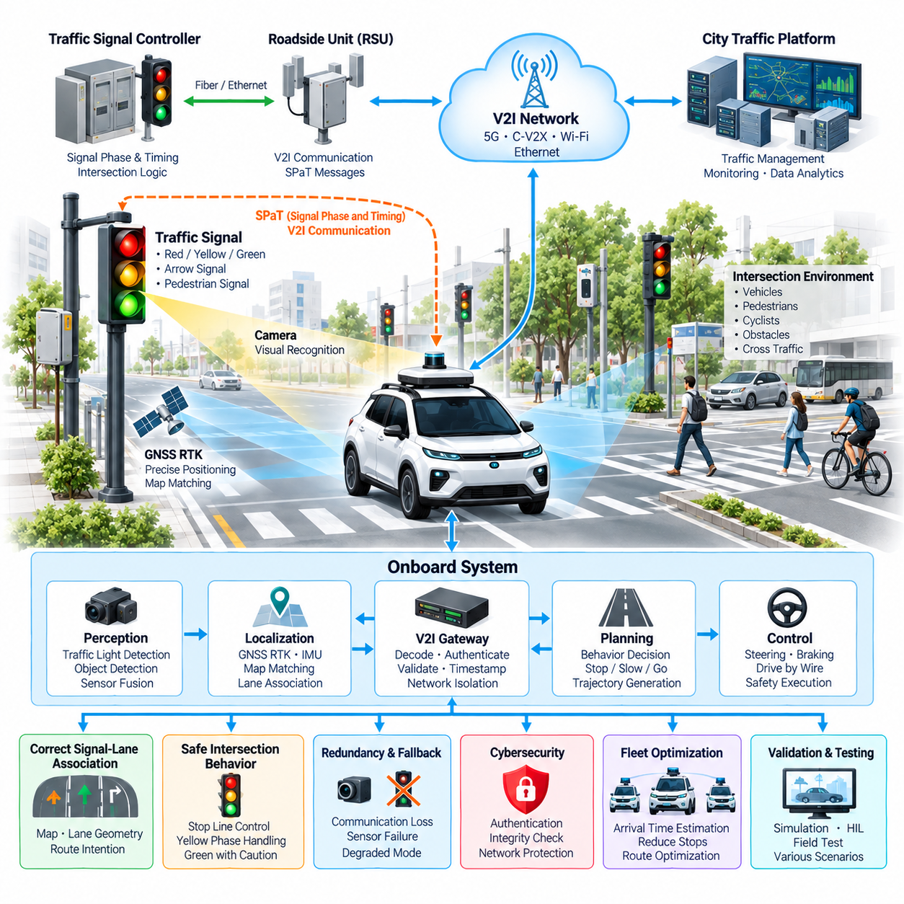
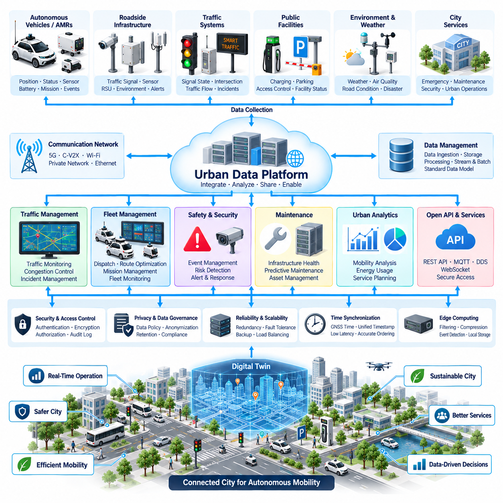
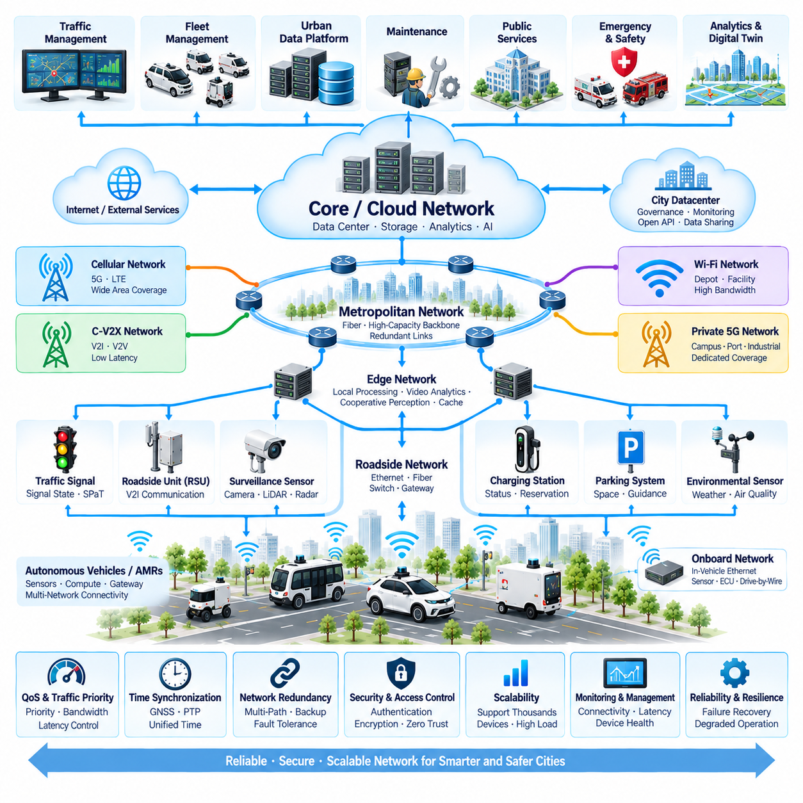
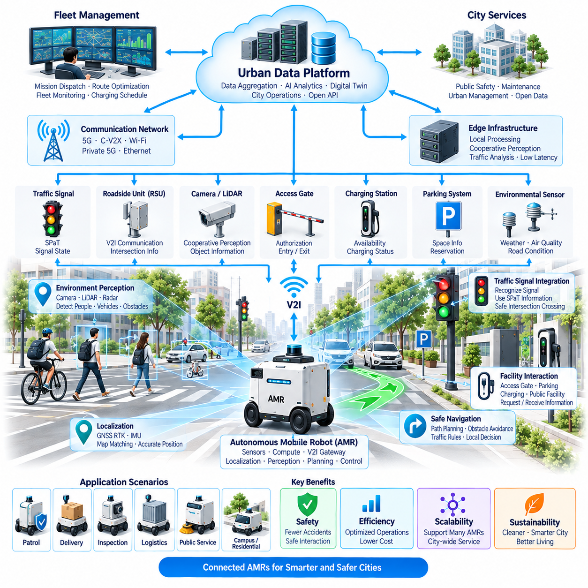

**Volume 17 Outdoor Autonomous Vehicle**


# Chapter 10. Smart City Integration

##  

## 10.01. V2I Communication

{width="7.268055555555556in" height="7.268055555555556in"}

Vehicle-to-Infrastructure communication enables an outdoor autonomous vehicle to exchange operational information with roadside and smart-city infrastructure rather than relying exclusively on onboard perception. Within the Smart City Integration architecture, V2I connects autonomous vehicles and AMRs with traffic signals, roadside units, intersections, access gates, parking systems, monitoring stations, and urban control platforms. It therefore extends vehicle awareness beyond the physical range and visibility limits of cameras, LiDAR, radar, and other onboard sensors.

A typical V2I architecture consists of an onboard communication unit, roadside communication equipment, a city communication network, and infrastructure applications. The onboard unit interfaces with the autonomous driving computer, localization system, safety controller, and mission manager. Roadside units collect information from traffic controllers and infrastructure sensors and transmit selected data to approaching vehicles. This architecture creates a digital communication layer between physical transportation infrastructure and autonomous machines operating within the city.

The primary purpose of V2I is not to replace autonomous perception but to provide complementary information that cannot always be obtained reliably from onboard sensors. A vehicle approaching an intersection may visually recognize a traffic light, while the infrastructure can simultaneously communicate the signal phase and timing information directly. Similar communication can provide road restrictions, temporary construction information, lane availability, intersection status, access permissions, environmental conditions, or warnings generated by infrastructure sensors.

Communication technology should be selected according to latency, coverage, reliability, deployment cost, and interoperability requirements. Cellular V2X can provide wide-area connectivity through mobile communication infrastructure, while direct communication technologies can support low-latency exchanges near intersections or roadside equipment. Wi-Fi, private 5G, Ethernet-connected roadside gateways, and other wireless networks may also participate in a smart-city deployment. In practice, heterogeneous communication technologies are often combined rather than forcing every infrastructure interface onto a single network.

The onboard V2I gateway should isolate external infrastructure communication from safety-critical vehicle control networks. Messages received from roadside systems must be decoded, authenticated, validated, timestamped, and converted into internal representations before they are supplied to planning or decision modules. A gateway can also translate between external V2X protocols and internal CAN, CAN FD, Automotive Ethernet, DDS, or ROS 2 communication. This separation reduces unnecessary coupling between public infrastructure networks and the vehicle\'s real-time control architecture.

Localization is essential because infrastructure messages have meaning only when associated with the correct road segment, intersection, lane, or geographic region. GNSS RTK can provide centimeter-class outdoor positioning where correction services and satellite visibility are sufficient, while IMU and onboard perception maintain localization continuity when GNSS quality deteriorates. V2I information should therefore be fused with vehicle position, heading, map data, and route context before it influences autonomous behavior, rather than being interpreted as an isolated communication event.

At signalized intersections, V2I can provide information such as the current signal state, remaining phase duration, upcoming phase transitions, and intersection configuration. The autonomous vehicle can combine this information with detected traffic lights, stop lines, pedestrians, surrounding vehicles, and predicted trajectories. The planner may then determine whether to continue, decelerate, stop, or prepare for a phase change. Infrastructure information increases anticipation distance, but final motion decisions should remain consistent with locally verified safety conditions.

Roadside infrastructure can also provide information that is difficult to observe from the vehicle because of occlusion. A roadside camera, radar, or LiDAR may detect a pedestrian hidden behind a parked vehicle, another vehicle approaching from a blind intersection, or an obstacle beyond the autonomous vehicle\'s direct field of view. After infrastructure processing, the relevant event can be communicated to approaching autonomous systems. This concept effectively extends perception from vehicle-centered sensing toward cooperative perception distributed across the urban environment.

For outdoor AMRs, V2I extends beyond conventional road traffic applications. Robots operating on campuses, industrial complexes, hospitals, residential developments, ports, and smart-city districts may communicate with automatic gates, elevators, pedestrian crossings, charging stations, security systems, docking facilities, and restricted-area controllers. Infrastructure can provide permission or status information, while the robot can report identity, destination, estimated arrival time, mission state, or service requirements. V2I consequently becomes an operational interface between autonomous mobility and intelligent facilities.

Reliable V2I operation requires explicit handling of communication degradation. Wireless coverage can disappear, packets can be delayed, infrastructure devices can fail, and received information can become stale. Every important message should therefore include suitable identifiers, timestamps, validity periods, sequence information, and confidence or status indicators where applicable. The vehicle should continuously evaluate message freshness and communication health. Loss of V2I must lead to a defined degraded mode rather than creating an uncontrolled dependency on infrastructure availability.

Time synchronization is particularly important when infrastructure information is fused with onboard perception. A signal-state message or detected-object report generated several hundred milliseconds earlier may describe a condition that has already changed by the time it reaches the vehicle. GNSS-based time, Precision Time Protocol, or other synchronized time sources can establish a common temporal reference. The receiving system can then compensate for communication delay, reject excessively old messages, and align infrastructure observations with camera, LiDAR, radar, GNSS, and IMU measurements.

Cybersecurity is another fundamental design requirement because V2I creates an external path into the autonomous vehicle. Authentication should establish whether a message originates from an authorized infrastructure node, while integrity protection should detect unauthorized modification. Encryption may protect sensitive operational data where required. Network segmentation, secure gateways, certificate management, access control, logging, software updates, and intrusion monitoring should be considered as system-level functions rather than optional communication features.

The V2I interface should also distinguish advisory information from safety-relevant information. A congestion notification may influence route optimization without directly affecting immediate vehicle control, whereas an infrastructure-generated collision warning may require rapid consideration by the planner. Message classes can therefore be associated with different latency, reliability, validation, and fallback requirements. This classification prevents low-priority smart-city data from competing unnecessarily with information needed for real-time autonomous operation.

From an electrical and hardware perspective, the V2I subsystem includes antennas, communication modems, roadside radios, gateways, network switches, power supplies, protective devices, connectors, and computing interfaces. Outdoor installations must tolerate temperature variation, rain, dust, vibration, electromagnetic interference, surge conditions, and unstable power. Antenna placement must consider vehicle structure and radio visibility, while communication equipment should be electrically isolated and protected so that faults in external communication hardware do not propagate into essential control systems.

V2I data can additionally be forwarded to fleet management and urban data platforms. A fleet control system may use infrastructure information to coordinate multiple robots, estimate congestion, allocate missions, or modify routes. Conversely, aggregated vehicle information can help a city platform understand mobility demand, blocked paths, infrastructure faults, and operating conditions. The resulting architecture links individual autonomous vehicles with fleet-level intelligence and city-level coordination while preserving clear interfaces between local autonomy and centralized services.

System validation should include normal operation as well as delayed packets, duplicated messages, corrupted data, incorrect timestamps, communication loss, infrastructure failures, GNSS degradation, network congestion, and contradictory information between infrastructure and onboard sensors. Hardware-in-the-loop, simulation, controlled test sites, and progressively expanded field trials can be used to verify these conditions. Particular attention should be given to transition behavior when the vehicle enters or leaves V2I coverage or when infrastructure information suddenly becomes unavailable.

A mature smart-city autonomous vehicle should therefore treat V2I as one component of a layered autonomy architecture. Onboard sensing and localization provide independent local awareness, V2I contributes cooperative and infrastructure-derived knowledge, fleet communication adds multi-vehicle coordination, and the urban platform supplies broader operational context. By combining these layers without making safe motion dependent on a single communication channel, outdoor autonomous vehicles can operate more efficiently and predictably while remaining resilient to infrastructure and network failures.

차량-인프라 통신(Vehicle-to-Infrastructure Communication)은 실외 자율주행 차량(Outdoor Autonomous Vehicle)이 차량 탑재 인지(Onboard Perception)에만 의존하지 않고 도로변 및 스마트시티 인프라(Smart City Infrastructure)와 운용 정보를 교환할 수 있도록 한다. 스마트시티 통합(Smart City Integration) 아키텍처에서 V2I는 자율주행 차량과 자율이동로봇(AMR)을 교통신호기(Traffic Signal), 노변 장치(Roadside Unit), 교차로(Intersection), 출입 게이트(Access Gate), 주차 시스템(Parking System), 모니터링 스테이션(Monitoring Station), 도시 관제 플랫폼(Urban Control Platform)과 연결한다. 따라서 카메라(Camera), 라이다(LiDAR), 레이더(Radar) 및 기타 차량 탑재 센서(Onboard Sensor)의 물리적 감지 범위와 가시성 한계를 넘어 차량의 상황 인식 능력을 확장한다.

일반적인 V2I 아키텍처(V2I Architecture)는 차량 탑재 통신 장치(Onboard Communication Unit), 노변 통신 장비(Roadside Communication Equipment), 도시 통신 네트워크(City Communication Network), 인프라 애플리케이션(Infrastructure Application)으로 구성된다. 차량 탑재 장치(Onboard Unit)는 자율주행 컴퓨터(Autonomous Driving Computer), 위치추정 시스템(Localization System), 안전 제어기(Safety Controller), 임무 관리자(Mission Manager)와 연동된다. 노변 장치(Roadside Unit)는 교통 제어기(Traffic Controller)와 인프라 센서(Infrastructure Sensor)에서 정보를 수집하고, 필요한 데이터를 접근하는 차량에 전송한다. 이러한 구조는 물리적 교통 인프라와 도시에서 운행하는 자율주행 기계 사이에 디지털 통신 계층(Digital Communication Layer)을 형성한다.

V2I의 주요 목적은 자율주행 인지(Autonomous Perception)를 대체하는 것이 아니라 차량 탑재 센서만으로 항상 안정적으로 획득하기 어려운 정보를 보완하는 것이다. 교차로에 접근하는 차량은 교통신호를 시각적으로 인식할 수 있으며, 동시에 인프라는 신호 현시(Signal Phase)와 신호 시간 정보(Signal Timing Information)를 직접 전달할 수 있다. 이와 유사하게 도로 제한(Road Restriction), 임시 공사 정보(Temporary Construction Information), 차로 이용 가능 상태(Lane Availability), 교차로 상태(Intersection Status), 출입 권한(Access Permission), 환경 조건(Environmental Condition), 인프라 센서가 생성한 경고 정보 등을 제공할 수 있다.

통신 기술(Communication Technology)은 지연시간(Latency), 통신 범위(Coverage), 신뢰성(Reliability), 구축 비용(Deployment Cost), 상호운용성(Interoperability) 요구사항에 따라 선정해야 한다. 셀룰러 V2X(Cellular V2X)는 이동통신 인프라를 이용하여 광역 연결성을 제공할 수 있으며, 직접 통신 기술(Direct Communication Technology)은 교차로나 노변 장비 주변에서 저지연 데이터 교환을 지원할 수 있다. 와이파이(Wi-Fi), 사설 5G(Private 5G), 이더넷 연결 노변 게이트웨이(Ethernet-Connected Roadside Gateway) 및 기타 무선 네트워크도 스마트시티 구축에 활용될 수 있다. 실제 시스템에서는 모든 인프라 인터페이스를 하나의 네트워크로 통일하기보다 여러 통신 기술을 조합하는 이종 통신 구조(Heterogeneous Communication Architecture)가 일반적으로 적합하다.

차량 탑재 V2I 게이트웨이(Onboard V2I Gateway)는 외부 인프라 통신(External Infrastructure Communication)을 안전 필수 차량 제어 네트워크(Safety-Critical Vehicle Control Network)로부터 격리해야 한다. 노변 시스템에서 수신한 메시지는 계획(Planning) 또는 의사결정 모듈(Decision Module)에 전달되기 전에 디코딩(Decoding), 인증(Authentication), 검증(Validation), 타임스탬프 처리(Timestamping), 내부 표현 변환(Internal Representation Conversion)을 거쳐야 한다. 게이트웨이는 외부 V2X 프로토콜과 내부 CAN, CAN FD, 자동차 이더넷(Automotive Ethernet), DDS 또는 ROS 2 통신 사이의 변환도 수행할 수 있다. 이러한 분리는 공공 인프라 네트워크와 차량 실시간 제어 아키텍처(Real-Time Control Architecture) 사이의 불필요한 결합을 감소시킨다.

위치추정(Localization)은 인프라 메시지가 올바른 도로 구간(Road Segment), 교차로(Intersection), 차로(Lane), 지리적 영역(Geographic Region)과 연계될 때에만 의미를 가지므로 매우 중요하다. 보정 서비스(Correction Service)와 위성 가시성(Satellite Visibility)이 충분한 환경에서는 GNSS RTK를 통해 센티미터급 위치 정확도(Centimeter-Class Positioning)를 확보할 수 있으며, GNSS 품질이 저하될 때에는 관성측정장치(IMU)와 차량 탑재 인지(Onboard Perception)가 위치추정의 연속성을 유지한다. 따라서 V2I 정보는 독립된 통신 이벤트로 해석하기보다 자율주행 동작에 영향을 주기 전에 차량 위치(Position), 방향(Heading), 지도 데이터(Map Data), 경로 문맥(Route Context)과 융합되어야 한다.

신호 교차로(Signalized Intersection)에서 V2I는 현재 신호 상태(Current Signal State), 잔여 현시 시간(Remaining Phase Duration), 다음 신호 전환(Upcoming Phase Transition), 교차로 구성(Intersection Configuration)과 같은 정보를 제공할 수 있다. 자율주행 차량은 이러한 정보를 감지된 교통신호(Traffic Light), 정지선(Stop Line), 보행자(Pedestrian), 주변 차량(Surrounding Vehicle), 예측 궤적(Predicted Trajectory)과 결합할 수 있다. 이후 경로 계획기(Planner)는 계속 주행할 것인지, 감속할 것인지, 정지할 것인지 또는 신호 변경에 대비할 것인지를 결정한다. 인프라 정보는 차량의 사전 예측 거리를 증가시키지만 최종 주행 판단은 차량에서 직접 검증된 안전 조건(Local Safety Condition)과 일치해야 한다.

노변 인프라(Roadside Infrastructure)는 가림 현상(Occlusion)으로 인해 차량에서 관측하기 어려운 정보도 제공할 수 있다. 노변 카메라(Roadside Camera), 레이더(Radar), 라이다(LiDAR)는 주차 차량 뒤에 가려진 보행자, 시야가 제한된 교차로에서 접근하는 다른 차량 또는 자율주행 차량의 직접적인 감지 범위를 벗어난 장애물을 탐지할 수 있다. 인프라에서 데이터를 처리한 후 관련 이벤트를 접근 중인 자율주행 시스템에 전달할 수 있다. 이러한 개념은 차량 중심 센싱(Vehicle-Centered Sensing)을 도시 환경 전반에 분산된 협력 인지(Cooperative Perception)로 확장한다.

실외 자율이동로봇(Outdoor AMR)의 V2I는 일반적인 도로 교통 애플리케이션을 넘어선다. 캠퍼스(Campus), 산업단지(Industrial Complex), 병원(Hospital), 주거단지(Residential Development), 항만(Port), 스마트시티 구역(Smart City District)에서 운행하는 로봇은 자동 게이트(Automatic Gate), 엘리베이터(Elevator), 보행자 횡단시설(Pedestrian Crossing), 충전소(Charging Station), 보안 시스템(Security System), 도킹 시설(Docking Facility), 제한구역 제어기(Restricted-Area Controller)와 통신할 수 있다. 인프라는 허가 또는 상태 정보를 제공하고, 로봇은 식별 정보(Identity), 목적지(Destination), 예상 도착시간(Estimated Arrival Time), 임무 상태(Mission State), 서비스 요구사항(Service Requirement)을 보고할 수 있다. 따라서 V2I는 자율 모빌리티(Autonomous Mobility)와 지능형 시설(Intelligent Facility)을 연결하는 운용 인터페이스(Operational Interface)가 된다.

신뢰성 높은 V2I 운용을 위해서는 통신 성능 저하(Communication Degradation)를 명확하게 처리해야 한다. 무선 통신 범위가 사라질 수 있고, 패킷(Packet)이 지연될 수 있으며, 인프라 장치가 고장 나거나 수신 정보가 오래되어 유효하지 않을 수 있다. 따라서 중요한 메시지에는 적절한 식별자(Identifier), 타임스탬프(Timestamp), 유효기간(Validity Period), 시퀀스 정보(Sequence Information), 필요한 경우 신뢰도 또는 상태 지표(Confidence or Status Indicator)를 포함해야 한다. 차량은 메시지 최신성(Message Freshness)과 통신 상태(Communication Health)를 지속적으로 평가해야 하며, V2I 통신 상실은 인프라 가용성에 대한 통제되지 않은 의존성을 발생시키는 대신 정의된 성능 저하 모드(Degraded Mode)로 전환되어야 한다.

시간 동기화(Time Synchronization)는 인프라 정보와 차량 탑재 인지 정보를 융합할 때 특히 중요하다. 수백 밀리초 전에 생성된 신호 상태 메시지(Signal-State Message)나 객체 탐지 보고(Detected-Object Report)는 차량에 도착했을 때 이미 변경된 상황을 나타낼 수 있다. GNSS 기반 시간(GNSS-Based Time), 정밀 시간 프로토콜(Precision Time Protocol, PTP) 또는 기타 동기화 시간원(Synchronized Time Source)을 이용하여 공통 시간 기준(Common Temporal Reference)을 구성할 수 있다. 수신 시스템은 이를 이용하여 통신 지연을 보상하고, 지나치게 오래된 메시지를 제거하며, 인프라 관측 정보를 카메라, 라이다, 레이더, GNSS, IMU 측정값과 시간적으로 정렬할 수 있다.

사이버보안(Cybersecurity) 역시 V2I가 자율주행 차량 내부로 연결되는 외부 통신 경로를 생성하므로 핵심 설계 요구사항이다. 인증(Authentication)을 통해 메시지가 허가된 인프라 노드(Authorized Infrastructure Node)에서 전송되었는지 확인하고, 무결성 보호(Integrity Protection)를 통해 비인가 변경을 탐지해야 한다. 필요한 경우 암호화(Encryption)를 적용하여 민감한 운용 데이터(Sensitive Operational Data)를 보호할 수 있다. 네트워크 분할(Network Segmentation), 보안 게이트웨이(Secure Gateway), 인증서 관리(Certificate Management), 접근 제어(Access Control), 로깅(Logging), 소프트웨어 업데이트(Software Update), 침입 모니터링(Intrusion Monitoring)은 선택적인 통신 기능이 아니라 시스템 수준 기능(System-Level Function)으로 고려해야 한다.

V2I 인터페이스는 또한 권고 정보(Advisory Information)와 안전 관련 정보(Safety-Relevant Information)를 구분해야 한다. 교통 혼잡 알림(Congestion Notification)은 즉각적인 차량 제어에 직접 영향을 주지 않으면서 경로 최적화(Route Optimization)에 활용될 수 있지만, 인프라에서 생성한 충돌 경고(Collision Warning)는 경로 계획기에서 신속하게 고려해야 할 수 있다. 따라서 메시지 클래스(Message Class)에 따라 서로 다른 지연시간, 신뢰성, 검증, 고장 대응(Fallback) 요구사항을 설정할 수 있다. 이러한 분류는 우선순위가 낮은 스마트시티 데이터가 실시간 자율주행에 필요한 정보와 불필요하게 경쟁하는 것을 방지한다.

전기 및 하드웨어 관점(Electrical and Hardware Perspective)에서 V2I 서브시스템(V2I Subsystem)은 안테나(Antenna), 통신 모뎀(Communication Modem), 노변 무선장치(Roadside Radio), 게이트웨이(Gateway), 네트워크 스위치(Network Switch), 전원공급장치(Power Supply), 보호장치(Protective Device), 커넥터(Connector), 컴퓨팅 인터페이스(Computing Interface)로 구성된다. 실외 설치 장비는 온도 변화, 비, 먼지, 진동, 전자기 간섭(Electromagnetic Interference), 서지(Surge), 불안정한 전원 조건을 견뎌야 한다. 안테나 배치는 차량 구조와 무선 가시성(Radio Visibility)을 고려해야 하며, 외부 통신 하드웨어의 고장이 필수 제어 시스템으로 전파되지 않도록 통신 장비를 전기적으로 격리하고 보호해야 한다.

V2I 데이터는 차량군 관리(Fleet Management) 및 도시 데이터 플랫폼(Urban Data Platform)으로 추가 전달될 수 있다. 차량군 관제 시스템(Fleet Control System)은 인프라 정보를 이용하여 여러 로봇을 조정하고, 혼잡도를 추정하며, 임무를 할당하거나 경로를 변경할 수 있다. 반대로 여러 차량에서 집계된 정보(Aggregated Vehicle Information)는 도시 플랫폼이 이동 수요(Mobility Demand), 차단된 경로(Blocked Path), 인프라 고장(Infrastructure Fault), 운용 상태(Operating Condition)를 파악하는 데 활용될 수 있다. 이러한 아키텍처는 개별 자율주행 차량을 차량군 수준 지능(Fleet-Level Intelligence) 및 도시 수준 협조(City-Level Coordination)와 연결하면서 로컬 자율주행(Local Autonomy)과 중앙집중형 서비스(Centralized Service) 사이의 명확한 인터페이스를 유지한다.

시스템 검증(System Validation)은 정상 운용뿐만 아니라 패킷 지연(Delayed Packet), 중복 메시지(Duplicated Message), 손상 데이터(Corrupted Data), 잘못된 타임스탬프(Incorrect Timestamp), 통신 두절(Communication Loss), 인프라 고장(Infrastructure Failure), GNSS 성능 저하(GNSS Degradation), 네트워크 혼잡(Network Congestion), 인프라 정보와 차량 탑재 센서 정보 사이의 불일치(Contradictory Information)를 포함해야 한다. 하드웨어 인 더 루프(Hardware-in-the-Loop, HIL), 시뮬레이션(Simulation), 통제된 시험장(Controlled Test Site), 단계적으로 확대되는 현장 시험(Field Trial)을 이용하여 이러한 조건을 검증할 수 있다. 특히 차량이 V2I 통신 영역에 진입하거나 이탈하는 경우와 인프라 정보가 갑자기 이용 불가능해지는 경우의 전환 동작(Transition Behavior)을 중점적으로 검증해야 한다.

성숙한 스마트시티 자율주행 차량(Smart-City Autonomous Vehicle)은 V2I를 계층형 자율주행 아키텍처(Layered Autonomy Architecture)의 하나의 구성 요소로 다루어야 한다. 차량 탑재 센싱(Onboard Sensing)과 위치추정(Localization)은 독립적인 로컬 상황 인식(Local Awareness)을 제공하고, V2I는 협력형 및 인프라 기반 정보(Cooperative and Infrastructure-Derived Knowledge)를 제공하며, 차량군 통신(Fleet Communication)은 다중 차량 협조(Multi-Vehicle Coordination)를 추가하고, 도시 플랫폼(Urban Platform)은 보다 광범위한 운용 문맥(Operational Context)을 제공한다. 안전한 차량 움직임을 하나의 통신 채널에 의존시키지 않고 이러한 계층을 결합함으로써 실외 자율주행 차량은 인프라 및 네트워크 장애에 대한 복원력(Resilience)을 유지하면서 더욱 효율적이고 예측 가능한 방식으로 운행할 수 있다.

##  

## 10.02. Traffic Signal Integration

{width="7.268055555555556in" height="7.268055555555556in"}

Traffic signal integration enables an outdoor autonomous vehicle to interpret, receive, validate, and respond to intersection signal states as part of its autonomous driving architecture. Within Smart City Integration, the traffic signal is treated not only as a visual object detected by cameras but also as a connected infrastructure element capable of providing digital information. This combination improves situational awareness and supports more predictable operation at controlled intersections.

The integration architecture normally connects the autonomous vehicle, traffic signal controller, roadside communication unit, V2I network, localization subsystem, perception stack, and motion-planning system. Signal information can travel from the intersection controller through a roadside unit and communication network to the vehicle gateway. The onboard system associates the received data with the relevant intersection and combines it with locally observed traffic conditions before determining an appropriate driving response.

Visual traffic-light recognition remains an important independent source of information. Forward-facing cameras can detect the signal head and classify states such as red, yellow, green, directional arrows, or other locally defined indications. Computer vision then associates the recognized signal with the vehicle\'s intended lane and route. This process is essential because an intersection may contain multiple signal heads controlling different lanes, directions, pedestrian movements, or protected turning phases.

Digital signal information can complement visual recognition by providing the current signal phase and information about expected phase transitions. Signal Phase and Timing data allows the vehicle to anticipate whether a green phase is likely to remain available or whether deceleration should begin before reaching the intersection. This information can improve smoothness and energy efficiency, but predicted timing should not be interpreted as an unconditional authorization to proceed because signal operation and surrounding traffic conditions can change.

Correct signal-to-lane association is one of the most important integration problems. The autonomous system must determine which signal controls the vehicle\'s current or planned movement rather than simply selecting the nearest visible signal. High-definition map information, lane geometry, stop-line position, vehicle heading, route intention, and infrastructure identifiers can be combined to establish this relationship. Incorrect association may cause a technically correct signal observation to produce an unsafe behavioral decision.

Localization therefore provides a fundamental reference for traffic signal integration. GNSS RTK, IMU, map matching, and onboard perception can determine the vehicle\'s position relative to the intersection, approach lane, and stop line. The system should recognize whether the vehicle is approaching, entering, traversing, or leaving the controlled intersection. Accurate spatial context also prevents information transmitted from nearby intersections from being incorrectly applied to the vehicle\'s current driving situation.

The onboard V2I gateway provides a controlled interface between traffic infrastructure and the autonomous driving computer. Incoming signal messages should be authenticated, decoded, timestamped, checked for validity, and converted into an internal representation suitable for perception and planning modules. Network isolation is important because infrastructure communication originates outside the vehicle. External messages should therefore never obtain unrestricted access to steering, braking, propulsion, or other safety-critical control networks.

Signal fusion compares infrastructure information with visual observations and other contextual evidence. When both sources indicate the same state, confidence in the interpreted traffic condition can increase. When they disagree, the system should identify the inconsistency instead of arbitrarily selecting one source. Possible causes include camera misclassification, incorrect infrastructure mapping, communication delay, stale packets, clock misalignment, signal-controller faults, or temporary occlusion of the physical traffic light.

Time synchronization is especially important because traffic signals change state within precisely controlled sequences. Every infrastructure message should contain timing information that allows the vehicle to determine when the reported state was generated and whether it remains valid. GNSS-derived time or synchronized network timing can establish a common reference. The vehicle can then estimate communication latency, reject stale information, and align digital signal messages with camera frames and vehicle trajectory data.

Traffic signal integration must also support stopping behavior. When a red signal is confirmed, the planner calculates a safe trajectory toward the associated stop line while considering vehicle velocity, acceleration limits, road friction, following traffic, and obstacle conditions. The controller then executes the required deceleration through the drive-by-wire system. The objective is not merely to stop before the line but to achieve a stable, comfortable, and predictable maneuver without violating safety constraints.

Yellow-phase handling requires more contextual reasoning because the correct response depends on distance to the stop line, current velocity, achievable deceleration, road conditions, and applicable traffic rules. The planning system should evaluate whether a safe stop remains feasible rather than applying a simplistic fixed-distance rule. Infrastructure timing information can provide additional context, while onboard perception and vehicle dynamics determine whether the planned maneuver can actually be executed safely.

A green signal does not automatically mean that the vehicle should enter the intersection. The autonomous system must still evaluate pedestrians, cyclists, crossing vehicles, stationary obstacles, emergency vehicles, intersection blockage, and other relevant hazards. Cooperative perception from roadside cameras, radar, or LiDAR may provide additional information about objects hidden from the vehicle\'s sensors. Traffic signal integration therefore participates in a broader intersection safety decision rather than acting as a direct motion command.

For outdoor AMRs operating in smart-city environments, signal integration may involve more than conventional road intersections. Robots may encounter pedestrian crossings, internal campus signals, industrial traffic lights, automated gates, warning beacons, railway-style crossings, and dedicated robotic mobility corridors. A common infrastructure interface allows the mission planner to interpret these devices according to operational context while maintaining appropriate separation between infrastructure information and local autonomous safety functions.

Communication failures must be considered a normal operational condition rather than an exceptional event. V2I packets may be delayed or lost, roadside equipment may become unavailable, and network coverage may temporarily disappear. The vehicle should detect communication degradation through message timeout, sequence monitoring, connectivity status, and data freshness checks. If infrastructure information becomes unavailable, operation should transition to a predefined degraded mode based on onboard sensing and applicable safety requirements.

The opposite condition must also be addressed: infrastructure communication may remain available while the physical signal cannot be visually recognized because of weather, glare, obstruction, camera contamination, or sensor failure. Digital information may improve awareness in such situations, but its use should depend on system safety requirements and confidence in infrastructure integrity. Redundant information sources are most valuable when their independence and failure characteristics have been explicitly considered during architecture design.

Cybersecurity is essential because falsified traffic signal information could influence autonomous vehicle behavior. Traffic infrastructure and vehicle gateways should therefore support authentication, message integrity verification, authorization, secure credential management, logging, and controlled software updates. Network segmentation can prevent a compromised communication interface from propagating directly into safety-critical domains. Security monitoring should also identify abnormal message frequency, invalid identifiers, repeated packets, and unexpected signal-state transitions.

Traffic signal integration can contribute to fleet-level optimization as well as individual vehicle control. A fleet management system may use intersection states and expected signal timing to estimate arrival times, reduce unnecessary stops, coordinate multiple robots, or select alternative routes around congested areas. Urban traffic platforms can similarly use aggregated autonomous-vehicle information to evaluate intersection performance, queue formation, mobility demand, and infrastructure health without transferring immediate safety responsibility away from the vehicle.

Electrical and hardware implementation includes communication modems, antennas, roadside units, signal-controller interfaces, onboard gateways, network switches, power conversion, protective circuits, and computing interfaces. Equipment installed outdoors must tolerate temperature variation, water, dust, vibration, surge events, electromagnetic interference, and unstable supply conditions. Vehicle-side components should also be packaged so that failures in communication equipment do not interrupt essential perception, localization, braking, steering, or propulsion functions.

Validation should reproduce both normal and abnormal intersection conditions. Testing should include all supported signal phases, turning movements, multiple signal heads, occlusion, glare, night operation, rain, communication loss, delayed messages, incorrect timestamps, contradictory camera and infrastructure information, localization errors, and signal-controller faults. Simulation, software-in-the-loop, hardware-in-the-loop, closed-course testing, and controlled field trials can progressively verify behavior before deployment in unrestricted operating environments.

A robust traffic signal integration architecture ultimately combines infrastructure connectivity with independent onboard autonomy. Cameras provide direct observation, V2I supplies digital signal context, localization establishes the correct intersection and lane relationship, cooperative perception expands environmental awareness, and planning determines the final vehicle response. By treating traffic signals as both physical and digital infrastructure while maintaining safe fallback behavior, outdoor autonomous vehicles can interact with smart-city intersections more reliably, smoothly, and predictably.

교통신호 통합(Traffic Signal Integration)은 실외 자율주행 차량(Outdoor Autonomous Vehicle)이 자율주행 아키텍처(Autonomous Driving Architecture)의 일부로 교차로 신호 상태(Intersection Signal State)를 해석하고, 수신하고, 검증하며, 이에 대응할 수 있도록 한다. 스마트시티 통합(Smart City Integration) 환경에서 교통신호는 카메라(Camera)가 인식하는 시각적 객체(Visual Object)일 뿐만 아니라 디지털 정보를 제공할 수 있는 연결형 인프라(Connected Infrastructure)로 취급된다. 이러한 결합은 상황 인식(Situational Awareness)을 향상시키고 신호 제어 교차로(Controlled Intersection)에서 더욱 예측 가능한 운행을 지원한다.

통합 아키텍처(Integration Architecture)는 일반적으로 자율주행 차량(Autonomous Vehicle), 교통신호 제어기(Traffic Signal Controller), 노변 통신 장치(Roadside Communication Unit), V2I 네트워크(V2I Network), 위치추정 서브시스템(Localization Subsystem), 인지 스택(Perception Stack), 모션 계획 시스템(Motion-Planning System)을 연결한다. 신호 정보는 교차로 제어기에서 노변 장치와 통신 네트워크를 거쳐 차량 게이트웨이(Vehicle Gateway)로 전달될 수 있다. 차량 탑재 시스템(Onboard System)은 수신된 데이터를 해당 교차로와 연결하고, 현장에서 관측한 교통 상황과 결합한 후 적절한 주행 대응을 결정한다.

시각 기반 교통신호 인식(Visual Traffic-Light Recognition)은 여전히 중요한 독립 정보원(Independent Information Source)이다. 전방 카메라(Forward-Facing Camera)는 신호등(Signal Head)을 탐지하고 적색(Red), 황색(Yellow), 녹색(Green), 방향 화살표(Directional Arrow) 또는 지역별로 정의된 기타 신호 상태를 분류할 수 있다. 이후 컴퓨터 비전(Computer Vision)은 인식된 신호를 차량의 예정 차로와 경로에 연결한다. 하나의 교차로에는 서로 다른 차로, 진행 방향, 보행자 이동 또는 보호 회전 현시(Protected Turning Phase)를 제어하는 여러 신호등이 존재할 수 있으므로 이러한 과정은 필수적이다.

디지털 신호 정보(Digital Signal Information)는 현재 신호 현시(Current Signal Phase)와 예상되는 현시 전환(Expected Phase Transition) 정보를 제공하여 시각적 인식을 보완할 수 있다. 신호 현시 및 시간 정보(Signal Phase and Timing, SPaT)를 이용하면 차량은 녹색 신호가 계속 유지될 가능성이 있는지 또는 교차로에 도달하기 전에 감속을 시작해야 하는지를 사전에 판단할 수 있다. 이러한 정보는 주행의 부드러움과 에너지 효율(Energy Efficiency)을 향상시킬 수 있지만, 신호 운용과 주변 교통 상황은 변경될 수 있으므로 예측된 신호 시간을 무조건적인 통과 허가로 해석해서는 안 된다.

정확한 신호-차로 연계(Signal-to-Lane Association)는 가장 중요한 통합 문제 중 하나이다. 자율주행 시스템은 단순히 가장 가까이 보이는 신호를 선택하는 것이 아니라 어떤 신호가 현재 또는 계획된 차량의 이동을 제어하는지 판단해야 한다. 고정밀 지도(High-Definition Map), 차로 형상(Lane Geometry), 정지선 위치(Stop-Line Position), 차량 방향(Vehicle Heading), 경로 의도(Route Intention), 인프라 식별자(Infrastructure Identifier)를 결합하여 이러한 관계를 설정할 수 있다. 잘못된 연계는 기술적으로 정확한 신호 관측 결과조차 위험한 주행 판단으로 이어지게 할 수 있다.

따라서 위치추정(Localization)은 교통신호 통합을 위한 핵심 기준을 제공한다. GNSS RTK, 관성측정장치(IMU), 지도 정합(Map Matching), 차량 탑재 인지(Onboard Perception)를 이용하여 교차로, 접근 차로, 정지선에 대한 차량의 상대적 위치를 결정할 수 있다. 시스템은 차량이 신호 제어 교차로에 접근 중인지, 진입 중인지, 통과 중인지 또는 이탈 중인지를 인식해야 한다. 정확한 공간적 문맥(Spatial Context)은 인접한 다른 교차로에서 전송된 정보가 현재 차량의 주행 상황에 잘못 적용되는 것도 방지한다.

차량 탑재 V2I 게이트웨이(Onboard V2I Gateway)는 교통 인프라와 자율주행 컴퓨터 사이에 제어된 인터페이스(Controlled Interface)를 제공한다. 수신된 신호 메시지는 인증(Authentication), 디코딩(Decoding), 타임스탬프 처리(Timestamping), 유효성 검사(Validity Check)를 거쳐 인지 및 계획 모듈에서 사용할 수 있는 내부 표현(Internal Representation)으로 변환되어야 한다. 인프라 통신은 차량 외부에서 발생하므로 네트워크 격리(Network Isolation)가 중요하다. 외부 메시지가 조향(Steering), 제동(Braking), 추진(Propulsion) 또는 기타 안전 필수 제어 네트워크(Safety-Critical Control Network)에 제한 없이 접근해서는 안 된다.

신호 융합(Signal Fusion)은 인프라 정보와 시각적 관측 및 기타 문맥 정보를 비교한다. 두 정보원이 동일한 상태를 나타내면 해석된 교통 상황에 대한 신뢰도를 높일 수 있다. 반대로 서로 일치하지 않는 경우 시스템은 임의로 하나의 정보원을 선택하기보다 불일치(Inconsistency)를 식별해야 한다. 가능한 원인으로는 카메라 오분류(Camera Misclassification), 잘못된 인프라 매핑(Incorrect Infrastructure Mapping), 통신 지연(Communication Delay), 오래된 패킷(Stale Packet), 시간 동기화 오류(Clock Misalignment), 신호 제어기 고장(Signal-Controller Fault), 물리적 신호등의 일시적 가림(Occlusion) 등이 있다.

교통신호는 정밀하게 제어된 순서에 따라 상태가 변경되므로 시간 동기화(Time Synchronization)가 특히 중요하다. 모든 인프라 메시지에는 차량이 보고된 상태의 생성 시점과 현재 유효 여부를 판단할 수 있는 시간 정보(Timing Information)가 포함되어야 한다. GNSS 기반 시간(GNSS-Derived Time) 또는 동기화된 네트워크 시간(Synchronized Network Timing)을 이용하여 공통 시간 기준(Common Time Reference)을 설정할 수 있다. 차량은 이를 기반으로 통신 지연을 추정하고 오래된 정보를 제거하며 디지털 신호 메시지를 카메라 프레임(Camera Frame) 및 차량 궤적 데이터(Vehicle Trajectory Data)와 시간적으로 정렬할 수 있다.

교통신호 통합은 정지 동작(Stopping Behavior)도 지원해야 한다. 적색 신호가 확인되면 경로 계획기(Planner)는 차량 속도(Vehicle Velocity), 가감속 한계(Acceleration and Deceleration Limits), 노면 마찰(Road Friction), 후방 교통 상황(Following Traffic), 장애물 조건(Obstacle Condition)을 고려하여 해당 정지선까지의 안전한 궤적(Safe Trajectory)을 계산한다. 이후 제어기(Controller)는 드라이브 바이 와이어 시스템(Drive-by-Wire System)을 통해 필요한 감속을 수행한다. 목적은 단순히 정지선 이전에 멈추는 것이 아니라 안전 제약조건을 위반하지 않으면서 안정적이고 편안하며 예측 가능한 정지 동작을 구현하는 것이다.

황색 신호 처리(Yellow-Phase Handling)는 올바른 대응이 정지선까지의 거리, 현재 속도, 실현 가능한 감속도(Achievable Deceleration), 노면 상태(Road Condition), 적용되는 교통 규칙(Traffic Rule)에 따라 달라지므로 더욱 많은 문맥적 판단(Contextual Reasoning)이 필요하다. 계획 시스템은 단순한 고정 거리 기준을 적용하는 대신 안전한 정지가 여전히 가능한지를 평가해야 한다. 인프라의 신호 시간 정보는 추가적인 문맥을 제공할 수 있으며, 차량 탑재 인지와 차량 동역학(Vehicle Dynamics)은 계획된 동작이 실제로 안전하게 수행 가능한지를 결정한다.

녹색 신호라고 해서 차량이 자동으로 교차로에 진입해야 하는 것은 아니다. 자율주행 시스템은 여전히 보행자(Pedestrian), 자전거 이용자(Cyclist), 교차 차량(Crossing Vehicle), 정지 장애물(Stationary Obstacle), 긴급 차량(Emergency Vehicle), 교차로 정체(Intersection Blockage) 및 기타 관련 위험요소를 평가해야 한다. 노변 카메라, 레이더 또는 라이다를 이용한 협력 인지(Cooperative Perception)는 차량 센서에서 가려진 객체에 대한 추가 정보를 제공할 수 있다. 따라서 교통신호 통합은 직접적인 차량 움직임 명령이 아니라 보다 광범위한 교차로 안전 판단(Intersection Safety Decision)의 일부로 작동한다.

스마트시티 환경에서 운행하는 실외 자율이동로봇(Outdoor AMR)의 신호 통합은 일반적인 도로 교차로 이상의 대상을 포함할 수 있다. 로봇은 보행자 횡단시설(Pedestrian Crossing), 캠퍼스 내부 신호(Internal Campus Signal), 산업용 교통신호(Industrial Traffic Light), 자동 게이트(Automated Gate), 경고등(Warning Beacon), 철도형 건널목(Railway-Style Crossing), 로봇 전용 이동 통로(Dedicated Robotic Mobility Corridor)를 마주할 수 있다. 공통 인프라 인터페이스(Common Infrastructure Interface)를 통해 임무 계획기(Mission Planner)는 로컬 자율주행 안전 기능과 인프라 정보를 적절히 분리하면서 운용 문맥에 따라 이러한 장치를 해석할 수 있다.

통신 장애(Communication Failure)는 예외적인 사건이 아니라 정상적으로 고려해야 하는 운용 조건으로 취급해야 한다. V2I 패킷은 지연되거나 손실될 수 있으며, 노변 장비가 사용 불가능해지거나 네트워크 통신 범위가 일시적으로 사라질 수 있다. 차량은 메시지 타임아웃(Message Timeout), 시퀀스 모니터링(Sequence Monitoring), 연결 상태(Connectivity Status), 데이터 최신성 검사(Data Freshness Check)를 통해 통신 성능 저하를 탐지해야 한다. 인프라 정보를 사용할 수 없게 되면 차량 탑재 센싱과 적용되는 안전 요구사항에 기반한 사전에 정의된 성능 저하 모드(Degraded Mode)로 전환해야 한다.

반대의 상황도 고려해야 한다. 인프라 통신은 정상적으로 유지되지만 날씨, 눈부심(Glare), 장애물에 의한 가림, 카메라 오염(Camera Contamination), 센서 고장(Sensor Failure)으로 인해 실제 교통신호를 시각적으로 인식하지 못할 수 있다. 이러한 상황에서 디지털 정보는 상황 인식을 향상시킬 수 있지만, 그 활용 수준은 시스템 안전 요구사항(System Safety Requirement)과 인프라 무결성(Infrastructure Integrity)에 대한 신뢰도에 따라 결정되어야 한다. 중복 정보원(Redundant Information Source)은 각각의 독립성과 고장 특성(Failure Characteristic)이 아키텍처 설계 단계에서 명확하게 고려되었을 때 가장 높은 가치를 가진다.

위조된 교통신호 정보가 자율주행 차량의 행동에 영향을 줄 수 있으므로 사이버보안(Cybersecurity)은 필수적이다. 교통 인프라와 차량 게이트웨이는 인증(Authentication), 메시지 무결성 검증(Message Integrity Verification), 권한 관리(Authorization), 보안 자격증명 관리(Secure Credential Management), 로깅(Logging), 통제된 소프트웨어 업데이트(Controlled Software Update)를 지원해야 한다. 네트워크 분할(Network Segmentation)은 손상된 통신 인터페이스가 안전 필수 영역으로 직접 확산되는 것을 방지할 수 있다. 보안 모니터링(Security Monitoring)은 비정상적인 메시지 빈도, 유효하지 않은 식별자, 반복 패킷, 예상하지 못한 신호 상태 전환도 식별해야 한다.

교통신호 통합은 개별 차량 제어뿐만 아니라 차량군 수준 최적화(Fleet-Level Optimization)에도 기여할 수 있다. 차량군 관리 시스템(Fleet Management System)은 교차로 상태와 예상 신호 시간을 이용하여 도착시간을 추정하고, 불필요한 정지를 줄이며, 여러 로봇을 조정하거나 혼잡 지역을 우회하는 대체 경로를 선택할 수 있다. 도시 교통 플랫폼(Urban Traffic Platform)도 집계된 자율주행 차량 정보를 이용하여 교차로 성능, 대기 행렬 형성(Queue Formation), 이동 수요(Mobility Demand), 인프라 상태(Infrastructure Health)를 평가할 수 있으며, 즉각적인 안전 책임은 차량 자체에 유지된다.

전기 및 하드웨어 구현(Electrical and Hardware Implementation)에는 통신 모뎀(Communication Modem), 안테나(Antenna), 노변 장치(Roadside Unit), 신호 제어기 인터페이스(Signal-Controller Interface), 차량 탑재 게이트웨이(Onboard Gateway), 네트워크 스위치(Network Switch), 전력 변환 장치(Power Conversion), 보호 회로(Protective Circuit), 컴퓨팅 인터페이스(Computing Interface)가 포함된다. 실외 장비는 온도 변화, 물, 먼지, 진동, 서지(Surge), 전자기 간섭(Electromagnetic Interference), 불안정한 전원 조건을 견뎌야 한다. 차량 측 구성품도 통신 장비의 고장이 필수 인지, 위치추정, 제동, 조향 또는 추진 기능을 중단시키지 않도록 구성해야 한다.

검증(Validation)은 정상 및 비정상 교차로 조건을 모두 재현해야 한다. 시험에는 지원되는 모든 신호 현시(Signal Phase), 회전 이동(Turning Movement), 다중 신호등(Multiple Signal Head), 가림(Occlusion), 눈부심(Glare), 야간 운행(Night Operation), 우천(Rain), 통신 두절(Communication Loss), 메시지 지연(Delayed Message), 잘못된 타임스탬프(Incorrect Timestamp), 카메라와 인프라 정보의 불일치, 위치추정 오류(Localization Error), 신호 제어기 고장(Signal-Controller Fault)이 포함되어야 한다. 시뮬레이션(Simulation), 소프트웨어 인 더 루프(Software-in-the-Loop, SIL), 하드웨어 인 더 루프(Hardware-in-the-Loop, HIL), 폐쇄 시험장 시험(Closed-Course Testing), 통제된 현장 시험(Controlled Field Trial)을 통해 비제한 운용 환경에 배치하기 전에 동작을 단계적으로 검증할 수 있다.

강건한 교통신호 통합 아키텍처(Robust Traffic Signal Integration Architecture)는 궁극적으로 인프라 연결성(Infrastructure Connectivity)과 독립적인 차량 탑재 자율주행(Onboard Autonomy)을 결합한다. 카메라는 직접적인 시각 관측을 제공하고, V2I는 디지털 신호 문맥(Digital Signal Context)을 제공하며, 위치추정은 올바른 교차로 및 차로 관계를 설정하고, 협력 인지는 환경 인식 범위를 확장하며, 경로 계획(Planning)은 최종적인 차량 대응을 결정한다. 안전한 고장 대응 동작(Safe Fallback Behavior)을 유지하면서 교통신호를 물리적 인프라와 디지털 인프라로 동시에 활용함으로써 실외 자율주행 차량은 스마트시티 교차로와 더욱 신뢰성 있고 부드러우며 예측 가능한 방식으로 상호작용할 수 있다.

##  

## 10.03. Urban Data Platform

{width="7.268055555555556in" height="7.268055555555556in"}

An Urban Data Platform provides the shared digital environment through which autonomous vehicles, AMRs, roadside infrastructure, traffic systems, public facilities, and city services exchange operational information. Within Smart City Integration, the platform sits above individual V2I connections and aggregates data from many distributed sources. Its purpose is to transform fragmented vehicle and infrastructure information into a consistent city-level operational context that supports mobility, safety, maintenance, and coordinated autonomous services.

Outdoor autonomous vehicles continuously generate information about position, velocity, route progress, mission status, sensor health, battery condition, detected obstacles, road conditions, and communication quality. Infrastructure simultaneously produces traffic signal states, intersection events, environmental measurements, access-control status, parking availability, and equipment diagnostics. The Urban Data Platform receives selected information from these sources and organizes it so that different applications can consume the same operational data without requiring direct point-to-point connections.

A practical platform architecture can be divided into edge, communication, ingestion, data-management, analytics, and application layers. Vehicle and roadside gateways form the edge layer, while 5G, C-V2X, Wi-Fi, private networks, and wired Ethernet provide communication paths. Ingestion services receive streaming and event-based messages, after which storage and processing systems create structured datasets. Application services then expose the processed information to traffic management, fleet control, monitoring dashboards, maintenance systems, and smart-city applications.

Data ingestion must accommodate information arriving at very different rates and with different priorities. Vehicle position may be updated several times per second, while battery health or infrastructure maintenance information may change much more slowly. Emergency events require immediate delivery, whereas historical analytics can tolerate greater delay. The platform should therefore distinguish real-time streams, operational events, periodic telemetry, configuration information, and bulk historical data instead of processing every message through an identical communication path.

A common data model is important because vehicles and infrastructure may be supplied by different manufacturers and use different internal representations. The platform can normalize identifiers, timestamps, geographic coordinates, vehicle states, infrastructure states, event classifications, and health information into standardized logical objects. This abstraction allows applications to work with concepts such as vehicle, intersection, lane, charging station, mission, or incident without requiring detailed knowledge of each device\'s proprietary interface.

Geospatial information forms one of the most important foundations of an urban platform. Vehicle trajectories, intersections, road segments, pedestrian areas, restricted zones, charging stations, parking areas, and detected events must be associated with geographic locations. GNSS RTK, map information, and infrastructure coordinates can provide this spatial reference. The platform can then correlate events from multiple vehicles and infrastructure devices according to location rather than treating every message as an unrelated data record.

Time synchronization provides the corresponding temporal reference. Data collected from autonomous vehicles, traffic signals, roadside cameras, LiDAR, environmental sensors, and fleet systems must be interpreted according to when the event actually occurred. Timestamps should therefore be preserved throughout ingestion and processing. Synchronized time enables the platform to reconstruct incidents, correlate observations from multiple sources, measure communication latency, and distinguish current operational information from delayed or stale data.

The platform should support both streaming and historical data processing. Streaming analytics can identify congestion, blocked routes, abnormal vehicle behavior, infrastructure failures, or rapidly developing safety events. Historical processing can reveal recurring traffic patterns, mission performance, energy consumption, communication coverage, component degradation, and infrastructure utilization. Combining both forms of analysis allows the city to respond to immediate conditions while continuously improving long-term autonomous mobility operations.

Fleet management becomes more powerful when connected to city-level data. Instead of dispatching robots according only to vehicle availability and mission priority, the fleet system can consider traffic conditions, intersection states, road restrictions, charging-station availability, weather information, and infrastructure events. Routes and missions can therefore be adjusted according to the broader urban environment. The Urban Data Platform acts as the information bridge between local fleet optimization and conditions observed across the smart-city infrastructure.

The relationship between the platform and individual vehicles should remain carefully controlled. City-level information can improve route selection and operational planning, but the platform should not become the only source required for immediate safe motion. Cameras, LiDAR, radar, GNSS, IMU, onboard maps, and local planning continue to provide autonomous capability at the vehicle level. If cloud or city connectivity is lost, the vehicle should retain a defined level of safe local operation or transition to an appropriate minimal-risk condition.

Event management provides another important platform function. Vehicles and infrastructure can publish events such as road blockage, collision risk, equipment failure, unauthorized access, fire detection, abnormal environmental conditions, or communication loss. The platform can classify these events according to severity, location, affected assets, and required response. Relevant information can then be distributed to fleet operators, nearby autonomous vehicles, traffic systems, maintenance teams, security personnel, or emergency services according to predefined operational policies.

Urban data can also support cooperative perception. Several autonomous vehicles or roadside sensors may observe the same road environment from different viewpoints. Rather than transmitting all raw sensor data continuously, edge systems can extract objects, tracks, occupancy information, or significant events and forward compact representations to the platform. The platform can correlate these observations and distribute useful information to authorized consumers, extending awareness beyond the direct sensing range of an individual autonomous vehicle.

Data volume management becomes increasingly important as the number of autonomous vehicles grows. Continuous transmission of raw camera, LiDAR, or radar streams from every robot would impose substantial communication and storage requirements. Edge computing should therefore perform filtering, compression, feature extraction, event detection, and local retention. High-bandwidth raw data can be uploaded selectively when required for incident investigation, model improvement, maintenance analysis, or validation rather than being treated as the default city-wide communication format.

Application programming interfaces and message interfaces provide controlled access to platform information. REST APIs can support configuration and historical queries, while MQTT, DDS, WebSocket, or similar messaging technologies can distribute operational updates and real-time events according to system requirements. Interface definitions should specify data schemas, units, coordinate systems, timestamps, error handling, version compatibility, and quality indicators so that applications can evolve without creating uncontrolled dependencies between city subsystems.

Cybersecurity and access control are fundamental because an Urban Data Platform connects many operational domains. Vehicles, roadside units, fleet servers, traffic systems, maintenance applications, and external services should authenticate before exchanging information. Authorization determines which data and commands each participant may access. Encryption, network segmentation, certificate management, audit logging, intrusion detection, secure software updates, and credential lifecycle management help prevent a compromised endpoint from becoming a pathway into the wider smart-city environment.

Privacy and data governance must also be incorporated into platform architecture. Autonomous mobility systems may observe pedestrians, vehicles, facilities, routes, and operational behavior that should not be retained indefinitely or exposed without justification. Data collection should therefore be linked to defined operational purposes, retention periods, access policies, and anonymization or aggregation rules where appropriate. Governance becomes especially important when information is shared among city agencies, private operators, infrastructure owners, and autonomous-service providers.

Reliability requires distributed failure handling rather than dependence on a single central server. Platform services can use redundant communication paths, replicated databases, clustered processing nodes, health monitoring, message buffering, and recovery mechanisms. Edge gateways should temporarily retain important information when central connectivity disappears and forward it after communication is restored. Critical operational functions should have defined degraded modes so that a platform outage does not automatically cause widespread loss of autonomous vehicle capability.

The Urban Data Platform can additionally provide a foundation for digital-twin applications. Live vehicle positions, infrastructure states, traffic conditions, missions, and equipment health can be mapped into a virtual representation of the operating environment. Historical and real-time information can then support simulation, route evaluation, capacity analysis, maintenance planning, and operational forecasting. The digital twin becomes particularly useful when changes to traffic policies or autonomous fleet operations need to be evaluated before deployment in the physical city.

System monitoring should provide visibility into both mobility operations and the platform itself. Operators need information about active vehicles, mission progress, communication status, infrastructure availability, data latency, processing load, storage capacity, and abnormal events. Health metrics and logs allow faults to be traced across vehicle, network, edge, and cloud layers. A well-designed monitoring architecture reduces the time required to distinguish a vehicle problem from a communication failure, infrastructure fault, or platform service malfunction.

Validation should examine data correctness, timing, scalability, interoperability, cybersecurity, and failure recovery under realistic operating conditions. Testing can introduce delayed messages, duplicate events, incorrect coordinates, communication interruptions, server failures, overloaded message streams, inconsistent device identifiers, and corrupted data. Simulation and staged field trials can also evaluate how hundreds or thousands of virtual or physical mobility devices affect ingestion, storage, analytics, and application performance before large-scale city deployment.

A mature Urban Data Platform therefore functions as the information backbone connecting autonomous vehicles with the wider smart-city ecosystem. V2I communication supplies infrastructure connectivity, traffic signal integration provides intersection context, fleet systems coordinate autonomous assets, and the urban platform combines these sources into shared operational intelligence. By preserving local vehicle autonomy while enabling secure city-level data exchange, the architecture supports scalable, resilient, and increasingly coordinated outdoor autonomous mobility.

도시 데이터 플랫폼(Urban Data Platform)은 자율주행 차량(Autonomous Vehicle), 자율이동로봇(AMR), 노변 인프라(Roadside Infrastructure), 교통 시스템(Traffic System), 공공시설(Public Facility), 도시 서비스(City Service)가 운용 정보를 교환할 수 있도록 하는 공유 디지털 환경(Shared Digital Environment)을 제공한다. 스마트시티 통합(Smart City Integration)에서 플랫폼은 개별 V2I 연결보다 상위에 위치하여 다수의 분산된 정보원에서 데이터를 통합한다. 그 목적은 분산된 차량 및 인프라 정보를 일관된 도시 수준 운용 문맥(City-Level Operational Context)으로 변환하여 모빌리티, 안전, 유지보수 및 자율 서비스의 협조 운용을 지원하는 것이다.

실외 자율주행 차량(Outdoor Autonomous Vehicle)은 위치(Position), 속도(Velocity), 경로 진행 상태(Route Progress), 임무 상태(Mission Status), 센서 상태(Sensor Health), 배터리 상태(Battery Condition), 탐지 장애물(Detected Obstacle), 도로 상태(Road Condition), 통신 품질(Communication Quality)에 관한 정보를 지속적으로 생성한다. 동시에 인프라는 교통신호 상태(Traffic Signal State), 교차로 이벤트(Intersection Event), 환경 측정값(Environmental Measurement), 출입 제어 상태(Access-Control Status), 주차 가능 여부(Parking Availability), 장비 진단 정보(Equipment Diagnostics)를 생성한다. 도시 데이터 플랫폼은 이러한 정보원에서 선택된 정보를 수신하고, 서로 다른 애플리케이션이 직접적인 점대점 연결(Point-to-Point Connection) 없이 동일한 운용 데이터를 활용할 수 있도록 구성한다.

실용적인 플랫폼 아키텍처(Platform Architecture)는 엣지(Edge), 통신(Communication), 수집(Ingestion), 데이터 관리(Data Management), 분석(Analytics), 애플리케이션(Application) 계층으로 구분할 수 있다. 차량 및 노변 게이트웨이(Vehicle and Roadside Gateway)는 엣지 계층을 구성하며, 5G, C-V2X, 와이파이(Wi-Fi), 사설 네트워크(Private Network), 유선 이더넷(Wired Ethernet)은 통신 경로를 제공한다. 데이터 수집 서비스(Ingestion Service)는 스트리밍 및 이벤트 기반 메시지를 수신하며, 이후 저장 및 처리 시스템(Storage and Processing System)이 구조화된 데이터셋(Structured Dataset)을 생성한다. 애플리케이션 서비스(Application Service)는 처리된 정보를 교통 관리, 차량군 제어, 모니터링 대시보드, 유지보수 시스템 및 스마트시티 애플리케이션에 제공한다.

데이터 수집(Data Ingestion)은 서로 다른 속도와 우선순위로 도착하는 정보를 처리할 수 있어야 한다. 차량 위치는 초당 여러 차례 갱신될 수 있지만 배터리 상태나 인프라 유지보수 정보는 훨씬 느리게 변경될 수 있다. 긴급 이벤트(Emergency Event)는 즉각적인 전달이 필요한 반면 과거 데이터 분석(Historical Analytics)은 상대적으로 큰 지연을 허용할 수 있다. 따라서 플랫폼은 모든 메시지를 동일한 통신 경로로 처리하기보다 실시간 스트림(Real-Time Stream), 운용 이벤트(Operational Event), 주기적 텔레메트리(Periodic Telemetry), 구성 정보(Configuration Information), 대용량 과거 데이터(Bulk Historical Data)를 구분해야 한다.

차량과 인프라는 서로 다른 제조업체에서 공급되고 각기 다른 내부 데이터 표현을 사용할 수 있으므로 공통 데이터 모델(Common Data Model)이 중요하다. 플랫폼은 식별자(Identifier), 타임스탬프(Timestamp), 지리 좌표(Geographic Coordinate), 차량 상태(Vehicle State), 인프라 상태(Infrastructure State), 이벤트 분류(Event Classification), 상태 정보(Health Information)를 표준화된 논리 객체(Standardized Logical Object)로 정규화할 수 있다. 이러한 추상화(Abstractization)를 통해 애플리케이션은 각 장치의 독점 인터페이스(Proprietary Interface)를 상세히 이해하지 않고도 차량, 교차로, 차로, 충전소, 임무 또는 사고와 같은 개념을 처리할 수 있다.

지리공간 정보(Geospatial Information)는 도시 플랫폼의 가장 중요한 기반 요소 중 하나이다. 차량 궤적(Vehicle Trajectory), 교차로(Intersection), 도로 구간(Road Segment), 보행자 영역(Pedestrian Area), 제한구역(Restricted Zone), 충전소(Charging Station), 주차구역(Parking Area), 탐지 이벤트(Detected Event)는 지리적 위치와 연계되어야 한다. GNSS RTK, 지도 정보(Map Information), 인프라 좌표(Infrastructure Coordinate)를 이용하여 이러한 공간적 기준을 제공할 수 있다. 이후 플랫폼은 모든 메시지를 서로 관련 없는 데이터 레코드로 취급하는 대신 위치를 기준으로 여러 차량과 인프라 장치에서 발생한 이벤트를 연계할 수 있다.

시간 동기화(Time Synchronization)는 이에 대응하는 시간적 기준(Temporal Reference)을 제공한다. 자율주행 차량, 교통신호, 노변 카메라, 라이다(LiDAR), 환경 센서(Environmental Sensor), 차량군 시스템(Fleet System)에서 수집된 데이터는 실제 이벤트 발생 시점을 기준으로 해석되어야 한다. 따라서 타임스탬프는 데이터 수집 및 처리 과정 전체에서 유지되어야 한다. 동기화된 시간(Synchronized Time)을 이용하면 플랫폼은 사고를 재구성하고, 여러 정보원의 관측 데이터를 연계하며, 통신 지연을 측정하고, 현재 운용 정보와 지연되거나 오래된 데이터(Stale Data)를 구분할 수 있다.

플랫폼은 스트리밍 데이터 처리(Streaming Data Processing)와 과거 데이터 처리(Historical Data Processing)를 모두 지원해야 한다. 스트리밍 분석(Streaming Analytics)은 교통 혼잡(Congestion), 차단된 경로(Blocked Route), 비정상적인 차량 행동(Abnormal Vehicle Behavior), 인프라 고장(Infrastructure Failure), 빠르게 진행되는 안전 이벤트(Safety Event)를 식별할 수 있다. 과거 데이터 처리는 반복적인 교통 패턴, 임무 성능, 에너지 소비, 통신 범위, 구성품 열화(Component Degradation), 인프라 이용률을 분석할 수 있다. 두 가지 분석을 결합하면 도시는 즉각적인 상황에 대응하는 동시에 장기적인 자율 모빌리티 운용을 지속적으로 개선할 수 있다.

차량군 관리(Fleet Management)는 도시 수준 데이터와 연결될 때 더욱 강력해진다. 로봇 가용성과 임무 우선순위만을 기준으로 로봇을 배차하는 대신 차량군 시스템은 교통 상황(Traffic Condition), 교차로 상태(Intersection State), 도로 제한(Road Restriction), 충전소 가용성(Charging-Station Availability), 기상 정보(Weather Information), 인프라 이벤트(Infrastructure Event)를 함께 고려할 수 있다. 이에 따라 광범위한 도시 환경을 고려하여 경로와 임무를 조정할 수 있다. 도시 데이터 플랫폼은 로컬 차량군 최적화(Local Fleet Optimization)와 스마트시티 인프라 전반에서 관측되는 상황을 연결하는 정보 가교(Information Bridge) 역할을 한다.

플랫폼과 개별 차량 사이의 관계는 신중하게 제어되어야 한다. 도시 수준 정보는 경로 선택과 운용 계획을 향상시킬 수 있지만, 플랫폼이 즉각적인 안전 주행(Immediate Safe Motion)에 반드시 필요한 유일한 정보원이 되어서는 안 된다. 카메라(Camera), 라이다(LiDAR), 레이더(Radar), GNSS, 관성측정장치(IMU), 차량 탑재 지도(Onboard Map), 로컬 경로 계획(Local Planning)은 차량 수준의 자율주행 능력을 계속 제공해야 한다. 클라우드 또는 도시 연결이 상실되더라도 차량은 정의된 수준의 안전한 로컬 운용을 유지하거나 적절한 최소위험상태(Minimal-Risk Condition)로 전환할 수 있어야 한다.

이벤트 관리(Event Management)는 플랫폼의 또 다른 중요한 기능이다. 차량과 인프라는 도로 차단(Road Blockage), 충돌 위험(Collision Risk), 장비 고장(Equipment Failure), 비인가 접근(Unauthorized Access), 화재 탐지(Fire Detection), 비정상 환경 조건(Abnormal Environmental Condition), 통신 두절(Communication Loss)과 같은 이벤트를 발행할 수 있다. 플랫폼은 이러한 이벤트를 심각도(Severity), 위치(Location), 영향받는 자산(Affected Asset), 필요한 대응(Required Response)에 따라 분류할 수 있다. 이후 사전에 정의된 운용 정책에 따라 차량군 운영자, 인근 자율주행 차량, 교통 시스템, 유지보수팀, 보안 인력 또는 긴급 서비스에 관련 정보를 배포할 수 있다.

도시 데이터는 협력 인지(Cooperative Perception)도 지원할 수 있다. 여러 자율주행 차량이나 노변 센서가 서로 다른 시점에서 동일한 도로 환경을 관측할 수 있다. 모든 원시 센서 데이터(Raw Sensor Data)를 지속적으로 전송하는 대신 엣지 시스템(Edge System)이 객체(Object), 추적 정보(Track), 점유 정보(Occupancy Information), 중요 이벤트(Significant Event)를 추출하고 압축된 표현(Compact Representation)을 플랫폼으로 전달할 수 있다. 플랫폼은 이러한 관측 정보를 연계하고 허가된 사용자에게 유용한 정보를 배포함으로써 개별 자율주행 차량의 직접적인 센싱 범위를 넘어 상황 인식 범위를 확장할 수 있다.

자율주행 차량 수가 증가함에 따라 데이터 용량 관리(Data Volume Management)의 중요성도 증가한다. 모든 로봇에서 원시 카메라, 라이다 또는 레이더 스트림을 지속적으로 전송하면 막대한 통신 및 저장 요구량이 발생한다. 따라서 엣지 컴퓨팅(Edge Computing)은 필터링(Filtering), 압축(Compression), 특징 추출(Feature Extraction), 이벤트 탐지(Event Detection), 로컬 저장(Local Retention)을 수행해야 한다. 고대역폭 원시 데이터(High-Bandwidth Raw Data)는 도시 전체의 기본 통신 형식으로 취급하기보다 사고 조사, 모델 개선, 유지보수 분석 또는 검증에 필요한 경우 선택적으로 업로드할 수 있다.

응용 프로그래밍 인터페이스(Application Programming Interface, API)와 메시지 인터페이스(Message Interface)는 플랫폼 정보에 대한 통제된 접근을 제공한다. REST API는 구성 및 과거 데이터 조회를 지원할 수 있으며, MQTT, DDS, 웹소켓(WebSocket) 또는 유사한 메시징 기술은 시스템 요구사항에 따라 운용 업데이트와 실시간 이벤트를 배포할 수 있다. 인터페이스 정의에는 데이터 스키마(Data Schema), 단위(Unit), 좌표계(Coordinate System), 타임스탬프, 오류 처리(Error Handling), 버전 호환성(Version Compatibility), 품질 지표(Quality Indicator)를 명시하여 도시 서브시스템 사이에 통제되지 않은 종속성을 생성하지 않으면서 애플리케이션이 발전할 수 있도록 해야 한다.

도시 데이터 플랫폼은 여러 운용 영역을 연결하므로 사이버보안(Cybersecurity)과 접근 제어(Access Control)가 필수적이다. 차량, 노변 장치, 차량군 서버, 교통 시스템, 유지보수 애플리케이션, 외부 서비스는 정보를 교환하기 전에 인증(Authentication)을 수행해야 한다. 권한 관리(Authorization)는 각 참여자가 접근할 수 있는 데이터와 명령을 결정한다. 암호화(Encryption), 네트워크 분할(Network Segmentation), 인증서 관리(Certificate Management), 감사 로깅(Audit Logging), 침입 탐지(Intrusion Detection), 보안 소프트웨어 업데이트(Secure Software Update), 자격증명 수명주기 관리(Credential Lifecycle Management)는 손상된 단말이 전체 스마트시티 환경으로 침투하는 경로가 되는 것을 방지하는 데 기여한다.

개인정보 보호(Privacy)와 데이터 거버넌스(Data Governance) 역시 플랫폼 아키텍처에 포함되어야 한다. 자율 모빌리티 시스템은 보행자, 차량, 시설, 이동 경로 및 운용 행동을 관측할 수 있으며, 이러한 정보는 정당한 이유 없이 무기한 보관하거나 노출해서는 안 된다. 따라서 데이터 수집은 명확하게 정의된 운용 목적(Operational Purpose), 보존 기간(Retention Period), 접근 정책(Access Policy), 필요한 경우 익명화(Anonymization) 또는 집계 규칙(Aggregation Rule)과 연결되어야 한다. 도시 기관, 민간 운영자, 인프라 소유자, 자율 서비스 제공자 사이에서 정보를 공유하는 경우 데이터 거버넌스의 중요성은 더욱 커진다.

신뢰성(Reliability)을 확보하려면 하나의 중앙 서버에 의존하기보다 분산형 고장 처리(Distributed Failure Handling)가 필요하다. 플랫폼 서비스는 중복 통신 경로(Redundant Communication Path), 복제 데이터베이스(Replicated Database), 클러스터형 처리 노드(Clustered Processing Node), 상태 모니터링(Health Monitoring), 메시지 버퍼링(Message Buffering), 복구 메커니즘(Recovery Mechanism)을 사용할 수 있다. 중앙 연결이 사라지면 엣지 게이트웨이는 중요한 정보를 일시적으로 저장하고 통신이 복구된 후 전달해야 한다. 플랫폼 장애가 광범위한 자율주행 기능 상실로 직접 이어지지 않도록 주요 운용 기능에는 정의된 성능 저하 모드(Degraded Mode)가 필요하다.

도시 데이터 플랫폼은 디지털 트윈(Digital Twin) 애플리케이션을 위한 기반도 제공할 수 있다. 실시간 차량 위치, 인프라 상태, 교통 상황, 임무, 장비 상태를 운용 환경의 가상 표현(Virtual Representation)에 매핑할 수 있다. 이후 과거 및 실시간 정보를 이용하여 시뮬레이션(Simulation), 경로 평가(Route Evaluation), 용량 분석(Capacity Analysis), 유지보수 계획(Maintenance Planning), 운용 예측(Operational Forecasting)을 지원할 수 있다. 디지털 트윈은 교통 정책이나 자율 차량군 운용 변경사항을 실제 도시에 적용하기 전에 평가해야 할 경우 특히 유용하다.

시스템 모니터링(System Monitoring)은 모빌리티 운용뿐만 아니라 플랫폼 자체의 상태에 대한 가시성(Visibility)을 제공해야 한다. 운영자는 활성 차량(Active Vehicle), 임무 진행 상황(Mission Progress), 통신 상태(Communication Status), 인프라 가용성(Infrastructure Availability), 데이터 지연(Data Latency), 처리 부하(Processing Load), 저장 용량(Storage Capacity), 비정상 이벤트(Abnormal Event)에 관한 정보를 확인할 필요가 있다. 상태 지표(Health Metric)와 로그(Log)를 활용하면 차량, 네트워크, 엣지, 클라우드 계층 전체에서 고장을 추적할 수 있다. 잘 설계된 모니터링 아키텍처는 차량 문제와 통신 장애, 인프라 고장 또는 플랫폼 서비스 장애를 구분하는 데 필요한 시간을 줄인다.

검증(Validation)은 실제 운용 조건에서 데이터 정확성(Data Correctness), 시간 특성(Timing), 확장성(Scalability), 상호운용성(Interoperability), 사이버보안, 고장 복구(Failure Recovery)를 평가해야 한다. 시험 과정에서는 지연된 메시지, 중복 이벤트, 잘못된 좌표, 통신 중단, 서버 고장, 과부하 메시지 스트림, 일치하지 않는 장치 식별자, 손상된 데이터를 의도적으로 발생시킬 수 있다. 시뮬레이션과 단계적 현장 시험(Staged Field Trial)을 이용하여 대규모 도시 구축 전에 수백 또는 수천 대의 가상 또는 실제 모빌리티 장치가 데이터 수집, 저장, 분석 및 애플리케이션 성능에 미치는 영향을 평가할 수 있다.

성숙한 도시 데이터 플랫폼(Urban Data Platform)은 궁극적으로 자율주행 차량을 보다 광범위한 스마트시티 생태계(Smart-City Ecosystem)와 연결하는 정보 백본(Information Backbone)으로 기능한다. V2I 통신(V2I Communication)은 인프라 연결성을 제공하고, 교통신호 통합(Traffic Signal Integration)은 교차로 문맥을 제공하며, 차량군 시스템(Fleet System)은 자율주행 자산을 조정하고, 도시 플랫폼은 이러한 정보원을 공유 운용 지능(Shared Operational Intelligence)으로 통합한다. 차량의 로컬 자율주행(Local Vehicle Autonomy)을 유지하면서 안전한 도시 수준 데이터 교환을 가능하게 함으로써 확장 가능하고 복원력이 높으며 점진적으로 더욱 협조화된 실외 자율 모빌리티(Outdoor Autonomous Mobility)를 지원할 수 있다.

##  

## 10.04. Smart City Network Design

{width="7.268055555555556in" height="7.268055555555556in"}

A smart city network for outdoor autonomous vehicles must connect mobile robots, roadside infrastructure, traffic systems, fleet servers, urban data platforms, and public services while maintaining predictable performance across a geographically distributed environment. Within Smart City Integration, the network is not merely an Internet connection. It becomes an operational infrastructure that transports mobility, safety, telemetry, control, maintenance, and situational data between autonomous systems and the city.

The overall architecture is best organized as multiple interconnected network domains rather than one flat network. Vehicle networks support onboard sensors, compute platforms, gateways, and controllers. Access networks connect vehicles to nearby infrastructure, while roadside and metropolitan networks aggregate distributed devices. Edge computing provides local processing, and core or cloud networks connect fleet management, urban data platforms, analytics services, and long-term storage.

Outdoor autonomous vehicles normally require several communication technologies because no single network satisfies every operational requirement. Cellular 5G can provide broad mobility coverage, C-V2X can support vehicle and infrastructure communication, Wi-Fi can serve depots and controlled facilities, and private 5G can provide managed coverage in campuses, ports, industrial complexes, or dedicated smart-city zones. Wired Ethernet and fiber are suitable for fixed roadside infrastructure, edge servers, traffic controllers, and backbone connections.

Network design should begin by classifying communication according to latency, bandwidth, reliability, mobility, and safety requirements. Emergency alerts and safety-relevant events require rapid and dependable delivery, while vehicle telemetry can tolerate moderate latency. Live video requires substantial bandwidth but may permit limited delay, whereas historical logs can be transferred asynchronously. Separating these traffic classes prevents high-volume applications from unnecessarily degrading time-sensitive operational communication.

Edge computing is important because transmitting all vehicle and sensor data to a distant cloud introduces unnecessary latency and bandwidth consumption. Roadside or district-level edge servers can process traffic information, cooperative perception, video analytics, local fleet coordination, and infrastructure events close to their sources. Only selected results, summarized information, or data requiring centralized processing need to be forwarded to the urban platform, improving scalability as the number of autonomous systems increases.

A hierarchical topology can connect vehicle, roadside, district, city, and cloud levels. Vehicles communicate with access points or roadside units, which connect to local aggregation switches and edge servers. District networks can then connect multiple intersections and facilities to a metropolitan backbone. The backbone provides access to fleet management and urban data services. This structure limits unnecessary traffic propagation and makes faults easier to isolate than in an unrestricted city-wide network.

Network redundancy should be designed according to operational criticality. A vehicle may use cellular communication as its primary wide-area connection while retaining an alternative network where available. Fixed infrastructure can use redundant Ethernet or fiber paths, dual switches, backup power, and multiple uplinks. Critical servers may be deployed in clusters. Redundancy is valuable only when common failure points such as shared power supplies, physical cable routes, antennas, and upstream providers are also considered.

Mobility management becomes essential because autonomous vehicles continuously move between radio coverage areas. The communication architecture should support transitions between cells, access points, or network domains without unnecessarily interrupting important sessions. Applications must nevertheless tolerate temporary disconnection because seamless handover cannot always be guaranteed. Message buffering, session recovery, retry policies, and local autonomous operation help maintain service continuity during communication transitions.

Quality of Service provides a mechanism for protecting important network traffic. Safety events, infrastructure warnings, mission commands, vehicle status, video streams, software downloads, and historical data should not necessarily receive equal priority. Traffic classification, prioritization, bandwidth allocation, and congestion control can preserve critical communication when network capacity becomes limited. The design should also prevent a malfunctioning device or excessive data stream from consuming resources required by other autonomous systems.

Time synchronization must extend across the network because smart-city applications combine information from many distributed sources. GNSS time, Precision Time Protocol, or other synchronized timing mechanisms can provide a common temporal reference for vehicles, roadside units, traffic signals, cameras, LiDAR, edge servers, and platform services. Accurate timestamps allow observations to be correlated correctly, communication latency to be measured, and stale information to be rejected before it affects operational decisions.

Addressing and device identity require systematic management when thousands of mobile and fixed devices are deployed. Vehicles, roadside units, gateways, cameras, traffic controllers, charging stations, edge computers, and servers should have unique logical identities. Network addressing, naming, certificates, and asset databases should be coordinated so that operators can determine what a device is, where it belongs, which services it may access, and whether its communication behavior is legitimate.

Network segmentation limits the consequences of faults and cybersecurity incidents. Safety-related vehicle systems, infrastructure control, fleet communication, maintenance access, public services, guest networks, and administrative systems should not exist within an unrestricted shared domain. VLANs, routing policies, firewalls, secure gateways, and access-control mechanisms can establish boundaries between functions. Communication across those boundaries should be explicitly authorized according to operational requirements.

A zero-trust-oriented security model is appropriate for a distributed smart-city environment because physical access to every endpoint cannot be guaranteed. Devices should authenticate before accessing services, and authorization should be based on identity and required function rather than physical network location alone. Encryption, certificate management, secure key storage, intrusion detection, audit logging, credential rotation, and controlled software updates should be incorporated throughout the network lifecycle.

The network must also support V2I communication and traffic signal integration as coordinated services. Roadside units can exchange information with autonomous vehicles while traffic controllers provide signal states and timing data. Edge systems may combine these messages with roadside sensor observations before distributing relevant information. The network therefore links the communication functions of V2I with intersection intelligence, rather than treating each roadside device as an independent communication endpoint.

Fleet management places additional demands on network architecture because many vehicles continuously exchange position, mission, health, and operational information with central services. The network should support scalable publish-subscribe or messaging patterns instead of relying exclusively on individual point-to-point connections. Fleet servers can distribute mission updates and operational policies while vehicles report status and events, allowing hundreds or potentially thousands of autonomous assets to share the communication infrastructure efficiently.

The Urban Data Platform forms another major network endpoint. Vehicle telemetry, traffic information, infrastructure health, environmental data, and operational events can flow through gateways and edge services into the platform. APIs and messaging systems then distribute authorized information to traffic management, maintenance, analytics, digital-twin, and city applications. Network design must therefore consider both real-time operational flows and larger historical transfers without allowing one workload to destabilize the other.

High-bandwidth perception data requires special treatment. Raw camera, LiDAR, radar, and audio streams can quickly exceed practical wireless capacity when many vehicles operate simultaneously. Most perception processing should remain onboard or at nearby edge nodes. Metadata, detected objects, tracks, alerts, or compressed event clips can be transmitted routinely, while raw datasets are uploaded selectively through high-capacity connections when required for diagnostics, incident analysis, model development, or validation.

Network monitoring should provide continuous visibility into connectivity, latency, packet loss, bandwidth utilization, device health, link availability, and abnormal communication patterns. Monitoring should cover wireless access, roadside infrastructure, switches, routers, edge servers, backbone links, and application endpoints. Correlating network health with vehicle and mission status helps operators determine whether an operational problem originates from the robot, communication path, infrastructure, or central platform.

Failure management should assume that individual links and devices will eventually become unavailable. When communication is lost, vehicles should continue safe local autonomy where permitted rather than immediately becoming dependent on remote recovery. Edge systems can buffer data, roadside infrastructure can retain local functions, and redundant paths can restore connectivity. When communication returns, systems should reconcile buffered messages carefully to prevent outdated commands or duplicated events from being applied incorrectly.

Electrical and physical network design is particularly important for roadside installations. Switches, radios, gateways, power supplies, fiber interfaces, antennas, and connectors must tolerate temperature changes, water, dust, vibration, electromagnetic interference, surge events, and lightning-related disturbances. Outdoor enclosures require suitable environmental protection, while power and communication cabling should be designed so that infrastructure faults do not propagate across multiple network devices or roadside systems.

Scalability testing should evaluate network behavior as the number of autonomous vehicles and infrastructure endpoints increases. Simulation and controlled load generation can reproduce thousands of telemetry streams, event bursts, video sessions, handovers, and simultaneous service requests. Tests should measure latency, packet loss, server load, queue growth, recovery time, and application performance. Network capacity should be evaluated under abnormal peaks rather than only under average traffic conditions.

Validation must also include network failures and cybersecurity scenarios. Tests can introduce radio coverage loss, congested links, failed switches, broken fiber paths, duplicated packets, delayed messages, incorrect routing, time synchronization errors, unauthorized devices, and denial-of-service-like traffic conditions. Hardware-in-the-loop, network emulation, closed-site trials, and staged smart-city deployments can verify that autonomous operations remain predictable as communication conditions deteriorate.

A mature Smart City Network Design therefore combines heterogeneous wireless access, resilient wired infrastructure, edge computing, traffic prioritization, synchronized time, cybersecurity, and centralized data services into a layered communication architecture. Vehicles preserve independent local autonomy while V2I, traffic systems, fleet management, and the Urban Data Platform provide increasingly broad operational context. This layered approach creates a scalable and resilient communication foundation for coordinated outdoor autonomous mobility.

실외 자율주행 차량(Outdoor Autonomous Vehicle)을 위한 스마트시티 네트워크(Smart City Network)는 지리적으로 분산된 환경 전반에서 예측 가능한 성능을 유지하면서 이동형 로봇(Mobile Robot), 노변 인프라(Roadside Infrastructure), 교통 시스템(Traffic System), 차량군 서버(Fleet Server), 도시 데이터 플랫폼(Urban Data Platform), 공공 서비스(Public Service)를 연결해야 한다. 스마트시티 통합(Smart City Integration)에서 네트워크는 단순한 인터넷 연결이 아니다. 자율 시스템과 도시 사이에서 모빌리티, 안전, 텔레메트리(Telemetry), 제어, 유지보수 및 상황 데이터를 전달하는 운용 인프라(Operational Infrastructure)가 된다.

전체 아키텍처(Overall Architecture)는 하나의 평면 네트워크(Flat Network)가 아니라 서로 연결된 다수의 네트워크 도메인(Network Domain)으로 구성하는 것이 적합하다. 차량 네트워크(Vehicle Network)는 차량 탑재 센서, 컴퓨팅 플랫폼, 게이트웨이 및 제어기를 지원한다. 액세스 네트워크(Access Network)는 차량을 인근 인프라와 연결하고, 노변 및 도시권 네트워크(Roadside and Metropolitan Network)는 분산 장치를 통합한다. 엣지 컴퓨팅(Edge Computing)은 로컬 처리를 제공하며, 코어 또는 클라우드 네트워크(Core or Cloud Network)는 차량군 관리, 도시 데이터 플랫폼, 분석 서비스 및 장기 저장 시스템을 연결한다.

실외 자율주행 차량은 일반적으로 여러 통신 기술(Communication Technology)을 필요로 한다. 하나의 네트워크만으로 모든 운용 요구사항을 충족하기 어렵기 때문이다. 셀룰러 5G(Cellular 5G)는 광범위한 이동 통신 범위를 제공하고, C-V2X는 차량과 인프라 간 통신을 지원할 수 있으며, 와이파이(Wi-Fi)는 차고지와 통제된 시설에서 활용할 수 있다. 사설 5G(Private 5G)는 캠퍼스, 항만, 산업단지 또는 전용 스마트시티 구역에서 관리 가능한 통신 범위를 제공한다. 유선 이더넷(Wired Ethernet)과 광섬유(Fiber)는 고정형 노변 인프라, 엣지 서버, 교통 제어기 및 백본 연결에 적합하다.

네트워크 설계(Network Design)는 지연시간(Latency), 대역폭(Bandwidth), 신뢰성(Reliability), 이동성(Mobility), 안전 요구사항(Safety Requirement)에 따라 통신을 분류하는 것에서 시작해야 한다. 긴급 경고(Emergency Alert)와 안전 관련 이벤트(Safety-Relevant Event)는 신속하고 신뢰성 높은 전달이 필요하지만 차량 텔레메트리는 어느 정도의 지연을 허용할 수 있다. 실시간 영상(Live Video)은 높은 대역폭을 필요로 하지만 제한적인 지연을 허용할 수 있으며, 과거 로그(Historical Log)는 비동기 방식으로 전송할 수 있다. 이러한 트래픽 클래스를 분리하면 대용량 애플리케이션이 시간에 민감한 운용 통신의 성능을 불필요하게 저하시키는 것을 방지할 수 있다.

모든 차량 및 센서 데이터를 원격 클라우드로 전송하면 불필요한 지연과 대역폭 소비가 발생하므로 엣지 컴퓨팅(Edge Computing)이 중요하다. 노변 또는 구역 단위 엣지 서버(District-Level Edge Server)는 데이터 발생 위치와 가까운 곳에서 교통 정보, 협력 인지(Cooperative Perception), 영상 분석(Video Analytics), 로컬 차량군 조정(Local Fleet Coordination), 인프라 이벤트를 처리할 수 있다. 선택된 결과, 요약 정보 또는 중앙집중형 처리가 필요한 데이터만 도시 플랫폼으로 전달함으로써 자율 시스템 수가 증가하더라도 확장성(Scalability)을 향상시킬 수 있다.

계층형 토폴로지(Hierarchical Topology)를 이용하여 차량, 노변, 구역, 도시 및 클라우드 수준을 연결할 수 있다. 차량은 액세스 포인트(Access Point) 또는 노변 장치(Roadside Unit)와 통신하며, 이 장치들은 로컬 집선 스위치(Local Aggregation Switch) 및 엣지 서버와 연결된다. 구역 네트워크(District Network)는 여러 교차로와 시설을 도시권 백본(Metropolitan Backbone)에 연결할 수 있다. 백본은 차량군 관리 및 도시 데이터 서비스에 대한 접근을 제공한다. 이러한 구조는 불필요한 트래픽 확산을 제한하고, 제한 없는 도시 전체 네트워크보다 장애를 쉽게 격리할 수 있도록 한다.

네트워크 이중화(Network Redundancy)는 운용 중요도(Operational Criticality)에 따라 설계해야 한다. 차량은 셀룰러 통신을 주요 광역 연결로 사용하면서 가능한 경우 대체 네트워크를 유지할 수 있다. 고정 인프라는 이중화된 이더넷 또는 광섬유 경로, 이중 스위치(Dual Switch), 백업 전원(Backup Power), 다중 업링크(Multiple Uplink)를 사용할 수 있다. 중요 서버는 클러스터(Cluster) 형태로 구축할 수 있다. 다만 공유 전원공급장치, 동일한 물리적 케이블 경로, 안테나, 상위 통신 사업자와 같은 공통 고장 지점(Common Failure Point)까지 고려해야 이중화가 실질적인 효과를 가진다.

자율주행 차량은 무선 통신 영역 사이를 지속적으로 이동하므로 이동성 관리(Mobility Management)가 필수적이다. 통신 아키텍처는 중요한 세션을 불필요하게 중단하지 않으면서 셀(Cell), 액세스 포인트 또는 네트워크 도메인 사이의 전환을 지원해야 한다. 그러나 완전히 끊김 없는 핸드오버(Seamless Handover)를 항상 보장할 수는 없으므로 애플리케이션은 일시적인 통신 단절을 허용할 수 있어야 한다. 메시지 버퍼링(Message Buffering), 세션 복구(Session Recovery), 재시도 정책(Retry Policy), 로컬 자율주행(Local Autonomous Operation)은 통신 전환 과정에서 서비스 연속성을 유지하는 데 도움을 준다.

서비스 품질(Quality of Service, QoS)은 중요한 네트워크 트래픽을 보호하는 메커니즘을 제공한다. 안전 이벤트, 인프라 경고, 임무 명령(Mission Command), 차량 상태, 영상 스트림, 소프트웨어 다운로드, 과거 데이터에 동일한 우선순위를 부여할 필요는 없다. 트래픽 분류(Traffic Classification), 우선순위 지정(Prioritization), 대역폭 할당(Bandwidth Allocation), 혼잡 제어(Congestion Control)를 이용하면 네트워크 용량이 제한되는 상황에서도 중요한 통신을 유지할 수 있다. 또한 고장 난 장치나 과도한 데이터 스트림이 다른 자율 시스템에 필요한 자원을 소비하지 못하도록 설계해야 한다.

스마트시티 애플리케이션은 다수의 분산된 정보원에서 생성된 정보를 결합하므로 시간 동기화(Time Synchronization)는 네트워크 전체로 확장되어야 한다. GNSS 시간(GNSS Time), 정밀 시간 프로토콜(Precision Time Protocol, PTP) 또는 기타 동기화 시간 메커니즘을 이용하여 차량, 노변 장치, 교통신호, 카메라, 라이다(LiDAR), 엣지 서버, 플랫폼 서비스에 공통 시간 기준(Common Temporal Reference)을 제공할 수 있다. 정확한 타임스탬프(Timestamp)를 통해 관측 데이터를 올바르게 연계하고, 통신 지연을 측정하며, 오래된 정보가 운용 판단에 영향을 주기 전에 제거할 수 있다.

수천 개의 이동형 및 고정형 장치가 구축되는 경우 주소 지정(Addressing)과 장치 식별(Device Identity)을 체계적으로 관리해야 한다. 차량, 노변 장치, 게이트웨이, 카메라, 교통 제어기, 충전소, 엣지 컴퓨터, 서버에는 고유한 논리적 식별자(Logical Identity)가 부여되어야 한다. 네트워크 주소, 명명 체계(Naming), 인증서(Certificate), 자산 데이터베이스(Asset Database)를 연계하여 운영자가 해당 장치가 무엇인지, 어디에 속하는지, 어떤 서비스에 접근할 수 있는지, 통신 동작이 정상적인지를 판단할 수 있도록 해야 한다.

네트워크 분할(Network Segmentation)은 장애 및 사이버보안 사고(Cybersecurity Incident)의 영향을 제한한다. 안전 관련 차량 시스템, 인프라 제어, 차량군 통신, 유지보수 접근, 공공 서비스, 게스트 네트워크(Guest Network), 관리 시스템을 제한 없는 하나의 공유 도메인에 구성해서는 안 된다. 가상 근거리 통신망(VLAN), 라우팅 정책(Routing Policy), 방화벽(Firewall), 보안 게이트웨이(Secure Gateway), 접근 제어 메커니즘(Access-Control Mechanism)을 이용하여 기능 간 경계를 설정할 수 있다. 이러한 경계를 통과하는 통신은 운용 요구사항에 따라 명시적으로 허가되어야 한다.

분산된 스마트시티 환경에서는 모든 단말의 물리적 접근을 완전히 통제할 수 없으므로 제로 트러스트 지향 보안 모델(Zero-Trust-Oriented Security Model)이 적합하다. 장치는 서비스에 접근하기 전에 인증(Authentication)을 수행해야 하며, 권한 관리(Authorization)는 물리적 네트워크 위치만이 아니라 장치의 신원과 필요한 기능을 기준으로 해야 한다. 암호화(Encryption), 인증서 관리(Certificate Management), 안전한 키 저장(Secure Key Storage), 침입 탐지(Intrusion Detection), 감사 로깅(Audit Logging), 자격증명 갱신(Credential Rotation), 통제된 소프트웨어 업데이트(Controlled Software Update)를 네트워크 수명주기 전체에 포함해야 한다.

네트워크는 V2I 통신(V2I Communication)과 교통신호 통합(Traffic Signal Integration)도 상호 연계된 서비스로 지원해야 한다. 노변 장치는 자율주행 차량과 정보를 교환할 수 있으며, 교통 제어기는 신호 상태(Signal State)와 신호 시간 정보(Timing Data)를 제공한다. 엣지 시스템은 이러한 메시지를 노변 센서의 관측 정보와 결합한 후 관련 정보를 배포할 수 있다. 따라서 네트워크는 각각의 노변 장치를 독립적인 통신 단말로 취급하기보다 V2I의 통신 기능과 교차로 지능(Intersection Intelligence)을 연결한다.

다수의 차량이 위치, 임무, 상태 및 운용 정보를 중앙 서비스와 지속적으로 교환하므로 차량군 관리(Fleet Management)는 네트워크 아키텍처에 추가적인 요구사항을 부여한다. 네트워크는 개별 점대점 연결에만 의존하기보다 확장 가능한 발행-구독(Publish-Subscribe) 또는 메시징 패턴(Messaging Pattern)을 지원해야 한다. 차량군 서버는 임무 업데이트와 운용 정책을 배포하고 차량은 상태 및 이벤트를 보고함으로써 수백 대 또는 잠재적으로 수천 대의 자율주행 자산이 통신 인프라를 효율적으로 공유할 수 있다.

도시 데이터 플랫폼(Urban Data Platform)은 또 하나의 주요 네트워크 종단점(Network Endpoint)을 구성한다. 차량 텔레메트리, 교통 정보, 인프라 상태, 환경 데이터 및 운용 이벤트는 게이트웨이와 엣지 서비스를 거쳐 플랫폼으로 전달될 수 있다. 이후 API와 메시징 시스템은 허가된 정보를 교통 관리, 유지보수, 분석, 디지털 트윈(Digital Twin), 도시 애플리케이션으로 배포한다. 따라서 네트워크 설계에서는 실시간 운용 데이터 흐름과 대규모 과거 데이터 전송을 모두 고려하면서 하나의 작업 부하(Workload)가 다른 작업을 불안정하게 만들지 않도록 해야 한다.

고대역폭 인지 데이터(High-Bandwidth Perception Data)는 별도의 관리가 필요하다. 원시 카메라, 라이다, 레이더 및 오디오 스트림은 다수의 차량이 동시에 운행할 경우 실용적인 무선 통신 용량을 빠르게 초과할 수 있다. 대부분의 인지 처리는 차량 내부 또는 인근 엣지 노드에서 수행해야 한다. 메타데이터(Metadata), 탐지 객체(Detected Object), 추적 정보(Track), 경고(Alert), 압축된 이벤트 영상(Compressed Event Clip)은 일반적으로 전송할 수 있으며, 원시 데이터셋은 진단, 사고 분석, 모델 개발 또는 검증이 필요한 경우 고용량 연결을 통해 선택적으로 업로드하는 것이 적절하다.

네트워크 모니터링(Network Monitoring)은 연결 상태, 지연시간, 패킷 손실(Packet Loss), 대역폭 사용률(Bandwidth Utilization), 장치 상태(Device Health), 링크 가용성(Link Availability), 비정상 통신 패턴에 대한 지속적인 가시성을 제공해야 한다. 모니터링 범위에는 무선 액세스, 노변 인프라, 스위치, 라우터, 엣지 서버, 백본 링크, 애플리케이션 종단점이 포함되어야 한다. 네트워크 상태와 차량 및 임무 상태를 연계하면 운영자는 운용 문제가 로봇, 통신 경로, 인프라 또는 중앙 플랫폼 중 어디에서 발생했는지를 판단할 수 있다.

고장 관리(Failure Management)는 개별 링크와 장치가 결국 사용 불가능해질 수 있다는 전제를 기반으로 해야 한다. 통신이 상실되면 차량은 원격 복구에 즉시 의존하기보다 허용되는 범위에서 안전한 로컬 자율주행(Safe Local Autonomy)을 계속 수행해야 한다. 엣지 시스템은 데이터를 버퍼링하고, 노변 인프라는 로컬 기능을 유지하며, 이중화 경로를 통해 연결을 복구할 수 있다. 통신이 복구되면 오래된 명령이나 중복 이벤트가 잘못 적용되지 않도록 버퍼링된 메시지를 신중하게 조정(Reconciliation)해야 한다.

노변 설치 환경에서는 전기 및 물리적 네트워크 설계(Electrical and Physical Network Design)가 특히 중요하다. 스위치, 무선 장치, 게이트웨이, 전원공급장치, 광섬유 인터페이스, 안테나 및 커넥터는 온도 변화, 물, 먼지, 진동, 전자기 간섭(Electromagnetic Interference), 서지(Surge), 낙뢰 관련 교란(Lightning-Related Disturbance)을 견뎌야 한다. 실외 인클로저(Outdoor Enclosure)는 적절한 환경 보호 성능을 갖추어야 하며, 인프라 고장이 여러 네트워크 장치나 노변 시스템으로 확산되지 않도록 전원 및 통신 케이블을 설계해야 한다.

확장성 시험(Scalability Testing)은 자율주행 차량과 인프라 종단점의 수가 증가할 때 네트워크의 동작을 평가해야 한다. 시뮬레이션과 통제된 부하 생성(Controlled Load Generation)을 통해 수천 개의 텔레메트리 스트림, 이벤트 폭증(Event Burst), 영상 세션, 핸드오버, 동시 서비스 요청을 재현할 수 있다. 시험에서는 지연시간, 패킷 손실, 서버 부하, 큐 증가(Queue Growth), 복구 시간(Recovery Time), 애플리케이션 성능을 측정해야 한다. 네트워크 용량은 평균적인 트래픽 조건뿐만 아니라 비정상적인 최대 부하 상황에서도 평가해야 한다.

검증(Validation)은 네트워크 장애와 사이버보안 시나리오도 포함해야 한다. 시험 과정에서 무선 통신 범위 상실, 링크 혼잡, 스위치 고장, 광섬유 경로 단절, 중복 패킷, 메시지 지연, 잘못된 라우팅, 시간 동기화 오류, 비인가 장치, 서비스 거부형 트래픽(Denial-of-Service-Like Traffic) 조건을 발생시킬 수 있다. 하드웨어 인 더 루프(Hardware-in-the-Loop, HIL), 네트워크 에뮬레이션(Network Emulation), 폐쇄 시험장 시험(Closed-Site Trial), 단계적 스마트시티 구축(Staged Smart-City Deployment)을 통해 통신 조건이 악화될 때에도 자율주행 운용이 예측 가능한 상태를 유지하는지 검증할 수 있다.

성숙한 스마트시티 네트워크 설계(Smart City Network Design)는 이종 무선 액세스(Heterogeneous Wireless Access), 복원력 있는 유선 인프라(Resilient Wired Infrastructure), 엣지 컴퓨팅, 트래픽 우선순위 제어(Traffic Prioritization), 시간 동기화, 사이버보안, 중앙집중형 데이터 서비스를 계층형 통신 아키텍처(Layered Communication Architecture)로 통합한다. 차량은 독립적인 로컬 자율주행 능력을 유지하면서 V2I, 교통 시스템, 차량군 관리 및 도시 데이터 플랫폼을 통해 점차 광범위한 운용 문맥을 확보한다. 이러한 계층형 접근방식은 협조형 실외 자율 모빌리티(Coordinated Outdoor Autonomous Mobility)를 위한 확장 가능하고 복원력 높은 통신 기반을 제공한다.

##  

## 10.05. Smart City AMR Case

{width="7.268055555555556in" height="7.268055555555556in"}

A Smart City AMR represents an outdoor autonomous mobile robot integrated not only with its local navigation environment but also with city infrastructure, communication networks, fleet services, and urban data systems. In a representative deployment, the AMR performs patrol, logistics, inspection, delivery, or public-service missions while exchanging information with traffic signals, roadside units, access facilities, and centralized operational platforms.

The vehicle platform combines autonomous driving hardware with smart-city communication interfaces. Cameras, LiDAR, radar, GNSS RTK, IMU, ultrasonic sensors, and other perception devices provide local environmental awareness, while onboard computing performs localization, perception, planning, and control. A V2I gateway connects these vehicle functions with external infrastructure without allowing the city network to directly control safety-critical steering, braking, or propulsion functions.

A typical mission begins when the fleet management system assigns a destination, route, service objective, and operational priority to the AMR. The vehicle evaluates its battery state, sensor health, localization quality, communication status, and mission constraints before departure. City-level information such as road restrictions, congestion, infrastructure availability, or temporary events can be incorporated into route selection while the vehicle retains responsibility for immediate local motion.

GNSS RTK provides the principal absolute positioning reference in open outdoor areas, while IMU and onboard perception maintain localization continuity when satellite visibility deteriorates. Map matching associates the vehicle with roads, lanes, pedestrian zones, intersections, and mission areas. Accurate localization is especially important in a smart-city environment because infrastructure messages must be matched to the correct intersection, signal, gate, charging station, or geographic service zone.

As the AMR approaches an intersection, V2I communication can provide information from roadside infrastructure before all relevant conditions become visible to onboard sensors. A roadside unit may transmit signal state, timing information, intersection status, warnings, or other operational data. The vehicle gateway authenticates and validates these messages and associates them with map and localization information before making them available to the autonomous planning system.

Traffic signal integration combines digital infrastructure information with direct camera observation. The AMR identifies the signal controlling its intended movement and verifies the relationship using lane geometry, stop-line position, route intention, and infrastructure identifiers. Signal Phase and Timing information can improve anticipation of upcoming changes, but the planner continues to evaluate pedestrians, vehicles, cyclists, obstacles, and local safety conditions before entering the intersection.

Cooperative perception can extend awareness beyond the AMR\'s direct field of view. Roadside cameras, LiDAR, or radar may observe pedestrians hidden behind vehicles, cross traffic at visually restricted intersections, or temporary obstacles farther along the route. Edge infrastructure can process these observations and distribute relevant object or event information. The AMR treats this information as an additional perception source rather than a replacement for onboard sensing.

After leaving the intersection, the AMR may enter pedestrian areas, campuses, residential complexes, public facilities, or industrial zones. Smart-city integration allows it to interact with access gates, parking systems, charging stations, warning devices, and other connected facilities. The robot can transmit identity, mission information, estimated arrival time, or service requests, while infrastructure returns authorization, availability, status, or operational constraints.

The communication architecture can combine cellular 5G, C-V2X, Wi-Fi, private 5G, and fixed roadside networks according to operating conditions. Wide-area cellular connectivity supports fleet and platform communication, while local networks can provide high-bandwidth or low-latency services near facilities and infrastructure. The AMR should tolerate transitions between communication domains because continuous connectivity cannot be assumed throughout a real urban operating area.

Edge computing reduces dependence on distant cloud services. District or roadside edge servers can process intersection events, cooperative perception, local traffic conditions, video analytics, or communication aggregation near the operating environment. Only selected information needs to be transferred to central services. This architecture reduces latency and backbone traffic while allowing local smart-city functions to continue operating when connectivity to central platforms becomes degraded.

The Urban Data Platform receives selected telemetry and events from vehicles and infrastructure. Vehicle position, mission state, battery condition, sensor health, road observations, communication quality, and detected events can be combined with traffic information, environmental data, infrastructure status, and facility availability. A common spatial and temporal reference allows information from multiple systems to be correlated into a city-level operational view rather than remaining isolated device records.

Fleet management uses this wider operational context to coordinate multiple AMRs. A route may be modified because of congestion, construction, an unavailable road segment, a blocked pedestrian path, or a charging requirement. Missions can be reassigned when one vehicle experiences a fault or low battery condition. The fleet system therefore optimizes distributed robot operations while each AMR continues to perform local obstacle avoidance and immediate safety decisions independently.

Consider a patrol AMR assigned to inspect a public district. During its mission, the vehicle follows a predefined patrol route while cameras and other sensors monitor the environment. If it detects an obstacle, abnormal infrastructure condition, or safety-related event, the onboard system can classify the event and transmit a compact report containing location, timestamp, event type, confidence, and selected supporting data to fleet and city services.

The platform can correlate the AMR report with information from roadside sensors or other autonomous vehicles. If several sources indicate the same blocked road or abnormal condition, the event can be elevated and distributed to relevant operators. Nearby AMRs may receive route restrictions, while maintenance or public-safety personnel receive the information required for response. This illustrates how individual robot observations can contribute to broader city-level situational awareness.

Charging provides another example of infrastructure integration. Before the battery reaches an operational limit, the fleet system or vehicle can identify an appropriate charging station according to location, mission priority, station availability, and remaining energy. The AMR requests access, navigates to the facility, verifies docking conditions, and begins charging. Charging status can then be reflected in fleet scheduling and the Urban Data Platform for subsequent mission planning.

Smart City AMR operation must remain safe when external communication becomes unavailable. Loss of V2I, cellular connectivity, an edge server, or the Urban Data Platform should not immediately remove the vehicle\'s local autonomous capability. The AMR detects communication degradation and applies a predefined fallback strategy. Depending on mission and environment, it may continue at reduced capability, avoid infrastructure-dependent areas, stop at a safe location, or enter a minimal-risk condition.

Cybersecurity is essential because the AMR communicates with infrastructure outside its physical control. Vehicle and infrastructure endpoints authenticate each other, and message integrity is checked before information influences operational decisions. Network segmentation separates external communication from safety-critical vehicle networks. Encryption, certificates, access control, secure updates, logging, and monitoring help protect the vehicle, roadside infrastructure, fleet services, and urban platform as one connected system.

Time synchronization supports reconstruction and fusion across the entire deployment. GNSS time or other synchronized timing mechanisms provide a common reference for vehicle sensors, roadside devices, traffic signals, edge servers, and city platforms. Accurate timestamps allow the system to determine whether infrastructure information is still valid, correlate observations from several devices, evaluate communication latency, and reconstruct the sequence of events during incident investigation.

The deployment can also support a city-scale digital twin. Live AMR locations, mission states, traffic conditions, infrastructure availability, and detected events can be represented in a virtual operational environment. Historical information can then support route optimization, capacity planning, maintenance analysis, and simulation of future deployments. Proposed changes can be evaluated virtually before new routes, infrastructure configurations, or larger autonomous fleets are introduced into the physical city.

Validation should reproduce complete missions rather than testing individual communication functions only. Scenarios should include intersection crossing, pedestrian interaction, gate access, charging, route modification, cooperative perception, communication handover, network loss, incorrect infrastructure data, localization degradation, and emergency events. Simulation, HIL testing, controlled sites, and staged field deployment can progressively verify the integrated behavior before expansion to larger urban environments.

The Smart City AMR case therefore demonstrates how local autonomy and city-level intelligence can operate as complementary layers. The robot independently perceives, localizes, plans, and controls its motion, while V2I communication, traffic signal integration, smart-city networking, fleet management, and the Urban Data Platform provide increasingly broader operational information. Their integration creates a resilient architecture for scalable outdoor autonomous mobility and coordinated robotic services across smart-city environments.

스마트시티 자율이동로봇(Smart City AMR)은 로컬 주행 환경뿐만 아니라 도시 인프라(City Infrastructure), 통신 네트워크(Communication Network), 차량군 서비스(Fleet Service), 도시 데이터 시스템(Urban Data System)과 통합된 실외 자율이동로봇(Outdoor Autonomous Mobile Robot)을 의미한다. 대표적인 구축 환경에서 AMR은 순찰(Patrol), 물류(Logistics), 점검(Inspection), 배송(Delivery), 공공 서비스(Public-Service) 임무를 수행하면서 교통신호(Traffic Signal), 노변 장치(Roadside Unit), 출입 시설(Access Facility), 중앙집중형 운용 플랫폼(Centralized Operational Platform)과 정보를 교환한다.

차량 플랫폼(Vehicle Platform)은 자율주행 하드웨어(Autonomous Driving Hardware)와 스마트시티 통신 인터페이스(Smart-City Communication Interface)를 결합한다. 카메라(Camera), 라이다(LiDAR), 레이더(Radar), GNSS RTK, 관성측정장치(IMU), 초음파 센서(Ultrasonic Sensor) 및 기타 인지 장치(Perception Device)는 로컬 환경 인식(Local Environmental Awareness)을 제공하며, 차량 탑재 컴퓨팅(Onboard Computing)은 위치추정(Localization), 인지(Perception), 계획(Planning), 제어(Control)를 수행한다. V2I 게이트웨이(V2I Gateway)는 도시 네트워크가 안전 필수 조향, 제동 또는 추진 기능을 직접 제어하지 못하도록 하면서 차량 기능을 외부 인프라와 연결한다.

일반적인 임무는 차량군 관리 시스템(Fleet Management System)이 AMR에 목적지(Destination), 경로(Route), 서비스 목표(Service Objective), 운용 우선순위(Operational Priority)를 할당하면서 시작된다. 차량은 출발하기 전에 배터리 상태(Battery State), 센서 상태(Sensor Health), 위치추정 품질(Localization Quality), 통신 상태(Communication Status), 임무 제약조건(Mission Constraint)을 평가한다. 도로 제한(Road Restriction), 혼잡(Congestion), 인프라 가용성(Infrastructure Availability), 임시 이벤트(Temporary Event)와 같은 도시 수준 정보를 경로 선택에 반영할 수 있지만 즉각적인 로컬 주행(Local Motion)에 대한 책임은 차량 자체가 유지한다.

GNSS RTK는 개방된 실외 영역에서 주요 절대 위치 기준(Absolute Positioning Reference)을 제공하며, 위성 가시성이 저하되는 경우 관성측정장치(IMU)와 차량 탑재 인지(Onboard Perception)가 위치추정의 연속성을 유지한다. 지도 정합(Map Matching)은 차량을 도로, 차로, 보행자 구역, 교차로 및 임무 영역과 연계한다. 스마트시티 환경에서는 인프라 메시지를 올바른 교차로, 신호, 게이트, 충전소 또는 지리적 서비스 구역(Geographic Service Zone)과 연결해야 하므로 정확한 위치추정이 특히 중요하다.

AMR이 교차로에 접근하면 V2I 통신(V2I Communication)을 통해 차량 탑재 센서가 모든 관련 상황을 직접 확인하기 전에 노변 인프라의 정보를 제공받을 수 있다. 노변 장치(Roadside Unit)는 신호 상태(Signal State), 신호 시간 정보(Timing Information), 교차로 상태(Intersection Status), 경고(Warning) 또는 기타 운용 데이터를 전송할 수 있다. 차량 게이트웨이(Vehicle Gateway)는 이러한 메시지를 인증하고 검증한 후 지도 및 위치추정 정보와 연결하여 자율주행 계획 시스템(Autonomous Planning System)이 활용할 수 있도록 한다.

교통신호 통합(Traffic Signal Integration)은 디지털 인프라 정보(Digital Infrastructure Information)와 카메라의 직접 관측(Direct Camera Observation)을 결합한다. AMR은 자신의 예정 이동 방향을 제어하는 신호를 식별하고 차로 형상(Lane Geometry), 정지선 위치(Stop-Line Position), 경로 의도(Route Intention), 인프라 식별자(Infrastructure Identifier)를 이용하여 해당 관계를 검증한다. 신호 현시 및 시간 정보(Signal Phase and Timing, SPaT)는 예정된 신호 변화에 대한 예측 능력을 향상시키지만, 경로 계획기(Planner)는 교차로에 진입하기 전에 보행자, 차량, 자전거 이용자, 장애물 및 로컬 안전 조건을 계속 평가한다.

협력 인지(Cooperative Perception)는 AMR의 직접적인 시야 범위를 넘어 상황 인식 능력을 확장할 수 있다. 노변 카메라(Roadside Camera), 라이다 또는 레이더는 차량 뒤에 가려진 보행자, 시야가 제한된 교차로의 교차 차량(Cross Traffic), 경로 전방의 임시 장애물을 관측할 수 있다. 엣지 인프라(Edge Infrastructure)는 이러한 관측 정보를 처리하여 관련 객체 또는 이벤트 정보를 배포할 수 있다. AMR은 이 정보를 차량 탑재 센싱(Onboard Sensing)을 대체하는 정보가 아니라 추가적인 인지 정보원(Additional Perception Source)으로 활용한다.

교차로를 벗어난 후 AMR은 보행자 구역(Pedestrian Area), 캠퍼스(Campus), 주거단지(Residential Complex), 공공시설(Public Facility), 산업구역(Industrial Zone)에 진입할 수 있다. 스마트시티 통합을 통해 출입 게이트(Access Gate), 주차 시스템(Parking System), 충전소(Charging Station), 경고 장치(Warning Device), 기타 연결형 시설(Connected Facility)과 상호작용할 수 있다. 로봇은 식별 정보(Identity), 임무 정보(Mission Information), 예상 도착시간(Estimated Arrival Time), 서비스 요청(Service Request)을 전송할 수 있으며, 인프라는 권한(Authorization), 가용성(Availability), 상태(Status), 운용 제약조건(Operational Constraint)을 반환한다.

통신 아키텍처(Communication Architecture)는 운용 조건에 따라 셀룰러 5G(Cellular 5G), C-V2X, 와이파이(Wi-Fi), 사설 5G(Private 5G), 고정형 노변 네트워크(Fixed Roadside Network)를 조합할 수 있다. 광역 셀룰러 연결은 차량군 및 플랫폼 통신을 지원하고, 로컬 네트워크는 시설과 인프라 주변에서 고대역폭 또는 저지연 서비스를 제공할 수 있다. 실제 도시 운용 영역 전체에서 지속적인 연결을 보장할 수 없으므로 AMR은 통신 도메인 사이의 전환을 허용할 수 있어야 한다.

엣지 컴퓨팅(Edge Computing)은 원격 클라우드 서비스에 대한 의존성을 감소시킨다. 구역 또는 노변 엣지 서버(District or Roadside Edge Server)는 운용 환경 가까이에서 교차로 이벤트, 협력 인지, 로컬 교통 상황, 영상 분석(Video Analytics), 통신 집계(Communication Aggregation)를 처리할 수 있다. 선택된 정보만 중앙 서비스로 전달하면 된다. 이러한 아키텍처는 지연시간과 백본 트래픽(Backbone Traffic)을 감소시키면서 중앙 플랫폼과의 연결 성능이 저하되는 경우에도 로컬 스마트시티 기능이 계속 작동할 수 있도록 한다.

도시 데이터 플랫폼(Urban Data Platform)은 차량과 인프라에서 선택된 텔레메트리(Telemetry) 및 이벤트를 수신한다. 차량 위치, 임무 상태, 배터리 상태, 센서 상태, 도로 관측 정보, 통신 품질, 탐지 이벤트를 교통 정보, 환경 데이터, 인프라 상태, 시설 가용성과 결합할 수 있다. 공통 공간 및 시간 기준(Common Spatial and Temporal Reference)을 이용하면 여러 시스템의 정보를 서로 분리된 장치 데이터로 유지하는 대신 도시 수준의 운용 관점(City-Level Operational View)으로 연계할 수 있다.

차량군 관리(Fleet Management)는 이러한 광범위한 운용 문맥을 이용하여 여러 AMR을 조정한다. 교통 혼잡, 공사, 이용할 수 없는 도로 구간, 차단된 보행자 경로 또는 충전 요구사항 때문에 경로가 변경될 수 있다. 하나의 차량에서 고장이나 배터리 부족 상태가 발생하면 임무를 다른 차량에 재할당할 수도 있다. 따라서 차량군 시스템은 분산된 로봇 운용을 최적화하는 한편 각 AMR은 로컬 장애물 회피(Local Obstacle Avoidance)와 즉각적인 안전 판단을 독립적으로 계속 수행한다.

공공 구역을 점검하도록 배정된 순찰 AMR(Patrol AMR)을 예로 들 수 있다. 임무 수행 중 차량은 사전에 정의된 순찰 경로(Patrol Route)를 따라 이동하면서 카메라와 기타 센서를 이용하여 주변 환경을 모니터링한다. 장애물, 비정상적인 인프라 상태 또는 안전 관련 이벤트를 탐지하면 차량 탑재 시스템은 이벤트를 분류하고 위치, 타임스탬프(Timestamp), 이벤트 유형(Event Type), 신뢰도(Confidence), 선택된 증빙 데이터(Supporting Data)를 포함하는 압축 보고(Compact Report)를 차량군 및 도시 서비스로 전송할 수 있다.

플랫폼은 AMR의 보고 정보를 노변 센서 또는 다른 자율주행 차량의 정보와 연계할 수 있다. 여러 정보원이 동일한 도로 차단이나 비정상 상태를 나타내면 해당 이벤트의 중요도를 높여 관련 운영자에게 배포할 수 있다. 인근 AMR에는 경로 제한(Route Restriction)이 전달될 수 있으며, 유지보수 또는 공공안전 담당자에게는 대응에 필요한 정보가 제공된다. 이는 개별 로봇의 관측 정보가 보다 광범위한 도시 수준 상황 인식(City-Level Situational Awareness)에 기여할 수 있음을 보여준다.

충전(Charging)은 인프라 통합의 또 다른 사례이다. 배터리가 운용 한계에 도달하기 전에 차량군 시스템 또는 차량은 위치, 임무 우선순위, 충전소 가용성, 잔여 에너지(Remaining Energy)를 기준으로 적절한 충전소를 선택할 수 있다. AMR은 충전소 접근을 요청하고 해당 시설까지 자율주행한 후 도킹 조건(Docking Condition)을 확인하고 충전을 시작한다. 이후 충전 상태는 차량군 스케줄링(Fleet Scheduling)과 도시 데이터 플랫폼에 반영되어 후속 임무 계획에 활용될 수 있다.

스마트시티 AMR은 외부 통신을 사용할 수 없는 상황에서도 안전하게 운용되어야 한다. V2I, 셀룰러 연결, 엣지 서버 또는 도시 데이터 플랫폼의 상실이 차량의 로컬 자율주행 능력을 즉시 제거해서는 안 된다. AMR은 통신 성능 저하(Communication Degradation)를 감지하고 사전에 정의된 고장 대응 전략(Fallback Strategy)을 적용한다. 임무와 환경에 따라 성능을 낮춰 계속 운행하거나, 인프라 의존 구역을 회피하거나, 안전한 위치에 정지하거나, 최소위험상태(Minimal-Risk Condition)로 전환할 수 있다.

AMR은 물리적으로 통제할 수 없는 외부 인프라와 통신하므로 사이버보안(Cybersecurity)이 필수적이다. 차량과 인프라 종단점(Endpoint)은 상호 인증하고, 정보가 운용 판단에 영향을 주기 전에 메시지 무결성(Message Integrity)을 검증한다. 네트워크 분할(Network Segmentation)은 외부 통신을 안전 필수 차량 네트워크(Safety-Critical Vehicle Network)와 분리한다. 암호화(Encryption), 인증서(Certificate), 접근 제어(Access Control), 보안 업데이트(Secure Update), 로깅(Logging), 모니터링(Monitoring)은 차량, 노변 인프라, 차량군 서비스, 도시 플랫폼을 하나의 연결된 시스템으로 보호하는 데 기여한다.

시간 동기화(Time Synchronization)는 전체 구축 환경에서 데이터 재구성과 융합을 지원한다. GNSS 시간(GNSS Time) 또는 기타 동기화 시간 메커니즘(Synchronized Timing Mechanism)은 차량 센서, 노변 장치, 교통신호, 엣지 서버, 도시 플랫폼에 공통 시간 기준(Common Time Reference)을 제공한다. 정확한 타임스탬프를 통해 인프라 정보가 여전히 유효한지를 판단하고, 여러 장치의 관측 정보를 연계하며, 통신 지연을 평가하고, 사고 조사(Incident Investigation) 과정에서 이벤트 발생 순서를 재구성할 수 있다.

구축 시스템은 도시 규모 디지털 트윈(City-Scale Digital Twin)도 지원할 수 있다. 실시간 AMR 위치, 임무 상태, 교통 상황, 인프라 가용성, 탐지 이벤트를 가상 운용 환경(Virtual Operational Environment)에 표현할 수 있다. 이후 과거 정보를 이용하여 경로 최적화(Route Optimization), 용량 계획(Capacity Planning), 유지보수 분석(Maintenance Analysis), 향후 구축 시뮬레이션을 수행할 수 있다. 새로운 경로, 인프라 구성 또는 대규모 자율 차량군을 실제 도시에 도입하기 전에 제안된 변경사항을 가상 환경에서 평가할 수 있다.

검증(Validation)은 개별 통신 기능만 시험하는 것이 아니라 완전한 임무(Complete Mission)를 재현해야 한다. 시험 시나리오에는 교차로 통과, 보행자 상호작용, 게이트 출입, 충전, 경로 변경, 협력 인지, 통신 핸드오버(Communication Handover), 네트워크 상실(Network Loss), 잘못된 인프라 데이터, 위치추정 성능 저하(Localization Degradation), 긴급 이벤트(Emergency Event)가 포함되어야 한다. 시뮬레이션(Simulation), 하드웨어 인 더 루프 시험(Hardware-in-the-Loop, HIL), 통제된 시험장(Controlled Site), 단계적 현장 구축(Staged Field Deployment)을 통해 더 큰 도시 환경으로 확장하기 전에 통합 동작을 단계적으로 검증할 수 있다.

스마트시티 AMR 사례(Smart City AMR Case)는 궁극적으로 로컬 자율주행(Local Autonomy)과 도시 수준 지능(City-Level Intelligence)이 상호 보완적인 계층으로 동작할 수 있음을 보여준다. 로봇은 독립적으로 주변 환경을 인지하고, 위치를 추정하며, 경로를 계획하고, 움직임을 제어한다. 동시에 V2I 통신, 교통신호 통합, 스마트시티 네트워킹(Smart-City Networking), 차량군 관리, 도시 데이터 플랫폼은 점차 광범위한 운용 정보를 제공한다. 이러한 요소의 통합은 스마트시티 환경 전반에서 확장 가능한 실외 자율 모빌리티(Scalable Outdoor Autonomous Mobility)와 협조형 로봇 서비스(Coordinated Robotic Service)를 구현하기 위한 복원력 높은 아키텍처(Resilient Architecture)를 형성한다.
